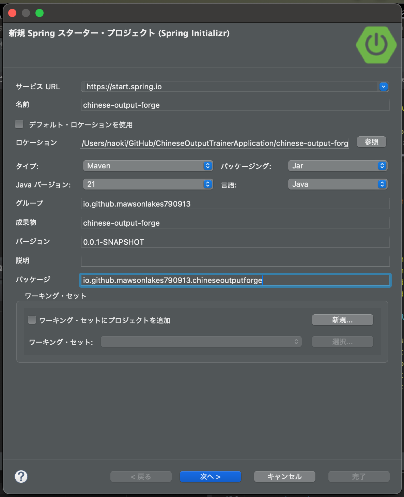
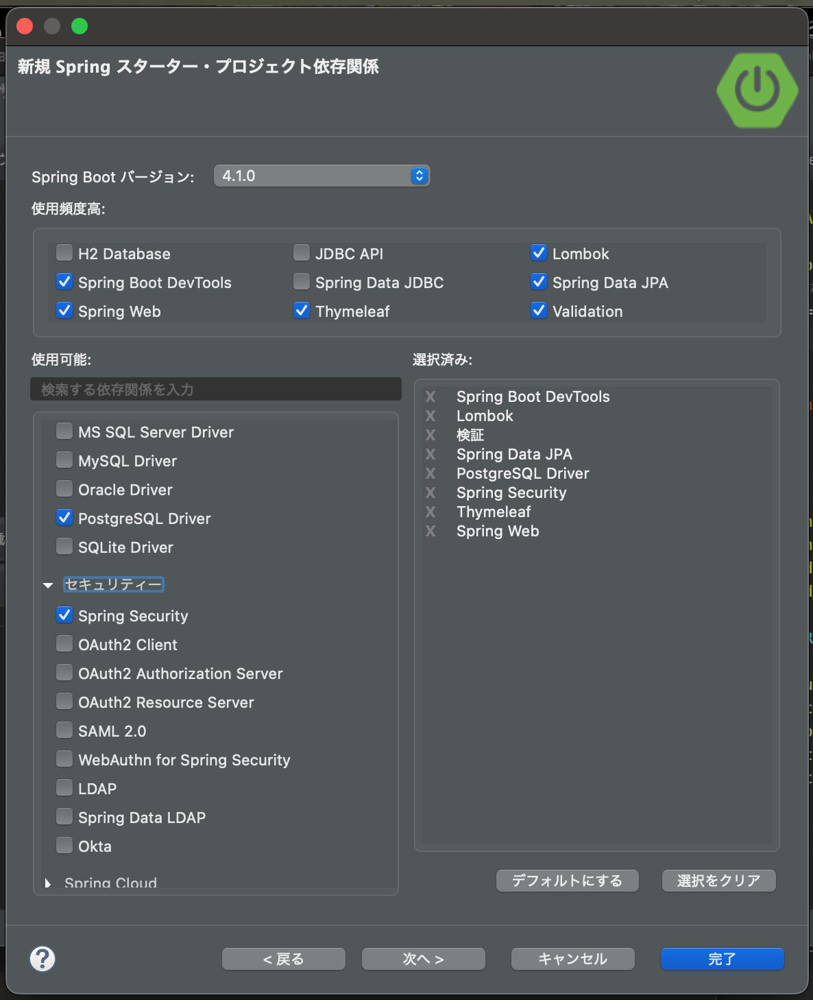

# 001 開発環境の構築

## 1. 新規スタータープロジェクトの作成

Spring Initializrを利用して、新規Spring Bootプロジェクトを作成する。

ロケーションを指定し、アプリケーションフォルダとして `chinese-output-forge` を作成する。



### 1.1 プロジェクトの初期設定

| 項目 | 設定値 |
| --- | --- |
| サービスURL | `https://start.spring.io` |
| 名前 | `chinese-output-forge` |
| ロケーション | `/Users/naoki/GitHub/ChineseOutputTrainerApplication/chinese-output-forge` |
| タイプ | Maven |
| パッケージング | Jar |
| Java | 21 |
| 言語 | Java |
| グループ | `io.github.mawsonlakes790913` |
| 成果物 | `chinese-output-forge` |
| バージョン | `0.0.1-SNAPSHOT` |
| パッケージ | `io.github.mawsonlakes790913.chineseoutputforge` |

### 1.2 アプリケーション名について

アプリケーション名を **Chinese Output Forge** とする。

`Forge` には「鍛える」「作り出す」という意味がある。

- 中国語のアウトプット力を反復によって鍛える
- AIによって新しい問題を生成する

という、このアプリケーションの2つの特徴を表現できることから、`Chinese Output Forge` と命名した。

---

## 2. 使用するフレームワーク・ライブラリ

スタータープロジェクト作成時に、以下の機能を追加する。

- Spring Boot DevTools
- Lombok
- Validation
- Spring Data JPA
- PostgreSQL Driver
- Spring Security
- Thymeleaf
- Spring Web



これらは過去にプロトタイプを開発した際にも使用したものであり、今回も基本的な構成を踏襲する。

今後、実装する機能や用途に応じて、以下のライブラリを追加する可能性がある。

| 追加候補 | 用途 |
| --- | --- |
| `modelmapper` | Entity ↔ DTOなどの変換 |
| `modelmapper-spring` | ModelMapperとSpringの連携 |
| `bootstrap` | 画面デザイン |
| `webjars-locator` | WebJarsのリソース参照 |
| `bootstrap-icons` | アイコンの利用 |
| `thymeleaf-layout-dialect` | Thymeleafの共通レイアウト |

---

## 3. Spring Boot 3.5.11への変更

Spring Initializrで生成したプロジェクトは、Spring Boot `4.1.0` 向けの構成となっていた。

今回はSpring Boot `3.5.11`を使用するため、`pom.xml`を3.5.11向けの構成へ修正する。

### 3.1 主な変更内容

- Spring Bootを`4.1.0`から`3.5.11`へ変更
- `spring-boot-starter-webmvc`を`spring-boot-starter-web`へ変更
- Spring Boot 4用の個別Test Starterを削除
- `spring-boot-starter-test`を追加
- Lombokを実行Jarから除外する設定を追加

修正後、Eclipse上で発生していたMaven関連のエラーが解消された。

以上で、アプリケーション開発を開始するための環境構築は完了とする。

---

## 4. 開発環境の構築を終えて

今回の環境構築は、学習時やプロトタイプ開発時とほぼ同じ方法を踏襲しているため、大きな問題なく完了した。

一方、開発を始めるにあたり、Spring Bootのバージョンについて以下の2つを検討した。

- 前回と同じ **3.5.11** を採用する
- 新しい **4.1.0** を採用する

Spring Boot 4.1.0では、一部の依存関係や実装方法が3.5.11と異なる可能性がある。また、現在使用しているEclipseではMaven関連のエラーが発生し、Eclipse自体の更新が必要になる可能性もあった。

今回は、新しいバージョンへの移行よりも、これまで学習した内容やEnglish Output Trainerでの実装経験をそのまま活用してアプリケーション開発を進めることを優先した。

そのため、**Spring Boot 3.5.11を採用することにした。**

---

## 5. 次にやること

開発環境の構築が完了したため、次は各画面で共通して使用する**共通レイアウトの作成**を行う。

---

## Commit

```bash
git commit -m "chore: set up development environment"