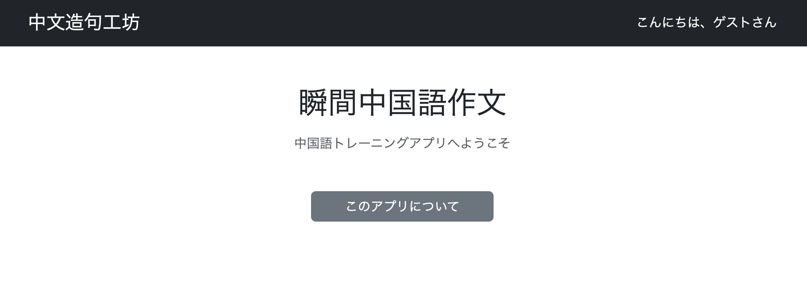
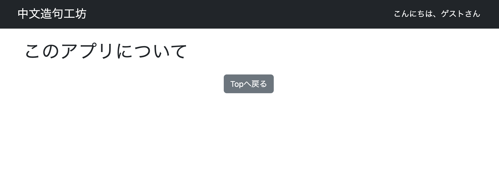

# 002 共通レイアウトの設計

各画面を作成する前に、Thymeleaf Layout Dialectを導入し、ヘッダーやコンテンツ領域などの共通レイアウトを作成する。

先に共通部分を定義しておくことで、各画面で同じHTMLを繰り返し記述する必要がなくなり、デザインや構造の統一、後からの修正・保守が容易になる。

# 1. 初期設定

## 1.1 Thymeleaf Layout Dialectの導入

共通レイアウトを実装するため、`pom.xml`にThymeleaf Layout Dialectを追加する。

```xml
<dependency>
    <groupId>nz.net.ultraq.thymeleaf</groupId>
    <artifactId>thymeleaf-layout-dialect</artifactId>
</dependency>
```

## 1.2 Bootstrapの導入

CSSの記述を最小限に抑えるため、Bootstrapを導入する。

`pom.xml`に以下を追加する。

```xml
<dependency>
    <groupId>org.webjars</groupId>
    <artifactId>bootstrap</artifactId>
    <version>5.3.3</version>
</dependency>

<dependency>
    <groupId>org.webjars</groupId>
    <artifactId>webjars-locator</artifactId>
    <version>0.52</version>
</dependency>
```

`bootstrap`はBootstrap本体である。

`webjars-locator`を使用することで、HTML側からWebJarsのリソースを参照する際にバージョン番号を省略できる。

例えば、

```html
/webjars/bootstrap/5.3.3/css/bootstrap.min.css
```

ではなく、

```html
/webjars/bootstrap/css/bootstrap.min.css
```

として参照できる。

## 1.3 application.propertiesからapplication.ymlへ変更

今後の設定ファイルにはYAML形式を使用するため、

```text
application.properties
```

を、

```text
application.yml
```

へ変更する。

## 1.4 DataSourceとSpring Securityの自動構成を一時的に無効化

001の環境構築では、今後使用する予定の以下の依存関係をあらかじめ`pom.xml`へ追加している。

- Spring Data JPA
- PostgreSQL Driver
- Spring Security

しかし、現在は共通レイアウトを作成している段階であり、DBや認証・認可の実装はまだ行わない。

この状態でもSpring Bootは依存関係を検出し、DataSourceやSpring SecurityのAuto-configuration（自動構成）を行う。

そのため、現段階では不要な自動構成を`application.yml`で一時的に除外する。

```yaml
spring:
  autoconfigure:
    exclude:
      - org.springframework.boot.autoconfigure.jdbc.DataSourceAutoConfiguration
      - org.springframework.boot.autoconfigure.security.servlet.SecurityAutoConfiguration
```

DBやSpring Securityの実装を開始する際に、対応する除外設定を削除する。

# 2. ファイル構成

共通レイアウトと暫定的なHome画面・About画面を作成する。

```text
chinese-output-forge
├── src/main/java
│   └── io.github.mawsonlakes790913.chineseoutputforge
│       └── controller
│           └── HomeController.java
│
└── src/main/resources
    ├── templates
    │   ├── layout
    │   │   ├── header.html
    │   │   └── layout.html
    │   ├── about.html
    │   └── home.html
    │
    └── application.yml
```

# 3. Home画面のControllerを作成

`HomeController.java`を作成する。

```java
@Controller
public class HomeController {

    @GetMapping("/")
    public String getHome() {
        return "home";
    }

    @GetMapping("/about")
    public String getTutorial() {
        return "about";
    }
}
```

現段階では、

```text
/
```

からHome画面、

```text
/about
```

からAbout画面を表示できるようにする。

# 4. 共通レイアウトの作成

## 4.1 layout.html

`templates/layout/layout.html`を作成する。

```html
<!DOCTYPE html>
<html xmlns:th="http://www.thymeleaf.org"
      xmlns:layout="http://www.ultraq.net.nz/thymeleaf/layout">

<head>
    <meta charset="UTF-8">
    <meta name="viewport"
          content="width=device-width, initial-scale=1, shrink-to-fit=no">

    <!-- 共通CSS読み込み -->
    <link rel="stylesheet"
          th:href="@{/webjars/bootstrap/css/bootstrap.min.css}">

    <!-- 共通JS読み込み -->
    <script th:src="@{/webjars/bootstrap/js/bootstrap.bundle.min.js}"
            defer></script>

    <title>Layout</title>
</head>

<body>

    <!-- ヘッダー -->
    <header layout:replace="~{layout/header :: header-contents}"></header>

    <!-- コンテンツ -->
    <main class="container mt-4">
        <div layout:fragment="content"></div>
    </main>

</body>
</html>
```

### 主な設定

1. `xmlns:layout`  
   Thymeleaf Layout Dialectを使用するための名前空間を定義する。

2. Bootstrap CSS  
   Bootstrapのスタイルを共通で利用するために読み込む。

3. Bootstrap JavaScript  
   BootstrapのJavaScript機能を使用できるようにする。現段階では使用しないが、今後のために共通レイアウトで読み込んでおく。

4. `layout:replace`  
   `header.html`の`header-contents`を共通ヘッダーとして読み込む。

5. `container mt-4`  
   コンテンツの横幅を調整して中央に配置し、上部に余白を設ける。

6. `layout:fragment="content"`  
   各画面のコンテンツを差し込む領域として使用する。

# 5. 共通ヘッダーの作成

## 5.1 header.html

`templates/layout/header.html`を作成する。

```html
<!DOCTYPE html>
<html xmlns:th="http://www.thymeleaf.org"
      xmlns:layout="http://www.ultraq.net.nz/thymeleaf/layout">

<head>
</head>

<body>

    <header layout:fragment="header-contents"
            class="bg-dark text-white py-3 mb-3">

        <div class="container d-flex justify-content-between align-items-center">

            <h1 class="h4 m-0">
                <a th:href="@{/}"
                   class="text-white text-decoration-none">
                    中文造句工坊
                </a>
            </h1>

            <div class="ms-auto d-flex gap-3 align-items-center">
                <span>
                    こんにちは、ゲストさん
                </span>
            </div>

        </div>

    </header>

</body>
</html>
```

`layout:fragment="header-contents"`を指定し、`layout.html`から読み込めるようにする。

```html
<div class="container d-flex justify-content-between align-items-center">
```

では、ヘッダー内の要素を横並びにし、左右に振り分け、縦位置を中央に揃えている。

現在表示している、

```text
こんにちは、ゲストさん
```

は暫定的なものである。

今後、認証機能を実装する際に以下のような要素を追加する予定である。

- ログインユーザー名
- ログインボタン
- ログアウトボタン
- ハンバーガーメニュー

# 6. Home画面の作成

## 6.1 home.html

`templates/home.html`を作成する。

```html
<html xmlns:th="http://www.thymeleaf.org"
      xmlns:layout="http://www.ultraq.net.nz/thymeleaf/layout"
      layout:decorate="~{layout/layout}">

<head>
    <meta charset="UTF-8">
    <title>中文造句工坊</title>

    <link rel="stylesheet"
          th:href="@{/webjars/bootstrap/css/bootstrap.min.css}">
</head>

<body>

    <div layout:fragment="content"
         class="container text-center mt-5">

        <h1 class="mb-3">瞬間中国語作文</h1>

        <p class="text-muted">
            中国語トレーニングアプリへようこそ
        </p>

        <div class="text-danger"
             th:if="${successMessage}"
             th:text="${successMessage}">
        </div>

        <div class="d-grid gap-3 col-md-3 mx-auto mt-5">

            <a th:href="@{/about}"
               class="btn btn-secondary">
                このアプリについて
            </a>

        </div>

    </div>

</body>
</html>
```

`layout:decorate`によって、このHTMLで使用するレイアウトを指定する。

```html
layout:decorate="~{layout/layout}"
```

また、

```html
layout:fragment="content"
```

を指定した部分が、`layout.html`の同じ`content`というキーを持つ領域へ組み込まれる。

# 7. About画面の作成

## 7.1 about.html

`templates/about.html`を作成する。

```html
<!DOCTYPE html>
<html xmlns:th="http://www.thymeleaf.org"
      xmlns:layout="http://www.ultraq.net.nz/thymeleaf/layout"
      layout:decorate="~{layout/layout}">

<head>
    <meta charset="UTF-8">
    <title>このアプリについて</title>

    <link rel="stylesheet"
          th:href="@{/webjars/bootstrap/css/bootstrap.min.css}">
</head>

<body>

<div layout:fragment="content">

    <div class="container mt-4 mb-5">

        <h1 class="mb-4">
            このアプリについて
        </h1>

        <div class="text-center">

            <a th:href="@{/}"
               class="btn btn-secondary">
                Topへ戻る
            </a>

        </div>

    </div>

</div>

</body>
</html>
```

About画面については、現段階では画面遷移と共通レイアウトの確認を目的としているため、内容は暫定的なものとする。

# 8. 実行確認

以下へアクセスする。

```text
http://localhost:8080/
```

ヘッダーを持つHome画面が正常に表示されることを確認した。



また、「このアプリについて」をクリックしてAbout画面へ遷移し、画面が変わっても共通ヘッダーが維持されることを確認した。



以上により、各画面から共通して利用できる基本レイアウトの作成が完了した。

# 9. 次にやること

学習ページの実装を開始する。

まずは、問題を10問程度出題できる基本的な学習機能を実装する。