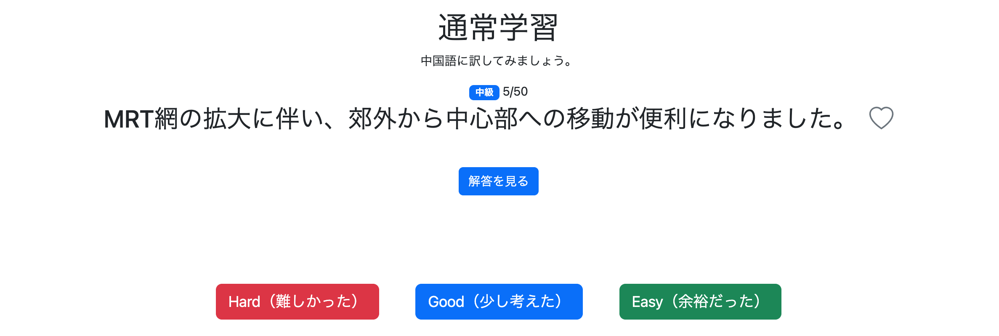
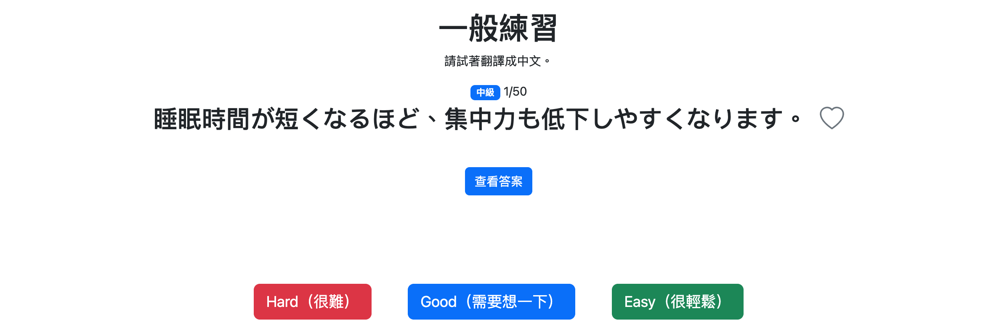
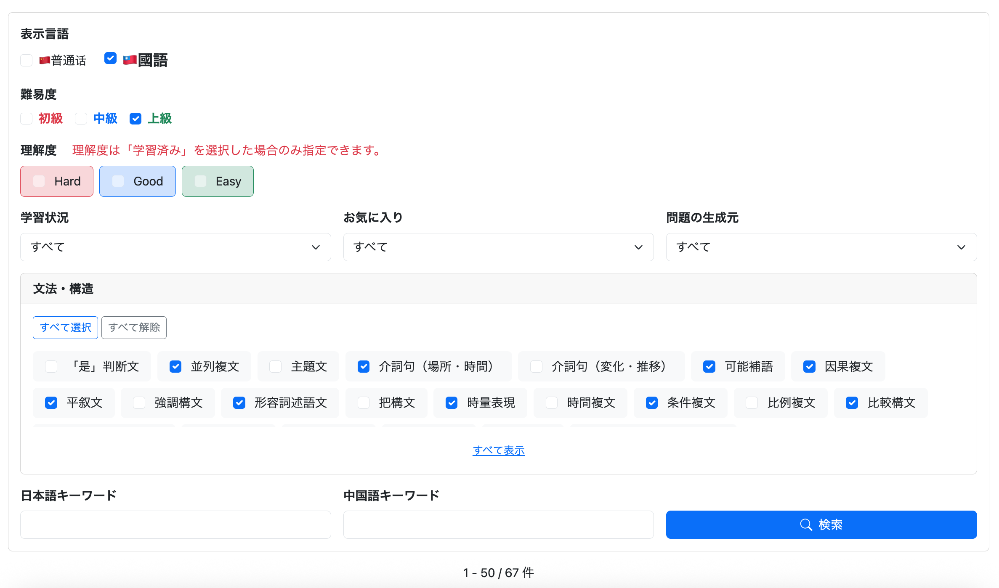
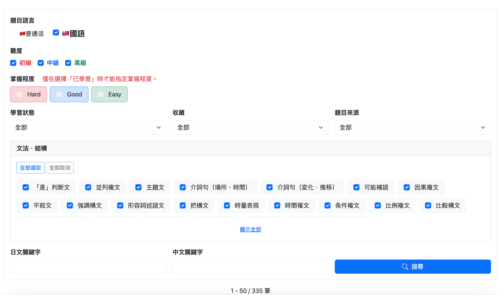
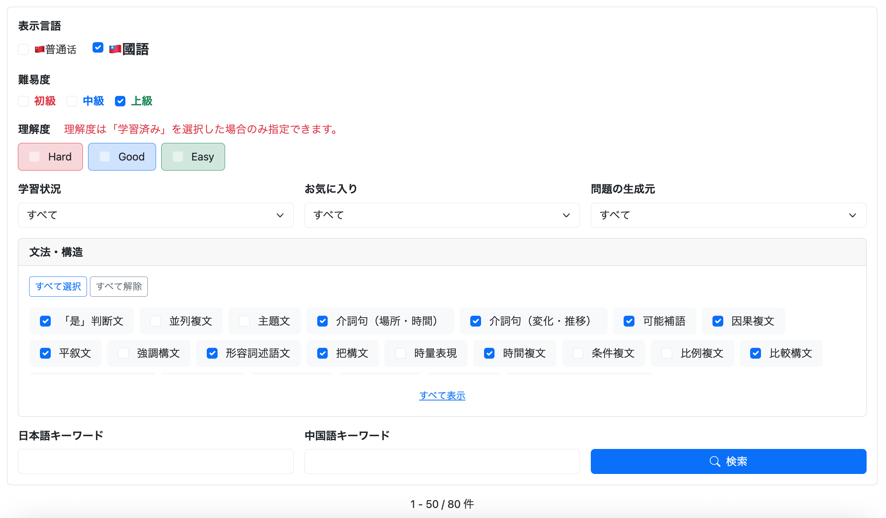
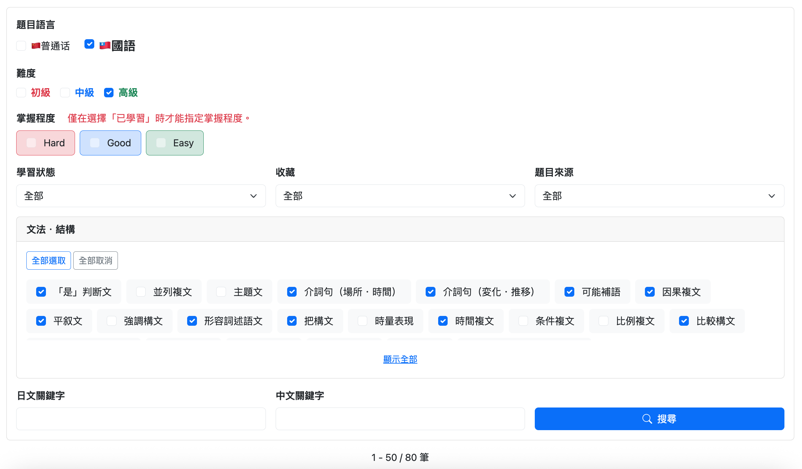
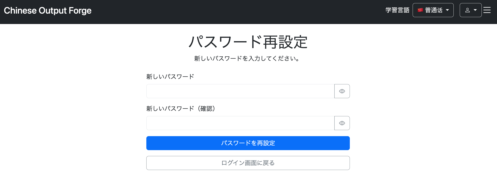
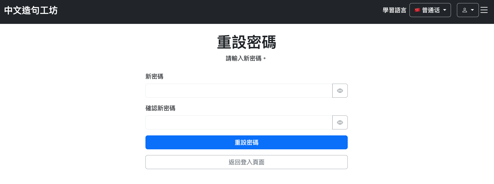

# 003 言語設定機能の実装

ここでは、以下の2種類の言語設定機能を実装する。

* **サイト表示言語**

  * サイト上の説明文やボタン、メニューなどに表示する言語を設定する。
* **学習対象言語**

  * 実際に学習する中国語を、大陸普通話または台湾華語（國語）から設定する。

```text
003 言語設定機能の実装
    ├─ サイト表示言語
    │   ├─ 日本語
    │   ├─ English
    │   ├─ 简体中文
    │   └─ 繁體中文
    │
    └─ 学習対象言語
        ├─ MAINLAND
        └─ TAIWAN
```

---

# 1. サイト表示言語設定

```bash
git commit -m "feat: add multilingual display language switching"
```

## 1.1 使用するフォルダ・ファイル

```text
src/main/java/
└── io.github.mawsonlakes790913.chineseoutputforge/
    └── config/
        └── LocaleConfig.java          ← 新規作成

src/main/resources/
├── messages.properties               ← 新規作成（デフォルト・日本語）
├── messages_en.properties            ← 新規作成
├── messages_zh_CN.properties         ← 新規作成
└── messages_zh_TW.properties         ← 新規作成
```

HTMLに直接記述していた固定文言を、言語ごとのプロパティファイルから読み込むように変更する。

---

# 2. デフォルトメッセージの作成

## 2.1 messages.properties

デフォルトの表示言語を日本語とする。

```properties
# home.html
home.title=瞬間中国語作文
home.welcome=中国語トレーニングアプリへようこそ
home.about=このアプリについて

# about.html
about.title=このアプリについて
about.backToTop=Topへ戻る

# header.html
header.greeting.guest=こんにちは、ゲストさん
```

`中文造句工坊` はブランド名として全言語共通にするため、propertiesには移さない。

## 2.2 home.html

```html
<h1 class="mb-3"
    th:text="#{home.title}">
    瞬間中国語作文
</h1>

<p class="text-muted"
   th:text="#{home.welcome}">
    中国語トレーニングアプリへようこそ
</p>

<div class="d-grid gap-3 col-md-3 mx-auto mt-5">

    <a th:href="@{/about}"
       class="btn btn-secondary"
       th:text="#{home.about}">
        このアプリについて
    </a>

</div>
```

```html
th:text="#{キー名}"
```

によって、`messages.properties` 内の対応するメッセージを取得する。

`about.html`、`header.html`についても同様に変更する。

---

# 3. 多言語メッセージの作成

## 3.1 messages_en.properties

```properties
# home.html
home.title=Instant Chinese Sentence Production
home.welcome=Welcome to the Chinese Training App
home.about=About This App

# about.html
about.title=About This App
about.backToTop=Back to Top

# header.html
header.greeting.guest=Hello, Guest
```

## 3.2 messages_zh_CN.properties

```properties
# home.html
home.title=中文快速造句
home.welcome=欢迎来到中文练习App
home.about=关于本App

# about.html
about.title=关于本App
about.backToTop=返回首页

# header.html
header.greeting.guest=你好，Guest
```

## 3.3 messages_zh_TW.properties

```properties
# home.html
home.title=中文快速造句
home.welcome=歡迎來到中文練習App
home.about=關於本App

# about.html
about.title=關於本App
about.backToTop=返回首頁

# header.html
header.greeting.guest=你好，Guest
```

---

# 4. Localeによる表示言語の切り替え

Localeを使用して、4つの `messages*.properties` を切り替える。

| 表示言語    | Locale  | 読み込まれるファイル                  |
| ------- | ------- | --------------------------- |
| 日本語     | `ja`    | `messages.properties`       |
| English | `en`    | `messages_en.properties`    |
| 简体中文    | `zh_CN` | `messages_zh_CN.properties` |
| 繁體中文    | `zh_TW` | `messages_zh_TW.properties` |

以下の仕組みを使用する。

* `SessionLocaleResolver`

  * 現在のLocaleをSessionに保持する。
* `LocaleChangeInterceptor`

  * `?lang=en` などのリクエストパラメータを検知してLocaleを変更する。

処理の流れは以下となる。

```text
ユーザー
  ↓
表示言語を選択
  ↓
?lang=zh_TW
  ↓
LocaleChangeInterceptor
  ↓
Localeを zh_TW に変更
  ↓
SessionLocaleResolver
  ↓
LocaleをSessionに保持
  ↓
messages_zh_TW.properties
  ↓
Thymeleafの #{...} が繁體中文になる
```

---

# 5. LocaleConfigの実装

## 5.1 LocaleConfig.java

```java
@Configuration
public class LocaleConfig implements WebMvcConfigurer {

    @Bean
    LocaleResolver localeResolver() {

        SessionLocaleResolver resolver = new SessionLocaleResolver();

        // デフォルトは日本語
        resolver.setDefaultLocale(Locale.JAPANESE);

        return resolver;
    }

    @Bean
    LocaleChangeInterceptor localeChangeInterceptor() {

        LocaleChangeInterceptor interceptor =
                new LocaleChangeInterceptor();

        // ?lang=ja などの lang を監視
        interceptor.setParamName("lang");

        return interceptor;
    }

    @Override
    public void addInterceptors(InterceptorRegistry registry) {
        registry.addInterceptor(localeChangeInterceptor());
    }
}
```

`localeResolver()` では `SessionLocaleResolver` を使用し、デフォルトLocaleを日本語に設定する。

```java
resolver.setDefaultLocale(Locale.JAPANESE);
```

`localeChangeInterceptor()` では、表示言語変更用のリクエストパラメータを `lang` とする。

```java
interceptor.setParamName("lang");
```

例えば、

```text
?lang=en
```

というリクエストが送信されると、Localeが英語へ変更される。

作成した `LocaleChangeInterceptor` は以下でSpring MVCへ登録する。

```java
@Override
public void addInterceptors(InterceptorRegistry registry) {
    registry.addInterceptor(localeChangeInterceptor());
}
```

---

# 6. 表示言語切り替えUIの実装

当初は `header.html` に表示言語切り替え用のドロップダウンを配置した。

```html
<div class="dropdown">

    <button class="btn btn-outline-light dropdown-toggle"
            type="button"
            data-bs-toggle="dropdown"
            aria-expanded="false">

        <span th:if="${#locale.language == 'ja'}">日本語</span>
        <span th:if="${#locale.language == 'en'}">English</span>
        <span th:if="${#locale.toString() == 'zh_CN'}">简体中文</span>
        <span th:if="${#locale.toString() == 'zh_TW'}">繁體中文</span>
    </button>

    <ul class="dropdown-menu dropdown-menu-end">

        <li>
            <a class="dropdown-item"
               th:href="@{?lang=ja}">
                日本語
            </a>
        </li>

        <li>
            <a class="dropdown-item"
               th:href="@{?lang=en}">
                English
            </a>
        </li>

        <li>
            <a class="dropdown-item"
               th:href="@{?lang=zh_CN}">
                简体中文
            </a>
        </li>

        <li>
            <a class="dropdown-item"
               th:href="@{?lang=zh_TW}">
                繁體中文
            </a>
        </li>

    </ul>
</div>
```

現在のLocaleによって、ドロップダウンの表示も変更する。

日本語と英語は、

```text
#locale.language
```

中国語の簡体字・繁体字については、

```text
#locale.toString()
```

を使用して `zh_CN` / `zh_TW` を判定する。

---

# 7. 表示言語の実行確認

以下のURLから表示言語を切り替えられることを確認した。

```text
http://localhost:8080/?lang=en
→ English

http://localhost:8080/?lang=zh_CN
→ 简体中文

http://localhost:8080/?lang=zh_TW
→ 繁體中文
```


日本語Localeについては、システムLocaleへのフォールバックを無効化するため `application.yml` に以下を追加した。

```yaml
spring:
  messages:
    fallback-to-system-locale: false
```

設定後、

```text
http://localhost:8080/?lang=ja
```

で日本語表示を確認した。


---

# 8. 学習対象言語設定

```bash
git commit -m "feat: add study language switching"
```

学習対象言語として以下の2種類を扱う。

```text
MAINLAND → 大陸普通話
TAIWAN   → 台湾華語（國語）
```

選択した学習対象言語はSessionへ保存する。

```text
?languageVariant=MAINLAND
    ↓
LanguageVariant.MAINLAND
    ↓
Sessionに保存
```

---

# 9. 学習対象言語のファイル構成

```text
src/main/java/
└── io.github.mawsonlakes790913.chineseoutputforge/
    ├── controller/
    │   └── LanguageVariantController.java
    │
    └── constant/
        └── LanguageVariant.java

src/main/resources/
└── static/
    └── js/
        └── header.js
```

---

# 10. LanguageVariantの実装

## 10.1 LanguageVariant.java

```java
public enum LanguageVariant {
    MAINLAND,
    TAIWAN
}
```

学習対象言語をEnumとして管理する。

```text
MAINLAND → 大陸普通話
TAIWAN   → 台湾華語（國語）
```

---

# 11. LanguageVariantControllerの実装

```java
@Controller
public class LanguageVariantController {

    @GetMapping("/language-variant")
    public String changeLanguageVariant(
            @RequestParam LanguageVariant languageVariant,
            HttpSession session) {

        LanguageVariant current =
                (LanguageVariant) session.getAttribute("languageVariant");

        // 同じ言語なら変更処理をしない
        if (languageVariant == current) {
            return "redirect:/";
        }

        // 学習対象言語をSessionに保存
        session.setAttribute("languageVariant", languageVariant);

        return "redirect:/";
    }
}
```

例えば、

```text
/language-variant?languageVariant=MAINLAND
```

へアクセスすると、

```java
@RequestParam LanguageVariant languageVariant
```

によって `languageVariant` パラメータを `LanguageVariant` 型として受け取る。

選択された値は、

```java
session.setAttribute("languageVariant", languageVariant);
```

によってSessionへ保存する。

学習対象言語を変更した後はHome画面へ戻す。

---

# 12. 学習対象言語の切り替えUI

`header.html` に学習対象言語のドロップダウンを追加する。

```html
<div class="d-flex align-items-center gap-2">

    <span th:text="#{header.studyLanguage}">
        学習言語
    </span>

    <div class="dropdown">

        <button class="btn btn-outline-light dropdown-toggle"
                type="button"
                data-bs-toggle="dropdown"
                aria-expanded="false">

            <span th:if="${session.languageVariant == null
                         || session.languageVariant.name() == 'MAINLAND'}">
                🇨🇳 普通话
            </span>

            <span th:if="${session.languageVariant != null
                         && session.languageVariant.name() == 'TAIWAN'}">
                🇹🇼 國語
            </span>

        </button>

        <ul class="dropdown-menu dropdown-menu-end">

            <!-- MAINLAND -->
            <li>

                <span th:if="${session.languageVariant == null
                             || session.languageVariant.name() == 'MAINLAND'}"
                      class="dropdown-item disabled">
                    ✓ 🇨🇳 普通话
                </span>

                <a th:if="${session.languageVariant != null
                          && session.languageVariant.name() != 'MAINLAND'}"
                   class="dropdown-item language-variant-link"
                   th:href="@{/language-variant(languageVariant='MAINLAND')}"
                   th:data-confirm-message="#{header.studyLanguage.confirmMainland}">
                    🇨🇳 普通话
                </a>

            </li>

            <!-- TAIWAN -->
            <li>

                <span th:if="${session.languageVariant != null
                             && session.languageVariant.name() == 'TAIWAN'}"
                      class="dropdown-item disabled">
                    ✓ 🇹🇼 國語
                </span>

                <a th:if="${session.languageVariant == null
                          || session.languageVariant.name() != 'TAIWAN'}"
                   class="dropdown-item language-variant-link"
                   th:href="@{/language-variant(languageVariant='TAIWAN')}"
                   th:data-confirm-message="#{header.studyLanguage.confirmTaiwan}">
                    🇹🇼 國語
                </a>

            </li>

        </ul>

    </div>
</div>
```

現在選択中の言語には `✓` を表示し、選択できない状態にする。

---

# 13. 学習言語変更時の確認ダイアログ

学習対象言語を変更する際に確認ダイアログを表示する。

HTML側では確認メッセージを `data-confirm-message` に設定し、JavaScript側で処理する。

## 13.1 layout.html

```html
<script th:src="@{/js/header.js}"></script>
```

## 13.2 header.js

```javascript
document.querySelectorAll('.language-variant-link').forEach(link => {
    link.addEventListener('click', function(event) {

        const message = this.dataset.confirmMessage;

        if (!confirm(message)) {
            event.preventDefault();
        }
    });
});
```

`.language-variant-link` を持つリンクがクリックされたとき、

```javascript
this.dataset.confirmMessage
```

から確認メッセージを取得する。

キャンセルされた場合は、

```javascript
event.preventDefault();
```

によってリンク遷移を中止する。

---

# 14. 学習言語変更メッセージの多言語化

## 14.1 messages.properties

```properties
header.studyLanguage=学習言語
header.studyLanguage.confirmMainland=学習言語を普通話に切り替えますか？\n切り替えると、現在のトレーニングは終了し、ホーム画面に戻ります。
header.studyLanguage.confirmTaiwan=学習言語を國語に切り替えますか？\n切り替えると、現在のトレーニングは終了し、ホーム画面に戻ります。
```

## 14.2 messages_en.properties

```properties
header.studyLanguage=Study Language
header.studyLanguage.confirmMainland=Switch the study language to Mandarin?\nYour current training session will end, and you will return to the Home page.
header.studyLanguage.confirmTaiwan=Switch the study language to Taiwanese Mandarin?\nYour current training session will end, and you will return to the Home page.
```

## 14.3 messages_zh_CN.properties

```properties
header.studyLanguage=学习语言
header.studyLanguage.confirmMainland=要将学习语言切换为普通话吗？\n切换后，当前训练将结束，并返回首页。
header.studyLanguage.confirmTaiwan=要将学习语言切换为国语吗？\n切换后，当前训练将结束，并返回首页。
```

## 14.4 messages_zh_TW.properties

```properties
header.studyLanguage=學習語言
header.studyLanguage.confirmMainland=要將學習語言切換為普通話嗎？\n切換後，目前的練習將結束，並返回首頁。
header.studyLanguage.confirmTaiwan=要將學習語言切換為國語嗎？\n切換後，目前的練習將結束，並返回首頁。
```

## 14.5 実行確認

学習対象言語を正常に切り替えられることを確認した。

### 普通話


### 國語


---

# 15. ヘッダーのUI修正

```bash
git commit -m "refactor: reorganize header UI"
```

表示言語・学習対象言語の実装後、ヘッダーを以下の構成へ整理する。

```text
中文造句工坊    学習言語 🇹🇼 國語 ▼    👤    ☰
```

変更内容は以下。

* 学習対象言語はヘッダー上に表示
* 表示言語はハンバーガーメニューへ移動
* 「こんにちは、ゲストさん」をユーザーアイコンへ変更
* ハンバーガーメニューを追加

現時点ではログイン機能やユーザーDBを実装していないため、ユーザーアイコンはUIのみ実装する。

---

# 16. Bootstrap Iconsの導入

## 16.1 pom.xml

```xml
<dependency>
    <groupId>org.webjars.npm</groupId>
    <artifactId>bootstrap-icons</artifactId>
    <version>1.11.3</version>
</dependency>
```

## 16.2 layout.html

Bootstrap IconsのCSSを読み込む。

```html
<!-- Bootstrap Icons -->
<link rel="stylesheet"
      th:href="@{/webjars/bootstrap-icons/font/bootstrap-icons.css}">
```

---

# 17. ユーザーアイコンの追加

これまで表示していた、

```text
こんにちは、ゲストさん
```

を削除し、ユーザーアイコンへ置き換える。

```html
<!-- ユーザーアイコン -->
<button type="button"
        class="btn p-0 text-white border-0"
        aria-label="ユーザー">
    <i class="bi bi-person-circle fs-4"></i>
</button>
```

現時点ではユーザーアイコン自体の機能は実装しない。

---

# 18. 表示言語切り替えをハンバーガーメニューへ移動

表示言語切り替えをヘッダー上のドロップダウンからハンバーガーメニュー内へ移動する。

ハンバーガーメニューには現時点で、

* このアプリについて
* 表示言語切り替え

を配置する。

```html
<!-- ハンバーガーアイコン -->
<div class="dropdown">

    <button type="button"
            class="btn p-0 text-white border-0"
            data-bs-toggle="dropdown"
            aria-expanded="false"
            aria-label="メニュー">
        <i class="bi bi-list fs-3"></i>
    </button>

    <ul class="dropdown-menu dropdown-menu-end">

        <li>
            <a class="dropdown-item"
               th:href="@{/about}"
               th:text="#{home.about}">
                このアプリについて
            </a>
        </li>

        <li>
            <hr class="dropdown-divider">
        </li>

        <li>
            <span class="dropdown-header">
                表示言語
            </span>
        </li>

        <li>
            <a class="dropdown-item"
               th:href="@{?lang=ja}">
                <span th:if="${#locale.language == 'ja'}">✓ </span>
                日本語
            </a>
        </li>

        <li>
            <a class="dropdown-item"
               th:href="@{?lang=en}">
                <span th:if="${#locale.language == 'en'}">✓ </span>
                English
            </a>
        </li>

        <li>
            <a class="dropdown-item"
               th:href="@{?lang=zh_CN}">
                <span th:if="${#locale.toString() == 'zh_CN'}">✓ </span>
                简体中文
            </a>
        </li>

        <li>
            <a class="dropdown-item"
               th:href="@{?lang=zh_TW}">
                <span th:if="${#locale.toString() == 'zh_TW'}">✓ </span>
                繁體中文
            </a>
        </li>

    </ul>
</div>
```

現在選択されている表示言語には `✓` を表示する。

---

# 19. ヘッダーUI修正後の実行確認

`http://localhost:8080/` にアクセスし、修正後のヘッダーを確認した。


現在のヘッダーは以下の構成となる。

```text
中文造句工坊       学習言語 🇹🇼 國語 ▼       👤    ☰
```

```text
中文造句工坊
    ↓
Home

学習言語
    ↓
MAINLAND / TAIWAN の切り替え

👤
    ↓
ユーザー関連機能用

☰
    ├─ このアプリについて
    └─ 表示言語
        ├─ 日本語
        ├─ English
        ├─ 简体中文
        └─ 繁體中文
```

---

# 追加修正(9月19日) - 表示言語切り替え時のクエリパラメータ維持

```text
git commit -m "fix: preserve query parameters when switching display language"
```

チャプター003で表示言語切り替え機能を実装した時点では、表示言語のリンクを以下のように設定していた。

```html
th:href="@{?lang=ja}"
```

当時実装済みだったページでは、この方法でも問題なく表示言語を切り替えることができた。

しかし、その後アプリケーションの機能を追加し、検索条件やページ番号、トークンなどをクエリパラメータとして使用するページが増えたことで、表示言語切り替え時に問題が発生するようになった。

## 不具合の発生例

### 問題ページ

#### 表示言語変更前

5問目を表示している。



#### 表示言語変更後

表示言語を変更すると、ページ番号を表すクエリパラメータが失われ、1問目に戻ってしまう。



### 問題一覧ページ

#### 表示言語変更前

検索条件を指定した結果、67件の問題が表示されている。



#### 表示言語変更後

表示言語を変更すると、検索条件を表すクエリパラメータが失われ、検索条件が初期化されて全件表示に戻ってしまう。


## 問題点

チャプター003の実装後に追加した以下のページで、表示言語を切り替えると不具合が発生した。

- 通常学習モードのメニューページおよび問題ページ
- 復習モードのメニューページおよび問題ページ
- AI生成モードのメニューページおよび問題ページ
- 問題一覧ページ
- パスワードリセット関連のページ群

具体的には、学習モードや問題一覧ページでは、表示言語を切り替えると画面上で指定していた検索条件などがリセットされたり、複数ページある問題一覧で1ページ目に戻ったりする。

また、パスワードリセット関連のページでは、表示言語を切り替えることで必要なパラメータが失われ、`400 Bad Request`が発生する。

## 原因

原因は、`header.html`の表示言語切り替えリンクを以下のように実装していたことにある。

```html
th:href="@{?lang=ja}"
```

この書き方では、現在のURLに設定されているクエリパラメータを引き継がず、`lang`だけを指定したURLが生成される。

例えば、現在のURLが、

```text
/review/question?page=5&difficulty=HARD
```

だった場合に日本語へ切り替えると、

```text
/review/question?lang=ja
```

となり、`page=5`や`difficulty=HARD`が失われる。

そのため、検索条件やページ番号をクエリパラメータで管理しているページでは、表示言語を切り替えた際に条件がリセットされたり、1ページ目へ戻ったりしていた。

また、パスワードリセット画面では、URLに含まれる`token`がパスワードリセット対象を識別するために必要となる。

```text
/reset-password?token=xxxxxxxx
```

この状態で表示言語を切り替えると、

```text
/reset-password?lang=ja
```

となって`token`が失われる。

その結果、必須の`token`を取得できなくなり、`400 Bad Request`が発生していた。

つまり、表示言語切り替え機能そのものではなく、**表示言語切り替え時に現在のクエリパラメータを維持していなかったこと**が原因だった。

## 修正案

表示言語を切り替える際に、現在のURLに含まれているクエリパラメータを維持したまま、`lang`だけを追加・変更するように修正する。

例えば、

```text
/review/question?page=5&difficulty=HARD
```

で日本語へ切り替えた場合は、

```text
/review/question?page=5&difficulty=HARD&lang=ja
```

となるようにする。

同様にパスワードリセット画面でも、

```text
/reset-password?token=xxxxxxxx
```

から表示言語を切り替えた場合、

```text
/reset-password?token=xxxxxxxx&lang=ja
```

として`token`を維持する。

ただし、

問題一覧ページでは、

```text
?page=5&difficulty=HARD
```

パスワードリセット画面では、

```text
?token=xxxxxxxx
```

のように、それぞれ異なるパラメータを使用しているので、`header.html`で、

```html
page=...
difficulty=...
token=...
```

のように、必要なパラメータを一つずつ指定して表示言語切り替え用のURLを作る方法では、ページごとにどのパラメータが必要なのかを考慮しなければならない。

さらに、今後新しい検索条件などを追加した場合、そのたびに`header.html`側も修正する必要がある。

そこで、`header.html`で表示言語切り替え用のリンクを生成する際に、特定のパラメータを一つずつ指定するのではなく、**現在のリクエストが持っているクエリパラメータをまとめて引き継ぎ、`lang`だけを追加・変更する**方法にする。

例えば、

```text
/review/question?page=5&difficulty=HARD
```

であれば、

```text
page=5
difficulty=HARD
```

をそのまま維持し、

```text
lang=ja
```

だけを追加して、

```text
/review/question?page=5&difficulty=HARD&lang=ja
```

とする。

これによって、ページごとに使用しているクエリパラメータの種類を`header.html`側で意識する必要がなくなる。

## 修正対象

今回の不具合は、`header.html`の表示言語切り替えリンクで現在のクエリパラメータを引き継いでいないことが原因である。

そのため、基本的には**`header.html`側の修正だけで対応できる**。

先ほども言ったように、現在の、

```html
th:href="@{?lang=ja}"
```

のような`lang`だけを指定している設定を、**現在のリクエストが持っているクエリパラメータを引き継ぎ、`lang`だけを追加・変更する**ように修正する。

```text
修正前

/review/question?page=5&difficulty=HARD
        ↓ 表示言語を変更
/review/question?lang=ja
```

```text
修正後

/review/question?page=5&difficulty=HARD
        ↓ 表示言語を変更
/review/question?page=5&difficulty=HARD&lang=ja
```

### 各ControllerでSessionへ保存する必要はない

`page`や検索条件、`token`などは、すでに現在のURLにクエリパラメータとして含まれており、現在のHTTPリクエストから取得できる。

そのため、各Controllerで、

```java
session.setAttribute(...);
```

を使用してクエリパラメータを一度Sessionへ退避し、表示言語切り替え後に復元する処理を追加する必要はない。

今回必要なのは、**現在のリクエストにすでに存在しているクエリパラメータを、`header.html`の表示言語切り替えリンクでも失わないようにすること**である。

これにより、各Controllerに表示言語切り替え専用のSession管理処理を追加せず、共通の`header.html`側だけで対応できる。

## 実装

現在のコード(日本語)

```html
<li>
    <a class="dropdown-item"
       th:href="@{?lang=ja}">
        <span th:if="${#locale.language == 'ja'}">✓ </span>日本語
    </a>
</li>
```

ここを、現在のクエリパラメータを全部引き継いだURLを作る形に変更する。

### Thymeleafだけではきれいなコードではない

Thymeleafでは現在のリクエストパラメータを${param}で取得できる。

```html
<a th:href="@{/review/question(
        page=${param.page},
        difficulty=${param.difficulty},
        lang='ja'
    )}">
    日本語
</a>
```

ただし、見てもわかるようにth:hrefだけで対応する場合、現在のクエリパラメータをすべて維持しながらlangだけを変更するには、引き継ぐパラメータを個別に指定する必要がある。

確かに上記のコードは、

/review/question?page=5&difficulty=HARD

なら、

/review/question?page=5&difficulty=HARD&lang=ja

を作れる。

しかし別ページが、

/practice/question?page=3&structureIds=1&structureIds=5&favoriteCondition=FAVORITED

なら、そのページ用に、

```html
<a th:href="@{/practice/question(
        page=${param.page},
        structureIds=${param.structureIds},
        favoriteCondition=${param.favoriteCondition},
        lang='ja'
    )}">
    日本語
</a>
```
のように必要なパラメータを列挙することになる。

さらにパスワードリセットでは、

```html
<a th:href="@{/reset-password(
        token=${param.token},
        lang='ja'
    )}">
    日本語
</a>
```

となる。

つまり問題は、共通のheader.htmlなのに、

このページでは page
このページでは difficulty
このページでは structureIds
このページでは favoriteCondition
このページでは token
...

と、各ページが使用するクエリパラメータをheader側が知る必要が出てくることである。

なので今回はリンククリック時にJavaScriptで現在のURLのlangだけを書き換える方法がシンプルである。

### JavaScript

現在のURLを丸ごと取得
        ↓
既存のクエリパラメータはそのまま
        ↓
langだけ追加・変更

するメソッドを作成する。

`header.html`の各表示言語切り替えリンクには、切り替え先の言語を`data-lang`属性として設定する。

リンクがクリックされたらJavaScriptで`data-lang`の値を取得し、現在のURLの`lang`だけを追加・変更したURLへ遷移する。

### /layout/header.html

変更前

```html
<li>
    <a class="dropdown-item"
       th:href="@{?lang=ja}">
        <span th:if="${#locale.language == 'ja'}">✓ </span>日本語
    </a>
</li>
```

変更後

```html
<li>
    <a class="dropdown-item display-language-link"
       href="#"
       data-lang="ja">
        <span th:if="${#locale.language == 'ja'}">✓ </span>日本語
    </a>
</li>
```

`th:href`によるURLの生成をやめ、`display-language-link`クラスを追加する。

また、`data-lang`属性に切り替え先の言語を設定する。

他の表示言語についても同様に、

```html
data-lang="en"
data-lang="zh_CN"
data-lang="zh_TW"
```

を設定する。

### /layout/header.js

```JavaScript
document.querySelectorAll(".display-language-link").forEach(link => {

    link.addEventListener("click", function(event) {

        event.preventDefault();

        // 現在のURLを取得
        const url = new URL(window.location.href);

        // langを追加・変更
        url.searchParams.set("lang", this.dataset.lang);

        // 変更後のURLへ遷移
        window.location.href = url.toString();
    });
});
```

`document.querySelectorAll()`で、`display-language-link`クラスを持つすべての表示言語切り替えリンクを取得する。

リンクがクリックされたら、`new URL(window.location.href)`によって現在のURL全体を取得する。

```JavaScript
const url = new URL(window.location.href);
```

この時点では、現在のURLに含まれているクエリパラメータもそのまま保持されている。

次に、

```JavaScript
url.searchParams.set("lang", this.dataset.lang);
```

によって、クリックされたリンクの`data-lang`から切り替え先の言語を取得し、`lang`を追加・変更する。

`set()`を使用するため、すでに`lang`が存在する場合は値を変更し、存在しない場合は新しく追加される。

最後に、

```JavaScript
window.location.href = url.toString();
```

で変更後のURLへ遷移する。

これにより、

```text
/review/question?page=5&difficulty=HARD
```

で表示言語を日本語へ切り替えた場合、

```text
/review/question?page=5&difficulty=HARD&lang=ja
```

となり、既存のクエリパラメータを維持したまま表示言語を変更できる。

### layout.html

共通の`layout.html`で`header.js`を読み込む。

`defer`を指定することで、HTMLの解析が完了した後にJavaScriptを実行し、`header.html`の表示言語切り替えリンクにクリックイベントを設定できるようにする。

```html
<script th:src="@{/js/layout/header.js}" defer></script>
```

## 実行

修正後、これまで表示言語を変更するとクエリパラメータが失われていたページで動作確認を行う。

### 問題画面

#### 表示言語変更前

5問目を表示している状態で、日本語から繁體中文へ表示言語を切り替える。


#### 表示言語変更後

繁體中文へ切り替えても5問目のままとなり、ページ番号が維持されている。


### 問題一覧ページ

#### 表示言語変更前

検索条件を指定した結果、80件の問題が表示されている。



#### 表示言語変更後

表示言語を切り替えても80件のままとなり、指定していた検索条件が引き継がれている。



### パスワードリセットページ群

#### 表示言語変更前

パスワードリセット用の`token`を含むURLでページを表示する。



#### 表示言語変更後

表示言語を切り替えても`token`が維持され、`400 Bad Request`が発生せず正常にページを表示できる。



## @ResponseBodyで取得した件数などはやはり初期化される

今回の修正によって、URLに含まれているクエリパラメータは表示言語を切り替えても維持できるようになった。

一方、`@ResponseBody`を使用して取得している問題数など、**URLのクエリパラメータとして保持されていない画面上の状態については、表示言語を切り替えると初期化される**。

今回のJavaScriptで維持しているのは、あくまで現在のURLに含まれている情報である。

```JavaScript
const url = new URL(window.location.href);

url.searchParams.set("lang", this.dataset.lang);
```

そのため、JavaScriptによって画面上で選択した条件をControllerへ送信し、`@ResponseBody`で結果だけを取得している場合、その状態が現在のURLに含まれていなければ引き継ぐことはできない。

これらの状態まで維持する場合は、URLへの反映やSessionなどを利用した別の状態管理が必要になる。

今回は、**表示言語切り替え時に現在のURLのクエリパラメータが失われる問題の修正**を目的としているため、`@ResponseBody`で取得した件数などの維持については修正対象外とする。

---

# 20. 次にやること

**学習モードの実装**

今回作成した学習対象言語設定を利用し、実際の問題データや学習処理を実装していく。
