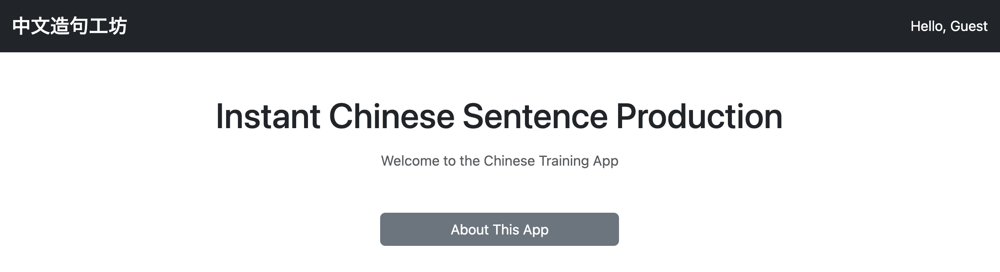
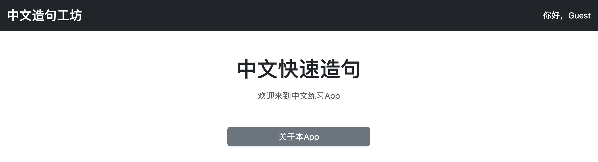
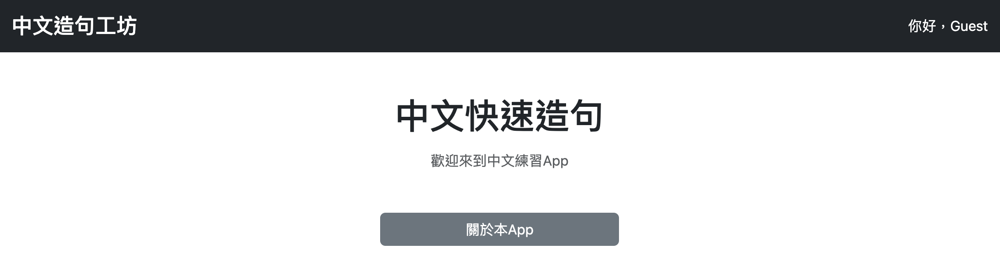
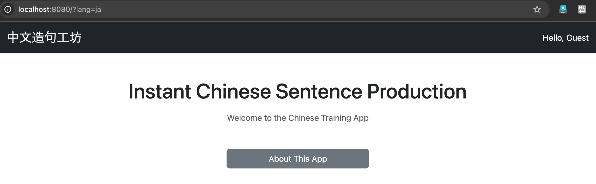
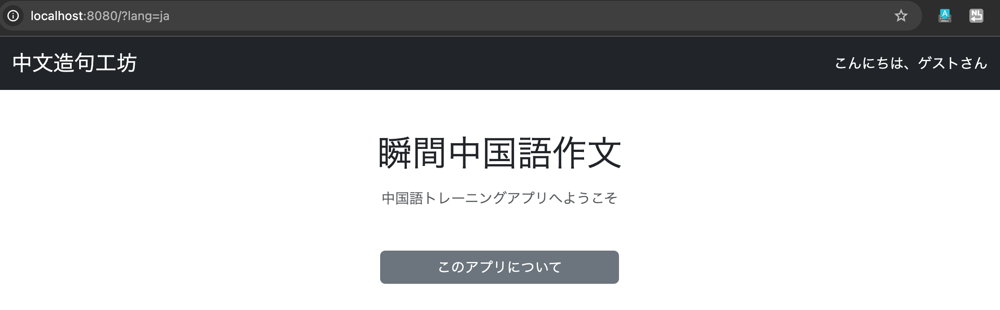
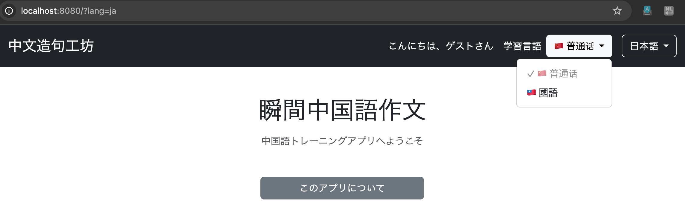
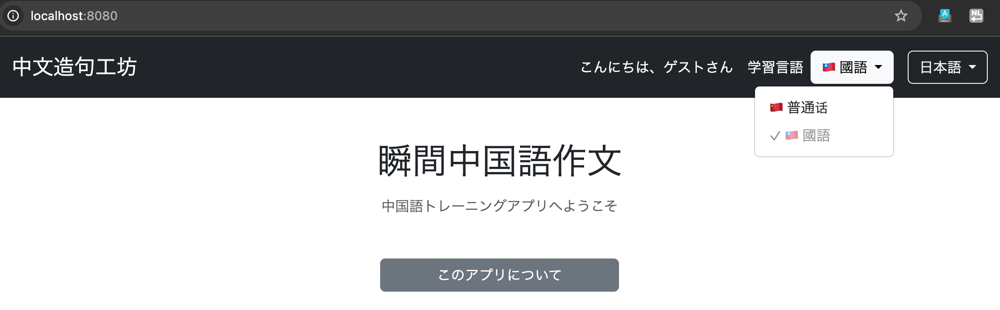
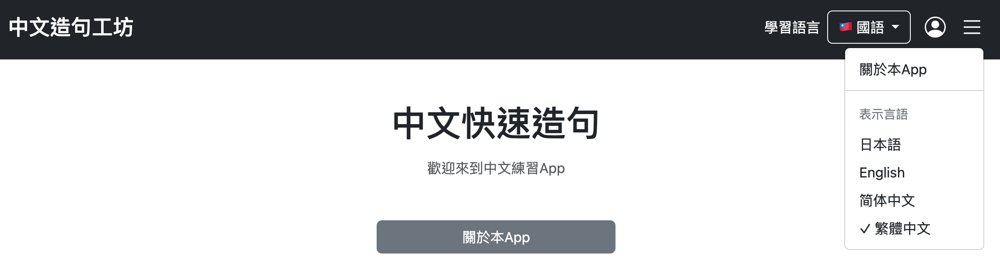

# 003 言語設定機能の実装

ここでは、以下の2種類の言語設定機能を実装する。

* **サイト表示言語**

  * サイト上の説明文やボタン、メニューなどに表示する言語を設定する。
* **学習対象言語**

  * 実際に学習する中国語を、大陸普通話または台湾華語（國語）から設定する。

```text
003 言語設定機能の実装
    ├─ サイト表示言語
    │   ├─ 日本語
    │   ├─ English
    │   ├─ 简体中文
    │   └─ 繁體中文
    │
    └─ 学習対象言語
        ├─ MAINLAND
        └─ TAIWAN
```

---

# 1. サイト表示言語設定

```bash
git commit -m "feat: add multilingual display language switching"
```

## 1.1 使用するフォルダ・ファイル

```text
src/main/java/
└── io.github.mawsonlakes790913.chineseoutputforge/
    └── config/
        └── LocaleConfig.java          ← 新規作成

src/main/resources/
├── messages.properties               ← 新規作成（デフォルト・日本語）
├── messages_en.properties            ← 新規作成
├── messages_zh_CN.properties         ← 新規作成
└── messages_zh_TW.properties         ← 新規作成
```

HTMLに直接記述していた固定文言を、言語ごとのプロパティファイルから読み込むように変更する。

---

# 2. デフォルトメッセージの作成

## 2.1 messages.properties

デフォルトの表示言語を日本語とする。

```properties
# home.html
home.title=瞬間中国語作文
home.welcome=中国語トレーニングアプリへようこそ
home.about=このアプリについて

# about.html
about.title=このアプリについて
about.backToTop=Topへ戻る

# header.html
header.greeting.guest=こんにちは、ゲストさん
```

`中文造句工坊` はブランド名として全言語共通にするため、propertiesには移さない。

## 2.2 home.html

```html
<h1 class="mb-3"
    th:text="#{home.title}">
    瞬間中国語作文
</h1>

<p class="text-muted"
   th:text="#{home.welcome}">
    中国語トレーニングアプリへようこそ
</p>

<div class="d-grid gap-3 col-md-3 mx-auto mt-5">

    <a th:href="@{/about}"
       class="btn btn-secondary"
       th:text="#{home.about}">
        このアプリについて
    </a>

</div>
```

```html
th:text="#{キー名}"
```

によって、`messages.properties` 内の対応するメッセージを取得する。

`about.html`、`header.html`についても同様に変更する。

---

# 3. 多言語メッセージの作成

## 3.1 messages_en.properties

```properties
# home.html
home.title=Instant Chinese Sentence Production
home.welcome=Welcome to the Chinese Training App
home.about=About This App

# about.html
about.title=About This App
about.backToTop=Back to Top

# header.html
header.greeting.guest=Hello, Guest
```

## 3.2 messages_zh_CN.properties

```properties
# home.html
home.title=中文快速造句
home.welcome=欢迎来到中文练习App
home.about=关于本App

# about.html
about.title=关于本App
about.backToTop=返回首页

# header.html
header.greeting.guest=你好，Guest
```

## 3.3 messages_zh_TW.properties

```properties
# home.html
home.title=中文快速造句
home.welcome=歡迎來到中文練習App
home.about=關於本App

# about.html
about.title=關於本App
about.backToTop=返回首頁

# header.html
header.greeting.guest=你好，Guest
```

---

# 4. Localeによる表示言語の切り替え

Localeを使用して、4つの `messages*.properties` を切り替える。

| 表示言語    | Locale  | 読み込まれるファイル                  |
| ------- | ------- | --------------------------- |
| 日本語     | `ja`    | `messages.properties`       |
| English | `en`    | `messages_en.properties`    |
| 简体中文    | `zh_CN` | `messages_zh_CN.properties` |
| 繁體中文    | `zh_TW` | `messages_zh_TW.properties` |

以下の仕組みを使用する。

* `SessionLocaleResolver`

  * 現在のLocaleをSessionに保持する。
* `LocaleChangeInterceptor`

  * `?lang=en` などのリクエストパラメータを検知してLocaleを変更する。

処理の流れは以下となる。

```text
ユーザー
  ↓
表示言語を選択
  ↓
?lang=zh_TW
  ↓
LocaleChangeInterceptor
  ↓
Localeを zh_TW に変更
  ↓
SessionLocaleResolver
  ↓
LocaleをSessionに保持
  ↓
messages_zh_TW.properties
  ↓
Thymeleafの #{...} が繁體中文になる
```

---

# 5. LocaleConfigの実装

## 5.1 LocaleConfig.java

```java
@Configuration
public class LocaleConfig implements WebMvcConfigurer {

    @Bean
    LocaleResolver localeResolver() {

        SessionLocaleResolver resolver = new SessionLocaleResolver();

        // デフォルトは日本語
        resolver.setDefaultLocale(Locale.JAPANESE);

        return resolver;
    }

    @Bean
    LocaleChangeInterceptor localeChangeInterceptor() {

        LocaleChangeInterceptor interceptor =
                new LocaleChangeInterceptor();

        // ?lang=ja などの lang を監視
        interceptor.setParamName("lang");

        return interceptor;
    }

    @Override
    public void addInterceptors(InterceptorRegistry registry) {
        registry.addInterceptor(localeChangeInterceptor());
    }
}
```

`localeResolver()` では `SessionLocaleResolver` を使用し、デフォルトLocaleを日本語に設定する。

```java
resolver.setDefaultLocale(Locale.JAPANESE);
```

`localeChangeInterceptor()` では、表示言語変更用のリクエストパラメータを `lang` とする。

```java
interceptor.setParamName("lang");
```

例えば、

```text
?lang=en
```

というリクエストが送信されると、Localeが英語へ変更される。

作成した `LocaleChangeInterceptor` は以下でSpring MVCへ登録する。

```java
@Override
public void addInterceptors(InterceptorRegistry registry) {
    registry.addInterceptor(localeChangeInterceptor());
}
```

---

# 6. 表示言語切り替えUIの実装

当初は `header.html` に表示言語切り替え用のドロップダウンを配置した。

```html
<div class="dropdown">

    <button class="btn btn-outline-light dropdown-toggle"
            type="button"
            data-bs-toggle="dropdown"
            aria-expanded="false">

        <span th:if="${#locale.language == 'ja'}">日本語</span>
        <span th:if="${#locale.language == 'en'}">English</span>
        <span th:if="${#locale.toString() == 'zh_CN'}">简体中文</span>
        <span th:if="${#locale.toString() == 'zh_TW'}">繁體中文</span>
    </button>

    <ul class="dropdown-menu dropdown-menu-end">

        <li>
            <a class="dropdown-item"
               th:href="@{?lang=ja}">
                日本語
            </a>
        </li>

        <li>
            <a class="dropdown-item"
               th:href="@{?lang=en}">
                English
            </a>
        </li>

        <li>
            <a class="dropdown-item"
               th:href="@{?lang=zh_CN}">
                简体中文
            </a>
        </li>

        <li>
            <a class="dropdown-item"
               th:href="@{?lang=zh_TW}">
                繁體中文
            </a>
        </li>

    </ul>
</div>
```

現在のLocaleによって、ドロップダウンの表示も変更する。

日本語と英語は、

```text
#locale.language
```

中国語の簡体字・繁体字については、

```text
#locale.toString()
```

を使用して `zh_CN` / `zh_TW` を判定する。

---

# 7. 表示言語の実行確認

以下のURLから表示言語を切り替えられることを確認した。

```text
http://localhost:8080/?lang=en
→ English

http://localhost:8080/?lang=zh_CN
→ 简体中文

http://localhost:8080/?lang=zh_TW
→ 繁體中文
```







日本語Localeについては、システムLocaleへのフォールバックを無効化するため `application.yml` に以下を追加した。

```yaml
spring:
  messages:
    fallback-to-system-locale: false
```

設定後、

```text
http://localhost:8080/?lang=ja
```

で日本語表示を確認した。





---

# 8. 学習対象言語設定

```bash
git commit -m "feat: add study language switching"
```

学習対象言語として以下の2種類を扱う。

```text
MAINLAND → 大陸普通話
TAIWAN   → 台湾華語（國語）
```

選択した学習対象言語はSessionへ保存する。

```text
?languageVariant=MAINLAND
    ↓
LanguageVariant.MAINLAND
    ↓
Sessionに保存
```

---

# 9. 学習対象言語のファイル構成

```text
src/main/java/
└── io.github.mawsonlakes790913.chineseoutputforge/
    ├── controller/
    │   └── LanguageVariantController.java
    │
    └── constant/
        └── LanguageVariant.java

src/main/resources/
└── static/
    └── js/
        └── header.js
```

---

# 10. LanguageVariantの実装

## 10.1 LanguageVariant.java

```java
public enum LanguageVariant {
    MAINLAND,
    TAIWAN
}
```

学習対象言語をEnumとして管理する。

```text
MAINLAND → 大陸普通話
TAIWAN   → 台湾華語（國語）
```

---

# 11. LanguageVariantControllerの実装

```java
@Controller
public class LanguageVariantController {

    @GetMapping("/language-variant")
    public String changeLanguageVariant(
            @RequestParam LanguageVariant languageVariant,
            HttpSession session) {

        LanguageVariant current =
                (LanguageVariant) session.getAttribute("languageVariant");

        // 同じ言語なら変更処理をしない
        if (languageVariant == current) {
            return "redirect:/";
        }

        // 学習対象言語をSessionに保存
        session.setAttribute("languageVariant", languageVariant);

        return "redirect:/";
    }
}
```

例えば、

```text
/language-variant?languageVariant=MAINLAND
```

へアクセスすると、

```java
@RequestParam LanguageVariant languageVariant
```

によって `languageVariant` パラメータを `LanguageVariant` 型として受け取る。

選択された値は、

```java
session.setAttribute("languageVariant", languageVariant);
```

によってSessionへ保存する。

学習対象言語を変更した後はHome画面へ戻す。

---

# 12. 学習対象言語の切り替えUI

`header.html` に学習対象言語のドロップダウンを追加する。

```html
<div class="d-flex align-items-center gap-2">

    <span th:text="#{header.studyLanguage}">
        学習言語
    </span>

    <div class="dropdown">

        <button class="btn btn-outline-light dropdown-toggle"
                type="button"
                data-bs-toggle="dropdown"
                aria-expanded="false">

            <span th:if="${session.languageVariant == null
                         || session.languageVariant.name() == 'MAINLAND'}">
                🇨🇳 普通话
            </span>

            <span th:if="${session.languageVariant != null
                         && session.languageVariant.name() == 'TAIWAN'}">
                🇹🇼 國語
            </span>

        </button>

        <ul class="dropdown-menu dropdown-menu-end">

            <!-- MAINLAND -->
            <li>

                <span th:if="${session.languageVariant == null
                             || session.languageVariant.name() == 'MAINLAND'}"
                      class="dropdown-item disabled">
                    ✓ 🇨🇳 普通话
                </span>

                <a th:if="${session.languageVariant != null
                          && session.languageVariant.name() != 'MAINLAND'}"
                   class="dropdown-item language-variant-link"
                   th:href="@{/language-variant(languageVariant='MAINLAND')}"
                   th:data-confirm-message="#{header.studyLanguage.confirmMainland}">
                    🇨🇳 普通话
                </a>

            </li>

            <!-- TAIWAN -->
            <li>

                <span th:if="${session.languageVariant != null
                             && session.languageVariant.name() == 'TAIWAN'}"
                      class="dropdown-item disabled">
                    ✓ 🇹🇼 國語
                </span>

                <a th:if="${session.languageVariant == null
                          || session.languageVariant.name() != 'TAIWAN'}"
                   class="dropdown-item language-variant-link"
                   th:href="@{/language-variant(languageVariant='TAIWAN')}"
                   th:data-confirm-message="#{header.studyLanguage.confirmTaiwan}">
                    🇹🇼 國語
                </a>

            </li>

        </ul>

    </div>
</div>
```

現在選択中の言語には `✓` を表示し、選択できない状態にする。

---

# 13. 学習言語変更時の確認ダイアログ

学習対象言語を変更する際に確認ダイアログを表示する。

HTML側では確認メッセージを `data-confirm-message` に設定し、JavaScript側で処理する。

## 13.1 layout.html

```html
<script th:src="@{/js/header.js}"></script>
```

## 13.2 header.js

```javascript
document.querySelectorAll('.language-variant-link').forEach(link => {
    link.addEventListener('click', function(event) {

        const message = this.dataset.confirmMessage;

        if (!confirm(message)) {
            event.preventDefault();
        }
    });
});
```

`.language-variant-link` を持つリンクがクリックされたとき、

```javascript
this.dataset.confirmMessage
```

から確認メッセージを取得する。

キャンセルされた場合は、

```javascript
event.preventDefault();
```

によってリンク遷移を中止する。

---

# 14. 学習言語変更メッセージの多言語化

## 14.1 messages.properties

```properties
header.studyLanguage=学習言語
header.studyLanguage.confirmMainland=学習言語を普通話に切り替えますか？\n切り替えると、現在のトレーニングは終了し、ホーム画面に戻ります。
header.studyLanguage.confirmTaiwan=学習言語を國語に切り替えますか？\n切り替えると、現在のトレーニングは終了し、ホーム画面に戻ります。
```

## 14.2 messages_en.properties

```properties
header.studyLanguage=Study Language
header.studyLanguage.confirmMainland=Switch the study language to Mandarin?\nYour current training session will end, and you will return to the Home page.
header.studyLanguage.confirmTaiwan=Switch the study language to Taiwanese Mandarin?\nYour current training session will end, and you will return to the Home page.
```

## 14.3 messages_zh_CN.properties

```properties
header.studyLanguage=学习语言
header.studyLanguage.confirmMainland=要将学习语言切换为普通话吗？\n切换后，当前训练将结束，并返回首页。
header.studyLanguage.confirmTaiwan=要将学习语言切换为国语吗？\n切换后，当前训练将结束，并返回首页。
```

## 14.4 messages_zh_TW.properties

```properties
header.studyLanguage=學習語言
header.studyLanguage.confirmMainland=要將學習語言切換為普通話嗎？\n切換後，目前的練習將結束，並返回首頁。
header.studyLanguage.confirmTaiwan=要將學習語言切換為國語嗎？\n切換後，目前的練習將結束，並返回首頁。
```

## 14.5 実行確認

学習対象言語を正常に切り替えられることを確認した。

### 普通話



### 國語



---

# 15. ヘッダーのUI修正

```bash
git commit -m "refactor: reorganize header UI"
```

表示言語・学習対象言語の実装後、ヘッダーを以下の構成へ整理する。

```text
中文造句工坊    学習言語 🇹🇼 國語 ▼    👤    ☰
```

変更内容は以下。

* 学習対象言語はヘッダー上に表示
* 表示言語はハンバーガーメニューへ移動
* 「こんにちは、ゲストさん」をユーザーアイコンへ変更
* ハンバーガーメニューを追加

現時点ではログイン機能やユーザーDBを実装していないため、ユーザーアイコンはUIのみ実装する。

---

# 16. Bootstrap Iconsの導入

## 16.1 pom.xml

```xml
<dependency>
    <groupId>org.webjars.npm</groupId>
    <artifactId>bootstrap-icons</artifactId>
    <version>1.11.3</version>
</dependency>
```

## 16.2 layout.html

Bootstrap IconsのCSSを読み込む。

```html
<!-- Bootstrap Icons -->
<link rel="stylesheet"
      th:href="@{/webjars/bootstrap-icons/font/bootstrap-icons.css}">
```

---

# 17. ユーザーアイコンの追加

これまで表示していた、

```text
こんにちは、ゲストさん
```

を削除し、ユーザーアイコンへ置き換える。

```html
<!-- ユーザーアイコン -->
<button type="button"
        class="btn p-0 text-white border-0"
        aria-label="ユーザー">
    <i class="bi bi-person-circle fs-4"></i>
</button>
```

現時点ではユーザーアイコン自体の機能は実装しない。

---

# 18. 表示言語切り替えをハンバーガーメニューへ移動

表示言語切り替えをヘッダー上のドロップダウンからハンバーガーメニュー内へ移動する。

ハンバーガーメニューには現時点で、

* このアプリについて
* 表示言語切り替え

を配置する。

```html
<!-- ハンバーガーアイコン -->
<div class="dropdown">

    <button type="button"
            class="btn p-0 text-white border-0"
            data-bs-toggle="dropdown"
            aria-expanded="false"
            aria-label="メニュー">
        <i class="bi bi-list fs-3"></i>
    </button>

    <ul class="dropdown-menu dropdown-menu-end">

        <li>
            <a class="dropdown-item"
               th:href="@{/about}"
               th:text="#{home.about}">
                このアプリについて
            </a>
        </li>

        <li>
            <hr class="dropdown-divider">
        </li>

        <li>
            <span class="dropdown-header">
                表示言語
            </span>
        </li>

        <li>
            <a class="dropdown-item"
               th:href="@{?lang=ja}">
                <span th:if="${#locale.language == 'ja'}">✓ </span>
                日本語
            </a>
        </li>

        <li>
            <a class="dropdown-item"
               th:href="@{?lang=en}">
                <span th:if="${#locale.language == 'en'}">✓ </span>
                English
            </a>
        </li>

        <li>
            <a class="dropdown-item"
               th:href="@{?lang=zh_CN}">
                <span th:if="${#locale.toString() == 'zh_CN'}">✓ </span>
                简体中文
            </a>
        </li>

        <li>
            <a class="dropdown-item"
               th:href="@{?lang=zh_TW}">
                <span th:if="${#locale.toString() == 'zh_TW'}">✓ </span>
                繁體中文
            </a>
        </li>

    </ul>
</div>
```

現在選択されている表示言語には `✓` を表示する。

---

# 19. ヘッダーUI修正後の実行確認

`http://localhost:8080/` にアクセスし、修正後のヘッダーを確認した。



現在のヘッダーは以下の構成となる。

```text
中文造句工坊       学習言語 🇹🇼 國語 ▼       👤    ☰
```

```text
中文造句工坊
    ↓
Home

学習言語
    ↓
MAINLAND / TAIWAN の切り替え

👤
    ↓
ユーザー関連機能用

☰
    ├─ このアプリについて
    └─ 表示言語
        ├─ 日本語
        ├─ English
        ├─ 简体中文
        └─ 繁體中文
```

---

# 20. 次にやること

**学習モードの実装**

今回作成した学習対象言語設定を利用し、実際の問題データや学習処理を実装していく。
