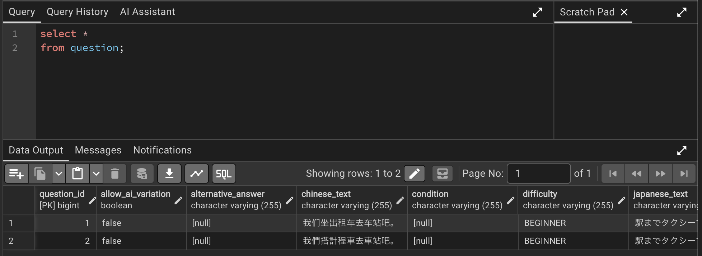
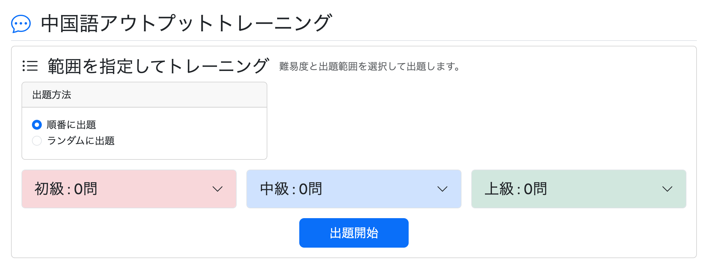
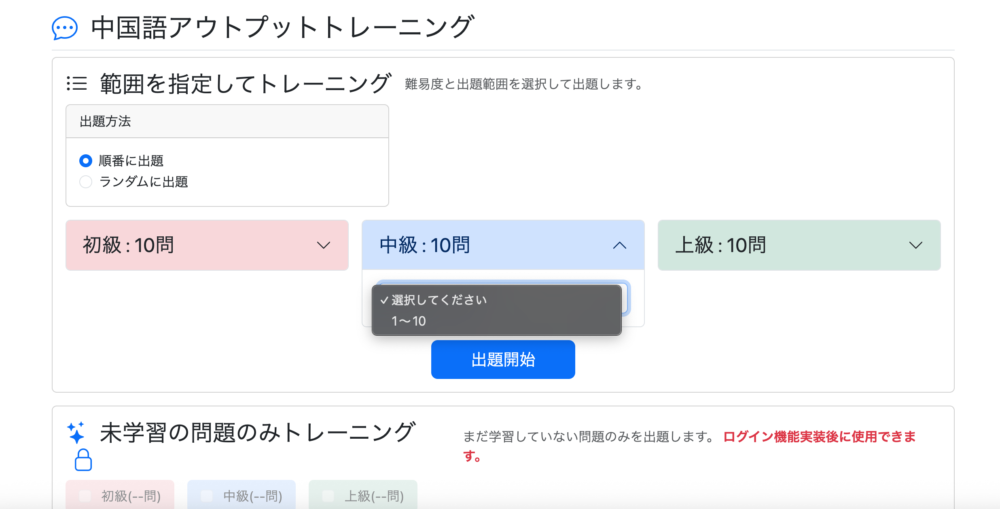
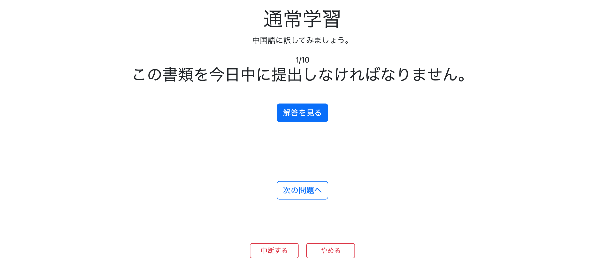
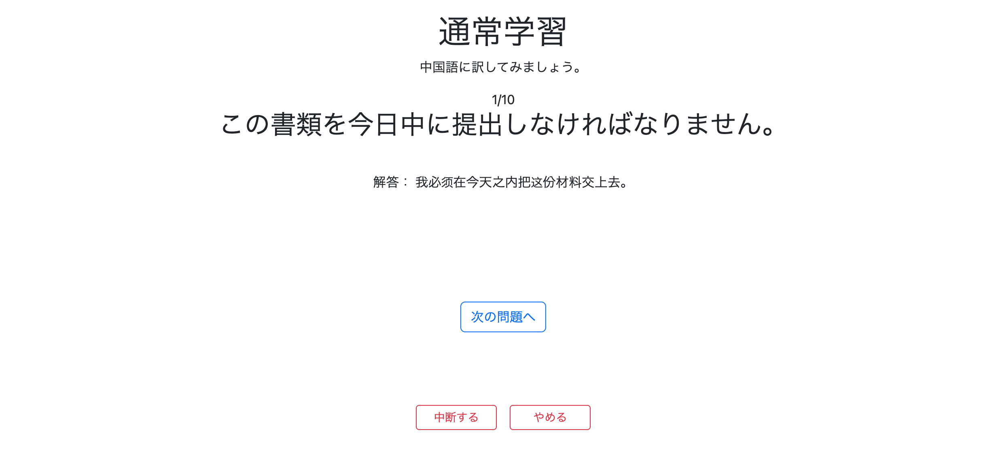
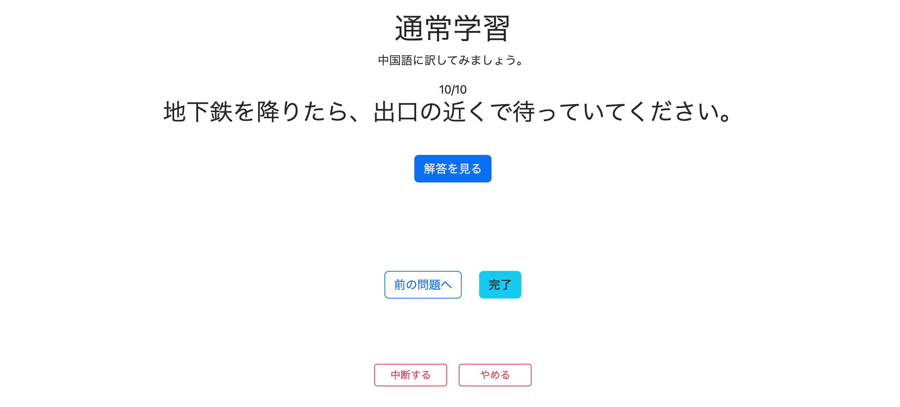
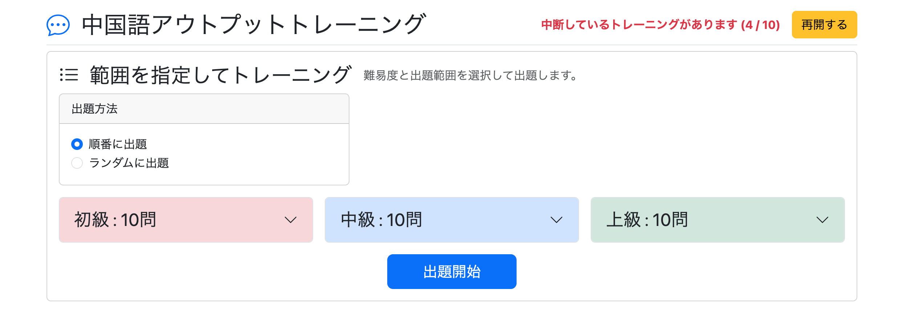
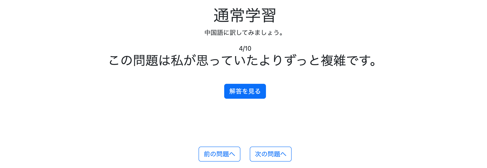

# 004 通常学習の実装 その1

通常学習機能の実装を開始する。

通常学習は English Output Trainer の仕組みを踏襲し、DBに登録されている問題を使用して中国語のアウトプットトレーニングを行う。

主な仕様は以下。

### 学習メニュー

- 学習対象言語（普通話 / 國語）ごとに問題を取得する
- 難易度を初級・中級・上級に分ける
- 問題を一定数ごとの問題セットに分割する
- 出題範囲を選択できる
- 順番 / ランダムを選択できる
- 中断した問題セットを再開できる

### 出題画面

- 日本語文を表示する
- 必要に応じて条件を表示する
- 「解答を見る」を押すと中国語の解答・別解を表示する
- 前後の問題へ移動できる
- 問題セットを中断・終了できる
- 最後まで終了すると完了画面へ遷移する

ログイン機能はまだ実装していないため、今回はログインしていなくても利用できる機能まで実装する。


# 1. DBの準備

## application.yml

これまではDBを使用していなかったため、`DataSourceAutoConfiguration` を無効化していた。

今後はPostgreSQLを使用するため、以下を削除する。

```yaml
spring:
  autoconfigure:
    exclude:
      - org.springframework.boot.autoconfigure.jdbc.DataSourceAutoConfiguration
```

また、開発中はEntityの定義をもとにHibernateがテーブル構造を更新できるようにする。

```yaml
spring:
  jpa:
    hibernate:
      ddl-auto: update
```

現段階では、開発中のテーブル作成・変更を簡単にするため `update` を使用する。


# 2. Question Entityの準備

通常学習で使用する問題データを管理するため、`Question` Entityと関連するEnumを作成する。

```text
io.github.mawsonlakes790913.chineseoutputforge
├── entity
│   └── Question.java
│
└── constant
    ├── LanguageVariant.java
    ├── Difficulty.java
    ├── SubjectType.java
    └── VerbVariation.java
```

## Difficulty.java

```java
public enum Difficulty {

    BEGINNER,
    INTERMEDIATE,
    ADVANCED
}
```

## SubjectType.java

```java
public enum SubjectType {

    PRONOUN,
    NON_PRONOUN,
    ALL
}
```

## VerbVariation.java

```java
public enum VerbVariation {

    FIXED,
    FLEXIBLE
}
```

## Question.java

```java
@Getter
@Setter
@Entity
@Table(name = "question")
public class Question {

    @Id
    @GeneratedValue(strategy = GenerationType.IDENTITY)
    @Column(name = "question_id")
    private Long questionId;

    @Column(name = "language_variant", nullable = false)
    @Enumerated(EnumType.STRING)
    private LanguageVariant languageVariant;

    @Column(name = "japanese_text", nullable = false)
    private String japaneseText;

    @Column(name = "chinese_text", nullable = false)
    private String chineseText;

    @Column(name = "alternative_answer")
    private String alternativeAnswer;

    @Column(name = "condition")
    private String condition;

    @Column(name = "difficulty", nullable = false)
    @Enumerated(EnumType.STRING)
    private Difficulty difficulty;

    @Column(name = "allow_ai_variation", nullable = false)
    private Boolean allowAiVariation;

    @Column(name = "template")
    private String template;

    @Column(name = "subject_type")
    @Enumerated(EnumType.STRING)
    private SubjectType subjectType;

    @Column(name = "verb_variation")
    @Enumerated(EnumType.STRING)
    private VerbVariation verbVariation;
}
```

**Commit**

```text
feat: set up question data for practice
```


# 3. DBに問題データを登録

最初に普通話・國語を1問ずつINSERTし、PostgreSQLへの保存とJPAからの取得が正常に行えることを確認した。

```sql
INSERT INTO question (
    language_variant,
    japanese_text,
    chinese_text,
    difficulty,
    allow_ai_variation
)
VALUES
(
    'MAINLAND',
    '駅までタクシーで行きましょう。',
    '我们坐出租车去车站吧。',
    'BEGINNER',
    false
),
(
    'TAIWAN',
    '駅までタクシーで行こう。',
    '我們搭計程車去車站吧。',
    'BEGINNER',
    false
);
```

pgAdminから確認する。

```sql
SELECT * FROM question;
```



`QuestionRepository` からも正常に取得できることを確認した。

```java
public interface QuestionRepository extends JpaRepository<Question, Long> {

}
```

確認結果：

```text
1 / MAINLAND / 我们坐出租车去车站吧。
2 / TAIWAN / 我們搭計程車去車站吧。
```

これにより、

- PostgreSQLへの保存
- 日本語・簡体字・繁体字の保存
- JPAによる取得
- `Question` Entityへのマッピング

が正常に動作していることを確認した。

その後、通常学習の動作確認用データとして、

- 普通話：初級10問 / 中級10問 / 上級10問
- 國語：初級10問 / 中級10問 / 上級10問

の合計60問を登録した。


# 4. 難易度と範囲から問題セットを取得

学習対象言語・難易度・開始位置を指定して、通常学習で使用する問題セットを取得する。

## PracticeService.java

```java
public List<Question> getPracticeQuestions(
        LanguageVariant languageVariant,
        Difficulty difficulty,
        int start,
        boolean random) {

    int offset = start - 1;

    List<Question> extractedQuestions =
            questionRepository.findQuestionsByLanguageVariantAndDifficulty(
                    languageVariant.name(),
                    difficulty.name(),
                    offset
            );

    if (random) {
        Collections.shuffle(extractedQuestions);
    }

    return extractedQuestions;
}
```

`random = true` の場合は、取得した問題セットをシャッフルする。

## QuestionRepository.java

```java
@Query(value = """
        SELECT *
        FROM question
        WHERE language_variant = :languageVariant
        AND difficulty = :difficulty
        ORDER BY question_id
        LIMIT 100 OFFSET :offset
        """, nativeQuery = true)
List<Question> findQuestionsByLanguageVariantAndDifficulty(
        @Param("languageVariant") String languageVariant,
        @Param("difficulty") String difficulty,
        @Param("offset") int offset
);
```

**Commit**

```text
feat: add question set retrieval for practice
```


# 5. 各難易度の問題数とRangeを取得

学習メニューでは問題を50問単位の問題セットとして表示する。

例えば125問存在する場合、

```text
1～50
51～100
101～125
```

のように分割する。


## PracticeMenuDto.java

学習メニュー表示に必要な、各難易度の問題数とRangeをまとめてControllerへ渡す。

```java
@Data
public class PracticeMenuDto {

    private long beginnerCount;
    private List<Range> beginnerRanges;

    private long intermediateCount;
    private List<Range> intermediateRanges;

    private long advancedCount;
    private List<Range> advancedRanges;
}
```


## PracticeService.java

```java
public PracticeMenuDto countPracticeQuestions(
        LanguageVariant languageVariant) {

    PracticeMenuDto count = new PracticeMenuDto();

    // 初級
    long beginnerCount =
            questionRepository.countByLanguageVariantAndDifficulty(
                    languageVariant,
                    Difficulty.BEGINNER
            );

    count.setBeginnerCount(beginnerCount);
    count.setBeginnerRanges(createRanges(beginnerCount));

    // 中級
    long intermediateCount =
            questionRepository.countByLanguageVariantAndDifficulty(
                    languageVariant,
                    Difficulty.INTERMEDIATE
            );

    count.setIntermediateCount(intermediateCount);
    count.setIntermediateRanges(createRanges(intermediateCount));

    // 上級
    long advancedCount =
            questionRepository.countByLanguageVariantAndDifficulty(
                    languageVariant,
                    Difficulty.ADVANCED
            );

    count.setAdvancedCount(advancedCount);
    count.setAdvancedRanges(createRanges(advancedCount));

    return count;
}

private List<Range> createRanges(long count) {

    List<Range> ranges = new ArrayList<>();

    for (long start = 1; start <= count; start += 50) {

        if (start + 49 <= count) {
            ranges.add(new Range(start, start + 49));
        } else {
            ranges.add(new Range(start, count));
        }
    }

    return ranges;
}
```

指定された `LanguageVariant` について、

- BEGINNER
- INTERMEDIATE
- ADVANCED

それぞれの問題数を取得し、50問単位のRangeを生成する。


## Range.java

```java
public class Range {

    private long start;
    private long end;

    public Range(long start, long end) {
        this.start = start;
        this.end = end;
    }

    public long getStart() {
        return start;
    }

    public long getEnd() {
        return end;
    }

    public String getDisplayText() {
        return start + "～" + end;
    }
}
```

## QuestionRepository.java

```java
long countByLanguageVariantAndDifficulty(
        LanguageVariant languageVariant,
        Difficulty difficulty
);
```

**Commit**

```text
feat: add question range retrieval for practice
```


# 6. 通常学習フローをControllerで制御

`PracticeController` で通常学習の一連の処理を制御する。


## 学習メニューを表示

```java
@GetMapping("/practice/menu")
public String getPracticeMenu(
        HttpSession session,
        Model model) {

    PracticeMenuDto menu =
            practiceService.countPracticeQuestions(
                    (LanguageVariant)
                            session.getAttribute("languageVariant")
            );

    model.addAttribute("practiceMenu", menu);

    List<Question> questions =
            (List<Question>)
                    session.getAttribute("practiceQuestions");

    Integer currentPage =
            (Integer)
                    session.getAttribute("practiceCurrentPage");

    boolean canResume =
            questions != null && currentPage != null;

    model.addAttribute("canResume", canResume);

    if (canResume) {
        model.addAttribute("currentPage", currentPage);
        model.addAttribute("totalCount", questions.size());
    }

    return "practice/menu";
}
```

学習メニューでは、

- 現在の学習対象言語の問題数・Rangeを取得
- 中断中の問題セットが存在するか確認
- 再開可能な場合は現在位置と総問題数を表示

する。

### 追記：学習対象言語未設定時の問題数取得を修正（2026年8月16日）

Spring Boot再起動後に通常学習メニュー（`/practice/menu`）へアクセスすると、各難易度の問題数がすべて0問になる問題が発生した。



新しいSessionでは `languageVariant` がまだ設定されていないため、`PracticeController#getPracticeMenu()` で学習対象言語を取得し、未設定の場合はデフォルトの `MAINLAND` を使用するよう修正した。

## PracticeController.java

```java
// 学習対象言語を取得
LanguageVariant languageVariant =
        (LanguageVariant) session.getAttribute("languageVariant");

// 未設定の場合は普通話
if (languageVariant == null) {
    languageVariant = LanguageVariant.MAINLAND;
}

// 通常問題数を取得
PracticeMenuDto menu =
        practiceService.countPracticeQuestions(languageVariant);

model.addAttribute("practiceMenu", menu);

これにより、学習対象言語を一度も変更していない状態でも、普通話をデフォルトとして問題数を取得できるようになった。

現時点では未設定時のデフォルトを MAINLAND とする。
ログイン機能実装後、ユーザー設定としてデフォルトの学習対象言語を保持するかは別途検討する。

---

## 新しい問題セットを開始

```java
@GetMapping("/practice/start")
public String getPracticeStart(
        HttpSession session,
        @RequestParam(required = false) Integer beginnerRange,
        @RequestParam(required = false) Integer intermediateRange,
        @RequestParam(required = false) Integer advancedRange,
        @RequestParam(name = "random") boolean random,
        RedirectAttributes redirectAttributes) {

    int selectedCount = 0;

    if (beginnerRange != null) selectedCount++;
    if (intermediateRange != null) selectedCount++;
    if (advancedRange != null) selectedCount++;

    if (selectedCount != 1) {
        redirectAttributes.addFlashAttribute(
                "errorMessage",
                "出題範囲を1つ選択してください。"
        );

        return "redirect:/practice/menu";
    }

    Difficulty difficulty;
    int start;

    if (beginnerRange != null) {
        difficulty = Difficulty.BEGINNER;
        start = beginnerRange;

    } else if (intermediateRange != null) {
        difficulty = Difficulty.INTERMEDIATE;
        start = intermediateRange;

    } else if (advancedRange != null) {
        difficulty = Difficulty.ADVANCED;
        start = advancedRange;

    } else {
        return "redirect:/study/menu";
    }

    clearPracticeSession(session);

    List<Question> questions =
            practiceService.getPracticeQuestions(
                    (LanguageVariant)
                            session.getAttribute("languageVariant"),
                    difficulty,
                    start,
                    random
            );

    if (questions.isEmpty()) {
        return "redirect:/practice/menu";
    }

    session.setAttribute("practiceQuestions", questions);
    session.setAttribute("practiceCurrentPage", 0);

    return "redirect:/practice/question?page=0";
}
```

選択された難易度・Rangeから問題セットを取得し、Sessionへ保存して最初の問題へ遷移する。


## 問題を表示

```java
@GetMapping("/practice/question")
public String getPracticeQuestion(
        Model model,
        HttpSession session,
        @RequestParam(defaultValue = "0") int page) {

    List<Question> questions =
            (List<Question>)
                    session.getAttribute("practiceQuestions");

    if (questions == null) {
        return "redirect:/practice/menu";
    }

    if (page < 0 || page >= questions.size()) {
        return "redirect:/practice/menu";
    }

    questionModelUtil.setQuestionModel(
            model,
            questions,
            page
    );

    return "practice/question";
}
```


## QuestionModelUtil.java

出題画面で必要な情報をまとめてModelへ格納する。

```java
@Component
public class QuestionModelUtil {

    public void setQuestionModel(
            Model model,
            List<Question> questions,
            int page) {

        Question question = questions.get(page);

        model.addAttribute("question", question);
        model.addAttribute("nextPageIndex", page + 1);
        model.addAttribute("totalPages", questions.size());
        model.addAttribute("hasPrevious", page > 0);
        model.addAttribute(
                "hasNext",
                page < questions.size() - 1
        );
    }
}
```


## 中断した問題セットを再開

```java
@GetMapping("/practice/resume")
public String getPracticeResume(
        Model model,
        HttpSession session) {

    if (session.getAttribute("practiceQuestions") == null) {
        return "redirect:/practice/menu";
    }

    Integer page =
            (Integer)
                    session.getAttribute("practiceCurrentPage");

    return "redirect:/practice/question?page=" + page;
}
```


## 問題セットを完了

```java
@GetMapping("/practice/complete")
public String getPracticeComplete(HttpSession session) {

    clearPracticeSession(session);

    return "redirect:/complete";
}
```


## トレーニングを中断

```java
@GetMapping("/practice/suspend")
public String getPracticeSuspend(
        @RequestParam int page,
        HttpSession session) {

    session.setAttribute(
            "practiceCurrentPage",
            page
    );

    return "redirect:/";
}
```


## トレーニングを終了

```java
@GetMapping("/practice/quit")
public String getPracticeQuit(HttpSession session) {

    clearPracticeSession(session);

    return "redirect:/";
}
```

**Commit**

```text
feat: add practice flow controller
```


# 7. 学習完了Controller

問題セット完了後の画面を表示するControllerを作成する。

```java
@Controller
public class CompleteController {

    @GetMapping("/complete")
    public String getComplete() {
        return "complete";
    }
}
```

**Commit**

```text
feat: add practice completion controller
```


# 8. 通常学習メニュー画面

`practice/menu.html` を作成する。

主な機能は以下。

- 各難易度の問題数表示
- Range選択
- 順番 / ランダム選択
- 出題開始
- 中断中のトレーニングの表示
- 中断した問題セットの再開

難易度ごとに `PracticeMenuDto` から問題数とRangeを取得する。

```html
<span th:text="#{practice.menu.difficulty.beginner(${practiceMenu.beginnerCount})}">
</span>

<select id="beginnerRange"
        class="form-select"
        name="beginnerRange">

    <option value=""
            th:text="#{practice.menu.range.select}">
    </option>

    <option th:each="range : ${practiceMenu.beginnerRanges}"
            th:value="${range.start}"
            th:text="${range.displayText}">
    </option>

</select>
```

中断中の問題セットが存在する場合は再開ボタンを表示する。

```html
<div th:if="${canResume}"
     class="d-flex align-items-center gap-3">

    <span class="text-danger fw-bold">

        <span th:text="#{practice.menu.resume.message}"></span>

        (<span th:text="${currentPage + 1}"></span>
        /
        <span th:text="${totalCount}"></span>)

    </span>

    <a th:href="@{/practice/resume}"
       class="btn btn-warning"
       th:text="#{practice.menu.resume.button}">
    </a>

</div>
```

未学習問題のみを出題する機能については、ログイン機能実装後に使用するため、現段階では無効状態で表示する。

**Commit**

```text
feat: add practice menu
```


# 9. 問題出題画面

`practice/question.html` を作成する。

画面には、

- 現在の問題番号
- 日本語問題
- 条件
- 中国語の解答
- 別解
- 前の問題
- 次の問題
- 完了
- 中断
- 終了

を表示する。


## 問題と解答

```html
<span th:text="${nextPageIndex + '/' + totalPages}">
    1/10
</span>

<h2 class="mb-0"
    th:text="${question.japaneseText}">
    日本語問題
</h2>

<div style="min-height:40px;">

    <p th:if="${question.condition != null}">

        <span th:text="#{practice.question.condition}">
            条件：
        </span>

        <span th:text="${question.condition}">
            条件
        </span>

    </p>

</div>

<div style="min-height:100px;">

    <button id="answerButton"
            type="button"
            class="btn btn-primary"
            onclick="showAnswer()"
            th:text="#{practice.question.showAnswer}">
        解答を見る
    </button>

    <div id="answerArea"
         style="display:none;">

        <p class="mb-2">

            <span th:text="#{practice.question.answer}">
                解答：
            </span>

            <span th:text="${question.chineseText}">
                Chinese Answer
            </span>

        </p>

        <p th:if="${question.alternativeAnswer != null}"
           class="mb-0">

            <span th:text="#{practice.question.alternativeAnswer}">
                別解：
            </span>

            <span th:text="${question.alternativeAnswer}">
                Alternative Answer
            </span>

        </p>

    </div>

</div>
```


## 前後の問題への移動

```html
<a th:if="${hasPrevious}"
   th:href="@{/practice/question(page=${nextPageIndex - 2})}"
   class="btn btn-outline-primary"
   th:text="#{practice.question.previous}">
    前の問題へ
</a>

<a th:if="${hasNext}"
   th:href="@{/practice/question(page=${nextPageIndex})}"
   class="btn btn-outline-primary"
   th:text="#{practice.question.next}">
    次の問題へ
</a>

<a th:if="${!hasNext}"
   th:href="@{/practice/complete}"
   class="btn btn-info"
   th:text="#{practice.question.complete}">
    完了
</a>
```


## 中断・終了

```html
<a th:href="@{/practice/suspend(page=${nextPageIndex - 1})}"
   th:attr="onclick=|return confirm('#{practice.question.suspend.confirm}');|"
   class="btn btn-outline-danger btn-sm"
   th:text="#{practice.question.suspend}">
    中断する
</a>

<a th:href="@{/practice/quit}"
   th:attr="onclick=|return confirm('#{practice.question.quit.confirm}');|"
   class="btn btn-outline-danger btn-sm"
   th:text="#{practice.question.quit}">
    やめる
</a>
```


## practice.js

「解答を見る」を押したときに解答を表示する。

```javascript
function showAnswer() {

    const answerButton =
            document.getElementById("answerButton");

    const answerArea =
            document.getElementById("answerArea");

    answerButton.style.display = "none";
    answerArea.style.display = "block";
}
```

**Commit**

```text
feat: add practice question page
```


# 10. 学習完了画面

`complete.html` を作成する。

問題セット完了後に、

- Topへ戻る
- 通常学習メニューへ戻る

を選択できるようにする。

```html
<div class="text-center"
     layout:fragment="content">

    <h1 th:text="#{complete.title}">
        お疲れさまでした！
    </h1>

    <p th:text="#{complete.message}">
        この調子でトレーニングを続けていきましょう。
    </p>

    <div class="d-flex flex-column align-items-center gap-2 mt-3">

        <a th:href="@{/}"
           class="btn btn-secondary"
           th:text="#{common.backToTop}">
            Topに戻る
        </a>

        <a th:href="@{/practice/menu}"
           class="btn btn-primary"
           th:text="#{complete.backToPractice}">
            通常学習メニューに戻る
        </a>

    </div>

</div>
```

**Commit**

```text
feat: add practice completion page
```


# 11. 通常学習画面の多言語化

通常学習で追加した画面について、画面上の文字列を `messages*.properties` で管理する。

対象：

```text
messages.properties
messages_ja.properties
messages_en.properties
messages_zh_CN.properties
messages_zh_TW.properties
```

例：

```properties
practice.menu.pageTitle=通常学習 | Chinese Output Forge
practice.menu.title=中国語アウトプットトレーニング

practice.menu.resume.message=中断しているトレーニングがあります
practice.menu.resume.button=再開する

practice.menu.range.title=範囲を指定してトレーニング
practice.menu.range.description=難易度と出題範囲を選択して出題します。
practice.menu.range.select=選択してください

practice.menu.order.title=出題方法
practice.menu.order.sequential=順番に出題
practice.menu.order.random=ランダムに出題

practice.menu.difficulty.beginner=初級 : {0}問
practice.menu.difficulty.intermediate=中級 : {0}問
practice.menu.difficulty.advanced=上級 : {0}問

practice.menu.start=出題開始
```

同じキーを英語・簡体字・繁体字にも追加した。


# 12. 動作確認

`/practice/menu` にアクセスし、通常学習メニューが表示されることを確認。



難易度・Range・出題方法を選択して出題を開始すると、

```text
/practice/question?page=0
```

へ遷移し、問題セットの最初の問題が表示される。



「解答を見る」を押すと中国語の解答が表示される。



問題セットの最後まで進むと「完了」ボタンが表示される。



完了すると `/complete` へ遷移する。


トレーニングを中断すると、学習メニューに中断中のトレーニングが表示される。



「再開する」を押すと、

```text
/practice/question?page=X
```

へ遷移し、中断した位置から再開できる。




# 13. 学習対象言語変更時のSession不整合を修正

動作確認中、学習対象言語を変更しても中断中の問題セットがSessionに残る問題が見つかった。

例えば、

```text
普通話でトレーニング
↓
10 / 50で中断
↓
学習対象言語を國語へ変更
```

とすると、

```text
languageVariant = TAIWAN
practiceQuestions = MAINLANDの問題セット
```

という不整合が発生する。

そのため、学習対象言語が変更された時点で通常学習のSession情報を破棄する。


## LanguageVariantController.java

```java
@GetMapping("/language-variant")
public String changeLanguageVariant(
        @RequestParam LanguageVariant languageVariant,
        @RequestParam(required = false) String redirect,
        HttpSession session) {

    LanguageVariant current =
            (LanguageVariant)
                    session.getAttribute("languageVariant");

    // 同じ言語なら変更処理をしない
    if (languageVariant == current) {
        return redirect != null
                ? "redirect:" + redirect
                : "redirect:/";
    }

    // 中断中の通常学習データを破棄
    session.removeAttribute("practiceQuestions");
    session.removeAttribute("practiceCurrentPage");

    // 学習対象言語を変更
    session.setAttribute(
            "languageVariant",
            languageVariant
    );

    // Practiceメニューから変更した場合
    if ("/practice/menu".equals(redirect)) {
        return "redirect:/practice/menu";
    }

    return "redirect:/";
}
```

また、`/practice/menu` で学習対象言語を変更した場合はHomeへ戻さず、同じ学習メニューを再表示するようにする。


## PracticeController.java

```java
@GetMapping("/practice/menu")
public String getPracticeMenu(
        HttpSession session,
        Model model) {

    // 言語切替後の戻り先
    model.addAttribute(
            "languageVariantRedirect",
            "/practice/menu"
    );

    // 以下省略
}
```


## header.html

言語切替時に戻り先を `/language-variant` へ渡す。

```html
<a class="dropdown-item language-variant-link"
   th:href="@{/language-variant(
       languageVariant='MAINLAND',
       redirect=${languageVariantRedirect}
   )}">
    🇨🇳 普通话
</a>
```

TAIWAN側も同様に設定する。

これにより、

- 学習対象言語変更時に古い問題セットを破棄
- Practiceメニューで変更した場合はPracticeメニューに留まる
- 新しいLanguageVariantの問題数・Rangeを再取得

という流れになった。

**Commit**

```text
fix: clear practice session on language change
```


# 14. 今後の実装

今回で、ログインを必要としない通常学習の基本フローが動作するようになった。

現時点では以下が未実装。

- 拼音 / 注音の表示
- ログイン機能
- 理解度（Hard / Good / Easy）の記録
- 学習済み / 未学習の管理
- 未学習問題のみの出題
- ユーザーごとの学習履歴

特に、出題画面に拼音・注音を表示するためのデータが現在の `Question` Entityに存在しないことが判明したため、次の実装で対応する。