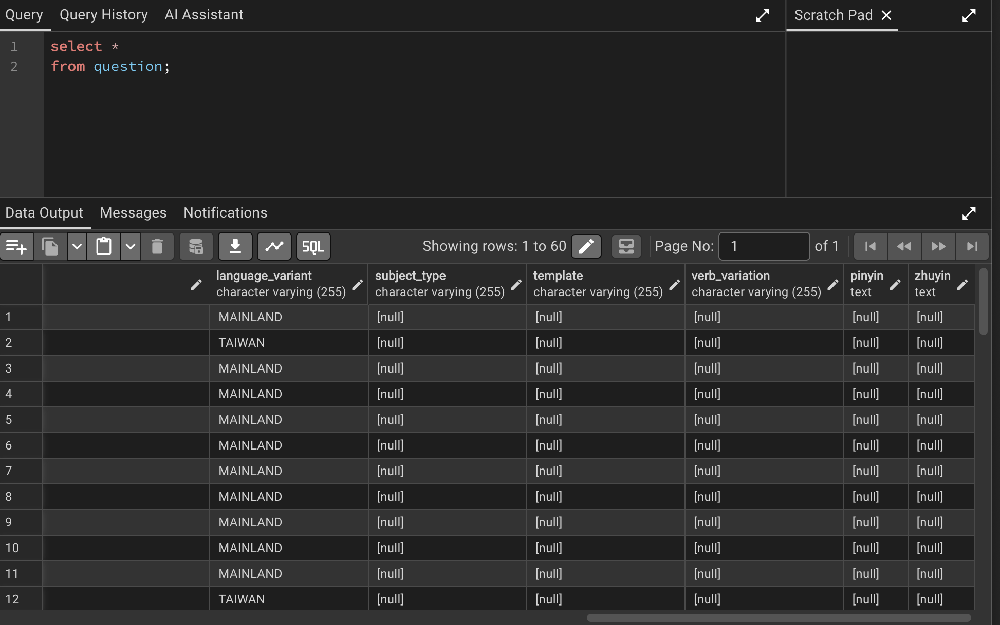
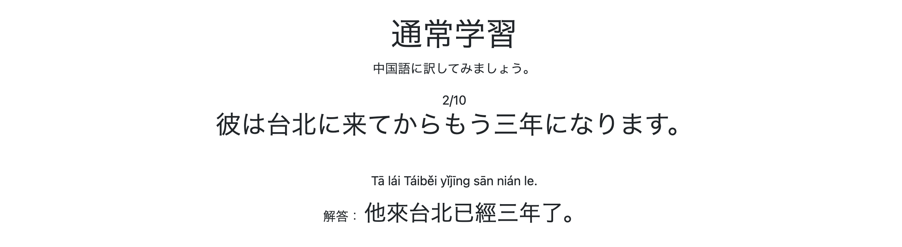
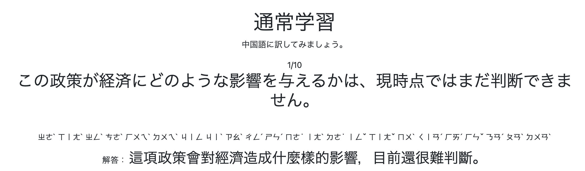
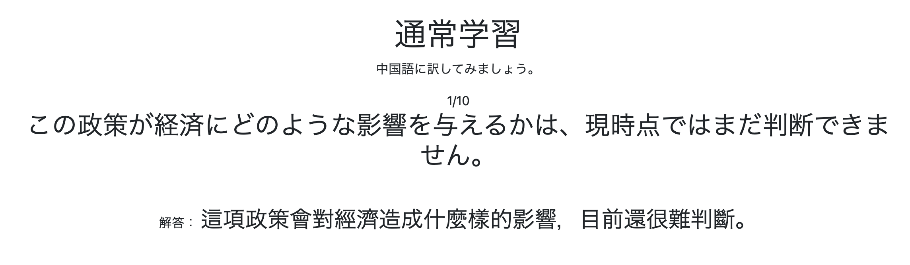
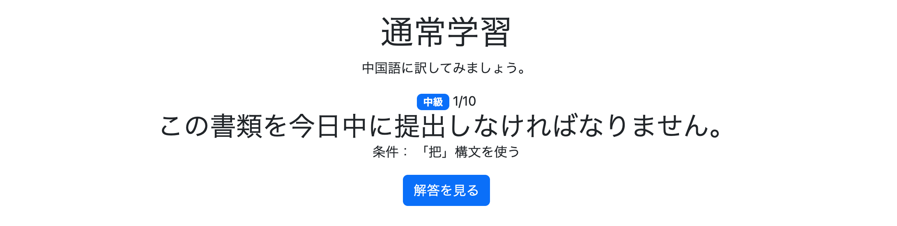

# 005 通常学習の実装 その2

## 1. 拼音・注音データの追加

通常学習の解答画面で拼音・注音を表示できるようにする。

関連する要件・設計については、以下のドキュメントを更新済み。

- `requirements.md`
- `data-design.md`
- `er-diagram.md`
- `table-definition.md`
- `screen-design.md`

---

## 2. Questionに拼音・注音フィールドを追加

### Question.java

`Question` に拼音・注音を保持するフィールドを追加した。

```java
@Column(name = "pinyin", columnDefinition = "TEXT")
private String pinyin;

@Column(name = "zhuyin", columnDefinition = "TEXT")
private String zhuyin;
```

既に `question` テーブルにデータが存在するため、この段階では `nullable = false` を設定しない。

現在は、

```properties
spring.jpa.hibernate.ddl-auto=update
```

を使用しているため、Entity変更後にSpring Bootを起動し、Hibernateによってカラムを追加した。

### 確認

pgAdmin4から `question` テーブルを確認し、`pinyin`・`zhuyin` カラムが追加されていることを確認した。



---

## 3. 既存データへの拼音・注音追加

既存の問題データに拼音・注音を追加した。

```sql
UPDATE question SET
    pinyin = 'Wǒmen zuò chūzūchē qù chēzhàn ba.',
    zhuyin = 'ㄨㄛˇ ㄇㄣ˙ ㄗㄨㄛˋ ㄔㄨ ㄗㄨ ㄔㄜ ㄑㄩˋ ㄔㄜ ㄓㄢˋ ㄅㄚ˙'
WHERE question_id = 1;

UPDATE question SET
    pinyin = 'Wǒmen dā jìchéngchē qù chēzhàn ba.',
    zhuyin = 'ㄨㄛˇ ㄇㄣ˙ ㄉㄚ ㄐㄧˋ ㄔㄥˊ ㄔㄜ ㄑㄩˋ ㄔㄜ ㄓㄢˋ ㄅㄚ˙'
WHERE question_id = 2;

UPDATE question SET
    pinyin = 'Wǒ bǎ shǒujī wàng zài jiālǐ le.',
    zhuyin = 'ㄨㄛˇ ㄅㄚˇ ㄕㄡˇ ㄐㄧ ㄨㄤˋ ㄗㄞˋ ㄐㄧㄚ ㄌㄧˇ ㄌㄜ˙'
WHERE question_id = 3;

UPDATE question SET
    pinyin = 'Wǒ zuò dìtiě qù gōngsī.',
    zhuyin = 'ㄨㄛˇ ㄗㄨㄛˋ ㄉㄧˋ ㄊㄧㄝˇ ㄑㄩˋ ㄍㄨㄥ ㄙ'
WHERE question_id = 4;

UPDATE question SET
    pinyin = 'Zhè bù diànyǐng hěn yǒuyìsi.',
    zhuyin = 'ㄓㄜˋ ㄅㄨˋ ㄉㄧㄢˋ ㄧㄥˇ ㄏㄣˇ ㄧㄡˇ ㄧˋ ㄙ˙'
WHERE question_id = 5;
```

以下、既存データについて同様に更新した。

### NOT NULL制約の追加

既存データへの反映後、`Question.java` を修正した。

```java
@Column(name = "pinyin", nullable = false, columnDefinition = "TEXT")
private String pinyin;

@Column(name = "zhuyin", nullable = false, columnDefinition = "TEXT")
private String zhuyin;
```

**Commit**

```bash
git commit -m "feat: add pinyin and zhuyin to questions"
```

---

# 4. 発音表記の表示設定

通常学習の問題画面で、以下の3種類から発音表記を選択できるようにする。

- 拼音
- 注音
- 表示なし

デフォルトは拼音とする。

設定内容はSessionの `pronunciationType` に保存し、問題表示時にその値を参照する。

---

## 5. PronunciationTypeの追加

### PronunciationType.java

```java
public enum PronunciationType {

    PINYIN,
    ZHUYIN,
    NONE
}
```

---

## 6. PronunciationTypeControllerの追加

発音表記設定を変更するControllerを追加した。

```java
public class PronunciationTypeController {

    @GetMapping("/pronunciation-type")
    public String changePronunciationType(
            @RequestParam PronunciationType pronunciationType,
            HttpSession session) {

        session.setAttribute("pronunciationType", pronunciationType);

        return "redirect:/settings";
    }
}
```

選択した `PronunciationType` をSessionの `pronunciationType` に保存する。

---

## 7. 設定画面の追加

### SettingsController.java

```java
@Controller
public class SettingsController {

    @GetMapping("/settings")
    public String getSettings() {

        return "settings";
    }
}
```

### settings.html

発音表記を選択する暫定的な設定画面を作成した。

```html
<!DOCTYPE html>
<html xmlns:th="http://www.thymeleaf.org"
      xmlns:layout="http://www.ultraq.net.nz/thymeleaf/layout"
      layout:decorate="~{layout/layout}">

<head>
    <title>設定</title>
</head>

<body>

<div layout:fragment="content">

    <h1 class="mb-4">設定</h1>

    <h2 class="h5 mb-3">発音記号の表示</h2>

    <div class="d-flex gap-2">

        <!-- 拼音 -->
        <a th:href="@{/pronunciation-type(pronunciationType='PINYIN')}"
           class="btn"
           th:classappend="${session.pronunciationType == null
                            || session.pronunciationType.name() == 'PINYIN'}
                            ? 'btn-primary'
                            : 'btn-outline-primary'">
            拼音
        </a>

        <!-- 注音 -->
        <a th:href="@{/pronunciation-type(pronunciationType='ZHUYIN')}"
           class="btn"
           th:classappend="${session.pronunciationType != null
                            && session.pronunciationType.name() == 'ZHUYIN'}
                            ? 'btn-primary'
                            : 'btn-outline-primary'">
            注音
        </a>

        <!-- 表示なし -->
        <a th:href="@{/pronunciation-type(pronunciationType='NONE')}"
           class="btn"
           th:classappend="${session.pronunciationType != null
                            && session.pronunciationType.name() == 'NONE'}
                            ? 'btn-primary'
                            : 'btn-outline-primary'">
            表示なし
        </a>

    </div>

</div>

</body>
</html>
```

`pronunciationType` が未設定の場合は拼音を選択状態として表示する。

---

## 8. QuestionModelUtilで表示する発音表記を決定

`QuestionModelUtil#setQuestionModel()` に `HttpSession` を渡し、現在の発音表記設定に応じてModelへ渡す値を変更する。

```java
PronunciationType pronunciationType =
        (PronunciationType) session.getAttribute("pronunciationType");

if (pronunciationType == null) {
    pronunciationType = PronunciationType.PINYIN;
}

switch (pronunciationType) {

    case PINYIN ->
        model.addAttribute(
                "pronunciation",
                question.getPinyin()
        );

    case ZHUYIN ->
        model.addAttribute(
                "pronunciation",
                question.getZhuyin()
        );

    case NONE ->
        model.addAttribute(
                "pronunciation",
                null
        );
}
```

`pronunciationType` が未設定の場合は `PINYIN` を使用する。

---

## 9. PracticeControllerの修正

`QuestionModelUtil#setQuestionModel()` でSessionを参照できるよう、呼び出しを変更した。

変更前：

```java
questionModelUtil.setQuestionModel(
        model,
        questions,
        page
);
```

変更後：

```java
questionModelUtil.setQuestionModel(
        model,
        questions,
        page,
        session
);
```

---

## 10. 問題画面への発音表記追加

### practice/question.html

解答部分に発音表記を追加した。

```html
<p class="mb-2"
   th:if="${pronunciation != null}">

    <span th:text="${pronunciation}">
        Pronunciation
    </span>

</p>
```

`PronunciationType.NONE` の場合は `pronunciation` が `null` となるため表示しない。

あわせて、中国語の解答を見やすくするため文字サイズを変更した。

```html
<span class="fs-3"
      th:text="${question.chineseText}">
    Chinese Answer
</span>
```

---

## 11. 発音表記切り替えの確認

デフォルト状態では、学習対象言語が普通話・國語のどちらの場合でも拼音が表示されることを確認した。

### 普通話


### 國語



---

## 12. 学習開始時のlanguageVariant未設定への対応

### 問題

発音表記を注音に切り替えた後、通常学習メニューから学習を開始すると、`GET /practice/start` でエラーが発生した。

`/practice/menu` では `languageVariant` が未設定の場合に `MAINLAND` を使用する処理を追加済みだったが、`/practice/start` の問題取得処理では同様の対応が行われていなかった。

### 修正

`PracticeController#getPracticeStart()` でもSessionから `languageVariant` を取得し、未設定の場合は `MAINLAND` を使用するよう修正した。

```java
// 学習対象言語を取得
LanguageVariant languageVariant =
        (LanguageVariant) session.getAttribute("languageVariant");

if (languageVariant == null) {
    languageVariant = LanguageVariant.MAINLAND;
}

// 問題セットを取得
List<Question> questions =
        practiceService.getPracticeQuestions(
                languageVariant,
                difficulty,
                start,
                random
        );
```

これにより、学習対象言語がSessionに保存されていない状態でも、普通話をデフォルトとして通常学習を開始できるようになった。

---

## 13. 拼音・注音・非表示の動作確認

設定画面から発音表記を変更し、通常学習画面へ反映されることを確認した。

### 注音



### 表示なし



**Commit**

```bash
git commit -m "feat: add pinyin and zhuyin display settings"
```

---

# 14. 別解への発音表記追加

別解にも本解答と同様に拼音・注音を保持・表示できるようにした。

---

## 15. Questionに別解用発音フィールドを追加

### Question.java

```java
@Column(name = "alternative_answer_pinyin")
private String alternativeAnswerPinyin;

@Column(name = "alternative_answer_zhuyin")
private String alternativeAnswerZhuyin;
```

---

## 16. 既存データへの別解・発音表記追加

`question_id` 1〜10に別解と対応する拼音・注音を追加した。

```sql
UPDATE question
SET alternative_answer = '我们打车去车站吧。',
    alternative_answer_pinyin = 'Wǒmen dǎchē qù chēzhàn ba.',
    alternative_answer_zhuyin = 'ㄨㄛˇ ㄇㄣ˙ ㄉㄚˇ ㄔㄜ ㄑㄩˋ ㄔㄜ ㄓㄢˋ ㄅㄚ˙'
WHERE question_id = 1;

UPDATE question
SET alternative_answer = '我們坐計程車去車站吧。',
    alternative_answer_pinyin = 'Wǒmen zuò jìchéngchē qù chēzhàn ba.',
    alternative_answer_zhuyin = 'ㄨㄛˇ ㄇㄣ˙ ㄗㄨㄛˋ ㄐㄧˋ ㄔㄥˊ ㄔㄜ ㄑㄩˋ ㄔㄜ ㄓㄢˋ ㄅㄚ˙'
WHERE question_id = 2;

UPDATE question
SET alternative_answer = '我的手机忘在家里了。',
    alternative_answer_pinyin = 'Wǒ de shǒujī wàng zài jiālǐ le.',
    alternative_answer_zhuyin = 'ㄨㄛˇ ㄉㄜ˙ ㄕㄡˇ ㄐㄧ ㄨㄤˋ ㄗㄞˋ ㄐㄧㄚ ㄌㄧˇ ㄌㄜ˙'
WHERE question_id = 3;
```

以下、対象データについて同様に更新した。

---

## 17. QuestionModelUtilで別解の発音表記を設定

本解答の発音表記と同時に、別解の発音表記もModelへ追加するよう修正した。

```java
switch (pronunciationType) {

    case PINYIN -> {
        model.addAttribute(
                "pronunciation",
                question.getPinyin()
        );

        model.addAttribute(
                "alternativePronunciation",
                question.getAlternativeAnswerPinyin()
        );
    }

    case ZHUYIN -> {
        model.addAttribute(
                "pronunciation",
                question.getZhuyin()
        );

        model.addAttribute(
                "alternativePronunciation",
                question.getAlternativeAnswerZhuyin()
        );
    }

    case NONE -> {
        model.addAttribute("pronunciation", null);
        model.addAttribute("alternativePronunciation", null);
    }
}
```

---

## 18. 問題画面に別解の発音表記を追加

### practice/question.html

別解の上部に発音表記を追加した。

```html
<p class="mb-2"
   th:if="${alternativePronunciation != null}">

    <span class="small"
          th:text="${alternativePronunciation}">
        Alternative Pronunciation
    </span>

</p>
```

別解の発音表記は、本解答より小さいサイズで表示する。

---

## 19. 別解の発音表記を確認

### 拼音


### 注音


別解についても、設定した発音表記に応じて拼音・注音が表示されることを確認した。

**Commit**

```bash
git commit -m "feat: add pronunciation display for alternative answers"
```

---

# 追加修正 8月31日

```bash
git commit -m "feat: display question difficulty on practice page"
```

問題ページに、現在出題されている問題の難易度を表示するようにする。

通常学習モードでは異なる難易度の問題が同時に出題されることは少ないが、今後実装する復習モードやAI問題生成モードでは、複数の難易度を選択して問題セットを作成できるため、異なる難易度の問題が混在することがある。

その場合、現在表示されている問題の難易度が分かる方がユーザーにとって分かりやすい。

また、問題画面の仕様に一貫性を持たせるため、通常学習モードの問題画面にも難易度を表示する。

## 1. 問題の難易度を表示する

### `/practice/question.html`

問題文の上部に、現在の問題の難易度を表示するバッジを追加する。

```html
<!-- 問題の難易度 -->
<span class="badge"
      th:classappend="${question.difficulty.name() == 'BEGINNER'} ? 'bg-danger' :
                      (${question.difficulty.name() == 'INTERMEDIATE'} ? 'bg-primary' : 'bg-success')"
      th:text="${question.difficulty.name() == 'BEGINNER'} ? #{difficulty.beginner} :
               (${question.difficulty.name() == 'INTERMEDIATE'} ? #{difficulty.intermediate} : #{difficulty.advanced})">
    難易度
</span>
```

`question.difficulty`の値によって、表示する難易度とバッジの背景色を切り替える。

| `Difficulty`   | 表示 | Bootstrapクラス |
| -------------- | -- | ------------ |
| `BEGINNER`     | 初級 | `bg-danger`  |
| `INTERMEDIATE` | 中級 | `bg-primary` |
| `ADVANCED`     | 上級 | `bg-success` |

難易度名については`messages.properties`から取得する。

## 2. 実行

任意の条件で通常学習を開始し、

```text
http://localhost:8080/practice/question
```

にアクセスする。

問題文の上部に、現在出題されている問題の難易度が表示されることを確認した。




---

# 次回の実装

お気に入り登録、未学習問題のトレーニング、理解度の保存など、通常学習機能をさらに拡張する予定。

これらの機能ではユーザー情報が必要となるため、通常学習機能の実装を一旦中断し、次にログイン機能を実装する。