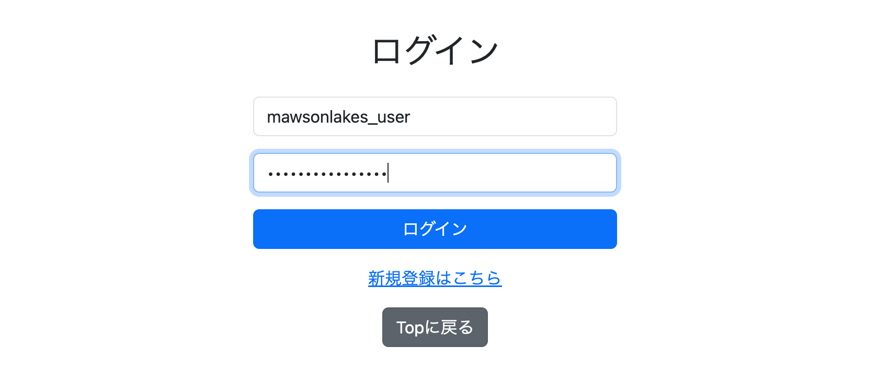
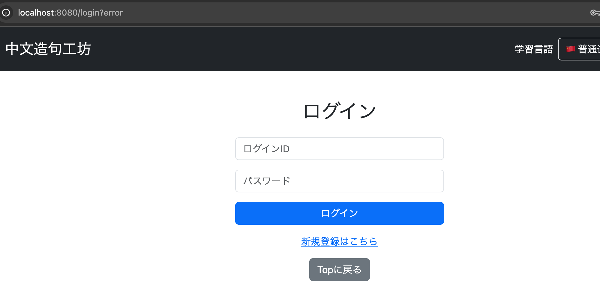
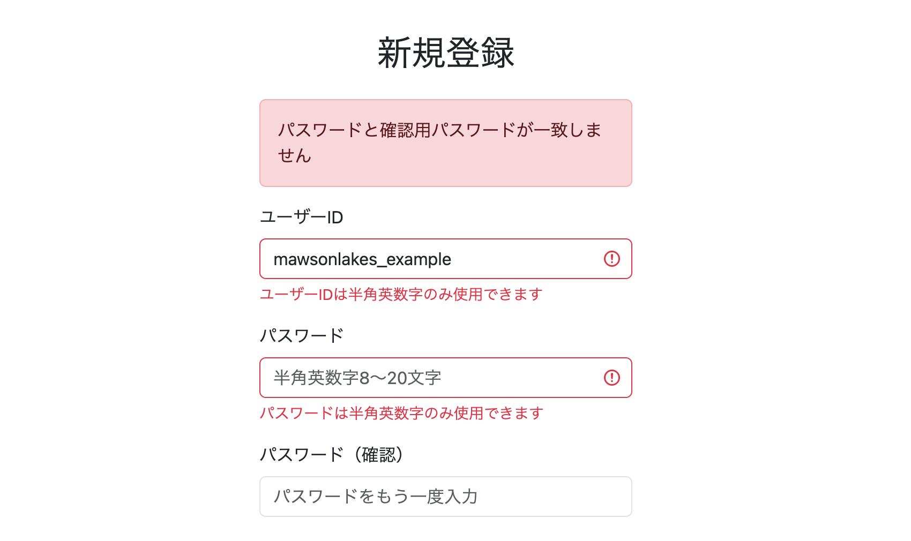
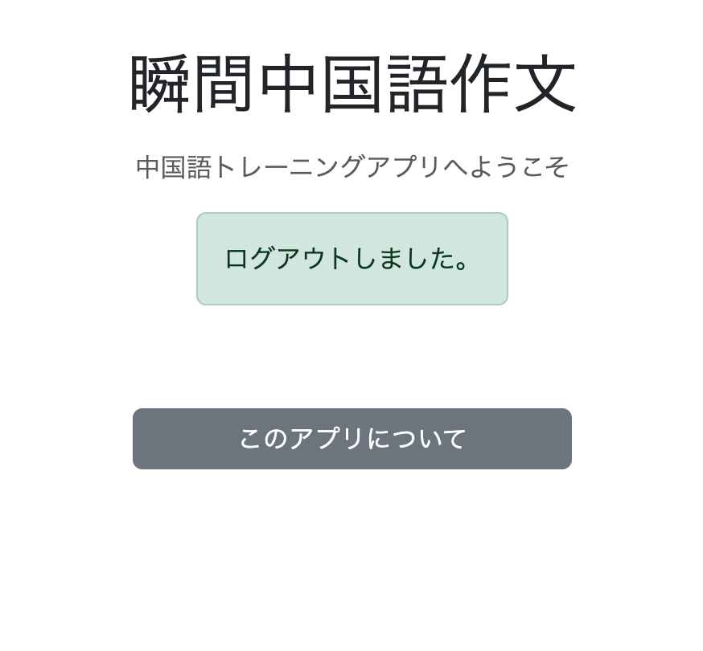
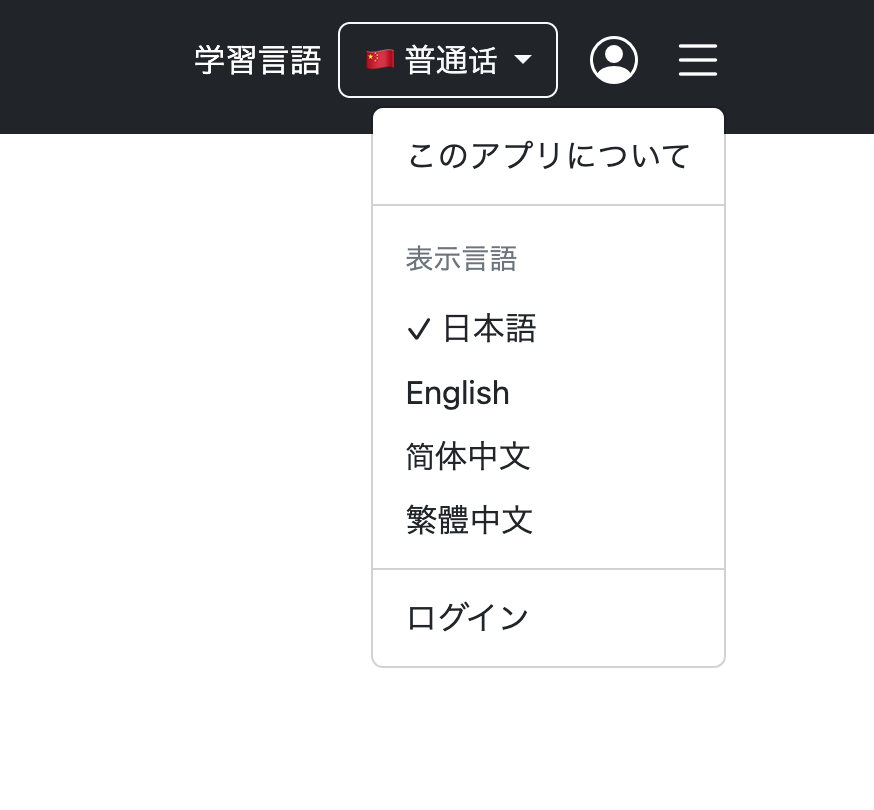
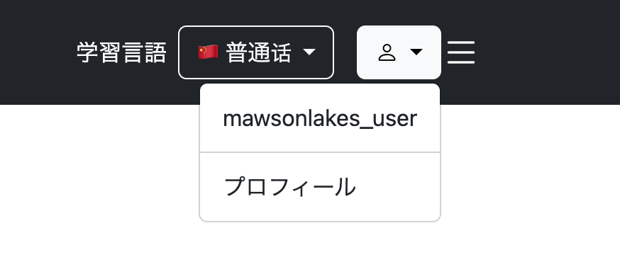
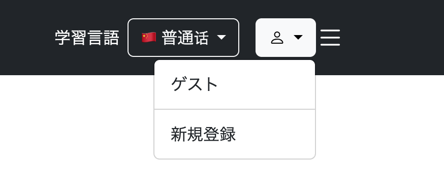
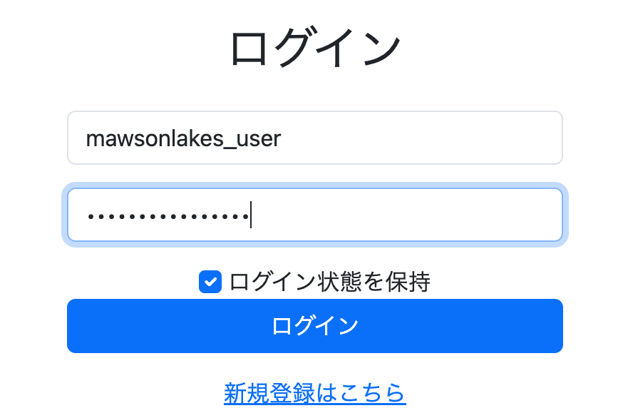
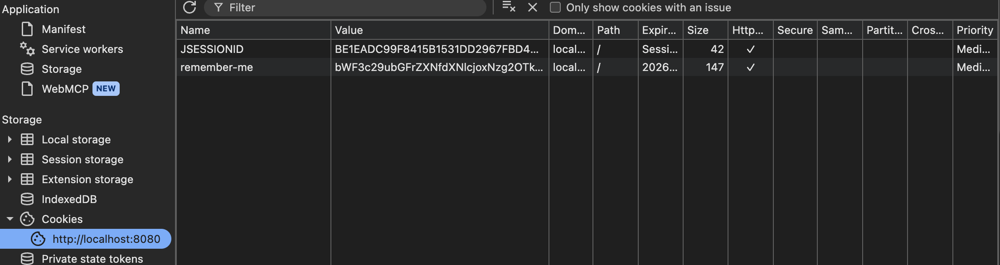

# 007 ログイン機能の実装

## 1. 基本的なログイン機能の実装

**Commit**

    git commit -m "feat: implement basic login authentication"

Spring Securityを使用した基本的なログイン機能を実装する。

### 準備① pom.xml

Spring Securityと、ThymeleafからSpring Securityの認証情報を扱うための拡張ライブラリを使用する。

```xml
<!-- Security -->
<dependency>
    <groupId>org.springframework.boot</groupId>
    <artifactId>spring-boot-starter-security</artifactId>
</dependency>

<!-- Thymeleaf拡張ライブラリ（セキュリティ） -->
<dependency>
    <groupId>org.thymeleaf.extras</groupId>
    <artifactId>thymeleaf-extras-springsecurity6</artifactId>
</dependency>
```

### 準備② application.yml

ログイン機能実装前に設定していたSpring Securityの自動設定除外を削除する。

```yaml
spring:
  autoconfigure:
    exclude:
      - org.springframework.boot.autoconfigure.security.servlet.SecurityAutoConfiguration
```

### SecurityConfig

アクセス制御、ログイン、ログアウトの基本設定を追加する。

```java
@Bean
SecurityFilterChain securityFilterChain(HttpSecurity http) throws Exception {
    
    // アクセス制御の設定
    http.authorizeHttpRequests(authorize -> authorize
            .requestMatchers(
                    PathRequest.toStaticResources().atCommonLocations()
            ).permitAll()
            .requestMatchers("/").permitAll()
            .requestMatchers("/login").permitAll()
            .requestMatchers("/practice/**").permitAll()
            .requestMatchers("/signup", "/signup/**").permitAll()
            .requestMatchers("/complete").permitAll()
            .anyRequest().authenticated()
        )
        
        // ログインの設定
        .formLogin(login -> login
            .loginPage("/login")
            .usernameParameter("loginId")
            .passwordParameter("password")
            .defaultSuccessUrl("/", false)
            .permitAll()
        )
        
        // ログアウトの設定
        .logout(logout -> logout
            .logoutUrl("/logout")
        );
    
    // CSRFを無効化
    http.csrf(csrf -> csrf.disable());
    
    return http.build();
}
```

`authorizeHttpRequests()` ではURLごとのアクセス制御を設定する。

```java
.requestMatchers(
        PathRequest.toStaticResources().atCommonLocations()
).permitAll()
```

CSSやJavaScriptなどの静的リソースへのアクセスを許可する。

```java
.requestMatchers("/").permitAll()
.requestMatchers("/login").permitAll()
.requestMatchers("/practice/**").permitAll()
.requestMatchers("/signup", "/signup/**").permitAll()
.requestMatchers("/complete").permitAll()
.anyRequest().authenticated()
```

指定したURLは未ログインでもアクセス可能とし、それ以外はログインを必須とする。

`formLogin()` ではフォームログインについて設定する。

```java
.loginPage("/login")
.usernameParameter("loginId")
.passwordParameter("password")
.defaultSuccessUrl("/", false)
```

- `/login` をログイン画面として使用
- ログインIDのパラメーター名を `loginId` に設定
- パスワードのパラメーター名を `password` に設定
- ログイン成功後の基本遷移先を `/` に設定

`logout()` ではログアウトについて設定する。

```java
.logout(logout -> logout
    .logoutUrl("/logout")
);
```

`/logout` へのリクエストでSpring Securityのログアウト処理を実行する。

この段階ではCSRF対策を一時的に無効化しておき、ログイン機能完成後に有効へ戻す。

### UserDetailsServiceImpl

Spring SecurityとDB上のユーザー情報をつなぐ `UserDetailsServiceImpl` を作成する。

```java
@Service
@RequiredArgsConstructor
public class UserDetailsServiceImpl implements UserDetailsService {
    
    private final UserAccountService userAccountService;
    
    @Override
    public UserDetails loadUserByUsername(String loginId)
            throws UsernameNotFoundException {
        
        // ユーザー情報取得
        Users loginUser = userAccountService.getUserOne(loginId);
        
        // ユーザーが存在しない場合
        if (loginUser == null) {
            throw new UsernameNotFoundException("user not found"); 
        }
        
        // ロールList作成
        GrantedAuthority authority =
                new SimpleGrantedAuthority(
                        "ROLE_" + loginUser.getRole().name()
                );

        List<GrantedAuthority> authorities = new ArrayList<>();
        authorities.add(authority);
        
        // UserDetails生成
        UserDetails userDetails = new User(
                loginUser.getLoginId(),
                loginUser.getPassword(),
                authorities
        );

        return userDetails;
    }
}
```

`loadUserByUsername()` は、Spring Securityが認証時にユーザー情報を取得するために呼び出すメソッド。

```java
Users loginUser = userAccountService.getUserOne(loginId);
```

ログイン画面から送られたログインIDをもとに、DBからユーザーを取得する。

```java
if (loginUser == null) {
    throw new UsernameNotFoundException("user not found"); 
}
```

ユーザーが存在しない場合は `UsernameNotFoundException` を発生させ、Spring Securityへユーザーが見つからなかったことを伝える。

```java
GrantedAuthority authority =
        new SimpleGrantedAuthority(
                "ROLE_" + loginUser.getRole().name()
        );

List<GrantedAuthority> authorities = new ArrayList<>();
authorities.add(authority);
```

DB上のユーザーが持つロールから、Spring Securityが扱う権限情報を作成する。

```java
UserDetails userDetails = new User(
        loginUser.getLoginId(),
        loginUser.getPassword(),
        authorities
);
```

取得したログインID、パスワード、権限を使って、Spring Securityが扱える `UserDetails` を生成する。

```java
return userDetails;
```

生成した `UserDetails` をSpring Securityへ返し、その情報を使って認証処理が続行される。

処理全体は以下の流れになる。

    Spring Security
        ↓
    UserDetailsServiceImpl
        ↓
    ログインIDからDBのユーザーを取得
        ↓
    ユーザーの権限を作成
        ↓
    UserDetailsを生成
        ↓
    Spring Securityへ返す

### UserAccountService

ログインIDからユーザーを取得する処理を追加する。

```java
@Service
@RequiredArgsConstructor
@Slf4j
public class UserAccountService {
    
    private final UserRepository userRepository;
    
    public Users getUserOne(String loginId) {

        log.debug("ユーザー検索 userId={}", loginId);

        return userRepository.findByLoginId(loginId)
                .orElse(null);
    }
}
```

### LoginController

ログイン画面を表示するControllerを追加する。

```java
@Controller
public class LoginController {

    @GetMapping("/login")
    public String getLogin() {
        
        return "/login";
    }
}
```

ログイン認証自体はSpring Securityが行うため、Controllerではログイン画面の表示のみ行う。

### login.html

ログイン画面を作成する。

```html
<!DOCTYPE html>
<html xmlns:th="http://www.thymeleaf.org"
      xmlns:layout="http://www.ultraq.net.nz/thymeleaf/layout"
      layout:decorate="~{layout/layout}">
<head>
    <meta charset="UTF-8">
    <title th:text="#{login.title}">ログイン</title>
</head>
<body>

    <div class="container mt-5" layout:fragment="content">

        <div class="row justify-content-center">
            <div class="col-md-6 col-lg-4">

                <form method="post" th:action="@{/login}">

                    <h2 class="text-center mb-4"
                        th:text="#{login.title}">
                        ログイン
                    </h2>

                    <!-- ログインID -->
                    <div class="mb-3">
                        <input type="text"
                               class="form-control"
                               th:placeholder="#{login.loginId}"
                               name="loginId">
                    </div>

                    <!-- パスワード -->
                    <div class="mb-3">
                        <input type="password"
                               class="form-control"
                               th:placeholder="#{login.password}"
                               name="password">
                    </div>

                    <!-- ログイン -->
                    <button type="submit"
                            class="btn btn-primary w-100"
                            th:text="#{login.button}">
                        ログイン
                    </button>

                    <!-- 新規登録 -->
                    <div class="text-center mt-3">
                        <a th:href="@{/signup}"
                           th:text="#{login.signup}">
                            新規登録はこちら
                        </a>
                    </div>

                    <!-- Topへ戻る -->
                    <div class="text-center mt-3">
                        <a th:href="@{/}"
                           class="btn btn-secondary"
                           th:text="#{login.backToTop}">
                            Topに戻る
                        </a>
                    </div>

                </form>

            </div>
        </div>

    </div>

</body>
</html>
```

### 各種messages.properties

```properties
login.title=ログイン
login.loginId=ログインID
login.password=パスワード
login.button=ログイン
login.signup=新規登録はこちら
login.backToTop=Topに戻る
```

他言語は省略。

### 実行

`http://localhost:8080/login` にアクセスして、既存アカウントのログインIDとパスワードを入力する。



ログインに成功すると遷移し、失敗すると `/login?error` とエラーを伴ってログイン画面に差し戻される。



---

## 2. ログイン失敗時の処理を追加

**Commit**

    git commit -m "feat: add login failure handling"

ログインに失敗した際、何も表示されない状態を改善し、エラーメッセージを表示する。

ログイン成功時については、そのままHome画面へ戻すため特別なメッセージは追加しない。

### SecurityConfig

`failureHandler` を追加する。

```java
.failureHandler(new AuthenticationFailureHandler() {
    @Override
    public void onAuthenticationFailure(
            HttpServletRequest request,
            HttpServletResponse response,
            AuthenticationException exception)
            throws IOException {

        HttpSession session = request.getSession(true);

        session.setAttribute(
                "loginErrorMessage",
                "login.error"
        );

        response.sendRedirect("/login");
    }
})
```

`failureHandler()` は、ログイン認証に失敗した場合の処理を設定する。

```java
new AuthenticationFailureHandler() {
```

認証失敗時の処理を定義する `AuthenticationFailureHandler` を、その場で実装する。

```java
public void onAuthenticationFailure(
        HttpServletRequest request,
        HttpServletResponse response,
        AuthenticationException exception)
        throws IOException
```

`onAuthenticationFailure()` は認証失敗時にSpring Securityから呼び出される。

ここでは、

- `request`：ブラウザから送られてきたHTTPリクエスト
- `response`：ブラウザへ返すHTTPレスポンス
- `exception`：認証失敗時に発生した例外

を受け取る。

```java
HttpSession session = request.getSession(true);
```

リクエストからSessionを取得する。

```java
session.setAttribute(
        "loginErrorMessage",
        "login.error"
);
```

Sessionにログインエラー用のメッセージキーを保存する。

```java
response.sendRedirect("/login");
```

ブラウザを `/login` へリダイレクトする。

そのため、ログイン失敗時は、

    認証失敗
        ↓
    failureHandler
        ↓
    Sessionにlogin.errorを保存
        ↓
    /loginへリダイレクト

という流れになる。

### LoginController

Sessionに保存したエラーメッセージをログイン画面へ渡す。

```java
@GetMapping("/login")
public String getLogin(Model model, HttpSession session) {
    
    String loginErrorMessage =
            (String) session.getAttribute("loginErrorMessage");

    if (loginErrorMessage != null) {
        model.addAttribute("loginErrorMessage", loginErrorMessage);
        session.removeAttribute("loginErrorMessage");
    }
    
    return "/login";
}
```

Sessionから `loginErrorMessage` を取得し、存在する場合はModelへ追加する。

Modelへ追加した後はSessionから削除し、ログイン失敗直後に一度だけ表示されるようにする。

### login.html

ログインエラーの表示領域を追加する。

```html
<!-- ログインエラー -->
<div class="text-danger mb-3"
     th:if="${loginErrorMessage}"
     th:text="#{__${loginErrorMessage}__}">
</div>
```

```html
th:if="${loginErrorMessage}"
```

`loginErrorMessage` が存在する場合のみエラー表示領域を表示する。

```html
th:text="#{__${loginErrorMessage}__}"
```

`loginErrorMessage` に格納されている値をメッセージキーとして使用する。

今回の場合は、

    loginErrorMessage
        ↓
    login.error
        ↓
    messages.properties
        ↓
    ログインIDまたはパスワードが正しくありません。

となる。

`__...__` は変数の値を先に展開するためのThymeleafのプリプロセッシング。

### 各messages.properties

```properties
login.error=ログインIDまたはパスワードが正しくありません。
```

他言語は省略。

### 実行

`http://localhost:8080/login` にアクセスしてログイン失敗を試すと、エラーメッセージとともにログイン画面へ差し戻される。



エラーメッセージ表示後にF5を押すと、Sessionからメッセージを削除しているため表示が消える。

---

## 3. ログアウト成功時の処理を追加

**Commit**

    git commit -m "feat: add logout success handling"

ログアウト成功後にHome画面へ戻し、「ログアウトしました。」と表示する。

### SecurityConfig

`logoutSuccessHandler` を追加する。

```java
.logoutSuccessHandler(new LogoutSuccessHandler() {
    @Override
    public void onLogoutSuccess(
            HttpServletRequest request,
            HttpServletResponse response,
            Authentication authentication)
            throws IOException {

        HttpSession session = request.getSession(true);
        session.setAttribute(
                "logoutMessage",
                "logout.success"
        );

        response.sendRedirect("/");
    }
})
```

`logoutSuccessHandler()` は、ログアウトが成功した後の処理を設定する。

```java
public void onLogoutSuccess(
        HttpServletRequest request,
        HttpServletResponse response,
        Authentication authentication)
        throws IOException
```

`onLogoutSuccess()` はログアウト成功時にSpring Securityから呼び出される。

ここでは、

- `request`：Sessionの取得
- `response`：リダイレクト
- `authentication`：ログアウトしたユーザーの認証情報

を扱える。今回は `authentication` は使用しない。

```java
HttpSession session = request.getSession(true);
session.setAttribute(
        "logoutMessage",
        "logout.success"
);
```

Sessionを取得し、ログアウト成功メッセージのキーを保存する。

```java
response.sendRedirect("/");
```

その後、Home画面へリダイレクトする。

処理の流れは以下になる。

    ログアウト成功
        ↓
    logoutSuccessHandler
        ↓
    Sessionにlogout.successを保存
        ↓
    /へリダイレクト

### HomeController

Sessionに保存されたログアウト成功メッセージを取得する。

```java
String logoutMessage =
        (String) session.getAttribute("logoutMessage");

if (logoutMessage != null) {
    model.addAttribute("logoutMessage", logoutMessage);
    session.removeAttribute("logoutMessage");
}
```

```java
String logoutMessage =
        (String) session.getAttribute("logoutMessage");
```

`SecurityConfig` でSessionに保存した `logoutMessage` を取得する。

```java
if (logoutMessage != null) {
    model.addAttribute("logoutMessage", logoutMessage);
    session.removeAttribute("logoutMessage");
}
```

メッセージが存在する場合はModelへ渡し、その後Sessionから削除する。

これによって、

    SecurityConfig
        ↓
    Sessionにメッセージを保存
        ↓
    HomeController
        ↓
    Sessionから取得
        ↓
    Modelへ追加
        ↓
    Sessionから削除
        ↓
    home.html

という流れで、ログアウト直後に一度だけメッセージを表示する。

### 各messages.properties

```properties
logout.success=ログアウトしました。
```

他言語は省略。

### home.html

```html
<div class="alert alert-success d-inline-block"
     th:if="${logoutMessage}"
     th:text="#{__${logoutMessage}__}">
</div>
```

### 実行

ログイン後にログアウトすると、Home画面にログアウト成功メッセージが表示される。



---

## 4. ログイン・ログアウトボタンの追加

**Commit**

    git commit -m "feat: add login and logout buttons to header"

ハンバーガーアイコン内に以下を追加する。

- ログイン中 → ログアウト
- 非ログイン中 → ログイン

### header.html

Spring SecurityのThymeleaf拡張を使用するため、名前空間を追加する。

```html
<html xmlns:th="http://www.thymeleaf.org"
      xmlns:sec="http://www.thymeleaf.org/extras/spring-security">
```

ハンバーガーメニュー内にログイン・ログアウトを追加する。

```html
<!-- 未ログイン時 -->
<li sec:authorize="isAnonymous()">
    <a class="dropdown-item"
       th:href="@{/login}"
       th:text="#{header.login}">
        ログイン
    </a>
</li>

<!-- ログイン時 -->
<li sec:authorize="isAuthenticated()">
    <form th:action="@{/logout}" method="post">
        <button type="submit"
                class="dropdown-item"
                th:text="#{header.logout}">
            ログアウト
        </button>
    </form>
</li>
```

### 各messages.properties

```properties
header.login=ログイン
header.logout=ログアウト
```

他言語は省略。

### 実行

ログイン中：


非ログイン中：



---

## 5. ヘッダーにユーザーIDを表示

**Commit**

    git commit -m "feat: add user dropdown menu to header"

ヘッダーのユーザーアイコンをクリックするとドロップダウンを表示する。

ログイン中：

- ユーザーID
- プロフィール

非ログイン中：

- ゲスト
- 新規登録

### header.html

```html
<!-- ユーザーアイコン -->
<button class="btn btn-outline-light dropdown-toggle"
        type="button"
        data-bs-toggle="dropdown"
        aria-expanded="false">
    <i class="bi bi-person"></i>
</button>

<ul class="dropdown-menu dropdown-menu-end">

    <!-- ログイン中：ユーザーID -->
    <li sec:authorize="isAuthenticated()">
        <span class="dropdown-item-text fw-bold"
              sec:authentication="name">
            userId
        </span>
    </li>

    <!-- 未ログイン：ゲスト -->
    <li sec:authorize="isAnonymous()">
        <span class="dropdown-item-text fw-bold"
              th:text="#{header.guest}">
            ゲスト
        </span>
    </li>

    <li><hr class="dropdown-divider"></li>

    <!-- ログイン中：プロフィール -->
    <li sec:authorize="isAuthenticated()">
        <a class="dropdown-item"
           th:href="@{/user/profile}"
           th:text="#{header.profile}">
            プロフィール
        </a>
    </li>

    <!-- 未ログイン：新規登録 -->
    <li sec:authorize="isAnonymous()">
        <a class="dropdown-item"
           th:href="@{/signup}"
           th:text="#{header.signup}">
            新規登録
        </a>
    </li>

</ul>
```

### 各messages.properties

```properties
header.guest=ゲスト
header.profile=プロフィール
header.signup=新規登録
```

他言語は省略。

### 実行

ログイン時：



非ログイン時：



---

## 6. Remember-Me認証の作成

**Commit**

    git commit -m "feat: add remember-me authentication"

Sessionが切れても自動的にログイン状態を維持するRemember-Me認証を実装する。

### login.html

```html
<!-- Remember-Me -->
<div class="form-group mt-3 text-center">
    <input class="form-check-input"
           type="checkbox"
           id="remember-me"
           name="remember-me">

    <label class="form-check-label"
           for="remember-me"
           th:text="#{login.rememberMe}">
        ログイン状態を保持
    </label>
</div>
```

### 各messages.properties

```properties
login.rememberMe=ログイン状態を保持
```

他言語は省略。

### SecurityConfig

```java
.rememberMe(remember -> remember
        .rememberMeParameter("remember-me")
        .tokenValiditySeconds(3600)
);
```

Remember-Me Cookieの有効期限は1時間（3600秒）に設定する。

### 実行

ログイン画面でRemember-Meのチェックボックスにチェックを入れてログインする。



ログイン後、開発者ツールの「Application」→「Cookies」を確認する。



`JSESSIONID` に加えて `remember-me` Cookieが作成されていることを確認した。

Sessionタイムアウト後にF5を押しても、ログイン中のみ表示されるボタンやリンクが残り、Remember-Me認証が機能していることを確認した。

---

## 7. CSRF対策

**Commit**

    git commit -m "security: enable CSRF protection"

Spring SecurityではCSRF対策がデフォルトで有効になっている。

これまでは実装途中のため無効化していたが、ログイン関連機能が完成したためCSRF対策を有効に戻す。

### SecurityConfig

以下のCSRF無効化設定をコメントアウトする。

```java
// CSRFを無効化
// http.csrf(csrf -> csrf.disable());
```

### signup.html

CSRFトークンを手動で明示する場合は以下のように記述できる。

```html
<!-- CSRF対策(手動で明示する場合必要)
<input type="hidden"
       th:name="${_csrf.parameterName}" 
       th:value="${_csrf.token}" />
-->
```

ただし今回はコメントアウトしたままとする。

`th:action` を使用すると、Spring Securityが必要とするCSRFトークンのhiddenパラメーターが自動的に追加されるため、手動で記述する必要はない。

現在POSTを使用している、

- `signup.html`：新規登録
- `login.html`：ログイン
- `header.html`：ログアウト

はいずれも `th:action` を使用している。

---

## 次回の実装

ログイン機能の基本実装が完了したため、一旦中断していた学習ページの実装に戻る。

次は、ログインしないと使用できない学習機能を実装する。