# 008 通常学習の実装 その3

新規登録機能とログイン機能が実装されたため、通常学習モードにログインユーザー向けの機能を追加する。

今回の実装では、以下の機能を追加する。

- 理解度を保存する機能
- お気に入り登録・解除機能
- 未学習問題から出題する機能

未学習問題から出題するためには、学習済み・未学習を判別できる状態になっている必要がある。

本アプリでは、問題に対して理解度を保存したことを「学習済み」とするため、理解度保存機能を実装した後に未学習問題から出題する機能を実装する。

---

## 1. 理解度を保存する機能

```bash
git commit -m "feat: add evaluation saving to practice"
```

ログインユーザーが各問題に対して `HARD`、`GOOD`、`EASY` の理解度を保存できるようにする。

理解度は `study_history` テーブルで管理し、ユーザーIDと問題IDの組み合わせを複合主キーとする。

### 1.1 StudyHistoryエンティティの作成

#### StudyHistory.java

```java
@Data
@Entity
@Table(name = "study_history")
public class StudyHistory {

    @EmbeddedId
    private StudyHistoryKey studyHistoryKey;

    @Enumerated(EnumType.STRING)
    @Column(nullable = false)
    private Evaluation evaluation;

    @Column(nullable = false)
    private LocalDateTime evaluationUpdatedAt;
}
```

`@EmbeddedId` を使用し、`StudyHistoryKey` を複合主キーとして使用する。

#### StudyHistoryKey.java

```java
@Embeddable
@Data
public class StudyHistoryKey implements Serializable {

    private Long userId;

    private Long questionId;
}
```

`userId` と `questionId` の組み合わせを複合主キーとする。

#### Evaluation.java

```java
public enum Evaluation {

    HARD,
    GOOD,
    EASY
}
```

理解度はEnumで管理する。

### 1.2 StudyHistoryRepositoryの作成

```java
public interface StudyHistoryRepository
        extends JpaRepository<StudyHistory, StudyHistoryKey> {

    Optional<StudyHistory> findByStudyHistoryKey(
            StudyHistoryKey studyHistoryKey);
}
```

理解度保存時にユーザーIDと問題IDの組み合わせがすでに存在するか確認する。

- 存在しない場合：INSERT
- 存在する場合：UPDATE

INSERTとUPDATEには `JpaRepository` の `save()` を使用する。

### 1.3 EvaluationServiceの作成

```java
@Service
@RequiredArgsConstructor
@Slf4j
public class EvaluationService {

    private final StudyHistoryRepository studyHistoryRepository;

    public void updateEvaluation(
            Users user,
            Long questionId,
            Evaluation evaluation) {

        StudyHistoryKey key = new StudyHistoryKey();
        key.setUserId(user.getId());
        key.setQuestionId(questionId);

        Optional<StudyHistory> optionalStudyHistory =
                studyHistoryRepository.findByStudyHistoryKey(key);

        if (optionalStudyHistory.isPresent()) {

            StudyHistory studyHistory =
                    optionalStudyHistory.get();

            studyHistory.setEvaluation(evaluation);
            studyHistory.setEvaluationUpdatedAt(LocalDateTime.now());

            studyHistoryRepository.save(studyHistory);

            log.info(
                    "評価更新(UPDATE) userId={}, questionId={}, evaluation={}",
                    user.getId(), questionId, evaluation);

        } else {

            StudyHistory studyHistory = new StudyHistory();

            studyHistory.setStudyHistoryKey(key);
            studyHistory.setEvaluation(evaluation);
            studyHistory.setEvaluationUpdatedAt(LocalDateTime.now());

            studyHistoryRepository.save(studyHistory);

            log.info(
                    "評価更新(INSERT) userId={}, questionId={}, evaluation={}",
                    user.getId(), questionId, evaluation);
        }
    }
}
```

ユーザーIDと問題IDから複合キーを作成し、既存データがあればUPDATE、存在しなければINSERTする。

同じ理解度を再度選択した場合も、その理解度と更新日時で上書きする。

### 1.4 Controllerに理解度保存処理を追加

```java
@PostMapping("/practice/evaluation")
public String postEvaluation(
        @AuthenticationPrincipal UserDetails loginUser,
        @RequestParam Long questionId,
        @RequestParam Evaluation evaluation,
        @RequestParam Integer page,
        HttpSession session) {

    Users user = userAccountService.getUserOne(
            loginUser.getUsername());

    evaluationService.updateEvaluation(
            user,
            questionId,
            evaluation);

    List<Question> questions =
            (List<Question>) session.getAttribute("practiceQuestions");

    if (page + 1 >= questions.size()) {
        return "redirect:/practice/complete";
    }

    return "redirect:/practice/question?page=" + (page + 1);
}
```

問題IDと理解度を受け取り、`EvaluationService` に保存処理を依頼する。

保存後は次の問題へ移動し、最後の問題の場合は完了画面へ移動する。

### 1.5 practice/question.htmlの修正

Spring Security用namespaceを追加する。

```html
<html xmlns:th="http://www.thymeleaf.org"
      xmlns:layout="http://www.ultraq.net.nz/thymeleaf/layout"
      xmlns:sec="http://www.thymeleaf.org/extras/spring-security"
      layout:decorate="~{layout/layout}">
```

ログインユーザーの場合のみ、解答部分に理解度ボタンを表示する。

```html
<div id="evaluationArea"
     sec:authorize="isAuthenticated()"
     class="mt-1 d-flex justify-content-center gap-5"
     style="display:none;">

    <!-- HARD -->
    <form th:action="@{/practice/evaluation}" method="post">

        <input type="hidden"
               name="questionId"
               th:value="${question.questionId}">

        <input type="hidden"
               name="evaluation"
               value="HARD">

        <input type="hidden"
               name="page"
               th:value="${nextPageIndex - 1}">

        <button type="submit"
                class="btn btn-danger btn-lg"
                th:text="#{practice.question.evaluation.hard}">
            Hard（難しかった）
        </button>

    </form>

    <!-- GOOD -->
    <form th:action="@{/practice/evaluation}" method="post">

        <input type="hidden"
               name="questionId"
               th:value="${question.questionId}">

        <input type="hidden"
               name="evaluation"
               value="GOOD">

        <input type="hidden"
               name="page"
               th:value="${nextPageIndex - 1}">

        <button type="submit"
                class="btn btn-primary btn-lg"
                th:text="#{practice.question.evaluation.good}">
            Good（少し考えた）
        </button>

    </form>

    <!-- EASY -->
    <form th:action="@{/practice/evaluation}" method="post">

        <input type="hidden"
               name="questionId"
               th:value="${question.questionId}">

        <input type="hidden"
               name="evaluation"
               value="EASY">

        <input type="hidden"
               name="page"
               th:value="${nextPageIndex - 1}">

        <button type="submit"
                class="btn btn-success btn-lg"
                th:text="#{practice.question.evaluation.easy}">
            Easy（余裕だった）
        </button>

    </form>

</div>
```

`messages.properties` に表示文言を追加する。

```properties
practice.question.evaluation.hard=Hard（難しかった）
practice.question.evaluation.good=Good（少し考えた）
practice.question.evaluation.easy=Easy（余裕だった）
```

### 実行

問題画面で理解度を選択する。

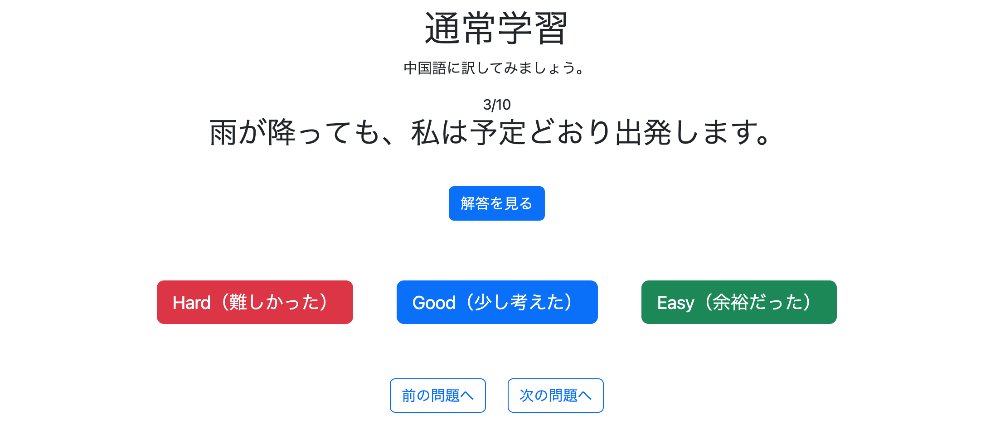

`study_history` テーブルを確認し、理解度がINSERTされていることを確認した。

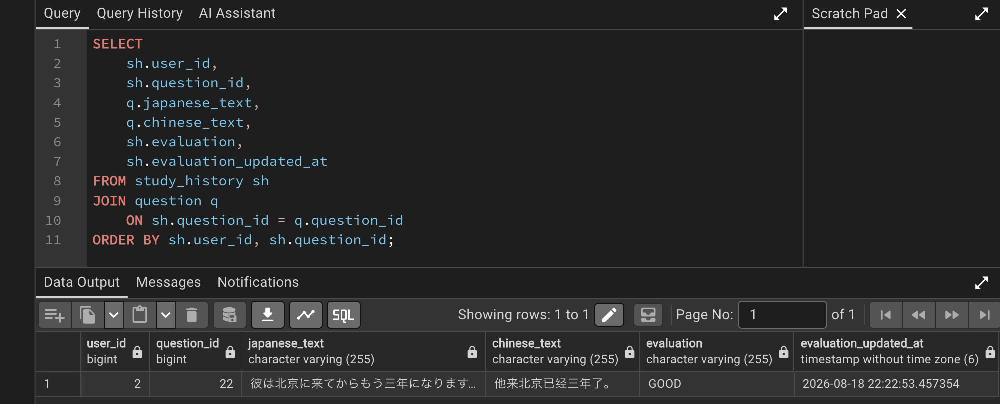

---

## 2. 解答表示時のレイアウトを修正

```bash
git commit -m "fix: prevent layout shift when showing practice answer"
```

解答の表示・非表示によって理解度ボタン以下の位置が変化していたため、解答領域の高さを調整する。

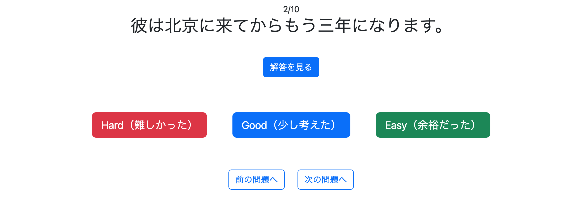

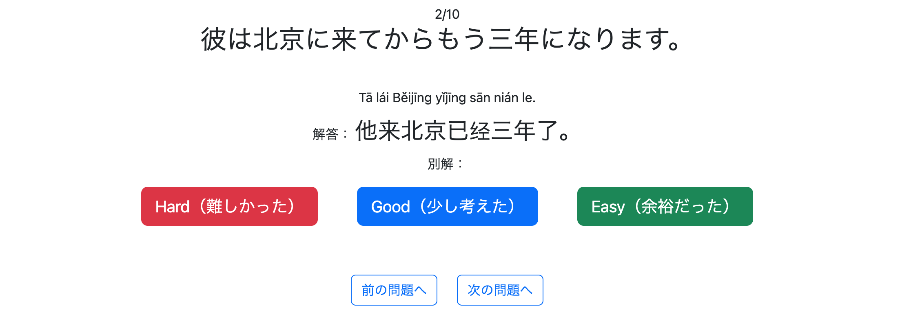

`practice/question.html` の解答領域を変更する。

```html
<div style="min-height:100px;">
```

↓

```html
<div style="min-height:150px;">
```

### 実行

解答の表示状態にかかわらず、下部のボタンの位置が揃うようになった。

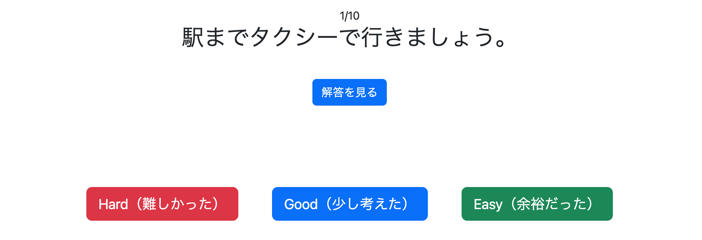

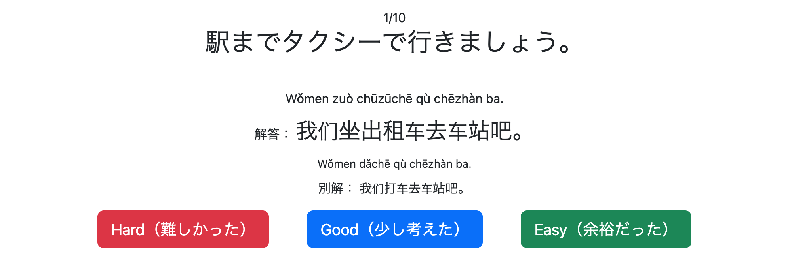

---

## 3. お気に入り登録機能の実装

```bash
git commit -m "feat: implement favorite registration and removal"
```

問題文の横にハートアイコンを追加し、ログインユーザーが問題をお気に入り登録・解除できるようにする。

お気に入りはユーザーIDと問題IDを複合主キーとして `favorite` テーブルで管理する。

ハートアイコンは以下の状態を表す。

- 白：お気に入り未登録
- 赤：お気に入り登録済み

### 3.1 Favoriteエンティティの作成

```java
@Data
@Entity
@Table(name = "favorite")
public class Favorite {

    @EmbeddedId
    private FavoriteKey favoriteKey;

    @ManyToOne
    @MapsId("userId")
    @JoinColumn(name = "user_id")
    private Users user;

    @ManyToOne
    @MapsId("questionId")
    @JoinColumn(name = "question_id")
    private Question question;
}
```

`FavoriteKey` を複合主キーとして使用する。

また、`Users` と `Question` との関連をEntity上で扱えるように `user` と `question` をフィールドとして持たせる。

`@MapsId` によって、それぞれの関連を `FavoriteKey` の `userId`、`questionId` に対応付ける。

#### FavoriteKey.java

```java
@Embeddable
@Data
public class FavoriteKey implements Serializable {

    private Long userId;

    private Long questionId;
}
```

ユーザーIDと問題IDの組み合わせを複合主キーとする。

### 3.2 FavoriteRepositoryの作成

```java
public interface FavoriteRepository
        extends JpaRepository<Favorite, FavoriteKey> {

    Optional<Favorite> findByFavoriteKey(
            FavoriteKey favoritesKey);
}
```

お気に入り状態を確認し、

- 未登録ならINSERT
- 登録済みならDELETE

を行えるようにする。

### 3.3 FavoriteServiceの作成

```java
@Transactional
@Service
@RequiredArgsConstructor
@Slf4j
public class FavoriteService {

    private final FavoriteRepository favoriteRepository;
    private final QuestionRepository questionRepository;

    public boolean toggleFavorite(Users user, long questionId) {

        FavoriteKey key = createFavoriteKey(user, questionId);

        Optional<Favorite> optionalFavorite =
                favoriteRepository.findByFavoriteKey(key);

        if (optionalFavorite.isEmpty()) {

            Question question =
                    questionRepository.getReferenceById(questionId);

            Favorite favorite = new Favorite();
            favorite.setFavoriteKey(key);
            favorite.setUser(user);
            favorite.setQuestion(question);

            favoriteRepository.save(favorite);

            log.info(
                    "お気に入り追加 userId={}, questionId={}",
                    user.getId(), questionId);

            return true;

        } else {

            favoriteRepository.deleteById(key);

            log.info(
                    "お気に入り解除 userId={}, questionId={}",
                    user.getId(), questionId);

            return false;
        }
    }

    public boolean isFavorite(Users user, long questionId) {

        FavoriteKey key = createFavoriteKey(user, questionId);

        return favoriteRepository.existsById(key);
    }

    private FavoriteKey createFavoriteKey(
            Users user,
            long questionId) {

        FavoriteKey key = new FavoriteKey();
        key.setUserId(user.getId());
        key.setQuestionId(questionId);

        return key;
    }
}
```

`toggleFavorite()` では現在の登録状態を確認し、未登録なら追加、登録済みなら削除する。

処理後の状態を `boolean` で返す。

`isFavorite()` は問題画面表示時に、その問題がお気に入り登録済みか判定するために使用する。

### 3.4 FavoriteControllerの作成

```java
@Controller
@RequiredArgsConstructor
public class FavoriteController {

    private final FavoriteService favoriteService;
    private final UserAccountService userAccountService;

    @PostMapping("/favorite/toggle")
    @ResponseBody
    public boolean toggleFavorite(
            @RequestParam Long questionId,
            @AuthenticationPrincipal UserDetails loginUser) {

        Users user =
                userAccountService.getUserOne(
                        loginUser.getUsername());

        return favoriteService.toggleFavorite(
                user,
                questionId);
    }
}
```

お気に入り操作ではページ遷移を行わず、JavaScriptからPOSTリクエストを送信する。

`@ResponseBody` を使用して、お気に入り操作後の状態をHTTPレスポンスとして返す。

- `true`：お気に入り登録済み
- `false`：お気に入り未登録

### 3.5 PracticeControllerの修正

現在表示している問題がお気に入り登録済みか確認する処理を追加する。

```java
Question question = questions.get(page);

if (loginUser != null) {

    boolean isFavorite = favoriteService.isFavorite(
            getLoginUser(loginUser),
            question.getQuestionId());

    model.addAttribute("isFavorite", isFavorite);
}
```

ログインユーザー取得処理を共通化する。

```java
private Users getLoginUser(UserDetails loginUser) {

    return userAccountService.getUserOne(
            loginUser.getUsername());
}
```

### 3.6 practice/question.htmlの修正

JavaScriptからPOSTする際にCSRFトークンを付与できるよう、head部に追加する。

```html
<meta name="_csrf" th:content="${_csrf.token}">
<meta name="_csrf_header" th:content="${_csrf.headerName}">
```

問題文付近にお気に入りボタンを追加する。

```html
<div sec:authorize="isAuthenticated()">

    <button type="button"
            class="favoriteButton btn p-0 border-0 bg-transparent"
            th:data-question-id="${question.questionId}">

        <i th:class="${isFavorite}
            ? 'bi bi-heart-fill fs-2 text-danger'
            : 'bi bi-heart fs-2 text-secondary'">
        </i>

    </button>

</div>
```

`isFavorite` によって初期表示時のハートアイコンを切り替える。

### 3.7 favorite.jsの追加

```javascript
// =========================
// お気に入り登録・解除
// =========================
const favoriteButtons =
    document.querySelectorAll(".favoriteButton");

favoriteButtons.forEach(function(button) {

    button.addEventListener("click", function() {

        const questionId =
            button.dataset.questionId;

        const favoriteIcon =
            button.querySelector("i");

        const csrfToken =
            document.querySelector(
                'meta[name="_csrf"]'
            ).content;

        const csrfHeader =
            document.querySelector(
                'meta[name="_csrf_header"]'
            ).content;

        fetch("/favorite/toggle", {

            method: "POST",

            headers: {
                "Content-Type":
                    "application/x-www-form-urlencoded",

                [csrfHeader]:
                    csrfToken
            },

            body:
                "questionId=" +
                encodeURIComponent(questionId)
        })
        .then(function(response) {

            if (!response.ok) {
                throw new Error("お気に入り更新失敗");
            }

            return response.text();
        })
        .then(function(result) {

            if (result === "true") {

                favoriteIcon.classList.remove(
                    "bi-heart",
                    "text-secondary"
                );

                favoriteIcon.classList.add(
                    "bi-heart-fill",
                    "text-danger"
                );

            } else {

                favoriteIcon.classList.remove(
                    "bi-heart-fill",
                    "text-danger"
                );

                favoriteIcon.classList.add(
                    "bi-heart",
                    "text-secondary"
                );
            }
        })
        .catch(function(error) {

            console.error(error);
        });
    });
});
```

問題IDを `/favorite/toggle` へPOSTし、レスポンスの `true` / `false` に応じてハートアイコンを切り替える。

### 実行

問題画面にハートアイコンが表示されることを確認した。


クリックすると赤色のハートに切り替わる。


DBを確認し、お気に入りが登録されていることを確認した。

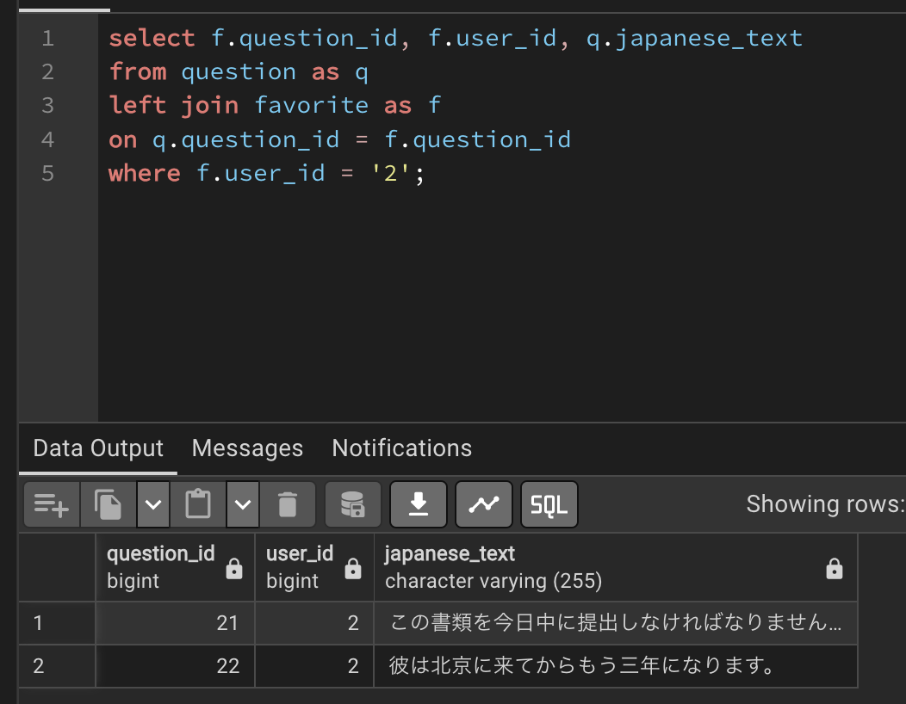

再度クリックすると白色に戻り、DBからもお気に入りが削除されることを確認した。

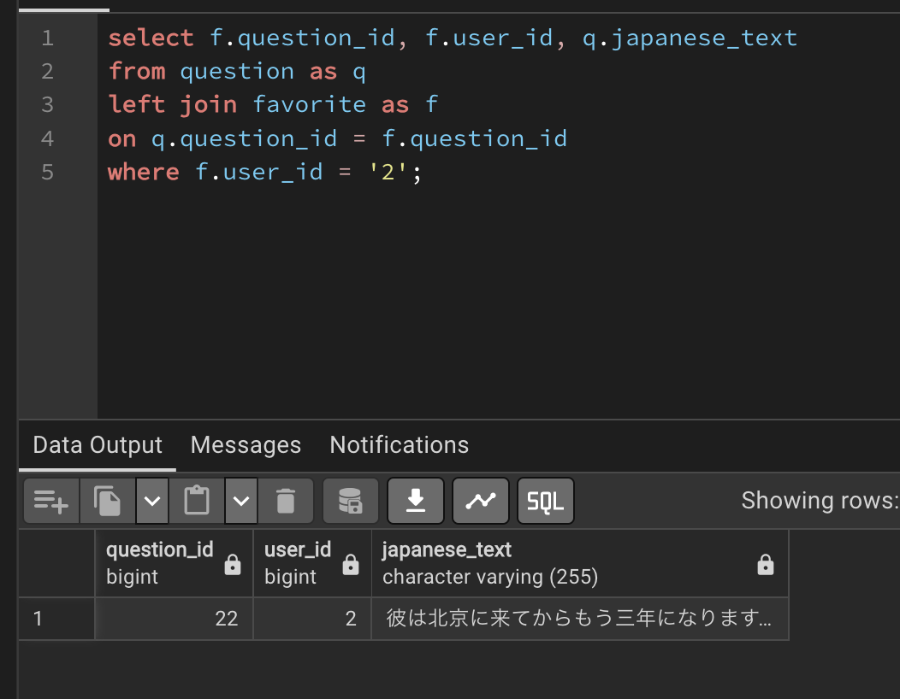

---

## 4. 未学習問題から出題する機能

```bash
git commit -m "feat: add unlearned question practice mode"
```

`study_history` テーブルに対象ユーザーの学習履歴が存在しない問題を未学習問題として取得し、未学習問題のみをトレーニングできるようにする。

難易度による絞り込みにも対応する。

### 4.1 QuestionRepositoryの修正

未学習問題を取得するクエリを追加する。

```java
@Query(value = """
        SELECT q.*
        FROM question q
        LEFT JOIN study_history sh
          ON q.question_id = sh.question_id
         AND sh.user_id = :userId
        WHERE q.difficulty IN (:difficulties)
          AND sh.question_id IS NULL
        """, nativeQuery = true)
List<Question> findUnlearnedQuestionsByUserIdAndDifficulty(
        @Param("userId") Long userId,
        @Param("difficulties") List<String> difficulties);
```

`study_history` をLEFT JOINし、対象ユーザーの学習履歴が存在しない問題のみを取得する。

難易度は複数選択できるため、`List<String>` で受け取る。

難易度ごとの未学習問題数を取得するクエリも追加する。

```java
@Query(value = """
        SELECT COUNT(*)
        FROM question q
        LEFT JOIN study_history sh
          ON q.question_id = sh.question_id
         AND sh.user_id = :userId
        WHERE q.difficulty IN (:difficulties)
          AND sh.question_id IS NULL
        """, nativeQuery = true)
long countNewQuestions(
        @Param("userId") Long userId,
        @Param("difficulties") String difficulties);
```

こちらは難易度ごとの件数を個別に取得するため、難易度を `String` で受け取る。

### 4.2 PracticeServiceの修正

未学習問題を取得する処理を追加する。

```java
public List<Question> getNewQuestions(
        Long userId,
        List<Difficulty> difficulty) {

    List<Question> extractedNewQuestions =
            questionRepository
                    .findUnlearnedQuestionsByUserIdAndDifficulty(
                            userId,
                            searchConditionConverter
                                    .convertDifficulty(difficulty));

    return extractedNewQuestions;
}
```

各難易度の未学習問題数を取得する処理も追加する。

```java
public NewPracticeCountDto countNewPracticeQuestions(
        Long userId) {

    NewPracticeCountDto count =
            new NewPracticeCountDto();

    long beginnerCount =
            questionRepository.countNewQuestions(
                    userId,
                    Difficulty.BEGINNER.name());

    count.setBeginnerCount(beginnerCount);

    long intermediateCount =
            questionRepository.countNewQuestions(
                    userId,
                    Difficulty.INTERMEDIATE.name());

    count.setIntermediateCount(intermediateCount);

    long advancedCount =
            questionRepository.countNewQuestions(
                    userId,
                    Difficulty.ADVANCED.name());

    count.setAdvancedCount(advancedCount);

    return count;
}
```

### 4.3 SearchConditionConverterの追加

native SQLへ渡すため、`List<Difficulty>` をDB上の値に対応する `List<String>` へ変換する。

```java
public class SearchConditionConverter {

    public List<String> convertDifficulty(
            List<Difficulty> difficulties) {

        List<String> difficultyList;

        if (difficulties == null || difficulties.isEmpty()) {

            difficultyList = List.of(
                    Difficulty.BEGINNER.name(),
                    Difficulty.INTERMEDIATE.name(),
                    Difficulty.ADVANCED.name());

        } else {

            difficultyList = new ArrayList<>();

            for (Difficulty difficulty : difficulties) {
                difficultyList.add(difficulty.name());
            }
        }

        return difficultyList;
    }
}
```

難易度が指定されていない場合は、すべての難易度を検索対象とする。

### 4.4 NewPracticeCountDtoの作成

```java
@Data
public class NewPracticeCountDto {

    private long beginnerCount;
    private long intermediateCount;
    private long advancedCount;
}
```

各難易度の未学習問題数をまとめて画面へ渡す。

### 4.5 PracticeControllerの修正

`/practice/menu` を表示するとき、ログインユーザーの場合のみ未学習問題数を取得する。

```java
// 通常問題数を取得
PracticeMenuDto menu =
        practiceService.countPracticeQuestions(languageVariant);

model.addAttribute("practiceMenu", menu);

// 未学習問題数を取得
if (loginUser != null) {

    Users user = getLoginUser(loginUser);

    NewPracticeCountDto count =
            practiceService.countNewPracticeQuestions(
                    user.getId());

    model.addAttribute("newQuestionCount", count);
}
```

未学習問題トレーニングを開始するエンドポイントを追加する。

```java
@GetMapping("/practice/new/start")
public String getPracticeNewStart(
        HttpSession session,
        @AuthenticationPrincipal UserDetails loginUser,
        @RequestParam(
                name = "difficulties",
                required = false)
        List<Difficulty> difficulty) {

    // 既存の学習状態を破棄
    clearStudySession(session);

    List<Question> questions;

    Users user = getLoginUser(loginUser);
    Long userId = user.getId();

    // 問題セットを取得
    questions =
            practiceService.getNewQuestions(
                    userId,
                    difficulty);

    if (questions.isEmpty()) {
        return "redirect:/practice/menu";
    }

    session.setAttribute(
            "practiceQuestions",
            questions);

    session.setAttribute(
            "practiceCurrentPage",
            0);

    return "redirect:/study/question?page=0";
}
```

既存の学習状態を破棄した後、選択された難易度を条件として未学習問題を取得し、問題一覧をセッションへ保存する。

### 4.6 practice/menu.htmlの修正

Spring Security用namespaceを追加する。

```html
<html xmlns:th="http://www.thymeleaf.org"
      xmlns:sec="http://www.thymeleaf.org/extras/spring-security">
```

ログインユーザー向けに未学習問題トレーニングの選択欄を追加する。

```html
<!-- ============================= -->
<!-- 未学習トレーニング（ログインユーザーのみ） -->
<!-- ============================= -->
<div sec:authorize="isAuthenticated()" class="mt-3">

    <div class="card mb-3">

        <div class="card-body">

            <div class="d-flex align-items-center gap-3 mb-2">

                <h3>
                    <i class="bi bi-stars me-2 text-primary">

                        <span th:text="#{practice.menu.unstudied.title}">
                        </span>

                    </i>

                    未学習の問題のみトレーニング
                </h3>

                <p class="mb-0 text-muted">

                    <span th:text="#{practice.menu.unstudied.description}">
                    </span>

                </p>

            </div>

            <form th:action="@{/study/new/start}" method="get">

                <div class="d-flex gap-3 mb-3">

                    <label class="bg-danger-subtle rounded px-3 py-2">

                        <input class="form-check-input me-2"
                               type="checkbox"
                               name="difficulties"
                               value="BEGINNER">

                        <span th:text="#{practice.menu.difficulty.beginner(${newQuestionCount.beginnerCount})}">
                            初級 : 0問
                        </span>

                    </label>

                    <label class="bg-primary-subtle rounded px-3 py-2">

                        <input class="form-check-input me-2"
                               type="checkbox"
                               name="difficulties"
                               value="INTERMEDIATE">

                        <span th:text="#{practice.menu.difficulty.intermediate(${newQuestionCount.intermediateCount})}">
                            中級 : 0問
                        </span>

                    </label>

                    <label class="bg-success-subtle rounded px-3 py-2">

                        <input class="form-check-input me-2"
                               type="checkbox"
                               name="difficulties"
                               value="ADVANCED">

                        <span th:text="#{practice.menu.difficulty.advanced(${newQuestionCount.advancedCount})}">
                            上級 : 0問
                        </span>

                    </label>

                </div>

                <div class="text-center">

                    <button type="submit"
                            class="btn btn-primary btn-lg px-5"
                            th:text="#{practice.menu.start}">
                        出題開始
                    </button>

                </div>

            </form>

        </div>

    </div>

</div>
```

既存の未ログインユーザー向けメニューには、

```html
sec:authorize="isAnonymous()"
```

を指定し、未ログイン時のみ表示する。

### 実行

ログイン状態で `/practice/menu` にアクセスすると、未学習問題トレーニングと各難易度の未学習問題数が表示された。

今回は未学習問題が14問ある中級を選択する。

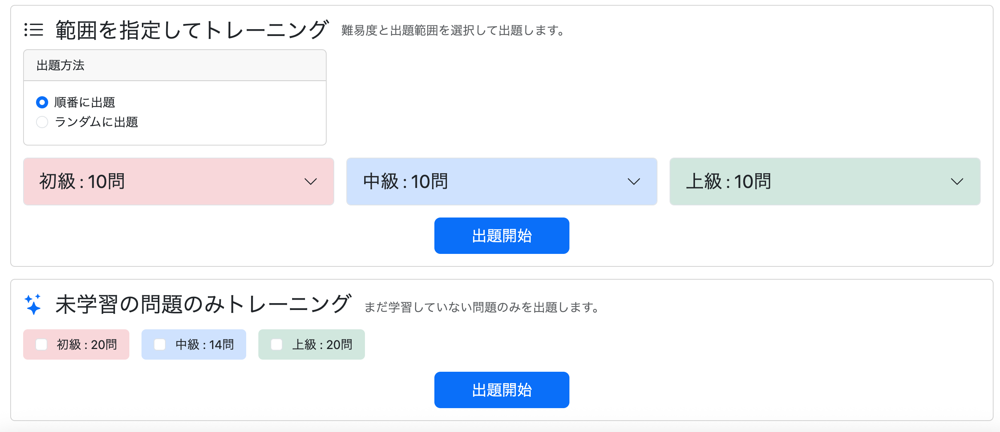

開始すると、14問のみが出題された。

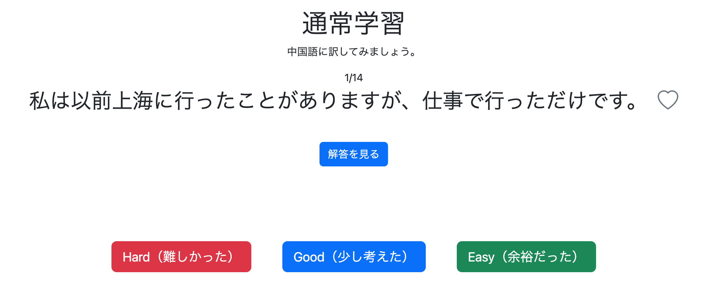

そのうち1問に理解度を保存して学習を終了し、再度 `/practice/menu` を開くと、中級の未学習問題数が13問に減っていることを確認した。

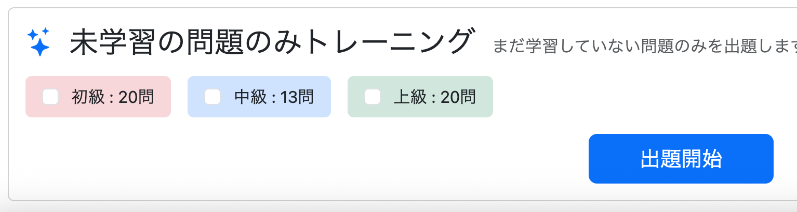

---

## 5. 別解が存在しない場合の表示を修正

```bash
git commit -m "fix: hide alternative answer section when no alternative exists"
```

別解が設定されていない問題でも「別解：」が表示されていたため修正する。

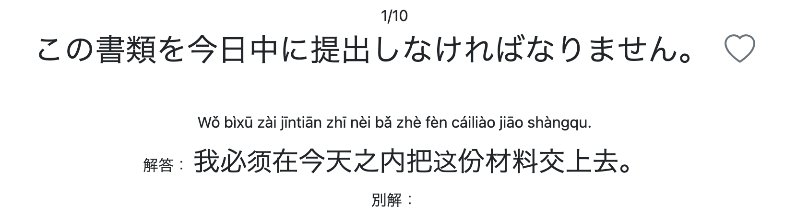

原因は、外側の `<p>` の内部に別の `<p>` を配置していたことである。

HTMLでは `<p>` の中に別の `<p>` を配置できないため、ブラウザによって外側の `<p>` が自動的に閉じられ、`th:if` が別解表示部分全体を囲めていなかった。

外側の要素を `<div>` に変更する。

```html
<!-- 別解 -->
<div th:if="${question.alternativeAnswer != null}">

    <p class="mb-2"
       th:if="${alternativePronunciation != null}">

        <span class="small"
              th:text="${alternativePronunciation}">
            Alternative Pronunciation
        </span>

    </p>

    <p class="mb-0">

        <span th:text="#{practice.question.alternativeAnswer}">
            別解：
        </span>

        <span th:text="${question.alternativeAnswer}">
            Alternative Answer
        </span>

    </p>

</div>
```

### 実行

別解が存在しない問題では「別解：」を含めて何も表示されなくなった。

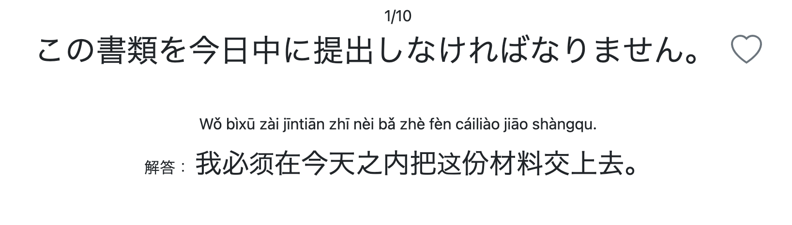

---

## 6. 問題画面下部の余白を調整

```bash
git commit -m "fix: reduce spacing between practice navigation and action buttons"
```

「次へ・前へ」ボタンと「中断・やめる」ボタンの間隔が広く、問題画面全体が1画面内に収まっていなかった。

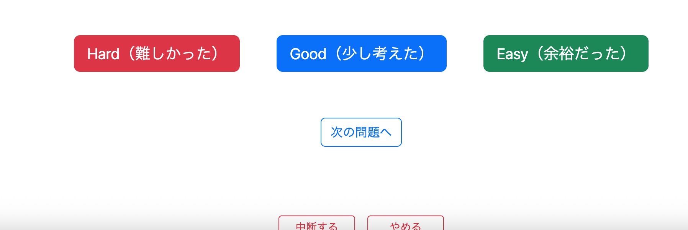

`practice/question.html` の余白を変更する。

```html
<!-- 学習中断・終了 -->
<div class="d-flex justify-content-center gap-3"
     style="margin-top:90px;">
```

↓

```html
<!-- 学習中断・終了 -->
<div class="d-flex justify-content-center gap-3"
     style="margin-top:40px;">
```

### 実行

ボタン間の余白が縮まり、問題画面全体が1画面内に収まるようになった。

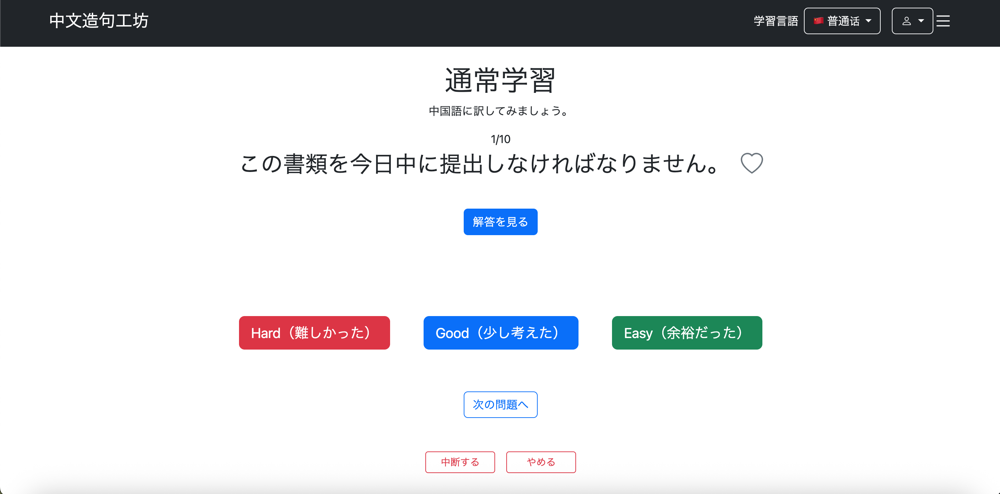