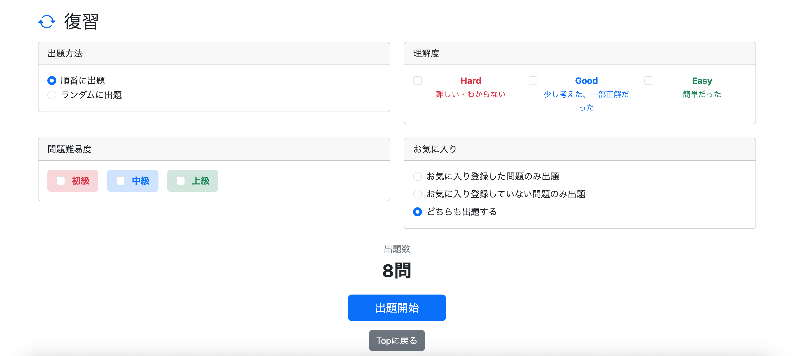
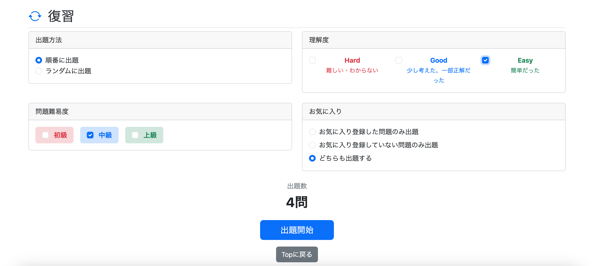

# 009 復習モードの実装 その1

## 概要

復習モードの実装を開始した。

復習モードでは、`study_history` に学習履歴が保存されている問題を対象として、ユーザーが指定した条件に該当する問題を出題する。

今回は出題処理そのものではなく、`/review/menu` で検索条件を指定し、その条件に該当する復習問題数を表示するところまで実装した。

通常学習ではメニュー表示時点で問題範囲と問題数を表示しているが、復習モードではユーザーが検索条件を変更するたびに対象問題数を再取得する構成とした。:contentReference[oaicite:0]{index=0}

今回使用する検索条件は以下の3種類。

- 難易度
- 理解度
- お気に入り状態

---

# 1. お気に入り検索条件を追加

## FavoriteCondition.java

お気に入り状態による絞り込みに使用するEnumを作成した。

```java
public enum FavoriteCondition {
    ALL,
    FAVORITED,
    NOT_FAVORITED
}
```

それぞれ以下の意味で使用する。

| 値 | 内容 |
|---|---|
| `ALL` | お気に入り登録の有無に関係なく出題 |
| `FAVORITED` | お気に入り登録済みの問題のみ出題 |
| `NOT_FAVORITED` | お気に入り未登録の問題のみ出題 |

---

# 2. 復習対象問題数を取得するクエリを追加

## StudyHistoryRepository.java

復習対象となる問題数を取得する `countReviewQuestions()` を追加した。

難易度と理解度については複数選択に対応するため、`IN` を使用する。

```sql
sh.evaluation IN (:evaluations)
q.difficulty IN (:difficulties)
```

お気に入りについては、`study_history` と `favorite` を `LEFT JOIN` する。

```sql
LEFT JOIN favorite f
  ON sh.user_id = f.user_id
 AND sh.question_id = f.question_id
```

これにより、

- お気に入り登録済み → `f.question_id IS NOT NULL`
- お気に入り未登録 → `f.question_id IS NULL`

として判定できる。:contentReference[oaicite:1]{index=1}

実装したクエリは以下。

```java
@Query(value = """
        SELECT COUNT(*)
        FROM study_history sh
        JOIN question q
        ON sh.question_id = q.question_id
        LEFT JOIN favorite f
        ON sh.user_id = f.user_id
        AND sh.question_id = f.question_id
        WHERE sh.user_id = :userId
        AND sh.evaluation IN (:evaluations)
        AND q.difficulty IN (:difficulties)
        AND (:favoriteCondition = 'ALL'
            OR (:favoriteCondition = 'FAVORITED'
                AND f.question_id IS NOT NULL)
            OR (:favoriteCondition = 'NOT_FAVORITED'
                AND f.question_id IS NULL)
        )
        """, nativeQuery = true)
long countReviewQuestions(
        @Param("userId") Long userId,
        @Param("evaluations") List<String> evaluations,
        @Param("difficulties") List<String> difficulties,
        @Param("favoriteCondition") String favoriteCondition
);
```

`ALL` の場合はお気に入り状態による絞り込みを行わず、`FAVORITED` と `NOT_FAVORITED` の場合のみ `favorite` のレコードの有無を判定する。:contentReference[oaicite:2]{index=2}

---

# 3. 検索条件をStringへ変換

## SearchConditionConverter.java

RepositoryではネイティブクエリへDB上の値を渡すため、画面から受け取ったEnumをStringへ変換する。

既存の難易度変換に加えて、理解度とお気に入り条件の変換処理を追加した。

### 理解度

```java
public List<String> convertEvaluation(List<Evaluation> evaluations) {

    List<String> evaluationList;

    if (evaluations == null || evaluations.isEmpty()) {

        evaluationList = List.of(
                Evaluation.HARD.name(),
                Evaluation.GOOD.name(),
                Evaluation.EASY.name());

    } else {

        evaluationList = new ArrayList<>();

        for (Evaluation evaluation : evaluations) {
            evaluationList.add(evaluation.name());
        }
    }

    return evaluationList;
}
```

何も選択されていない場合は、`HARD`、`GOOD`、`EASY` のすべてを検索対象とする。

### お気に入り

```java
public String convertFavoriteCondition(
        FavoriteCondition favoriteCondition) {

    String convertedFavoriteCondition;

    if (favoriteCondition == null) {

        convertedFavoriteCondition =
                FavoriteCondition.ALL.name();

    } else {

        convertedFavoriteCondition =
                favoriteCondition.name();
    }

    return convertedFavoriteCondition;
}
```

お気に入り条件が指定されていない場合は `ALL` として扱う。:contentReference[oaicite:3]{index=3}

---

# 4. 復習対象問題数を取得するServiceを追加

## ReviewService.java

`ReviewService` に復習対象問題数を取得する処理を追加した。

```java
@Service
@RequiredArgsConstructor
public class ReviewService {

    private final StudyHistoryRepository studyHistoryRepository;
    private final SearchConditionConverter searchConditionConverter;

    // 復習出題数取得
    public long countReviewQuestions(
            Long userId,
            List<Evaluation> evaluations,
            List<Difficulty> difficulties,
            FavoriteCondition favoriteCondition) {

        List<String> convertedDifficulties =
                searchConditionConverter
                        .convertDifficulty(difficulties);

        List<String> convertedEvaluations =
                searchConditionConverter
                        .convertEvaluation(evaluations);

        String convertedFavoriteCondition =
                searchConditionConverter
                        .convertFavoriteCondition(favoriteCondition);

        return studyHistoryRepository.countReviewQuestions(
                userId,
                convertedEvaluations,
                convertedDifficulties,
                convertedFavoriteCondition
        );
    }
}
```

Controllerから受け取ったEnumを `SearchConditionConverter` で変換し、Repositoryへ渡す。:contentReference[oaicite:4]{index=4}

---

# 5. 復習メニュー用Controllerを実装

## ReviewController.java

`ReviewController` では、復習メニューを表示する処理と、検索条件に応じた問題数を返す処理を用意する。

### `/review/menu`

```java
@GetMapping("/review/menu")
public String getReviewMenu(
        HttpSession session,
        Model model) {

    List<Question> questions =
            (List<Question>) session.getAttribute(
                    "reviewQuestions");

    Integer currentPage =
            (Integer) session.getAttribute(
                    "reviewCurrentPage");

    boolean canResume =
            questions != null && currentPage != null;

    model.addAttribute("canResume", canResume);

    if (canResume) {

        model.addAttribute(
                "currentPage",
                currentPage);

        model.addAttribute(
                "totalCount",
                questions.size());
    }

    return "review/menu";
}
```

中断中の復習データがSessionに残っている場合は、現在のページと総問題数を画面へ渡す。

### `/review/count`

検索条件に該当する問題数を返すため、`@ResponseBody` を使用したGET処理を追加する。

```java
@GetMapping("/review/count")
@ResponseBody
public long getReviewCount(
        @AuthenticationPrincipal UserDetails loginUser,
        @RequestParam(
                name = "evaluations",
                required = false)
        List<Evaluation> evaluations,
        @RequestParam(
                name = "difficulties",
                required = false)
        List<Difficulty> difficulties,
        @RequestParam(
                name = "favoriteCondition",
                required = false)
        FavoriteCondition favoriteCondition) {

    Users user = getLoginUser(loginUser);
    Long userId = user.getId();

    return reviewService.countReviewQuestions(
            userId,
            evaluations,
            difficulties,
            favoriteCondition);
}
```

`/review/menu` は画面そのものを返し、`/review/count` はJavaScriptから呼び出して問題数だけを返す構成とした。

---

# 6. 復習メニュー画面を作成

## `/review/menu.html`

復習メニューでは以下の項目を選択できるようにした。

### 出題方法

- 順番に出題
- ランダムに出題

### 理解度

- `HARD`
- `GOOD`
- `EASY`

### 問題難易度

- `BEGINNER`
- `INTERMEDIATE`
- `ADVANCED`

### お気に入り

- お気に入り登録した問題のみ
- お気に入り登録していない問題のみ
- どちらも出題

お気に入りの初期値は `ALL` とする。

```html
<label class="form-check">

    <input class="form-check-input"
           type="radio"
           name="favoriteCondition"
           value="ALL"
           checked>

    <span class="form-check-label"
          th:text="#{review.menu.favorite.all}">
        どちらも出題する
    </span>

</label>
```

出題方法、理解度、難易度、お気に入りの選択肢には `label` を使用し、チェックボックスやラジオボタンだけでなくテキスト部分をクリックしても選択できるようにした。:contentReference[oaicite:5]{index=5} :contentReference[oaicite:6]{index=6}

画面下部には現在の検索条件に該当する問題数を表示する領域を用意する。

```html
<div class="text-center mb-4">

    <div class="text-secondary mb-2"
         th:text="#{review.menu.count}">
        出題数
    </div>

    <h2 class="fw-bold"
        id="countReviewQuestions">
        -
    </h2>

</div>
```

表示テキストは `messages.properties` で管理し、多言語表示に対応させた。

---

# 7. 検索条件変更時に問題数を更新

## `/js/review.js`

検索条件を変更するたびに `/review/count` を呼び出し、現在の条件に該当する問題数を表示する。

```javascript
document.addEventListener("DOMContentLoaded", () => {

    // 検索条件
    const searchConditions = document.querySelectorAll(
        "input[name='evaluations'], " +
        "input[name='difficulties'], " +
        "input[name='favoriteCondition']"
    );

    // 出題数表示
    const countArea =
        document.getElementById("countReviewQuestions");

    // 件数取得
    async function updateCount() {

        const params = new URLSearchParams();

        // 理解度
        document
            .querySelectorAll(
                "input[name='evaluations']:checked")
            .forEach(cb => {
                params.append(
                    "evaluations",
                    cb.value);
            });

        // 難易度
        document
            .querySelectorAll(
                "input[name='difficulties']:checked")
            .forEach(cb => {
                params.append(
                    "difficulties",
                    cb.value);
            });

        // お気に入り条件
        params.append(
            "favoriteCondition",
            document.querySelector(
                "input[name='favoriteCondition']:checked"
            ).value
        );

        const response =
            await fetch("/review/count?" + params);

        const count =
            await response.text();

        countArea.textContent =
            count + "問";
    }

    // 検索条件変更時
    searchConditions.forEach(input => {
        input.addEventListener(
            "change",
            updateCount);
    });

    // 初回表示時にも全復習対象問題数を取得
    updateCount();
});
```

画面を最初に表示したときにも `updateCount()` を実行する。

この時点では理解度・難易度が未選択、お気に入りが `ALL` となっているため、全復習対象問題数が表示される。

その後、理解度・難易度・お気に入り状態を変更するたびに `/review/count` を再度呼び出し、表示する問題数を更新する。:contentReference[oaicite:7]{index=7}

---

# 8. 実行確認

`/review/menu` にアクセスし、復習メニューが表示されることを確認した。

初回表示時には全復習対象問題数が表示される。



検索条件を変更すると、選択内容に応じて出題数が変更されることを確認した。:contentReference[oaicite:8]{index=8}



---

# 今回の実装範囲

今回は復習モードのうち、以下まで実装した。

```text
/review/menu
    ↓
検索条件を選択
    ↓
review.js
    ↓
/review/count
    ↓
ReviewController
    ↓
ReviewService
    ↓
StudyHistoryRepository
    ↓
対象問題数を取得
    ↓
/review/menuへ表示
```

復習問題そのものを取得して出題する処理は、次の「復習モードの実装 その2」で実装する。