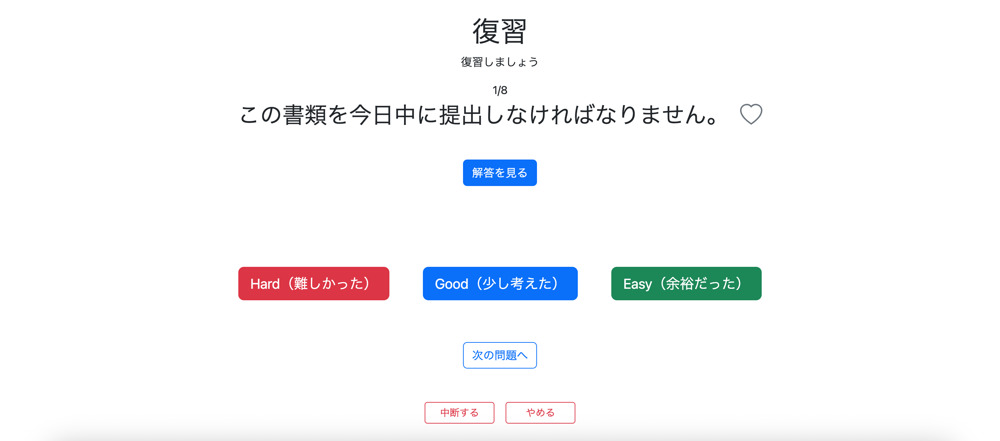

# 010 復習モードの実装 その2 - 出題機能の実装

復習メニューで指定した条件から問題セットを取得し、復習の開始・問題表示・理解度更新・中断・再開・終了までの一連の処理を実装する。

基本的なトレーニングの流れは通常学習と同じだが、復習では学習履歴をもとに問題を取得するため、問題セット取得処理が異なる。

## 1. 復習問題の取得

### StudyHistoryRepository

復習メニューで指定した理解度・難易度・お気に入り状態から、実際に出題する問題を取得する `findReviewQuestions()` を追加する。

```java
@Query(value = """
        SELECT q.*
        FROM study_history sh
        JOIN question q
          ON sh.question_id = q.question_id
        LEFT JOIN favorite f
          ON sh.user_id = f.user_id
         AND sh.question_id = f.question_id
        WHERE sh.user_id = :userId
          AND sh.evaluation IN (:evaluations)
          AND q.difficulty IN (:difficulties)
          AND (
              :favoriteCondition = 'ALL'
              OR (
                  :favoriteCondition = 'FAVORITED'
                  AND f.question_id IS NOT NULL
              )
              OR (
                  :favoriteCondition = 'NOT_FAVORITED'
                  AND f.question_id IS NULL
              )
          )
        """, nativeQuery = true)
List<Question> findReviewQuestions(
        @Param("userId") Long userId,
        @Param("evaluations") List<String> evaluations,
        @Param("difficulties") List<String> difficulties,
        @Param("favoriteCondition") String favoriteCondition
);
```

仕組みは復習メニューで実装した問題数取得クエリと同じである。

問題数取得では `COUNT(*)` を使用していたが、今回は実際に出題する問題が必要なため `q.*` を取得する。:contentReference[oaicite:1]{index=1}

### ReviewService

取得した検索条件を変換してRepositoryへ渡し、問題一覧を取得する。

```java
// 問題取得
public List<Question> getQuestion(
        Long userId,
        List<Evaluation> evaluations,
        List<Difficulty> difficulties,
        FavoriteCondition favoriteCondition,
        boolean random) {

    List<Question> extractedQuestions =
            studyHistoryRepository.findReviewQuestions(
                    userId,
                    searchConditionConverter.convertEvaluation(evaluations),
                    searchConditionConverter.convertDifficulty(difficulties),
                    searchConditionConverter.convertFavoriteCondition(favoriteCondition)
            );

    // シャッフルする
    if (random) {
        Collections.shuffle(extractedQuestions);
    }

    return extractedQuestions;
}
```

`Evaluation`、`Difficulty`、`FavoriteCondition` は `SearchConditionConverter` で文字列へ変換してからRepositoryへ渡す。

ランダム出題が選択されている場合は、取得した問題一覧を `Collections.shuffle()` でシャッフルする。

---

## 2. 復習開始処理

### ReviewController#getReviewStart

`/review/start` では、復習メニューで指定された検索条件から新しい問題セットを作成する。

```java
@GetMapping("/review/start")
public String getReviewStart(
        HttpSession session,
        @AuthenticationPrincipal UserDetails loginUser,
        @RequestParam(name = "evaluations", required = false)
            List<Evaluation> evaluations,
        @RequestParam(name = "difficulties", required = false)
            List<Difficulty> difficulties,
        @RequestParam(name = "favoriteCondition", required = false)
            FavoriteCondition favoriteCondition,
        @RequestParam(name = "random", required = false)
            boolean random) {

    // 既存の学習状態を破棄
    clearReviewSession(session);

    // 先に宣言
    List<Question> questions;

    // user_id(文字列)からUsersを取得
    Users user = getLoginUser(loginUser);
    Long userId = user.getId();

    // 新しい問題セットを作成
    questions = reviewService.getQuestion(
            userId,
            evaluations,
            difficulties,
            favoriteCondition,
            random
    );

    // 問題が1件もない場合は開始しない
    if (questions.isEmpty()) {
        return "redirect:/review/menu";
    }

    session.setAttribute("reviewQuestions", questions);
    session.setAttribute("reviewCurrentPage", 0);

    return "redirect:/review/question?page=0";
}
```

新しい復習を開始するときは既存の復習状態を削除し、

```text
reviewQuestions
reviewCurrentPage
```

を新しくSessionへ保存する。

---

## 3. 問題表示

### ReviewController#getReviewQuestion

`/review/question` では、Sessionに保存した問題セットから指定されたページの問題を取得する。

```java
@GetMapping("/review/question")
public String getReviewQuestion(
        Model model,
        HttpSession session,
        @RequestParam(defaultValue = "0") int page,
        @AuthenticationPrincipal UserDetails loginUser) {

    // Sessionからquestions取得
    List<Question> questions =
            (List<Question>) session.getAttribute("reviewQuestions");

    // /questionへの直接アクセスを禁ずる
    if (questions == null) {
        return "redirect:/review/menu";
    }

    // 範囲外のページへのアクセスを禁ずる
    if (page < 0 || page >= questions.size()) {
        return "redirect:/review/menu";
    }

    // 現在表示する問題を取得
    Question question = questions.get(page);

    // 現在ページをSessionへ保存
    session.setAttribute("reviewCurrentPage", page);

    // HTMLが必要な情報をModelへ格納
    questionModelUtil.setQuestionModel(
            model,
            questions,
            page,
            session
    );

    // お気に入り判定
    if (loginUser != null) {
        boolean isFavorite = favoriteService.isFavorite(
                getLoginUser(loginUser),
                question.getQuestionId()
        );

        model.addAttribute("isFavorite", isFavorite);
    }

    return "review/question";
}
```

問題一覧がSessionに存在しない場合や、不正なページ番号が指定された場合は復習メニューへ戻す。

また、

```java
session.setAttribute("reviewCurrentPage", page);
```

によって現在位置をSessionへ保存する。

---

## 4. 中断・再開・終了・完了

### 復習再開

Sessionに残っている `reviewCurrentPage` を取得し、中断した問題へ戻す。

```java
@GetMapping("/review/resume")
public String getReviewResume(
        Model model,
        HttpSession session) {

    // 中断していないならmenuに戻す
    if (session.getAttribute("reviewQuestions") == null) {
        return "redirect:/review/menu";
    }

    // 中断時のページ情報を取得
    Integer page =
            (Integer) session.getAttribute("reviewCurrentPage");

    return "redirect:/review/question?page=" + page;
}
```

### 復習完了

最後まで終了した場合は復習Sessionを削除する。

```java
@GetMapping("/review/complete")
public String getReviewComplete(HttpSession session) {

    clearReviewSession(session);

    return "redirect:/complete";
}
```

### 復習中断

中断する場合は現在ページをSessionへ保存したままトップへ戻る。

```java
@GetMapping("/review/suspend")
public String getReviewSuspend(
        @RequestParam int page,
        HttpSession session) {

    log.info("getReviewSuspend reached");

    session.setAttribute("reviewCurrentPage", page);

    return "redirect:/";
}
```

### 復習終了

復習をやめる場合は問題セットとページ情報を削除する。

```java
@GetMapping("/review/quit")
public String getReviewQuit(HttpSession session) {

    clearReviewSession(session);

    return "redirect:/";
}
```

### Session削除

```java
private void clearReviewSession(HttpSession session) {

    session.removeAttribute("reviewQuestions");
    session.removeAttribute("reviewCurrentPage");
}
```

中断の場合だけSessionを残し、完了・終了の場合はSessionを削除する。

---

## 5. 復習中の理解度更新

復習画面でも `HARD`、`GOOD`、`EASY` を選択して理解度を更新できるようにする。

```java
@PostMapping("/review/evaluation")
public String postEvaluation(
        @AuthenticationPrincipal UserDetails loginUser,
        @RequestParam Long questionId,
        @RequestParam Evaluation evaluation,
        @RequestParam Integer page,
        HttpSession session) {

    // ユーザー情報を取得
    Users user = userAccountService.getUserOne(
            loginUser.getUsername());

    // 理解度を保存
    evaluationService.updateEvaluation(
            user,
            questionId,
            evaluation);

    // セッションから問題一覧を取得
    List<Question> questions =
            (List<Question>) session.getAttribute("reviewQuestions");

    // 最後の問題の場合
    if (page + 1 >= questions.size()) {
        return "redirect:/review/complete";
    }

    // 次の問題へ
    return "redirect:/review/question?page=" + (page + 1);
}
```

理解度更新後は次の問題へ移動し、最後の問題であれば復習を完了する。

---

## 6. /review/question.htmlの作成

通常学習の `/practice/question.html` を参考に、復習用の問題画面を作成する。

### 問題・お気に入り表示

```html
<!-- 現在の問題番号 -->
<span th:text="${nextPageIndex + '/' + totalPages}">
    1/10
</span>

<!-- 日本語問題 -->
<div class="d-flex justify-content-center align-items-center gap-3">

    <h2 class="mb-0"
        th:text="${question.japaneseText}">
        日本語問題
    </h2>

    <!-- お気に入りボタン -->
    <div sec:authorize="isAuthenticated()">

        <button id="favoriteButton"
                type="button"
                class="btn p-0 border-0 bg-transparent"
                th:data-question-id="${question.questionId}">

            <i id="favoriteIcon"
               th:class="${isFavorite}
                    ? 'bi bi-heart-fill fs-2 text-danger'
                    : 'bi bi-heart fs-2 text-secondary'">
            </i>

        </button>

    </div>

</div>
```

### condition表示

conditionは検索条件ではなく、問題を解く際のヒントとして表示する。

```html
<div style="min-height:40px;">

    <p th:if="${question.condition != null}">

        <span th:text="#{review.question.condition}">
            条件：
        </span>

        <span th:text="${question.condition}">
            条件
        </span>

    </p>

</div>
```

### 解答表示

```html
<div style="min-height:150px;">

    <button id="answerButton"
            type="button"
            class="btn btn-primary"
            onclick="showAnswer()"
            th:text="#{review.question.showAnswer}">
        解答を見る
    </button>

    <div id="answerArea"
         style="display:none;">

        <p class="mb-2"
           th:if="${pronunciation != null}">

            <span th:text="${pronunciation}">
                Pronunciation
            </span>

        </p>

        <p class="mb-2">

            <span th:text="#{review.question.answer}">
                解答：
            </span>

            <span class="fs-3"
                  th:text="${question.chineseText}">
                Chinese Answer
            </span>

        </p>

        <!-- 別解 -->
        <div th:if="${question.alternativeAnswer != null}">

            <p class="mb-2"
               th:if="${alternativePronunciation != null}">

                <span class="small"
                      th:text="${alternativePronunciation}">
                    Alternative Pronunciation
                </span>

            </p>

            <p class="mb-0">

                <span th:text="#{review.question.alternativeAnswer}">
                    別解：
                </span>

                <span th:text="${question.alternativeAnswer}">
                    Alternative Answer
                </span>

            </p>

        </div>

    </div>

</div>
```

### 理解度

```html
<div id="evaluationArea"
     sec:authorize="isAuthenticated()"
     class="mt-1 d-flex justify-content-center gap-5"
     style="display:none;">

    <!-- HARD -->
    <form th:action="@{/review/evaluation}" method="post">

        <input type="hidden"
               name="questionId"
               th:value="${question.questionId}">

        <input type="hidden"
               name="evaluation"
               value="HARD">

        <input type="hidden"
               name="page"
               th:value="${nextPageIndex - 1}">

        <button type="submit"
                class="btn btn-danger btn-lg"
                th:text="#{review.question.evaluation.hard}">
            Hard（難しかった）
        </button>

    </form>

    <!-- GOOD -->
    <form th:action="@{/review/evaluation}" method="post">

        <input type="hidden"
               name="questionId"
               th:value="${question.questionId}">

        <input type="hidden"
               name="evaluation"
               value="GOOD">

        <input type="hidden"
               name="page"
               th:value="${nextPageIndex - 1}">

        <button type="submit"
                class="btn btn-primary btn-lg"
                th:text="#{review.question.evaluation.good}">
            Good（少し考えた）
        </button>

    </form>

    <!-- EASY -->
    <form th:action="@{/review/evaluation}" method="post">

        <input type="hidden"
               name="questionId"
               th:value="${question.questionId}">

        <input type="hidden"
               name="evaluation"
               value="EASY">

        <input type="hidden"
               name="page"
               th:value="${nextPageIndex - 1}">

        <button type="submit"
                class="btn btn-success btn-lg"
                th:text="#{review.question.evaluation.easy}">
            Easy（余裕だった）
        </button>

    </form>

</div>
```

### 前へ・次へ・完了

```html
<div class="mb-5 d-flex justify-content-center gap-4"
     style="margin-top:60px;">

    <a th:if="${hasPrevious}"
       th:href="@{/review/question(page=${nextPageIndex - 2})}"
       class="btn btn-outline-primary"
       th:text="#{review.question.previous}">
        前の問題へ
    </a>

    <a th:if="${hasNext}"
       th:href="@{/review/question(page=${nextPageIndex})}"
       class="btn btn-outline-primary"
       th:text="#{review.question.next}">
        次の問題へ
    </a>

    <a th:if="${!hasNext}"
       th:href="@{/review/complete}"
       class="btn btn-info"
       th:text="#{review.question.complete}">
        完了
    </a>

</div>
```

### 中断・終了

```html
<div class="d-flex justify-content-center gap-3"
     style="margin-top:40px;">

    <a th:href="@{/review/suspend(page=${nextPageIndex - 1})}"
       th:attr="onclick=|return confirm('#{review.question.suspend.confirm}');|"
       class="btn btn-outline-danger btn-sm"
       style="width:100px;"
       th:text="#{review.question.suspend}">
        中断する
    </a>

    <a th:href="@{/review/quit}"
       th:attr="onclick=|return confirm('#{review.question.quit.confirm}');|"
       class="btn btn-outline-danger btn-sm"
       style="width:100px;"
       th:text="#{review.question.quit}">
        やめる
    </a>

</div>
```

問題画面全体では、通常学習と同じ `practice.js` を使用する。

```html
<script th:src="@{/js/practice.js}" defer></script>
```

`practice.js` の解答表示とお気に入り登録・解除処理は通常学習固有のURLに依存していないため、復習画面でも共用する。

---

## 7. messages.propertiesの追加

`/review/question.html` で使用するメッセージを追加する。

```properties
# ==============================
# 復習 - 問題画面
# ==============================

review.question.pageTitle=復習 | Chinese Output Forge
review.question.title=復習
review.question.message=復習しましょう

# 問題
review.question.condition=条件：
review.question.showAnswer=解答を見る
review.question.answer=解答：
review.question.alternativeAnswer=別解：

# 理解度
review.question.evaluation.hard=Hard（難しかった）
review.question.evaluation.good=Good（少し考えた）
review.question.evaluation.easy=Easy（余裕だった）

# ページ移動
review.question.previous=前の問題へ
review.question.next=次の問題へ
review.question.complete=完了

# 中断
review.question.suspend=中断する
review.question.suspend.confirm=トレーニングを中断しますか？

# 終了
review.question.quit=やめる
review.question.quit.confirm=トレーニングを終了しますか？
```

繁体字・簡体字のメッセージファイルについても同じキーを追加する。

---

## 8. QuestionModelUtilの修正

`QuestionModelUtil#setQuestionModel()` を確認したところ、発音表記を設定する `switch` が二重に記述されていた。

別解の発音表記対応後の `switch` だけで、

```text
pronunciation
alternativePronunciation
```

の両方を設定できるため、古い `switch` を削除した。

修正後は以下の処理のみとする。

```java
switch (pronunciationType) {

case PINYIN -> {
    model.addAttribute(
            "pronunciation",
            question.getPinyin()
    );

    model.addAttribute(
            "alternativePronunciation",
            question.getAlternativeAnswerPinyin()
    );
}

case ZHUYIN -> {
    model.addAttribute(
            "pronunciation",
            question.getZhuyin()
    );

    model.addAttribute(
            "alternativePronunciation",
            question.getAlternativeAnswerZhuyin()
    );
}

case NONE -> {
    model.addAttribute("pronunciation", null);
    model.addAttribute("alternativePronunciation", null);
}

}
```

機能変更ではなく、重複処理の整理である。

---

## 9. /review/menu.htmlの出題方法を修正

復習メニューでは当初、出題方法を、

```text
order=SEQUENTIAL
order=RANDOM
```

としていた。

通常学習では `boolean random` を使用しているため、復習でも同じ方式へ統一する。

変更後は以下とする。

```html
<label class="form-check">

    <input class="form-check-input"
           type="radio"
           name="random"
           value="false"
           checked>

    <span class="form-check-label"
          th:text="#{review.menu.order.sequential}">
        順番に出題
    </span>

</label>

<label class="form-check">

    <input class="form-check-input"
           type="radio"
           name="random"
           value="true">

    <span class="form-check-label"
          th:text="#{review.menu.order.random}">
        ランダムに出題
    </span>

</label>
```

これにより、

```text
順番に出題
→ random=false

ランダムに出題
→ random=true
```

となり、Controllerでは、

```java
@RequestParam(name = "random", required = false)
boolean random
```

としてそのまま受け取れるようになった。

---

## 10. 実行確認

`/review/menu` にアクセスし、任意の条件を指定して出題を開始する。

```text
http://localhost:8080/review/menu
```

指定した条件から復習問題セットが作成され、`/review/question` へ遷移してトレーニングが開始されることを確認した。



