# 011 復習モードの実装 その3 - Structureによる出題条件の追加

復習モードに、文法・構造（Structure）による出題条件を追加する。

あわせて、これまで `Question` の文字列フィールドとして管理していた `structure` を独立したマスタテーブルへ変更し、復習メニューから各文法・構造の説明を確認できるようにする。

---

## 1. 復習メニューにStructureによる絞り込みを追加

`/review/menu` に文法・構造による絞り込み条件を追加する。

### QuestionRepository

登録されている文法・構造を取得するため、`findDistinctStructures()` を追加した。

```java
@Query(value = """
        SELECT DISTINCT structure
        FROM question
        ORDER BY structure
        """, nativeQuery = true)
List<String> findDistinctStructures();
```

### ReviewService

```java
public List<String> findStructures() {
    return questionRepository.findDistinctStructures();
}
```

### ReviewController

`/review/menu` 表示時に文法・構造一覧をModelへ追加する。

```java
model.addAttribute(
        "structures",
        reviewService.findStructures());
```

### /review/menu.html

文法・構造を複数選択できるチェックボックスを追加した。

あわせて、

- すべて選択
- すべて解除

の操作を追加した。

### /review/menu.js

文法・構造のチェック状態を `/review/count` へ送信し、選択状態が変更された場合に問題数を再取得するようにした。

また、「すべて選択」「すべて解除」操作にも `updateCount()` を追加した。

### 実行確認

`/review/menu` に文法・構造の選択欄が表示され、選択状態に応じて問題数が変化することを確認した。

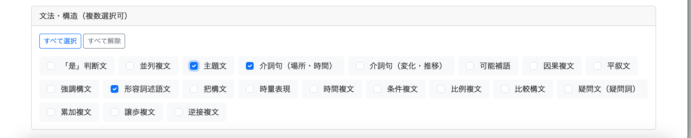

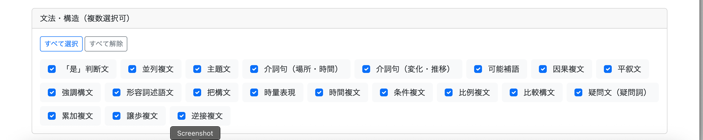

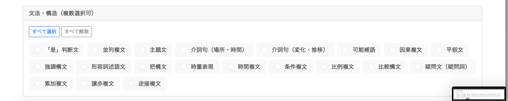

---

## 2. 文法・構造欄を折りたたみ可能にする

文法・構造の選択肢が増えても復習メニューが縦に長くなりすぎないよう、文法・構造欄を折りたたみ可能にした。

### /static/css/review/menu.css

```css
.structure-list {
    max-height: 100px;
    overflow: hidden;
}

.structure-list.expanded {
    max-height: none;
}
```

### /review/menu.html

文法・構造一覧に `structureList` を設定する。

```html
<div id="structureList"
     class="d-flex flex-wrap gap-2 structure-list">
```

一覧の下に表示切替ボタンを追加する。

```html
<div class="text-center mt-3">

    <button type="button"
            id="toggleStructures"
            class="btn btn-link btn-sm"
            th:data-show-text="#{review.menu.structure.showAll}"
            th:data-hide-text="#{review.menu.structure.collapse}"
            th:text="#{review.menu.structure.showAll}">
        すべて表示
    </button>

</div>
```

### /review/menu.js

```javascript
const structureList =
    document.getElementById("structureList");

const toggleStructuresButton =
    document.getElementById("toggleStructures");

toggleStructuresButton.addEventListener("click", () => {

    const expanded =
        structureList.classList.toggle("expanded");

    toggleStructuresButton.textContent =
        expanded
            ? toggleStructuresButton.dataset.hideText
            : toggleStructuresButton.dataset.showText;
});
```

### 実行確認

初期状態では文法・構造欄が折りたたまれ、「すべて表示」を押すことで全件表示できることを確認した。

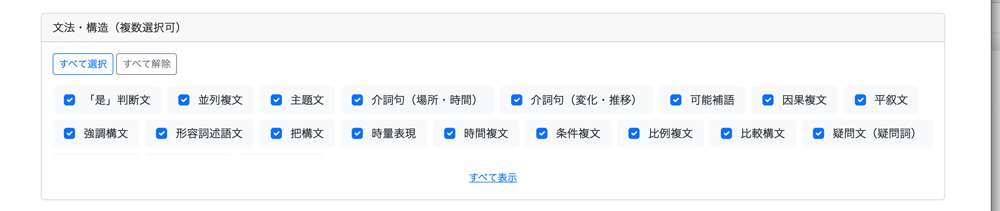

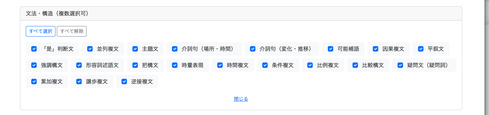

---

## 3. Structureをマスタテーブル化

`Question.structure` に文字列として保持していた文法・構造を、独立した `Structure` Entityとして管理するように変更する。

設計変更に伴い、実装前にrequirementsフォルダ内の関連設計書を更新した。

設計変更の詳細についてはrequirementsフォルダ内の各ファイルに記載する。

### Structure.java

```java
@Entity
@Table(name = "structure")
@Getter
@Setter
public class Structure {

    @Id
    @GeneratedValue(strategy = GenerationType.IDENTITY)
    @Column(name = "structure_id")
    private Long structureId;

    @Column(name = "name", nullable = false, unique = true)
    private String name;

    @Column(name = "description_zh_cn", nullable = false)
    private String descriptionZhCn;

    @Column(name = "description_zh_tw", nullable = false)
    private String descriptionZhTw;
}
```

### StructureRepository

```java
public interface StructureRepository
        extends JpaRepository<Structure, Long> {
}
```

### Structureマスタデータの登録

既存の `question.structure` に登録されている20種類の文法・構造を `structure` テーブルへ登録した。

```sql
INSERT INTO structure
    (name, description_zh_cn, description_zh_tw)
VALUES
...
;
```

各Structureについて、

- 文法・構造名
- 大陸普通話向け説明
- 台湾華語向け説明

を保持する。

### Question.java

変更前：

```java
@Column(name = "structure", nullable = false)
private String structure;
```

変更後：

```java
@ManyToOne
@JoinColumn(name = "structure_id")
private Structure structure;
```

この時点では既存データ移行のため `nullable = false` は設定しない。

### 既存データの移行

旧 `structure` カラムの文字列と `structure.name` を対応させ、既存60問へ `structure_id` を設定した。

```sql
UPDATE question q
SET structure_id = s.structure_id
FROM structure s
WHERE q.structure = s.name;
```

移行結果を確認する。

```sql
SELECT
    q.question_id,
    q.structure AS old_structure,
    q.structure_id,
    s.name AS new_structure
FROM question q
LEFT JOIN structure s
    ON q.structure_id = s.structure_id
ORDER BY q.question_id;
```

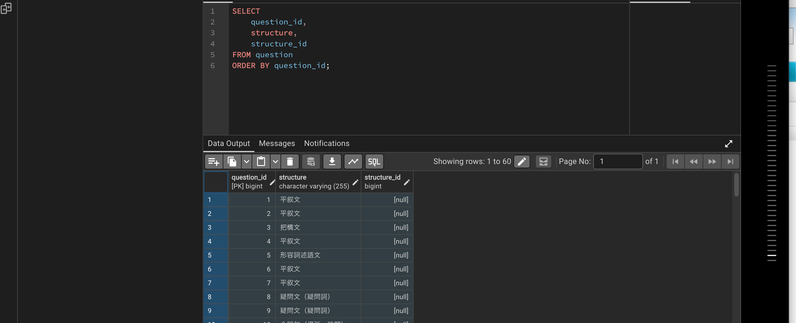

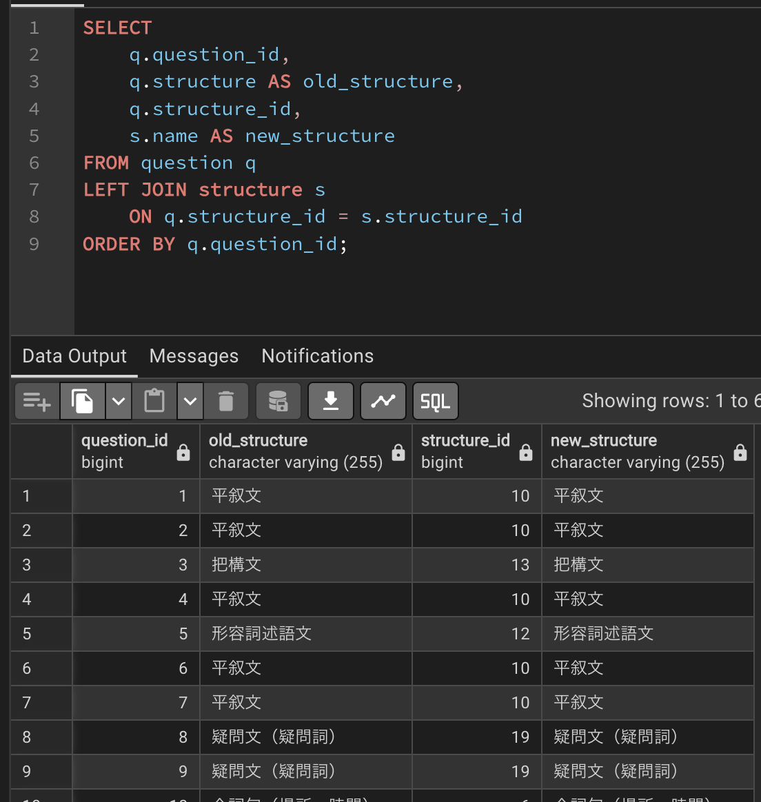

移行漏れがないことを確認後、旧カラムを削除した。

```sql
ALTER TABLE question
DROP COLUMN structure;
```

削除後、60問すべてについてStructureとの関連を取得できることを確認した。

```sql
SELECT
    q.question_id,
    q.structure_id,
    s.name
FROM question q
JOIN structure s
    ON q.structure_id = s.structure_id
ORDER BY q.question_id;
```

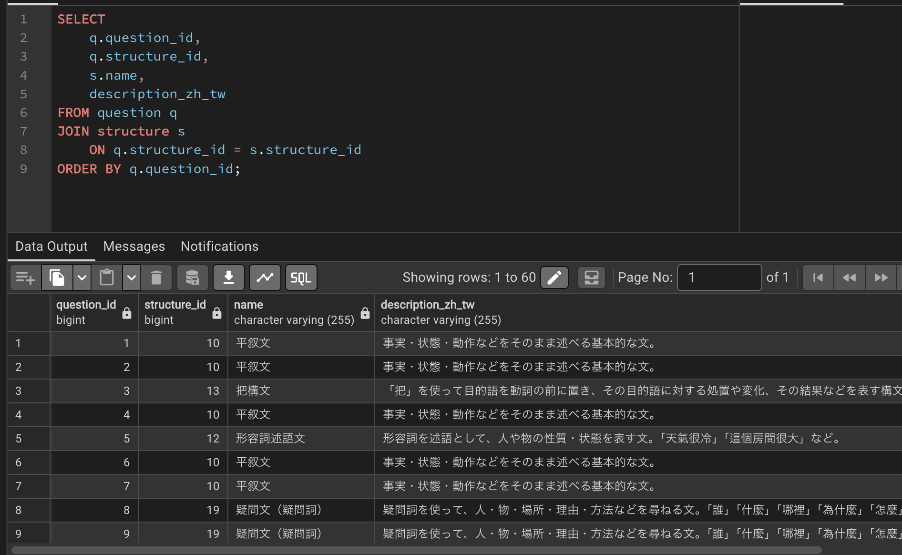

最後に `Question.structure` を必須関連に変更した。

```java
@ManyToOne
@JoinColumn(name = "structure_id", nullable = false)
private Structure structure;
```

---

## 4. 復習機能を新しいStructure構造へ対応

Structureのマスタ化に伴い、復習メニュー表示、問題数取得、問題取得処理を `structure_id` ベースへ変更する。

### 4.1 復習メニュー表示

`ReviewService` が `StructureRepository` を使用するように変更した。

```java
public List<Structure> findStructures() {
    return structureRepository.findAll();
}
```

不要になった `QuestionRepository.findDistinctStructures()` は削除した。

`/review/menu.html` では、Structure EntityからIDと名称を取得するよう変更した。

```html
<label th:each="structure : ${structures}"
       class="bg-light rounded px-3 py-2">

    <input class="form-check-input me-2"
           type="checkbox"
           name="structureIds"
           th:value="${structure.structureId}"
           checked>

    <span th:text="${structure.name}">
        文法・構造
    </span>

</label>
```

`/review/menu.js` についても、`structures` ではなく `structureIds` を送信するよう変更した。

### 実行確認

`/review/menu` でStructure一覧がこれまでどおり表示されることを確認した。

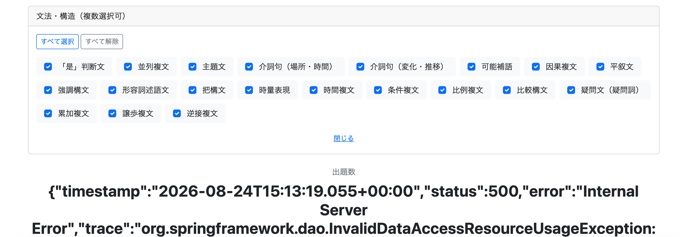

### 4.2 問題数取得

`StudyHistoryRepository.countReviewQuestions()` のStructure条件をIDベースへ変更した。

```sql
AND q.structure_id IN (:structureIds)
```

引数も変更する。

```java
@Param("structureIds") List<Long> structureIds
```

`ReviewService.countReviewQuestions()` および `ReviewController.getReviewCount()` についても `List<Long> structureIds` を受け渡すよう変更した。

### 実行確認

Structureの選択状態に応じて問題数が正しく更新されることを確認した。

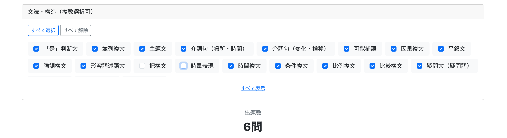

### 4.3 復習問題取得

`StudyHistoryRepository.findReviewQuestions()` にStructure IDによる絞り込みを追加した。

```sql
AND q.structure_id IN (:structureIds)
```

引数にもStructure IDを追加した。

```java
@Param("structureIds") List<Long> structureIds
```

`ReviewService.getQuestion()` にも `structureIds` を追加し、Repositoryへ渡すよう変更した。

`ReviewController.getReviewStart()` では、

```java
@RequestParam(name = "structureIds", required = false)
List<Long> structureIds
```

として選択されたStructure IDを受け取り、`ReviewService` へ渡すよう変更した。

これにより、復習メニューで指定したStructure条件が実際に取得される復習問題にも反映されるようになった。

---

## 5. 文法・構造の説明を表示

復習メニューの各文法・構造にカーソルを合わせると、Structureに登録されている説明を表示するようにした。

### /review/menu.html

Bootstrap Tooltipを設定する。

```html
<label th:each="structure : ${structures}"
       class="bg-light rounded px-3 py-2"
       data-bs-toggle="tooltip"
       data-bs-placement="top"
       th:data-bs-title="${session.languageVariant != null
                           && session.languageVariant.name() == 'TAIWAN'
                           ? structure.descriptionZhTw
                           : structure.descriptionZhCn}">
```

現在の学習対象言語に応じて使用する説明を切り替える。

```text
MAINLAND
└── descriptionZhCn

TAIWAN
└── descriptionZhTw
```

`languageVariant` が `null` の場合は `descriptionZhCn` を使用する。

### /review/menu.js

Bootstrap Tooltipを初期化する。

```javascript
// =========================
// 文法・構造の説明
// =========================

const tooltipTriggerList =
    document.querySelectorAll('[data-bs-toggle="tooltip"]');

tooltipTriggerList.forEach(element => {
    new bootstrap.Tooltip(element);
});
```

`data-bs-toggle="tooltip"` が設定されている要素を取得し、それぞれにBootstrap Tooltipを生成する。

### /static/css/review/menu.css

Tooltipを読みやすいサイズに調整する。

```css
.tooltip-inner {
    max-width: 400px;
    padding: 12px 16px;
    font-size: 1rem;
    text-align: left;
}
```

### 実行確認

`/review/menu` の各文法・構造にカーソルを合わせると、現在の学習対象言語に対応した説明がTooltipとして表示されることを確認した。

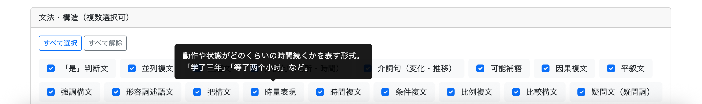

---

## 実装結果

復習モードにStructureによる絞り込みを追加した。

また、Structureを独立したマスタテーブルとして管理する構造へ変更し、既存60問のデータを新しい構造へ移行した。

これに伴って復習メニュー、問題数取得、復習問題取得を `structure_id` ベースへ変更した。

さらに、復習メニューでは各Structureの説明を現在の学習対象言語に応じて表示できるようにした。

---

# 追加修正　8月28日

```bash
git commit -m "feat: add language variant filter to review menu"
```

※実装内容に先のチャプターの内容が含まれている。

## 問題点

復習メニューでは、学習対象言語別に復習対象問題を絞り込むことができなかった。

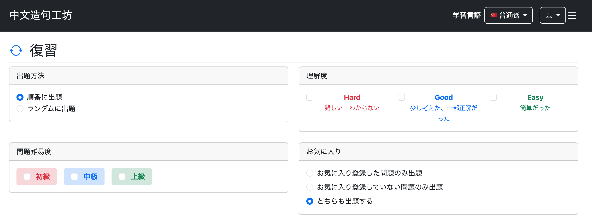

そのため、過去に普通話と國語の両方を学習したことがあるユーザーが`/review/menu`へアクセスすると、現在設定している学習対象言語に関係なく、普通話と國語の復習対象問題がすべて問題件数に含まれていた。

そこで、問題一覧画面と同様に以下の仕様へ変更する。

- 復習メニューで学習対象言語別にフィルターをかけられるようにする
- 初期表示では、現在設定している学習対象言語だけを選択状態にする
- 選択された学習対象言語だけを問題件数の集計および実際の復習問題取得の対象にする

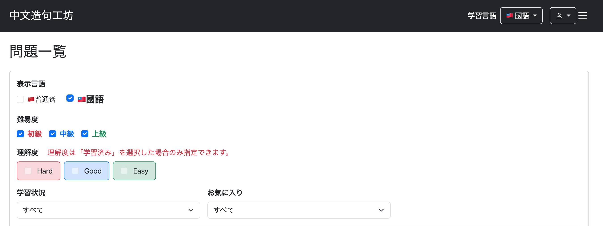

## 1. `StudyHistoryRepository`に学習対象言語の検索条件を追加

復習対象問題の件数取得と問題取得の両方で、選択された学習対象言語による絞り込みを行えるようにする。

### `countReviewQuestions`

復習対象問題数を取得するSQLに、`question.language_variant`による検索条件を追加する。

```java
@Query(value = """
        SELECT COUNT(*)
        FROM study_history sh
        JOIN question q
        ON sh.question_id = q.question_id
        LEFT JOIN favorite f
        ON sh.user_id = f.user_id
        AND sh.question_id = f.question_id
        WHERE sh.user_id = :userId
        AND q.language_variant IN (:languageVariants)
        AND sh.evaluation IN (:evaluations)
        AND q.difficulty IN (:difficulties)
        AND (
            :favoriteCondition = 'ALL'
            OR (
                :favoriteCondition = 'FAVORITED'
                AND f.question_id IS NOT NULL
            )
            OR (
                :favoriteCondition = 'NOT_FAVORITED'
                AND f.question_id IS NULL
            )
        )
        AND q.structure_id IN (:structureIds)
        """, nativeQuery = true)
long countReviewQuestions(
        @Param("userId") Long userId,
        @Param("languageVariants") List<String> languageVariants,
        @Param("evaluations") List<String> evaluations,
        @Param("difficulties") List<String> difficulties,
        @Param("favoriteCondition") String favoriteCondition,
        @Param("structureIds") List<Long> structureIds
);
```

以下の条件を追加した。

```sql
AND q.language_variant IN (:languageVariants)
```

また、メソッドの引数にも以下を追加した。

```java
@Param("languageVariants") List<String> languageVariants
```

`IN`を使用することで、普通話のみ、國語のみ、または両方を検索対象にできる。

### `findReviewQuestions`

実際に復習する問題を取得するSQLにも、同じ学習対象言語の条件を追加する。

```java
@Query(value = """
        SELECT q.*
        FROM study_history sh
        JOIN question q
          ON sh.question_id = q.question_id
        LEFT JOIN favorite f
          ON sh.user_id = f.user_id
         AND sh.question_id = f.question_id
        WHERE sh.user_id = :userId
          AND q.language_variant IN (:languageVariants)
          AND sh.evaluation IN (:evaluations)
          AND q.difficulty IN (:difficulties)
          AND (
              :favoriteCondition = 'ALL'
              OR (
                  :favoriteCondition = 'FAVORITED'
                  AND f.question_id IS NOT NULL
              )
              OR (
                  :favoriteCondition = 'NOT_FAVORITED'
                  AND f.question_id IS NULL
              )
          )
          AND q.structure_id IN (:structureIds)
        """, nativeQuery = true)
List<Question> findReviewQuestions(
        @Param("userId") Long userId,
        @Param("languageVariants") List<String> languageVariants,
        @Param("evaluations") List<String> evaluations,
        @Param("difficulties") List<String> difficulties,
        @Param("favoriteCondition") String favoriteCondition,
        @Param("structureIds") List<Long> structureIds
);
```

これにより、画面上の問題件数だけでなく、実際に出題される問題にも同じ学習対象言語の検索条件が適用される。

## 2. `ReviewService`に学習対象言語を追加

Repositoryへ学習対象言語を渡せるように、`ReviewService`の件数取得処理と問題取得処理を修正する。

### `countReviewQuestions`

引数に`List<LanguageVariant> languageVariants`を追加する。

```java
// 復習出題数取得
public long countReviewQuestions(
        Long userId,
        List<LanguageVariant> languageVariants,
        List<Evaluation> evaluations,
        List<Difficulty> difficulties,
        FavoriteCondition favoriteCondition,
        List<Long> structureIds) {

    // ここで変換する
    List<String> convertedLanguageVariants =
            searchConditionConverter.convertLanguageVariant(languageVariants);

    List<String> convertedDifficulties =
            searchConditionConverter.convertDifficulty(difficulties);

    List<String> convertedEvaluations =
            searchConditionConverter.convertEvaluation(evaluations);

    String convertedFavoriteCondition =
            searchConditionConverter.convertFavoriteCondition(favoriteCondition);

    return studyHistoryRepository.countReviewQuestions(
            userId,
            convertedLanguageVariants,
            convertedEvaluations,
            convertedDifficulties,
            convertedFavoriteCondition,
            structureIds
    );
}
```

Controllerから受け取った`List<LanguageVariant>`を`SearchConditionConverter`で`List<String>`へ変換し、Repositoryへ渡す。

### `getQuestion`

実際の復習問題取得処理にも`languageVariants`を追加する。

```java
// 問題取得
public List<Question> getQuestion(
        Long userId,
        List<LanguageVariant> languageVariants,
        List<Evaluation> evaluations,
        List<Difficulty> difficulties,
        FavoriteCondition favoriteCondition,
        List<Long> structureIds,
        boolean random) {

    List<Question> extractedQuestions =
            studyHistoryRepository.findReviewQuestions(
                    userId,
                    searchConditionConverter.convertLanguageVariant(languageVariants),
                    searchConditionConverter.convertEvaluation(evaluations),
                    searchConditionConverter.convertDifficulty(difficulties),
                    searchConditionConverter.convertFavoriteCondition(favoriteCondition),
                    structureIds
            );

    // シャッフルする
    if (random) {
        Collections.shuffle(extractedQuestions);
    }

    return extractedQuestions;
}
```

これにより、復習開始時にも選択された学習対象言語だけを取得できるようになった。

## 3. `ReviewController#getReviewCount`で学習対象言語を受け取る

`/review/count`で、画面から送信された`languageVariants`を受け取れるようにする。

```java
@GetMapping("/review/count")
@ResponseBody
public long getReviewCount(
        @AuthenticationPrincipal UserDetails loginUser,
        @RequestParam(name = "languageVariants", required = false)
            List<LanguageVariant> languageVariants,
        @RequestParam(name = "evaluations", required = false)
            List<Evaluation> evaluations,
        @RequestParam(name = "difficulties", required = false)
            List<Difficulty> difficulties,
        @RequestParam(name = "favoriteCondition", required = false)
            FavoriteCondition favoriteCondition,
        @RequestParam(name = "structureIds", required = false)
            List<Long> structureIds) {

    // user_id(文字列)からUsersを取得
    Users user = getLoginUser(loginUser);
    Long userId = user.getId();

    // 出題数を返す
    return reviewService.countReviewQuestions(
            userId,
            languageVariants,
            evaluations,
            difficulties,
            favoriteCondition,
            structureIds
    );
}
```

これにより、JavaScriptから送信された学習対象言語をServiceへ渡し、問題件数の検索条件として使用できる。

## 4. `ReviewController#getReviewStart`で学習対象言語を受け取る

`/review/start`でも`languageVariants`を受け取るようにする。

```java
@GetMapping("/review/start")
public String getReviewStart(
        HttpSession session,
        @AuthenticationPrincipal UserDetails loginUser,
        @RequestParam(name = "languageVariants", required = false)
            List<LanguageVariant> languageVariants,
        @RequestParam(name = "evaluations", required = false)
            List<Evaluation> evaluations,
        @RequestParam(name = "difficulties", required = false)
            List<Difficulty> difficulties,
        @RequestParam(name = "favoriteCondition", required = false)
            FavoriteCondition favoriteCondition,
        @RequestParam(name = "structureIds", required = false)
            List<Long> structureIds,
        @RequestParam(name = "random", required = false)
            boolean random) {

    // 既存の学習状態を破棄
    clearReviewSession(session);

    // 先に宣言
    List<Question> questions;

    // user_id(文字列)からUsersを取得
    Users user = getLoginUser(loginUser);
    Long userId = user.getId();

    // 新しい問題セットを作成
    questions = reviewService.getQuestion(
            userId,
            languageVariants,
            evaluations,
            difficulties,
            favoriteCondition,
            structureIds,
            random
    );

    // 問題が1件もない場合は開始しない
    if (questions.isEmpty()) {
        return "redirect:/review/menu";
    }

    session.setAttribute("reviewQuestions", questions);
    session.setAttribute("reviewCurrentPage", 0);

    return "redirect:/review/question?page=0";
}
```

これにより、問題件数の取得だけでなく、復習開始時にも選択した学習対象言語が検索条件として使用される。

## 5. `ReviewController#getReviewMenu`で初期選択する言語を設定

復習メニューを開いた直後は、ユーザーが現在設定している学習対象言語だけを検索対象として選択する。

```java
@GetMapping("/review/menu")
public String getReviewMenu(
        HttpSession session,
        Model model) {

    // 言語切替後の戻り先
    model.addAttribute("languageVariantRedirect", "/review/menu");

    // 学習対象言語を取得
    LanguageVariant languageVariant =
            (LanguageVariant) session.getAttribute("languageVariant");

    // 未設定の場合は普通話
    if (languageVariant == null) {
        languageVariant = LanguageVariant.MAINLAND;
    }

    // デフォルトの検索対象言語
    model.addAttribute(
            "selectedLanguageVariants",
            List.of(languageVariant)
    );

    // セッションから情報を取得
    List<Question> questions =
            (List<Question>) session.getAttribute("reviewQuestions");

    Integer currentPage =
            (Integer) session.getAttribute("reviewCurrentPage");

    // 中断したデータがあるか判定
    boolean canResume = questions != null && currentPage != null;

    // 中断したデータ情報を返す
    model.addAttribute("canResume", canResume);

    if (canResume) {
        model.addAttribute("currentPage", currentPage);
        model.addAttribute("totalCount", questions.size());
    }

    // 画面表示用structureを取得
    model.addAttribute(
            "structures",
            reviewService.findStructures()
    );

    return "review/menu";
}
```

セッションの`languageVariant`を取得し、

```java
model.addAttribute(
        "selectedLanguageVariants",
        List.of(languageVariant)
);
```

として画面へ渡す。

これにより、`/review/menu`を開いた時点では現在設定している学習対象言語だけが選択された状態になる。

## 6. `/review/menu.html`に学習対象言語のチェックボックスを追加

検索フォームの一番上に、普通話と國語を選択するチェックボックスを追加する。

```html
<!-- ========================= -->
<!-- 学習対象言語 -->
<!-- ========================= -->

<div class="col-md-12">

    <label class="form-label fw-bold"
           th:text="#{review.menu.languageVariant}">
        学習対象言語
    </label>

    <div class="d-flex align-items-center gap-4">

        <!-- 普通話 -->
        <div class="form-check">

            <input class="form-check-input"
                   type="checkbox"
                   name="languageVariants"
                   value="MAINLAND"
                   id="mainland"
                   th:checked="${selectedLanguageVariants != null
                       and selectedLanguageVariants.![name()].contains('MAINLAND')}">

            <label class="form-check-label"
                   for="mainland"
                   th:classappend="${session.languageVariant == null
                       or session.languageVariant.name() == 'MAINLAND'}
                       ? ' fs-5 fw-bold'
                       : ''">

                🇨🇳普通话

            </label>

        </div>

        <!-- 國語 -->
        <div class="form-check">

            <input class="form-check-input"
                   type="checkbox"
                   name="languageVariants"
                   value="TAIWAN"
                   id="taiwan"
                   th:checked="${selectedLanguageVariants != null
                       and selectedLanguageVariants.![name()].contains('TAIWAN')}">

            <label class="form-check-label"
                   for="taiwan"
                   th:classappend="${session.languageVariant != null
                       and session.languageVariant.name() == 'TAIWAN'}
                       ? ' fs-5 fw-bold'
                       : ''">

                🇹🇼國語

            </label>

        </div>

    </div>

</div>
```

`selectedLanguageVariants`に含まれている言語だけを`checked`にすることで、現在設定している学習対象言語を初期検索条件として表示する。

## 7. `menu.js`で学習対象言語を検索条件に追加

問題件数を取得するJavaScriptにも`languageVariants`を追加する。

### 検索条件の変更を検知する

`searchConditions`に学習対象言語のチェックボックスを追加する。

```javascript
const searchConditions = document.querySelectorAll(
    "input[name='languageVariants'], " +
    "input[name='evaluations'], " +
    "input[name='difficulties'], " +
    "input[name='conditions'], " +
    "input[name='favoriteCondition'], " +
    "input[name='structureIds']"
);
```

これにより、普通話・國語のチェック状態を変更した場合にも`updateCount()`が実行される。

### 選択された学習対象言語を`/review/count`へ送信する

`updateCount()`内で、チェックされている`languageVariants`をURLパラメータへ追加する。

```javascript
// 学習対象言語
document
    .querySelectorAll("input[name='languageVariants']:checked")
    .forEach(cb => {
        params.append("languageVariants", cb.value);
    });
```

たとえば國語だけが選択されている場合は、`languageVariants=TAIWAN`が`/review/count`へ送信される。

これにより、学習対象言語のチェック状態を変更すると、その条件を反映した復習対象問題数が再取得されるようになった。

## 8. 実行確認

`http://localhost:8080/review/menu`へアクセスすると、検索条件に学習対象言語を選択するチェックボックスが表示された。

現在の学習対象言語は國語のため、初期表示では國語のみにチェックが入った。

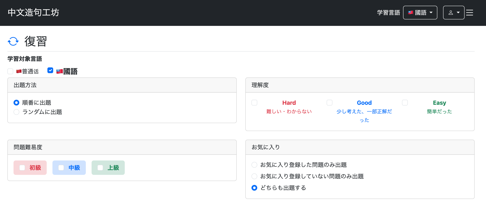

現在、國語の復習対象問題は0件のため、國語のみを選択している状態では問題件数も0問と表示された。

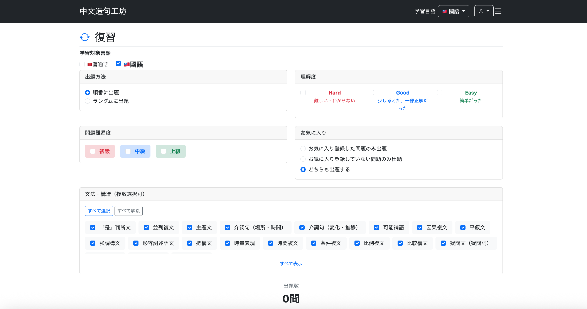

学習対象言語を普通話へ切り替えて再度復習メニューを表示すると、初期選択も普通話へ切り替わった。

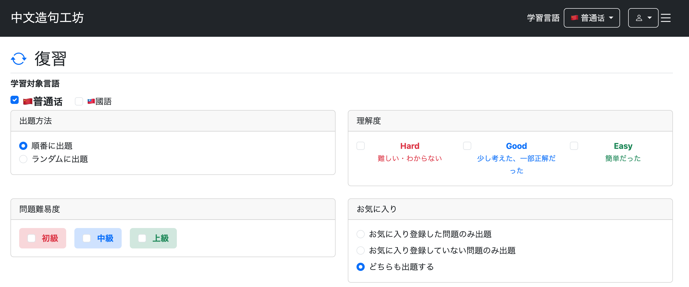

普通話には復習対象問題が8件存在するため、問題件数も8問と表示された。

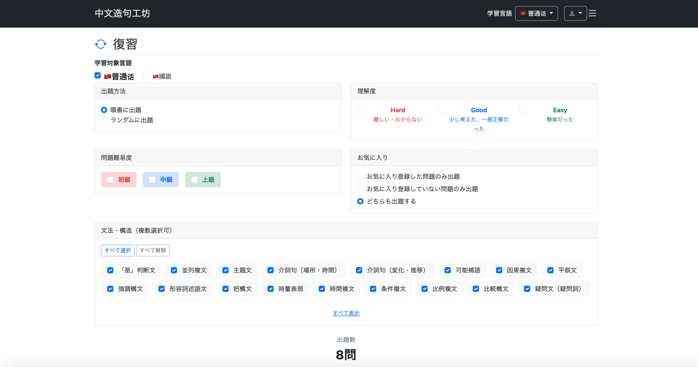

以上により、復習メニューの初期検索対象が現在設定している学習対象言語と一致し、さらに普通話・國語を任意に選択して復習対象問題を絞り込めるようになった。

---

## 次回の実装

ユーザーメニューの実装を行う。

- プロフィール
- 問題検索
- 設定