# 012 ユーザーメニューの実装その1

ユーザー向け機能として、以下を実装する。

- ユーザーメニュー
- 問題一覧・検索
- 問題一覧からの理解度変更
- 問題一覧からのお気に入り登録・解除

プロフィール・設定については、ユーザーメニューへのリンクのみ先に用意し、機能自体は後から実装する。

---

# 1. ユーザーメニュー画面の作成

`git commit -m "feat: add user menu page"`

ユーザー向け機能への入口となる `/user/menu` を作成する。

## UserMenuController.java

```java
@Controller
public class UserMenuController {
	
	@GetMapping("/user/menu")
	public String getUserMenu() {
		return "/user/menu";
	}

}
```

## /user/menu.html

```html

<body>

<div layout:fragment="content"
     class="container pt-3">

    <h2 th:text="#{user.menu.title}">
        ユーザーメニュー
    </h2>

    <div class="list-group mt-3">

        <!-- 問題一覧・検索 -->
        <a th:href="@{/user/question/search}"
           class="list-group-item list-group-item-action">
            <i class="bi bi-list-ul me-2"></i>
            <span th:text="#{user.menu.questionSearch}">
                問題一覧・検索
            </span>
        </a>

        <!-- プロフィール -->
        <a th:href="@{/user/profile}"
           class="list-group-item list-group-item-action">
            <i class="bi bi-person-fill me-2"></i>
            <span th:text="#{user.menu.profile}">
                会員情報確認・編集
            </span>
        </a>

        <!-- 設定 -->
        <a th:href="@{/user/settings}"
           class="list-group-item list-group-item-action">
            <i class="bi bi-gear-fill me-2"></i>
            <span th:text="#{user.menu.settings}">
                設定
            </span>
        </a>

        <!-- 管理者専用 -->
        <a th:href="@{/admin/menu}"
           class="list-group-item list-group-item-action"
           sec:authorize="hasRole('ROLE_ADMIN')">
            <i class="bi bi-shield-lock-fill me-2"></i>
            <span th:text="#{user.menu.admin}">
                アドミン権限専用画面
            </span>
        </a>

    </div>

    <div class="text-center mt-3">
        <a th:href="@{/}"
           class="btn btn-secondary"
           th:text="#{common.backToTop}">
            Topに戻る
        </a>
    </div>

</div>

</body>
</html>
```

管理者専用メニューには、

```html
sec:authorize="hasRole('ROLE_ADMIN')"
```

を設定し、ADMIN権限を持つユーザーだけに表示する。
(今後実装する)

## messages.properties

```properties
# ユーザーメニュー
user.menu.title=ユーザーメニュー
user.menu.questionSearch=問題一覧・検索
user.menu.profile=会員情報確認・編集
user.menu.settings=設定
user.menu.admin=アドミン権限専用画面

# 共通
common.backToTop=Topに戻る
```

他言語は省略。

## 実行

`http://localhost:8080/user/menu` にアクセスするとユーザーメニューが表示されるようになった。

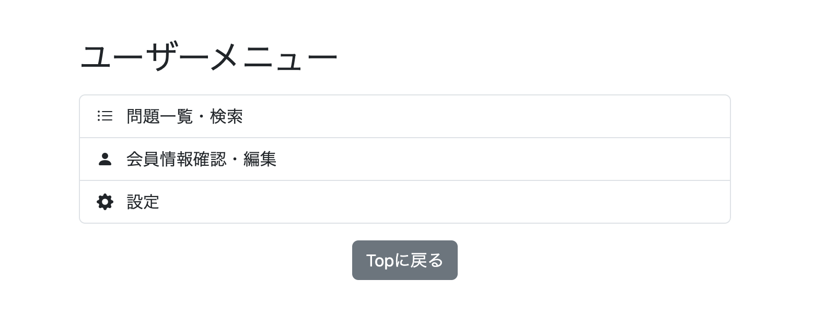

---

# 2. 問題一覧・検索機能の実装

`git commit -m "feat: add language filtering and pronunciation display to question list"`

アプリケーションが所有する問題を一覧表示する画面を作成する。

一覧では検索条件による絞り込みに加え、現在のユーザーの理解度・お気に入り状態も表示する。

また、一覧から理解度の変更、お気に入り登録・解除もできるようにする。

---

## 2-1. QuestionRepositoryに検索Queryを追加

問題一覧では `question` だけでなく、

- `structure`
- `study_history`
- `favorite`

の情報も必要になる。

`structure` は通常の `JOIN`、ユーザーによってレコードの存在しない場合がある `study_history` と `favorite` は `LEFT JOIN` する。

### QuestionRepository

```java
@Query(value = """

        SELECT
            q.question_id         AS questionId,
            q.japanese_text       AS japaneseText,
            q.chinese_text        AS chineseText,
            q.alternative_answer  AS alternativeAnswer,
            s.name                AS structureName,
            s.description_zh_cn   AS structureDescriptionZhCn,
            s.description_zh_tw   AS structureDescriptionZhTw,
            q.difficulty          AS difficulty,
            sh.evaluation         AS evaluation,

            CASE
                WHEN f.question_id IS NOT NULL THEN TRUE
                ELSE FALSE
            END AS favorite,

            q.pinyin                    AS pinyin,
            q.zhuyin                    AS zhuyin,
            q.alternative_answer_pinyin AS alternativeAnswerPinyin,
            q.alternative_answer_zhuyin AS alternativeAnswerZhuyin

        FROM question q

        JOIN structure s
        ON q.structure_id = s.structure_id

        LEFT JOIN study_history sh
        ON (
            q.question_id = sh.question_id
            AND sh.user_id = :userId
        )

        LEFT JOIN favorite f
        ON (
            q.question_id = f.question_id
            AND f.user_id = :userId
        )

        WHERE q.difficulty IN (:difficulties)

        AND (
            :studyCondition = 'ALL'

            OR (
                :studyCondition = 'LEARNED_ONLY'
                AND sh.question_id IS NOT NULL
                AND sh.evaluation IN (:evaluations)
            )

            OR (
                :studyCondition = 'UNLEARNED_ONLY'
                AND sh.question_id IS NULL
            )
        )

        AND (
            :favoriteCondition = 'ALL'

            OR (
                :favoriteCondition = 'FAVORITED'
                AND f.question_id IS NOT NULL
            )

            OR (
                :favoriteCondition = 'NOT_FAVORITED'
                AND f.question_id IS NULL
            )
        )

        AND q.structure_id IN (:structureIds)
        AND q.language_variant IN (:languageVariants)

        AND (
            :japaneseKeyword = ''
            OR LOWER(q.japanese_text)
                LIKE LOWER(CONCAT('%', :japaneseKeyword, '%'))
        )

        AND (
            :chineseKeyword = ''
            OR LOWER(q.chinese_text)
                LIKE LOWER(CONCAT('%', :chineseKeyword, '%'))
            OR LOWER(q.alternative_answer)
                LIKE LOWER(CONCAT('%', :chineseKeyword, '%'))
        )

        ORDER BY q.question_id ASC

        """,

        countQuery = """

        SELECT COUNT(*)

        FROM question q

        JOIN structure s
        ON q.structure_id = s.structure_id

        LEFT JOIN study_history sh
        ON (
            q.question_id = sh.question_id
            AND sh.user_id = :userId
        )

        LEFT JOIN favorite f
        ON (
            q.question_id = f.question_id
            AND f.user_id = :userId
        )

        WHERE q.difficulty IN (:difficulties)

        AND (
            :studyCondition = 'ALL'

            OR (
                :studyCondition = 'LEARNED_ONLY'
                AND sh.question_id IS NOT NULL
                AND sh.evaluation IN (:evaluations)
            )

            OR (
                :studyCondition = 'UNLEARNED_ONLY'
                AND sh.question_id IS NULL
            )
        )

        AND (
            :favoriteCondition = 'ALL'

            OR (
                :favoriteCondition = 'FAVORITED'
                AND f.question_id IS NOT NULL
            )

            OR (
                :favoriteCondition = 'NOT_FAVORITED'
                AND f.question_id IS NULL
            )
        )

        AND q.structure_id IN (:structureIds)
        AND q.language_variant IN (:languageVariants)

        AND (
            :japaneseKeyword = ''
            OR LOWER(q.japanese_text)
                LIKE LOWER(CONCAT('%', :japaneseKeyword, '%'))
        )

        AND (
            :chineseKeyword = ''
            OR LOWER(q.chinese_text)
                LIKE LOWER(CONCAT('%', :chineseKeyword, '%'))
            OR LOWER(q.alternative_answer)
                LIKE LOWER(CONCAT('%', :chineseKeyword, '%'))
        )

        """,
        nativeQuery = true)

Page<UserQuestionListDto> findFilteredUserQuestionList(

        @Param("userId")
        long userId,

        @Param("difficulties")
        List<String> difficulties,

        @Param("evaluations")
        List<String> evaluations,

        @Param("studyCondition")
        String studyCondition,

        @Param("favoriteCondition")
        String favoriteCondition,

        @Param("structureIds")
        List<Long> structureIds,

        @Param("languageVariants")
        List<String> languageVariants,

        @Param("japaneseKeyword")
        String japaneseKeyword,

        @Param("chineseKeyword")
        String chineseKeyword,

        Pageable pageable
);
```

### 検索条件

学習状況は、

```text
ALL
LEARNED_ONLY
UNLEARNED_ONLY
```

の3種類とする。

`study_history` をLEFT JOINしているため、

```text
sh.question_id IS NULL
→ 未学習

sh.question_id IS NOT NULL
→ 学習済み
```

として判定する。

お気に入りについても `favorite` のレコードの有無を利用し、

```text
ALL
FAVORITED
NOT_FAVORITED
```

を切り替える。

### countQuery

戻り値を `Page<UserQuestionListDto>` とするため、メインQueryに加えて `countQuery` を定義する。

`countQuery` は検索結果全体の件数を取得するため、JOIN・WHERE条件はメインQueryと合わせる。

一方、画面表示用のSELECT項目や `ORDER BY` は不要なので、

```sql
SELECT COUNT(*)
```

とする。

---

## 2-2. UserQuestionListDto.javaの作成

問題一覧では `Question` の情報だけでなく、理解度・お気に入り・文法情報など複数テーブルの情報が必要になる。

そのため、一覧画面で必要な情報をまとめて取得するProjection用DTOを作成する。

```java
public interface UserQuestionListDto {

    Long getQuestionId();

    String getJapaneseText();

    String getChineseText();

    String getAlternativeAnswer();

    String getStructureName();

    String getStructureDescriptionZhCn();

    String getStructureDescriptionZhTw();

    Difficulty getDifficulty();

    Evaluation getEvaluation();

    boolean isFavorite();

    String getPinyin();

    String getZhuyin();

    String getAlternativeAnswerPinyin();

    String getAlternativeAnswerZhuyin();

}
```

`structureDescriptionZhCn`・`structureDescriptionZhTw` はTooltip、発音記号関係は詳細モーダルで使用する。

`favorite` は登録済み・未登録の2状態なのでbooleanで受け取る。

---

## 2-3. UserQuestionService.javaの作成

Controllerから受け取った検索条件を整理し、Repositoryへ渡すServiceを作成する。

### UserQuestionService.java

```java
package io.github.mawsonlakes790913.chineseoutputforge.service;

@Service
@RequiredArgsConstructor
public class UserQuestionService {
	
	private final SearchConditionConverter searchConditionConverter;
	private final QuestionRepository questionRepository;
	private final StructureRepository structureRepository;
	
	public Page<UserQuestionListDto> getFilteredUserQuestionList(
			 long userId,
			 List<Difficulty> difficulties,
			 List<Evaluation> evaluations,
			 StudyCondition studyCondition,
			 FavoriteCondition favoriteCondition,
			 List<Long> structureIds,
			 List<LanguageVariant> languageVariants,
			 String japaneseKeyword,
			 String chineseKeyword,
			 Pageable pageable) {
	
		// 難易度
		if (difficulties == null || difficulties.isEmpty()) {
			difficulties = Arrays.asList(Difficulty.values());
		}
		
		// 理解度
		if (evaluations == null || evaluations.isEmpty()) {
			evaluations = Arrays.asList(Evaluation.values());
		}
		
		// 学習条件
		if (studyCondition == null) {
			studyCondition = StudyCondition.ALL;
		}
		
		// お気に入り条件
		if (favoriteCondition == null) {
			favoriteCondition = FavoriteCondition.ALL;
		}
		
		// 文法・構造
		if (structureIds == null || structureIds.isEmpty()) {
			structureIds =
					structureRepository.findAllStructureIds();
		}
		
		// キーワード
		if (japaneseKeyword == null) {
			japaneseKeyword = "";
		}
		
		if (chineseKeyword == null) {
			chineseKeyword = "";
		}
		
		// ここで変換する
		List<String> convertedDifficulties =
				searchConditionConverter
						.convertDifficulty(difficulties);

		List<String> convertedEvaluations =
				searchConditionConverter
						.convertEvaluation(evaluations);

		String convertedStudyCondition =
				searchConditionConverter
						.convertStudyCondition(studyCondition);

		String convertedFavoriteCondition =
				searchConditionConverter
						.convertFavoriteCondition(favoriteCondition);

		List<String> convertedLanguageVariants =
				searchConditionConverter
						.convertLanguageVariant(languageVariants);
		
		return questionRepository.findFilteredUserQuestionList(
				userId,
				convertedDifficulties,
				convertedEvaluations,
				convertedStudyCondition,
				convertedFavoriteCondition,
				structureIds,
				convertedLanguageVariants,
				japaneseKeyword,
				chineseKeyword,
				pageable);
	}		

}
```

チェックボックス形式の検索条件は、何も選択されなかった場合に「検索対象なし」とせず、すべてを検索対象とする。

```text
難易度未指定
→ 全難易度

理解度未指定
→ HARD・GOOD・EASYすべて

文法・構造未指定
→ 全structure
```

学習状況とお気に入りについては、通常のフォーム操作では値が送信されるが、検索条件なしで直接アクセスされた場合にも対応できるよう、`null` の場合は `ALL` とする。

---

## 2-4. StudyCondition.javaの作成

学習状況の検索条件を表すEnumを作成する。

```java
public enum StudyCondition {

    ALL,
    LEARNED_ONLY,
    UNLEARNED_ONLY

}
```

```text
ALL
→ 学習済み・未学習を問わず検索

LEARNED_ONLY
→ 学習済みのみ

UNLEARNED_ONLY
→ 未学習のみ
```

---

## 2-5. SearchConditionConverterの追加

`StudyCondition` と `LanguageVariant` をNative Queryへ渡せるStringへ変換する処理を追加する。

```java
public String convertStudyCondition(
        StudyCondition studyCondition) {
		
	String convertedStudyCondition;
		
	if (studyCondition == null) {
			
		convertedStudyCondition =
				StudyCondition.ALL.name();
			
	} else {
			
		convertedStudyCondition =
				studyCondition.name();
					
	}
		
	return convertedStudyCondition;
}
```

```java
public List<String> convertLanguageVariant(
        List<LanguageVariant> languageVariants) {

    List<String> convertedLanguageVariants =
            new ArrayList<>();

    for (LanguageVariant languageVariant
            : languageVariants) {

        convertedLanguageVariants.add(
                languageVariant.name()
        );
    }

    return convertedLanguageVariants;
}
```

`StudyCondition` は、

```text
ALL            → "ALL"
LEARNED_ONLY   → "LEARNED_ONLY"
UNLEARNED_ONLY → "UNLEARNED_ONLY"
null           → "ALL"
```

としてRepositoryへ渡す。

`LanguageVariant` についてもEnumの `name()` をStringのListへ変換する。

---

## 2-6. StructureRepositoryに全structureId取得処理を追加

文法・構造が何も選択されなかった場合は、すべての文法・構造を検索対象にする。

そのため、DBに存在するすべての `structure_id` を取得するメソッドを追加する。

```java
@Query(value = """
    SELECT DISTINCT structure_id
    FROM structure
    ORDER BY structure_id
    """,
    nativeQuery = true)
List<Long> findAllStructureIds();
```

難易度や理解度はEnumなので `values()` ですべて取得できるが、文法・構造はDBで管理しているためRepositoryから取得する。

---

## 2-7. UserQuestionController.javaの作成

`/user/question/list` の表示と検索を担当するControllerを作成する。

### UserQuestionController.java

```java
@Controller
@RequiredArgsConstructor
public class UserQuestionController {
	
	private final UserAccountService userAccountService;
	private final UserQuestionService userQuestionService;
	private final PaginationService paginationService;
	private final ReviewService reviewService;
	
	@GetMapping("/user/question/list")
	public String getUserQuestionList(
	        @AuthenticationPrincipal UserDetails loginUser,
	        @PageableDefault(page = 0, size = 50) Pageable pageable,
	        @RequestParam(required = false)
	        List<Difficulty> difficulties,
	        @RequestParam(required = false)
	        List<Evaluation> evaluations,
	        @RequestParam(required = false)
	        StudyCondition studyCondition,
	        @RequestParam(required = false)
	        FavoriteCondition favoriteCondition,
	        @RequestParam(required = false)
	        List<Long> structureIds,
	        @RequestParam(required = false)
	        List<LanguageVariant> languageVariants,
	        @RequestParam(
	                required = false,
	                defaultValue = "")
	        String japaneseKeyword,
	        @RequestParam(
	                required = false,
	                defaultValue = "")
	        String chineseKeyword,
	        HttpSession session,
	        Model model) {

	    Users user =
	            userAccountService.getUserOne(
	                    loginUser.getUsername());

	    Long userId = user.getId();
	    
	    // 学習対象言語が未指定の場合は、
	    // セッションで設定されている学習対象言語を使用
	    if (languageVariants == null
	            || languageVariants.isEmpty()) {

	        LanguageVariant languageVariant =
	                (LanguageVariant)
	                session.getAttribute(
	                        "languageVariant");

	        if (languageVariant == null) {
	            languageVariant =
	                    LanguageVariant.MAINLAND;
	        }

	        languageVariants =
	                Arrays.asList(languageVariant);
	    }

	    model.addAttribute(
	            "selectedLanguageVariants",
	            languageVariants
	    );

	    // 検索
	    // パラメータが未指定ならService側で全件扱い
	    Page<UserQuestionListDto> questionList =
	    		userQuestionService
	    		    .getFilteredUserQuestionList(
	                    userId,
	                    difficulties,
	                    evaluations,
	                    studyCondition,
	                    favoriteCondition,
	                    structureIds,
	                    languageVariants,
	                    japaneseKeyword,
	                    chineseKeyword,
	                    pageable);

	    PaginationDto pagination =
	    		paginationService
	    		    .createPagination(questionList);
	    
		long start =
		        questionList.getNumber()
		        * questionList.getSize() + 1;

		long end =
		        start
		        + questionList
		            .getNumberOfElements() - 1;

		model.addAttribute("start", start);
		model.addAttribute("end", end);
		model.addAttribute(
		        "total",
		        questionList.getTotalElements());

	    // 一覧
	    model.addAttribute(
	            "questionList",
	            questionList.getContent());

	    model.addAttribute(
	            "page",
	            questionList);

	    model.addAttribute(
	            "pagination",
	            pagination);

	    // 選択肢用structureを取得
	    model.addAttribute(
	            "structures",
	            reviewService.findStructures());
	    
	    // 表示する発音記号を取得
	    PronunciationType pronunciationType =
	            (PronunciationType)
	            session.getAttribute(
	                    "pronunciationType");

	    if (pronunciationType == null) {
	        pronunciationType =
	                PronunciationType.PINYIN;
	    }

	    model.addAttribute(
	            "pronunciationType",
	            pronunciationType);

	    // 検索条件を画面へ戻す
	    model.addAttribute(
	            "selectedDifficulties",
	            difficulties);

	    model.addAttribute(
	            "selectedEvaluations",
	            evaluations);

	    model.addAttribute(
	            "selectedStudyCondition",
	            studyCondition);

	    model.addAttribute(
	            "selectedFavoriteCondition",
	            favoriteCondition);

	    model.addAttribute(
	            "selectedStructureIds",
	            structureIds);

	    model.addAttribute(
	            "japaneseKeyword",
	            japaneseKeyword);

	    model.addAttribute(
	            "chineseKeyword",
	            chineseKeyword);

	    return "user/question/list";
	}

}
```

1ページあたりの表示件数は、

```java
@PageableDefault(page = 0, size = 50)
```

として50件とする。

### 表示言語

表示言語が未指定の場合は、Sessionに設定されている現在の学習対象言語を使用する。

```java
if (languageVariants == null
        || languageVariants.isEmpty()) {

    LanguageVariant languageVariant =
            (LanguageVariant)
            session.getAttribute("languageVariant");

    if (languageVariant == null) {
        languageVariant =
                LanguageVariant.MAINLAND;
    }

    languageVariants =
            Arrays.asList(languageVariant);
}
```

これにより、例えば現在の学習対象が普通話の場合は、初回アクセス時にも普通話の問題を対象とする。

### 表示件数

検索結果全体のうち、現在何件目から何件目まで表示しているかを計算する。

```java
long start =
        questionList.getNumber()
        * questionList.getSize() + 1;

long end =
        start
        + questionList.getNumberOfElements() - 1;
```

例えば101件を50件ずつ表示する場合は、

```text
1ページ目 → 1-50
2ページ目 → 51-100
3ページ目 → 101-101
```

となる。

### 検索条件を画面へ戻す

検索後も検索条件を画面に表示するため、受け取った値をModelへ戻す。

```java
model.addAttribute(
        "selectedDifficulties",
        difficulties);

model.addAttribute(
        "selectedEvaluations",
        evaluations);

model.addAttribute(
        "selectedStudyCondition",
        studyCondition);

model.addAttribute(
        "selectedFavoriteCondition",
        favoriteCondition);

model.addAttribute(
        "selectedStructureIds",
        structureIds);

model.addAttribute(
        "japaneseKeyword",
        japaneseKeyword);

model.addAttribute(
        "chineseKeyword",
        chineseKeyword);
```

---

## 2-8. PaginationDto.javaの作成

ページネーション表示に必要な情報をまとめてControllerからHTMLへ渡すため、`PaginationDto` を作成する。

```java
@Data
public class PaginationDto {

    private int currentPage;

    private int displayStartPage;

    private int displayEndPage;

    private boolean showFirstEllipsis;

    private boolean showLastEllipsis;

}
```

各フィールドは、

```text
currentPage
→ 現在ページ

displayStartPage
→ 中央部分に表示する最初のページ

displayEndPage
→ 中央部分に表示する最後のページ

showFirstEllipsis
→ 先頭側の「...」を表示するか

showLastEllipsis
→ 末尾側の「...」を表示するか
```

を表す。

---

## 2-9. PaginationService.javaの作成

ページ数が多い場合でも、

```text
1 ... 3 4 [5] 6 7 ... 10
```

のように現在ページ周辺だけを表示できるようにする。

### PaginationService.java

```java
@Service
public class PaginationService {
	
	public PaginationDto createPagination(
	        Page<?> page) {

	    // 現在のページ番号(0始まり)
	    int currentPage =
	            page.getNumber();

	    // ページ番号の最小値・最大値
	    int startPage = 0;

	    int endPage =
	            page.getTotalPages() - 1;

	    // 現在ページの前後2ページを
	    // 表示範囲とする
	    int displayStartPage =
	            Math.max(
	                    startPage,
	                    currentPage - 2);

	    int displayEndPage =
	            Math.min(
	                    endPage,
	                    currentPage + 2);

	    // 表示ページ数が5ページ未満の場合は
	    // 不足分を補う
	    int shortage = 0;

	    // 先頭側に寄っている場合は
	    // 右側へ表示範囲を広げる
	    if (displayStartPage == startPage) {

	        shortage =
	                4 - (
	                    displayEndPage
	                    - displayStartPage
	                );

	        displayEndPage =
	                Math.min(
	                        endPage,
	                        displayEndPage
	                        + shortage);

	    // 末尾側に寄っている場合は
	    // 左側へ表示範囲を広げる
	    } else if (
	            displayEndPage == endPage) {

	        shortage =
	                4 - (
	                    displayEndPage
	                    - displayStartPage
	                );

	        displayStartPage =
	                Math.max(
	                        startPage,
	                        displayStartPage
	                        - shortage);
	    }

	    // 先頭・末尾の省略記号(...)
	    // を表示するか判定
	    boolean showFirstEllipsis =
	            displayStartPage >= 3;

	    boolean showLastEllipsis =
	            displayEndPage
	            <= endPage - 3;

	    // ページネーション情報をDTOへ格納
	    PaginationDto pagination =
	            new PaginationDto();

	    pagination.setCurrentPage(
	            currentPage);

	    pagination.setDisplayStartPage(
	            displayStartPage);

	    pagination.setDisplayEndPage(
	            displayEndPage);

	    pagination.setShowFirstEllipsis(
	            showFirstEllipsis);

	    pagination.setShowLastEllipsis(
	            showLastEllipsis);

	    return pagination;
	}

}
```

基本的には現在ページの前後2ページを表示する。

ただし、現在ページが先頭または末尾に近い場合は表示数が5ページ未満になるため、不足した分を反対側へ広げる。

```text
[1] 2 3 4 5 ... 10

1 [2] 3 4 5 ... 10

1 ... 6 7 8 9 [10]
```

また、`...` は2ページ以上を省略する場合だけ表示する。

```java
boolean showFirstEllipsis =
        displayStartPage >= 3;

boolean showLastEllipsis =
        displayEndPage <= endPage - 3;
```

計算結果は `PaginationDto` に格納し、Controllerを経由してHTMLへ渡す。

# 2-10. 問題一覧画面の作成

`/user/question/list.html` を作成し、検索フォーム・問題一覧・ページネーション・詳細モーダル・理解度変更機能を1画面にまとめる。

## /user/question/list.html

```html
<!DOCTYPE html>
<html xmlns:th="http://www.thymeleaf.org"
      xmlns:layout="http://www.ultraq.net.nz/thymeleaf/layout"
      layout:decorate="~{layout/layout}">

<head>
    <meta charset="UTF-8">
    <title>Chinese Output Forge</title>

    <link rel="stylesheet"
          href="https://cdn.jsdelivr.net/npm/bootstrap-icons@1.13.1/font/bootstrap-icons.min.css">

    <script th:src="@{/js/user/question/list.js}"
            defer>
    </script>

    <meta name="_csrf"
          th:content="${_csrf.token}">

    <meta name="_csrf_header"
          th:content="${_csrf.headerName}">
</head>

<body>

<div layout:fragment="content" class="w-100">

    <h2 class="mb-4"
        th:text="#{user.question.list.title}">
        問題一覧
    </h2>

    <!-- ========================= -->
    <!-- 検索フォーム -->
    <!-- ========================= -->

    <form th:action="@{/user/question/list}"
          method="get"
          class="card p-3 mb-3">

        <div class="row g-3">

            <!-- ========================= -->
            <!-- 学習対象言語 -->
            <!-- ========================= -->

            <div class="col-md-12">

                <label class="form-label fw-bold"
                       th:text="#{user.question.list.languageVariant}">
                    学習対象言語
                </label>

                <div class="d-flex align-items-center gap-4">

                    <!-- 普通話 -->
                    <div class="form-check">

                        <input class="form-check-input"
                               type="checkbox"
                               name="languageVariants"
                               value="MAINLAND"
                               id="mainland"
                               th:checked="${selectedLanguageVariants != null
                                   and selectedLanguageVariants.![name()].contains('MAINLAND')}">

                        <label class="form-check-label"
                               for="mainland"
                               th:classappend="${session.languageVariant == null
                                   or session.languageVariant.name() == 'MAINLAND'}
                                   ? ' fs-5 fw-bold'
                                   : ''">
                            🇨🇳普通话
                        </label>

                    </div>

                    <!-- 國語 -->
                    <div class="form-check">

                        <input class="form-check-input"
                               type="checkbox"
                               name="languageVariants"
                               value="TAIWAN"
                               id="taiwan"
                               th:checked="${selectedLanguageVariants != null
                                   and selectedLanguageVariants.![name()].contains('TAIWAN')}">

                        <label class="form-check-label"
                               for="taiwan"
                               th:classappend="${session.languageVariant != null
                                   and session.languageVariant.name() == 'TAIWAN'}
                                   ? ' fs-5 fw-bold'
                                   : ''">
                            🇹🇼國語
                        </label>

                    </div>

                </div>

            </div>

            <!-- ========================= -->
            <!-- 難易度 -->
            <!-- ========================= -->

            <div class="col-md-4">

                <label class="form-label fw-bold"
                       th:text="#{user.question.list.difficulty}">
                    難易度
                </label>

                <div class="form-check">

                    <input class="form-check-input"
                           type="checkbox"
                           name="difficulties"
                           value="BEGINNER"
                           id="beginner"
                           th:checked="${selectedDifficulties == null
                               or selectedDifficulties.![name()].contains('BEGINNER')}">

                    <label class="form-check-label"
                           for="beginner"
                           th:text="#{difficulty.beginner}">
                        初級
                    </label>

                </div>

                <div class="form-check">

                    <input class="form-check-input"
                           type="checkbox"
                           name="difficulties"
                           value="INTERMEDIATE"
                           id="intermediate"
                           th:checked="${selectedDifficulties == null
                               or selectedDifficulties.![name()].contains('INTERMEDIATE')}">

                    <label class="form-check-label"
                           for="intermediate"
                           th:text="#{difficulty.intermediate}">
                        中級
                    </label>

                </div>

                <div class="form-check">

                    <input class="form-check-input"
                           type="checkbox"
                           name="difficulties"
                           value="ADVANCED"
                           id="advanced"
                           th:checked="${selectedDifficulties == null
                               or selectedDifficulties.![name()].contains('ADVANCED')}">

                    <label class="form-check-label"
                           for="advanced"
                           th:text="#{difficulty.advanced}">
                        上級
                    </label>

                </div>

            </div>

            <!-- ========================= -->
            <!-- 理解度 -->
            <!-- ========================= -->

            <div class="col-md-4">

                <label class="form-label fw-bold"
                       th:text="#{user.question.list.evaluation}">
                    理解度
                </label>

                <div class="form-check">

                    <input class="form-check-input evaluationFilter"
                           type="checkbox"
                           name="evaluations"
                           value="HARD"
                           id="hard"
                           th:checked="${selectedEvaluations != null
                               and selectedEvaluations.![name()].contains('HARD')}">

                    <label class="form-check-label"
                           for="hard">
                        Hard
                    </label>

                </div>

                <div class="form-check">

                    <input class="form-check-input evaluationFilter"
                           type="checkbox"
                           name="evaluations"
                           value="GOOD"
                           id="good"
                           th:checked="${selectedEvaluations != null
                               and selectedEvaluations.![name()].contains('GOOD')}">

                    <label class="form-check-label"
                           for="good">
                        Good
                    </label>

                </div>

                <div class="form-check">

                    <input class="form-check-input evaluationFilter"
                           type="checkbox"
                           name="evaluations"
                           value="EASY"
                           id="easy"
                           th:checked="${selectedEvaluations != null
                               and selectedEvaluations.![name()].contains('EASY')}">

                    <label class="form-check-label"
                           for="easy">
                        Easy
                    </label>

                </div>

                <span id="evaluationWarning"
                      class="text-danger small"
                      th:text="#{user.question.list.evaluation.warning}">
                    理解度は「学習済み」を選択した場合のみ指定できます。
                </span>

            </div>

            <!-- ========================= -->
            <!-- 学習状況 -->
            <!-- ========================= -->

            <div class="col-md-4">

                <label class="form-label fw-bold"
                       th:text="#{user.question.list.studyCondition}">
                    学習状況
                </label>

                <select class="form-select"
                        name="studyCondition"
                        id="studyCondition">

                    <option value="ALL"
                            th:selected="${selectedStudyCondition == null
                                or selectedStudyCondition.name() == 'ALL'}"
                            th:text="#{user.question.list.studyCondition.all}">
                        すべて
                    </option>

                    <option value="LEARNED_ONLY"
                            th:selected="${selectedStudyCondition != null
                                and selectedStudyCondition.name() == 'LEARNED_ONLY'}"
                            th:text="#{user.question.list.studyCondition.learned}">
                        学習済み
                    </option>

                    <option value="UNLEARNED_ONLY"
                            th:selected="${selectedStudyCondition != null
                                and selectedStudyCondition.name() == 'UNLEARNED_ONLY'}"
                            th:text="#{user.question.list.studyCondition.unlearned}">
                        未学習
                    </option>

                </select>

            </div>

            <!-- ========================= -->
            <!-- お気に入り -->
            <!-- ========================= -->

            <div class="col-md-4">

                <label class="form-label fw-bold"
                       th:text="#{user.question.list.favorite}">
                    お気に入り
                </label>

                <select class="form-select"
                        name="favoriteCondition">

                    <option value="ALL"
                            th:selected="${selectedFavoriteCondition == null
                                or selectedFavoriteCondition.name() == 'ALL'}"
                            th:text="#{user.question.list.favorite.all}">
                        すべて
                    </option>

                    <option value="FAVORITED"
                            th:selected="${selectedFavoriteCondition != null
                                and selectedFavoriteCondition.name() == 'FAVORITED'}"
                            th:text="#{user.question.list.favorite.only}">
                        お気に入りのみ
                    </option>

                    <option value="NOT_FAVORITED"
                            th:selected="${selectedFavoriteCondition != null
                                and selectedFavoriteCondition.name() == 'NOT_FAVORITED'}"
                            th:text="#{user.question.list.favorite.not}">
                        お気に入り以外
                    </option>

                </select>

            </div>

            <!-- ========================= -->
            <!-- 文法・構造 -->
            <!-- ========================= -->

            <div class="col-12">

                <div class="card">

                    <div class="card-header fw-bold"
                         th:text="#{user.question.list.structure}">
                        文法・構造
                    </div>

                    <div class="card-body">

                        <div class="mb-3">

                            <button type="button"
                                    id="selectAllStructures"
                                    class="btn btn-outline-primary btn-sm"
                                    th:text="#{user.question.list.structure.selectAll}">
                                すべて選択
                            </button>

                            <button type="button"
                                    id="clearAllStructures"
                                    class="btn btn-outline-secondary btn-sm"
                                    th:text="#{user.question.list.structure.clearAll}">
                                すべて解除
                            </button>

                        </div>

                        <div id="structureList"
                             class="d-flex flex-wrap gap-2 structure-list">

                            <label th:each="structure : ${structures}"
                                   class="bg-light rounded px-3 py-2"
                                   data-bs-toggle="tooltip"
                                   data-bs-placement="top"
                                   th:data-bs-title="${session.languageVariant != null
                                       && session.languageVariant.name() == 'TAIWAN'
                                       ? structure.descriptionZhTw
                                       : structure.descriptionZhCn}">

                                <input class="form-check-input me-2"
                                       type="checkbox"
                                       name="structureIds"
                                       th:value="${structure.structureId}"
                                       th:checked="${selectedStructureIds == null
                                           or selectedStructureIds.contains(structure.structureId)}">

                                <span th:text="${structure.name}">
                                    文法・構造
                                </span>

                            </label>

                        </div>

                        <div class="text-center mt-3">

                            <button type="button"
                                    id="toggleStructures"
                                    class="btn btn-link btn-sm"
                                    th:data-show-text="#{user.question.list.structure.showAll}"
                                    th:data-hide-text="#{user.question.list.structure.collapse}"
                                    th:text="#{user.question.list.structure.showAll}">
                                すべて表示
                            </button>

                        </div>

                    </div>

                </div>

            </div>

            <!-- ========================= -->
            <!-- 日本語キーワード -->
            <!-- ========================= -->

            <div class="col-md-4">

                <label class="form-label fw-bold"
                       th:text="#{user.question.list.japaneseKeyword}">
                    日本語キーワード
                </label>

                <input class="form-control"
                       type="text"
                       name="japaneseKeyword"
                       th:value="${japaneseKeyword}">

            </div>

            <!-- ========================= -->
            <!-- 中国語キーワード -->
            <!-- ========================= -->

            <div class="col-md-4">

                <label class="form-label fw-bold"
                       th:text="#{user.question.list.chineseKeyword}">
                    中国語キーワード
                </label>

                <input class="form-control"
                       type="text"
                       name="chineseKeyword"
                       th:value="${chineseKeyword}">

            </div>

            <!-- ========================= -->
            <!-- 検索ボタン -->
            <!-- ========================= -->

            <div class="col-md-4 d-grid align-self-end">

                <button class="btn btn-primary"
                        type="submit">

                    <i class="bi bi-search me-1"></i>

                    <span th:text="#{user.question.list.search}">
                        検索
                    </span>

                </button>

            </div>

        </div>

    </form>

    <!-- ========================= -->
    <!-- 件数 -->
    <!-- ========================= -->

    <div class="text-center mb-3">

        <span th:text="${start}"></span>
        -
        <span th:text="${end}"></span>
        /
        <span th:text="${total}"></span>

        <span th:text="#{user.question.list.items}">
            件
        </span>

    </div>

    <!-- ========================= -->
    <!-- 問題一覧 -->
    <!-- ========================= -->

    <div class="table-responsive">

        <table class="table table-hover align-middle">

            <thead class="table-dark">

            <tr>

                <th class="text-nowrap"
                    style="width:5%;"
                    th:text="#{user.question.list.questionId}">
                    問題番号
                </th>

                <th style="width:22%;"
                    th:text="#{user.question.list.japanese}">
                    日本語
                </th>

                <th style="width:22%;"
                    th:text="#{user.question.list.chinese}">
                    中国語
                </th>

                <th style="width:14%;"
                    th:text="#{user.question.list.alternativeAnswer}">
                    別解
                </th>

                <th style="width:10%;"
                    th:text="#{user.question.list.structure}">
                    文法・構造
                </th>

                <th class="text-nowrap"
                    th:text="#{user.question.list.difficulty}">
                    難易度
                </th>

                <th class="text-nowrap"
                    th:text="#{user.question.list.detail}">
                    詳細
                </th>

                <th class="text-nowrap"
                    th:text="#{user.question.list.evaluation}">
                    理解度
                </th>

                <th class="text-nowrap"
                    th:text="#{user.question.list.favorite}">
                    お気に入り
                </th>

            </tr>

            </thead>

            <tbody>

            <tr th:each="question : ${questionList}">

                <!-- 問題番号 -->
                <td th:text="${question.questionId}">
                </td>

                <!-- 日本語 -->
                <td th:text="${question.japaneseText}">
                </td>

                <!-- 中国語 -->
                <td th:text="${question.chineseText}">
                </td>

                <!-- 別解 -->
                <td th:text="${question.alternativeAnswer != null
                    ? (#strings.length(question.alternativeAnswer) > 20
                        ? #strings.substring(question.alternativeAnswer, 0, 20) + '…'
                        : question.alternativeAnswer)
                    : ''}">
                </td>

                <!-- 文法・構造 -->
                <td>

                    <span th:text="${question.structureName}"
                          data-bs-toggle="tooltip"
                          data-bs-placement="top"
                          th:data-bs-title="${session.languageVariant != null
                              && session.languageVariant.name() == 'TAIWAN'
                              ? question.structureDescriptionZhTw
                              : question.structureDescriptionZhCn}">
                        文法・構造
                    </span>

                </td>

                <!-- 難易度 -->
                <td>

                    <span class="text-danger fw-bold"
                          th:if="${question.difficulty.name() == 'BEGINNER'}"
                          th:text="#{difficulty.beginner}">
                        初級
                    </span>

                    <span class="text-primary fw-bold"
                          th:if="${question.difficulty.name() == 'INTERMEDIATE'}"
                          th:text="#{difficulty.intermediate}">
                        中級
                    </span>

                    <span class="text-success fw-bold"
                          th:if="${question.difficulty.name() == 'ADVANCED'}"
                          th:text="#{difficulty.advanced}">
                        上級
                    </span>

                </td>

                <!-- 詳細 -->
                <td>

                    <button type="button"
                            class="detailButton btn btn-outline-primary btn-sm text-nowrap"
                            data-bs-toggle="modal"
                            data-bs-target="#questionDetailModal"
                            th:data-japanese="${question.japaneseText}"
                            th:data-chinese="${question.chineseText}"
                            th:data-alternative="${question.alternativeAnswer}"
                            th:text="#{user.question.list.detail}"
                            th:data-pinyin="${question.pinyin}"
                            th:data-zhuyin="${question.zhuyin}"
                            th:data-alternative-pinyin="${question.alternativeAnswerPinyin}"
                            th:data-alternative-zhuyin="${question.alternativeAnswerZhuyin}">
                        詳細
                    </button>

                </td>

                <!-- 理解度 -->
                <td>

                    <span th:if="${question.evaluation == null}"
                          class="text-secondary text-nowrap"
                          th:text="#{user.question.list.unlearned}">
                        未学習
                    </span>

                    <button th:if="${question.evaluation?.name() == 'HARD'}"
                            class="btn btn-sm btn-danger evaluationButton"
                            th:data-question-id="${question.questionId}"
                            data-bs-toggle="modal"
                            data-bs-target="#evaluationModal">
                        Hard
                    </button>

                    <button th:if="${question.evaluation?.name() == 'GOOD'}"
                            class="btn btn-sm btn-primary evaluationButton"
                            th:data-question-id="${question.questionId}"
                            data-bs-toggle="modal"
                            data-bs-target="#evaluationModal">
                        Good
                    </button>

                    <button th:if="${question.evaluation?.name() == 'EASY'}"
                            class="btn btn-sm btn-success evaluationButton"
                            th:data-question-id="${question.questionId}"
                            data-bs-toggle="modal"
                            data-bs-target="#evaluationModal">
                        Easy
                    </button>

                </td>

                <!-- お気に入り -->
                <td class="text-center">

                    <button class="btn btn-link p-0 favoriteButton"
                            th:data-question-id="${question.questionId}">

                        <i class="bi bi-heart-fill text-danger"
                           th:if="${question.favorite}">
                        </i>

                        <i class="bi bi-heart text-secondary"
                           th:unless="${question.favorite}">
                        </i>

                    </button>

                </td>

            </tr>

            </tbody>

        </table>

    </div>

    <!-- ========================= -->
    <!-- ページネーション -->
    <!-- ========================= -->

    <nav class="mt-4 mb-5"
         th:if="${page.totalPages > 0}">

        <ul class="pagination justify-content-center">

            <!-- 前へ -->
            <li class="page-item"
                th:classappend="${page.first} ? ' disabled'">

                <a class="page-link"
                   th:href="@{/user/question/list(
                       page=${page.number - 1},
                       size=${page.size},
                       difficulties=${selectedDifficulties},
                       evaluations=${selectedEvaluations},
                       studyCondition=${selectedStudyCondition},
                       favoriteCondition=${selectedFavoriteCondition},
                       structureIds=${selectedStructureIds},
                       japaneseKeyword=${japaneseKeyword},
                       chineseKeyword=${chineseKeyword}
                   )}"
                   th:text="#{user.question.list.previous}">
                    前へ
                </a>

            </li>

            <!-- 1ページ目 -->
            <li class="page-item"
                th:classappend="${page.number == 0} ? ' active'">

                <a class="page-link"
                   th:href="@{/user/question/list(
                       page=0,
                       size=${page.size},
                       difficulties=${selectedDifficulties},
                       evaluations=${selectedEvaluations},
                       studyCondition=${selectedStudyCondition},
                       favoriteCondition=${selectedFavoriteCondition},
                       structureIds=${selectedStructureIds},
                       japaneseKeyword=${japaneseKeyword},
                       chineseKeyword=${chineseKeyword}
                   )}">
                    1
                </a>

            </li>

            <!-- ... 先頭側 -->
            <li class="page-item disabled"
                th:if="${pagination.showFirstEllipsis}">

                <span class="page-link">...</span>

            </li>

            <!-- 中央のページ番号 -->
            <li class="page-item"
                th:each="i : ${#numbers.sequence(
                    pagination.displayStartPage,
                    pagination.displayEndPage)}"
                th:if="${i != 0 and i != page.totalPages - 1}"
                th:classappend="${i == pagination.currentPage} ? ' active'">

                <a class="page-link"
                   th:href="@{/user/question/list(
                       page=${i},
                       size=${page.size},
                       difficulties=${selectedDifficulties},
                       evaluations=${selectedEvaluations},
                       studyCondition=${selectedStudyCondition},
                       favoriteCondition=${selectedFavoriteCondition},
                       structureIds=${selectedStructureIds},
                       japaneseKeyword=${japaneseKeyword},
                       chineseKeyword=${chineseKeyword}
                   )}"
                   th:text="${i + 1}">
                </a>

            </li>

            <!-- ... 末尾側 -->
            <li class="page-item disabled"
                th:if="${pagination.showLastEllipsis}">

                <span class="page-link">...</span>

            </li>

            <!-- 最終ページ -->
            <li class="page-item"
                th:if="${page.totalPages > 1}"
                th:classappend="${page.last} ? ' active'">

                <a class="page-link"
                   th:href="@{/user/question/list(
                       page=${page.totalPages - 1},
                       size=${page.size},
                       difficulties=${selectedDifficulties},
                       evaluations=${selectedEvaluations},
                       studyCondition=${selectedStudyCondition},
                       favoriteCondition=${selectedFavoriteCondition},
                       structureIds=${selectedStructureIds},
                       japaneseKeyword=${japaneseKeyword},
                       chineseKeyword=${chineseKeyword}
                   )}"
                   th:text="${page.totalPages}">
                </a>

            </li>

            <!-- 次へ -->
            <li class="page-item"
                th:classappend="${page.last} ? ' disabled'">

                <a class="page-link"
                   th:href="@{/user/question/list(
                       page=${page.number + 1},
                       size=${page.size},
                       difficulties=${selectedDifficulties},
                       evaluations=${selectedEvaluations},
                       studyCondition=${selectedStudyCondition},
                       favoriteCondition=${selectedFavoriteCondition},
                       structureIds=${selectedStructureIds},
                       japaneseKeyword=${japaneseKeyword},
                       chineseKeyword=${chineseKeyword}
                   )}"
                   th:text="#{user.question.list.next}">
                    次へ
                </a>

            </li>

        </ul>

    </nav>

    <!-- ========================= -->
    <!-- 戻る -->
    <!-- ========================= -->

    <div class="text-center mt-3 mb-3">

        <a th:href="@{/user/menu}"
           class="btn btn-secondary"
           th:text="#{user.question.list.backToMenu}">
            ユーザーメニューに戻る
        </a>

    </div>

    <!-- ========================= -->
    <!-- 問題詳細モーダル -->
    <!-- ========================= -->

    <div class="modal fade"
         id="questionDetailModal"
         th:data-pronunciation-type="${pronunciationType}">

        <div class="modal-dialog">

            <div class="modal-content">

                <div class="modal-header">

                    <h5 class="modal-title"
                        th:text="#{user.question.list.detailTitle}">
                        問題詳細
                    </h5>

                    <button type="button"
                            class="btn-close"
                            data-bs-dismiss="modal">
                    </button>

                </div>

                <div class="modal-body">

                    <!-- 日本語 -->
                    <p>

                        <strong th:text="#{user.question.list.japanese}">
                            日本語
                        </strong>

                        <br>

                        <span id="modalJapanese"></span>

                    </p>

                    <!-- 中国語 -->
                    <div class="mb-3">

                        <strong th:text="#{user.question.list.chinese}">
                            中国語
                        </strong>

                        <br>

                        <span id="modalChinese"></span>

                        <div id="modalChinesePronunciationArea"
                             class="text-secondary small mt-1">

                            <span id="modalChinesePronunciation"></span>

                        </div>

                    </div>

                    <!-- 別解 -->
                    <div id="modalAlternativeArea"
                         class="mb-3">

                        <strong th:text="#{user.question.list.alternativeAnswer}">
                            別解
                        </strong>

                        <br>

                        <span id="modalAlternative"></span>

                        <div id="modalAlternativePronunciationArea"
                             class="text-secondary small mt-1">

                            <span id="modalAlternativePronunciation"></span>

                        </div>

                    </div>

                </div>

                <div class="modal-footer">

                    <button type="button"
                            class="btn btn-secondary"
                            data-bs-dismiss="modal"
                            th:text="#{common.close}">
                        閉じる
                    </button>

                </div>

            </div>

        </div>

    </div>

    <!-- ========================= -->
    <!-- 理解度変更モーダル -->
    <!-- ========================= -->

    <div class="modal fade"
         id="evaluationModal">

        <div class="modal-dialog">

            <div class="modal-content">

                <div class="modal-header">

                    <h5 class="modal-title"
                        th:text="#{user.question.list.changeEvaluation}">
                        理解度変更
                    </h5>

                    <button type="button"
                            class="btn-close"
                            data-bs-dismiss="modal">
                    </button>

                </div>

                <div class="modal-body text-center">

                    <button class="btn btn-danger evaluationSelect"
                            data-evaluation="HARD">
                        Hard
                    </button>

                    <button class="btn btn-primary evaluationSelect"
                            data-evaluation="GOOD">
                        Good
                    </button>

                    <button class="btn btn-success evaluationSelect"
                            data-evaluation="EASY">
                        Easy
                    </button>

                </div>

            </div>

        </div>

    </div>

</div>

</body>
</html>
```

---

# 2-11. 検索フォームの表示

検索フォームでは以下を指定できるようにした。

- 表示言語
- 難易度
- 理解度
- 学習状況
- お気に入り
- 文法・構造
- 日本語キーワード
- 中国語キーワード

表示言語は普通話・國語を複数選択可能にする。

現在Sessionで学習対象になっている言語については、

```html
th:classappend="${session.languageVariant == null
    or session.languageVariant.name() == 'MAINLAND'}
    ? ' fs-5 fw-bold'
    : ''"
```

のように強調表示し、**検索対象として選択している言語と、現在の学習対象言語を区別できるようにした。**

文法・構造は項目数が多いため、

```text
すべて選択
すべて解除
すべて表示
折りたたむ
```

を用意する。

また、各文法・構造にカーソルを合わせるとTooltipで説明を確認できるようにした。

---

# 2-12. 問題一覧の表示

検索結果には、

- 問題番号
- 日本語
- 中国語
- 別解
- 文法・構造
- 難易度
- 詳細
- 理解度
- お気に入り

を表示する。

## 別解の省略

別解が長い場合、そのまま表示すると一覧表が横に広がるため、20文字を超えた場合は省略する。

```html
<td th:text="${question.alternativeAnswer != null
    ? (#strings.length(question.alternativeAnswer) > 20
        ? #strings.substring(question.alternativeAnswer, 0, 20) + '…'
        : question.alternativeAnswer)
    : ''}">
</td>
```

```text
別解なし
→ 空欄

20文字以下
→ そのまま表示

20文字超
→ 先頭20文字 + …
```

## 文法・構造

一覧には文法・構造名を表示し、説明はTooltipに表示する。

```html
<span th:text="${question.structureName}"
      data-bs-toggle="tooltip"
      data-bs-placement="top"
      th:data-bs-title="${session.languageVariant != null
          && session.languageVariant.name() == 'TAIWAN'
          ? question.structureDescriptionZhTw
          : question.structureDescriptionZhCn}">
```

國語を学習対象としている場合は繁体字、それ以外では簡体字の説明を使用する。

## 理解度

`evaluation` が存在しない場合は、

```text
未学習
```

と表示する。

学習済みの場合は、

```text
HARD → Hard
GOOD → Good
EASY → Easy
```

のボタンを表示し、クリックすると理解度変更モーダルを開く。

## お気に入り

お気に入り登録済みなら、

```html
<i class="bi bi-heart-fill text-danger">
```

未登録なら、

```html
<i class="bi bi-heart text-secondary">
```

を表示する。

---

# 2-13. 問題詳細をモーダルで表示

一覧表にすべての情報を表示すると横幅が大きくなるため、詳細情報はモーダルへ分離した。

詳細ボタンには、

```html
th:data-japanese="${question.japaneseText}"
th:data-chinese="${question.chineseText}"
th:data-alternative="${question.alternativeAnswer}"
th:data-pinyin="${question.pinyin}"
th:data-zhuyin="${question.zhuyin}"
th:data-alternative-pinyin="${question.alternativeAnswerPinyin}"
th:data-alternative-zhuyin="${question.alternativeAnswerZhuyin}"
```

として必要な値を持たせる。

JavaScriptはこれらの `data-*` を取得してモーダルへ表示する。

表示する発音記号はSessionの `PronunciationType` に従い、

```text
PINYIN
ZHUYIN
NONE
```

を切り替える。

---

# 2-14. ページネーションの表示

`PaginationService` で計算した値を利用し、

```text
1 ... 3 4 [5] 6 7 ... 10
```

の形式でページネーションを表示する。

ページ移動時には検索条件もURLへ渡す。

```html
difficulties=${selectedDifficulties},
evaluations=${selectedEvaluations},
studyCondition=${selectedStudyCondition},
favoriteCondition=${selectedFavoriteCondition},
structureIds=${selectedStructureIds},
japaneseKeyword=${japaneseKeyword},
chineseKeyword=${chineseKeyword}
```

これにより、検索結果の2ページ目以降へ移動しても検索条件を維持できる。

---

# 2-15. JavaScriptによる画面操作

`list.js` では主に以下を担当する。

```text
・文法・構造のすべて選択
・文法・構造のすべて解除
・文法・構造一覧の展開／折りたたみ
・Bootstrap Tooltipの初期化
・問題詳細モーダルへの値設定
・発音記号の切り替え
・理解度変更
・お気に入り登録／解除
・学習状況に応じた理解度フィルターの制御
```

理解度変更とお気に入り変更では、画面全体を再読み込みせずAJAXで更新する。

対象問題はHTML側で設定した、

```html
th:data-question-id="${question.questionId}"
```

から取得する。

また、POST時には、

```html
<meta name="_csrf"
      th:content="${_csrf.token}">

<meta name="_csrf_header"
      th:content="${_csrf.headerName}">
```

からCSRF情報を取得してリクエストへ設定する。

---

# 2-16. 実行

`http://localhost:8080/user/question/list` にアクセスすると、現在設定している学習対象言語を対象として問題一覧が表示される。

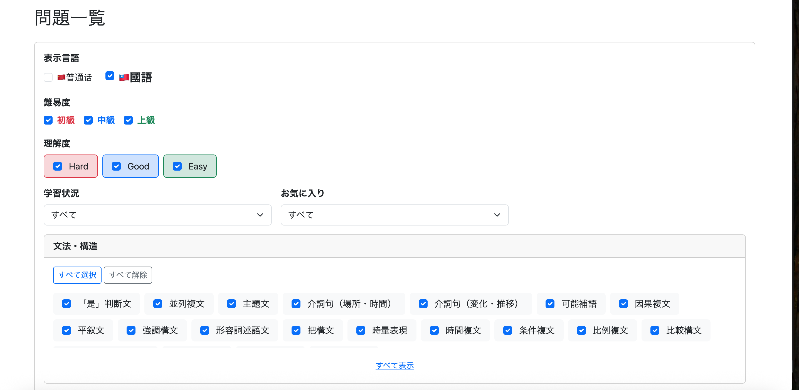
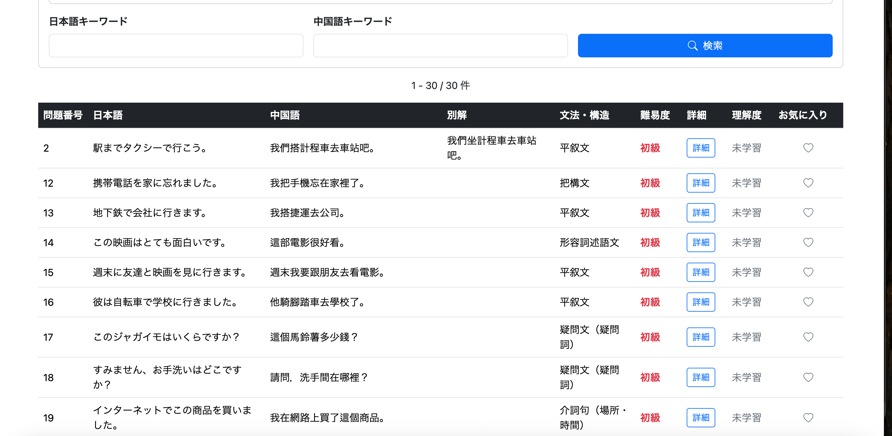

検索条件による絞り込みも可能になった。

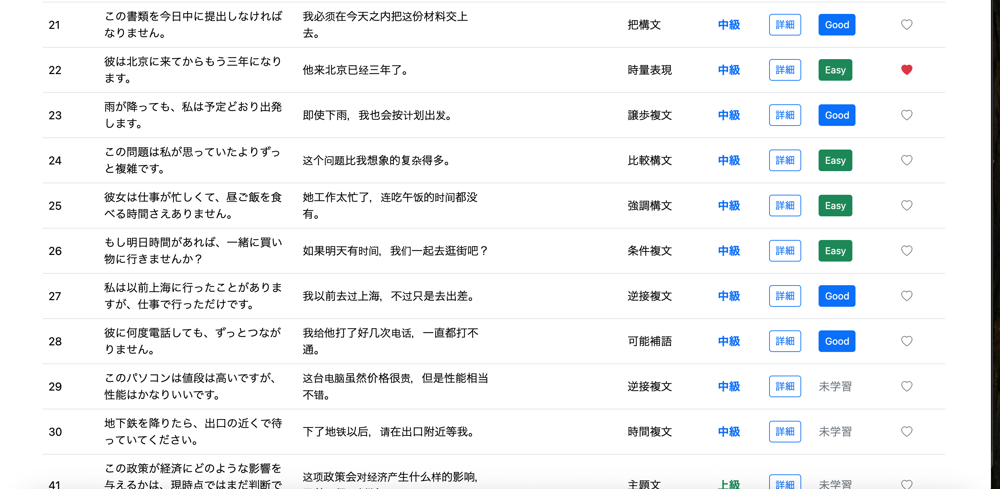

学習済みの問題では理解度、お気に入り登録済みの問題ではハートアイコンが表示される。

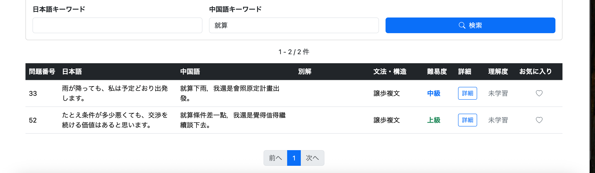

問題詳細はモーダルで確認できる。

拼音：

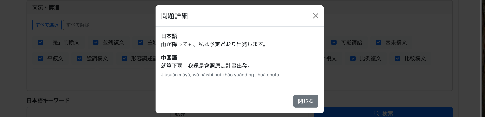

注音：

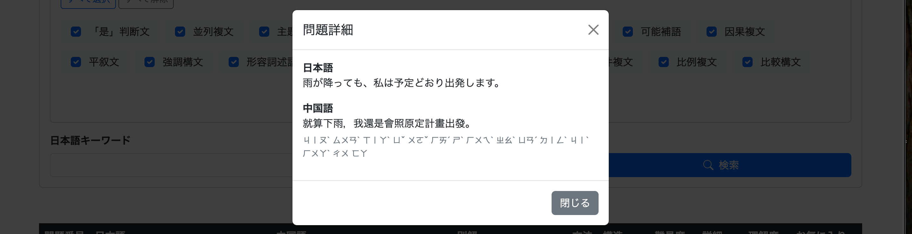

理解度は一覧画面から変更できる。

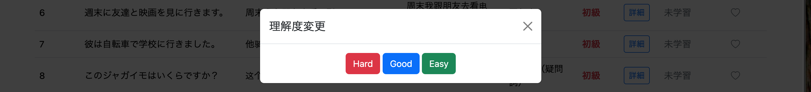

お気に入りについても登録・解除できる。

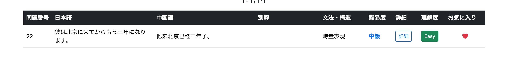
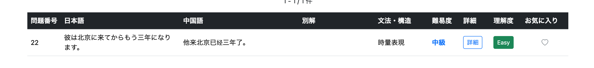

---

# 3. UI修正

基本機能の実装後、実際に操作して見つかったUI上の問題を修正する。

---

# 3-1. 学習状況と理解度の矛盾を解消

`git commit -m "feat: disable evaluation filter based on study status"`

理解度は学習済み問題にのみ存在する。

そのため、学習状況が「すべて」または「未学習」の状態で理解度を指定できるのは、検索条件として分かりにくい。

理解度は**学習状況が「学習済み」の場合だけ選択可能**に変更する。

## /user/question/list.html

理解度欄に警告文を追加する。

```html
<span id="evaluationWarning"
      class="text-danger small"
      th:text="#{user.question.list.evaluation.warning}">
    理解度は「学習済み」を選択した場合のみ指定できます。
</span>
```

## /user/question/list.js

変更前は「未学習かどうか」だけを判定していた。

```javascript
function updateEvaluationState() {

    const unlearned =
        studyCondition.value ===
        "UNLEARNED_ONLY";

    evaluations.forEach(function (cb) {

        if (unlearned) {

            cb.checked = false;
            cb.disabled = true;

        } else {

            cb.disabled = false;

        }

    });
}
```

これを「学習済みかどうか」の判定へ変更する。

```javascript
function updateEvaluationState() {

    const learned =
        studyCondition.value ===
        "LEARNED_ONLY";

    const evaluationWarning =
        document.getElementById(
            "evaluationWarning");

    evaluations.forEach(function (cb) {

        if (learned) {

            cb.disabled = false;

        } else {

            cb.checked = false;
            cb.disabled = true;

        }

    });

    evaluationWarning.style.display =
        learned ? "none" : "";
}
```

これにより、

```text
すべて
→ 理解度無効

学習済み
→ 理解度選択可能

未学習
→ 理解度無効
```

となる。

操作できない場合には警告文も表示する。

## 実行

学習状況が「すべて」または「未学習」の場合は、理解度を選択できなくなった。

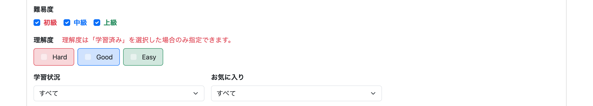

---

# 3-2. 検索条件を検索後も維持する

`git commit -m "fix: preserve question list search filters"`

検索ボタンを押した後にフォームの状態が初期化されると、ユーザーが現在どの条件で検索しているのか分からなくなる。

そのため、ControllerからModelへ戻した検索条件を利用して、検索後もフォームの状態を維持する。

## 表示言語

Enumを `name()` に変換して判定する。

### 普通話

```html
<input class="form-check-input"
       type="checkbox"
       name="languageVariants"
       value="MAINLAND"
       id="mainland"
       th:checked="${selectedLanguageVariants != null
           and selectedLanguageVariants.![name()].contains('MAINLAND')}">
```

### 國語

```html
<input class="form-check-input"
       type="checkbox"
       name="languageVariants"
       value="TAIWAN"
       id="taiwan"
       th:checked="${selectedLanguageVariants != null
           and selectedLanguageVariants.![name()].contains('TAIWAN')}">
```

## 難易度

```html
th:checked="${selectedDifficulties == null
    or selectedDifficulties.![name()].contains('BEGINNER')}"
```

```html
th:checked="${selectedDifficulties == null
    or selectedDifficulties.![name()].contains('INTERMEDIATE')}"
```

```html
th:checked="${selectedDifficulties == null
    or selectedDifficulties.![name()].contains('ADVANCED')}"
```

未指定の場合は全難易度を対象にする仕様なので、`null` の場合はすべてにチェックを付ける。

## 理解度

```html
th:checked="${selectedEvaluations != null
    and selectedEvaluations.![name()].contains('HARD')}"
```

```html
th:checked="${selectedEvaluations != null
    and selectedEvaluations.![name()].contains('GOOD')}"
```

```html
th:checked="${selectedEvaluations != null
    and selectedEvaluations.![name()].contains('EASY')}"
```

## 学習状況・お気に入り

select要素については `th:selected` を利用する。

```html
th:selected="${selectedStudyCondition != null
    and selectedStudyCondition.name() == 'LEARNED_ONLY'}"
```

```html
th:selected="${selectedFavoriteCondition != null
    and selectedFavoriteCondition.name() == 'FAVORITED'}"
```

## 文法・構造

`structureIds` は `List<Long>` なので、そのまま `contains()` で判定する。

```html
th:checked="${selectedStructureIds == null
    or selectedStructureIds.contains(structure.structureId)}"
```

## キーワード

Controllerから戻された値を `th:value` へ設定する。

```html
<input class="form-control"
       type="text"
       name="japaneseKeyword"
       th:value="${japaneseKeyword}">
```

```html
<input class="form-control"
       type="text"
       name="chineseKeyword"
       th:value="${chineseKeyword}">
```

これにより、検索後もすべての検索条件を画面上で確認できるようになった。

---

# 3-3. Bootstrap JavaScriptの二重読み込みを修正

`git commit -m "fix: remove duplicate Bootstrap JavaScript import"`

`/user/question/list` を表示した際、

- 学習対象言語
- ユーザーメニュー
- ハンバーガーメニュー

など、共通ヘッダーにあるBootstrap Dropdownが反応しない問題が発生した。

## 原因

共通レイアウトの `layout/layout.html` ですでにBootstrap JavaScriptを読み込んでいた。

```html
<script th:src="@{/webjars/bootstrap/js/bootstrap.bundle.min.js}"
        defer>
</script>
```

しかし、`user/question/list.html` 側でも同じJavaScriptを読み込んでいた。

```html
<script th:src="@{/webjars/bootstrap/js/bootstrap.bundle.min.js}">
</script>
```

`user/question/list.html` は、

```html
layout:decorate="~{layout/layout}"
```

によって共通レイアウトを使用しているため、Bootstrap JavaScriptが二重に読み込まれていた。

## 修正

`user/question/list.html` からBootstrap JavaScriptの読み込みを削除する。

ページ固有のJavaScriptのみ残す。

```html
<script th:src="@{/js/user/question/list.js}"
        defer>
</script>
```

役割を、

```text
layout/layout.html
├─ Bootstrap CSS
├─ Bootstrap Icons
└─ Bootstrap JavaScript

user/question/list.html
└─ list.js
```

のように分離した。

これにより、ヘッダーのDropdownが正常に動作するようになった。

---

# 3-4. 理解度未選択時のチェック表示を修正

`git commit -m "fix: preserve evaluation filter state when no option is selected"`

学習状況を「学習済み」にした状態で、理解度を1つも選択せず検索すると、Service側では、

```text
HARD
GOOD
EASY
```

のすべてを検索対象として扱う。

しかし画面上では、理解度のチェックがすべて外れた状態になっていた。

これは難易度や文法・構造の、

```text
何も選択しない
↓
すべてを検索対象にする
↓
検索後はすべてにチェックを付ける
```

という表示と統一されていない。

そこでControllerで、学習状況が `LEARNED_ONLY` かつ理解度が未指定の場合は、画面へ戻す値を全理解度にする。

## UserQuestionController.java

`selectedEvaluations` をModelへ設定する前に追加する。

```java
// 学習済みで理解度が未指定の場合は
// 全選択として表示
if (studyCondition == StudyCondition.LEARNED_ONLY
        && (evaluations == null
        || evaluations.isEmpty())) {

    evaluations =
            Arrays.asList(
                    Evaluation.values());
}

model.addAttribute(
        "selectedEvaluations",
        evaluations);
```

これにより、

```text
学習済み
+
理解度を何も選択せず検索

↓

検索条件
HARD / GOOD / EASYすべて

↓

画面表示
Hard / Good / Easyすべてチェック
```

となり、実際の検索条件とUI上の表示が一致するようになった。

## 実行

学習状況を「学習済み」にして理解度を空欄のまま検索する。

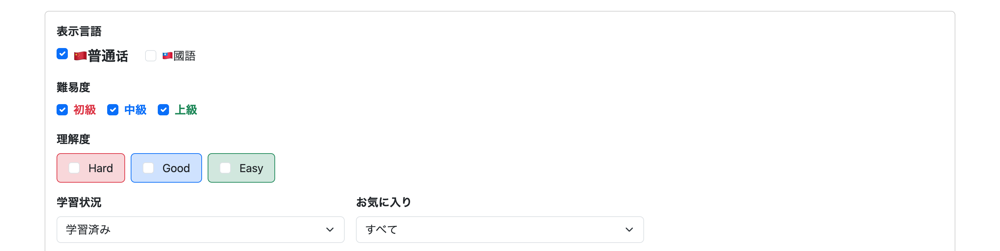

検索後はすべての理解度にチェックが付くようになった。

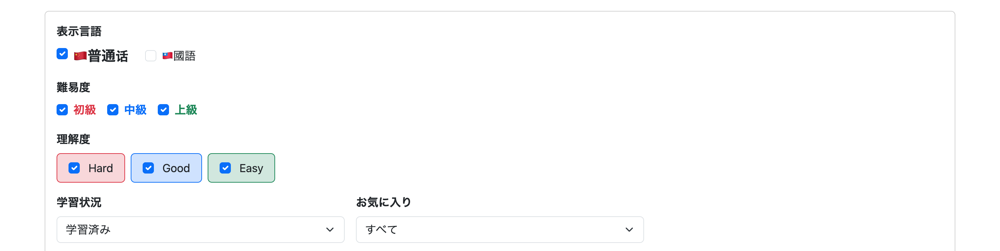

---

