# 013 ユーザーメニューの実装その2

ユーザーメニューその2では、ログインユーザーが自身のアカウント情報を確認・変更するための機能を実装する。

今回実装する機能は以下。

- プロフィール画面
- ユーザーID変更
- パスワード変更
- アカウント削除
- アカウント編集画面のUI改善

---

# 1. プロフィール画面の作成

`git commit -m "feat: add user profile page"`

ユーザーメニューから遷移できる会員情報確認・編集画面を作成する。

プロフィール画面では、

- ユーザーID
- パスワード
- ユーザーID編集ボタン
- パスワード編集ボタン

を表示する。

ただし、パスワードそのものを画面に表示することはせず、マスクして表示する。

## UserProfileController.java

`UserProfileController` を作成する。

```java
@Controller
@RequiredArgsConstructor
public class UserProfileController {
	
	private final UserAccountService userAccountService;
	
	@GetMapping("/user/profile")
	public String getUserProfile(
	        @AuthenticationPrincipal UserDetails loginUser,
	        Model model) {

	    Users user = getLoginUser(loginUser);
	    model.addAttribute("user", user);

	    return "user/profile";
	}
	
	private Users getLoginUser(UserDetails loginUser) {
		return userAccountService.getUserOne(loginUser.getUsername());
	}

}
```

`@AuthenticationPrincipal` から現在ログインしているユーザーの `UserDetails` を取得する。

```java
loginUser.getUsername()
```

によってログイン中のユーザーの `loginId` を取得し、

```java
userAccountService.getUserOne(loginUser.getUsername());
```

で対応する `Users` Entityを取得する。

取得した `Users` を、

```java
model.addAttribute("user", user);
```

によってModelへ登録する。

HTML側では、

```html
${user.loginId}
```

のように利用できる。

## /user/profile.html

```html
<!DOCTYPE html>

<html xmlns:th="http://www.thymeleaf.org"
      xmlns:layout="http://www.ultraq.net.nz/thymeleaf/layout"
      layout:decorate="~{layout/layout}">

<head>

    <meta charset="UTF-8">

    <title th:text="#{user.profile.title}">
        会員情報確認・編集
    </title>

</head>

<body>

<div layout:fragment="content">

    <div class="container py-4">

        <!-- ========================= -->
        <!-- タイトル -->
        <!-- ========================= -->

        <h1 class="h2 text-center mb-4"
            th:text="#{user.profile.heading}">
            会員情報
        </h1>

        <!-- ========================= -->
        <!-- 会員情報 -->
        <!-- ========================= -->

        <div class="d-flex flex-column align-items-center gap-3">

            <div class="table-responsive w-100">

                <table class="table table-striped table-bordered table-hover align-middle">

                    <tbody>

                    <!-- ユーザーID -->

                    <tr>

                        <th class="align-middle text-center"
                            th:text="#{user.profile.loginId}">
                            ユーザーID
                        </th>

                        <td class="align-middle"
                            th:text="${user.loginId}">
                        </td>

                        <td class="align-middle text-center"
                            style="width:120px;">

                            <a th:href="@{/user/edit/loginId}"
                               class="btn btn-primary"
                               th:text="#{user.profile.edit}">
                                編集
                            </a>

                        </td>

                    </tr>

                    <!-- パスワード -->

                    <tr>

                        <th class="align-middle text-center"
                            th:text="#{user.profile.password}">
                            パスワード
                        </th>

                        <td class="align-middle">
                            ************
                        </td>

                        <td class="align-middle text-center"
                            style="width:120px;">

                            <a th:href="@{/user/edit/password}"
                               class="btn btn-primary"
                               th:text="#{user.profile.edit}">
                                編集
                            </a>

                        </td>

                    </tr>

                    </tbody>

                </table>

            </div>

            <!-- ========================= -->
            <!-- ユーザーメニューへ戻る -->
            <!-- ========================= -->

            <div class="text-center">

                <a th:href="@{/user/menu}"
                   class="btn btn-secondary"
                   th:text="#{user.profile.back}">
                    ユーザーメニューに戻る
                </a>

            </div>

        </div>

    </div>

</div>

</body>

</html>
```

パスワードについては、DBに保存されているハッシュ値も含めて実際の値を表示する必要はない。

そのため、

```html
<td class="align-middle">
    ************
</td>
```

として固定表示する。

## messages.properties

```properties
# =========================
# ユーザープロフィール
# =========================

user.profile.title=会員情報確認・編集
user.profile.heading=会員情報
user.profile.loginId=ユーザーID
user.profile.password=パスワード
user.profile.edit=編集
user.profile.back=ユーザーメニューに戻る
```

他言語は省略。

## 実行

ログイン状態で、

```text
http://localhost:8080/user/profile
```

にアクセスすると、ユーザープロフィールが表示された。

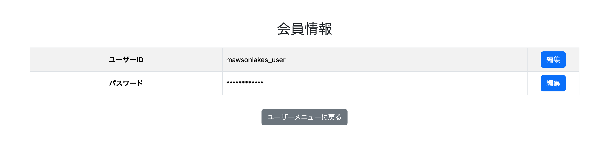

---

# 2. ユーザーID変更機能の実装

`git commit -m "feat: implement login ID update"`

ユーザーが現在使用しているユーザーIDを変更できるようにする。

URLは、

```text
/user/edit/loginId
```

とする。

---

## 2-1. EditLoginIdForm.java

ユーザーID変更専用のフォームクラスを作成する。

```java
@Data
public class EditLoginIdForm {

    @NotBlank(message = "{signup.loginId.notBlank}")
    @Length(
        min = 8,
        max = 20,
        message = "{signup.loginId.length}"
    )
    @Pattern(
        regexp = "^[a-zA-Z0-9_]+$",
        message = "{signup.loginId.pattern}"
    )
    private String loginId;

}
```

ユーザーIDの入力ルールは新規登録時と同じなので、新規登録で使用しているメッセージを流用する。

---

## 2-2. UserAccountService.java

ユーザーID変更処理を追加する。

```java
@Transactional
public void updateLoginId(
        String currentLoginId,
        String newLoginId,
        Locale locale) {

    // 変更前と変更後が同じか確認
    if (newLoginId.equals(currentLoginId)) {

        throw new IllegalArgumentException(
                messageSource.getMessage(
                        "user.edit.loginId.error.same",
                        null,
                        locale
                )
        );
    }

    // 新しいユーザーIDが既に使われているか確認
    boolean isExists =
            userRepository.existsByLoginId(newLoginId);

    if (isExists) {

        throw new DuplicateKeyException(
                messageSource.getMessage(
                        "user.edit.loginId.error.duplicate",
                        null,
                        locale
                )
        );
    }

    // 現在のユーザーを取得
    Users user = getUserOne(currentLoginId);

    if (user == null) {

        throw new IllegalArgumentException(
                messageSource.getMessage(
                        "user.edit.loginId.error.notFound",
                        null,
                        locale
                )
        );
    }

    // ユーザーIDを変更
    user.setLoginId(newLoginId);

    // 更新
    userRepository.save(user);

    log.info(
            "ユーザーID変更 currentUserId={}, newUserId={}",
            currentLoginId,
            newLoginId
    );
}
```

ユーザーIDを更新する前に3つのチェックを行う。

### ① 変更前と変更後のユーザーIDが同じではないか

```java
if (newLoginId.equals(currentLoginId))
```

同じ場合は変更する意味がないためエラーとする。

### ② 新しいユーザーIDが既に使われていないか

```java
boolean isExists =
        userRepository.existsByLoginId(newLoginId);
```

既に別のアカウントが使用している場合は、

```java
DuplicateKeyException
```

を発生させる。

### ③ 現在のユーザーが存在するか

```java
Users user = getUserOne(currentLoginId);
```

でユーザーを取得する。

`currentLoginId` はログイン中のユーザーから取得しているため、通常の利用ではほとんど `null` にはならない。

ただし、

- ログイン後に別処理でユーザーが削除された
- DBの状態に不整合が発生した

などの想定外の状態に備えた防御的なチェックとして残す。

また、①と②の順番は重要である。

重複チェックを先にすると、現在使用しているユーザーIDも当然DBに存在するため、自分自身のIDを入力しただけでも、

```text
このユーザーIDは他のアカウントですでに使用されています
```

という意味の異なるエラーになってしまう。

そのため、

```text
現在と同じIDか確認
        ↓
他ユーザーと重複していないか確認
```

の順番とする。

---

## 2-3. messageSource.getMessage()

Serviceでは、

```java
messageSource.getMessage(
        "user.edit.loginId.error.notFound",
        null,
        locale
)
```

を使用している。

`messageSource.getMessage()` は、`messages.properties` に定義したメッセージをJava側から取得するためのメソッドである。

例えば、

```properties
user.edit.loginId.error.notFound=ユーザーが存在しません
```

に対して、

```java
messageSource.getMessage(
        "user.edit.loginId.error.notFound",
        null,
        locale
)
```

とすると、

```text
ユーザーが存在しません
```

を取得できる。

各引数は、

```java
messageSource.getMessage(
    "メッセージのキー",
    埋め込み値,
    使用する言語
)
```

となる。

`locale` に応じて、

```text
messages.properties
messages_zh_CN.properties
messages_zh_TW.properties
```

などから適切なメッセージを取得できる。

---

## 2-4. UserProfileController.java

GET処理を追加する。

```java
@GetMapping("/user/edit/loginId")
public String getEditLoginId(
        @AuthenticationPrincipal UserDetails loginUser,
        Model model,
        EditLoginIdForm form) {

    model.addAttribute("editLoginIdForm", form);
    model.addAttribute(
            "currentLoginId",
            loginUser.getUsername()
    );

    return "user/edit/loginId";
}
```

`editLoginIdForm` は新しいユーザーIDを入力するためのフォームとして使用する。

一方、

```java
currentLoginId
```

は変更前のユーザーIDを画面上に表示するために使用する。

POST処理を追加する。

```java
@PostMapping("/user/edit/loginId")
public String postEditLoginId(
        @AuthenticationPrincipal UserDetails loginUser,
        HttpSession session,
        Model model,
        @Validated EditLoginIdForm form,
        BindingResult bindingResult,
        Locale locale,
        RedirectAttributes redirectAttributes) {

    if (bindingResult.hasErrors()) {
        return getEditLoginId(loginUser, model, form);
    }

    try {

        userAccountService.updateLoginId(
                loginUser.getUsername(),
                form.getLoginId(),
                locale
        );

    } catch (DuplicateKeyException e) {

        bindingResult.rejectValue(
                "loginId",
                "duplicate",
                e.getMessage()
        );

        model.addAttribute("editLoginIdForm", form);

        return getEditLoginId(loginUser, model, form);

    } catch (IllegalArgumentException e) {

        bindingResult.rejectValue(
                "loginId",
                "same",
                e.getMessage()
        );

        model.addAttribute("editLoginIdForm", form);

        return getEditLoginId(loginUser, model, form);
    }

    // ログアウト状態にする
    SecurityContextHolder.clearContext();

    // SessionからSpring Securityの認証情報だけ削除
    session.removeAttribute(
            HttpSessionSecurityContextRepository
                    .SPRING_SECURITY_CONTEXT_KEY
    );

    // 変更完了メッセージ
    redirectAttributes.addFlashAttribute(
            "messageKey",
            "user.loginId.changed"
    );

    return "redirect:/login";
}
```

まず、

```java
if (bindingResult.hasErrors())
```

によってBean Validationによる入力エラーを確認する。

Serviceで発生した、

```java
DuplicateKeyException
```

については、

```java
bindingResult.rejectValue(
        "loginId",
        "duplicate",
        e.getMessage()
);
```

として `loginId` のフィールドエラーに変換する。

現在と同じユーザーIDなどの `IllegalArgumentException` についても同様に、

```java
bindingResult.rejectValue(
        "loginId",
        "same",
        e.getMessage()
);
```

としてフォームへ戻す。

---

## 2-5. ユーザーID変更後にログアウトする

ユーザーID変更後は、

```java
SecurityContextHolder.clearContext();
```

を実行する。

これはSpring Securityが現在保持している認証情報を削除する処理である。

ユーザーIDを変更すると、

```text
変更前：user12345
        ↓
DB更新
        ↓
変更後：newuser123
```

となる。

しかし、現在のSpring Securityの認証情報には変更前の `user12345` が残っている可能性がある。

そのため、ユーザーID変更後はいったんログアウト状態にして、新しいユーザーIDでログインし直してもらう。

---

## 2-6. HttpSessionSecurityContextRepository.SPRING_SECURITY_CONTEXT_KEY

```java
HttpSessionSecurityContextRepository.SPRING_SECURITY_CONTEXT_KEY
```

は、Spring SecurityがHTTP Sessionに認証情報を保存するときに使用する属性名を表す定数である。

実際の値は、

```text
SPRING_SECURITY_CONTEXT
```

である。

ログインするとSessionには、

```text
SPRING_SECURITY_CONTEXT
    └─ SecurityContext
         └─ Authentication
              ├─ Principal
              │    └─ ユーザー情報
              ├─ Authenticated
              │    └─ 認証済みかどうか
              └─ Authorities
                   └─ ROLE_USER などの権限
```

という形で認証情報が保存される。

ここでいう `KEY` は、Sessionから目的のデータを特定するための名前を意味する。

Sessionでは、

```text
属性名（キー）                 値
-----------------------------------------------
SPRING_SECURITY_CONTEXT  →    SecurityContext
practiceCurrentPage      →    3
languageVariant          →    TAIWAN
```

のように、キーと値の組み合わせでデータを管理している。

したがって、

```java
session.removeAttribute(
    HttpSessionSecurityContextRepository.SPRING_SECURITY_CONTEXT_KEY
);
```

は実質的に、

```java
session.removeAttribute("SPRING_SECURITY_CONTEXT");
```

と同じ意味になる。

`removeAttribute()` は指定されたキーのデータだけを削除するため、Sessionそのものを残したままSpring Securityの認証情報だけを削除できる。

---

## 2-7. Session全体を破棄しない

当初は、

```java
SecurityContextHolder.clearContext();
session.invalidate();
```

として、ユーザーID変更後にSessionをすべて破棄する方法を考えていた。

しかし、このアプリケーションではLocaleを、

```java
SessionLocaleResolver
```

で管理している。

つまり、現在選択している表示言語もSessionに保存されている。

そのため、

```java
session.invalidate();
```

を実行するとLocaleも失われる。

ユーザーID変更後のログイン画面では、

```text
ユーザーIDを変更しました。新しいユーザーIDでログインしてください。
```

というメッセージを、現在選択している言語に応じて表示したい。

LocaleをCookie管理へ変更する方法もあるが、今回の実装途中でLocale管理の仕組みそのものを変更すると修正範囲が広がる。

そこで今回は、

```java
SecurityContextHolder.clearContext();

session.removeAttribute(
    HttpSessionSecurityContextRepository.SPRING_SECURITY_CONTEXT_KEY
);
```

として、Spring Securityの認証情報だけを削除する方針とした。

これにより、

```text
Spring Securityの認証情報 → 削除
Locale                    → 維持
その他のSession情報       → 維持
```

とできる。

---

## 2-8. RedirectAttributes.addFlashAttribute()

変更成功後は、

```java
redirectAttributes.addFlashAttribute(
        "messageKey",
        "user.loginId.changed"
);
```

としている。

`addFlashAttribute()` は、リダイレクト先へ一時的に値を渡すためのメソッドである。

今回は、

```text
キー → messageKey
値   → user.loginId.changed
```

として保存している。

`user.loginId.changed` は実際の文章ではなく、`messages.properties` のメッセージキーである。

```properties
user.loginId.changed=ユーザーIDを変更しました。新しいユーザーIDでログインしてください。
```

Flash Attributeはリダイレクト先で一時的に使用する値なので、URLには残らない。

---

## 2-9. /user/edit/loginId.html

```html
<!DOCTYPE html>

<html xmlns:th="http://www.thymeleaf.org"
      xmlns:layout="http://www.ultraq.net.nz/thymeleaf/layout"
      layout:decorate="~{layout/layout}">

<head>

    <meta charset="UTF-8">

    <title th:text="#{user.edit.loginId.title}">
        会員情報編集
    </title>

</head>

<body>

<div layout:fragment="content">

    <div class="header">

        <h1 class="h2"
            th:text="#{user.edit.loginId.heading}">
            ユーザーID変更
        </h1>

        <div class="mx-auto mt-4"
             style="max-width: 500px;">

            <form th:action="@{/user/edit/loginId}"
                  th:object="${editLoginIdForm}"
                  method="post">

                <!-- 現在のユーザーID -->

                <div class="mb-4">

                    <label class="form-label fw-bold"
                           th:text="#{user.edit.loginId.current}">
                        現在のユーザーID
                    </label>

                    <div class="form-control bg-light"
                         th:text="${currentLoginId}">
                        current_user
                    </div>

                </div>

                <!-- 新しいユーザーID -->

                <div class="mb-4">

                    <label for="loginId"
                           class="form-label fw-bold"
                           th:text="#{user.edit.loginId.new}">
                        新しいユーザーID
                    </label>

                    <input type="text"
                           id="loginId"
                           th:field="*{loginId}"
                           th:placeholder="#{signup.loginId.placeholder}"
                           th:errorclass="is-invalid"
                           class="form-control">

                    <div class="invalid-feedback"
                         th:errors="*{loginId}">
                    </div>

                </div>

                <!-- 更新 -->

                <div class="text-center">

                    <button type="submit"
                            class="btn btn-primary"
                            th:text="#{user.edit.loginId.update}">
                        更新
                    </button>

                    <a th:href="@{/user/profile}"
                       class="btn btn-secondary ms-2"
                       th:text="#{user.edit.loginId.back}">
                        戻る
                    </a>

                </div>

            </form>

        </div>

    </div>

</div>

</body>

</html>
```

変更前ユーザーIDと、新しく入力するユーザーIDを明確に分けて表示する。

---

## 2-10. login.html

Controllerから渡された変更完了メッセージを表示できるようにする。

ログインエラー表示の上に以下を追加する。

```html
<!-- ユーザーID・パスワード変更完了メッセージ -->

<div class="alert alert-success"
     th:if="${messageKey != null}"
     th:text="#{__${messageKey}__}">
</div>
```

`messageKey` には、

```text
user.loginId.changed
```

などのメッセージキーが入っている。

```html
#{__${messageKey}__}
```

とすることで、`messageKey` の値を一度展開してから、その値を `messages.properties` のキーとして解決できる。

---

## 2-11. messages.properties

```properties
# =========================
# ユーザーID変更
# =========================

user.edit.loginId.title=ユーザーID変更
user.edit.loginId.heading=ユーザーID変更
user.edit.loginId.current=現在のユーザーID
user.edit.loginId.new=新しいユーザーID
user.edit.loginId.update=更新
user.edit.loginId.back=戻る

user.edit.loginId.error.same=新しいユーザーIDは変更前とは違うものにしてください
user.edit.loginId.error.duplicate=このユーザーIDは他のアカウントですでに使用されています
user.edit.loginId.error.notFound=ユーザーが存在しません

user.loginId.changed=ユーザーIDを変更しました。新しいユーザーIDでログインしてください。
```

## 実行

```text
http://localhost:8080/user/edit/loginId
```

にアクセスするとユーザーID変更フォームが表示された。

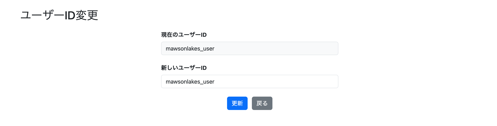

正常な新しいユーザーIDを入力すると変更に成功し、ログイン画面へ戻る。

変更完了メッセージも表示された。

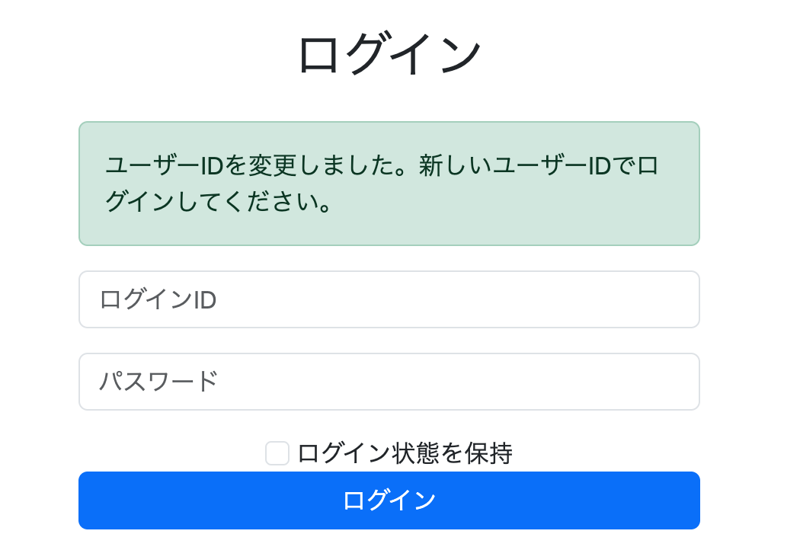

Flash Attributeなので、再読み込みするとメッセージは消える。

変更前と同じユーザーIDを入力する。

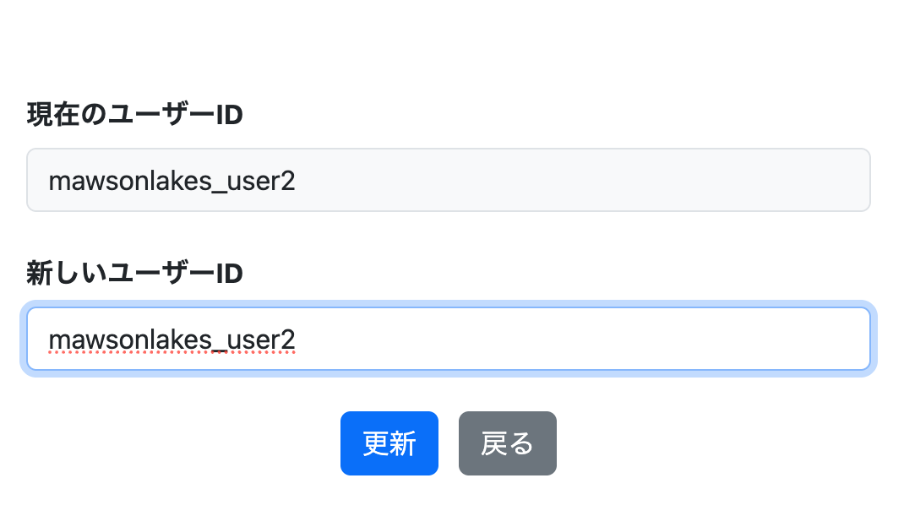

エラーメッセージとともにユーザーID変更画面へ戻された。

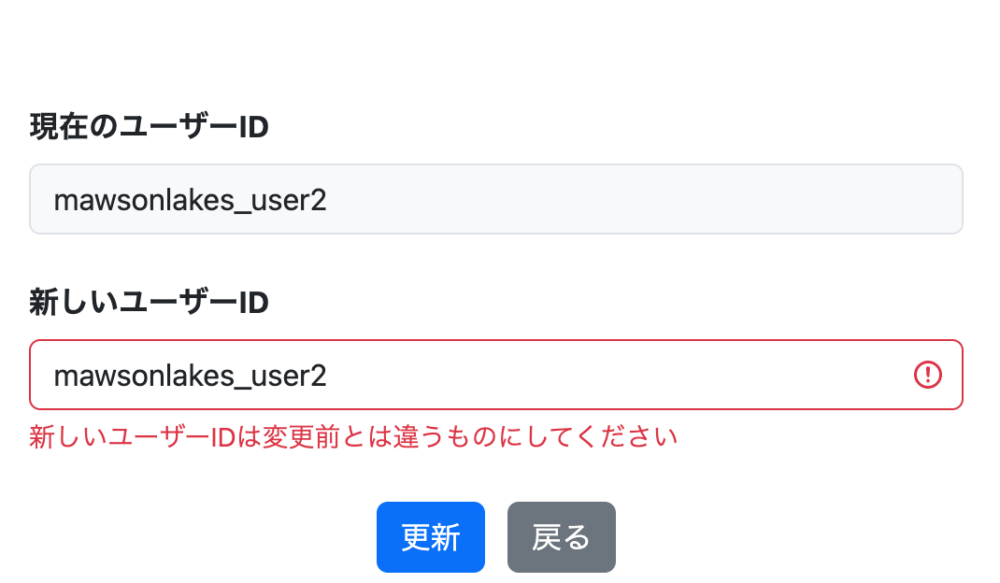

別アカウントが使用しているユーザーIDを入力する。

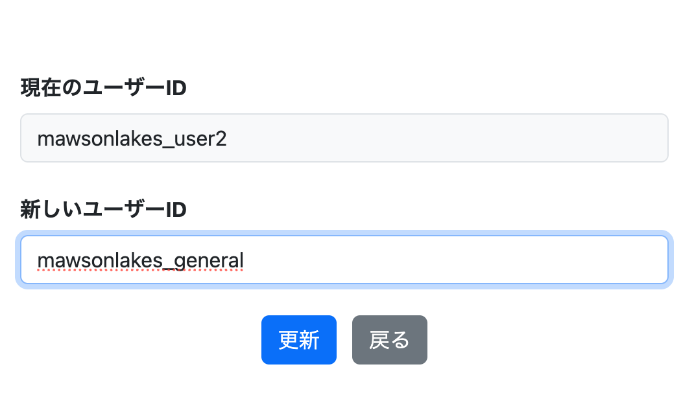

こちらもエラーメッセージとともに変更画面へ戻された。

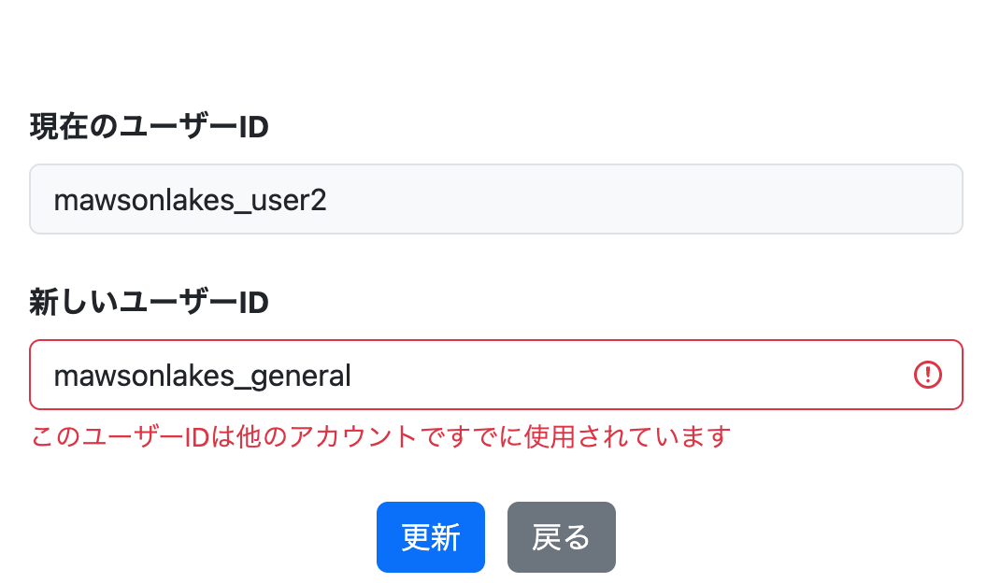

ユーザーID変更機能が正常に動作していることを確認できた。

---

# 3. パスワード変更機能の実装

パスワード変更画面を作成し、

- 現在のパスワード
- 新しいパスワード
- 新しいパスワード（確認）

を入力してパスワードを変更できるようにする。

---

## 3-1. EditPasswordForm.java

```java
@PasswordMatch(
    passwordFieldName = "newPassword",
    passwordConfirmFieldName = "newPasswordConfirm"
)
@Data
public class EditPasswordForm {

    @NotBlank
    private String currentPassword;

    @NotBlank(message = "{signup.password.notBlank}")
    @Length(
        min = 8,
        max = 20,
        message = "{signup.password.length}"
    )
    @Pattern(
        regexp = "^[\\x21-\\x7E]+$",
        message = "{signup.password.pattern}"
    )
    private String newPassword;

    @NotBlank
    private String newPasswordConfirm;

}
```

新しいパスワードについては、新規登録時と同じバリデーションを使用する。

また、

```java
@PasswordMatch(
    passwordFieldName = "newPassword",
    passwordConfirmFieldName = "newPasswordConfirm"
)
```

を付ける。

`@PasswordMatch` とそのValidatorは新規登録機能ですでに実装しているため、そのまま再利用する。

Controller側に `@PasswordMatch` を書く必要はない。

Controllerでは、

```java
@Validated EditPasswordForm form
```

によってフォームのバリデーションを実行するため、クラスに付いている `@PasswordMatch` もその際に検証される。

---

## 3-2. UserAccountService.java

```java
@Transactional
public void updatePassword(
        String userId,
        String currentPassword,
        String newPassword,
        Locale locale) {

    // 現在のユーザーを取得
    Users user = getUserOne(userId);

    if (user == null) {

        throw new IllegalArgumentException(
                messageSource.getMessage(
                        "user.edit.password.error.notFound",
                        null,
                        locale
                )
        );
    }

    // 現在のパスワードが正しいか確認
    if (!passwordEncoder.matches(
            currentPassword,
            user.getPassword())) {

        throw new CurrentPasswordMismatchException(
                messageSource.getMessage(
                        "user.edit.password.error.currentPassword",
                        null,
                        locale
                )
        );
    }

    // 新しいパスワードが現在のパスワードと同じか確認
    if (passwordEncoder.matches(
            newPassword,
            user.getPassword())) {

        throw new PasswordSameException(
                messageSource.getMessage(
                        "user.edit.password.error.same",
                        null,
                        locale
                )
        );
    }

    // パスワードをハッシュ化して更新
    user.setPassword(
            passwordEncoder.encode(newPassword)
    );

    // 更新
    userRepository.save(user);

    log.info(
            "パスワード変更 loginId={}",
            userId
    );
}
```

パスワードを変更する前に3つのチェックを行う。

### ① ユーザーが存在するか

```java
Users user = getUserOne(userId);
```

ログイン中のユーザーの `loginId` から取得しているため通常はほとんど発生しないが、想定外の状態に備えたチェックである。

### ② 現在のパスワードが正しいか

DBに保存されているパスワードはハッシュ化されているため、

```java
passwordEncoder.matches(
        currentPassword,
        user.getPassword()
)
```

で照合する。

```text
一致   → 処理続行
不一致 → CurrentPasswordMismatchException
```

となる。

### ③ 新しいパスワードが現在のパスワードと同じではないか

こちらも、

```java
passwordEncoder.matches(
        newPassword,
        user.getPassword()
)
```

で確認する。

一致した場合は、

```java
PasswordSameException
```

を発生させる。

---

## 3-3. 独自例外クラス

現在のパスワードが違う場合と、新しいパスワードが現在と同じ場合を区別するため、独自例外クラスを作成する。

### CurrentPasswordMismatchException.java

```java
public class CurrentPasswordMismatchException
        extends RuntimeException {

    public CurrentPasswordMismatchException(
            String message) {

        super(message);
    }

}
```

### PasswordSameException.java

```java
public class PasswordSameException
        extends RuntimeException {

    public PasswordSameException(
            String message) {

        super(message);
    }

}
```

独自例外を作った理由は、Serviceで発生したエラーの原因をController側で区別するためである。

```text
CurrentPasswordMismatchException
→ 現在のパスワードが間違っている

PasswordSameException
→ 新しいパスワードが現在のパスワードと同じ
```

例外クラスを作らず、すべて `IllegalArgumentException` とすると、

```text
現在のパスワードが間違っている
新しいパスワードが現在と同じ
ユーザーが存在しない
```

という異なるエラーがすべて同じ種類の例外になり、Controller側で原因を判別しにくくなる。

独自例外にすることで、

```java
catch (CurrentPasswordMismatchException e) {
    // 現在のパスワード欄
}

catch (PasswordSameException e) {
    // 新しいパスワード欄
}
```

のように処理を分けられる。

### RuntimeExceptionを継承する理由

`RuntimeException` を継承した例外は非検査例外となるため、メソッドに `throws` を記述する必要がない。

Service側では、

```java
throw new PasswordSameException(...);
```

として必要な場所で例外を発生させ、Controller側で必要な例外をcatchできる。

今回の例外はファイル読み込み失敗などの外部要因ではなく、パスワード変更処理における業務ルール違反を表すため、`RuntimeException` を継承した独自例外として扱う。

---

## 3-4. UserProfileController.java

GET処理を追加する。

```java
@GetMapping("/user/edit/password")
public String getEditPassword(
        Model model,
        EditPasswordForm form) {

    model.addAttribute(
            "editPasswordForm",
            form
    );

    return "user/edit/password";
}
```

POST処理を追加する。

```java
@PostMapping("/user/edit/password")
public String postEditPassword(
        @AuthenticationPrincipal UserDetails loginUser,
        HttpSession session,
        Model model,
        @Validated EditPasswordForm form,
        BindingResult bindingResult,
        Locale locale,
        RedirectAttributes redirectAttributes) {

    // 通常のバリデーションエラー確認
    if (bindingResult.hasErrors()) {
        return getEditPassword(model, form);
    }

    try {

        log.debug(
                "パスワード変更開始 loginId={}",
                loginUser.getUsername()
        );

        userAccountService.updatePassword(
                loginUser.getUsername(),
                form.getCurrentPassword(),
                form.getNewPassword(),
                locale
        );

    } catch (CurrentPasswordMismatchException e) {

        bindingResult.rejectValue(
                "currentPassword",
                "invalid",
                e.getMessage()
        );

        model.addAttribute(
                "editPasswordForm",
                form
        );

        return getEditPassword(model, form);

    } catch (IllegalArgumentException e) {

        bindingResult.reject(
                "userNotFound",
                e.getMessage()
        );

        model.addAttribute(
                "editPasswordForm",
                form
        );

        return getEditPassword(model, form);

    } catch (PasswordSameException e) {

        bindingResult.rejectValue(
                "newPassword",
                "same",
                e.getMessage()
        );

        model.addAttribute(
                "editPasswordForm",
                form
        );

        return getEditPassword(model, form);
    }

    // ログアウト状態にする
    SecurityContextHolder.clearContext();

    // SessionからSpring Securityの認証情報だけ削除
    session.removeAttribute(
            HttpSessionSecurityContextRepository
                    .SPRING_SECURITY_CONTEXT_KEY
    );

    // 変更完了メッセージ
    redirectAttributes.addFlashAttribute(
            "messageKey",
            "user.password.changed"
    );

    return "redirect:/login";
}
```

処理の流れは、

```text
POST
 ↓
Bean Validation
 ↓
Service
 ↓
業務ルールのチェック
 ↓
エラーならBindingResultへ登録
 ↓
成功なら認証情報を削除
 ↓
Flash Attributeを設定
 ↓
/loginへredirect
```

となる。

---

## 3-5. フィールドエラーとグローバルエラー

現在のパスワードが間違っている場合は、

```java
bindingResult.rejectValue(
        "currentPassword",
        "invalid",
        e.getMessage()
);
```

としている。

`rejectValue()` は特定のフィールドに対するエラーを登録する。

一方、ユーザーそのものが存在しない場合は、

```java
bindingResult.reject(
        "userNotFound",
        e.getMessage()
);
```

としている。

`reject()` は特定のフィールドを指定しないため、Springではフォーム全体のエラー、つまりグローバルエラーとして扱われる。

```text
BindingResult
│
├─ rejectValue(...)
│    └─ 特定フィールドのエラー
│
└─ reject(...)
     └─ フォーム全体のエラー
          ↓
        グローバルエラー
```

Java側で `GlobalError` という独自クラスを作成しているわけではない。

---

## 3-6. /user/edit/password.html

```html
<!DOCTYPE html>

<html xmlns:th="http://www.thymeleaf.org"
      xmlns:layout="http://www.ultraq.net.nz/thymeleaf/layout"
      layout:decorate="~{layout/layout}">

<head>

    <meta charset="UTF-8">

    <title th:text="#{user.edit.password.title}">
        パスワード変更
    </title>

</head>

<body>

<div layout:fragment="content">

    <div class="header">

        <h1 class="h2"
            th:text="#{user.edit.password.heading}">
            パスワード変更
        </h1>

        <div class="mx-auto mt-4"
             style="max-width: 500px;">

            <form th:action="@{/user/edit/password}"
                  th:object="${editPasswordForm}"
                  method="post">

                <!-- フォーム全体のエラー -->

                <div class="alert alert-danger"
                     th:if="${#fields.hasGlobalErrors()}">

                    <div th:each="error : ${#fields.globalErrors()}"
                         th:text="${error}">
                    </div>

                </div>

                <!-- 現在のパスワード -->

                <div class="mb-4">

                    <label for="currentPassword"
                           class="form-label fw-bold"
                           th:text="#{user.edit.password.current}">
                        現在のパスワード
                    </label>

                    <input type="password"
                           id="currentPassword"
                           th:field="*{currentPassword}"
                           th:errorclass="is-invalid"
                           class="form-control">

                    <div class="invalid-feedback"
                         th:errors="*{currentPassword}">
                    </div>

                </div>

                <!-- 新しいパスワード -->

                <div class="mb-4">

                    <label for="newPassword"
                           class="form-label fw-bold"
                           th:text="#{user.edit.password.new}">
                        新しいパスワード
                    </label>

                    <input type="password"
                           id="newPassword"
                           th:field="*{newPassword}"
                           th:placeholder="#{signup.password.placeholder}"
                           th:errorclass="is-invalid"
                           class="form-control">

                    <div class="invalid-feedback"
                         th:errors="*{newPassword}">
                    </div>

                </div>

                <!-- 新しいパスワード（確認） -->

                <div class="mb-4">

                    <label for="newPasswordConfirm"
                           class="form-label fw-bold"
                           th:text="#{user.edit.password.confirm}">
                        新しいパスワード（確認）
                    </label>

                    <input type="password"
                           id="newPasswordConfirm"
                           th:field="*{newPasswordConfirm}"
                           th:placeholder="#{signup.passwordConfirm.placeholder}"
                           th:errorclass="is-invalid"
                           class="form-control">

                    <div class="invalid-feedback"
                         th:errors="*{newPasswordConfirm}">
                    </div>

                </div>

                <!-- 更新 -->

                <div class="text-center">

                    <button type="submit"
                            class="btn btn-primary"
                            th:text="#{user.edit.password.update}">
                        更新
                    </button>

                    <a th:href="@{/user/profile}"
                       class="btn btn-secondary ms-2"
                       th:text="#{user.edit.password.back}">
                        戻る
                    </a>

                </div>

            </form>

        </div>

    </div>

</div>

</body>

</html>
```

グローバルエラーについては、

```html
<div class="alert alert-danger"
     th:if="${#fields.hasGlobalErrors()}">

    <div th:each="error : ${#fields.globalErrors()}"
         th:text="${error}">
    </div>

</div>
```

で表示する。

`#fields.hasGlobalErrors()` でグローバルエラーが存在するか確認し、

```html
#fields.globalErrors()
```

で登録されたエラーを取得する。

---

## 3-7. messages.properties

```properties
# =========================
# パスワード変更
# =========================

user.edit.password.title=パスワード変更
user.edit.password.heading=パスワード変更
user.edit.password.current=現在のパスワード
user.edit.password.new=新しいパスワード
user.edit.password.confirm=新しいパスワード（確認）
user.edit.password.update=更新
user.edit.password.back=戻る

user.edit.password.error.notFound=ユーザーが存在しません
user.edit.password.error.currentPassword=現在のパスワードが正しくありません
user.edit.password.error.same=新しいパスワードは現在のパスワードとは異なるものにしてください

user.password.changed=パスワードを変更しました。新しいパスワードでログインしてください。
```

## 実行

```text
http://localhost:8080/user/edit/password
```

にアクセスするとパスワード変更フォームが表示された。

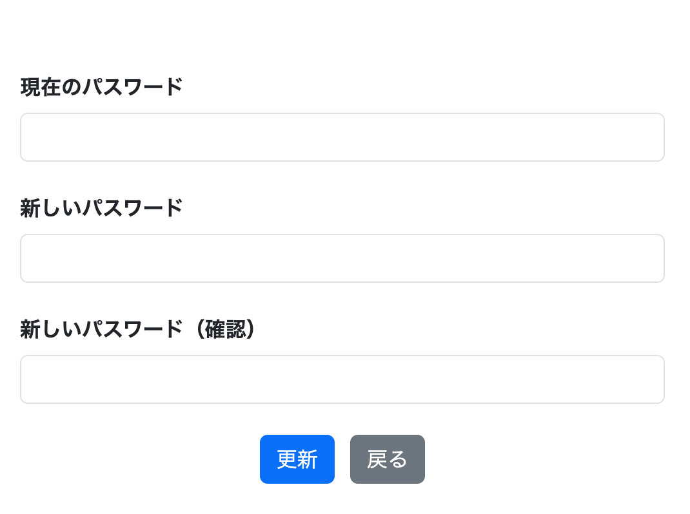

現在のパスワード、新しいパスワード、確認用パスワードを正しく入力すると変更に成功し、ログイン画面へ戻った。

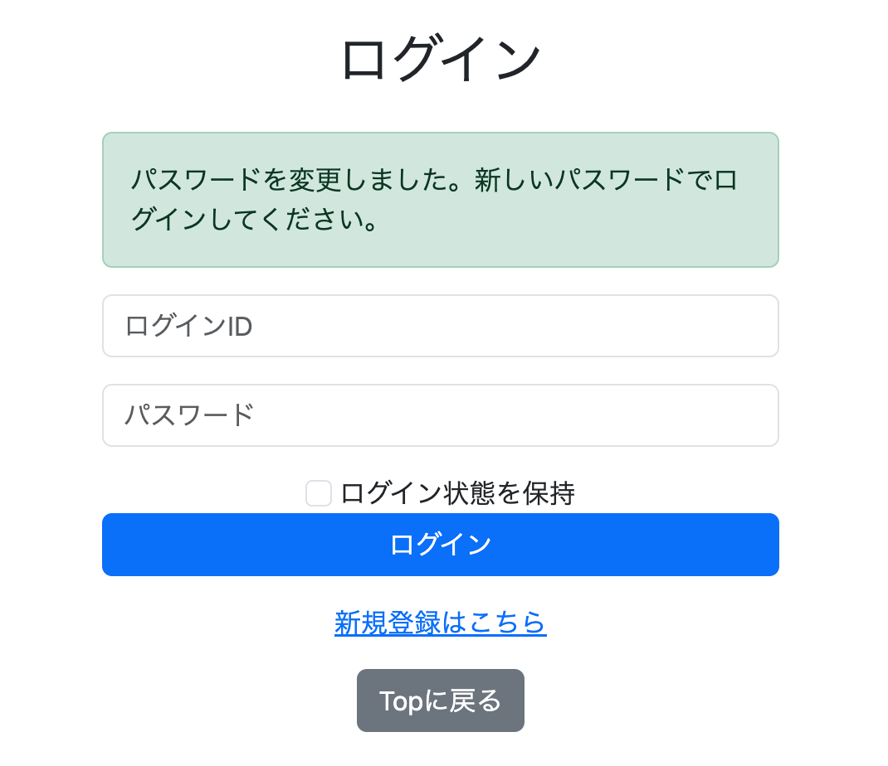

現在のパスワードを間違えるとフィールドエラーとともに変更画面へ戻された。

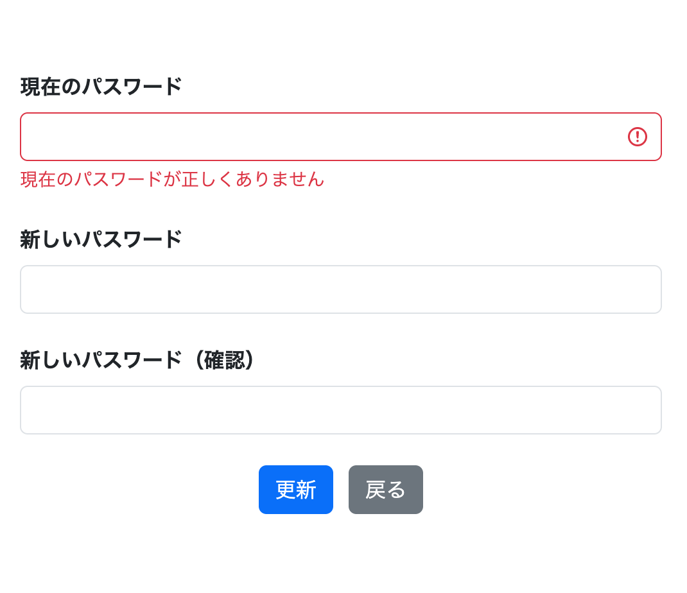

現在のパスワードと新しいパスワードを同じにするとエラーとなった。

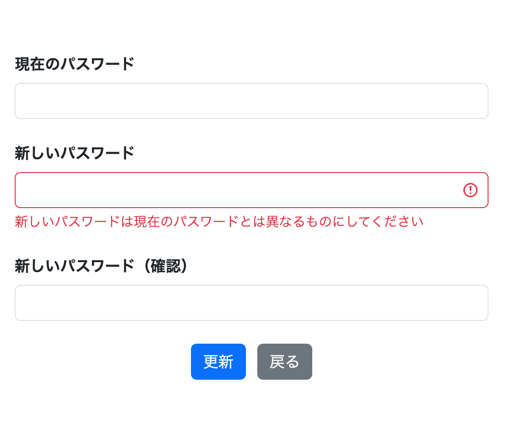

新しいパスワードと確認用パスワードが異なる場合は、`@PasswordMatch` によるグローバルエラーが表示された。

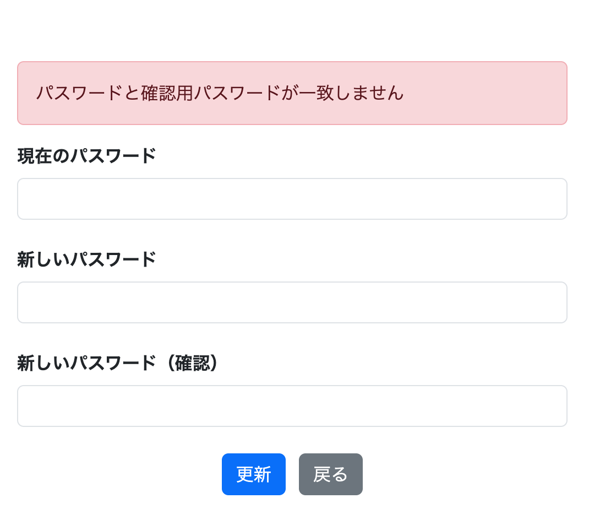

パスワード変更機能が正常に動作していることを確認できた。

---

# 4. アカウント削除機能

`git commit -m "feat: implement account deletion"`

ログインユーザーが自身のアカウントを削除できる機能を実装する。

単純に `users` だけを削除するのではなく、そのユーザーに紐づく、

```text
favorite
study_history
```

も削除する。

---

## 4-1. FavoriteRepository.java

```java
public interface FavoriteRepository
        extends JpaRepository<Favorite, FavoriteKey> {

    void deleteByFavoriteKeyUserId(Long userId);

}
```

## 4-2. StudyHistoryRepository.java

```java
public interface StudyHistoryRepository
        extends JpaRepository<StudyHistory, StudyHistoryKey> {

    void deleteByStudyHistoryKeyUserId(Long userId);

}
```

UserRepositoryだけでなく、`FavoriteRepository` と `StudyHistoryRepository` にも削除メソッドを追加する。

これは、退会時にそのユーザーに紐づくデータも削除する必要があるためである。

削除順序は、

```text
① favoriteからユーザーのお気に入りを削除
② study_historyからユーザーの学習履歴を削除
③ usersからユーザーを削除
```

とする。

`favorite` は `users` を外部キーで参照しており、削除ルールが `NO ACTION` となっているため、関連する `favorite` が残った状態で `users` を削除すると外部キー制約により削除できない。

---

## 4-3. UserAccountService.java

```java
@Transactional
public void cancelMembership(String loginId) {

    // loginIdからユーザーを取得
    Users user = getUserOne(loginId);

    if (user == null) {
        throw new IllegalArgumentException(
                "ユーザーが存在しません"
        );
    }

    // DB上のユーザーIDを取得
    Long userId = user.getId();

    // ① お気に入りを削除
    favoriteRepository
            .deleteByFavoriteKeyUserId(userId);

    // ② 学習履歴を削除
    studyHistoryRepository
            .deleteByStudyHistoryKeyUserId(userId);

    // ③ ユーザーを削除
    userRepository.delete(user);

    log.info(
            "退会完了 loginId={}",
            loginId
    );
}
```

Controllerから渡されるのは、

```java
loginUser.getUsername()
```

なので、DB上の主キー `users.id` ではなく `loginId` である。

そこでService内で、

```java
Users user = getUserOne(loginId);
```

として `Users` Entityを取得し、

```java
Long userId = user.getId();
```

によってDB上の主キーを取得する。

その `userId` を、

```java
favoriteRepository
    .deleteByFavoriteKeyUserId(userId);

studyHistoryRepository
    .deleteByStudyHistoryKeyUserId(userId);
```

に使用する。

流れは、

```text
loginId
   ↓
Usersを取得
   ↓
Users.idを取得
   ↓
favorite削除
   ↓
study_history削除
   ↓
users削除
```

となる。

また、3つの削除処理を、

```java
@Transactional
```

の中で実行するため、途中で失敗した場合に一部だけ削除された状態になることを防げる。

---

## 4-4. UserProfileController.java

```java
@PostMapping("/user/delete")
public String cancelMembership(
        @AuthenticationPrincipal UserDetails loginUser,
        HttpServletRequest request)
        throws ServletException {

    userAccountService.cancelMembership(
            loginUser.getUsername()
    );

    request.logout();

    return "redirect:/user/canceled";
}

@GetMapping("/user/canceled")
public String getCanceled() {

    return "user/canceled";
}
```

退会処理ではDBからユーザーを削除するだけでなく、現在の認証状態についてもログアウト処理を行う。

そこで、

```java
HttpServletRequest request
```

をControllerで受け取る。

今回の処理では、`HttpServletRequest` は簡単に言えば、

```text
今回の /user/delete へのアクセスを表すオブジェクト
```

として考える。

そのオブジェクトが持つ、

```java
request.logout();
```

を実行することで、現在ログインしているユーザーをログアウト状態にする。

`request.logout()` は `ServletException` を発生させる可能性があるため、

```java
throws ServletException
```

を付けている。

処理の流れは、

```text
退会ボタンを押す
    ↓
cancelMembership()
    ↓
DBから関連データを削除
    ↓
DBからユーザーを削除
    ↓
request.logout()
    ↓
ログアウト状態にする
    ↓
/user/canceledへリダイレクト
```

となる。

---

## 4-5. /user/profile.html

プロフィール画面へ退会ボタンを追加する。

```html
<!-- ========================= -->
<!-- 退会する -->
<!-- ========================= -->

<div>

    <form th:action="@{/user/delete}"
          method="post">

        <button type="submit"
                class="btn btn-danger"
                th:text="#{user.delete.button}"
                th:onclick="|return confirm('#{user.delete.confirm}');|">
            退会する
        </button>

    </form>

</div>
```

`confirm()` を使用して、本当に退会するか確認してからPOSTする。

---

## 4-6. /user/canceled.html

```html
<!DOCTYPE html>

<html xmlns:th="http://www.thymeleaf.org"
      xmlns:layout="http://www.ultraq.net.nz/thymeleaf/layout"
      layout:decorate="~{layout/layout}">

<head>

    <meta charset="UTF-8">

    <title th:text="#{user.canceled.title}">
        退会完了
    </title>

</head>

<body>

<div class="text-center"
     layout:fragment="content">

    <h1 th:text="#{user.canceled.heading}">
        退会完了
    </h1>

    <p th:text="#{user.canceled.message}">
        ご利用ありがとうございました。
    </p>

    <a th:href="@{/}"
       class="btn btn-secondary mt-3"
       th:text="#{user.canceled.backToHome}">
        Homeに戻る
    </a>

</div>

</body>

</html>
```

`/user/canceled` は退会処理完了後に表示するだけの画面である。

---

## 4-7. messages.properties

```properties
# =========================
# 退会
# =========================

user.delete.button=退会する
user.delete.confirm=退会しますか？ 学習履歴はすべて消去されます。

# =========================
# 退会完了
# =========================

user.canceled.title=退会完了
user.canceled.heading=退会完了
user.canceled.message=ご利用ありがとうございました。
user.canceled.backToHome=Homeに戻る
```

---

## 4-8. SecurityConfig.java

```java
.requestMatchers("/user/canceled").permitAll()
```

を追加する。

退会処理では、

```java
request.logout();
```

を実行してから、

```java
return "redirect:/user/canceled";
```

としている。

つまり `/user/canceled` にアクセスするときには、既にログアウト状態である。

そのため、`/user/canceled` が認証必須になっていると退会完了画面へアクセスできない。

`permitAll()` を設定し、ログアウト状態でも表示できるようにする。

なお、

```text
/user/delete
```

は退会前のログインユーザーが実行する処理なので、こちらを `permitAll()` にする必要はない。

---

## 4-9. 実行

```text
http://localhost:8080/user/profile
```

にアクセスすると退会ボタンが表示された。

退会ボタンを押すと、本当に削除するか確認ダイアログが表示された。

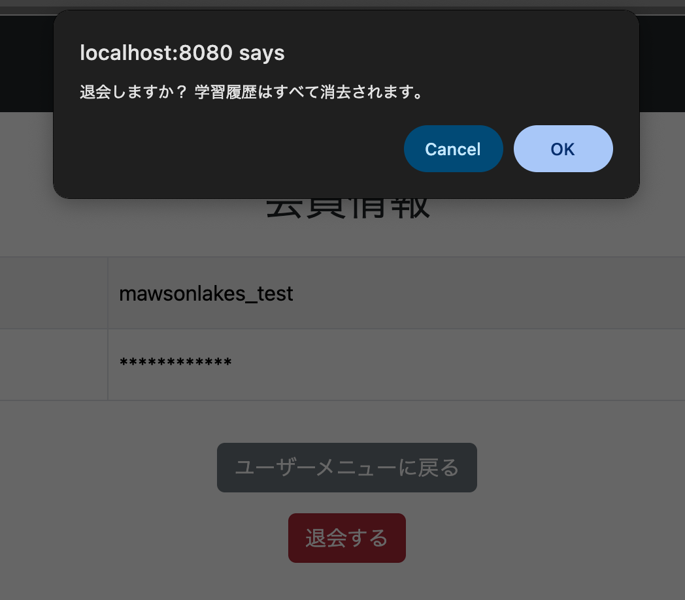

OKを押すと退会処理が行われ、

```text
favorite
↓
study_history
↓
users
```

の順番でユーザーに関連するデータが削除された。

その後ログアウトし、退会完了画面が表示された。

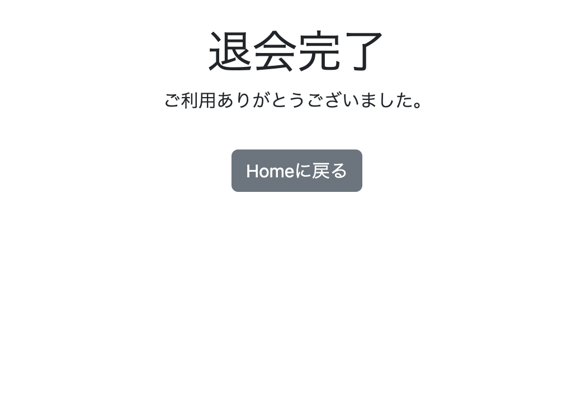

---

# 5. UI改善

アカウント管理機能の実装後、ユーザーID変更画面とパスワード変更画面のUIを改善する。

---

# 5-1. ユーザーID変更フォームに表示される新しいユーザーIDの欄は空欄にする

`git commit -m "fix: clear new login ID field on edit form"`

当初、ユーザーID変更フォームに変更前のユーザーIDを表示するため、

```java
if (form.getLoginId() == null) {

    Users user = getLoginUser(loginUser);

    form.setLoginId(
            user.getLoginId()
    );
}

model.addAttribute(
        "editLoginIdForm",
        form
);

model.addAttribute(
        "currentLoginId",
        loginUser.getUsername()
);
```

としていた。

しかし、この実装では「現在のユーザーID」だけでなく、「新しいユーザーID」の入力欄にも現在のユーザーIDが最初から表示される状態になってしまった。

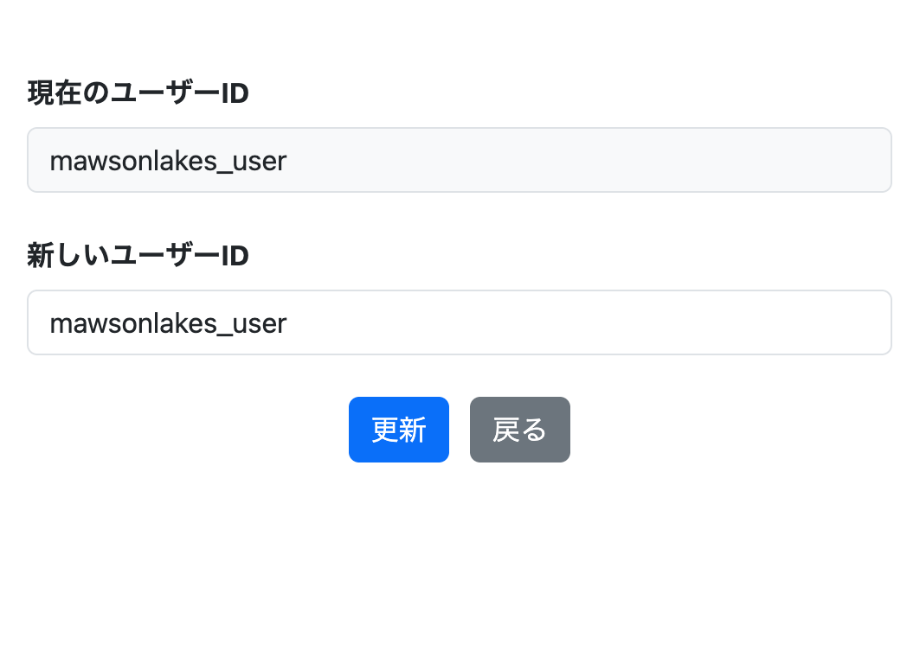

原因は、

```java
form.setLoginId(
        user.getLoginId()
);
```

によって、`EditLoginIdForm.loginId` に現在のユーザーIDを代入していたためである。

HTMLでは、

```html
<input type="text"
       id="loginId"
       th:field="*{loginId}"
       th:placeholder="#{signup.loginId.placeholder}"
       th:errorclass="is-invalid"
       class="form-control">
```

としている。

`th:field="*{loginId}"` は、

```html
th:object="${editLoginIdForm}"
```

で指定した `EditLoginIdForm.loginId` と結び付いている。

そのため、

```java
form.setLoginId(user.getLoginId());
```

を実行すると、

```text
EditLoginIdForm.loginId
        ↓
現在のユーザーIDが入る
        ↓
th:field="*{loginId}"
        ↓
新しいユーザーID欄に現在のIDが表示される
```

となる。

## 修正

今回、

```text
currentLoginId
→ 現在のユーザーIDを表示する値

editLoginIdForm.loginId
→ 新しいユーザーIDを入力する値
```

と役割が異なる。

そのため、現在のユーザーIDを `EditLoginIdForm.loginId` に入れる必要はない。

以下を削除する。

```java
if (form.getLoginId() == null) {

    Users user = getLoginUser(loginUser);

    form.setLoginId(
            user.getLoginId()
    );
}
```

GET処理は、

```java
@GetMapping("/user/edit/loginId")
public String getEditLoginId(
        @AuthenticationPrincipal UserDetails loginUser,
        Model model,
        EditLoginIdForm form) {

    model.addAttribute(
            "editLoginIdForm",
            form
    );

    model.addAttribute(
            "currentLoginId",
            loginUser.getUsername()
    );

    return "user/edit/loginId";
}
```

とする。

これにより、

```text
currentLoginId
→ 現在のユーザーIDが入っている

editLoginIdForm.loginId
→ 初期値なし
```

となり、新しいユーザーID欄は空欄になる。

## 実行

ユーザーID変更フォームを開くと、

```text
現在のユーザーID
→ 現在値が表示される

新しいユーザーID
→ 空欄
```

となった。

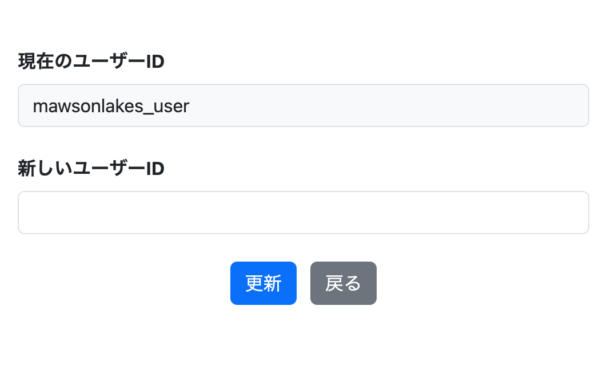

---

# 5-2. ユーザーID変更フォームとパスワード変更フォームにプレースホルダを追加

`git commit -m "ui: add validation hints to account edit forms"`

ユーザーID変更フォームとパスワード変更フォームの入力欄には、入力可能な文字数や文字種について何も表示されていなかった。

そのためユーザーが、

```text
ユーザーIDは何文字だったか
パスワードは何文字だったか
記号は使えるのか
```

などを画面から判断しにくい。


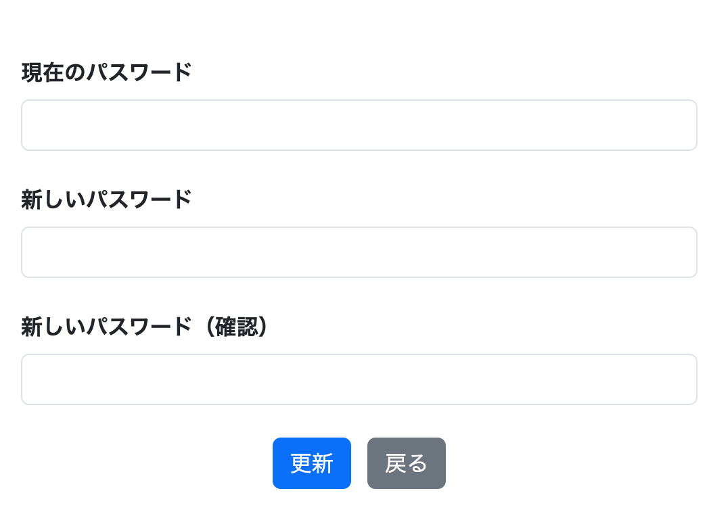

そこで、新規登録画面と同様に入力欄へプレースホルダを表示する。

既に新規登録画面用のメッセージが存在するため、新しいメッセージを作成せず流用する。

---

## /user/edit/loginId.html

```html
<!-- 新しいユーザーID -->

<div class="mb-4">

    <label for="loginId"
           class="form-label fw-bold"
           th:text="#{user.edit.loginId.new}">
        新しいユーザーID
    </label>

    <input type="text"
           id="loginId"
           th:field="*{loginId}"
           th:placeholder="#{signup.loginId.placeholder}"
           th:errorclass="is-invalid"
           class="form-control">

    <div class="invalid-feedback"
         th:errors="*{loginId}">
    </div>

</div>
```

追加したのは、

```html
th:placeholder="#{signup.loginId.placeholder}"
```

である。

---

## /user/edit/password.html

新しいパスワード欄に、

```html
th:placeholder="#{signup.password.placeholder}"
```

を追加する。

```html
<!-- 新しいパスワード -->

<div class="mb-4">

    <label for="newPassword"
           class="form-label fw-bold"
           th:text="#{user.edit.password.new}">
        新しいパスワード
    </label>

    <input type="password"
           id="newPassword"
           th:field="*{newPassword}"
           th:placeholder="#{signup.password.placeholder}"
           th:errorclass="is-invalid"
           class="form-control">

    <div class="invalid-feedback"
         th:errors="*{newPassword}">
    </div>

</div>
```

確認用パスワードにも、

```html
th:placeholder="#{signup.passwordConfirm.placeholder}"
```

を追加する。

```html
<!-- 新しいパスワード（確認） -->

<div class="mb-4">

    <label for="newPasswordConfirm"
           class="form-label fw-bold"
           th:text="#{user.edit.password.confirm}">
        新しいパスワード（確認）
    </label>

    <input type="password"
           id="newPasswordConfirm"
           th:field="*{newPasswordConfirm}"
           th:placeholder="#{signup.passwordConfirm.placeholder}"
           th:errorclass="is-invalid"
           class="form-control">

    <div class="invalid-feedback"
         th:errors="*{newPasswordConfirm}">
    </div>

</div>
```

`messages.properties` は新規登録画面で使用している、

```text
signup.loginId.placeholder
signup.password.placeholder
signup.passwordConfirm.placeholder
```

をそのまま流用する。

現在のパスワード欄については、新しく作るパスワードではなく、既に設定しているパスワードを入力する欄なのでプレースホルダは追加しない。

## 実行

ユーザーID変更画面では、入力欄にユーザーIDの入力条件が表示された。

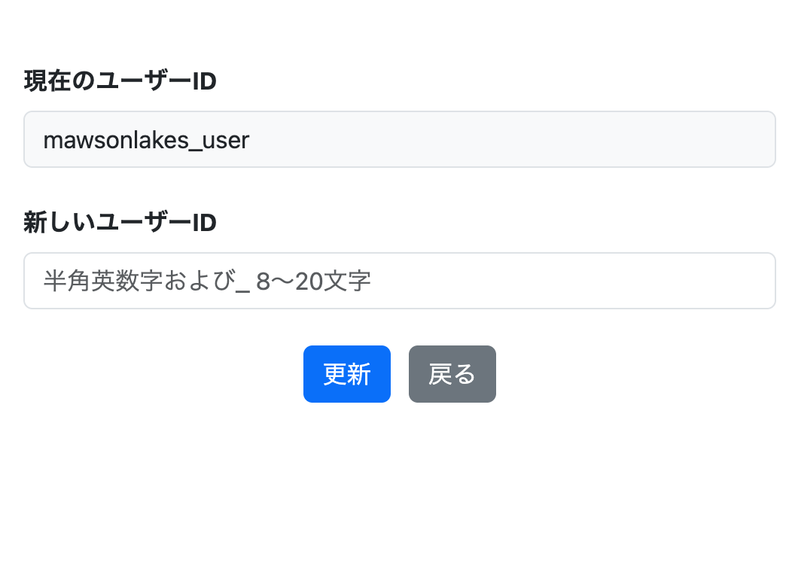

パスワード変更画面でも、新しいパスワードと確認用パスワードの入力欄にプレースホルダが表示された。

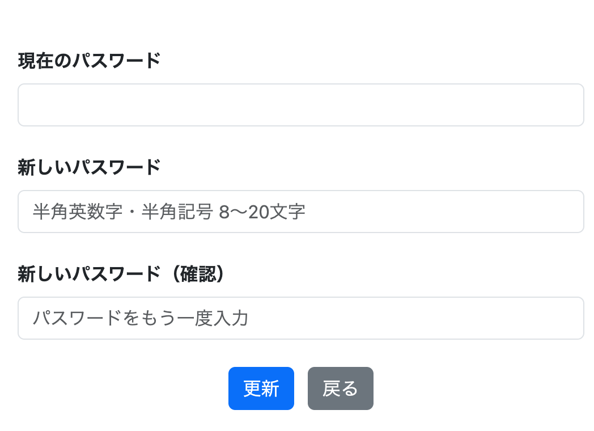

入力前の段階で入力条件を確認できるようになり、ユーザーにとって分かりやすいUIになった。

---

# 実装を終えて

今回の実装では、ユーザーのアカウント管理機能として以下を実装した。

- プロフィール確認
- ユーザーID変更
- パスワード変更
- アカウント削除

ユーザーID・パスワード変更後は、Spring Securityの認証情報を削除して再ログインさせるようにした。
この際、表示言語を保持するためSession全体は破棄せず、Spring Securityの認証情報のみを削除するようにした。

パスワード変更では、Bean Validationに加えて現在のパスワード確認などの業務上のチェックをServiceで行い、独自例外を利用してControllerから適切なエラーを表示できるようにした。

アカウント削除では、外部キー制約を考慮して、お気に入り・学習履歴を削除してからユーザーを削除するようにした。

これにより、ユーザー自身がプロフィール画面から主要なアカウント情報を管理できるようになった。

---

# つぎやること

ユーザーメニューその3として、各種設定画面を実装する。