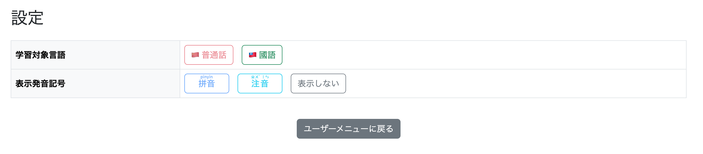
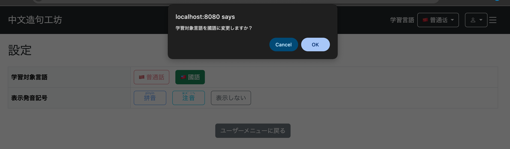
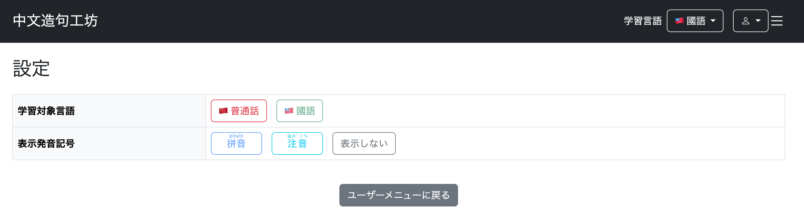
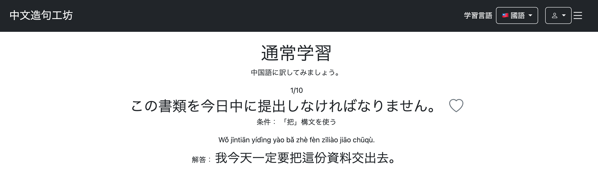
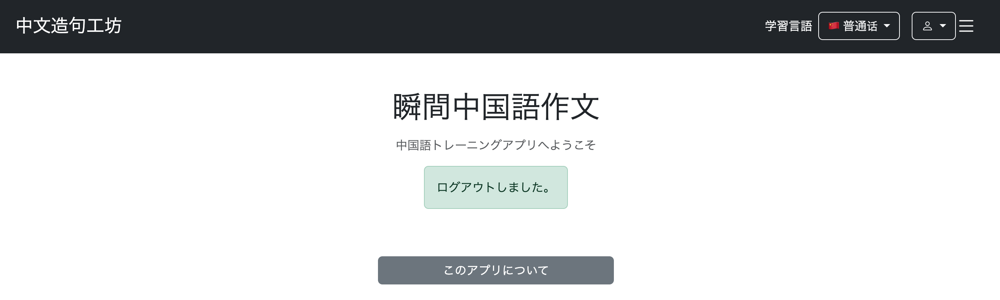
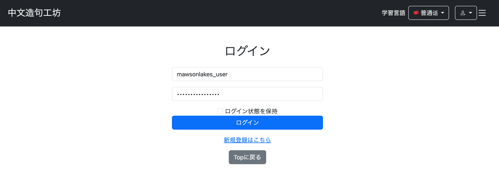
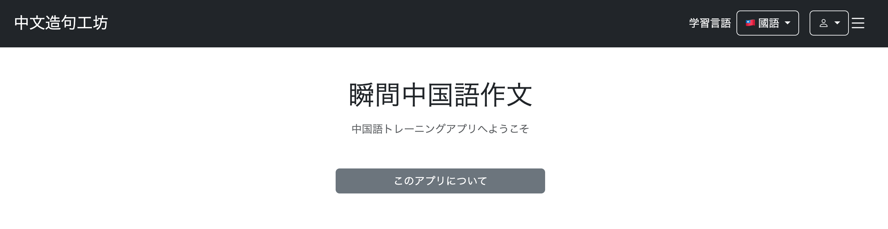
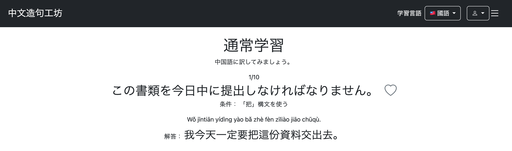
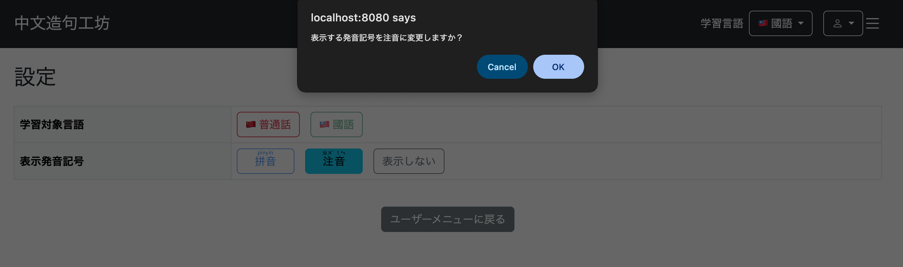
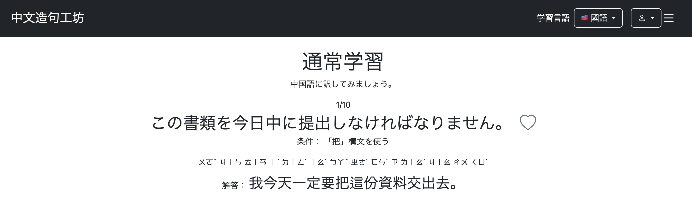

# 014 User Menu Implementation Part 3 - User Settings

## 1. 概要

ユーザーメニューの設定画面を実装した。

今回実装した設定項目は以下の2つである。

* 学習対象言語

  * 普通話（MAINLAND）
  * 國語（TAIWAN）
* 表示する発音記号

  * 拼音（PINYIN）
  * 注音（ZHUYIN）
  * 表示なし（NONE）

これまではこれらの設定をSession上で管理していたため、ログアウトすると設定が失われていた。

そこで、ログインユーザーについては設定値を`users`テーブルにも保存し、再ログイン時にDBからSessionへ復元するようにした。

```text
設定変更
    ↓
usersテーブルへ保存
    ↓
Sessionにも反映
    ↓
ログアウト
    ↓
Session破棄
    ↓
再ログイン
    ↓
usersテーブルから設定を取得
    ↓
Sessionへ復元
```

---

## 2. usersテーブルに設定項目を追加

```
git commit -m "feat: add persistent user language and pronunciation settings"
```

### 2-1. カラムの追加

既存の`users`テーブルに、学習対象言語と表示発音記号を保存するカラムを追加した。

```sql
ALTER TABLE users
ADD COLUMN language_variant VARCHAR(20);

ALTER TABLE users
ADD COLUMN pronunciation_type VARCHAR(20);
```

既存ユーザーが存在するため、この時点では`NOT NULL`を付けずに追加した。

### 2-2. 既存ユーザーへ初期値を設定

既存ユーザーにデフォルト値を設定した。

```sql
UPDATE users
SET language_variant = 'MAINLAND',
    pronunciation_type = 'PINYIN';
```

設定後、以下のSQLで確認した。

```sql
SELECT
    id,
    login_id,
    role,
    language_variant,
    pronunciation_type
FROM users;
```

結果は以下のようになった。

```text
1  "mawsonlakes_general"  "USER"  "MAINLAND"  "PINYIN"
2  "mawsonlakes_user"     "USER"  "MAINLAND"  "PINYIN"
```

### 2-3. NOT NULL制約の追加

既存データに値が入ったことを確認してから、`NOT NULL`制約を追加した。

```sql
ALTER TABLE users
ALTER COLUMN language_variant SET NOT NULL;

ALTER TABLE users
ALTER COLUMN pronunciation_type SET NOT NULL;
```

### 2-4. Users.javaの修正

`Users`エンティティにも対応するフィールドを追加した。

```java
@Enumerated(EnumType.STRING)
@Column(name = "language_variant", nullable = false, length = 20)
private LanguageVariant languageVariant = LanguageVariant.MAINLAND;

@Enumerated(EnumType.STRING)
@Column(name = "pronunciation_type", nullable = false, length = 20)
private PronunciationType pronunciationType = PronunciationType.PINYIN;
```

`@Enumerated(EnumType.STRING)`によってEnumを文字列としてDBへ保存する。

また、

```java
= LanguageVariant.MAINLAND;
= PronunciationType.PINYIN;
```

は、今後新規作成されるユーザーの初期値として設定している。

---

## 3. UserAccountServiceに設定更新処理を追加

```
git commit -m "feat: implement user settings management"
```

### 3-1. updateLanguageVariant

学習対象言語をDBへ保存する処理を追加した。

```java
@Transactional
public void updateLanguageVariant(
        String loginId,
        LanguageVariant languageVariant,
        Locale locale) {

    Users user = getUserOne(loginId);

    if (user == null) {
        throw new IllegalArgumentException(
                messageSource.getMessage(
                        "user.settings.error.notFound",
                        null,
                        locale
                )
        );
    }

    user.setLanguageVariant(languageVariant);

    userRepository.save(user);

    log.info(
            "学習対象言語変更 loginId={}, languageVariant={}",
            user.getLoginId(),
            languageVariant
    );
}
```

ログインIDからユーザーを取得し、`languageVariant`を更新して保存する。

### 3-2. updatePronunciationType

表示発音記号についても同様に更新処理を追加した。

```java
@Transactional
public void updatePronunciationType(
        String loginId,
        PronunciationType pronunciationType,
        Locale locale) {

    Users user = getUserOne(loginId);

    if (user == null) {
        throw new IllegalArgumentException(
                messageSource.getMessage(
                        "user.settings.error.notFound",
                        null,
                        locale
                )
        );
    }

    user.setPronunciationType(pronunciationType);

    userRepository.save(user);

    log.info(
            "表示発音記号変更 loginId={}, pronunciationType={}",
            user.getLoginId(),
            pronunciationType
    );
}
```

---

## 4. LanguageVariantControllerの修正

これまでは学習対象言語をSessionに保存するだけだったが、ログイン中の場合はDBにも保存するように変更した。

```java
@Controller
@RequiredArgsConstructor
public class LanguageVariantController {

    private final UserAccountService userAccountService;

    @GetMapping("/language-variant")
    public String changeLanguageVariant(
            @AuthenticationPrincipal UserDetails loginUser,
            @RequestParam LanguageVariant languageVariant,
            @RequestParam(required = false) String redirect,
            Locale locale,
            HttpSession session) {

        LanguageVariant current =
                (LanguageVariant) session.getAttribute("languageVariant");

        // 同じ言語なら変更処理をしない
        if (languageVariant == current) {
            return redirect != null
                    ? "redirect:" + redirect
                    : "redirect:/";
        }

        // ログインしていればDBの学習対象言語情報を更新
        if (loginUser != null) {
            userAccountService.updateLanguageVariant(
                    loginUser.getUsername(),
                    languageVariant,
                    locale
            );
        }

        // 中断中の通常学習データを破棄
        session.removeAttribute("practiceQuestions");
        session.removeAttribute("practiceCurrentPage");

        // 学習対象言語をSessionに保存
        session.setAttribute("languageVariant", languageVariant);

        // 戻り先が指定されている場合
        if (redirect != null) {
            return "redirect:" + redirect;
        }

        return "redirect:/";
    }
}
```

これにより、

* ログインユーザー：DBとSessionの両方を更新
* 未ログインユーザー：Sessionのみ更新

という動作になる。

また、これまでの

```java
if ("/practice/menu".equals(redirect)) {
    return "redirect:/practice/menu";
}
```

を、

```java
if (redirect != null) {
    return "redirect:" + redirect;
}
```

へ変更した。

これにより、呼び出し側から`redirect`を指定することで、学習対象言語変更後の戻り先を設定できるようにした。

---

## 5. PronunciationTypeControllerの修正

表示発音記号についても、ログインユーザーの場合はDBへ保存するように変更した。

```java
@Controller
@RequiredArgsConstructor
public class PronunciationTypeController {

    private final UserAccountService userAccountService;

    @GetMapping("/pronunciation-type")
    public String changePronunciationType(
            @AuthenticationPrincipal UserDetails loginUser,
            @RequestParam PronunciationType pronunciationType,
            Locale locale,
            HttpSession session) {

        PronunciationType current =
                (PronunciationType) session.getAttribute("pronunciationType");

        // 同じ発音記号なら変更処理をしない
        if (pronunciationType == current) {
            return "redirect:/user/settings";
        }

        // ログインしていればDBの発音記号を更新
        if (loginUser != null) {
            userAccountService.updatePronunciationType(
                    loginUser.getUsername(),
                    pronunciationType,
                    locale
            );
        }

        // 発音記号をSessionに保存
        session.setAttribute("pronunciationType", pronunciationType);

        return "redirect:/user/settings";
    }
}
```

発音記号の変更は出題する問題そのものには影響しないため、`practiceQuestions`などの学習データは削除しない。

また、発音記号の変更は設定画面から行うため、変更後は`/user/settings`へ戻す。

---

## 6. ログイン時にユーザー設定をSessionへ復元

DBへ設定を保存しても、再ログイン時にDBから取得しなければSessionへ反映されない。

そこで、ログイン成功時にユーザー設定を取得する`LoginSuccessHandler`を追加した。

### 6-1. LoginSuccessHandler.java

`security`パッケージを作成し、`LoginSuccessHandler.java`を追加した。

```text
src/main/java
└── io.github.mawsonlakes790913.chineseoutputforge
    ├── constant
    ├── controller
    ├── dto
    ├── entity
    ├── repository
    ├── service
    ├── security
    │   └── LoginSuccessHandler.java
    └── util
```

実装は以下のとおりである。

```java
@Component
public class LoginSuccessHandler
        extends SavedRequestAwareAuthenticationSuccessHandler {

    private final UserAccountService userAccountService;

    public LoginSuccessHandler(UserAccountService userAccountService) {
        this.userAccountService = userAccountService;
        super.setDefaultTargetUrl("/");
    }

    @Override
    public void onAuthenticationSuccess(
            HttpServletRequest request,
            HttpServletResponse response,
            Authentication authentication)
            throws IOException, ServletException {

        // ログインIDからユーザー情報を取得
        Users user =
                userAccountService.getUserOne(authentication.getName());

        // usersテーブルから設定を取得
        LanguageVariant languageVariant =
                user.getLanguageVariant();

        PronunciationType pronunciationType =
                user.getPronunciationType();

        // Sessionを取得
        HttpSession session = request.getSession();

        // Sessionへ設定を保存
        session.setAttribute("languageVariant", languageVariant);
        session.setAttribute("pronunciationType", pronunciationType);

        // Spring Security標準のログイン成功後処理を実行
        super.onAuthenticationSuccess(
                request,
                response,
                authentication
        );
    }
}
```

`SavedRequestAwareAuthenticationSuccessHandler`を継承することで、ログイン前にアクセスしようとしていたページへ戻るSpring Securityの既存動作を維持しながら、Sessionへユーザー設定を保存する処理を追加した。

`super.setDefaultTargetUrl("/")`は、戻るべきページが存在しない場合のデフォルト遷移先を`/`に設定している。

---

## 7. SecurityConfigにLoginSuccessHandlerを登録

作成した`LoginSuccessHandler`を`SecurityConfig`へDIする。

```java
private final LoginSuccessHandler loginSuccessHandler;
```

ログイン設定では、これまで使用していた

```java
.defaultSuccessUrl("/", false)
```

を削除し、

```java
.successHandler(loginSuccessHandler)
```

へ変更した。

```java
.formLogin(login -> login
    .loginPage("/login")
    .usernameParameter("loginId")
    .passwordParameter("password")
    .successHandler(loginSuccessHandler)
    .failureHandler(new AuthenticationFailureHandler() {

        @Override
        public void onAuthenticationFailure(
                HttpServletRequest request,
                HttpServletResponse response,
                AuthenticationException exception)
                throws IOException {

            HttpSession session = request.getSession(true);

            session.setAttribute(
                    "loginErrorMessage",
                    "login.error"
            );

            response.sendRedirect("/login");
        }
    })
    .permitAll()
)
```

これでログイン成功時に`LoginSuccessHandler`が実行される。

---

## 8. 設定画面へのControllerを追加

`UserMenuController`に設定画面へのマッピングを追加した。

```java
@GetMapping("/user/settings")
public String getSettings() {
    return "user/settings";
}
```

これにより、

```text
/user/settings
    ↓
templates/user/settings.html
```

へ遷移する。

---

## 9. user/settings.htmlを作成

設定画面に学習対象言語と表示発音記号の変更ボタンを配置した。

```html
<!DOCTYPE html>

<html xmlns:th="http://www.thymeleaf.org"
      xmlns:layout="http://www.ultraq.net.nz/thymeleaf/layout"
      layout:decorate="~{layout/layout}">

<head>
    <meta charset="UTF-8">

    <title th:text="#{settings.title}">
        設定
    </title>
</head>

<body>

<div layout:fragment="content"
     class="w-100">

    <h2 class="mb-4"
        th:text="#{settings.title}">
        設定
    </h2>

    <div class="table-responsive">

        <table class="table table-bordered align-middle">

            <tbody>

                <!-- 学習対象言語 -->
                <tr>
                    <th class="bg-light w-25"
                        th:text="#{settings.languageVariant}">
                        学習対象言語
                    </th>

                    <td>
                        <div class="d-flex flex-wrap gap-3">

                            <!-- 普通話 -->
                            <a class="btn btn-outline-danger"
                               th:classappend="${session.languageVariant != null
                                   && session.languageVariant.name() == 'MAINLAND'}
                                   ? ' disabled'"
                               th:href="@{/language-variant(
                                   languageVariant='MAINLAND',
                                   redirect='/user/settings'
                               )}"
                               th:onclick="return confirm([[#{settings.languageVariant.mainland.confirm}]])">
                                🇨🇳
                                <span th:text="#{settings.languageVariant.mainland}">
                                    普通話
                                </span>
                            </a>

                            <!-- 國語 -->
                            <a class="btn btn-outline-success"
                               th:classappend="${session.languageVariant != null
                                   && session.languageVariant.name() == 'TAIWAN'}
                                   ? ' disabled'"
                               th:href="@{/language-variant(
                                   languageVariant='TAIWAN',
                                   redirect='/user/settings'
                               )}"
                               th:onclick="return confirm([[#{settings.languageVariant.taiwan.confirm}]])">
                                🇹🇼
                                <span th:text="#{settings.languageVariant.taiwan}">
                                    國語
                                </span>
                            </a>

                        </div>
                    </td>
                </tr>

                <!-- 表示発音記号 -->
                <tr>
                    <th class="bg-light w-25"
                        th:text="#{settings.pronunciationType}">
                        表示発音記号
                    </th>

                    <td>
                        <div class="d-flex flex-wrap gap-3">

                            <!-- 拼音 -->
                            <a class="btn btn-outline-primary px-4"
                               th:classappend="${session.pronunciationType != null
                                   && session.pronunciationType.name() == 'PINYIN'}
                                   ? ' disabled'"
                               th:href="@{/pronunciation-type(
                                   pronunciationType='PINYIN'
                               )}"
                               th:onclick="return confirm([[#{settings.pronunciationType.pinyin.confirm}]])">

                                <ruby>
                                    拼音
                                    <rt>pīnyīn</rt>
                                </ruby>
                            </a>

                            <!-- 注音 -->
                            <a class="btn btn-outline-info px-4"
                               th:classappend="${session.pronunciationType != null
                                   && session.pronunciationType.name() == 'ZHUYIN'}
                                   ? ' disabled'"
                               th:href="@{/pronunciation-type(
                                   pronunciationType='ZHUYIN'
                               )}"
                               th:onclick="return confirm([[#{settings.pronunciationType.zhuyin.confirm}]])">

                                <ruby>
                                    注音
                                    <rt>ㄓㄨˋ ㄧㄣ</rt>
                                </ruby>
                            </a>

                            <!-- 表示しない -->
                            <a class="btn btn-outline-secondary"
                               th:classappend="${session.pronunciationType != null
                                   && session.pronunciationType.name() == 'NONE'}
                                   ? ' disabled'"
                               th:href="@{/pronunciation-type(
                                   pronunciationType='NONE'
                               )}"
                               th:onclick="return confirm([[#{settings.pronunciationType.none.confirm}]])"
                               th:text="#{settings.pronunciationType.none}">
                                表示しない
                            </a>

                        </div>
                    </td>
                </tr>

            </tbody>

        </table>

    </div>

    <div class="text-center mt-4 mb-3">

        <a th:href="@{/user/menu}"
           class="btn btn-secondary">
            ユーザーメニューに戻る
        </a>

    </div>

</div>

</body>

</html>
```

`th:classappend`で現在選択されている設定に`disabled`を追加し、現在値を再度選択できないようにした。

また、設定変更前には`confirm()`による確認ダイアログを表示する。

---

## 10. messages.propertiesを追加

設定画面で使用するメッセージを追加した。

```properties
# 設定
settings.title=設定

# 学習対象言語
settings.languageVariant=学習対象言語
settings.languageVariant.mainland=普通話
settings.languageVariant.taiwan=國語

settings.languageVariant.mainland.confirm=学習対象言語を普通話に変更しますか？
settings.languageVariant.taiwan.confirm=学習対象言語を國語に変更しますか？

# 表示発音記号
settings.pronunciationType=表示発音記号
settings.pronunciationType.none=表示しない

settings.pronunciationType.pinyin.confirm=表示する発音記号を拼音に変更しますか？
settings.pronunciationType.zhuyin.confirm=表示する発音記号を注音に変更しますか？
settings.pronunciationType.none.confirm=発音記号を表示しない設定に変更しますか？

user.settings.error.notFound=ユーザーが存在しません。
```

各言語の`messages.properties`にも対応するメッセージを追加した。

---

## 11. Spring Boot起動時に循環依存が発生

ここまで実装してSpring Bootを再起動したところ、Beanの循環依存によるエラーが発生した。

依存関係は以下のようになっていた。

```text
SecurityConfig
    ↓
LoginSuccessHandler
    ↓
UserAccountService
    ↓
PasswordEncoder
    ↓
SecurityConfig
```

`SecurityConfig`が`LoginSuccessHandler`を必要とし、そこから最終的に`SecurityConfig`自身が定義している`PasswordEncoder`へ戻っていた。

### 11-1. PasswordEncoderConfig.javaを作成

`PasswordEncoder`のBean定義を`SecurityConfig`から分離した。

```java
@Configuration
public class PasswordEncoderConfig {

    @Bean
    PasswordEncoder passwordEncoder() {
        return new BCryptPasswordEncoder();
    }
}
```

### 11-2. SecurityConfigからPasswordEncoderを削除

以下のBean定義を`SecurityConfig`から削除した。

```java
@Bean
PasswordEncoder passwordEncoder() {
    return new BCryptPasswordEncoder();
}
```

これにより依存関係は、

```text
SecurityConfig
    ↓
LoginSuccessHandler
    ↓
UserAccountService
    ↓
PasswordEncoder

PasswordEncoderConfig
    ↓
PasswordEncoder
```

となり、循環依存を解消できた。

---

## 12. 実行確認

`http://localhost:8080/user/settings`へアクセスすると設定画面が表示された。

現在選択されている設定はクリックできない状態になっている。



### 12-1. 学習対象言語の切り替え

学習対象言語を國語へ変更すると、確認ダイアログが表示される。



OKを押すと、学習対象言語が國語へ切り替わった。



学習画面でも國語の問題が出題される。



一度ログアウトする。



再度ログインする。



再ログイン後も、デフォルトの普通話ではなく國語が選択された状態になった。



これにより、学習対象言語がDBへ保存され、ログイン時にSessionへ復元されていることを確認できた。

### 12-2. 表示発音記号の切り替え

変更前は拼音表示になっている。



設定画面から注音へ変更する。



再び学習画面で解答を表示すると、発音記号が注音へ切り替わった。



---

## 13. 復習メニューで学習対象言語を変更した場合の戻り先を修正

```
git commit -m "fix: preserve review menu after language switch"
```

通常学習メニューでは、学習対象言語を変更した後に通常学習メニューへ戻るようになっていた。

一方、復習メニューでは戻り先が設定されていなかったため、言語変更後にHome画面へ戻っていた。

通常学習メニューでは`PracticeController#getPracticeMenu`で以下のように戻り先を設定している。

```java
// 言語切替後の戻り先
model.addAttribute(
        "languageVariantRedirect",
        "/practice/menu"
);
```

同様に`ReviewController#getReviewMenu`にも以下を追加した。

```java
// 言語切替後の戻り先
model.addAttribute(
        "languageVariantRedirect",
        "/review/menu"
);
```

ヘッダーでは、この`languageVariantRedirect`を`redirect`パラメータとして`LanguageVariantController`へ渡している。

```html
th:href="@{/language-variant(
    languageVariant='TAIWAN',
    redirect=${languageVariantRedirect}
)}"
```

これにより、復習メニュー上で学習対象言語を変更した場合も、変更後に`/review/menu`へ戻るようになった。

---

## 14. 問題一覧画面で学習対象言語を変更した場合の戻り先を修正

```bash
git commit -m "fix: preserve user question list after language switch"
```

問題一覧画面でも復習メニューと同様に、学習対象言語を変更した後の戻り先が設定されていなかったため、言語変更後にHome画面へ戻っていた。

そこで、`UserQuestionListController#getUserQuestionList`に以下を追加した。

```java
// 言語切替後の戻り先
model.addAttribute(
        "languageVariantRedirect",
        "/user/question/list"
);
```

ヘッダーでは、この`languageVariantRedirect`を`redirect`パラメータとして`LanguageVariantController`へ渡している。

```html
th:href="@{/language-variant(
    languageVariant='TAIWAN',
    redirect=${languageVariantRedirect}
)}"
```

これにより、問題一覧画面上で学習対象言語を変更した場合も、変更後に`/user/question/list`へ戻るようになった。

