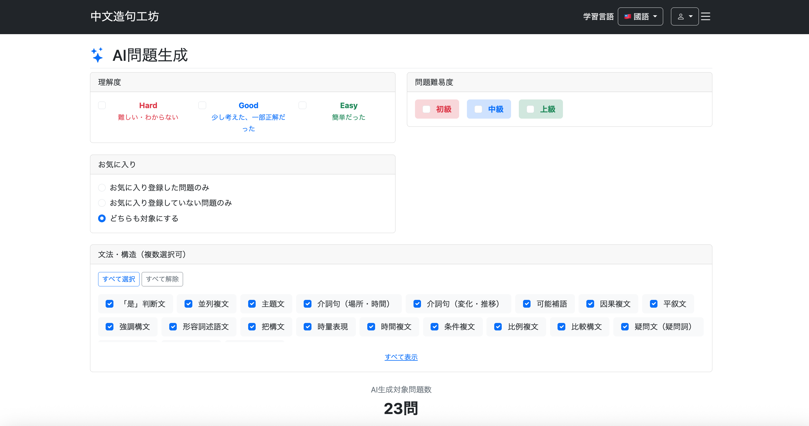
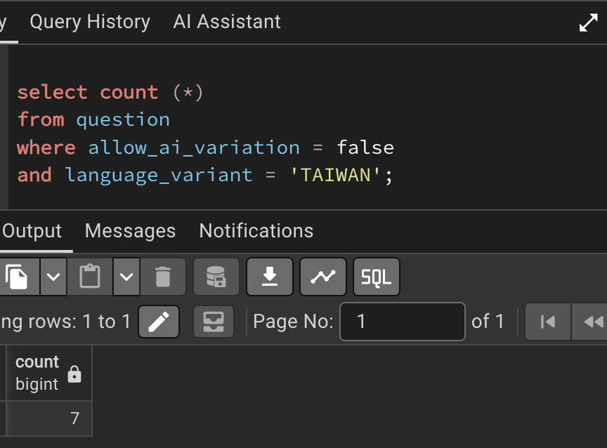

# 015 AI問題生成モードの実装その1 ― メニュー画面と生成元問題の絞り込み

## 1. AI問題生成モードの構成

AI問題生成モードでは、既存の`question`テーブルに登録されている問題を生成元として取得し、各Questionに設定されたAI生成用の情報を利用して問題を改変する。

画面は通常学習モードや復習モードと同様に、以下の2画面を基本構成とする。

```text
メニュー画面
/ai-practice/menu

トレーニング画面
/ai-practice/question
```

問題生成から出題までの流れは以下とする。

```text
/ai-practice/menu
        ↓
条件を指定
        ↓
「出題開始」
        ↓
【DB】
ユーザーが指定した条件を使って
QuestionテーブルからAI生成対象を最大50問取得
        ↓
【AI】
取得した各Questionの
template / subjectType / verbVariation 等を使って書き換える
        ↓
最大50問の「AI生成済み問題セット」を作成
        ↓
セッションへ保存
        ↓
/ai-practice/question?page=0
        ↓
問題1を表示
        ↓
「次の問題へ」
        ↓
問題2を表示
```

今回の実装では、このうち**AI生成対象となるQuestionを条件に応じて検索できるメニュー画面と、対象問題数を取得する仕組み**を実装した。

---

# 2. AI生成対象問題を取得する仕組みを作る

```bash
git commit -m "feat: add AI practice menu and source question filtering"
```

AI生成対象問題の検索条件は、既存の`/user/question/list`や`/review/menu`のフィルター機能をベースにする。

ユーザーが指定できる条件は以下とした。

* 理解度
* 難易度
* お気に入り
* 文法・構造

これに加えて、内部的に以下の条件を適用する。

* 現在設定されている学習対象言語
* `allow_ai_variation = true`

---

## 2-1. QuestionRepositoryにAI生成対象問題数を取得するクエリを追加

`QuestionRepository`に、指定された条件に該当するAI生成対象Questionの件数を取得する`countAiGenerationSourceQuestions()`を追加した。

### QuestionRepository

```java
@Query(value = """
        SELECT COUNT (*)
        FROM question q
        JOIN study_history sh
        ON (
            q.question_id = sh.question_id
            AND sh.user_id = :userId
        )
        LEFT JOIN favorite f
        ON (
            q.question_id = f.question_id
            AND f.user_id = :userId
        )
        WHERE q.difficulty IN (:difficulties)
        AND sh.evaluation IN (:evaluations)
        AND (
            :favoriteCondition = 'ALL'
            OR (
                :favoriteCondition = 'FAVORITED'
                AND f.question_id IS NOT NULL
            )
            OR (
                :favoriteCondition = 'NOT_FAVORITED'
                AND f.question_id IS NULL
            )
        )
        AND q.structure_id IN (:structureIds)
        AND q.language_variant = :languageVariant
        AND q.allow_ai_variation = True
        """,
        nativeQuery = true)
Long countAiGenerationSourceQuestions(

        @Param("userId")
        long userId,

        @Param("difficulties")
        List<String> difficulties,

        @Param("evaluations")
        List<String> evaluations,

        @Param("favoriteCondition")
        String favoriteCondition,

        @Param("structureIds")
        List<Long> structureIds,

        @Param("languageVariant")
        String languageVariant

);
```

`question.structure_id`を直接検索条件として使用できるため、`structure`テーブルとのJOINは行っていない。

また、

```sql
AND q.allow_ai_variation = True
```

を条件に加えることで、AIによる改変を許可しているQuestionのみを対象としている。

---

## 2-2. AiPracticeServiceを作成

AI問題生成モード用の`AiPracticeService`を作成した。

検索条件が未指定の場合は、`ReviewService`と同様にその項目をすべて選択したものとして扱う。

### AiPracticeService

```java
@Service
@RequiredArgsConstructor
public class AiPracticeService {

    private final StructureRepository structureRepository;
    private final QuestionRepository questionRepository;
    private final SearchConditionConverter searchConditionConverter;

    public Long countAiGenerationSourceQuestions(long userId,
                                                 List<Difficulty> difficulties,
                                                 List<Evaluation> evaluations,
                                                 FavoriteCondition favoriteCondition,
                                                 List<Long> structureIds,
                                                 LanguageVariant languageVariant) {

        // 難易度
        if (difficulties == null || difficulties.isEmpty()) {
            difficulties = Arrays.asList(Difficulty.values());
        }

        // 理解度
        if (evaluations == null || evaluations.isEmpty()) {
            evaluations = Arrays.asList(Evaluation.values());
        }

        // お気に入り条件
        if (favoriteCondition == null) {
            favoriteCondition = FavoriteCondition.ALL;
        }

        // 文法・構造
        if (structureIds == null || structureIds.isEmpty()) {
            structureIds = structureRepository.findAllStructureIds();
        }

        return questionRepository.countAiGenerationSourceQuestions(
                userId,
                searchConditionConverter.convertDifficulty(difficulties),
                searchConditionConverter.convertEvaluation(evaluations),
                searchConditionConverter.convertFavoriteCondition(favoriteCondition),
                structureIds,
                languageVariant.name());

    }

}
```

これにより、画面から何も選択されなかった場合でも、

```java
Difficulty.values()
Evaluation.values()
FavoriteCondition.ALL
structureRepository.findAllStructureIds()
```

を使用して検索できるようにした。

---

## 2-3. AiPracticeControllerを作成

AI問題生成モード用の`AiPracticeController`を作成した。

今回追加したエンドポイントは以下の2つである。

```text
GET /ai-practice/menu
GET /ai-practice/count
```

`/ai-practice/menu`はメニュー画面を表示し、`/ai-practice/count`は現在選択されている条件に該当するAI生成対象問題数を返す。

### AiPracticeController

```java
@Controller
@RequiredArgsConstructor
public class AiPracticeController {

    private final ReviewService reviewService;
    private final UserAccountService userAccountService;
    private final AiPracticeService aiPracticeService;

    @GetMapping("/ai-practice/menu")
    public String getAiPracticeMenu(
            HttpSession session,
            Model model) {

        // 言語切替後の戻り先
        model.addAttribute("languageVariantRedirect", "/ai-practice/menu");

        // セッションから情報を取得
        List<Question> questions =
                (List<Question>) session.getAttribute("aiPracticeQuestions");

        Integer currentPage =
                (Integer) session.getAttribute("aiPracticeCurrentPage");

        // 中断したデータがあるか判定
        boolean canResume = questions != null && currentPage != null;

        // 中断したデータ情報を返す
        model.addAttribute("canResume", canResume);

        if (canResume) {
            model.addAttribute("currentPage", currentPage);
            model.addAttribute("totalCount", questions.size());
        }

        // 画面表示用structureを取得
        model.addAttribute(
                "structures",
                reviewService.findStructures());

        return "/ai-practice/menu";
    }

    @GetMapping("/ai-practice/count")
    @ResponseBody
    public long getAiPracticeCount(
            @AuthenticationPrincipal UserDetails loginUser,
            @RequestParam(name = "evaluations", required = false)
                List<Evaluation> evaluations,
            @RequestParam(name = "difficulties", required = false)
                List<Difficulty> difficulties,
            @RequestParam(name = "favoriteCondition", required = false)
                FavoriteCondition favoriteCondition,
            @RequestParam(name = "structureIds", required = false)
                List<Long> structureIds,
            HttpSession session
            ) {

        // user_id(文字列)からUsersを取得
        Users user = getLoginUser(loginUser);
        Long userId = user.getId();

        // 学習対象言語を取得
        LanguageVariant languageVariant =
                (LanguageVariant) session.getAttribute("languageVariant");

        // 未設定の場合は普通話
        if (languageVariant == null) {
            languageVariant = LanguageVariant.MAINLAND;
        }

        // 出題数を返す
        return aiPracticeService.countAiGenerationSourceQuestions(
                userId,
                difficulties,
                evaluations,
                favoriteCondition,
                structureIds,
                languageVariant
                );
    }

    private Users getLoginUser(UserDetails loginUser) {
        return userAccountService.getUserOne(loginUser.getUsername());
    }

}
```

メニュー画面を取得する処理と問題件数を取得する処理は、`ReviewController`と同様に別のメソッド・エンドポイントとして実装した。

`getAiPracticeMenu()`では、今後AI問題生成トレーニングを中断・再開できるように、

```java
session.getAttribute("aiPracticeQuestions");
session.getAttribute("aiPracticeCurrentPage");
```

からセッション情報を取得する処理も用意した。

---

# 3. AI問題生成メニュー画面を作成

`/ai-practice/menu.html`を作成した。

基本構成は`/review/menu.html`とほぼ同じだが、AI問題生成モードでは現在設定されている学習対象言語のみを使用するため、学習対象言語を選択するセクションは設けていない。

### /ai-practice/menu.html

```html
<!DOCTYPE html>

<html xmlns:th="http://www.thymeleaf.org"
      xmlns:layout="http://www.ultraq.net.nz/thymeleaf/layout"
      layout:decorate="~{layout/layout}">

<head>
    <meta charset="UTF-8">

    <title>Chinese Output Forge</title>

    <link rel="stylesheet"
          th:href="@{/webjars/bootstrap/css/bootstrap.min.css}">

    <link rel="stylesheet"
          th:href="@{/css/review/menu.css}">

    <script th:src="@{/js/ai-practice/menu.js}" defer></script>
</head>

<body>

<div layout:fragment="content">

    <!-- ============================= -->
    <!-- ヘッダー -->
    <!-- ============================= -->

    <div class="header border-bottom pb-2 mb-2
                d-flex justify-content-between align-items-center">

        <h1 class="h2 mb-0">

            <i class="bi bi-stars me-2 text-primary"></i>

            <span th:text="#{aiPractice.menu.title}">
                AI問題生成
            </span>

        </h1>

        <div th:if="${canResume}"
             class="d-flex align-items-center gap-3">

            <span class="text-danger fw-bold">

                <span th:text="#{aiPractice.menu.resume.message}">
                    中断しているトレーニングがあります
                </span>

                (<span th:text="${currentPage + 1}"></span>
                /
                <span th:text="${totalCount}"></span>)

            </span>

            <a th:href="@{/ai-practice/resume}"
               class="btn btn-warning"
               th:text="#{aiPractice.menu.resume}">
                再開する
            </a>

        </div>

    </div>


    <form th:action="@{/ai-practice/start}"
          method="get">

        <div class="row">

            <!-- ============================= -->
            <!-- 理解度 -->
            <!-- ============================= -->

            <div class="col-md-6 mb-4">

                <div class="card">

                    <div class="card-header"
                         th:text="#{aiPractice.menu.evaluation.title}">
                        理解度
                    </div>

                    <div class="card-body">

                        <div class="row">

                            <!-- HARD -->

                            <div class="col text-center">

                                <label class="form-check">

                                    <input class="form-check-input"
                                           type="checkbox"
                                           name="evaluations"
                                           value="HARD">

                                    <span class="form-check-label">

                                        <span class="fw-bold text-danger"
                                              th:text="#{aiPractice.menu.evaluation.hard}">
                                            Hard
                                        </span>

                                        <br>

                                        <small class="text-danger"
                                               th:text="#{aiPractice.menu.evaluation.hard.description}">
                                            難しい・わからない
                                        </small>

                                    </span>

                                </label>

                            </div>


                            <!-- GOOD -->

                            <div class="col text-center">

                                <label class="form-check">

                                    <input class="form-check-input"
                                           type="checkbox"
                                           name="evaluations"
                                           value="GOOD">

                                    <span class="form-check-label">

                                        <span class="fw-bold text-primary"
                                              th:text="#{aiPractice.menu.evaluation.good}">
                                            Good
                                        </span>

                                        <br>

                                        <small class="text-primary"
                                               th:text="#{aiPractice.menu.evaluation.good.description}">
                                            少し考えた、一部正解だった
                                        </small>

                                    </span>

                                </label>

                            </div>


                            <!-- EASY -->

                            <div class="col text-center">

                                <label class="form-check">

                                    <input class="form-check-input"
                                           type="checkbox"
                                           name="evaluations"
                                           value="EASY">

                                    <span class="form-check-label">

                                        <span class="fw-bold text-success"
                                              th:text="#{aiPractice.menu.evaluation.easy}">
                                            Easy
                                        </span>

                                        <br>

                                        <small class="text-success"
                                               th:text="#{aiPractice.menu.evaluation.easy.description}">
                                            簡単だった
                                        </small>

                                    </span>

                                </label>

                            </div>

                        </div>

                    </div>

                </div>

            </div>


            <!-- ============================= -->
            <!-- 問題難易度 -->
            <!-- ============================= -->

            <div class="col-md-6 mb-4">

                <div class="card">

                    <div class="card-header"
                         th:text="#{aiPractice.menu.difficulty.title}">
                        問題難易度
                    </div>

                    <div class="card-body">

                        <div class="d-flex gap-3">

                            <!-- BEGINNER -->

                            <label class="bg-danger-subtle rounded px-3 py-2">

                                <input class="form-check-input me-2"
                                       type="checkbox"
                                       name="difficulties"
                                       value="BEGINNER">

                                <span class="fw-bold text-danger"
                                      th:text="#{aiPractice.menu.difficulty.beginner}">
                                    初級
                                </span>

                            </label>


                            <!-- INTERMEDIATE -->

                            <label class="bg-primary-subtle rounded px-3 py-2">

                                <input class="form-check-input me-2"
                                       type="checkbox"
                                       name="difficulties"
                                       value="INTERMEDIATE">

                                <span class="fw-bold text-primary"
                                      th:text="#{aiPractice.menu.difficulty.intermediate}">
                                    中級
                                </span>

                            </label>


                            <!-- ADVANCED -->

                            <label class="bg-success-subtle rounded px-3 py-2">

                                <input class="form-check-input me-2"
                                       type="checkbox"
                                       name="difficulties"
                                       value="ADVANCED">

                                <span class="fw-bold text-success"
                                      th:text="#{aiPractice.menu.difficulty.advanced}">
                                    上級
                                </span>

                            </label>

                        </div>

                    </div>

                </div>

            </div>


            <!-- ============================= -->
            <!-- お気に入り -->
            <!-- ============================= -->

            <div class="col-md-6 mb-4">

                <div class="card">

                    <div class="card-header"
                         th:text="#{aiPractice.menu.favorite.title}">
                        お気に入り
                    </div>

                    <div class="card-body">

                        <!-- FAVORITED -->

                        <label class="form-check mb-2">

                            <input class="form-check-input"
                                   type="radio"
                                   name="favoriteCondition"
                                   value="FAVORITED">

                            <span class="form-check-label"
                                  th:text="#{aiPractice.menu.favorite.favorited}">
                                お気に入り登録した問題のみ
                            </span>

                        </label>


                        <!-- NOT_FAVORITED -->

                        <label class="form-check mb-2">

                            <input class="form-check-input"
                                   type="radio"
                                   name="favoriteCondition"
                                   value="NOT_FAVORITED">

                            <span class="form-check-label"
                                  th:text="#{aiPractice.menu.favorite.notFavorited}">
                                お気に入り登録していない問題のみ
                            </span>

                        </label>


                        <!-- ALL -->

                        <label class="form-check">

                            <input class="form-check-input"
                                   type="radio"
                                   name="favoriteCondition"
                                   value="ALL"
                                   checked>

                            <span class="form-check-label"
                                  th:text="#{aiPractice.menu.favorite.all}">
                                どちらも対象にする
                            </span>

                        </label>

                    </div>

                </div>

            </div>

        </div>


        <!-- ============================= -->
        <!-- 文法・構造 -->
        <!-- ============================= -->

        <div class="col-12 mb-4">

            <div class="card">

                <div class="card-header"
                     th:text="#{aiPractice.menu.structure}">
                    文法・構造（複数選択可）
                </div>

                <div class="card-body">

                    <!-- 一括操作 -->

                    <div class="mb-3">

                        <button type="button"
                                id="selectAllStructures"
                                class="btn btn-outline-primary btn-sm"
                                th:text="#{aiPractice.menu.structure.selectAll}">
                            すべて選択
                        </button>

                        <button type="button"
                                id="clearAllStructures"
                                class="btn btn-outline-secondary btn-sm"
                                th:text="#{aiPractice.menu.structure.clearAll}">
                            すべて解除
                        </button>

                    </div>


                    <!-- 文法・構造 -->

                    <div id="structureList"
                         class="d-flex flex-wrap gap-2 structure-list">

                        <label th:each="structure : ${structures}"
                               class="bg-light rounded px-3 py-2"
                               data-bs-toggle="tooltip"
                               data-bs-placement="top"
                               th:data-bs-title="${session.languageVariant != null
                                                   && session.languageVariant.name() == 'TAIWAN'
                                                   ? structure.descriptionZhTw
                                                   : structure.descriptionZhCn}">

                            <input class="form-check-input me-2"
                                   type="checkbox"
                                   name="structureIds"
                                   th:value="${structure.structureId}"
                                   checked>

                            <span th:text="${structure.name}">
                                文法・構造
                            </span>

                        </label>

                    </div>


                    <div class="text-center mt-3">

                        <button type="button"
                                id="toggleStructures"
                                class="btn btn-link btn-sm"
                                th:data-show-text="#{aiPractice.menu.structure.showAll}"
                                th:data-hide-text="#{aiPractice.menu.structure.collapse}"
                                th:text="#{aiPractice.menu.structure.showAll}">
                            すべて表示
                        </button>

                    </div>

                </div>

            </div>

        </div>


        <!-- ============================= -->
        <!-- AI生成対象問題数 -->
        <!-- ============================= -->

        <div class="text-center mb-4">

            <div class="text-secondary mb-2"
                 th:text="#{aiPractice.menu.count}">
                AI生成対象問題数
            </div>

            <h2 class="fw-bold"
                id="countAiPracticeQuestions">
                -
            </h2>

        </div>


        <!-- ============================= -->
        <!-- 出題開始 -->
        <!-- ============================= -->

        <div class="text-center mt-4">

            <button type="submit"
                    class="btn btn-primary btn-lg px-5"
                    th:text="#{aiPractice.menu.start}">
                出題開始
            </button>

        </div>

    </form>


    <!-- ============================= -->
    <!-- Topに戻る -->
    <!-- ============================= -->

    <div class="text-center mt-3 mb-3">

        <a th:href="@{/}"
           class="btn btn-secondary"
           th:text="#{aiPractice.menu.backToTop}">
            Topに戻る
        </a>

    </div>

</div>

</body>

</html>
```

---

# 4. 検索条件に応じてAI生成対象問題数を更新する

`/ai-practice/menu.js`を作成した。

メニュー画面の以下の条件が変更された場合に、

```text
evaluations
difficulties
favoriteCondition
structureIds
```

`/ai-practice/count`へリクエストを送り、現在のAI生成対象問題数を取得する。

また、文法・構造の一括選択、一括解除、表示切り替え、Tooltipについても`/review/menu`と同様の処理を実装した。

### /ai-practice/menu.js

```javascript
// =========================
// AI生成対象問題件数表示
// =========================

document.addEventListener("DOMContentLoaded", () => {

    // 検索条件
    const searchConditions = document.querySelectorAll(
        "input[name='evaluations'], " +
        "input[name='difficulties'], " +
        "input[name='favoriteCondition'], " +
        "input[name='structureIds']"
    );

    // 問題件数表示
    const countArea =
        document.getElementById("countAiPracticeQuestions");


    // =========================
    // 件数取得
    // =========================

    async function updateCount() {

        const params = new URLSearchParams();


        // 理解度
        document
            .querySelectorAll("input[name='evaluations']:checked")
            .forEach(cb => {
                params.append("evaluations", cb.value);
            });


        // 難易度
        document
            .querySelectorAll("input[name='difficulties']:checked")
            .forEach(cb => {
                params.append("difficulties", cb.value);
            });


        // お気に入り条件
        const favoriteCondition =
            document.querySelector(
                "input[name='favoriteCondition']:checked"
            );

        if (favoriteCondition) {
            params.append(
                "favoriteCondition",
                favoriteCondition.value
            );
        }


        // 文法・構造
        document
            .querySelectorAll("input[name='structureIds']:checked")
            .forEach(cb => {
                params.append("structureIds", cb.value);
            });


        const response =
            await fetch("/ai-practice/count?" + params);

        const count =
            await response.text();

        countArea.textContent =
            count + "問";
    }


    // =========================
    // 検索条件変更時
    // =========================

    searchConditions.forEach(input => {

        input.addEventListener(
            "change",
            updateCount
        );

    });


    // 初回表示時にもAI生成対象問題数を取得
    updateCount();


    // =========================
    // 文法・構造の一括選択
    // =========================

    const selectAllStructuresButton =
        document.getElementById("selectAllStructures");

    const clearAllStructuresButton =
        document.getElementById("clearAllStructures");

    const structureCheckboxes =
        document.querySelectorAll(
            "input[name='structureIds']"
        );


    // すべて選択
    selectAllStructuresButton.addEventListener("click", () => {

        structureCheckboxes.forEach(checkbox => {
            checkbox.checked = true;
        });

        updateCount();

    });


    // すべて解除
    clearAllStructuresButton.addEventListener("click", () => {

        structureCheckboxes.forEach(checkbox => {
            checkbox.checked = false;
        });

        updateCount();

    });


    // =========================
    // 文法・構造欄表示
    // =========================

    const structureList =
        document.getElementById("structureList");

    const toggleStructuresButton =
        document.getElementById("toggleStructures");

    toggleStructuresButton.addEventListener("click", () => {

        const expanded =
            structureList.classList.toggle("expanded");

        toggleStructuresButton.textContent =
            expanded
                ? toggleStructuresButton.dataset.hideText
                : toggleStructuresButton.dataset.showText;

    });


    // =========================
    // 文法・構造の説明
    // =========================

    const tooltipTriggerList =
        document.querySelectorAll(
            '[data-bs-toggle="tooltip"]'
        );

    tooltipTriggerList.forEach(element => {
        new bootstrap.Tooltip(element);
    });

});
```

---

# 5. AI問題生成メニュー用のメッセージを追加

`messages.properties`にAI問題生成メニューで使用するメッセージを追加した。

### messages.properties

```properties
# =========================
# AI問題生成
# =========================

# タイトル
aiPractice.menu.title=AI問題生成

# 中断データ
aiPractice.menu.resume.message=中断しているトレーニングがあります
aiPractice.menu.resume=再開する

# 理解度
aiPractice.menu.evaluation.title=理解度
aiPractice.menu.evaluation.hard=Hard
aiPractice.menu.evaluation.hard.description=難しい・わからない
aiPractice.menu.evaluation.good=Good
aiPractice.menu.evaluation.good.description=少し考えた、一部正解だった
aiPractice.menu.evaluation.easy=Easy
aiPractice.menu.evaluation.easy.description=簡単だった

# 問題難易度
aiPractice.menu.difficulty.title=問題難易度
aiPractice.menu.difficulty.beginner=初級
aiPractice.menu.difficulty.intermediate=中級
aiPractice.menu.difficulty.advanced=上級

# お気に入り
aiPractice.menu.favorite.title=お気に入り
aiPractice.menu.favorite.favorited=お気に入り登録した問題のみ
aiPractice.menu.favorite.notFavorited=お気に入り登録していない問題のみ
aiPractice.menu.favorite.all=どちらも対象にする

# 文法・構造
aiPractice.menu.structure=文法・構造（複数選択可）
aiPractice.menu.structure.selectAll=すべて選択
aiPractice.menu.structure.clearAll=すべて解除
aiPractice.menu.structure.showAll=すべて表示
aiPractice.menu.structure.collapse=折りたたむ

# AI生成対象問題数
aiPractice.menu.count=AI生成対象問題数

# 操作
aiPractice.menu.start=出題開始
aiPractice.menu.backToTop=Topに戻る
```

---

# 6. 動作確認用のQuestionデータを準備

AI問題生成メニューの動作を確認するため、`question`テーブルのAI生成関連データを設定した。

## 6-1. AI生成可能なQuestionを設定

AI生成に適さないQuestionを除き、`allow_ai_variation`を`TRUE`に変更した。

```sql
UPDATE question
SET allow_ai_variation = TRUE
WHERE question_id NOT IN (
    10, 20,
    27, 28, 37, 38,
    42, 45, 48, 52, 55, 58
);
```

---

## 6-2. templateを設定

`allow_ai_variation = true`とするQuestionについて、AIが変更できる箇所を表す`template`を設定した。

以下のような形式でQuestionごとにtemplateを登録した。

```sql
UPDATE question
SET template = CASE question_id
    WHEN 1 THEN '我们坐{noun}去{noun}吧。'
    WHEN 2 THEN '我們搭{noun}去{noun}吧。'
    WHEN 3 THEN '{subject}把{noun}忘在{noun}了。'
    WHEN 4 THEN '{subject}坐{noun}去{noun}。'
    WHEN 5 THEN '这部电影很{adjective}。'
    WHEN 6 THEN '周末我和{noun}去{verb_phrase}。'
    WHEN 7 THEN '{subject}骑{noun}去{noun}了。'
    WHEN 8 THEN '这个{noun}多少钱？'
    WHEN 9 THEN '请问，{noun}在哪里？'
    WHEN 11 THEN '{subject}是一名{noun}。'
END
WHERE question_id IN (
    1, 2, 3, 4, 5, 6, 7, 8, 9, 11
);
```

`{}`内のパラメータについては、まずは以下のような汎用的な分類を使用してtemplateを設定した。

```text
{subject}
{noun}
{verb}
{verb_phrase}
{adjective}
{predicate}
```

---

## 6-3. subject_typeを設定

templateに`{subject}`を持つQuestionについて、`subject_type`を設定した。

現時点では対象Questionをすべて`ALL`とした。

```sql
UPDATE question
SET subject_type = 'ALL'
WHERE question_id IN (
    3, 4, 7, 11,
    12, 13, 16, 20,
    22, 25,
    32, 35,
    46, 56
);
```

---

## 6-4. verb_variationを設定

`{verb}`または`{verb_phrase}`を持つQuestionについて、`verb_variation`を`FIXED`に設定した。

```sql
UPDATE question
SET verb_variation = 'FIXED'
WHERE template LIKE '%{verb}%'
   OR template LIKE '%{verb_phrase}%';
```

---

## 6-5. 動作確認用の理解度データを設定

今回の検索では`study_history`をJOINし、

```sql
AND sh.evaluation IN (:evaluations)
```

によって理解度を検索条件としている。

そのため、AI生成対象問題として検索できるよう、動作確認に使用するQuestionについて理解度を設定した。

理解度の設定はpgAdmin 4またはアプリケーション上から行った。

---

# 7. 動作確認

以下へアクセスした。

```text
http://localhost:8080/ai-practice/menu
```

AI問題生成メニュー画面が表示されることを確認した。

國語のQuestionが30問登録され、30問すべてに理解度が設定されている状態では、AI生成対象問題数として**23問**が表示された。



30問のうち7問は`allow_ai_variation = false`であり、AI生成対象から除外されている。



これにより、

```text
理解度
難易度
お気に入り
文法・構造
学習対象言語
allow_ai_variation
```

を条件としてAI生成元Questionを絞り込み、メニュー画面に対象問題数を表示するところまで実装できた。

今回の時点では、`/ai-practice/start`以降のQuestion取得、AIへのリクエスト、AI生成済み問題セットの作成、トレーニング画面での出題処理についてはまだ実装していない。

---

## 追加修正　8月29日

**git commit**

```bash
git commit -m "refactor: remove redundant filter defaults from AI practice service"
```

### `AiPracticeService.countAiGenerationSourceQuestions`の重複処理を削除

`AiPracticeService.countAiGenerationSourceQuestions`を確認したところ、検索条件が未指定だった場合の初期値設定が、`SearchConditionConverter`の処理と重複していることが判明した。

これまで、以下の処理によって難易度・理解度・お気に入り条件が未指定の場合の値を設定していた。

```java
// 難易度
if (difficulties == null || difficulties.isEmpty()) {
    difficulties = Arrays.asList(Difficulty.values());
}

// 理解度
if (evaluations == null || evaluations.isEmpty()) {
    evaluations = Arrays.asList(Evaluation.values());
}

// お気に入り条件
if (favoriteCondition == null) {
    favoriteCondition = FavoriteCondition.ALL;
}
```

この処理は、それぞれの検索条件が`null`または空の場合に、すべての項目を検索対象として扱うためのものである。

しかし、Repositoryへ検索条件を渡す際には、すでに以下の`SearchConditionConverter`を使用している。

```java
searchConditionConverter.convertDifficulty(difficulties),
searchConditionConverter.convertEvaluation(evaluations),
searchConditionConverter.convertFavoriteCondition(favoriteCondition),
```

`SearchConditionConverter`の各メソッドでは、検索条件が`null`または空の場合の処理も行っている。

例えば`convertDifficulty`では、`difficulties`が`null`または空の場合に、すべての難易度を検索対象としている。

```java
if (difficulties == null || difficulties.isEmpty()) {

    difficultyList = List.of(
            Difficulty.BEGINNER.name(),
            Difficulty.INTERMEDIATE.name(),
            Difficulty.ADVANCED.name());

}
```

`convertEvaluation`でも同様に、未指定の場合はすべての理解度を検索対象とする。

```java
if (evaluations == null || evaluations.isEmpty()) {

    evaluationList = List.of(
            Evaluation.HARD.name(),
            Evaluation.GOOD.name(),
            Evaluation.EASY.name());

}
```

`convertFavoriteCondition`についても、`null`の場合は`ALL`に変換している。

```java
if (favoriteCondition == null) {

    convertedFavoriteCondition =
            FavoriteCondition.ALL.name();

}
```

そのため、`AiPracticeService`側で同じ初期値設定を行う必要はない。

### 修正後

重複していた初期値設定を削除し、検索条件の未指定時の処理は`SearchConditionConverter`に任せる。

```java
public Long countAiGenerationSourceQuestions(
        long userId,
        List<Difficulty> difficulties,
        List<Evaluation> evaluations,
        FavoriteCondition favoriteCondition,
        List<Long> structureIds,
        LanguageVariant languageVariant) {

    // 文法・構造
    if (structureIds == null || structureIds.isEmpty()) {
        structureIds = structureRepository.findAllStructureIds();
    }

    return questionRepository.countAiGenerationSourceQuestions(
            userId,
            searchConditionConverter.convertDifficulty(difficulties),
            searchConditionConverter.convertEvaluation(evaluations),
            searchConditionConverter.convertFavoriteCondition(favoriteCondition),
            structureIds,
            languageVariant.name()
    );
}
```

なお、文法・構造については`SearchConditionConverter`で未指定時の処理を行っていないため、以下の処理は引き続き`AiPracticeService`に残す。

```java
if (structureIds == null || structureIds.isEmpty()) {
    structureIds = structureRepository.findAllStructureIds();
}
```

これにより、難易度・理解度・お気に入り条件については未指定時の処理を`SearchConditionConverter`に集約し、`AiPracticeService`内の重複した処理を削除できた。
