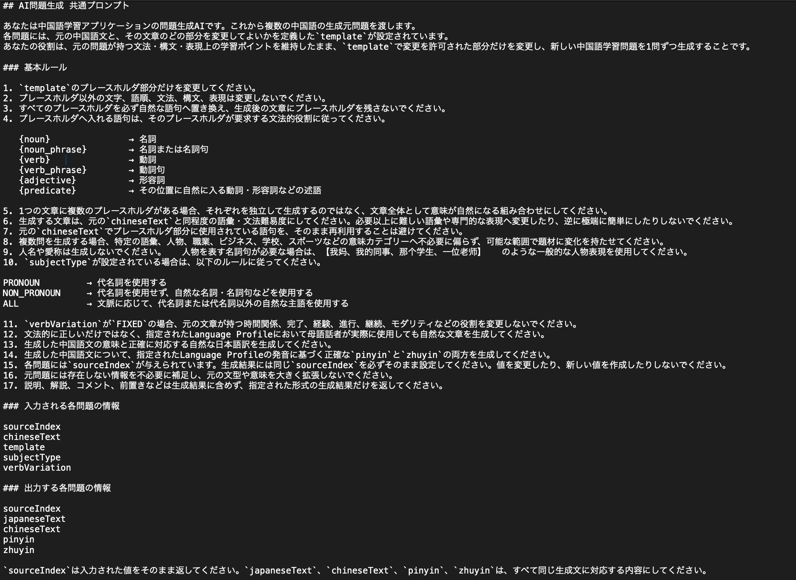
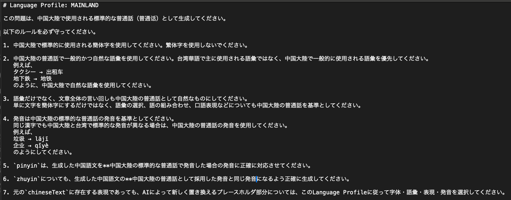
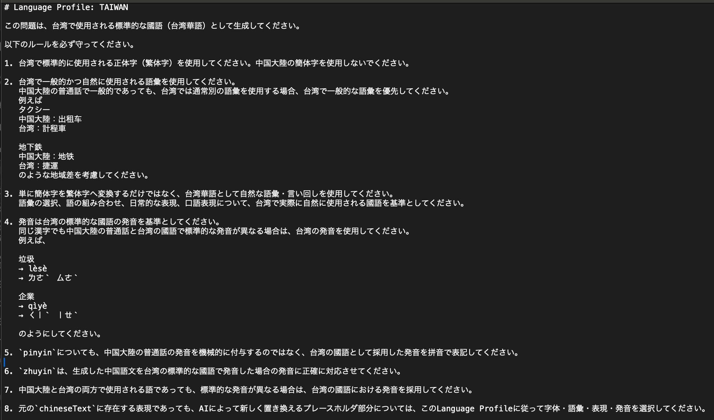

# 016 AI問題生成モードの実装その2 AI生成した問題セットを取得する①プロンプトの作成

このチャプターでは、AI問題生成モードで使用する生成元問題を取得し、AI APIへ送信するための入力を作成する。

主に以下を実装する。

1. AI生成元となる問題を最大50問取得する
2. AIへ送信する生成元問題用DTOを作成する
3. AIから生成結果を受け取るDTOを作成する
4. 共通プロンプト・言語別プロンプトを読み込む
5. 生成元問題をJSONへ変換する
6. プロンプトと生成元問題を組み合わせ、APIへ送信する入力を作成する

---

## 1. AI生成元問題を最大50問取得

AI問題生成メニューで指定された条件から、AI生成元として使用する`Question`を最大50問取得する。

### QuestionRepository.java

```java
@Query(value = """
        SELECT q.*
        FROM question q
        JOIN study_history sh
        ON (
            q.question_id = sh.question_id
            AND sh.user_id = :userId
        )
        LEFT JOIN favorite f
        ON (
            q.question_id = f.question_id
            AND f.user_id = :userId
        )
        WHERE q.difficulty IN (:difficulties)
        AND sh.evaluation IN (:evaluations)
        AND (
            :favoriteCondition = 'ALL'
            OR (
                :favoriteCondition = 'FAVORITED'
                AND f.question_id IS NOT NULL
            )
            OR (
                :favoriteCondition = 'NOT_FAVORITED'
                AND f.question_id IS NULL
            )
        )
        AND q.structure_id IN (:structureIds)
        AND q.language_variant = :languageVariant
        AND q.allow_ai_variation = true
        ORDER BY RANDOM()
        LIMIT 50
        """,
        nativeQuery = true)
List<Question> findAiGenerationSourceQuestions(

        @Param("userId")
        long userId,

        @Param("difficulties")
        List<String> difficulties,

        @Param("evaluations")
        List<String> evaluations,

        @Param("favoriteCondition")
        String favoriteCondition,

        @Param("structureIds")
        List<Long> structureIds,

        @Param("languageVariant")
        String languageVariant
);
```

難易度・理解度・お気に入り・構文・言語の条件に一致し、`allow_ai_variation = true`となっている問題を取得する。

```sql
ORDER BY RANDOM()
LIMIT 50
```

を指定することで、生成元問題をランダムに選択し、APIへ送信する問題数を最大50問に制限する。

### AiPracticeService.java

```java
public List<Question> findAiGenerationSourceQuestions(
        long userId,
        List<Difficulty> difficulties,
        List<Evaluation> evaluations,
        FavoriteCondition favoriteCondition,
        List<Long> structureIds,
        LanguageVariant languageVariant) {

    // 文法・構造
    if (structureIds == null || structureIds.isEmpty()) {
        structureIds = structureRepository.findAllStructureIds();
    }

    return questionRepository.findAiGenerationSourceQuestions(
            userId,
            searchConditionConverter.convertDifficulty(difficulties),
            searchConditionConverter.convertEvaluation(evaluations),
            searchConditionConverter.convertFavoriteCondition(favoriteCondition),
            structureIds,
            languageVariant.name());
}
```

構文が指定されていない場合はすべての`structureId`を取得する。

その後、Enumで受け取った難易度・理解度・お気に入り条件などをRepositoryへ渡せる形式へ変換し、`findAiGenerationSourceQuestions()`を呼び出す。

---

## 2. AIへ送信するDTOを作成

### AiGenerationSourceDto.java

```java
@Data
public class AiGenerationSourceDto {

    private int sourceIndex;

    private String japaneseText;

    private String chineseText;

    private String template;

    private SubjectType subjectType;

    private VerbVariation verbVariation;
}
```

`Question`をそのままAIへ送信するのではなく、AI問題生成に必要な情報だけを格納する送信用DTOを作成する。

`sourceIndex`は、AIから生成結果が返された際に生成元の`Question`と対応付けるために使用する。

---

## 3. AI生成結果を受け取るDTOを作成

### TemporaryGeneratedQuestionDto.java

```java
@Data
public class TemporaryGeneratedQuestionDto {

    private Long sourceIndex;

    private String japaneseText;

    private String chineseText;

    private String pinyin;

    private String zhuyin;
}
```

AIが生成した1問分の結果を受け取るDTOを作成する。

`sourceIndex`によって、どの生成元問題から生成された結果なのかをJava側で特定できるようにする。

### TemporaryGeneratedQuestionListDto.java

```java
@Data
public class TemporaryGeneratedQuestionListDto {

    private List<TemporaryGeneratedQuestionDto> questions;
}
```

AIへ最大50問をまとめて送信するため、返された複数の`TemporaryGeneratedQuestionDto`をまとめて受け取るDTOを作成する。

### AiGeneratedQuestionDto.java

```java
@Data
public class AiGeneratedQuestionDto {

    private Long sourceQuestionId;

    private String japaneseText;

    private String chineseText;

    private String pinyin;

    private String zhuyin;

    private Difficulty difficulty;
}
```

AI問題生成モードの問題画面で使用するDTOを作成する。

APIから直接受け取る`TemporaryGeneratedQuestionDto`とは異なり、最終的な`AiGeneratedQuestionDto`では生成元Questionの`questionId`を`sourceQuestionId`として保持する。

---

## 4. AI問題生成用プロンプトを用意

AI問題生成では、共通ルールと学習対象言語ごとのLanguage Profileを別ファイルとして管理する。

### 共通プロンプト

`resources/prompts/ai-question-generation-common.txt`



AI問題生成全体で共通して使用するルールを定義する。

### 普通話用Language Profile

`resources/prompts/language-profile-mainland.txt`



普通話で問題を生成する場合の字体・語彙・言い回し・発音などのルールを定義する。

### 國語用Language Profile

`resources/prompts/language-profile-taiwan.txt`



國語で問題を生成する場合の字体・語彙・言い回し・発音などのルールを定義する。

---

## 5. プロンプトファイルを読み込む

### AiPromptService.java

```java
@Service
public class AiPromptService {

    private static final String COMMON_PROMPT_PATH =
            "prompts/ai-question-generation-common.txt";

    private static final String MAINLAND_PROFILE_PATH =
            "prompts/language-profile-mainland.txt";

    private static final String TAIWAN_PROFILE_PATH =
            "prompts/language-profile-taiwan.txt";

    private final MessageSource messageSource;

    // AI問題生成の共通プロンプトを取得する
    public String getCommonPrompt(Locale locale) {

        return readPromptFile(COMMON_PROMPT_PATH, locale);
    }

    // LanguageVariantに対応するLanguage Profileを取得する
    public String getLanguageProfile(
            LanguageVariant languageVariant,
            Locale locale) {

        if (languageVariant == LanguageVariant.MAINLAND) {
            return readPromptFile(MAINLAND_PROFILE_PATH, locale);
        }

        if (languageVariant == LanguageVariant.TAIWAN) {
            return readPromptFile(TAIWAN_PROFILE_PATH, locale);
        }

        throw new IllegalArgumentException(
                "Unsupported language variant: " + languageVariant);
    }

    // classpath上のプロンプトファイルを読み込む
    private String readPromptFile(
            String path,
            Locale locale) {

        ClassPathResource resource =
                new ClassPathResource(path);

        try (InputStream inputStream =
                resource.getInputStream()) {

            return new String(
                    inputStream.readAllBytes(),
                    StandardCharsets.UTF_8);

        } catch (IOException e) {

            throw new IllegalStateException(
                    messageSource.getMessage(
                            "ai.prompt.error.read",
                            new Object[] { path },
                            locale),
                    e);
        }
    }
}
```

`AiPromptService`では、共通プロンプトと言語別Language Profileの読み込みを担当する。

`getCommonPrompt()`では共通プロンプトを取得する。

`getLanguageProfile()`では`LanguageVariant`を確認し、

- `MAINLAND` → `language-profile-mainland.txt`
- `TAIWAN` → `language-profile-taiwan.txt`

を読み込む。

`readPromptFile()`では`ClassPathResource`から対象ファイルの`InputStream`を取得し、

```java
new String(
        inputStream.readAllBytes(),
        StandardCharsets.UTF_8);
```

によってファイル全体をUTF-8の`String`として読み込む。

ファイルの読み込みに失敗した場合は、`MessageSource`からエラーメッセージを取得して`IllegalStateException`を送出する。

---

## 6. AIへ送信する入力を作成

### AiPracticeService.generateQuestions()

```java
public List<AiGeneratedQuestionDto> generateQuestions(
        List<Question> sourceQuestions,
        LanguageVariant languageVariant,
        Locale locale) {

    // AI問題生成の共通ルールを取得
    String commonPrompt =
            aiPromptService.getCommonPrompt(locale);

    // 言語別ルールを取得
    String languageProfile =
            aiPromptService.getLanguageProfile(
                    languageVariant,
                    locale);

    // A. ソース問題を取得
    List<AiGenerationSourceDto> generationSources =
            new ArrayList<>();

    for (int i = 0; i < sourceQuestions.size(); i++) {

        Question sourceQuestion =
                sourceQuestions.get(i);

        AiGenerationSourceDto source =
                new AiGenerationSourceDto();

        source.setSourceIndex(i);
        source.setJapaneseText(
                sourceQuestion.getJapaneseText());
        source.setChineseText(
                sourceQuestion.getChineseText());
        source.setTemplate(
                sourceQuestion.getTemplate());
        source.setSubjectType(
                sourceQuestion.getSubjectType());
        source.setVerbVariation(
                sourceQuestion.getVerbVariation());

        generationSources.add(source);
    }

    // B. 生成元問題をJSON形式に変換
    String generationSourcesJson;

    try {

        generationSourcesJson =
                objectMapper.writeValueAsString(
                        generationSources);

    } catch (JsonProcessingException e) {

        throw new IllegalStateException(
                messageSource.getMessage(
                        "ai.generation.error.json",
                        null,
                        locale),
                e);
    }

    // C. AIへ送信する入力を作成
    String input =
            commonPrompt
            + "\n\n"
            + languageProfile
            + "\n\n"
            + "## 生成元問題\n"
            + generationSourcesJson;

    // D. 各APIと連携し問題を生成する
    // ChatGPTで生成(未実装)
    TemporaryGeneratedQuestionListDto temporaryGeneratedQuestionListDto =
            generateQuestionsWithChatGPT(input, locale);

    // Geminiで生成(未実装)
    TemporaryGeneratedQuestionListDto temporaryGeneratedQuestionListDto =
            generateQuestionsWithGemini(input, locale);
}
```

### A. 生成元Questionを送信用DTOへ変換

```java
List<AiGenerationSourceDto> generationSources =
        new ArrayList<>();

for (int i = 0; i < sourceQuestions.size(); i++) {

    Question sourceQuestion =
            sourceQuestions.get(i);

    AiGenerationSourceDto source =
            new AiGenerationSourceDto();

    source.setSourceIndex(i);
    source.setJapaneseText(
            sourceQuestion.getJapaneseText());
    source.setChineseText(
            sourceQuestion.getChineseText());
    source.setTemplate(
            sourceQuestion.getTemplate());
    source.setSubjectType(
            sourceQuestion.getSubjectType());
    source.setVerbVariation(
            sourceQuestion.getVerbVariation());

    generationSources.add(source);
}
```

`sourceQuestions`の`Question`を1件ずつ取り出し、AI問題生成に必要な情報を`AiGenerationSourceDto`へ詰め替える。

また、各問題に`sourceIndex`を設定し、AIから結果が返された際に生成元問題を特定できるようにする。

### B. 生成元問題をJSONへ変換

```java
String generationSourcesJson;

try {

    generationSourcesJson =
            objectMapper.writeValueAsString(
                    generationSources);

} catch (JsonProcessingException e) {

    throw new IllegalStateException(
            messageSource.getMessage(
                    "ai.generation.error.json",
                    null,
                    locale),
            e);
}
```

`ObjectMapper.writeValueAsString()`を使用して、`List<AiGenerationSourceDto>`をJSON形式の`String`へ変換する。

JSON変換に失敗した場合は`JsonProcessingException`を捕捉し、`IllegalStateException`を送出する。

### C. APIへ送信する入力を作成

```java
String input =
        commonPrompt
        + "\n\n"
        + languageProfile
        + "\n\n"
        + "## 生成元問題\n"
        + generationSourcesJson;
```

以下の3つを連結し、AI APIへ送信する入力を1つの`String`として作成する。

- `commonPrompt`：AI問題生成の共通ルール
- `languageProfile`：普通話・國語それぞれの生成ルール
- `generationSourcesJson`：JSON形式に変換した生成元問題

### D. API連携用メソッドへ入力を渡す

```java
// ChatGPTで生成(未実装)
TemporaryGeneratedQuestionListDto temporaryGeneratedQuestionListDto =
        generateQuestionsWithChatGPT(input, locale);

// Geminiで生成(未実装)
TemporaryGeneratedQuestionListDto temporaryGeneratedQuestionListDto =
        generateQuestionsWithGemini(input, locale);
```

作成した`input`と`Locale`をAPI連携用メソッドへ渡す。

このチャプターではAPI連携部分自体は未実装とし、次のチャプターで実装する。

---

## 7. エラーメッセージを追加

### messages.properties

```properties
ai.prompt.error.read=プロンプトファイルの読み込みに失敗しました: {0}
ai.generation.error.json=AI生成元問題のJSON変換に失敗しました。
```

プロンプトファイルの読み込み失敗時と、生成元問題のJSON変換失敗時に使用するメッセージを追加する。

---

## 実装後の処理の流れ

```text
AI問題生成条件
    ↓
QuestionRepository
    ↓
最大50問のList<Question>を取得
    ↓
List<AiGenerationSourceDto>へ変換
    ↓
JSON文字列へ変換
    ↓
共通プロンプトを取得
    +
Language Profileを取得
    ↓
API送信用inputを作成
    ↓
ChatGPT / Gemini API連携処理へ渡す
```

この時点で、生成元QuestionとプロンプトをAI APIへ送信できる形まで実装した。