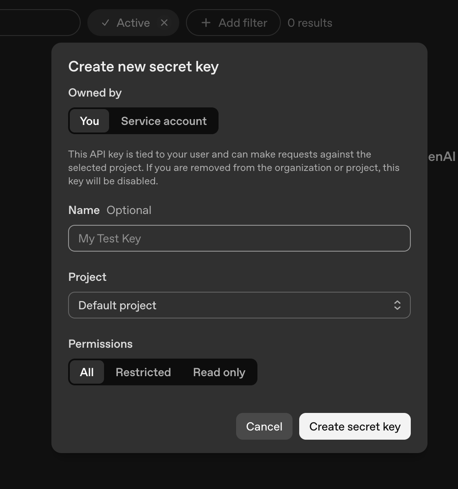
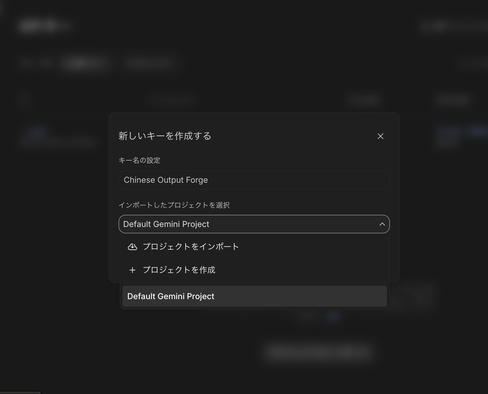
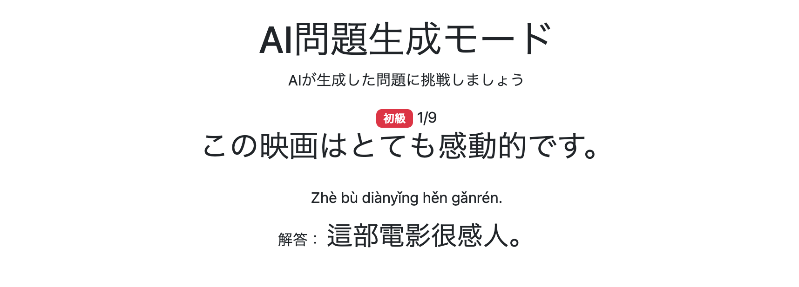

# 018 AI問題生成モードの実装その4 生成問題の画面表示とAPI利用準備

前チャプターまでで、

1. AI生成元となる`sourceQuestions`を取得する
2. 共通プロンプト・Language Profile・生成元問題をAPIへ送信できる`input`へ変換する
3. APIリクエストを作成する
4. ChatGPTまたはGeminiへリクエストを送信する
5. Responseから`TemporaryGeneratedQuestionListDto`を取得する

ところまで実装した。

このチャプターでは、取得したAI生成結果を実際のAI問題生成モードで使用できる形へ変換し、Controller・Sessionを経由して問題画面へ表示する。

さらに、通常学習モードや復習モードと同様に、

- 前後の問題への移動
- 学習の中断
- 中断した学習の再開
- 学習完了
- 学習終了

を実装する。

最後に、OpenAI APIとGemini APIを実際に利用するためのClientをSpring Beanとして登録し、APIキーを設定して、AIによる問題生成から画面表示までの一連の動作を確認する。

---

## 1. AI生成結果を画面表示用DTOへ変換

前チャプターでChatGPTまたはGeminiから取得した生成結果は、

```java
TemporaryGeneratedQuestionListDto
```

として保持されている。

しかし、画面表示では生成された問題文だけでなく、

- 生成元QuestionのID
- 難易度
- AIが生成した日本語文
- AIが生成した中国語文
- 拼音
- 注音

が必要になる。

そのため、`TemporaryGeneratedQuestionListDto`と元の`sourceQuestions`を組み合わせて、

```java
List<AiGeneratedQuestionDto>
```

へ変換する処理を追加した。

### `AiPracticeService.generateQuestions()`

```java
if (useChatGPT) {

    temporaryGeneratedQuestionListDto =
            generateQuestionsWithChatGPT(
                    input,
                    locale);

} else {

    temporaryGeneratedQuestionListDto =
            generateQuestionsWithGemini(
                    input,
                    locale);
}

// 画面表示用DTOへ変換
List<AiGeneratedQuestionDto> generatedQuestions =
        convertToGeneratedQuestions(
                temporaryGeneratedQuestionListDto,
                sourceQuestions);

return generatedQuestions;
```

ChatGPTとGeminiのどちらを使用した場合でも、API固有の処理が終了した時点では、

```java
TemporaryGeneratedQuestionListDto
```

へ統一されている。

そのため、それ以降のDTO変換処理は共通化できる。

---

## 2. `convertToGeneratedQuestions()`の追加

`generateQuestions()`が長くなることを避けるため、画面表示用DTOへの変換処理をprivateメソッドへ分離した。

### `AiPracticeService.java`

```java
private List<AiGeneratedQuestionDto> convertToGeneratedQuestions(
        TemporaryGeneratedQuestionListDto temporaryGeneratedQuestionListDto,
        List<Question> sourceQuestions) {

    // DTOの中から生成された複数の問題を取得
    List<TemporaryGeneratedQuestionDto> temporaryGeneratedQuestionDtos =
            temporaryGeneratedQuestionListDto.getQuestions();

    // 最終的なAI生成問題を格納するListを作成
    List<AiGeneratedQuestionDto> generatedQuestions =
            new ArrayList<>();

    // AIが生成した問題を順番に処理
    for (int i = 0; i < temporaryGeneratedQuestionDtos.size(); i++) {

        TemporaryGeneratedQuestionDto temporaryGeneratedQuestionDto =
                temporaryGeneratedQuestionDtos.get(i);

        // sourceIndexを基に生成元問題を取得
        Question sourceQuestion =
                sourceQuestions.get(
                        temporaryGeneratedQuestionDto.getSourceIndex());

        // 最終的なAI生成問題DTOを作成
        AiGeneratedQuestionDto generatedQuestion =
                new AiGeneratedQuestionDto();

        generatedQuestion.setSourceQuestionId(
                sourceQuestion.getQuestionId());

        generatedQuestion.setJapaneseText(
                temporaryGeneratedQuestionDto.getJapaneseText());

        generatedQuestion.setChineseText(
                temporaryGeneratedQuestionDto.getChineseText());

        generatedQuestion.setPinyin(
                temporaryGeneratedQuestionDto.getPinyin());

        generatedQuestion.setZhuyin(
                temporaryGeneratedQuestionDto.getZhuyin());

        generatedQuestion.setDifficulty(
                sourceQuestion.getDifficulty());

        // Listへ追加
        generatedQuestions.add(generatedQuestion);
    }

    return generatedQuestions;
}
```

このメソッドでは、

```text
TemporaryGeneratedQuestionListDto
        ↓
List<TemporaryGeneratedQuestionDto>
        ↓
sourceIndexから生成元Questionを取得
        ↓
AI生成結果 + 生成元Question
        ↓
AiGeneratedQuestionDto
        ↓
List<AiGeneratedQuestionDto>
```

という変換を行う。

---

## 3. `TemporaryGeneratedQuestionListDto`から生成問題一覧を取得

まず、

```java
List<TemporaryGeneratedQuestionDto> temporaryGeneratedQuestionDtos =
        temporaryGeneratedQuestionListDto.getQuestions();
```

として、APIから取得したDTOの中に格納されている生成問題一覧を取り出す。

APIのStructured Outputsでは`List<TemporaryGeneratedQuestionDto>`を直接受け取るのではなく、

```text
TemporaryGeneratedQuestionListDto
└─ questions
   └─ List<TemporaryGeneratedQuestionDto>
```

という形で受け取っている。

ここで`getQuestions()`を呼び出すことで、実際の生成問題を1問ずつ処理できる状態にする。

続いて、最終的な問題一覧を格納する、

```java
List<AiGeneratedQuestionDto> generatedQuestions =
        new ArrayList<>();
```

を作成する。

---

## 4. `sourceIndex`から生成元Questionを取得

AIが生成した問題を順番に処理する。

```java
for (int i = 0; i < temporaryGeneratedQuestionDtos.size(); i++) {

    TemporaryGeneratedQuestionDto temporaryGeneratedQuestionDto =
            temporaryGeneratedQuestionDtos.get(i);
```

`TemporaryGeneratedQuestionDto`には、前チャプターまでの実装でAIへ渡していた、

```java
sourceIndex
```

が含まれている。

そのため、

```java
Question sourceQuestion =
        sourceQuestions.get(
                temporaryGeneratedQuestionDto.getSourceIndex());
```

として、その生成問題がどの`Question`を元に生成されたのかを特定する。

これにより、

```text
TemporaryGeneratedQuestionDto
        │
        └─ sourceIndex
                ↓
sourceQuestions.get(sourceIndex)
                ↓
        元のQuestion
```

という対応付けを行う。

---

## 5. `AiGeneratedQuestionDto`を作成

生成結果と元の`Question`を組み合わせて、最終的な画面表示用DTOを作成する。

```java
AiGeneratedQuestionDto generatedQuestion =
        new AiGeneratedQuestionDto();

generatedQuestion.setSourceQuestionId(
        sourceQuestion.getQuestionId());

generatedQuestion.setJapaneseText(
        temporaryGeneratedQuestionDto.getJapaneseText());

generatedQuestion.setChineseText(
        temporaryGeneratedQuestionDto.getChineseText());

generatedQuestion.setPinyin(
        temporaryGeneratedQuestionDto.getPinyin());

generatedQuestion.setZhuyin(
        temporaryGeneratedQuestionDto.getZhuyin());

generatedQuestion.setDifficulty(
        sourceQuestion.getDifficulty());
```

各データの取得元は次のようになる。

| データ | 取得元 |
|---|---|
| `sourceQuestionId` | 生成元`Question` |
| `difficulty` | 生成元`Question` |
| `japaneseText` | AI生成結果 |
| `chineseText` | AI生成結果 |
| `pinyin` | AI生成結果 |
| `zhuyin` | AI生成結果 |

作成したDTOは、

```java
generatedQuestions.add(generatedQuestion);
```

としてListへ追加する。

これを生成された問題数だけ繰り返し、最後に、

```java
return generatedQuestions;
```

として`List<AiGeneratedQuestionDto>`を返す。

---

## 6. AI問題生成開始時に生成問題をSessionへ保存

`AiPracticeController`の`/ai-practice/start`で、生成元問題を取得した後にAI問題生成を実行する。

### `AiPracticeController.java`

```java
@GetMapping("/ai-practice/start")
public String getAiPracticeStart(
         HttpSession session,
         @AuthenticationPrincipal UserDetails loginUser,
         @RequestParam(name = "evaluations", required = false)
                List<Evaluation> evaluations,
         @RequestParam(name = "difficulties", required = false)
                List<Difficulty> difficulties,
         @RequestParam(name = "favoriteCondition", required = false)
                FavoriteCondition favoriteCondition,
         @RequestParam(name = "structureIds", required = false)
                List<Long> structureIds,
         Locale locale) {

    // 既存の学習状態を破棄
    clearAiPracticeSession(session);

    // 学習対象言語を取得
    LanguageVariant languageVariant =
            (LanguageVariant) session.getAttribute("languageVariant");

    // 未設定の場合は普通話
    if (languageVariant == null) {
        languageVariant = LanguageVariant.MAINLAND;
    }

    // 先に宣言
    List<Question> sourceQuestions;

    // user_id(文字列)からUsersを取得
    Users user = getLoginUser(loginUser);
    Long userId = user.getId();

    // 新しい問題セットを作成
    sourceQuestions = aiPracticeService.getQuestion(
            userId,
            difficulties,
            evaluations,
            favoriteCondition,
            structureIds,
            languageVariant);

    // 問題が1件もない場合は開始しない
    if (sourceQuestions.isEmpty()) {
        return "redirect:/ai-practice/menu";
    }

    // AIで問題を生成
    List<AiGeneratedQuestionDto> aiPracticeQuestions;

    aiPracticeQuestions = aiPracticeService.generateQuestions(
            sourceQuestions,
            languageVariant,
            locale);

    session.setAttribute(
            "aiPracticeQuestions",
            aiPracticeQuestions);

    session.setAttribute(
            "aiPracticeQuestionsCurrentPage",
            0);

    return "redirect:/ai-practice/question?page=0";
}
```

生成した問題一覧は、

```java
session.setAttribute(
        "aiPracticeQuestions",
        aiPracticeQuestions);
```

としてSessionへ保存する。

また、開始時のページを、

```java
session.setAttribute(
        "aiPracticeQuestionsCurrentPage",
        0);
```

として保存する。

その後、

```java
return "redirect:/ai-practice/question?page=0";
```

として1問目へ遷移する。

---

## 7. AI生成問題の問題画面を表示

AI生成問題を表示する、

```text
/ai-practice/question
```

を実装した。

### `AiPracticeController.java`

```java
@GetMapping("/ai-practice/question")
public String getAiPracticeQuestion(
        Model model,
        HttpSession session,
        @RequestParam(defaultValue = "0") int page,
        @AuthenticationPrincipal UserDetails loginUser) {

    // Sessionからquestions取得
    List<AiGeneratedQuestionDto> questions =
            (List<AiGeneratedQuestionDto>) session.getAttribute(
                    "aiPracticeQuestions");

    // /questionへの直接アクセスを禁ずる
    if (questions == null) {
        return "redirect:/ai-practice/menu";
    }

    // 範囲外のページへのアクセスを禁ずる
    if (page < 0 || page >= questions.size()) {
        return "redirect:/ai-practice/menu";
    }

    // 現在表示する問題を取得
    AiGeneratedQuestionDto question = questions.get(page);

    // 現在ページをSessionへ保存
    session.setAttribute(
            "aiPracticeQuestionsCurrentPage",
            page);

    // HTMLが必要な情報をModelへ格納
    questionModelUtil.setAiQuestionModel(
            model,
            questions,
            page,
            session
    );

//    // お気に入り判定
//    if (loginUser != null) {
//        boolean isFavorite = favoriteService.isFavorite(
//                getLoginUser(loginUser),
//                question.sourceQuestionId()
//        );
//
//        model.addAttribute("isFavorite", isFavorite);
//    }

    return "ai-practice/question";
}
```

Sessionから、

```java
List<AiGeneratedQuestionDto>
```

を取得し、`page`に対応する問題を表示する。

Sessionに問題一覧が存在しない場合や、指定された`page`が範囲外の場合はAI問題生成メニューへ戻す。

また、現在表示しているページを、

```java
session.setAttribute(
        "aiPracticeQuestionsCurrentPage",
        page);
```

として保存する。

---

## 8. 現時点では理解度・お気に入り機能を使用しない

通常学習モードや復習モードでは、問題に対して理解度やお気に入りを登録できる。

しかし、AI問題生成モードでこの時点に表示している、

```java
AiGeneratedQuestionDto
```

は、まだ`question`テーブルへ保存されていない。

理解度やお気に入りは`Question`の`questionId`に依存するため、未保存のAI生成問題にはそのまま利用できない。

そのため、現時点ではお気に入り判定処理をコメントアウトしている。

```java
//    // お気に入り判定
//    if (loginUser != null) {
//        boolean isFavorite = favoriteService.isFavorite(
//                getLoginUser(loginUser),
//                question.sourceQuestionId()
//        );
//
//        model.addAttribute("isFavorite", isFavorite);
//    }
```

AI生成問題を`question`テーブルへ保存する機能を実装した後に、理解度・お気に入り機能を追加する。

---

## 9. `QuestionModelUtil`にAI生成問題用Model設定を追加

AI生成問題画面に必要なデータをModelへ格納するため、

```java
setAiQuestionModel()
```

を追加した。

### `QuestionModelUtil.java`

```java
public void setAiQuestionModel(
        Model model,
        List<AiGeneratedQuestionDto> questions,
        int page,
        HttpSession session) {

    AiGeneratedQuestionDto question = questions.get(page);

    model.addAttribute("question", question);
    model.addAttribute("nextPageIndex", page + 1);
    model.addAttribute("totalPages", questions.size());
    model.addAttribute("hasPrevious", page > 0);
    model.addAttribute("hasNext", page < questions.size() - 1);

    // 表示する発音記号を決定
    PronunciationType pronunciationType =
            (PronunciationType) session.getAttribute(
                    "pronunciationType");

    if (pronunciationType == null) {
        pronunciationType = PronunciationType.PINYIN;
    }

    switch (pronunciationType) {

    case PINYIN -> {
        model.addAttribute(
                "pronunciation",
                question.getPinyin()
        );
    }

    case ZHUYIN -> {
        model.addAttribute(
                "pronunciation",
                question.getZhuyin()
        );
    }

    case NONE -> {
        model.addAttribute(
                "pronunciation",
                null
        );
    }

    }
}
```

ここでは、

```java
model.addAttribute("question", question);
```

で現在の問題、

```java
model.addAttribute("nextPageIndex", page + 1);
model.addAttribute("totalPages", questions.size());
model.addAttribute("hasPrevious", page > 0);
model.addAttribute("hasNext", page < questions.size() - 1);
```

で問題番号と前後移動に必要な情報を設定する。

また、Sessionの`pronunciationType`に応じて、

- `PINYIN` → 拼音
- `ZHUYIN` → 注音
- `NONE` → 非表示

を切り替える。

---

## 10. AI生成問題画面を作成

AIが生成した問題を表示する、

```text
/ai-practice/question.html
```

を作成した。

### `/ai-practice/question.html`

```html
<!DOCTYPE html>

<html xmlns:th="http://www.thymeleaf.org"
      xmlns:layout="http://www.ultraq.net.nz/thymeleaf/layout"
      layout:decorate="~{layout/layout}">

<head>

    <meta charset="UTF-8">

    <title th:text="#{aiPractice.question.pageTitle}">
        Chinese Output Forge
    </title>

    <link rel="stylesheet"
          th:href="@{/webjars/bootstrap/css/bootstrap.min.css}">

    <script th:src="@{/js/practice.js}" defer></script>

</head>

<body>

<div layout:fragment="content" class="text-center">

    <!-- タイトル -->
    <h1 th:text="#{aiPractice.question.title}">
        AI問題生成モード
    </h1>

    <p th:text="#{aiPractice.question.message}">
        AIが生成した問題に挑戦しましょう
    </p>

    <div class="mt-3">

        <!-- 問題の難易度 -->
        <span class="badge"
              th:classappend="${question.difficulty.name() == 'BEGINNER'} ? 'bg-danger' :
                              (${question.difficulty.name() == 'INTERMEDIATE'} ? 'bg-primary' : 'bg-success')"
              th:text="${question.difficulty.name() == 'BEGINNER'} ? #{difficulty.beginner} :
                       (${question.difficulty.name() == 'INTERMEDIATE'} ? #{difficulty.intermediate} : #{difficulty.advanced})">
            難易度
        </span>

        <!-- 現在の問題番号 -->
        <span th:text="${nextPageIndex + '/' + totalPages}">
            1/10
        </span>

        <!-- 日本語問題 -->
        <div class="d-flex justify-content-center align-items-center gap-3">

            <h2 class="mb-0"
                th:text="${question.japaneseText}">
                日本語問題
            </h2>

        </div>

        <!-- 解答 -->
        <div class="mt-4"
             style="min-height:150px;">

            <button id="answerButton"
                    type="button"
                    class="btn btn-primary"
                    onclick="showAnswer()"
                    th:text="#{aiPractice.question.showAnswer}">
                解答を見る
            </button>

            <div id="answerArea"
                 style="display:none;">

                <!-- 発音 -->
                <p class="mb-2"
                   th:if="${pronunciation != null}">

                    <span th:text="${pronunciation}">
                        Pronunciation
                    </span>

                </p>

                <!-- 解答 -->
                <p class="mb-2">

                    <span th:text="#{aiPractice.question.answer}">
                        解答：
                    </span>

                    <span class="fs-3"
                          th:text="${question.chineseText}">
                        Chinese Answer
                    </span>

                </p>

            </div>

        </div>

    </div>

    <!-- ============================= -->
    <!-- 前へ・次へ -->
    <!-- ============================= -->

    <div class="mb-5 d-flex justify-content-center gap-4"
         style="margin-top:60px;">

        <!-- 前の問題 -->
        <a th:if="${hasPrevious}"
           th:href="@{/ai-practice/question(page=${nextPageIndex - 2})}"
           class="btn btn-outline-primary"
           th:text="#{aiPractice.question.previous}">
            前の問題へ
        </a>

        <!-- 次の問題 -->
        <a th:if="${hasNext}"
           th:href="@{/ai-practice/question(page=${nextPageIndex})}"
           class="btn btn-outline-primary"
           th:text="#{aiPractice.question.next}">
            次の問題へ
        </a>

        <!-- 完了 -->
        <a th:if="${!hasNext}"
           th:href="@{/ai-practice/complete}"
           class="btn btn-info"
           th:text="#{aiPractice.question.complete}">
            完了
        </a>

    </div>

    <!-- ============================= -->
    <!-- 学習中断・終了 -->
    <!-- ============================= -->

    <div class="d-flex justify-content-center gap-3"
         style="margin-top:40px;">

        <!-- 中断 -->
        <a th:href="@{/ai-practice/suspend(page=${nextPageIndex - 1})}"
           th:attr="onclick=|return confirm('#{aiPractice.question.suspend.confirm}');|"
           class="btn btn-outline-danger btn-sm"
           style="width:100px;"
           th:text="#{aiPractice.question.suspend}">
            中断する
        </a>

        <!-- 終了 -->
        <a th:href="@{/ai-practice/quit}"
           th:attr="onclick=|return confirm('#{aiPractice.question.quit.confirm}');|"
           class="btn btn-outline-danger btn-sm"
           style="width:100px;"
           th:text="#{aiPractice.question.quit}">
            やめる
        </a>

    </div>

</div>

</body>

</html>
```

問題画面では、

- 難易度
- 現在の問題番号
- AIが生成した日本語問題
- 中国語解答
- 発音記号
- 前の問題
- 次の問題
- 完了
- 中断
- 終了

を表示する。

---

## 11. AI生成問題画面のメッセージを追加

問題画面で使用するメッセージを`messages.properties`へ追加した。

### `messages.properties`

```properties
# AI問題生成モード 問題画面
aiPractice.question.pageTitle=AI問題生成モード | Chinese Output Forge
aiPractice.question.title=AI問題生成モード
aiPractice.question.message=AIが生成した問題に挑戦しましょう
aiPractice.question.showAnswer=解答を見る
aiPractice.question.answer=解答：
aiPractice.question.previous=前の問題へ
aiPractice.question.next=次の問題へ
aiPractice.question.complete=完了
aiPractice.question.suspend=中断する
aiPractice.question.suspend.confirm=学習を中断しますか？
aiPractice.question.quit=やめる
aiPractice.question.quit.confirm=AI問題生成モードを終了しますか？
```

---

## 12. AI問題生成モードの中断・再開を実装

通常学習モードや復習モードと同様に、Sessionを使用してAI問題生成モードの中断・再開を実装した。

### AI問題生成メニュー

```java
@GetMapping("/ai-practice/menu")
public String getAiPracticeMenu(
        HttpSession session,
        Model model) {

    // 言語切替後の戻り先
    model.addAttribute(
            "languageVariantRedirect",
            "/ai-practice/menu");

    // セッションから情報を取得
    List<AiGeneratedQuestionDto> questions =
            (List<AiGeneratedQuestionDto>) session.getAttribute(
                    "aiPracticeQuestions");

    Integer currentPage =
            (Integer) session.getAttribute(
                    "aiPracticeQuestionsCurrentPage");

    // 中断したデータがあるか判定
    boolean canResume =
            questions != null && currentPage != null;

    // 中断したデータ情報を返す
    model.addAttribute("canResume", canResume);

    if (canResume) {
        model.addAttribute("currentPage", currentPage);
        model.addAttribute("totalCount", questions.size());
    }

    // 画面表示用structureを取得
    model.addAttribute(
            "structures",
            reviewService.findStructures());

    return "/ai-practice/menu";
}
```

Sessionに、

```java
aiPracticeQuestions
aiPracticeQuestionsCurrentPage
```

が存在する場合は、中断したAI問題生成モードを再開できる状態とする。

---

## 13. 中断したAI問題生成モードを再開

```java
@GetMapping("/ai-practice/resume")
public String getAiPracticeResume(
        Model model,
        HttpSession session) {

    // 中断していないならmenuに戻す
    if (session.getAttribute("aiPracticeQuestions") == null) {
        return "redirect:/ai-practice/menu";
    }

    // 中断時のページ情報を取得
    Integer page =
            (Integer) session.getAttribute(
                    "aiPracticeQuestionsCurrentPage");

    return "redirect:/ai-practice/question?page=" + page;
}
```

Sessionから中断時のページを取得し、そのページへリダイレクトする。

---

## 14. AI問題生成モードの中断処理を実装

```java
@GetMapping("/ai-practice/suspend")
public String getAiPracticeSuspend(
        @RequestParam int page,
        HttpSession session) {

    log.info("getAiPracticeSuspend reached");

    session.setAttribute(
            "aiPracticeQuestionsCurrentPage",
            page);

    return "redirect:/";
}
```

中断時には問題一覧を削除せず、現在のページだけをSessionへ保存してトップページへ戻る。

これにより、後から`/ai-practice/resume`を利用して同じ問題セットを再開できる。

---

## 15. AI問題生成モードの完了・終了処理を実装

### 完了

```java
@GetMapping("/ai-practice/complete")
public String getAiPracticeComplete(
        HttpSession session) {

    clearAiPracticeSession(session);

    return "redirect:/complete";
}
```

### 終了

```java
@GetMapping("/ai-practice/quit")
public String getAiPracticeQuit(
        HttpSession session) {

    clearAiPracticeSession(session);

    return "redirect:/";
}
```

完了または終了した場合は、AI問題生成モードのSession情報を削除する。

---

## 16. AI問題生成モードのSession削除処理を共通化

Session情報の削除を、

```java
clearAiPracticeSession()
```

へまとめた。

```java
private void clearAiPracticeSession(
        HttpSession session) {

    session.removeAttribute(
            "aiPracticeQuestions");

    session.removeAttribute(
            "aiPracticeQuestionsCurrentPage");
}
```

新しいAI問題生成を開始するとき、完了したとき、終了したときにこのメソッドを使用する。

---

## 17. ログインユーザー取得処理を共通化

`UserDetails`からアプリケーションの`Users`を取得する処理を、

```java
getLoginUser()
```

へまとめた。

```java
private Users getLoginUser(
        UserDetails loginUser) {

    return userAccountService.getUserOne(
            loginUser.getUsername());
}
```

AI生成元問題の件数取得や問題生成開始時に使用する。

---

## 18. `OpenAIClient`をSpring Beanとして登録

ここまで`AiPracticeService`では、

```java
private final OpenAIClient openAIClient;
```

として`OpenAIClient`をDIする構造にしていた。

しかし、`OpenAIClient`のBean自体はまだ登録していなかったため、OpenAI APIを実際に利用できるよう設定クラスを追加した。

### `OpenAiConfig.java`

```java
@Configuration
public class OpenAiConfig {

    @Bean
    OpenAIClient openAIClient() {
        return OpenAIOkHttpClient.fromEnv();
    }
}
```

```java
OpenAIOkHttpClient.fromEnv()
```

によって環境変数からOpenAI APIの接続情報を取得し、`OpenAIClient`を生成する。

`@Bean`によってSpring管理のBeanとして登録することで、`AiPracticeService`の、

```java
private final OpenAIClient openAIClient;
```

へDIできるようにした。

---

## 19. OpenAI APIキーを環境変数へ設定

OpenAI APIを利用するため、APIキーを取得し、Eclipseの実行構成から環境変数へ設定した。

```text
Name:
OPENAI_API_KEY

Value:
取得したOpenAI APIキー
```

`OPENAI_API_KEY`はOpenAI Java SDKが標準で参照する環境変数名である。

APIキーをソースコードへ直接記述せず、実行環境の環境変数から取得する構成とした。

APIキー作成時の設定画面は以下のとおり。



---

## 20. Gemini ClientのDIエラーへの対応

OpenAI APIを使用する設定でSpring Bootを起動したところ、

```text
required a bean of type 'com.google.genai.Client'
```

というエラーが発生した。

`AiPracticeService`では、

```java
private final Client geminiClient;
```

もDI対象としている。

そのため、

```java
boolean useChatGPT = true;
```

として実際の問題生成ではGeminiを使用しない状態でも、Springが`AiPracticeService`を生成する時点で`geminiClient`のBeanが必要になる。

そこで、GeminiのClientもSpring Beanとして登録した。

### `GeminiConfig.java`

```java
@Configuration
public class GeminiConfig {

    @Bean
    Client geminiClient() {
        return new Client();
    }
}
```

これにより、`AiPracticeService`の、

```java
private final Client geminiClient;
```

へGemini ClientをDIできるようにした。

---

## 21. Gemini APIキーを環境変数へ設定

Gemini ClientをBeanとして登録した状態で起動すると、

```text
API key must either be provided or set in the environment variable GOOGLE_API_KEY or GEMINI_API_KEY.
```

というエラーが発生した。

```java
@Bean
Client geminiClient() {
    return new Client();
}
```

によってClientを生成する時点でGemini APIキーが必要になるため、Google AI StudioでGemini APIキーを取得した。

APIキー作成画面では、

- キー名
- Project

を指定してAPIキーを作成した。



取得したAPIキーは、OpenAIと同様にEclipseの実行構成から環境変数へ設定した。

```text
Name:
GEMINI_API_KEY

Value:
取得したGemini APIキー
```

これにより、Gemini ClientのBeanも正常に生成できるようになった。

---

## 22. AI問題生成から問題画面表示までの動作確認

OpenAIとGeminiのClientをBean登録し、必要なAPIキーを環境変数へ設定した後、AI問題生成モードを実行した。

```text
/ai-practice/start
        ↓
生成元Questionを取得
        ↓
AI APIへinputを送信
        ↓
TemporaryGeneratedQuestionListDto
        ↓
List<AiGeneratedQuestionDto>
        ↓
Session
        ↓
/ai-practice/question
```

という一連の処理が正常に動作し、

```text
http://localhost:8080/ai-practice/question
```

でAIが生成した問題を表示できることを確認した。



今回の確認では、

```text
言語：國語
難易度：初級
```

のみを抽出した。

生成元問題は9件であり、例えば、

```text
生成元：
這部電影很好看。
この映画はとても面白いです。

生成後：
這部電影很感人。
この映画はとても感動的です。
```

```text
生成元：
請問，洗手間在哪裡？
すみません、お手洗いはどこですか？

生成後：
請問，服務台在哪裡？
すみません、サービスカウンターはどこですか？
```

```text
生成元：
我把手機忘在家裡了。
携帯電話を家に忘れました。

生成後：
我媽把鑰匙忘在車上了。
母は鍵を車の中に忘れました。
```

```text
生成元：
我們搭計程車去車站吧。
駅までタクシーで行こう。

生成後：
我們搭公車去夜市吧。
私たちはバスで夜市に行こう。
```

のように、生成元問題の構造を保ちながら内容が変更されていることを確認した。

---

## 23. このチャプターで実装した処理の流れ

このチャプターまでで、AI問題生成モードは、

```text
生成条件を指定
        ↓
生成元Questionを取得
        ↓
AIへ送信するinputを作成
        ↓
ChatGPT / Gemini API
        ↓
TemporaryGeneratedQuestionListDto
        ↓
List<TemporaryGeneratedQuestionDto>
        ↓
sourceIndexから生成元Questionを取得
        ↓
List<AiGeneratedQuestionDto>
        ↓
Controller
        ↓
Sessionへ保存
        ↓
/ai-practice/question
        ↓
AI生成問題を画面表示
        ↓
前後移動 / 中断 / 再開 / 完了 / 終了
```

という一連の処理が動作するようになった。

また、APIを実際に利用するため、

```text
OpenAIClient
        ↓
OpenAiConfigでBean登録
        ↓
OPENAI_API_KEY

Gemini Client
        ↓
GeminiConfigでBean登録
        ↓
GEMINI_API_KEY
```

という実行環境も整備した。

これにより、AI生成元問題の抽出からAPIによる問題生成、DTOへの変換、Sessionへの保存、問題画面への表示までを実際に動作確認できる状態になった。

問題画面のUIやAI生成結果の多様性などについては、次チャプターで見直し・改善を行う。