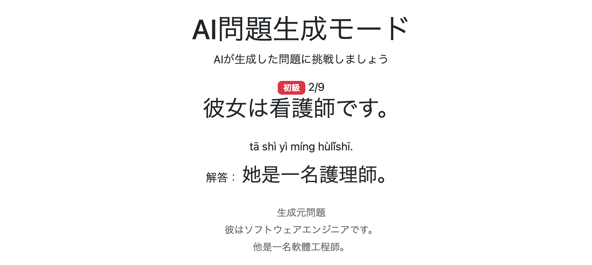

# 019 AI問題生成モードの実装その5 AI生成処理の改善

前チャプターまでで、生成元問題をAIへ送り、生成された問題を`AiGeneratedQuestionDto`へ変換して問題画面へ表示できるようになった。

このチャプターでは、実際にAI問題生成モードを動作させたことで確認できた問題について見直し・改善を行う。

主な改善内容は以下のとおり。

1. AI生成問題と生成元問題を比較できるようにする
2. AI生成結果の偏りを改善する
3. AI問題生成完了までの待機時間を短縮する

---

# 1. AI生成問題と生成元問題を比較できるようにする

AI生成問題だけを表示している状態では、生成元の問題からどのように内容が変更されたのか確認しにくい。

そこで、問題画面から生成元問題も確認できるようにする。

## 1-1. `AiGeneratedQuestionDto`に生成元問題を追加

問題画面へ生成元問題を渡せるよう、`AiGeneratedQuestionDto`に生成元の日本語文と中国語文を追加する。

```java
private String sourceJapaneseText;

private String sourceChineseText;
```

これにより、画面表示用DTOでAI生成問題と生成元問題の両方を保持できるようになった。

## 1-2. `AiPracticeService.convertToGeneratedQuestions()`で生成元問題を設定

`convertToGeneratedQuestions()`では、`sourceIndex`から生成元の`Question`を取得している。

そのため、取得した`sourceQuestion`から日本語文と中国語文を取得し、`AiGeneratedQuestionDto`へ設定する。

```java
generatedQuestion.setSourceJapaneseText(
        sourceQuestion.getJapaneseText());

generatedQuestion.setSourceChineseText(
        sourceQuestion.getChineseText());
```

これによって、

```text
AI生成後の日本語文
AI生成後の中国語文
生成元の日本語文
生成元の中国語文
```

を1つの`AiGeneratedQuestionDto`で画面へ渡せるようになった。

## 1-3. 問題画面へ生成元問題を表示

`/ai-practice/question.html`の解答表示部分へ生成元問題を追加する。

```html
<!-- 生成元問題 -->
<div class="mt-4 text-muted small">

    <p class="mb-1"
       th:text="#{aiPractice.question.sourceQuestion}">
        生成元問題
    </p>

    <p class="mb-1"
       th:text="${question.sourceJapaneseText}">
        生成元の日本語
    </p>

    <p class="mb-0"
       th:text="${question.sourceChineseText}">
        生成元の中国語
    </p>

</div>
```

生成元問題も`answerArea`内へ配置し、「解答を見る」を押した後にAI生成問題の解答と一緒に表示する。

`messages.properties`にも以下を追加する。

```properties
aiPractice.question.sourceQuestion=生成元問題
```

### 実行・確認

AI生成問題の解答と、その生成元になった問題を同じ画面上で確認できるようになった。



これによって、AIが元問題の文法構造を維持しながら適切に内容を変更できているかを画面上から比較できるようになった。

## 1-4. 生成元問題の表示順を修正

実際の画面を確認すると、生成元問題については中国語文を先に表示し、その下に日本語文を表示した方が比較しやすかった。

そこで表示順を変更する。

```html
<p class="mb-0"
   th:text="${question.sourceChineseText}">
    生成元の中国語
</p>

<p class="mb-1"
   th:text="${question.sourceJapaneseText}">
    生成元の日本語
</p>
```

### 実行・確認

生成された中国語文と生成元の中国語文を比較しやすい表示になった。


---

# 2. AI生成結果の偏りを改善する

生成元問題を表示できるようになったため、同じ条件で複数回AI問題を生成して生成結果を比較した。

その結果、一部の問題について同じ語彙・表現が繰り返し生成されることが分かった。

例えば、

```text
這部電影很好看。
```

から、

```text
這部電影很感人。
```

が繰り返し生成されたり、

```text
他是一名軟體工程師。
```

から、

```text
她是一名護理師。
```

が繰り返し生成されることがあった。

一方で、自然な中国語を生成するために選択肢自体が限られる問題もある。

そのため、

```text
文章の自然さ・正確さ
>
生成結果の多様性
```

を維持しながら、同じ問題への偏りを減らしていく。

## 2-1. 共通プロンプトへ生成結果の多様性に関するルールを追加

まず、AIへ渡している共通プロンプトへ、生成語彙の多様性に関するルールを追加した。

主な内容は以下のとおり。

```text
プレースホルダへ入れる語句は、
テンプレートの制約を満たす範囲で幅広い候補から選択する。

毎回、典型的で最も予測しやすい同じ語句や
語句の組み合わせを選ぶことを避ける。

ただし、自然な中国語を生成するために
選択肢が限られる場合は、
多様性より文章の自然さと正確さを優先する。

多様性を確保するためだけに
不自然な表現を使用しない。
```

### 実行・確認

修正後に複数回生成したところ、生成語彙には一定の変化が見られた。

一方で、

```text
元問題で使用されていた語彙を必ず変更する
```

という制約が強すぎる問題では、自然な候補が少なくなり、生成できる文章の範囲を狭めてしまうケースがあった。

そこで、元問題の語彙を再利用しても問題ない箇所を明示できる仕組みを追加する。

## 2-2. `_reusable`プレースホルダを追加

元の語句を再利用してもよい箇所を表すため、`_reusable`プレースホルダを追加した。

```text
{subject_reusable}
{noun_reusable}
{noun_phrase_reusable}
{verb_reusable}
{verb_phrase_reusable}
{adjective_reusable}
{predicate_reusable}
```

`_reusable`は、

```text
元問題の対応する語句を必ず再利用する
```

という意味ではなく、

```text
元問題の対応する語句を再利用してもよい
```

ことを表す。

共通プロンプトでも、`_reusable`について元問題の語彙を一定の割合で再利用できるようルールを追加した。

## 2-3. 一部のtemplateへ`_reusable`を設定

元問題の語彙を再利用しても学習内容に影響しない問題について、templateを修正した。

例えば、

```text
我們搭{noun_reusable}去{noun}吧。
```

```text
{subject_reusable}把{noun}忘在{noun}了。
```

```text
{subject_reusable}搭{noun}去{noun}。
```

```text
週末我要跟{noun_reusable}去{verb_phrase}。
```

```text
{subject_reusable}騎{noun_reusable}去{noun}了。
```

```text
{subject_reusable}是一名{noun}。
```

のように変更した。

### 実行・確認

修正後に同じ生成元問題から複数回生成した。

`_reusable`を設定した箇所では、元問題の語彙を適度に残せるようになり、すべての語彙を無理に変更することで不自然になる問題を抑えられた。

一方で、AIが新しく選択する語彙自体には依然として偏りがあり、同じ生成元問題から似た内容が繰り返し生成されるケースは残った。

そこで、1回につき1候補だけ生成させるのではなく、複数候補を生成してその中から使用する問題を選ぶ方式を試す。

## 2-4. 1つの生成元問題から3候補を生成する方式を導入

1つの生成元問題につき3候補をAIに生成させ、その中からJava側で1問をランダムに採用する方式へ変更する。

`TemporaryGeneratedQuestionDto`へ候補番号を追加する。

```java
private int candidateIndex;
```

同じ`sourceIndex`について、

```text
candidateIndex = 0
candidateIndex = 1
candidateIndex = 2
```

の3候補を生成する。

## 2-5. 共通プロンプトを3候補生成へ変更

共通プロンプトを、

```text
各生成元問題について1問生成
```

から、

```text
各生成元問題について3候補生成
```

へ変更した。

出力項目にも`candidateIndex`を追加する。

```text
sourceIndex
candidateIndex
japaneseText
chineseText
pinyin
zhuyin
```

同一`sourceIndex`について、

```text
candidateIndex = 0
candidateIndex = 1
candidateIndex = 2
```

をそれぞれ1件ずつ返すよう指定する。

## 2-6. 3候補から1問をランダムに選択

`AiPracticeService.convertToGeneratedQuestions()`を3候補方式へ対応させる。

```java
Random random = new Random();

for (int sourceIndex = 0;
        sourceIndex < sourceQuestions.size();
        sourceIndex++) {

    int randomIndex = random.nextInt(3);

    for (int i = 0;
            i < temporaryGeneratedQuestionDtos.size();
            i++) {

        TemporaryGeneratedQuestionDto temporaryGeneratedQuestionDto =
                temporaryGeneratedQuestionDtos.get(i);

        if (temporaryGeneratedQuestionDto.getSourceIndex() == sourceIndex
                && temporaryGeneratedQuestionDto.getCandidateIndex() == randomIndex) {

            Question sourceQuestion =
                    sourceQuestions.get(
                            temporaryGeneratedQuestionDto.getSourceIndex());

            AiGeneratedQuestionDto generatedQuestion =
                    new AiGeneratedQuestionDto();

            generatedQuestion.setSourceQuestionId(
                    sourceQuestion.getQuestionId());

            generatedQuestion.setSourceJapaneseText(
                    sourceQuestion.getJapaneseText());

            generatedQuestion.setSourceChineseText(
                    sourceQuestion.getChineseText());

            generatedQuestion.setJapaneseText(
                    temporaryGeneratedQuestionDto.getJapaneseText());

            generatedQuestion.setChineseText(
                    temporaryGeneratedQuestionDto.getChineseText());

            generatedQuestion.setPinyin(
                    temporaryGeneratedQuestionDto.getPinyin());

            generatedQuestion.setZhuyin(
                    temporaryGeneratedQuestionDto.getZhuyin());

            generatedQuestion.setDifficulty(
                    sourceQuestion.getDifficulty());

            generatedQuestions.add(generatedQuestion);

            break;
        }
    }
}
```

まず、

```java
int randomIndex = random.nextInt(3);
```

で`0～2`の候補番号を決定する。

その後、

```java
sourceIndex
candidateIndex
```

の両方が一致する生成結果を探して`AiGeneratedQuestionDto`へ変換する。

## 2-7. GeminiのSchemaへ`candidateIndex`を追加

GeminiではStructured OutputsのSchemaをJava側で定義しているため、`candidateIndex`も追加する。

```java
"candidateIndex",
Schema.builder()
        .type(Type.Known.INTEGER)
        .build(),
```

`required`にも追加する。

```java
.required(List.of(
        "sourceIndex",
        "candidateIndex",
        "japaneseText",
        "chineseText",
        "pinyin",
        "zhuyin"))
```

### 実行・確認

3候補方式で複数回生成したところ、1候補だけを生成していた場合と比較して、表示される問題のバリエーションは増加した。

一方、一部の問題では生成された3候補自体が似た内容になるケースがあった。

生成結果を確認すると、AIの選択傾向だけでなく、

```text
templateの固定部分によって
自然に生成できる語彙が限定されている
```

問題があることが分かった。

そこで、次にtemplate自体を見直す。

## 2-8. templateによって生成候補が限定される問題を修正

例えば、

```text
隨著{noun}越來越{adjective}，
{noun}也需要採取更有{adjective}的因應方式。
```

では、

```text
採取更有{adjective}的因應方式
```

という固定部分によって、使用できる形容詞が限定されていた。

そこで、

```text
隨著{noun}越來越{adjective}，
{noun}也需要採取更{adjective}的因應方式。
```

のようにtemplateを修正し、自然に生成できる候補を増やした。

## 2-9. `{classifier}`プレースホルダを追加

以下のような問題でも、固定された量詞によって生成可能な名詞が限定されていた。

```text
這個{noun}多少錢？
```

そこで、量詞自体を変更できる、

```text
{classifier}
```

を追加した。

templateを、

```text
這個{noun}多少錢？
```

から、

```text
這{classifier}{noun}多少錢？
```

のように変更する。

共通プロンプトにも、

```text
{classifier}
→ 量詞
```

を追加する。

さらに、

```text
{classifier}と{noun}が連続している場合は、
それぞれを独立して選択するのではなく、
量詞と名詞の組み合わせとして自然になるように生成する
```

というルールを追加した。

### 実行・確認

修正後には、

```text
這罐牛奶多少錢？
這包餅乾多少錢？
這盒草莓多少錢？
```

など、量詞と名詞の組み合わせそのものを変更できるようになった。

templateの固定部分を見直したことで、元問題の文法構造を維持しながら生成できる語彙の範囲を広げることができた。

ここまでの修正によって生成結果の多様性は改善したが、3候補方式ではAIに生成させる文章数そのものが3倍になるため、問題セット完成までの待機時間が大幅に長くなった。

そこで次に、生成品質を維持しながら待機時間を短縮する。

---

# 3. AI問題生成完了までの待機時間を短縮する

3候補方式は生成結果の多様性を向上させる一方で、問題生成完了までの待機時間が長くなる。

そこで、

```text
AIを操作するJavaプログラム
AI自体の設定
```

の両面から生成時間を短縮する。

## 3-1. AI問題生成処理の時間を計測

まず、どの処理に時間がかかっているのか確認するため、

```java
long startTime = System.currentTimeMillis();
```

を利用して、

```text
入力作成
AI API
DTO変換
合計
```

を個別に計測した。

```java
long startTime = System.currentTimeMillis();

// 入力作成
...

long inputCompletedTime = System.currentTimeMillis();

// AI API
...

long apiCompletedTime = System.currentTimeMillis();

// DTO変換
...

long conversionCompletedTime = System.currentTimeMillis();
```

### 実行・確認

計測すると、Java側の入力作成やDTO変換は短時間で完了しており、待機時間の大部分をAI APIが占めていることが分かった。

3候補方式では、全23問でAPI処理だけで約174秒かかるケースもあった。

そのため、Java側の細かな処理を高速化するのではなく、AIへ生成させる量やAI側の設定を見直す。

## 3-2. ChatGPTを1候補方式へ戻して検証

3候補生成が速度低下へどの程度影響しているか確認するため、一時的に1候補方式へ戻した。

### 実行・確認

結果は以下のとおり。

| 条件 | 3候補方式 | 1候補方式 |
|---|---:|---:|
| 初級9問 | 49.444秒 | 18.253秒 |
| 上級6問 | 66.116秒 | 29.450秒 |
| 全23問 | 174.318秒 | 66.670秒 |

1候補方式へ戻すことで大幅に高速化した。

一方、生成結果を確認すると、再び同じ語彙や似た問題へ偏る傾向が発生した。

そのため、

```text
1候補方式
→ 速度は改善
→ 多様性は悪化
```

となり、単純に1候補方式へ戻すだけでは採用できなかった。

次に、より高速なGeminiで1候補方式を検証する。

## 3-3. Geminiの1候補方式を検証

使用するAIをChatGPTからGeminiへ切り替える。

```java
boolean useChatGPT = false;
```

### 実行・確認

Geminiでは初級9問を約9～10秒で生成でき、ChatGPTの1候補方式よりさらに高速だった。

一方、生成結果には依然として同じ語彙・表現へ偏る問題が残った。

そのため、

```text
Gemini
+
1候補方式
```

だけでは多様性の問題を解決できなかった。

そこで、Geminiでも3候補方式を検証する。

## 3-4. Geminiの3候補方式を検証

Geminiを使用したまま、再び3候補方式で問題を生成する。

### 実行・確認

ChatGPTの3候補方式と比較すると、Geminiでは3候補を生成しても処理時間の増加を比較的小さく抑えることができた。

しかし、生成結果についてはChatGPTの3候補方式より偏りが見られ、期待したほど多様性を確保できなかった。

ここまでの結果から、

```text
候補数を増やす
```

だけで多様性を確保する方式そのものを見直すことにした。

毎回3候補を作らせる代わりに、

```text
過去に生成した問題を保存
↓
次回生成時にAIへ渡す
↓
過去と同じ問題を避ける
```

方式へ変更する。

## 3-5. `ai_generation_history`を追加

AIが過去に生成した中国語文を保存するため、`ai_generation_history`を追加した。

```java
@Data
@Entity
@Table(name = "ai_generation_history")
public class AiGenerationHistory {

    @Id
    @GeneratedValue(strategy = GenerationType.IDENTITY)
    private Long id;

    @ManyToOne
    @JoinColumn(name = "question_id", nullable = false)
    private Question question;

    @Column(nullable = false)
    private String chineseText;

    @Column(nullable = false)
    private LocalDateTime createdAt;
}
```

生成元となった`Question`、生成された中国語文、生成日時を保存する。

生成履歴はユーザーごとに管理するため、ユーザーとの関連も持たせる。

## 3-6. `AiGenerationSourceDto`へ生成履歴を追加

AIへ送信する生成元問題DTOへ、

```java
private List<String> generationHistory;
```

を追加する。

```java
@Data
public class AiGenerationSourceDto {

    private int sourceIndex;

    private String japaneseText;

    private String chineseText;

    private String template;

    private SubjectType subjectType;

    private VerbVariation verbVariation;

    private List<String> generationHistory;
}
```

AIに必要なのは履歴Entityそのものではなく、過去に生成された中国語文である。

そのため、

```java
List<AiGenerationHistory>
```

ではなく、

```java
List<String>
```

として保持する。

## 3-7. `AiGenerationHistoryRepository`を追加

ユーザーと生成元問題に対応する直近の生成履歴を取得するRepositoryを追加した。

```java
@Repository
public interface AiGenerationHistoryRepository
        extends JpaRepository<AiGenerationHistory, Long> {

    List<AiGenerationHistory>
            findTop3ByUserIdAndQuestionQuestionIdOrderByCreatedAtDesc(
                    Long userId,
                    Long questionId);
}
```

Spring Data JPAの命名規則によって、

```text
Top3
→ 最大3件

UserIdAndQuestionQuestionId
→ UserとQuestionで検索

OrderByCreatedAtDesc
→ 新しい履歴から取得
```

する。

## 3-8. AI生成用DTOへ生成履歴を設定

生成元問題ごとに履歴を取得する。

```java
List<AiGenerationHistory> aiGenerationHistories =
        aiGenerationHistoryRepository
                .findTop3ByUserIdAndQuestionQuestionIdOrderByCreatedAtDesc(
                        userId,
                        sourceQuestion.getQuestionId());
```

取得したEntityから中国語文だけをListへ取り出す。

```java
List<String> chineseListHistory = new ArrayList<>();

for (int j = 0; j < aiGenerationHistories.size(); j++) {

    String chineseTextHistory;

    chineseTextHistory =
            aiGenerationHistories.get(j).getChineseText();

    chineseListHistory.add(chineseTextHistory);
}
```

最後に、

```java
source.setGenerationHistory(chineseListHistory);
```

として`AiGenerationSourceDto`へ設定する。

## 3-9. 共通プロンプトへ`generationHistory`を追加

AIへ渡す入力項目へ、

```text
generationHistory
```

を追加する。

生成履歴が存在する場合は、過去に生成した問題と同一または類似した問題を避けるよう指示する。

これによって、

```text
生成元問題
+
過去の生成結果
```

をAIが確認したうえで新しい問題を生成できるようにする。

## 3-10. 3候補方式から1候補方式へ戻す

`generationHistory`を利用して重複を抑えられるようになったため、3候補方式を廃止し、再び1生成元問題につき1問だけ生成する方式へ戻す。

これによって、

```text
3候補生成
↓
Java側で1問をランダム選択
```

ではなく、

```text
過去の生成履歴をAIへ渡す
↓
過去との重複を避けながら1問生成
```

する。

3候補方式で使用していた`candidateIndex`も不要になる。

## 3-11. AI生成履歴を保存

今回生成された中国語文を次回以降の生成で使用できるよう、生成履歴を保存する処理を追加する。

生成した問題について、

```text
User
生成元Question
生成されたchineseText
生成日時
```

を`ai_generation_history`へ保存する。

また、`generateQuestions()`へログインユーザーを渡すよう変更する。

```java
aiPracticeQuestions =
        aiPracticeService.generateQuestions(
                user,
                sourceQuestions,
                languageVariant,
                locale);
```

これによって、

```text
User
+
Question
```

単位で生成履歴を管理できるようになった。

### 実行・確認

直近3件の生成履歴を渡した1候補方式で複数回生成した。

3候補方式ほど生成量を増やさなくても、過去の生成結果を避けることで生成内容に多様化の傾向が確認できた。

生成速度についても3候補方式ほど遅くならなかった。

一方で、3件の履歴から外れた問題が再び生成されるケースがあり、一部の問題では3件周期に近い形で似た結果へ戻ることがあった。

そこで、保持する生成履歴を増やす。

## 3-12. 生成履歴を3件から5件へ拡張

Repositoryを、

```java
List<AiGenerationHistory>
        findTop5ByUserIdAndQuestionQuestionIdOrderByCreatedAtDesc(
                Long userId,
                Long questionId);
```

へ変更する。

`AiPracticeService`側も直近5件を取得するよう変更し、履歴保持件数も5件へ変更する。

共通プロンプトについても、

```text
generationHistoryには、
同じ生成元問題から過去に生成された中国語文が
新しいものから最大5件含まれる
```

よう修正する。

### 実行・確認

直近5件を利用すると、3件の場合より生成結果の多様性がさらに改善した。

生成速度についても大きな悪化は確認されなかった。

一方、ごく一部の問題では、5件の履歴から外れた後に以前と似た生成結果へ戻るケースが残った。

そのため、履歴件数をさらに増やせるか検証する。

## 3-13. 生成履歴を10件へ拡張

Repositoryを、

```java
List<AiGenerationHistory>
        findTop10ByUserIdAndQuestionQuestionIdOrderByCreatedAtDesc(
                Long userId,
                Long questionId);
```

へ変更する。

`AiPracticeService`側も直近10件を取得するよう変更する。

共通プロンプトも、

```text
generationHistoryには、
同じ生成元問題から過去に生成された中国語文が
新しいものから最大10件含まれる
```

よう修正した。

### 実行・確認

10件まで増やすと、生成結果はかなり多様化した。

また、履歴を10件へ増やしても生成速度への大きな悪影響は確認されなかった。

そのため、

```text
Gemini
+
1候補方式
+
直近10件のgenerationHistory
```

を基本構成として採用する。

## 3-14. 主語の生成傾向を確認

`generationHistory`によって同一問題の繰り返しは改善したが、複数の生成結果を確認すると、

```text
哥哥
妹妹
爸爸
媽媽
```

など、家族関係を表す主語へ偏るケースが確認された。

単純にプロンプトで「偏らないようにする」と指示するだけでは十分に制御できなかった。

そこで、主語の種類についてもtemplateのプレースホルダから明示的に制御する方式へ変更する。

## 3-15. `subjectType`を廃止して主語の制約をtemplateへ統合

これまでは、

```text
subjectType
+
template
```

の両方で主語を制御していた。

しかし、主語の種類をプレースホルダ自体で表現すれば`subjectType`との二重管理は不要になる。

そこで、主語の制約をtemplateへ統合し、`subjectType`を廃止する。

## 3-16. `verbVariation`と`_reusable`も廃止

`verbVariation`についても、templateの固定部分とプレースホルダによって変更可能範囲を制御できるため、別フィールドで管理する必要がなくなった。

また、`generationHistory`の導入によって生成結果のバリエーションを確保できるようになったため、元問題の語彙を再利用して生成範囲を補うために導入した`_reusable`も廃止する。

`question`テーブルから不要になったカラムを削除する。

```sql
ALTER TABLE question
DROP COLUMN subject_type,
DROP COLUMN verb_variation;
```

## 3-17. 主語用プレースホルダを再設計

主語の種類をtemplateだけで制御できるよう、以下のプレースホルダを使用する。

| プレースホルダ | 代名詞 | 非代名詞 | 家族語 | 人名 |
|---|:---:|:---:|:---:|:---:|
| `{subject}` | ○ | ○ | × | × |
| `{subject_pronoun}` | ○ | × | × | × |
| `{subject_non_pronoun}` | × | ○ | × | × |
| `{subject_family}` | ○ | ○ | ○ | × |

`{subject}`では、

```text
我
他
同事
朋友
老師
學生
```

などを使用できる。

`{subject_pronoun}`では、

```text
我
你
他
她
我們
他們
```

などの代名詞だけを使用する。

`{subject_non_pronoun}`では、

```text
朋友
同事
老師
學生
客人
```

などの非代名詞だけを使用する。

`{subject_family}`では、

```text
媽媽
爸爸
哥哥
妹妹
```

などの家族関係を表す語も使用できる。

人名は使用しない。

## 3-18. 共通プロンプトをtemplate中心の制御へ整理

`subjectType`、`verbVariation`、`_reusable`の廃止に合わせて、共通プロンプトを整理する。

AIへ渡す生成元問題の情報は、

```text
sourceIndex
japaneseText
chineseText
template
generationHistory
```

を中心とする。

主語の種類は、

```text
{subject}
{subject_pronoun}
{subject_non_pronoun}
{subject_family}
```

で制御する。

また、`generationHistory`についても過去に使用された個々の語彙をすべて禁止するのではなく、

```text
過去の生成結果と同一または
過度に類似した中国語文を生成しない
```

という制約へ整理した。

過去の生成結果で使用された語彙であっても、文章全体として十分に異なる場合は使用できる。

### 実行・確認

主語をtemplate側から明示的に制御することで、家族関係の語彙へ過度に偏る問題を抑えられた。

また、`generationHistory`によって多様性を確保できるため、`_reusable`を使用しなくても元問題の学習ポイントを維持しながら十分に異なる問題を生成できることを確認した。

ここまででJava側の生成方式とプロンプトの整理が完了したため、最後にAI自体の設定から生成速度を改善する。

## 3-19. GeminiのThinking Levelを`LOW`へ変更

`generateQuestionsWithGemini()`で`ThinkingConfig`を作成する。

```java
ThinkingConfig thinkingConfig =
        ThinkingConfig.builder()
                .thinkingLevel(ThinkingLevel.Known.LOW)
                .build();
```

作成した`ThinkingConfig`を`GenerateContentConfig`へ設定する。

```java
GenerateContentConfig config =
        GenerateContentConfig.builder()
                .responseMimeType("application/json")
                .responseSchema(responseSchema)
                .thinkingConfig(thinkingConfig)
                .build();
```

これによって、AI問題生成ではGeminiのThinking Levelを`LOW`として実行する。

### 実行・確認

初級9問について複数回生成し、速度と生成品質の両方を確認した。

平均処理時間は、

```text
入力作成：約98.2ms
AI API：約3,467.1ms
DTO変換：約226.9ms
合計：約3.79秒
```

となった。

通常のThinking設定では約12.15秒だったため、

```text
約12.15秒
↓
約3.79秒
```

まで短縮された。

生成結果についても、

```text
我們搭高鐵去高雄吧。
我們搭捷運去夜市吧。
我們搭客運去機場吧。
我們搭渡輪去旗津吧。
```

など、Language Profileに沿った自然な國語の問題が生成されており、速度向上による大きな品質低下は確認されなかった。

そのため、AI問題生成ではThinking Level `LOW`を採用する。

---

# 4. 最終的なAI問題生成処理

このチャプターでの改善後、AI問題生成処理は以下の構成となった。

```text
Question
↓
templateから変更可能箇所を定義
↓
ユーザー + Questionに紐づく
直近10件のgenerationHistoryを取得
↓
AiGenerationSourceDto
↓
共通プロンプト
+
Language Profile
+
生成元問題
+
generationHistory
↓
Gemini
Thinking Level = LOW
↓
1生成元問題につき1問生成
↓
TemporaryGeneratedQuestionListDto
↓
AiGeneratedQuestionDto
↓
今回の生成結果を
ai_generation_historyへ保存
↓
問題画面へ表示
```

このチャプターでは、生成結果の偏りを改善するため、当初、

```text
プロンプトによる多様性指定
↓
_reusable
↓
3候補生成
↓
Java側でランダム選択
```

という方式まで実装した。

3候補方式によって生成結果の多様性は改善したものの、API処理時間が大幅に増加した。

そこで、

```text
ChatGPT 1候補
↓
Gemini 1候補
↓
Gemini 3候補
↓
generationHistory 3件
↓
generationHistory 5件
↓
generationHistory 10件
```

と検証を進め、最終的には、

```text
Gemini
+
1候補生成
+
直近10件のgenerationHistory
```

を採用した。

さらに、

```text
subjectType
verbVariation
_reusable
```

による制御を整理し、

```text
template
+
generationHistory
```

を中心としてAIの生成範囲を制御する構成へ変更した。

最後にGeminiのThinking Levelを`LOW`へ変更することで、生成品質を維持しながら問題生成時間も大幅に短縮した。

これによって、

- 元問題の学習ポイントを維持する
- 自然な中国語を生成する
- 同じ生成結果への偏りを抑える
- Language Profileに従った語彙・表現を使用する
- AI問題生成完了までの待機時間を短縮する

という要件を満たすAI問題生成処理となった。