# 020 AI問題生成モードの実装その6 — 生成問題の保存

AI問題生成モードの仕上げとして、AIが生成した問題をユーザーが気に入った場合に`Question`テーブルへ保存できるようにした。

保存したAI生成問題については、通常の問題と同様に理解度とお気に入りを登録できるようにする。

ただし、ユーザーが保存したAI生成問題をすべてのユーザーへ公開すると、特定ユーザーの学習傾向によって`Question`テーブルの問題構成が偏る可能性がある。

例えば、あるユーザーが比較構文の問題を集中的に生成・保存すると、別ユーザーの通常学習でも比較構文ばかりが出題される可能性がある。

そのため、AI生成由来の問題には所有者を設定し、保存したユーザー本人だけが利用する問題として扱う。

このチャプターでは、主に以下を実装した。

1. AI生成問題を`Question`へ保存する
2. 保存した問題へ理解度・お気に入りを登録する
3. 保存済み問題を再表示した場合の状態を復元する
4. AI生成問題の重複判定をユーザー単位に修正する

---

# 1. AI生成問題を`Question`へ保存する

AI問題生成モードの問題画面で使用しているのは`Question`ではなく、AIから生成した結果を格納した`AiGeneratedQuestionDto`である。

そのため、この段階では通常学習で使用している理解度やお気に入りを直接登録できない。

そこで、ユーザーが必要な問題だけを`Question`へ保存できるようにする。

画面には、

```text
この問題を保存する
```

ボタンを追加し、このボタンを押した時点で初めて`Question`へ登録する。

保存後は、

- お気に入りボタン
- HARD・GOOD・EASYの理解度ボタン

を表示する。

---

## 1-1. `Question`へAI生成判定と所有者を追加

AI生成由来の問題と既存問題を区別し、さらにAI生成問題の所有ユーザーを判別できるようにする。

`Question`へ以下を追加した。

```java
@Column(name = "ai_generated", nullable = false)
private boolean aiGenerated = false;

@ManyToOne
@JoinColumn(name = "owner_user_id")
private Users owner;
```

`aiGenerated`では、そのQuestionがAI生成由来かどうかを判定する。

```text
false
→ 通常のQuestion

true
→ ユーザーが保存したAI生成Question
```

`owner`には、AI生成問題を保存したユーザーを設定する。

ユーザーとQuestionの関係は、

```text
User A
 ├─ Question 101
 ├─ Question 102
 └─ Question 103

User B
 └─ Question 104
```

となる。

1人のユーザーが複数のQuestionを所有できる一方、それぞれのQuestionの所有者は1人なので、`Question`側では`@ManyToOne`となる。

既存のQuestionはすべて通常問題として扱うため、DBへ`ai_generated`を追加する際はデフォルトを`FALSE`とした。

```sql
ALTER TABLE question
ADD COLUMN ai_generated BOOLEAN NOT NULL DEFAULT FALSE;
```

```text
feat: add AI-generated flag and owner to Question
```

---

## 1-2. AI生成問題を保存するServiceを追加

`AiPracticeService`へ、`AiGeneratedQuestionDto`から新しい`Question`を作成する`saveGeneratedQuestion()`を追加した。

```java
public Question saveGeneratedQuestion(
        Users user,
        AiGeneratedQuestionDto aiGeneratedQuestionDto,
        Locale locale
        ) {

    // 同じ中国語文がすでに登録されている場合は保存しない
    if (questionRepository.existsByChineseText(
            aiGeneratedQuestionDto.getChineseText())) {

        throw new IllegalStateException(
                messageSource.getMessage(
                        "aiPractice.save.error.duplicate",
                        null,
                        locale));
    }

    Question sourceQuestion = questionRepository
            .findById(aiGeneratedQuestionDto.getSourceQuestionId())
            .orElseThrow();

    Question savedQuestion = new Question();

    savedQuestion.setLanguageVariant(sourceQuestion.getLanguageVariant());
    savedQuestion.setJapaneseText(aiGeneratedQuestionDto.getJapaneseText());
    savedQuestion.setChineseText(aiGeneratedQuestionDto.getChineseText());
    savedQuestion.setPinyin(aiGeneratedQuestionDto.getPinyin());
    savedQuestion.setZhuyin(aiGeneratedQuestionDto.getZhuyin());
    savedQuestion.setStructure(sourceQuestion.getStructure());
    savedQuestion.setDifficulty(sourceQuestion.getDifficulty());
    savedQuestion.setAllowAiVariation(false);
    savedQuestion.setAiGenerated(true);
    savedQuestion.setOwner(user);

    return questionRepository.save(savedQuestion);
}
```

生成された内容については、

```java
savedQuestion.setJapaneseText(aiGeneratedQuestionDto.getJapaneseText());
savedQuestion.setChineseText(aiGeneratedQuestionDto.getChineseText());
savedQuestion.setPinyin(aiGeneratedQuestionDto.getPinyin());
savedQuestion.setZhuyin(aiGeneratedQuestionDto.getZhuyin());
```

として`AiGeneratedQuestionDto`から取得する。

一方、

```java
savedQuestion.setLanguageVariant(sourceQuestion.getLanguageVariant());
savedQuestion.setStructure(sourceQuestion.getStructure());
savedQuestion.setDifficulty(sourceQuestion.getDifficulty());
```

のように、生成元問題から引き継ぐ情報は`sourceQuestion`から取得する。

AI生成問題をさらにAI生成元として使用することは想定しないため、

```java
savedQuestion.setAllowAiVariation(false);
```

とする。

また、

```java
savedQuestion.setAiGenerated(true);
savedQuestion.setOwner(user);
```

としてAI生成由来であることと所有ユーザーを保存する。

この時点では同じ中国語文を重複登録しないため、`QuestionRepository`へ以下も追加した。

```java
boolean existsByChineseText(String chineseText);
```

---

## 1-3. `/ai-practice/save`を追加

`AiPracticeController`へAI生成問題保存用のPOST処理を追加した。

```java
@PostMapping("/ai-practice/save")
@ResponseBody
public Long postAiPracticeSave(
        HttpSession session,
        @RequestParam int page,
        @AuthenticationPrincipal UserDetails loginUser,
        Locale locale
        ) {

    // Sessionからquestions取得
    List<AiGeneratedQuestionDto> questions =
            (List<AiGeneratedQuestionDto>) session.getAttribute("aiPracticeQuestions");

    // 現在表示する問題を取得
    AiGeneratedQuestionDto question = questions.get(page);

    Question savedQuestion = aiPracticeService.saveGeneratedQuestion(
            getLoginUser(loginUser),
            question,
            locale
            );

    return savedQuestion.getQuestionId();
}
```

Sessionに保存されている、

```text
aiPracticeQuestions
```

から現在ページの`AiGeneratedQuestionDto`を取得し、`saveGeneratedQuestion()`へ渡す。

保存後は、

```java
return savedQuestion.getQuestionId();
```

として、新しく採番された`questionId`をJavaScriptへ返す。

保存後のお気に入り登録と理解度登録では`Question`のIDが必要になるためである。

---

## 1-4. 問題画面へ保存後の操作を追加

`/ai-practice/question.html`へJavaScriptを読み込む。

```html
<script th:src="@{/js/ai-practice/question.js}" defer></script>

<meta name="_csrf"
      th:content="${_csrf.token}">

<meta name="_csrf_header"
      th:content="${_csrf.headerName}">
```

日本語問題の横にはお気に入りボタンを追加する。

AI生成問題は保存前には`Question`として存在しないため、初期状態では非表示にする。

```html
<!-- お気に入りボタン -->
<!-- Question保存後に表示 -->
<div id="favoriteArea"
     class="d-none"
     sec:authorize="isAuthenticated()">

    <button id="favoriteButton"
            type="button"
            class="btn p-0 border-0 bg-transparent">

        <i id="favoriteIcon"
           class="bi bi-heart fs-2 text-secondary">
        </i>

    </button>

</div>
```

さらに「この問題を保存する」ボタンを追加する。

```html
<!-- ============================= -->
<!-- AI生成問題の保存 -->
<!-- ============================= -->

<div id="saveQuestionArea"
     class="mt-4">

    <button id="saveQuestionButton"
            type="button"
            class="btn btn-outline-primary"
            th:data-page="${nextPageIndex - 1}">
        この問題を保存する
    </button>

</div>
```

保存後に表示する理解度ボタンも初期状態では非表示にする。

```html
<!-- ============================= -->
<!-- 保存後の操作 -->
<!-- ============================= -->

<div id="savedQuestionActions"
     class="d-none mt-3">

    <div id="evaluationArea"
         class="mt-1 d-flex justify-content-center gap-5">

        <!-- HARD -->
        <form th:action="@{/practice/evaluation}" method="post">

            <input type="hidden"
                   name="questionId"
                   class="savedQuestionId">

            <input type="hidden"
                   name="evaluation"
                   value="HARD">

            <input type="hidden"
                   name="page"
                   th:value="${nextPageIndex - 1}">

            <button type="submit"
                    class="btn btn-danger btn-lg"
                    th:text="#{practice.question.evaluation.hard}">
                Hard（難しかった）
            </button>

        </form>

        <!-- GOOD -->
        <form th:action="@{/practice/evaluation}" method="post">

            <input type="hidden"
                   name="questionId"
                   class="savedQuestionId">

            <input type="hidden"
                   name="evaluation"
                   value="GOOD">

            <input type="hidden"
                   name="page"
                   th:value="${nextPageIndex - 1}">

            <button type="submit"
                    class="btn btn-primary btn-lg"
                    th:text="#{practice.question.evaluation.good}">
                Good（少し考えた）
            </button>

        </form>

        <!-- EASY -->
        <form th:action="@{/practice/evaluation}" method="post">

            <input type="hidden"
                   name="questionId"
                   class="savedQuestionId">

            <input type="hidden"
                   name="evaluation"
                   value="EASY">

            <input type="hidden"
                   name="page"
                   th:value="${nextPageIndex - 1}">

            <button type="submit"
                    class="btn btn-success btn-lg"
                    th:text="#{practice.question.evaluation.easy}">
                Easy（余裕だった）
            </button>

        </form>

    </div>

</div>
```

---

## 1-5. JavaScriptからAI生成問題を保存

`/ai-practice/question.js`を追加した。

```javascript
document.addEventListener("DOMContentLoaded", () => {

    const saveQuestionButton =
        document.getElementById("saveQuestionButton");

    const saveQuestionArea =
        document.getElementById("saveQuestionArea");

    const savedQuestionActions =
        document.getElementById("savedQuestionActions");

    saveQuestionButton.addEventListener("click", async () => {

        const page = saveQuestionButton.dataset.page;

        const response = await fetch(
            `/ai-practice/save?page=${page}`,
            {
                method: "POST"
            }
        );

        if (!response.ok) {
            return;
        }

        // 保存された問題のquestionId
        const questionId = await response.json();

        // お気に入り用のquestionId
        document.getElementById("favoriteButton")
            .dataset.questionId = questionId;

        // 理解度登録用のquestionId
        document.querySelectorAll(".savedQuestionId")
            .forEach(input => {
                input.value = questionId;
            });

        // 保存ボタンを非表示
        saveQuestionArea.classList.add("d-none");

        // 理解度・お気に入りを表示
        savedQuestionActions.classList.remove("d-none");
    });
});
```

保存ボタンを押すと、

```text
POST /ai-practice/save
```

へ現在ページを送信する。

保存に成功するとControllerから新しい`questionId`が返されるため、

```javascript
document.getElementById("favoriteButton")
    .dataset.questionId = questionId;
```

としてお気に入り処理へ設定する。

理解度登録用のhidden要素にも、

```javascript
document.querySelectorAll(".savedQuestionId")
    .forEach(input => {
        input.value = questionId;
    });
```

として同じIDを設定する。

最後に保存ボタンを非表示にし、保存後に利用可能になる操作を表示する。

messages.propertiesにも以下を追加した。

```properties
aiPractice.save.error.duplicate=同じ中国語文の問題がすでに存在します。
aiPractice.question.save=この問題を保存する
```

```text
feat: add saving AI-generated questions with post-save actions
```

---

## 1-6. AI生成問題の保存を確認

`/ai-practice/question`へアクセスすると、「問題を保存する」ボタンが表示された。

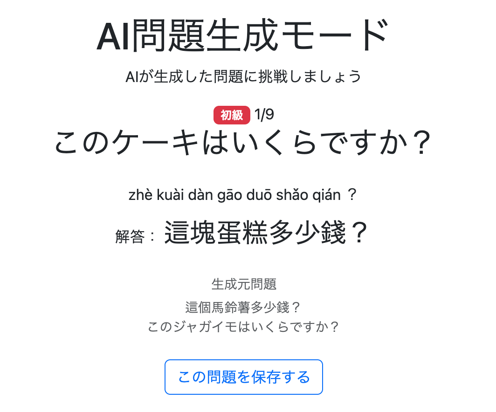

ボタンを押すと、保存ボタンが非表示になり、理解度ボタンとお気に入りボタンが表示された。

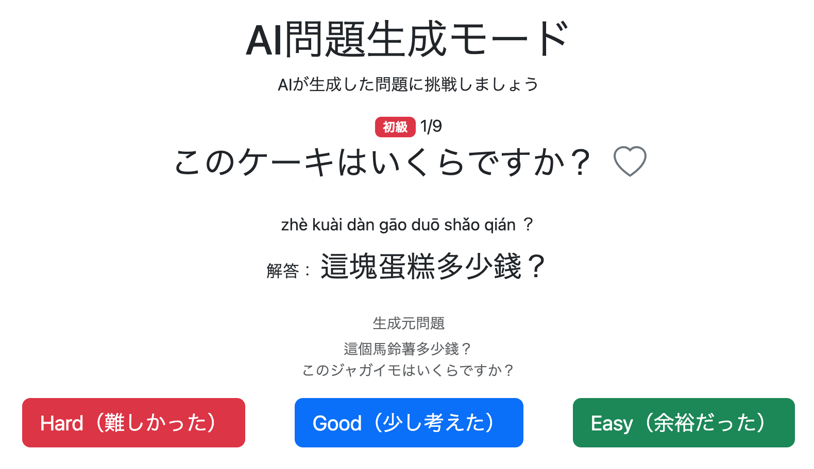

DBを確認すると、対象のAI生成問題が`Question`へ追加されていることも確認できた。

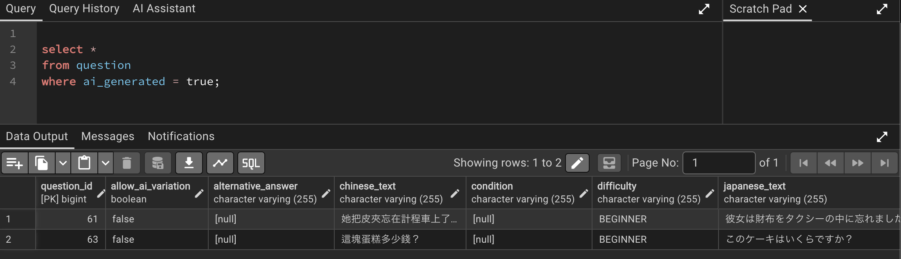

この時点では、理解度ボタンとお気に入りボタンはまだ実際の登録処理には接続していない。

---

# 2. 保存したAI生成問題へ理解度とお気に入りを登録する

AI生成問題を`Question`へ保存できるようになったため、保存後の問題について通常問題と同様に理解度とお気に入りを登録できるようにする。

既存機能を利用できる部分については新しいServiceを作成せず、既存処理を再利用する。

```text
feat: add evaluation and favorite support for saved AI-generated questions
```

---

## 2-1. AI生成問題用の理解度登録処理を追加

理解度の保存自体は既存の、

```java
EvaluationService.updateEvaluation()
```

をそのまま利用できる。

そのため、新しいService処理は追加しない。

`AiPracticeController`へAI問題生成モード用のPOST処理を追加した。

```java
@PostMapping("/ai-practice/evaluation")
public String postAiPracticeEvaluation(
        @AuthenticationPrincipal UserDetails loginUser,
        @RequestParam Long questionId,
        @RequestParam Evaluation evaluation,
        @RequestParam Integer page,
        HttpSession session) {

    // ユーザー情報を取得
    Users user = userAccountService.getUserOne(
            loginUser.getUsername());

    // 理解度を保存
    evaluationService.updateEvaluation(
            user,
            questionId,
            evaluation);

    // Sessionからquestions取得
    List<AiGeneratedQuestionDto> questions =
            (List<AiGeneratedQuestionDto>) session.getAttribute("aiPracticeQuestions");

    // 最後の問題の場合
    if (page + 1 >= questions.size()) {
        return "redirect:/ai-practice/complete";
    }

    // 次の問題へ
    return "redirect:/ai-practice/question?page=" + (page + 1);
}
```

理解度登録後のページ遷移は通常学習や復習と同様だが、AI問題生成モードではSessionに保存している、

```java
List<AiGeneratedQuestionDto>
```

を基準に現在位置を判断する。

HTMLで理解度フォームの送信先を、

```html
<form th:action="@{/practice/evaluation}" method="post">
```

から、

```html
<form th:action="@{/ai-practice/evaluation}" method="post">
```

へ修正した。

---

## 2-2. お気に入り登録は既存処理を再利用

お気に入りについては、すでに、

```java
FavoriteService.toggleFavorite()
```

と、

```java
FavoriteController.toggleFavorite()
```

が存在する。

保存されたAI生成問題も通常の`Question`になっているため、新しいService・Controllerは追加せず既存処理をそのまま利用する。

フロント側のお気に入り制御についても既存JavaScriptを利用するため、新しいお気に入り処理は追加しない。

---

## 2-3. 理解度登録とお気に入り登録を確認

AI生成問題を保存した。

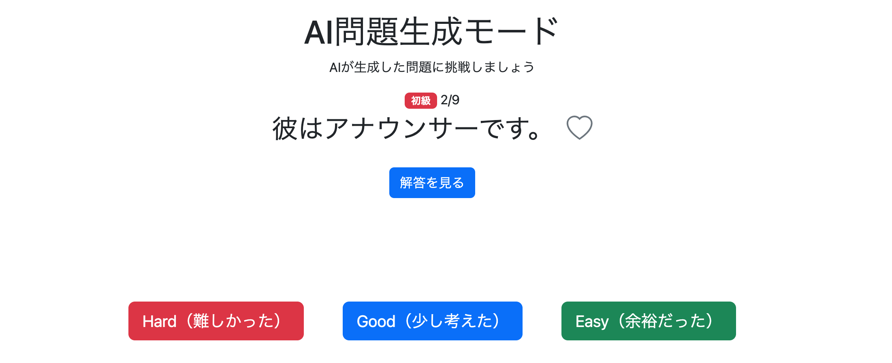

理解度ボタンを押すと理解度が登録され、次の問題へ遷移した。

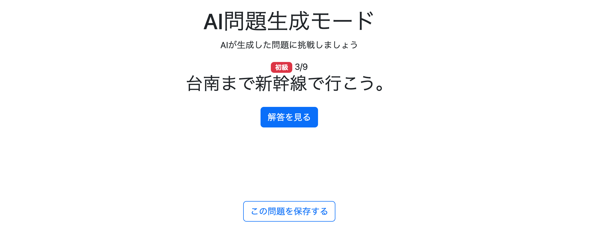

DBを確認すると、理解度が正常に登録されていた。

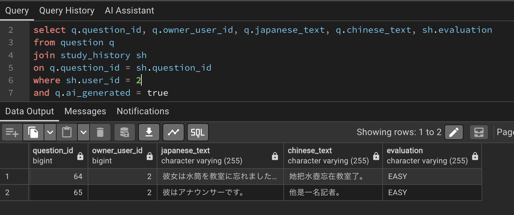

お気に入りボタンを押すとハートマークの表示が変化した。

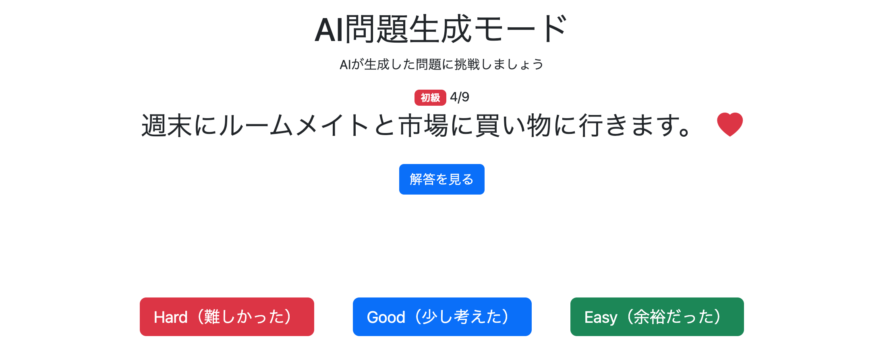

DBでもお気に入りが正常に登録されていることを確認した。

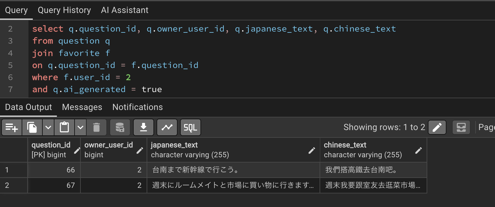

---

# 3. 保存済みAI生成問題を再表示した場合の状態を復元する

一度AI生成問題を保存すると、その場ではJavaScriptによって、

```text
保存ボタン
→ 非表示

お気に入り
→ 表示

理解度
→ 表示
```

へ切り替わる。

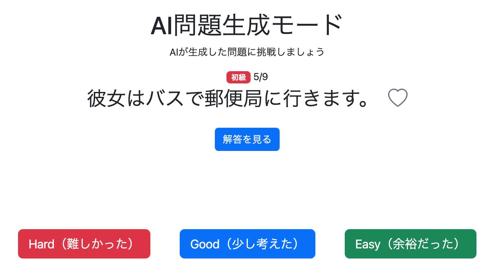

しかし、次の問題へ移動した後に「前の問題へ」で戻ると、

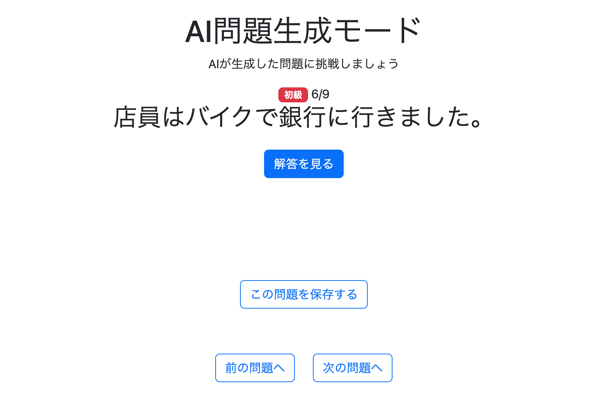

保存済みであるにもかかわらず、理解度ボタンとお気に入りボタンが再び非表示になった。

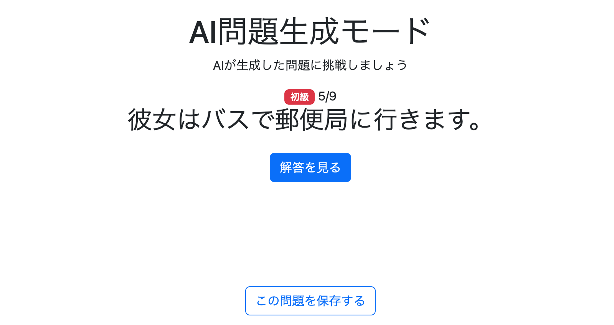

これは初期HTMLでは常に保存ボタンを表示し、お気に入り・理解度を`d-none`としているためである。

さらに、もう一度保存ボタンを押して表示状態を復元しようとしても、同一問題の重複保存チェックにより保存処理が失敗する。

そこで、ページをGETした時点で、

```text
現在のユーザー
+
現在のAI生成問題のchineseText
```

から保存済みかどうかを判定するようにした。

```text
fix: restore saved AI question actions when revisiting
```

---

## 3-1. 保存済み問題を検索するRepositoryを追加

`QuestionRepository`へ以下を追加した。

```java
Optional<Question> findByOwnerIdAndChineseText(
        Long userId,
        String chineseText);
```

これによって、

```text
現在のユーザーID
+
現在表示しているAI生成問題の中国語文
```

から、そのユーザーが以前保存した`Question`を取得できる。

---

## 3-2. GET時に保存済み状態を取得

`getAiPracticeQuestion()`で現在のユーザーを取得する。

```java
Users user = userAccountService.getUserOne(
        loginUser.getUsername());
```

現在表示しているAI生成問題が保存済みか確認する。

```java
Optional<Question> savedQuestion =
        questionRepository.findByOwnerIdAndChineseText(
                user.getId(),
                question.getChineseText());
```

保存済みの場合は`questionId`を取得する。

```java
Long savedQuestionId = null;

if (savedQuestion.isPresent()) {
    savedQuestionId = savedQuestion.get().getQuestionId();
}
```

さらに、保存済みの場合はお気に入り状態も取得する。

```java
boolean isFavorite = false;

if (savedQuestionId != null) {
    isFavorite = favoriteService.isFavorite(
            user,
            savedQuestionId);
}
```

最後に、

```java
model.addAttribute("savedQuestionId", savedQuestionId);
model.addAttribute("isFavorite", isFavorite);
```

としてHTMLへ渡す。

これによってページ表示時点で、

```text
未保存
保存済み
お気に入り登録済み
```

を判定できるようになった。

---

## 3-3. Thymeleafでお気に入りの初期状態を制御

お気に入りエリアを、

```html
<div id="favoriteArea"
     th:classappend="${savedQuestionId == null} ? 'd-none'"
     sec:authorize="isAuthenticated()">

    <button id="favoriteButton"
            type="button"
            class="btn p-0 border-0 bg-transparent"
            th:data-question-id="${savedQuestionId}">

        <i id="favoriteIcon"
           class="bi fs-2"
           th:classappend="${isFavorite}
               ? 'bi-heart-fill text-danger'
               : 'bi-heart text-secondary'">
        </i>

    </button>

</div>
```

へ変更した。

保存済みであれば、

```text
savedQuestionId != null
```

となるため、最初から`d-none`が付かない。

さらに`isFavorite`から、

```text
bi-heart-fill text-danger
```

または、

```text
bi-heart text-secondary
```

を設定し、お気に入り状態も復元する。

---

## 3-4. 理解度ボタンの初期表示を制御

これまでは、

```html
<div id="savedQuestionActions"
     class="d-none mt-3">
```

としていたため、ページを再表示すると必ず非表示になっていた。

これを、

```html
<div id="savedQuestionActions"
     class="mt-3"
     th:classappend="${savedQuestionId == null} ? 'd-none'">
```

へ変更した。

さらにHARD・GOOD・EASYの各フォームについて、

```html
<input type="hidden"
       name="questionId"
       class="savedQuestionId"
       th:value="${savedQuestionId}">
```

として、保存済みQuestionのIDを初期状態から設定する。

---

## 3-5. 保存ボタンの初期表示を制御

保存ボタンについても、

```html
<div id="saveQuestionArea"
     class="mt-4"
     th:classappend="${savedQuestionId != null} ? 'd-none'">
```

へ変更した。

これによって画面には以下の2つの制御経路が存在する。

### ページ表示時点ですでに保存済みの場合

```text
GET /ai-practice/question
↓
savedQuestionIdを取得
↓
Thymeleaf
↓
保存ボタンを非表示
↓
お気に入り・理解度を表示
```

### 現在の画面で初めて保存した場合

```text
保存ボタンを押す
↓
POST /ai-practice/save
↓
保存成功
↓
JavaScript
↓
保存ボタンを非表示
↓
お気に入り・理解度を表示
```

---

## 3-6. 保存済み状態の復元を確認

AI生成問題を保存した。

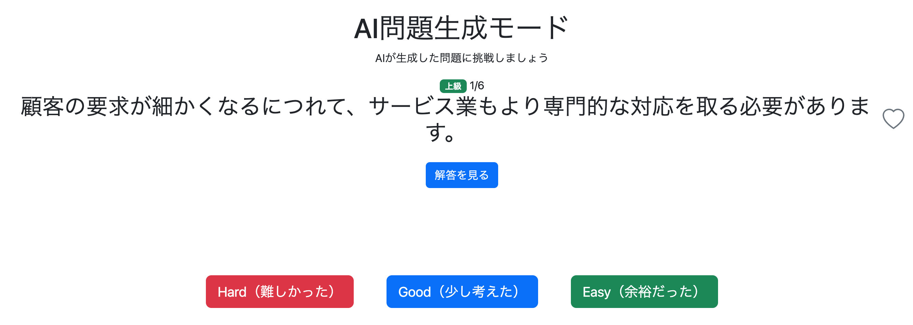

次の問題へ遷移した。

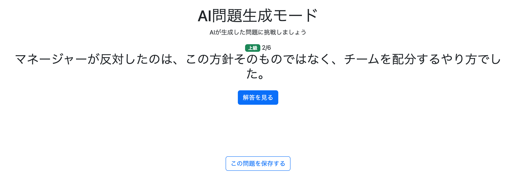

その後、前の問題へ戻ると、保存ボタンではなく理解度ボタンとお気に入りボタンが正常に表示された。


---

## 3-7. 過去に生成・保存した同一問題も自動判定できるようになった

保存済み判定では生成日時や現在の生成回ではなく、

```text
ユーザーID
+
chineseText
```

を利用している。

そのため、例えば9月1日に、

```text
這個蘋果多少錢
```

を生成して保存し、9月2日にAIが再びまったく同じ文章を生成した場合でも、

```text
同じユーザー
+
同じchineseText
```

から9月1日に保存したQuestionを取得できる。

その結果、ページを開いた時点から、

```text
保存ボタンを非表示
お気に入りボタンを表示
理解度ボタンを表示
過去のお気に入り状態を復元
```

できる。

ユーザー自身が過去にその問題を保存したか覚えている必要はなく、アプリ側で自動的に保存済み問題として扱えるようになった。

---

# 4. 重複判定をユーザー単位に修正

保存済み状態の復元を実装したことで、もう1つ問題が見つかった。

当初の`saveGeneratedQuestion()`では、

```java
if (questionRepository.existsByChineseText(
        aiGeneratedQuestionDto.getChineseText())) {
```

としていた。

この条件では、

```text
Questionテーブル全体
```

に同じ`chineseText`が存在するかだけを判定する。

しかし、AI生成問題はユーザーごとに所有する仕様である。

例えばユーザーAが、

```text
原本不靈光的腦袋就變得更笨
```

というAI生成問題を保存した後、ユーザーBにも偶然まったく同じ問題が生成された場合、ユーザーBにとっては未保存の問題である。

それにもかかわらず`existsByChineseText()`ではユーザーAのQuestionが見つかるため、ユーザーBも保存できなくなる。

そこで重複判定をユーザー単位へ修正した。

```text
fix: scope AI-generated question duplicate check by user
```

---

## 4-1. 既存の`findByOwnerIdAndChineseText()`を再利用

保存済み状態の復元ですでに追加した、

```java
Optional<Question> findByOwnerIdAndChineseText(
        Long userId,
        String chineseText);
```

をそのまま利用する。

以前の、

```java
// 同じ中国語文がすでに登録されている場合は保存しない
if (questionRepository.existsByChineseText(
        aiGeneratedQuestionDto.getChineseText())) {

    throw new IllegalStateException(
            messageSource.getMessage(
                    "aiPractice.save.error.duplicate",
                    null,
                    locale));
}
```

を削除し、

```java
// 同じユーザーが同じ中国語文をすでに保存している場合は保存しない
Optional<Question> existingQuestion =
        questionRepository.findByOwnerIdAndChineseText(
                user.getId(),
                aiGeneratedQuestionDto.getChineseText());

if (existingQuestion.isPresent()) {

    throw new IllegalStateException(
            messageSource.getMessage(
                    "aiPractice.save.error.duplicate",
                    null,
                    locale));
}
```

へ変更した。

これによって、

```text
ユーザーA + 問題X
→ 保存可能

ユーザーA + 問題Xを再保存
→ 保存不可

ユーザーB + 問題X
→ 保存可能
```

というAI生成問題の所有者仕様に合った重複判定になった。

---

# 5. AI問題生成モードの実装完了

これでAI問題生成モードについて、

```text
条件を指定
↓
生成元Questionを抽出
↓
AIへ生成元問題・template・generationHistoryを送信
↓
AI問題を生成
↓
問題画面で学習
↓
気に入った問題をQuestionへ保存
↓
理解度・お気に入りを登録
↓
保存したユーザー専用の問題として利用
```

という一連の流れを実装できた。

また、保存済みのAI生成問題についても、ページを再表示した場合や後日のAI生成で同一問題が再び登場した場合に、自動的に保存済み状態を復元できるようになった。

AI生成問題は所有ユーザー単位で管理するため、他ユーザーが保存した問題によって通常学習用の問題構成が影響を受けない設計とした。

これをもってAI問題生成モードの実装を完了した。