# 021 AI生成問題の既存学習機能への統合

前チャプターまでで、AI問題生成モードで生成した問題を`Question`テーブルへ保存し、保存したユーザー本人が利用できるようになった。

AI生成由来の問題は、

```java
aiGenerated = true
```

として通常問題と区別し、

```java
owner
```

によって所有ユーザーを管理している。

このチャプターでは、保存したAI生成由来の問題を既存機能へ統合する。

対象となるのは主に以下の3つである。

1. 通常学習
2. 復習
3. ユーザーメニューの問題一覧

通常学習では、通常問題に加えて自分が所有するAI生成由来の問題も出題できるようにする。

復習と問題一覧では、AI生成由来の問題を対象に含めるだけでなく、

```text
すべて
AI生成由来の問題を除外する
AI生成由来の問題のみ
```

という生成元による絞り込みも追加する。

また、問題一覧では自分が所有するAI生成由来の問題を削除できるようにする。

---

# 1. 通常学習へAI生成問題を統合

通常学習には、

```text
範囲を指定してトレーニングするモード
未学習問題をトレーニングするモード
```

がある。

どちらについても、ログインユーザーの場合は自分が所有するAI生成由来の問題を出題対象へ含める。

一方、非ログインユーザーにはAI生成由来の問題を公開しない。

そのため、利用可能な問題は以下となる。

```text
非ログイン
└─ 通常問題

ログイン
├─ 通常問題
└─ 自分が所有するAI生成問題
```

---

## 1-1. 通常学習メニューの問題数を変更

```text
git commit -m "feat: add AI-generated question filter to practice menu"
```

通常学習メニューでは、難易度ごとに利用可能な問題数を表示している。

これまではログイン状態に関係なく`Question`全体を対象としていたが、AI生成問題の導入後はユーザーによって利用可能な問題が異なる。

### `QuestionRepository.java`

非ログインユーザー向けの問題数取得では、AI生成由来の問題を除外する。

```java
@Query(value = """
        SELECT COUNT(*)
        FROM question
        WHERE language_variant = :languageVariant
        AND difficulty = :difficulty
        AND ai_generated = false
        """, nativeQuery = true)
long countByLanguageVariantAndDifficulty(
        @Param("languageVariant") String languageVariant,
        @Param("difficulty") String difficulty
);
```

ログインユーザーについては、

```sql
ai_generated = false
OR (ai_generated = true AND owner_user_id = :userId)
```

を条件とする。

これによって、

```text
通常問題
+
そのユーザー自身が所有するAI生成問題
```

だけを利用可能な問題として扱う。

---

## 1-2. 問題の生成元を表すEnumを追加

ログインユーザーは、通常問題と自分のAI生成問題の両方を利用できる。

さらに通常学習では、問題の生成元を絞り込めるようにする。

```java
public enum PracticeSearchCondition {

    ALL,
    ORIGINAL_ONLY,
    GENERATED_ONLY
}
```

それぞれ、

```text
ALL
→ 通常問題 + 自分のAI生成問題

ORIGINAL_ONLY
→ 通常問題のみ

GENERATED_ONLY
→ 自分のAI生成問題のみ
```

を表す。

後ほどこのEnumは復習や問題一覧でも利用するため、`QuestionSourceCondition`へ名称変更する。

---

## 1-3. 生成元条件をRepositoryへ追加

### `QuestionRepository.java`

```java
@Query(value = """
        SELECT COUNT(*)
        FROM question
        WHERE language_variant = :languageVariant
        AND difficulty = :difficulty
        AND (
            (:searchCondition = 'ALL'
                AND (
                    (ai_generated = true AND owner_user_id = :userId)
                    OR ai_generated = false
                )
            )
            OR (:searchCondition = 'ORIGINAL_ONLY'
                AND ai_generated = false
            )
            OR (:searchCondition = 'GENERATED_ONLY'
                AND (ai_generated = true AND owner_user_id = :userId)
            )
        )
        """, nativeQuery = true)
long countPracticeQuestions(
        @Param("userId") Long userId,
        @Param("languageVariant") String languageVariant,
        @Param("difficulty") String difficulty,
        @Param("searchCondition") String searchCondition
);
```

`ALL`の場合でも、すべての`Question`を取得するわけではない。

AI生成問題については、

```sql
owner_user_id = :userId
```

を必須とすることで、他ユーザーが保存したAI生成問題が混ざらないようにする。

---

## 1-4. `PracticeService`でログイン状態によって件数取得を分岐

`countPracticeQuestions()`へユーザーIDと生成元条件を渡せるようにする。

生成元条件が未指定の場合は、

```java
if (searchCondition == null) {
    searchCondition = PracticeSearchCondition.ALL;
}
```

として`ALL`を使用する。

問題数取得では、

```java
private long countQuestions(
        Long userId,
        LanguageVariant languageVariant,
        Difficulty difficulty,
        PracticeSearchCondition searchCondition) {

    // 非ログイン
    if (userId == null) {
        return questionRepository
                .countByLanguageVariantAndDifficulty(
                        languageVariant.name(),
                        difficulty.name()
                );
    }

    // ログイン
    return questionRepository.countPracticeQuestions(
            userId,
            languageVariant.name(),
            difficulty.name(),
            searchCondition.name()
    );
}
```

とする。

これによって、

```text
userId == null
→ 非ログイン用Repository

userId != null
→ ログイン用Repository
```

と切り替える。

---

## 1-5. `/practice/count`を追加

生成元条件を変更したとき、画面上の問題数も動的に更新する必要がある。

### `PracticeController.java`

```java
@PreAuthorize("isAuthenticated()")
@GetMapping("/practice/count")
@ResponseBody
public PracticeMenuDto getPracticeCount(
        HttpSession session,
        @AuthenticationPrincipal UserDetails loginUser,
        @RequestParam(name = "searchCondition", required = false)
                PracticeSearchCondition searchCondition) {

    Users user = getLoginUser(loginUser);
    Long userId = user.getId();

    LanguageVariant languageVariant =
            (LanguageVariant) session.getAttribute("languageVariant");

    if (languageVariant == null) {
        languageVariant = LanguageVariant.MAINLAND;
    }

    return practiceService.countPracticeQuestions(
            userId,
            languageVariant,
            searchCondition
    );
}
```

`@ResponseBody`を使用することで、取得した`PracticeMenuDto`をJavaScriptへ返す。

また、この機能はログインユーザー専用なので、

```java
@PreAuthorize("isAuthenticated()")
```

を付与する。

### `SecurityConfig.java`

メソッド単位の認証制御を有効にする。

```java
@Configuration
@EnableWebSecurity
@EnableMethodSecurity
public class SecurityConfig {
    ...
}
```

---

## 1-6. 通常学習メニューへ問題の生成元を追加

### `/practice/menu.html`

ログインユーザーにのみ生成元条件を表示する。

```html
<div class="card"
     style="width: 400px;"
     sec:authorize="isAuthenticated()">

    <div class="card-header"
         th:text="#{practice.menu.sourceCondition.title}">
        問題の生成元
    </div>

    <div class="card-body">

        <div class="form-check">
            <input class="form-check-input"
                   type="radio"
                   name="sourceCondition"
                   value="ALL"
                   id="sourceAll"
                   checked>

            <label class="form-check-label"
                   for="sourceAll"
                   th:text="#{practice.menu.sourceCondition.all}">
                すべて
            </label>
        </div>

        <div class="form-check">
            <input class="form-check-input"
                   type="radio"
                   name="sourceCondition"
                   value="ORIGINAL_ONLY"
                   id="sourceOriginal">

            <label class="form-check-label"
                   for="sourceOriginal"
                   th:text="#{practice.menu.sourceCondition.originalOnly}">
                AI生成由来の問題を除外する
            </label>
        </div>

        <div class="form-check">
            <input class="form-check-input"
                   type="radio"
                   name="sourceCondition"
                   value="GENERATED_ONLY"
                   id="sourceGenerated">

            <label class="form-check-label"
                   for="sourceGenerated"
                   th:text="#{practice.menu.sourceCondition.generatedOnly}">
                AI生成由来の問題のみ出題する
            </label>
        </div>

    </div>

</div>
```

問題数部分にはJavaScriptから更新できるようIDを付与する。

```html
<span>
    <span th:text="#{practice.menu.difficulty.beginner}"></span>

    <span id="beginnerCount"
          th:text="${practiceMenu.beginnerCount}">
    </span>

    <span th:text="#{practice.menu.difficulty.countSuffix}"></span>
</span>
```

### `messages.properties`

```properties
practice.menu.difficulty.beginner=初級：
practice.menu.difficulty.intermediate=中級：
practice.menu.difficulty.advanced=上級：
practice.menu.difficulty.countSuffix=問

practice.menu.sourceCondition.title=問題の生成元
practice.menu.sourceCondition.all=すべて
practice.menu.sourceCondition.originalOnly=AI生成由来の問題を除外する
practice.menu.sourceCondition.generatedOnly=AI生成由来の問題のみ出題する
```

---

## 1-7. 生成元条件変更時に問題数を更新

### `/practice/menu.js`

```javascript
const sourceConditions =
    document.querySelectorAll(
        "input[name='sourceCondition']"
    );

sourceConditions.forEach(condition => {

    condition.addEventListener("change", async () => {

        const selectedCondition =
            document.querySelector(
                "input[name='sourceCondition']:checked"
            );

        const params = new URLSearchParams();

        params.append(
            "sourceCondition",
            selectedCondition.value
        );

        const response =
            await fetch(
                `/practice/count?${params.toString()}`
            );

        const data = await response.json();

        document.getElementById("beginnerCount")
            .textContent = data.beginnerCount;

        document.getElementById("intermediateCount")
            .textContent = data.intermediateCount;

        document.getElementById("advancedCount")
            .textContent = data.advancedCount;
    });
});
```

生成元条件を変更すると`/practice/count`へ条件を送り、その条件で取得した難易度別の問題数へ表示を更新する。

### 実行・確認

非ログイン状態では従来どおり通常問題だけが表示対象となる。

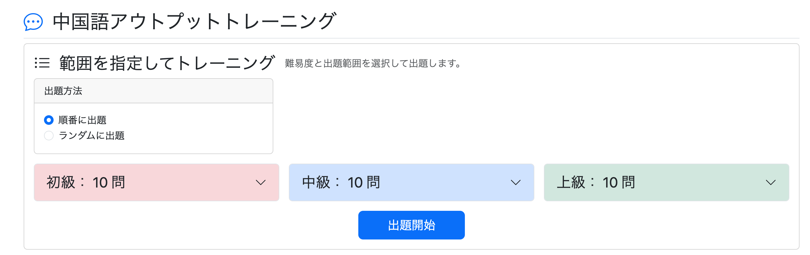

ログインすると、自分が所有するAI生成由来の問題も件数へ追加され、「問題の生成元」も選択できる。


AI生成由来の問題を除外すると、通常問題だけの件数になる。

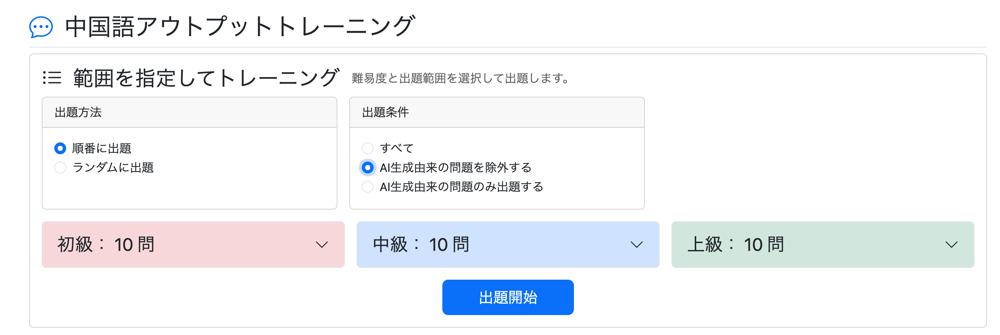

AI生成由来の問題のみを選択すると、自分が所有するAI生成問題だけの件数になる。

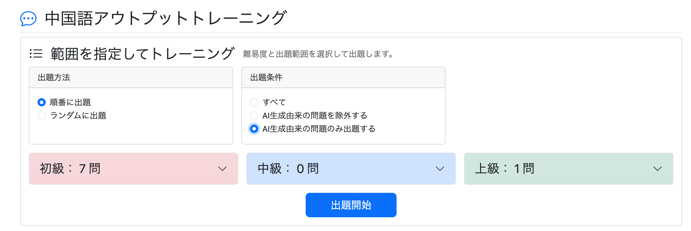

---

## 1-8. 実際の問題取得にも生成元条件を反映

```text
git commit -m "feat: integrate AI-generated questions into practice sessions"
```

件数表示だけでなく、実際の問題取得にも同じ条件を適用する。

### `QuestionRepository.java`

非ログインの場合はAI生成問題を除外する。

```java
@Query(value = """
        SELECT *
        FROM question
        WHERE language_variant = :languageVariant
        AND difficulty = :difficulty
        AND ai_generated = false
        ORDER BY question_id
        LIMIT 50 OFFSET :offset
        """, nativeQuery = true)
List<Question> findQuestionsByLanguageVariantAndDifficulty(
        @Param("languageVariant") String languageVariant,
        @Param("difficulty") String difficulty,
        @Param("offset") int offset
);
```

ログイン時は生成元条件と所有者を考慮する。

```java
@Query(value = """
        SELECT *
        FROM question
        WHERE language_variant = :languageVariant
        AND difficulty = :difficulty
        AND (
            (:searchCondition = 'ALL'
                AND (
                    (ai_generated = true AND owner_user_id = :userId)
                    OR ai_generated = false
                )
            )
            OR (:searchCondition = 'ORIGINAL_ONLY'
                AND ai_generated = false
            )
            OR (:searchCondition = 'GENERATED_ONLY'
                AND (ai_generated = true AND owner_user_id = :userId)
            )
        )
        ORDER BY question_id
        LIMIT 50 OFFSET :offset
        """, nativeQuery = true)
List<Question> findAvailableQuestionsByUserIdAndLanguageVariantAndDifficulty(
        @Param("userId") Long userId,
        @Param("languageVariant") String languageVariant,
        @Param("difficulty") String difficulty,
        @Param("searchCondition") String searchCondition,
        @Param("offset") int offset
);
```

`PracticeController.getPracticeStart()`ではログイン状態によってServiceを呼び分ける。

```java
Long userId = null;

if (loginUser != null) {
    Users user = getLoginUser(loginUser);
    userId = user.getId();
}

List<Question> questions;

if (userId != null) {

    if (searchCondition == null) {
        searchCondition = PracticeSearchCondition.ALL;
    }

    questions =
            practiceService.getAvailablePracticeQuestions(
                    userId,
                    languageVariant,
                    difficulty,
                    searchCondition,
                    start,
                    random
            );

} else {

    questions =
            practiceService.getPracticeQuestions(
                    languageVariant,
                    difficulty,
                    start,
                    random
            );
}
```

これで画面上の件数と実際の出題対象が一致する。

---

## 1-9. AI生成問題へバッジを表示

通常学習中にAI生成由来の問題を判別できるよう、難易度の横へAIバッジを表示する。

### `/practice/question.html`

```html
<!-- AI生成由来 -->
<span class="badge bg-black"
      th:if="${question.aiGenerated}">
    AI
</span>
```

AI問題生成モードについても表示を統一する。

### `/ai-practice/question.html`

```html
<span class="badge bg-black">
    AI
</span>
```

### 実行・確認

AI生成由来の問題を出題対象にして通常学習を開始すると、AI生成問題も問題セットへ含まれ、AIバッジも表示された。

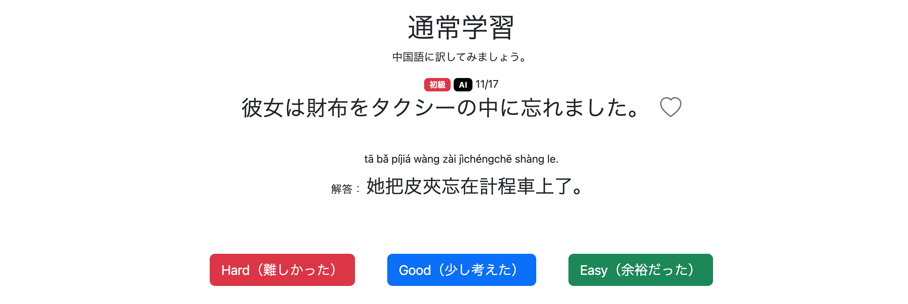

---

# 2. 未学習問題へAI生成問題を統合

```text
git commit -m "feat: include AI-generated questions in unlearned practice"
```

未学習問題についても、

```text
通常問題
+
自分が所有するAI生成問題
```

を対象とする。

未学習モードでは生成元による絞り込みは行わず、そのユーザーが利用可能な問題をすべて対象とする。

## 2-1. Repositoryを修正

### `QuestionRepository.java`

```java
@Query(value = """
        SELECT COUNT(*)
        FROM question q
        LEFT JOIN study_history sh
          ON q.question_id = sh.question_id
         AND sh.user_id = :userId
        WHERE language_variant = :languageVariant
          AND q.difficulty IN (:difficulties)
          AND (
              q.ai_generated = false
              OR (
                  q.ai_generated = true
                  AND owner_user_id = :userId
              )
          )
          AND sh.question_id IS NULL
        """, nativeQuery = true)
long countUnlearnedQuestions(
        @Param("userId") Long userId,
        @Param("languageVariant") String languageVariant,
        @Param("difficulties") String difficulties
);
```

問題取得側にも同じ条件を追加する。

```java
@Query(value = """
        SELECT q.*
        FROM question q
        LEFT JOIN study_history sh
          ON q.question_id = sh.question_id
         AND sh.user_id = :userId
        WHERE language_variant = :languageVariant
          AND q.difficulty IN (:difficulties)
          AND (
              q.ai_generated = false
              OR (
                  q.ai_generated = true
                  AND owner_user_id = :userId
              )
          )
          AND sh.question_id IS NULL
        """, nativeQuery = true)
List<Question> findUnlearnedQuestionsByUserIdAndDifficulty(
        @Param("userId") Long userId,
        @Param("languageVariant") String languageVariant,
        @Param("difficulties") List<String> difficulties
);
```

また、従来のクエリでは`languageVariant`による絞り込みが不足していたため、このタイミングで追加した。

---

## 2-2. Service・Controllerへ`languageVariant`を渡す

### `PracticeService.java`

```java
public NewPracticeCountDto countNewPracticeQuestions(
        Long userId,
        LanguageVariant languageVariant) {

    NewPracticeCountDto count = new NewPracticeCountDto();

    long beginnerCount =
            questionRepository.countUnlearnedQuestions(
                    userId,
                    languageVariant.name(),
                    Difficulty.BEGINNER.name()
            );

    count.setBeginnerCount(beginnerCount);

    long intermediateCount =
            questionRepository.countUnlearnedQuestions(
                    userId,
                    languageVariant.name(),
                    Difficulty.INTERMEDIATE.name()
            );

    count.setIntermediateCount(intermediateCount);

    long advancedCount =
            questionRepository.countUnlearnedQuestions(
                    userId,
                    languageVariant.name(),
                    Difficulty.ADVANCED.name()
            );

    count.setAdvancedCount(advancedCount);

    return count;
}
```

問題取得でも`languageVariant`をRepositoryへ渡す。

```java
public List<Question> getNewQuestions(
        Long userId,
        LanguageVariant languageVariant,
        List<Difficulty> difficulty) {

    return questionRepository
            .findUnlearnedQuestionsByUserIdAndDifficulty(
                    userId,
                    languageVariant.name(),
                    searchConditionConverter
                            .convertDifficulty(difficulty)
            );
}
```

---

## 2-3. 未学習問題数表示を修正

通常学習側の件数表示を、

```properties
practice.menu.difficulty.beginner=初級：
practice.menu.difficulty.countSuffix=問
```

のように分割したため、未学習モードも同じ形式へ変更する。

```html
<span>
    <span th:text="#{practice.menu.difficulty.beginner}"></span>
    <span th:text="${newQuestionCount.beginnerCount}"></span>
    <span th:text="#{practice.menu.difficulty.countSuffix}"></span>
</span>
```

中級・上級についても同様に変更する。

### 実行・確認

対象ユーザーの学習済み問題数は35問だった。

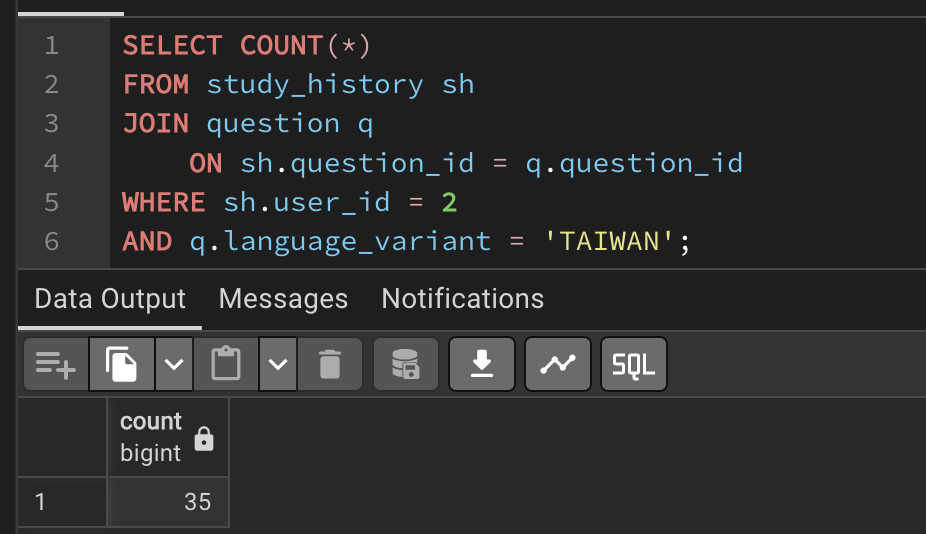

利用可能な問題が38問なので、未学習問題は3問となる。

実際に通常学習メニューを確認すると、未学習問題数も3問となった。

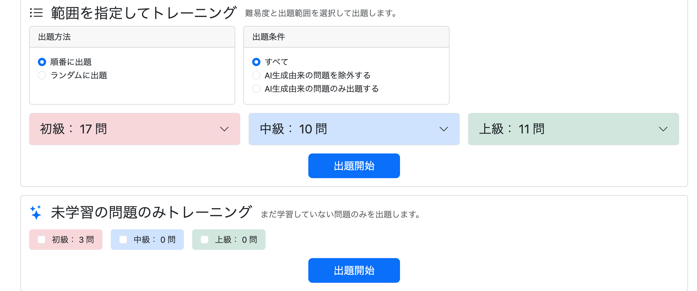

未学習トレーニングを開始すると、対象となる問題が正しく表示された。

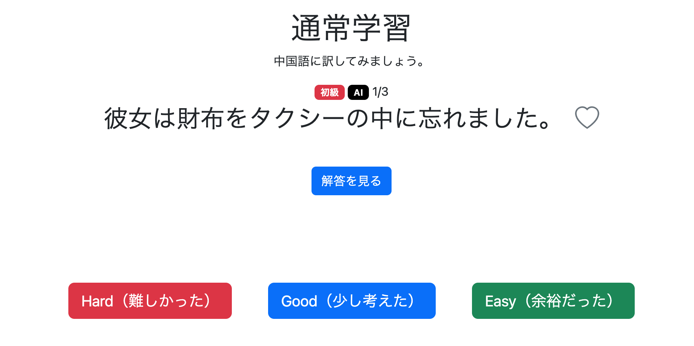

---

# 3. 生成元条件を共通化

```text
git commit -m "refactor: rename PracticeSearchCondition to QuestionSourceCondition"
```

当初、通常学習専用として、

```java
PracticeSearchCondition
```

を作成していた。

しかし、同じ条件を復習や問題一覧でも使用するため、より汎用的な、

```java
QuestionSourceCondition
```

へ変更する。

```java
public enum QuestionSourceCondition {

    ALL,
    ORIGINAL_ONLY,
    GENERATED_ONLY
}
```

合わせて、Controller・Service・HTML・JavaScriptで使用していた`searchCondition`も、問題の生成元を表すことが分かるよう、

```text
sourceCondition
```

へ変更した。

---

# 4. 生成元変更時の出題範囲を修正

```text
git commit -m "fix: update practice ranges when source condition changes"
```

生成元条件を変更すると総問題数は更新されていたが、

```text
1-10
11-20
21-30
```

などの出題範囲は変更前の状態のまま残っていた。


原因は、JavaScriptで件数だけを更新し、出題範囲を更新していなかったためである。

## 4-1. `updateRanges()`を追加

### `/practice/menu.js`

```javascript
function updateRanges(selectId, ranges) {

    const select =
        document.getElementById(selectId);

    // 「選択してください」以外を削除
    while (select.options.length > 1) {
        select.remove(1);
    }

    // 新しい出題範囲を追加
    ranges.forEach(range => {

        const option =
            document.createElement("option");

        option.value = range.start;
        option.textContent = range.displayText;

        select.appendChild(option);
    });

    // 選択状態を初期化
    select.selectedIndex = 0;
}
```

件数取得後は件数と同時に出題範囲も更新する。

```javascript
// 初級
document.getElementById("beginnerCount")
    .textContent = data.beginnerCount;

updateRanges(
    "beginnerRange",
    data.beginnerRanges
);

// 中級
document.getElementById("intermediateCount")
    .textContent = data.intermediateCount;

updateRanges(
    "intermediateRange",
    data.intermediateRanges
);

// 上級
document.getElementById("advancedCount")
    .textContent = data.advancedCount;

updateRanges(
    "advancedRange",
    data.advancedRanges
);
```

### 実行・確認

生成元条件によって総問題数が変化すると、出題範囲も新しい問題数に合わせて更新されるようになった。

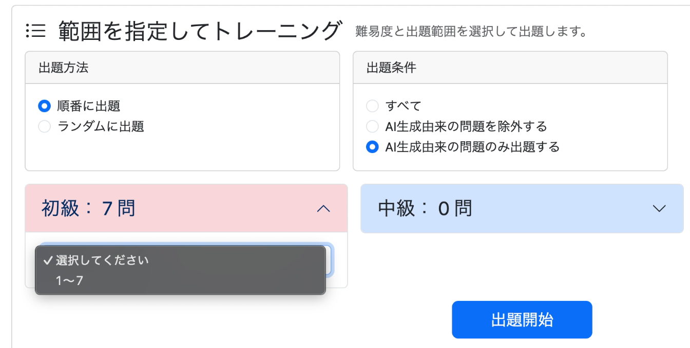

---

# 5. 復習モードへAI生成問題を統合

```text
git commit -m "feat: add question source filter to review mode"
```

復習でもAI生成由来の問題を対象とし、

```text
すべて
AI生成由来の問題を除外する
AI生成由来の問題のみ
```

から生成元を選択できるようにする。

基本的な条件は通常学習と同じである。

---

## 5-1. 復習のRepositoryへ生成元条件を追加

### `StudyHistoryRepository.java`

問題数取得と問題取得の両方へ以下の条件を追加する。

```sql
AND (
    (:sourceCondition = 'ALL'
        AND (
            (q.ai_generated = true AND q.owner_user_id = :userId)
            OR q.ai_generated = false
        )
    )
    OR (:sourceCondition = 'ORIGINAL_ONLY'
        AND q.ai_generated = false
    )
    OR (:sourceCondition = 'GENERATED_ONLY'
        AND (
            q.ai_generated = true
            AND q.owner_user_id = :userId
        )
    )
)
```

これによって復習対象についても、他ユーザーが所有するAI生成問題が取得されることはない。

Repositoryメソッドには、

```java
@Param("sourceCondition")
String sourceCondition
```

を追加する。

---

## 5-2. `ReviewService`へ生成元条件を追加

問題数取得と問題取得の両方で、

```java
QuestionSourceCondition sourceCondition
```

を受け取る。

未指定の場合は、

```java
if (sourceCondition == null) {
    sourceCondition = QuestionSourceCondition.ALL;
}
```

として`ALL`を使用する。

Repositoryへは、

```java
sourceCondition.name()
```

として渡す。

---

## 5-3. `ReviewController`へ生成元条件を追加

`/review/count`と`/review/start`の両方で、

```java
@RequestParam(
        name = "sourceCondition",
        required = false)
QuestionSourceCondition sourceCondition
```

を受け取る。

件数表示と実際の問題取得の両方で同じ条件をServiceへ渡すことで、画面上の件数と出題対象を一致させる。

---

## 5-4. 復習メニューへ問題の生成元を追加

### `/review/menu.html`

```html
<div class="col-md-6 mb-4">

    <div class="card h-100">

        <div class="card-header"
             th:text="#{practice.menu.sourceCondition.title}">
            問題の生成元
        </div>

        <div class="card-body">

            <label class="form-check mb-2">

                <input class="form-check-input"
                       type="radio"
                       name="sourceCondition"
                       value="ALL"
                       id="sourceAll"
                       checked>

                <span class="form-check-label"
                      th:text="#{practice.menu.sourceCondition.all}">
                    すべて
                </span>

            </label>

            <label class="form-check mb-2">

                <input class="form-check-input"
                       type="radio"
                       name="sourceCondition"
                       value="ORIGINAL_ONLY"
                       id="sourceOriginal">

                <span class="form-check-label"
                      th:text="#{practice.menu.sourceCondition.originalOnly}">
                    AI生成由来の問題を除外する
                </span>

            </label>

            <label class="form-check">

                <input class="form-check-input"
                       type="radio"
                       name="sourceCondition"
                       value="GENERATED_ONLY"
                       id="sourceGenerated">

                <span class="form-check-label"
                      th:text="#{practice.menu.sourceCondition.generatedOnly}">
                    AI生成由来の問題のみ出題する
                </span>

            </label>

        </div>

    </div>

</div>
```

生成元条件の追加に合わせて、既存の検索条件カードの配置も調整した。

---

## 5-5. 復習の問題数更新へ生成元条件を追加

### `/review/menu.js`

件数更新を監視する対象へ、

```javascript
"input[name='sourceCondition'], "
```

を追加する。

また、`/review/count`へ送信するパラメータにも追加する。

```javascript
params.append(
    "sourceCondition",
    document.querySelector(
        "input[name='sourceCondition']:checked"
    ).value
);
```

これによって生成元のラジオボタンを変更した場合にも`updateCount()`が実行される。

また、以前の`condition`フィルターは既にHTML・Repositoryから廃止されていたため、JavaScriptに残っていた古い`conditions`関連処理も削除した。

### 実行・確認

復習メニューへ「問題の生成元」が追加された。

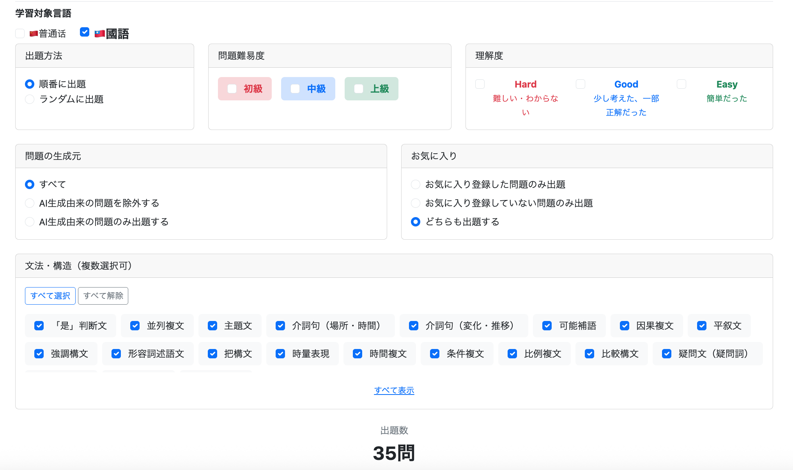

生成元条件を変更すると、その条件に一致する復習対象問題数へ更新された。

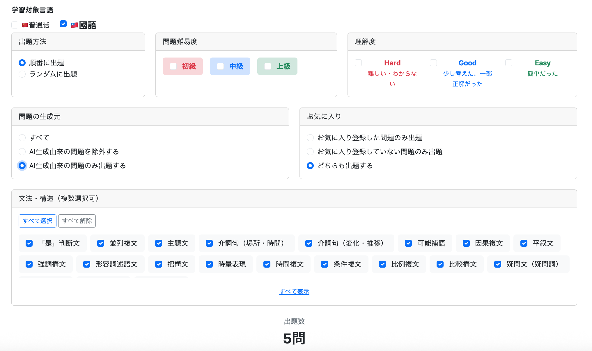

---

## 5-6. 復習問題へAIバッジを追加

```text
git commit -m "feat: add AI-generated badge to review questions"
```

通常学習と同様に、AI生成由来の問題をひと目で判別できるようにする。

### `/review/question.html`

```html
<!-- AI生成由来 -->
<span class="badge bg-black"
      th:if="${question.aiGenerated}">
    AI
</span>
```

通常問題では表示されず、AI生成由来の問題だけにAIバッジが表示される。

---

# 6. 問題一覧へAI生成問題を統合

問題一覧では、

1. AI生成由来の問題を表示・検索対象にする
2. 自分が所有するAI生成由来の問題を削除できるようにする

の2つを実装する。

---

# 6-1. AI生成由来の問題を表示対象にする

```text
git commit -m "feat: integrate AI-generated questions into question list"
```

## 6-1-1. `UserQuestionListDto`へAI生成判定を追加

```java
public interface UserQuestionListDto {

    Long getQuestionId();

    String getJapaneseText();

    String getChineseText();

    String getAlternativeAnswer();

    String getStructureName();

    String getStructureDescriptionZhCn();

    String getStructureDescriptionZhTw();

    Difficulty getDifficulty();

    Evaluation getEvaluation();

    boolean isFavorite();

    boolean isAiGenerated();

    String getPinyin();

    String getZhuyin();

    String getAlternativeAnswerPinyin();

    String getAlternativeAnswerZhuyin();
}
```

`isAiGenerated()`によって一覧画面で通常問題とAI生成問題を判別できる。

---

## 6-1-2. 問題一覧Repositoryへ生成元条件を追加

### `QuestionRepository.java`

SELECT句へ、

```sql
q.ai_generated AS aiGenerated
```

を追加する。

また、通常の検索クエリと`countQuery`の両方へ、

```sql
AND (
    (:sourceCondition = 'ALL'
        AND (
            (q.ai_generated = true AND q.owner_user_id = :userId)
            OR q.ai_generated = false
        )
    )
    OR (:sourceCondition = 'ORIGINAL_ONLY'
        AND q.ai_generated = false
    )
    OR (:sourceCondition = 'GENERATED_ONLY'
        AND (
            q.ai_generated = true
            AND q.owner_user_id = :userId
        )
    )
)
```

を追加する。

Repositoryメソッドにも、

```java
@Param("sourceCondition")
String sourceCondition
```

を追加する。

これによって、一覧表示・ページング件数の両方に同じ生成元条件が適用される。

---

## 6-1-3. `UserQuestionService`へ生成元条件を追加

```java
public Page<UserQuestionListDto> getFilteredUserQuestionList(
        long userId,
        List<Difficulty> difficulties,
        List<Evaluation> evaluations,
        StudyCondition studyCondition,
        FavoriteCondition favoriteCondition,
        QuestionSourceCondition sourceCondition,
        List<Long> structureIds,
        List<LanguageVariant> languageVariants,
        String japaneseKeyword,
        String chineseKeyword,
        Pageable pageable) {
```

生成元が未指定の場合は、

```java
if (sourceCondition == null) {
    sourceCondition = QuestionSourceCondition.ALL;
}
```

とする。

Repositoryへは、

```java
sourceCondition.name()
```

を渡す。

---

## 6-1-4. `UserQuestionController`へ生成元条件を追加

GET `/user/question/list`で、

```java
@RequestParam(required = false)
QuestionSourceCondition sourceCondition
```

を受け取る。

Serviceへそのまま渡し、画面へ検索状態を戻すため、

```java
model.addAttribute(
        "selectedSourceCondition",
        sourceCondition
);
```

も追加する。

---

## 6-1-5. 問題一覧へ生成元フィルターを追加

### `/user/question/list.html`

学習状況・お気に入りと並べて生成元条件を表示する。

```html
<div class="col-md-4">

    <label class="form-label fw-bold"
           th:text="#{practice.menu.sourceCondition.title}">
        問題の生成元
    </label>

    <select class="form-select"
            name="sourceCondition">

        <option value="ALL"
                th:selected="${selectedSourceCondition == null
                    or selectedSourceCondition.name() == 'ALL'}"
                th:text="#{practice.menu.sourceCondition.all}">
            すべて
        </option>

        <option value="ORIGINAL_ONLY"
                th:selected="${selectedSourceCondition != null
                    and selectedSourceCondition.name() == 'ORIGINAL_ONLY'}"
                th:text="#{practice.menu.sourceCondition.originalOnly}">
            AI生成由来の問題を除外する
        </option>

        <option value="GENERATED_ONLY"
                th:selected="${selectedSourceCondition != null
                    and selectedSourceCondition.name() == 'GENERATED_ONLY'}"
                th:text="#{practice.menu.sourceCondition.generatedOnly}">
            AI生成由来の問題のみ
        </option>

    </select>

</div>
```

これによって、

```text
┌────────────┬────────────┬────────────┐
│ 学習状況    │ お気に入り │ 問題の生成元 │
│ [すべて ▼] │ [すべて ▼] │ [すべて ▼]   │
└────────────┴────────────┴────────────┘
```

という配置になる。

---

## 6-1-6. 問題一覧へ生成元を表示

表の難易度と詳細の間へ生成元列を追加する。

```html
<th class="text-nowrap"
    th:text="#{user.question.list.source}">
    生成元
</th>
```

各行ではAI生成由来の場合のみAIバッジを表示する。

```html
<td>
    <span class="badge bg-black"
          th:if="${question.aiGenerated}">
        AI
    </span>
</td>
```

通常問題の場合は空セルとなる。

### `messages.properties`

```properties
user.question.list.source=生成元
```

### 実行・確認

問題一覧でAI生成由来の問題と通常問題を見分けられるようになった。

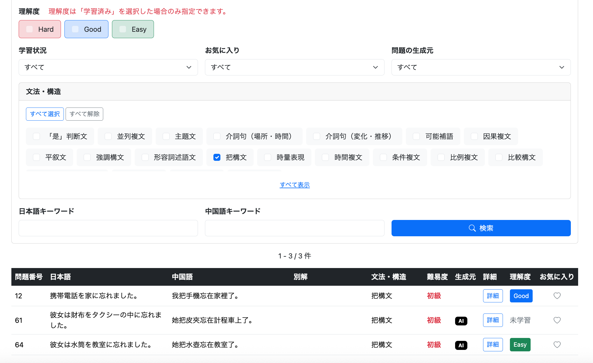

---

# 6-2. AI生成由来の問題を削除できるようにする

```text
git commit -m "feat: allow users to delete their AI-generated questions"
```

AI生成由来の問題はユーザー本人が保存した問題なので、問題一覧から不要な問題を削除できるようにする。

ただし削除できるのは、

```text
AI生成由来
かつ
ログインユーザー自身が所有
```

する問題だけとする。

---

## 6-2-1. 関連レコードを先に削除

`favorite`と`study_history`は`question`を外部キー参照している。

削除時にCASCADEされる設計ではないため、`question`を削除する前に関連レコードを削除する。

### `FavoriteRepository.java`

```java
void deleteByQuestionQuestionId(Long questionId);
```

### `StudyHistoryRepository.java`

```java
void deleteByStudyHistoryKeyQuestionId(Long questionId);
```

---

## 6-2-2. `UserQuestionService`へ削除処理を追加

複数テーブルの削除を1つの処理として実行するため、`@Transactional`を付与する。

```java
@Transactional
public void deleteOneQuestion(
        Long userId,
        Long questionId) {

    Question question =
            questionRepository.findById(questionId)
                    .orElseThrow();

    if (question.isAiGenerated()
            && question.getOwner()
                    .getId()
                    .equals(userId)) {

        favoriteRepository
                .deleteByQuestionQuestionId(questionId);

        studyHistoryRepository
                .deleteByStudyHistoryKeyQuestionId(questionId);

        questionRepository.deleteById(questionId);

        log.info(
                "問題削除 questionId={}",
                questionId
        );
    }
}
```

最初に対象の`Question`を取得し、

```java
question.isAiGenerated()
```

でAI生成由来か、

```java
question.getOwner().getId().equals(userId)
```

でログインユーザー本人が所有しているかを確認する。

条件を満たした場合のみ、

```text
favorite
↓
study_history
↓
question
```

の順番で削除する。

AI生成問題では所有者が設定される設計であり、通常問題については`&&`の左辺が`false`になるため、右辺の`question.getOwner()`は評価されない。

---

## 6-2-3. 削除後も検索条件とページを維持する

問題一覧では複数の検索条件とページングを使用している。

そのため、削除後に単純に、

```text
/user/question/list
```

へ戻すと、ユーザーが指定していた検索条件やページ番号が失われる。

そこで、削除前に開いていたURLを保存し、削除後にそのURLへ戻す。

### `UserQuestionController.getUserQuestionList()`

```java
@GetMapping("/user/question/list")
public String getUserQuestionList(
        @AuthenticationPrincipal UserDetails loginUser,
        @PageableDefault(page = 0, size = 50)
                Pageable pageable,
        @RequestParam(required = false)
                List<Difficulty> difficulties,
        @RequestParam(required = false)
                List<Evaluation> evaluations,
        @RequestParam(required = false)
                StudyCondition studyCondition,
        @RequestParam(required = false)
                FavoriteCondition favoriteCondition,
        @RequestParam(required = false)
                QuestionSourceCondition sourceCondition,
        @RequestParam(required = false)
                List<Long> structureIds,
        @RequestParam(required = false)
                List<LanguageVariant> languageVariants,
        @RequestParam(required = false, defaultValue = "")
                String japaneseKeyword,
        @RequestParam(required = false, defaultValue = "")
                String chineseKeyword,
        HttpSession session,
        HttpServletRequest request,
        Model model) {

    // 現在のURLを取得
    String currentUrl = request.getRequestURI();

    if (request.getQueryString() != null) {
        currentUrl += "?" + request.getQueryString();
    }

    model.addAttribute(
            "currentUrl",
            currentUrl
    );

    // 以下既存処理...
}
```

例えば現在のURLが、

```text
http://localhost:8080/user/question/list?difficulties=BEGINNER&page=2
```

の場合、

```java
request.getRequestURI()
```

では、

```text
/user/question/list
```

を取得する。

一方、

```java
request.getQueryString()
```

では、

```text
difficulties=BEGINNER&page=2
```

を取得する。

これらを結合して、

```text
/user/question/list?difficulties=BEGINNER&page=2
```

を作成し、`currentUrl`として画面へ渡す。

---

## 6-2-4. AI生成問題削除用POSTを追加

### `UserQuestionController.java`

```java
@PostMapping("/user/question/delete")
public String postUserQuestionDelete(
        @AuthenticationPrincipal UserDetails loginUser,
        @RequestParam long questionId,
        @RequestParam String returnUrl,
        RedirectAttributes redirectAttributes,
        Locale locale) {

    // ユーザーIDを取得
    Users user =
            userAccountService.getUserOne(
                    loginUser.getUsername());

    Long userId = user.getId();

    // 削除
    userQuestionService.deleteOneQuestion(
            userId,
            questionId
    );

    redirectAttributes.addFlashAttribute(
            "successMessage",
            messageSource.getMessage(
                    "user.question.delete.success",
                    null,
                    locale
            )
    );

    return "redirect:" + returnUrl;
}
```

ログインユーザーのIDと削除対象の`questionId`をServiceへ渡す。

削除成功後は、

```java
redirectAttributes.addFlashAttribute(...)
```

で成功メッセージを次のリクエストへ渡す。

最後に、

```java
return "redirect:" + returnUrl;
```

として、削除前に開いていた問題一覧へ戻る。

`returnUrl`にはクエリパラメータも含まれているため、検索条件やページ番号を維持できる。

---

## 6-2-5. 問題一覧へ削除ボタンを追加

### `/user/question/list.html`

一覧へ削除列を追加する。

```html
<th class="text-nowrap"
    th:text="#{user.question.list.delete}">
    削除
</th>
```

削除ボタンはAI生成由来の問題にだけ表示する。

```html
<td class="text-center">

    <form th:if="${question.aiGenerated}"
          th:action="@{/user/question/delete}"
          method="post">

        <input type="hidden"
               name="questionId"
               th:value="${question.questionId}">

        <input type="hidden"
               name="returnUrl"
               th:value="${currentUrl}">

        <button type="submit"
                class="btn btn-dark btn-sm"
                th:onclick="|return confirm('#{user.question.delete.confirm}')|">

            <i class="bi bi-trash"></i>

        </button>

    </form>

</td>
```

```html
th:if="${question.aiGenerated}"
```

によって、通常問題には削除ボタンを表示しない。

`questionId`には削除対象の問題IDを設定し、`returnUrl`には現在の検索条件とページ番号を含むURLを設定する。

削除ボタンを押すと`confirm()`を表示し、ユーザーがOKを選択した場合のみPOSTする。

---

## 6-2-6. 削除成功メッセージを表示

一覧画面の上部へFlash Attributeの表示領域を追加する。

```html
<div th:if="${successMessage}"
     class="alert alert-success alert-dismissible fade show"
     role="alert">

    <span th:text="${successMessage}"></span>

    <button type="button"
            class="btn-close"
            data-bs-dismiss="alert"
            aria-label="Close">
    </button>

</div>
```

### `messages.properties`

```properties
user.question.list.delete=削除
user.question.delete.confirm=この問題を削除しますか？
user.question.delete.success=問題を削除しました。
```

---

## 6-2-7. AI生成問題の削除を確認

問題一覧を表示すると、

```text
AI生成由来の問題
→ 削除アイコンあり

通常問題
→ 削除アイコンなし
```

となった。

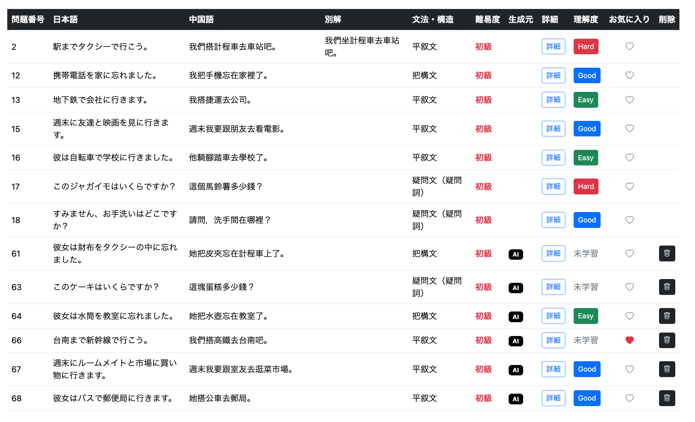

学習済みかつAI生成由来の問題だけに絞り込む。

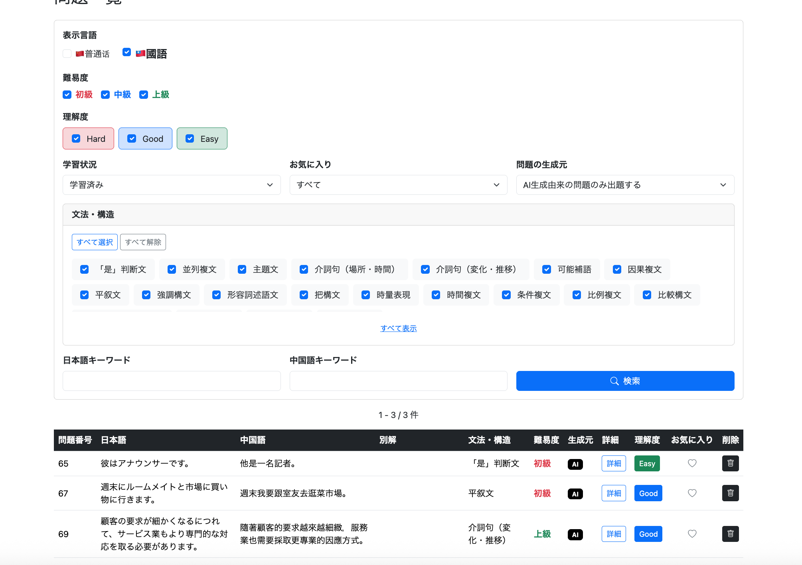

削除アイコンを押すと確認ダイアログが表示される。

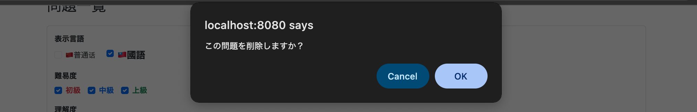

OKを押すと問題が削除され、検索条件を維持したまま同じ問題一覧へ戻り、削除成功メッセージも表示された。

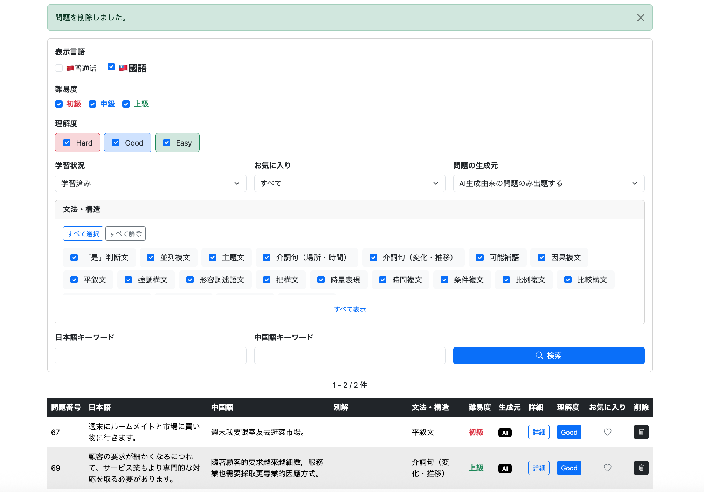

---

# 7. 実装結果

このチャプターによって、前チャプターで保存できるようになったAI生成由来の問題を、既存の学習機能へ統合できた。

通常学習では、

```text
非ログイン
→ 通常問題のみ

ログイン
→ 通常問題 + 自分のAI生成問題
```

となり、ログインユーザーは生成元による絞り込みも行える。

未学習問題についても、自分が所有するAI生成問題が未学習であれば出題対象となる。

復習では、AI生成問題も通常問題と同じように学習履歴から復習でき、生成元による絞り込みにも対応した。

問題一覧では、

```text
通常問題
AI生成問題
```

を見分けられるようになり、さらに自分が所有するAI生成問題を削除できるようになった。

これによって、

```text
AIで問題を生成
↓
必要な問題をQuestionへ保存
↓
通常学習で再学習
↓
理解度を登録
↓
復習
↓
問題一覧で管理
↓
不要になったAI生成問題を削除
```

という一連の流れが既存機能と接続された。