# 022 Admin管理機能の実装

Admin専用機能として、以下のページを実装する。

1.  Adminメニューページ\
    下記の各種Admin機能へ遷移するためのメニューページ。

2.  Admin用問題一覧ページ\
    条件を指定して問題を検索し、問題一覧の閲覧や削除を行うページ。

3.  問題追加ページ\
    新しい問題を追加するページ。

4.  問題編集ページ\
    既存の問題の詳細を確認し、内容を編集するページ。\
    ただし、AI生成由来の問題は編集対象外とする。

5.  ユーザー管理ページ\
    ユーザーを検索して一覧やユーザー情報を確認し、アカウントの凍結・凍結解除・削除を行うページ。

6.  文法・構造管理ページ\
    文法・構造の一覧を確認し、新規追加・編集・削除を行うページ。

# 実装に先立って

Admin画面は管理者向け機能であるため、画面上の文章は日本語固定とし、基本的に`messages.properties`による多言語化は行わない。

# 準備

Admin専用機能の実装・動作確認を行うため、`ROLE`が`ADMIN`のユーザーを作成する。

-   login_id：`mawsonlakes_admin`
-   password：`mawsonlakes_admin`
-   role：`ADMIN`

# 1. Adminメニューページ

``` text
git commit -m "feat: add admin menu page"
```

## AdminController

``` java
@Controller
public class AdminController {
    
    @GetMapping("/admin/menu")
    public String getAdminMenu() {
        return "admin/menu";
    }

}
```

## /admin/menu.html

``` html
<div layout:fragment="content"
     class="container pt-3">
     
    <div class="row justify-content-center">
        <div class="col-12 col-md-8 col-lg-6">     
     

            <h2>アドミン専用画面</h2>
        
            <div class="list-group mt-3">
        
                <!-- ユーザー管理 -->
                <a th:href="@{/admin/user/list}"
                   class="list-group-item list-group-item-action">
        
                    <i class="bi bi-person-fill me-2"></i>
                    ユーザー管理
        
                </a>
        
                <!-- 問題一覧 -->
                <a th:href="@{/admin/question/list}"
                   class="list-group-item list-group-item-action">
        
                    <i class="bi bi-card-list me-2"></i>
                    問題管理
        
                </a>
        
                <!-- 問題追加 -->
                <a th:href="@{/admin/question/add}"
                   class="list-group-item list-group-item-action">
        
                    <i class="bi bi-plus-circle me-2"></i>
                    問題追加
        
                </a>
        
            </div>
            
            <div class="text-center mt-3">
                <a th:href="@{/user/menu}"
                   class="btn btn-secondary">
                    userメニューに戻る
                </a>
            </div>
        </div>
    </div>
</div>
```

## /user/menu.html

すでに

``` html
                <a th:href="@{/admin/menu}"
                   class="list-group-item list-group-item-action"
                   sec:authorize="hasRole('ROLE_ADMIN')">
                    <i class="bi bi-shield-lock-fill me-2"></i>
                    <span th:text="#{user.menu.admin}">
                        アドミン権限専用画面
                    </span>
                </a>
```

を書いているので追加修正の必要はない

## 実行

ROLE_ADMINのユーザーで http://localhost:8080/user/menu
にアクセスすると、

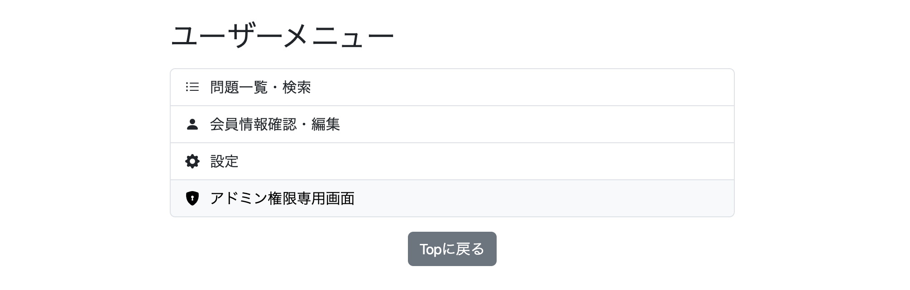

とADMIN専用メニューへのリンクが表示され、アドミン専用画面に遷移した

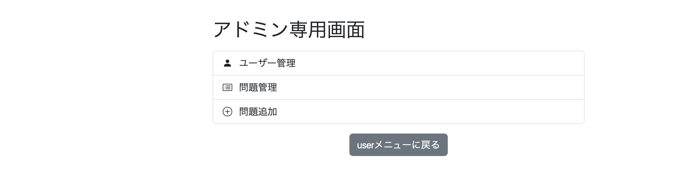

# 2. Admin用問題一覧ページ

Admin用問題一覧ページはUser用問題一覧ページと似た構成とするが、以下の点が異なる。 
-　全Userが所有するAI生成由来の問題も表示できる。 
-　AI生成由来の問題は所有者も表示する。ただし、所有者のIDやログインIDによる絞り込みは行わない。
-　理解度とお気に入りの登録状況による条件絞り込みは行わない。 
-　普通話と國語は、両方表示することも、いずれか一方のみ表示することもできる。

# 2-1. 問題一覧ページ及び検索機能

``` text
git commit -m "feat: add admin question list and search functionality"
```

Repositoryで取得した結果は`Page<Question>`として返す方法も考えられるが、AI生成由来の問題の所有者を表示するには`users`テーブルをJOINする必要があるため、ここではDTOを使用する。

## AdminQuestionListDto

``` java
public interface AdminQuestionListDto {

    Long getQuestionId();

    LanguageVariant getLanguageVariant();

    String getChineseText();

    String getJapaneseText();

    Difficulty getDifficulty();

    String getStructureName();

    boolean isAiGenerated();

    String getOwnerLoginId();

}
```

`AdminQuestionListDto`はクラスではなくインターフェースとして定義する。

通常、インターフェースはメソッドの定義だけを持つため、そのままではオブジェクトを作成できず、実際の処理を記述した実装クラスが必要となる。

しかし、Spring Data JPAではRepositoryの戻り値としてこのようなインターフェースを指定すると、検索結果を受け取るための実装をSpring側が実行時に自動生成する。

例えば、Native Queryで、

```sql
q.question_id AS questionId
```

として取得した値は、

```java
Long getQuestionId();
```

に対応する。

同様に、

```sql
u.login_id AS ownerLoginId
```

として取得した値は、

```java
String getOwnerLoginId();
```

に対応する。

このように、SQLの`AS`で指定した別名とgetterが表すプロパティ名を対応させることで、検索結果をインターフェース経由で取得できる。

Springが実行時に生成する、このインターフェースを実装した代理オブジェクトを**Proxyオブジェクト**という。

また、このようにEntity全体ではなく、必要な項目だけをインターフェースで定義して検索結果を受け取るSpring Data JPAの仕組みを**Interface-based Projection**という。

そのため、`AdminQuestionListDto`ではDTOの実装クラスやコンストラクタを別途用意する必要がない。

## QuestionRepository

``` java
    @Query(
            value = """
            SELECT
                q.question_id      AS questionId,
                q.language_variant AS languageVariant,
                q.chinese_text     AS chineseText,
                q.japanese_text    AS japaneseText,
                q.difficulty       AS difficulty,
                s.name             AS structureName,
                q.ai_generated     AS aiGenerated,
                u.login_id         AS ownerLoginId

            FROM question q

            JOIN structure s
                ON q.structure_id = s.structure_id

            LEFT JOIN users u
                ON q.owner_user_id = u.id

            WHERE q.difficulty IN (:difficulties)

            AND (
                :sourceCondition = 'ALL'
                OR (:sourceCondition = 'ORIGINAL_ONLY' AND q.ai_generated = false)
                OR (:sourceCondition = 'GENERATED_ONLY' AND q.ai_generated = true)
            )

            AND q.structure_id IN (:structureIds)
            AND q.language_variant IN (:languageVariants)

            AND (
                :japaneseKeyword = ''
                OR LOWER(q.japanese_text)
                    LIKE LOWER(CONCAT('%', :japaneseKeyword, '%'))
            )

            AND (
                :chineseKeyword = ''
                OR LOWER(q.chinese_text)
                    LIKE LOWER(CONCAT('%', :chineseKeyword, '%'))
                OR LOWER(q.alternative_answer)
                    LIKE LOWER(CONCAT('%', :chineseKeyword, '%'))
            )

            ORDER BY q.question_id DESC
            """,
            countQuery = """
                SELECT COUNT(*)
                FROM question q
                WHERE q.difficulty IN (:difficulties)
                AND (
                    :sourceCondition = 'ALL'
                    OR (:sourceCondition = 'ORIGINAL_ONLY' AND q.ai_generated = false)
                    OR (:sourceCondition = 'GENERATED_ONLY' AND q.ai_generated = true)
                )
                AND q.structure_id IN (:structureIds)
                AND q.language_variant IN (:languageVariants)
                AND (
                    :japaneseKeyword = ''
                    OR LOWER(q.japanese_text)
                        LIKE LOWER(CONCAT('%', :japaneseKeyword, '%'))
                )
    
                AND (
                    :chineseKeyword = ''
                    OR LOWER(q.chinese_text)
                        LIKE LOWER(CONCAT('%', :chineseKeyword, '%'))
                    OR LOWER(q.alternative_answer)
                        LIKE LOWER(CONCAT('%', :chineseKeyword, '%'))
                )
                """,
            nativeQuery = true
        )
        Page<AdminQuestionListDto> findFilteredAdminQuestionList(
                @Param("difficulties") List<String> difficulties,
                @Param("sourceCondition") String sourceCondition,
                @Param("structureIds") List<Long> structureIds,
                @Param("languageVariants") List<String> languageVariants,
                @Param("japaneseKeyword") String japaneseKeyword,
                @Param("chineseKeyword") String chineseKeyword,
                Pageable pageable
        );
```

### Admin用問題一覧の取得

Admin用問題一覧では、管理者がすべての問題を検索・閲覧できるように、問題情報に構文名とOwner情報を加えて取得する。

#### SELECT

```sql
SELECT
    q.question_id      AS questionId,
    q.language_variant AS languageVariant,
    q.chinese_text     AS chineseText,
    q.japanese_text    AS japaneseText,
    q.difficulty       AS difficulty,
    s.name             AS structureName,
    q.ai_generated     AS aiGenerated,
    u.login_id         AS ownerLoginId
```

問題一覧の表示に必要な情報を取得する。`AS`の別名は、`AdminQuestionListDto`のgetterと対応する名前にしている。

#### JOIN

問題一覧では、文法・構造名とAI生成由来の問題のOwnerを取得するため、`structure`テーブルと`users`テーブルを結合する。

```sql
JOIN structure s
    ON q.structure_id = s.structure_id

LEFT JOIN users u
    ON q.owner_user_id = u.id
```

`structure`テーブルは、`question`が持つ`structure_id`から文法・構造名を取得するためにJOINする。

`users`テーブルは、AI生成由来の問題のOwnerの`login_id`を取得するために結合する。通常問題は`owner_user_id`を持たないため、`LEFT JOIN`とすることでOwnerが存在しない通常問題も取得対象に含める。

#### WHERE

```sql
AND (
    :sourceCondition = 'ALL'
    OR (:sourceCondition = 'ORIGINAL_ONLY' AND q.ai_generated = false)
    OR (:sourceCondition = 'GENERATED_ONLY' AND q.ai_generated = true)
)

AND q.structure_id IN (:structureIds)
AND q.language_variant IN (:languageVariants)
```

問題の生成元、文法・構造、言語で絞り込む。

また、日本語・中国語のキーワードによる部分一致検索も行う。

## AdminQuestionService

```java

@Service
@RequiredArgsConstructor
public class AdminQuestionService {
    
    private final StructureRepository structureRepository;
    private final SearchConditionConverter searchConditionConverter;
    private final QuestionRepository questionRepository;

    public Page<AdminQuestionListDto> getFilteredAdminQuestions(
            List<Difficulty> difficulties,
            QuestionSourceCondition sourceCondition,
            List<Long> structureIds,
            List<LanguageVariant> languageVariants,
            String japaneseKeyword,
            String chineseKeyword,
            Pageable pageable) {
        
        // 言語未選択なら全言語
        if (languageVariants == null || languageVariants.isEmpty()) {
            languageVariants = Arrays.asList(LanguageVariant.values());
        }

        // 難易度未選択なら全難易度
        if (difficulties == null || difficulties.isEmpty()) {
            difficulties = Arrays.asList(Difficulty.values());
        }
        
        // 文法・構造未選択ならすべて選択
        if (structureIds == null || structureIds.isEmpty()) {
            structureIds = structureRepository.findAllStructureIds();
        }
        
        // キーワード未記入なら空白
        if (japaneseKeyword == null) {
        japaneseKeyword = "";
        }
        
        if (chineseKeyword == null) {
        chineseKeyword = "";
        }
        
        // 問題の生成元が未指定の場合はすべて
        if (sourceCondition == null) {
            sourceCondition = QuestionSourceCondition.ALL;
        }

        return questionRepository.findFilteredAdminQuestionList(
                searchConditionConverter.convertDifficulty(difficulties),
                sourceCondition.name(),
                structureIds,
                searchConditionConverter.convertLanguageVariant(languageVariants),
                japaneseKeyword,
                chineseKeyword,
                pageable);
    }
}
```

## AdminQuestionController

```java

    @GetMapping("/admin/question/search")
    public String getAdminQuestionSearch(
            @PageableDefault(page = 0, size = 50) Pageable pageable,
            @RequestParam(required = false) List<Difficulty> difficulties,
            @RequestParam(required = false) QuestionSourceCondition sourceCondition,
            @RequestParam(required = false) List<Long> structureIds,
            @RequestParam(required = false) List<LanguageVariant> languageVariants,
            @RequestParam(required = false, defaultValue = "") String japaneseKeyword,
            @RequestParam(required = false, defaultValue = "") String chineseKeyword,
            HttpSession session,
            HttpServletRequest request,
            Model model) {
        
        Page<AdminQuestionListDto> allFilteredQuestionList = 
                adminQuestionService.getFilteredAdminQuestions(
                        difficulties,
                        sourceCondition,
                        structureIds,
                        languageVariants,
                        japaneseKeyword,
                        chineseKeyword,
                        pageable
                        );
                        
        PaginationDto pagination = paginationService.createPagination(allFilteredQuestionList);
        
        long start = allFilteredQuestionList.getNumber() * allFilteredQuestionList.getSize() + 1;
        long end = start + allFilteredQuestionList.getNumberOfElements() - 1;
        
        // ページ情報
        model.addAttribute("start", start);
        model.addAttribute("end", end);
        model.addAttribute("total", allFilteredQuestionList.getTotalElements());

        model.addAttribute("questionList", allFilteredQuestionList.getContent());
        model.addAttribute("page", allFilteredQuestionList);
        model.addAttribute("pagination", pagination);

        // 検索条件
        model.addAttribute("selectedDifficulties", difficulties);
        model.addAttribute("selectedSourceCondition", sourceCondition);
        model.addAttribute("selectedStructureIds", structureIds);
        model.addAttribute("selectedLanguageVariants", languageVariants);
        model.addAttribute("japaneseKeyword", japaneseKeyword);
        model.addAttribute("chineseKeyword", chineseKeyword);

        // 構文一覧
        model.addAttribute(
                "structures",
                reviewService.findStructures());
        
        return "/admin/question/list";
        
    }
```

内容はUserQuestionControllerのものを踏襲している。

## /admin/question/list.html

``` html

<!DOCTYPE html>

<html xmlns:th="http://www.thymeleaf.org"
      xmlns:layout="http://www.ultraq.net.nz/thymeleaf/layout"
      layout:decorate="~{layout/layout}">

<head>

    <meta charset="UTF-8">

    <title>Admin 問題管理</title>

    <link rel="stylesheet"
          href="https://cdn.jsdelivr.net/npm/bootstrap-icons@1.13.1/font/bootstrap-icons.min.css">

    <link rel="stylesheet"
          th:href="@{/css/user/question/list.css}">

    <script th:src="@{/js/admin/question/list.js}"
            defer>
    </script>

</head>

<body>

<div layout:fragment="content"
     class="w-100">

    <h2 class="mb-4">
        問題管理
    </h2>

    <!-- ========================= -->
    <!-- 検索フォーム -->
    <!-- ========================= -->

    <form th:action="@{/admin/question/list}"
          method="get"
          class="card p-3 mb-3">

        <div class="row g-3">

            <!-- ========================= -->
            <!-- 言語 -->
            <!-- ========================= -->

            <div class="col-md-12">

                <label class="form-label fw-bold">
                    言語
                </label>

                <div class="d-flex align-items-center gap-4">

                    <!-- 普通話 -->

                    <div class="form-check">

                        <input class="form-check-input"
                               type="checkbox"
                               name="languageVariants"
                               value="MAINLAND"
                               id="mainland"
                               th:checked="${selectedLanguageVariants == null
                                   or selectedLanguageVariants.![name()].contains('MAINLAND')}">

                        <label class="form-check-label"
                               for="mainland">
                            🇨🇳普通话
                        </label>

                    </div>

                    <!-- 國語 -->

                    <div class="form-check">

                        <input class="form-check-input"
                               type="checkbox"
                               name="languageVariants"
                               value="TAIWAN"
                               id="taiwan"
                               th:checked="${selectedLanguageVariants == null
                                   or selectedLanguageVariants.![name()].contains('TAIWAN')}">

                        <label class="form-check-label"
                               for="taiwan">
                            🇹🇼國語
                        </label>

                    </div>

                </div>

            </div>


            <!-- ========================= -->
            <!-- 難易度 -->
            <!-- ========================= -->

            <div class="col-md-12">

                <label class="form-label fw-bold">
                    難易度
                </label>

                <div class="d-flex gap-3">

                    <!-- 初級 -->

                    <div class="form-check">

                        <input class="form-check-input"
                               type="checkbox"
                               name="difficulties"
                               value="BEGINNER"
                               id="beginner"
                               th:checked="${selectedDifficulties == null
                                   or selectedDifficulties.![name()].contains('BEGINNER')}">

                        <label class="form-check-label text-danger fw-bold"
                               for="beginner">
                            初級
                        </label>

                    </div>

                    <!-- 中級 -->

                    <div class="form-check">

                        <input class="form-check-input"
                               type="checkbox"
                               name="difficulties"
                               value="INTERMEDIATE"
                               id="intermediate"
                               th:checked="${selectedDifficulties == null
                                   or selectedDifficulties.![name()].contains('INTERMEDIATE')}">

                        <label class="form-check-label text-primary fw-bold"
                               for="intermediate">
                            中級
                        </label>

                    </div>

                    <!-- 上級 -->

                    <div class="form-check">

                        <input class="form-check-input"
                               type="checkbox"
                               name="difficulties"
                               value="ADVANCED"
                               id="advanced"
                               th:checked="${selectedDifficulties == null
                                   or selectedDifficulties.![name()].contains('ADVANCED')}">

                        <label class="form-check-label text-success fw-bold"
                               for="advanced">
                            上級
                        </label>

                    </div>

                </div>

            </div>


            <!-- ========================= -->
            <!-- 問題の生成元 -->
            <!-- ========================= -->

            <div class="col-md-4">

                <label class="form-label fw-bold">
                    問題の生成元
                </label>

                <select class="form-select"
                        name="sourceCondition">

                    <option value="ALL"
                            th:selected="${selectedSourceCondition == null
                                or selectedSourceCondition.name() == 'ALL'}">
                        すべて
                    </option>

                    <option value="ORIGINAL_ONLY"
                            th:selected="${selectedSourceCondition != null
                                and selectedSourceCondition.name() == 'ORIGINAL_ONLY'}">
                        通常問題のみ
                    </option>

                    <option value="GENERATED_ONLY"
                            th:selected="${selectedSourceCondition != null
                                and selectedSourceCondition.name() == 'GENERATED_ONLY'}">
                        AI生成問題のみ
                    </option>

                </select>

            </div>


            <!-- ========================= -->
            <!-- 文法・構造 -->
            <!-- ========================= -->

            <div class="col-12">

                <div class="card">

                    <div class="card-header fw-bold">
                        文法・構造
                    </div>

                    <div class="card-body">

                        <!-- 一括操作 -->

                        <div class="mb-3">

                            <button type="button"
                                    id="selectAllStructures"
                                    class="btn btn-outline-primary btn-sm">
                                すべて選択
                            </button>

                            <button type="button"
                                    id="clearAllStructures"
                                    class="btn btn-outline-secondary btn-sm">
                                すべて解除
                            </button>

                        </div>

                        <!-- 文法・構造一覧 -->

                        <div id="structureList"
                             class="d-flex flex-wrap gap-2 structure-list">

                            <label th:each="structure : ${structures}"
                                   class="bg-light rounded px-3 py-2">

                                <input class="form-check-input me-2"
                                       type="checkbox"
                                       name="structureIds"
                                       th:value="${structure.structureId}"
                                       th:checked="${selectedStructureIds == null
                                           or selectedStructureIds.contains(structure.structureId)}">

                                <span th:text="${structure.name}">
                                    文法・構造
                                </span>

                            </label>

                        </div>

                        <!-- 展開・折りたたみ -->

                        <div class="text-center mt-3">

                            <button type="button"
                                    id="toggleStructures"
                                    class="btn btn-link btn-sm"
                                    data-show-text="すべて表示"
                                    data-hide-text="折りたたむ">
                                すべて表示
                            </button>

                        </div>

                    </div>

                </div>

            </div>


            <!-- ========================= -->
            <!-- 日本語キーワード -->
            <!-- ========================= -->

            <div class="col-md-4">

                <label class="form-label fw-bold">
                    日本語キーワード
                </label>

                <input class="form-control"
                       type="text"
                       name="japaneseKeyword"
                       th:value="${japaneseKeyword}">

            </div>


            <!-- ========================= -->
            <!-- 中国語キーワード -->
            <!-- ========================= -->

            <div class="col-md-4">

                <label class="form-label fw-bold">
                    中国語キーワード
                </label>

                <input class="form-control"
                       type="text"
                       name="chineseKeyword"
                       th:value="${chineseKeyword}">

            </div>


            <!-- ========================= -->
            <!-- 検索ボタン -->
            <!-- ========================= -->

            <div class="col-md-4 d-grid align-self-end">

                <button class="btn btn-primary"
                        type="submit">

                    <i class="bi bi-search me-1"></i>
                    検索

                </button>

            </div>

        </div>

    </form>


    <!-- ========================= -->
    <!-- 件数 -->
    <!-- ========================= -->

    <div class="text-center mb-3"
         th:if="${total > 0}">

        <span th:text="${start}"></span>
        -
        <span th:text="${end}"></span>
        /
        <span th:text="${total}"></span>
        件

    </div>

    <div class="text-center mb-3"
         th:if="${total == 0}">
        0件
    </div>


    <!-- ========================= -->
    <!-- 問題一覧 -->
    <!-- ========================= -->

    <div class="table-responsive">

        <table class="table table-hover align-middle">

            <thead class="table-dark">

            <tr>

                <th class="text-nowrap">
                    問題ID
                </th>

                <th class="text-nowrap">
                    言語
                </th>

                <th>
                    中国語
                </th>

                <th>
                    日本語
                </th>

                <th class="text-nowrap">
                    難易度
                </th>

                <th class="text-nowrap">
                    文法・構造
                </th>

                <th class="text-nowrap">
                    生成元
                </th>

                <th class="text-nowrap">
                    所有者
                </th>

                <th class="text-nowrap">
                    詳細・編集
                </th>

                <th class="text-nowrap">
                    削除
                </th>

            </tr>

            </thead>

            <tbody>

            <tr th:each="question : ${questionList}">

                <!-- 問題ID -->

                <td th:text="${question.questionId}">
                </td>


                <!-- 言語 -->

                <td class="text-nowrap">

                    <span th:if="${question.languageVariant.name() == 'MAINLAND'}">
                        🇨🇳 普通話
                    </span>

                    <span th:if="${question.languageVariant.name() == 'TAIWAN'}">
                        🇹🇼 國語
                    </span>

                </td>


                <!-- 中国語 -->

                <td th:text="${question.chineseText}">
                </td>


                <!-- 日本語 -->

                <td th:text="${question.japaneseText}">
                </td>


                <!-- 難易度 -->

                <td>

                    <span class="text-danger fw-bold"
                          th:if="${question.difficulty.name() == 'BEGINNER'}">
                        初級
                    </span>

                    <span class="text-primary fw-bold"
                          th:if="${question.difficulty.name() == 'INTERMEDIATE'}">
                        中級
                    </span>

                    <span class="text-success fw-bold"
                          th:if="${question.difficulty.name() == 'ADVANCED'}">
                        上級
                    </span>

                </td>


                <!-- 文法・構造 -->

                <td th:text="${question.structureName}">
                </td>


                <!-- 生成元 -->

                <td class="text-center">

                    <span th:if="${question.aiGenerated}"
                          class="badge bg-dark">
                        AI
                    </span>

                    <span th:unless="${question.aiGenerated}"
                          class="badge bg-secondary">
                        通常
                    </span>

                </td>


                <!-- Owner -->

                <td>

                    <span th:if="${question.ownerLoginId != null}"
                          th:text="${question.ownerLoginId}">
                    </span>

                    <span th:if="${question.ownerLoginId == null}"
                          class="text-secondary">
                        -
                    </span>

                </td>


                <!-- 編集 -->

                <td class="text-center">

                    <a th:href="@{/admin/question/edit(
                            questionId=${question.questionId}
                        )}"
                       class="btn btn-outline-primary btn-sm">

                        <i class="bi bi-pencil-square"></i>

                    </a>

                </td>


                <!-- 削除 -->

                <td class="text-center">

                    <form th:action="@{/admin/question/delete}"
                          method="post">

                        <input type="hidden"
                               name="questionId"
                               th:value="${question.questionId}">

                        <button type="submit"
                                class="btn btn-danger btn-sm"
                                onclick="return confirm('この問題を削除しますか？')">

                            <i class="bi bi-trash"></i>

                        </button>

                    </form>

                </td>

            </tr>

            </tbody>

        </table>

    </div>


    <!-- ========================= -->
    <!-- ページネーション -->
    <!-- ========================= -->

    <nav class="mt-4 mb-5"
         th:if="${page.totalPages > 0}">

        <ul class="pagination justify-content-center">

            <!-- 前へ -->

            <li class="page-item"
                th:classappend="${page.first} ? ' disabled'">

                <a class="page-link"
                   th:href="@{/admin/question/list(
                       page=${page.number - 1},
                       size=${page.size},
                       difficulties=${selectedDifficulties},
                       sourceCondition=${selectedSourceCondition},
                       structureIds=${selectedStructureIds},
                       languageVariants=${selectedLanguageVariants},
                       japaneseKeyword=${japaneseKeyword},
                       chineseKeyword=${chineseKeyword}
                   )}">
                    前へ
                </a>

            </li>


            <!-- 1ページ目 -->

            <li class="page-item"
                th:classappend="${page.number == 0} ? ' active'">

                <a class="page-link"
                   th:href="@{/admin/question/list(
                       page=0,
                       size=${page.size},
                       difficulties=${selectedDifficulties},
                       sourceCondition=${selectedSourceCondition},
                       structureIds=${selectedStructureIds},
                       languageVariants=${selectedLanguageVariants},
                       japaneseKeyword=${japaneseKeyword},
                       chineseKeyword=${chineseKeyword}
                   )}">
                    1
                </a>

            </li>


            <!-- ... 先頭側 -->

            <li class="page-item disabled"
                th:if="${pagination.showFirstEllipsis}">

                <span class="page-link">...</span>

            </li>


            <!-- 中央のページ番号 -->

            <li class="page-item"
                th:each="i : ${#numbers.sequence(
                    pagination.displayStartPage,
                    pagination.displayEndPage)}"
                th:if="${i != 0 and i != page.totalPages - 1}"
                th:classappend="${i == pagination.currentPage} ? ' active'">

                <a class="page-link"
                   th:href="@{/admin/question/list(
                       page=${i},
                       size=${page.size},
                       difficulties=${selectedDifficulties},
                       sourceCondition=${selectedSourceCondition},
                       structureIds=${selectedStructureIds},
                       languageVariants=${selectedLanguageVariants},
                       japaneseKeyword=${japaneseKeyword},
                       chineseKeyword=${chineseKeyword}
                   )}"
                   th:text="${i + 1}">
                </a>

            </li>


            <!-- ... 末尾側 -->

            <li class="page-item disabled"
                th:if="${pagination.showLastEllipsis}">

                <span class="page-link">...</span>

            </li>


            <!-- 最終ページ -->

            <li class="page-item"
                th:if="${page.totalPages > 1}"
                th:classappend="${page.last} ? ' active'">

                <a class="page-link"
                   th:href="@{/admin/question/list(
                       page=${page.totalPages - 1},
                       size=${page.size},
                       difficulties=${selectedDifficulties},
                       sourceCondition=${selectedSourceCondition},
                       structureIds=${selectedStructureIds},
                       languageVariants=${selectedLanguageVariants},
                       japaneseKeyword=${japaneseKeyword},
                       chineseKeyword=${chineseKeyword}
                   )}"
                   th:text="${page.totalPages}">
                </a>

            </li>


            <!-- 次へ -->

            <li class="page-item"
                th:classappend="${page.last} ? ' disabled'">

                <a class="page-link"
                   th:href="@{/admin/question/list(
                       page=${page.number + 1},
                       size=${page.size},
                       difficulties=${selectedDifficulties},
                       sourceCondition=${selectedSourceCondition},
                       structureIds=${selectedStructureIds},
                       languageVariants=${selectedLanguageVariants},
                       japaneseKeyword=${japaneseKeyword},
                       chineseKeyword=${chineseKeyword}
                   )}">
                    次へ
                </a>

            </li>

        </ul>

    </nav>


    <!-- ========================= -->
    <!-- 戻る -->
    <!-- ========================= -->

    <div class="text-center mt-3 mb-3">

        <a th:href="@{/admin/menu}"
           class="btn btn-secondary">

            Adminメニューに戻る

        </a>

    </div>

</div>

</body>

</html>
```

Admin用問題一覧画面として、検索フォーム、検索結果の一覧表示、ページネーションを実装する。

検索フォームでは、言語、難易度、問題の生成元、文法・構造、日本語・中国語キーワードを指定できる。

一覧には問題の基本情報に加えて生成元とOwnerを表示し、各問題の編集・削除も行えるようにする。


## /admin/question/list.js

``` js

    // =========================
    // 文法・構造の一括選択
    // =========================
    
    const selectAllStructuresButton =
        document.getElementById("selectAllStructures");
    
    const clearAllStructuresButton =
        document.getElementById("clearAllStructures");
    
    const structureCheckboxes =
        document.querySelectorAll("input[name='structureIds']");
    
    
    // すべて選択
    selectAllStructuresButton.addEventListener("click", () => {
    
        structureCheckboxes.forEach(checkbox => {
            checkbox.checked = true;
        });
    
    });
    
    
    // すべて解除
    clearAllStructuresButton.addEventListener("click", () => {
    
        structureCheckboxes.forEach(checkbox => {
            checkbox.checked = false;
        });
    
    });
    
    
    // =========================
    // 文法・構造欄表示
    // =========================
    
    const structureList =
        document.getElementById("structureList");
    
    const toggleStructuresButton =
        document.getElementById("toggleStructures");
    
    toggleStructuresButton.addEventListener("click", () => {
    
        const expanded =
            structureList.classList.toggle("expanded");
    
        toggleStructuresButton.textContent =
            expanded
                ? toggleStructuresButton.dataset.hideText
                : toggleStructuresButton.dataset.showText;
    
    });  

```

これは/user/question/list.jsの一部をほぼそのまま抜粋している

## 実行

Admin用問題一覧ページを表示し、登録されている問題が一覧に表示されることを確認した。

また、指定した検索条件に応じて問題が正しく絞り込まれることを確認した。

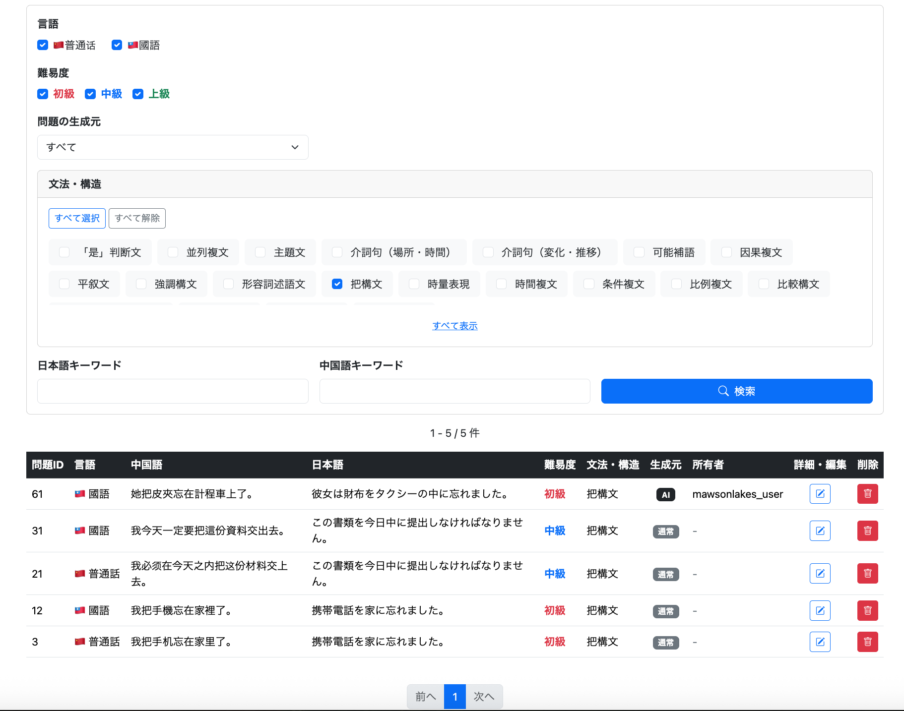


# 2-2. 削除機能の実装

```text
git commit -m "feat: add admin question deletion functionality"
```

Admin用問題一覧ページから問題を削除できるようにする。

## 各種Repository

問題削除に必要なRepositoryの処理は、ユーザーが自身のAI生成由来の問題を削除する機能で実装済みのため、今回は追加しない。

## AdminQuestionService

```java
@Transactional
public void deleteOneQuestion(Long questionId) {

    favoriteRepository.deleteByQuestionQuestionId(questionId);

    studyHistoryRepository.deleteByStudyHistoryKeyQuestionId(questionId);

    questionRepository.deleteById(questionId);

    log.info("問題削除 questionId={}", questionId);

}
```

`deleteOneQuestion`では、削除する問題に紐づくお気に入りと学習履歴を先に削除してから、問題本体を削除する。

## AdminQuestionController

### 問題を削除する`postAdminQuestionDelete`

```java
@PostMapping("/admin/question/delete")
public String postAdminQuestionDelete(
        @RequestParam long questionId,
        @RequestParam String returnUrl,
        RedirectAttributes redirectAttributes) {

    adminQuestionService.deleteOneQuestion(questionId);

    redirectAttributes.addFlashAttribute(
            "successMessage",
            "問題を削除しました。");

    return "redirect:" + returnUrl;

}
```

問題削除後もAdminユーザーが指定した検索条件やページ番号を維持するため、リダイレクト先として削除前の問題一覧ページのURLを`returnUrl`で受け取る。

### 問題一覧を表示する`getAdminQuestionList`

`getAdminQuestionList`に、現在のURLを取得する処理を追加する。

```java
@GetMapping("/admin/question/list")
public String getAdminQuestionList(
        ...(中略)...
        ) {

    // 現在のURLを取得
    String currentUrl = request.getRequestURI();

    if (request.getQueryString() != null) {
        currentUrl += "?" + request.getQueryString();
    }

    model.addAttribute("currentUrl", currentUrl);

    ...(中略)...

}
```

現在のパスとクエリパラメータを結合して`currentUrl`を作成し、削除後の戻り先として使用できるようにModelへ追加する。

## /admin/question/list.html

削除フォームに`returnUrl`を追加する。

```html
<form th:action="@{/admin/question/delete}"
      method="post">

    <input type="hidden"
           name="questionId"
           th:value="${question.questionId}">

    <input type="hidden"
           name="returnUrl"
           th:value="${currentUrl}">

    <button type="submit"
            class="btn btn-danger btn-sm"
            onclick="return confirm('この問題を削除しますか？')">

        <i class="bi bi-trash"></i>

    </button>

</form>
```

`questionId`とともに、検索条件やページ番号を含む現在のURLを`returnUrl`として送信する。これにより、削除後も同じ条件の問題一覧ページへ戻ることができる。

また、削除成功時のメッセージを表示する。

```html
<!-- 削除成功時のメッセージ表示 -->
<div th:if="${successMessage}"
     class="alert alert-success alert-dismissible fade show"
     role="alert">

    <span th:text="${successMessage}"></span>

    <button type="button"
            class="btn-close"
            data-bs-dismiss="alert"
            aria-label="Close">
    </button>

</div>
```

## 実行

検索条件を指定した状態で、問題一覧から問題を削除する。

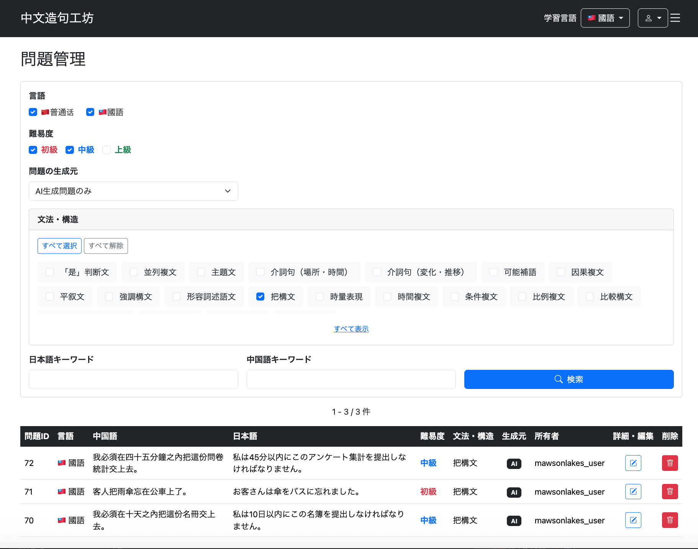

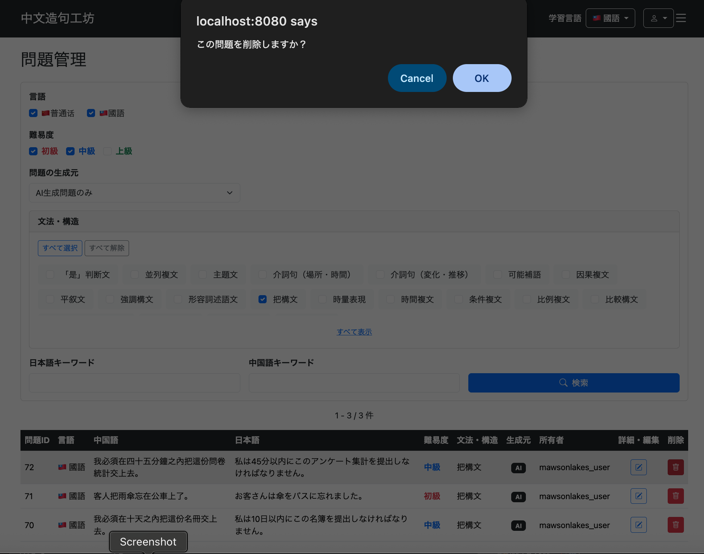

問題が削除され、削除成功のメッセージが表示されることを確認した。また、削除後も検索条件が維持され、削除前と同じ条件の問題一覧へ戻ることを確認した。

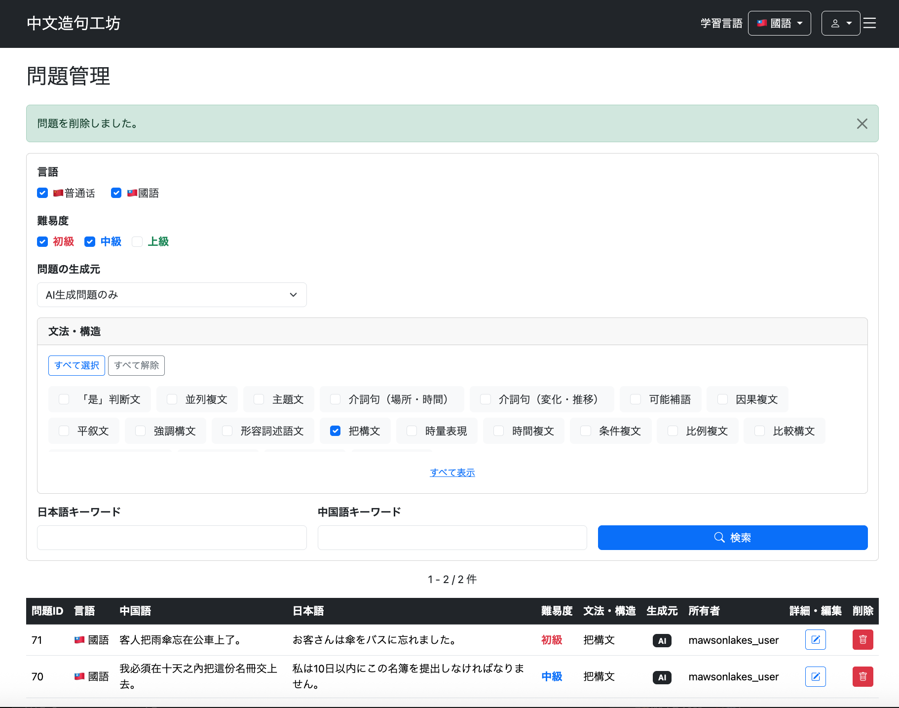

# 2-3. 追加修正 - 問題の表示順を見直す

問題を新規追加した場合、`question_id`には新しい値が割り当てられ、問題一覧も`question_id DESC`で取得しているため、追加した問題は一覧の先頭に表示される。

そのため、新規追加した問題をすぐに一覧画面で確認できる。

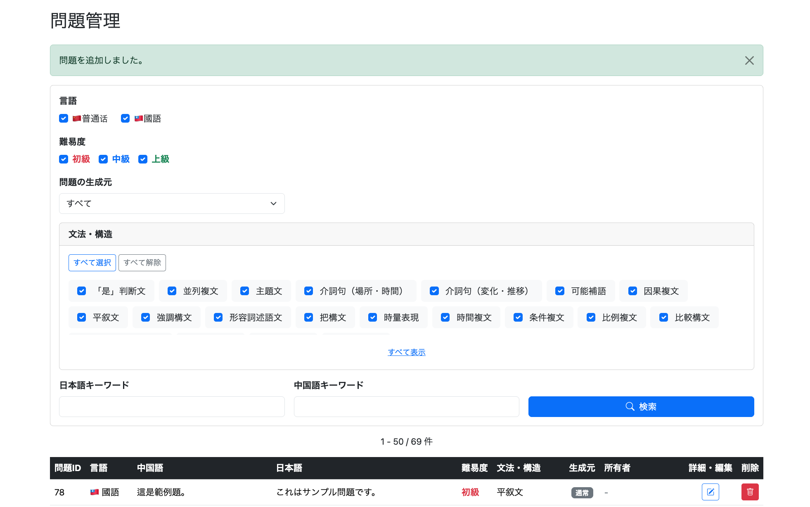

一方、既存の問題を編集しても`question_id`は変わらない。そのため、古い問題を編集した場合は一覧の先頭には表示されず、編集結果をすぐに確認しにくい。

例として、既存問題の「北京」を「深圳」に変更する。

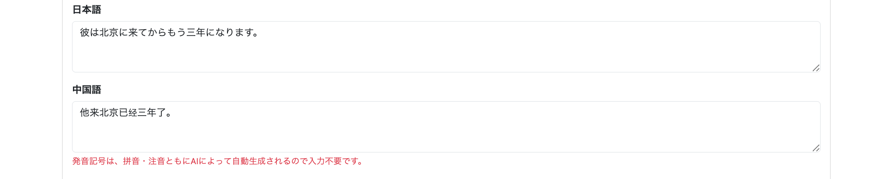

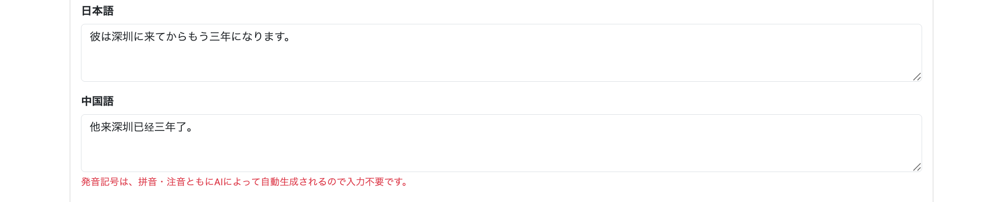

編集は反映されるが、`question_id`が変わらないため一覧の先頭には表示されない。

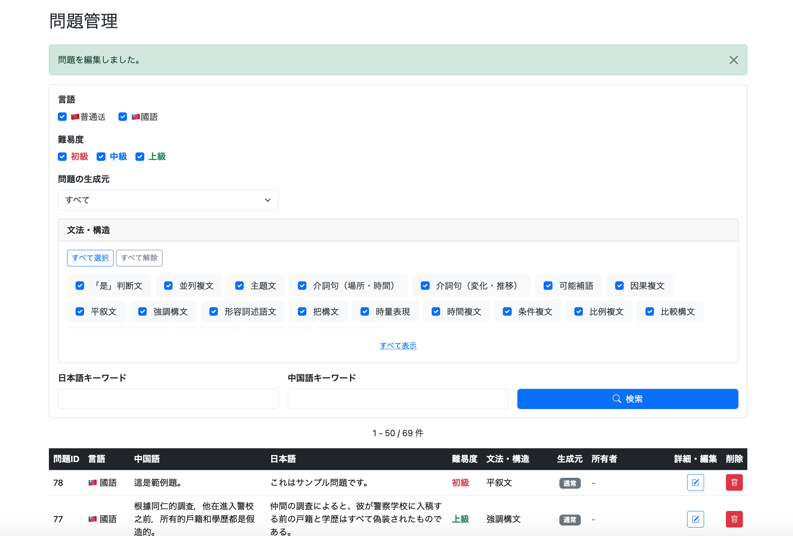

### 対策

問題の作成日時と最終更新日時を`Question`に保持し、Admin用問題一覧を最終更新日時の降順で表示できるようにする。

```java
private LocalDateTime createdAt;

private LocalDateTime updatedAt;
```

新規追加時は`created_at`と`updated_at`の両方に現在日時を設定し、編集時は`updated_at`のみを更新する。

これにより、`updated_at DESC`で並べることで、新規追加した問題だけでなく、最近編集した問題も一覧の先頭に表示できる。

### 要件定義

今回の変更に合わせて、以下の設計資料に作成日時・更新日時とAdmin用問題一覧の表示順を追加する。

- 要件定義書
- テーブル定義書
- データ設計書
- ER図
- 画面設計書

```text
git commit -m "Update design docs for question timestamps and admin list ordering"
```

### フィールドを追加

```text
git commit -m "Add auditing timestamps to Question"
```

まず、`question`テーブルに作成日時と更新日時のカラムを追加する。

```sql
ALTER TABLE question
ADD COLUMN created_at TIMESTAMP,
ADD COLUMN updated_at TIMESTAMP;
```

既存データが存在するため、この時点では`NOT NULL`を設定しない。

既存問題の実際の作成日時・更新日時は復元できないため、現在日時を設定する。

```sql
UPDATE question
SET created_at = CURRENT_TIMESTAMP,
    updated_at = CURRENT_TIMESTAMP;
```

すべてのレコードに日時を設定した後、`NOT NULL`制約を追加する。

```sql
ALTER TABLE question
ALTER COLUMN created_at SET NOT NULL,
ALTER COLUMN updated_at SET NOT NULL;
```

#### Question

作成日時と更新日時は、Spring Data JPAのJPA Auditingを使用して自動的に設定する。

```java
@Getter
@Setter
@Entity
@EntityListeners(AuditingEntityListener.class)
@Table(name = "question")
public class Question {

    @Id
    @GeneratedValue(strategy = GenerationType.IDENTITY)
    @Column(name = "question_id")
    private Long questionId;

    ...(省略)...

    @CreatedDate
    @Column(name = "created_at", nullable = false, updatable = false)
    private LocalDateTime createdAt;

    @LastModifiedDate
    @Column(name = "updated_at", nullable = false)
    private LocalDateTime updatedAt;

    ...(省略)...

}
```

`@EntityListeners(AuditingEntityListener.class)`によって、`Question`の保存・更新時にJPA Auditingによる処理を実行する。

`@CreatedDate`は新規作成時に`createdAt`を自動設定し、`@LastModifiedDate`は作成・更新時に`updatedAt`を自動設定する。

また、`createdAt`には`updatable = false`を指定し、作成後に更新されないようにする。

#### ChineseOutputForgeApplication

JPA Auditingを使用するため、メインクラスに`@EnableJpaAuditing`を追加する。

```java
@SpringBootApplication
@EnableJpaAuditing
public class ChineseOutputForgeApplication {

    public static void main(String[] args) {
        SpringApplication.run(ChineseOutputForgeApplication.class, args);
    }

}
```

`@EnableJpaAuditing`でアプリケーション全体のJPA Auditingを有効化し、`Question`の`@CreatedDate`と`@LastModifiedDate`へ日時を自動設定できるようにする。

#### 実行

問題を新規追加する。

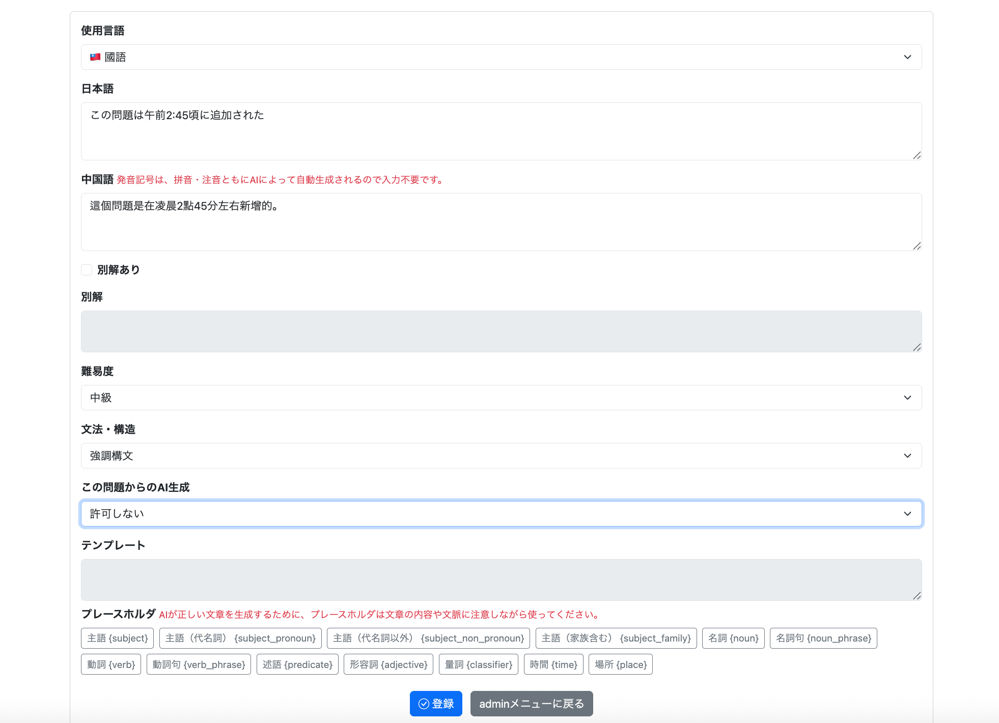

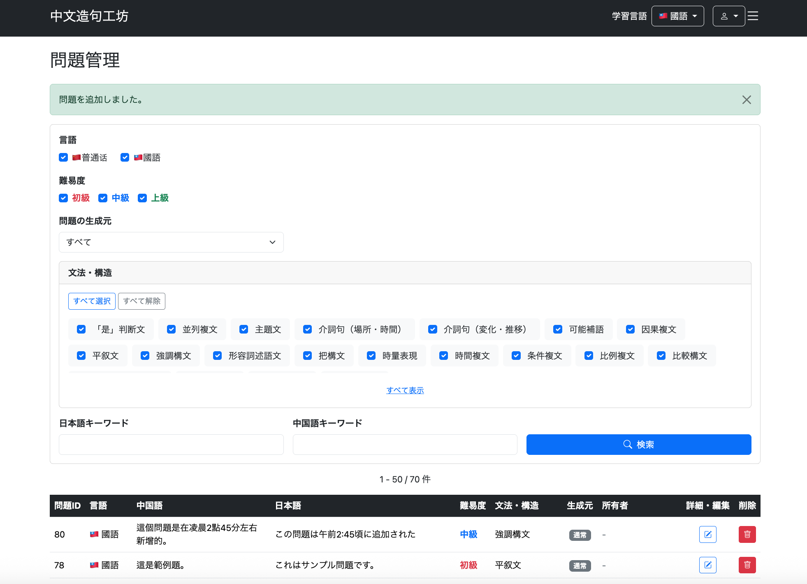

DBを確認し、新規追加した問題の`created_at`と`updated_at`に現在日時が設定されていることを確認した。

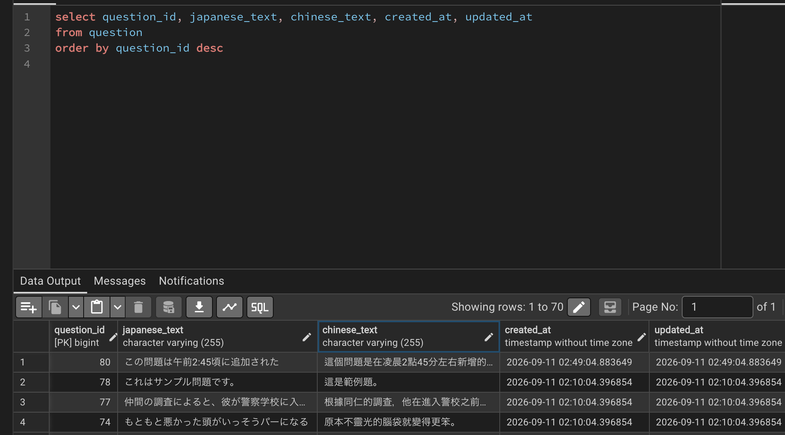

続いて、追加した問題を編集する。

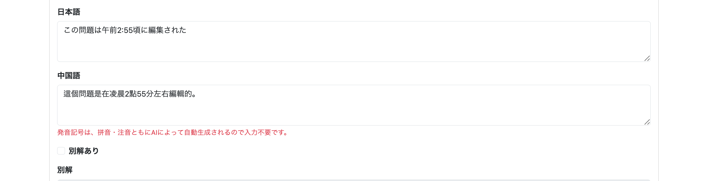

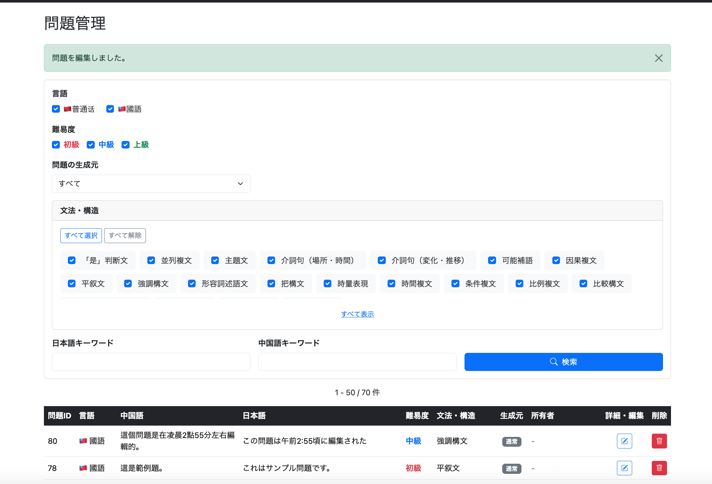

DBを確認すると、`created_at`は変更されず、`updated_at`のみが編集時の日時に更新されている。

```text
2026-09-11 02:49:04.883649 → 2026-09-11 02:55:47.977292
```

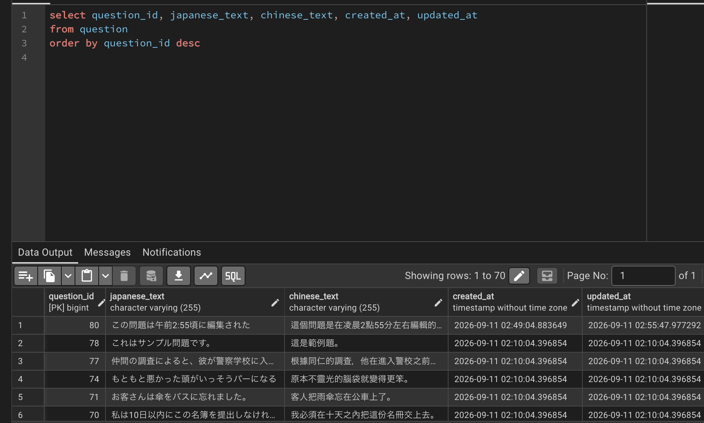

これにより、作成日時と更新日時が想定どおり記録されることを確認した。

### 問題の表示順を変える

```text
git commit -m "Add sorting options to admin question list"
```

Admin用問題一覧の表示順を以下の2種類から選択できるようにする。

- 最終更新日時の降順（デフォルト）
- 問題IDの昇順

#### QuestionRepository

これまでの

```sql
ORDER BY q.question_id DESC
```

を以下に変更する。

```sql
ORDER BY
    CASE
        WHEN :sortCondition = 'UPDATED_DESC'
        THEN q.updated_at
    END DESC,
    CASE
        WHEN :sortCondition = 'QUESTION_ID_ASC'
        THEN q.question_id
    END ASC,
    q.question_id DESC
```

Repositoryの引数には以下を追加する。

```java
@Param("sortCondition") String sortCondition,
```

`:sortCondition`が`UPDATED_DESC`の場合は`updated_at DESC`、`QUESTION_ID_ASC`の場合は`question_id ASC`が有効になる。

最後の`question_id DESC`は、`UPDATED_DESC`で複数の問題が同じ`updated_at`を持つ場合の第2の並び順として使用する。

#### AdminQuestionSortCondition

```java
public enum AdminQuestionSortCondition {

    UPDATED_DESC,

    QUESTION_ID_ASC

}
```

`UPDATED_DESC`は最終更新日時の降順、`QUESTION_ID_ASC`は問題IDの昇順を表す。並び順をEnumとして定義し、ControllerとServiceで扱える値を限定する。

#### AdminQuestionService

```java
public Page<AdminQuestionListDto> getFilteredAdminQuestions(
        List<Difficulty> difficulties,
        QuestionSourceCondition sourceCondition,
        List<Long> structureIds,
        List<LanguageVariant> languageVariants,
        String japaneseKeyword,
        String chineseKeyword,
        AdminQuestionSortCondition sortCondition,
        Pageable pageable) {

    // 言語未選択なら全言語
    if (languageVariants == null || languageVariants.isEmpty()) {
        languageVariants = Arrays.asList(LanguageVariant.values());
    }

    // 難易度未選択なら全難易度
    if (difficulties == null || difficulties.isEmpty()) {
        difficulties = Arrays.asList(Difficulty.values());
    }

    // 文法・構造未選択ならすべて選択
    if (structureIds == null || structureIds.isEmpty()) {
        structureIds = structureRepository.findAllStructureIds();
    }

    // キーワード未記入なら空白
    if (japaneseKeyword == null) {
        japaneseKeyword = "";
    }

    if (chineseKeyword == null) {
        chineseKeyword = "";
    }

    // 問題の生成元が未指定の場合はすべて
    if (sourceCondition == null) {
        sourceCondition = QuestionSourceCondition.ALL;
    }

    // 並び順が未指定の場合は最終更新日時の降順
    if (sortCondition == null) {
        sortCondition = AdminQuestionSortCondition.UPDATED_DESC;
    }

    return questionRepository.findFilteredAdminQuestionList(
            searchConditionConverter.convertDifficulty(difficulties),
            sourceCondition.name(),
            structureIds,
            searchConditionConverter.convertLanguageVariant(languageVariants),
            japaneseKeyword,
            chineseKeyword,
            sortCondition.name(),
            pageable);
}
```

`sortCondition`を検索条件に追加し、未指定の場合は`UPDATED_DESC`を使用する。Repositoryには`name()`で文字列へ変換して渡す。

#### AdminQuestionController

```java
@GetMapping("/admin/question/list")
public String getAdminQuestionList(
        @PageableDefault(page = 0, size = 50) Pageable pageable,
        @RequestParam(required = false) List<Difficulty> difficulties,
        @RequestParam(required = false) QuestionSourceCondition sourceCondition,
        @RequestParam(required = false) List<Long> structureIds,
        @RequestParam(required = false) List<LanguageVariant> languageVariants,
        @RequestParam(required = false, defaultValue = "") String japaneseKeyword,
        @RequestParam(required = false, defaultValue = "") String chineseKeyword,
        @RequestParam(
                required = false,
                defaultValue = "UPDATED_DESC"
        )
        AdminQuestionSortCondition sortCondition,
        HttpSession session,
        HttpServletRequest request,
        Model model) {

    // 現在のURLを取得
    String currentUrl = request.getRequestURI();

    if (request.getQueryString() != null) {
        currentUrl += "?" + request.getQueryString();
    }

    model.addAttribute("currentUrl", currentUrl);

    Page<AdminQuestionListDto> allFilteredQuestionList =
            adminQuestionService.getFilteredAdminQuestions(
                    difficulties,
                    sourceCondition,
                    structureIds,
                    languageVariants,
                    japaneseKeyword,
                    chineseKeyword,
                    sortCondition,
                    pageable
            );

    PaginationDto pagination =
            paginationService.createPagination(allFilteredQuestionList);

    long start =
            allFilteredQuestionList.getNumber()
            * allFilteredQuestionList.getSize() + 1;

    long end =
            start + allFilteredQuestionList.getNumberOfElements() - 1;

    // ページ情報
    model.addAttribute("start", start);
    model.addAttribute("end", end);
    model.addAttribute("total", allFilteredQuestionList.getTotalElements());
    model.addAttribute("questionList", allFilteredQuestionList.getContent());
    model.addAttribute("page", allFilteredQuestionList);
    model.addAttribute("pagination", pagination);

    // 検索条件
    model.addAttribute("selectedDifficulties", difficulties);
    model.addAttribute("selectedSourceCondition", sourceCondition);
    model.addAttribute("selectedStructureIds", structureIds);
    model.addAttribute("selectedLanguageVariants", languageVariants);
    model.addAttribute("japaneseKeyword", japaneseKeyword);
    model.addAttribute("chineseKeyword", chineseKeyword);
    model.addAttribute("selectedSortCondition", sortCondition);

    // 構文一覧
    model.addAttribute(
            "structures",
            reviewService.findStructures());

    return "/admin/question/list";
}
```

`sortCondition`をリクエストパラメータとして受け取り、Serviceへ渡す。デフォルト値には`UPDATED_DESC`を指定し、画面表示用としてModelにも追加する。

#### /admin/question/list.html

検索フォームに並び順の選択欄を追加する。

```html
<!-- ========================= -->
<!-- 並び順 -->
<!-- ========================= -->
<div class="col-md-4">

    <label class="form-label fw-bold">
        並び順
    </label>

    <select class="form-select"
            name="sortCondition">

        <option value="UPDATED_DESC"
                th:selected="${selectedSortCondition == null
                    or selectedSortCondition.name() == 'UPDATED_DESC'}">

            最終更新日時が新しい順

        </option>

        <option value="QUESTION_ID_ASC"
                th:selected="${selectedSortCondition != null
                    and selectedSortCondition.name() == 'QUESTION_ID_ASC'}">

            問題IDの昇順

        </option>

    </select>

</div>
```

`UPDATED_DESC`と`QUESTION_ID_ASC`を選択でき、現在の並び順を選択状態として保持する。

#### 実行

Admin用問題一覧を表示し、並び順の選択欄が追加され、デフォルトで「最終更新日時が新しい順」が選択されることを確認した。

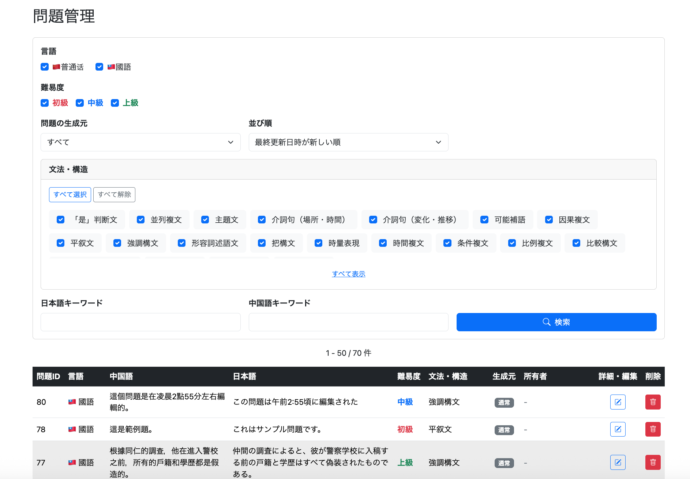

「問題IDの昇順」を選択すると、問題IDの小さい順に表示されることを確認した。

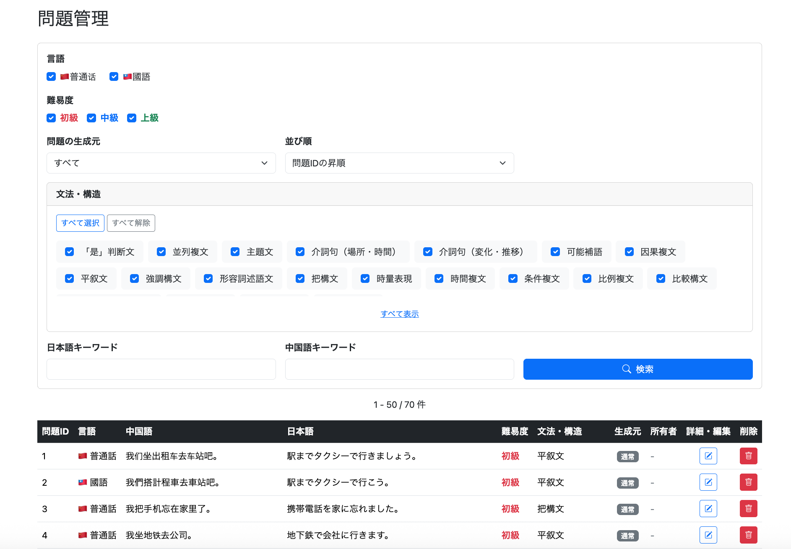

さらに、既存問題の「台北」を「嘉義」に編集する。


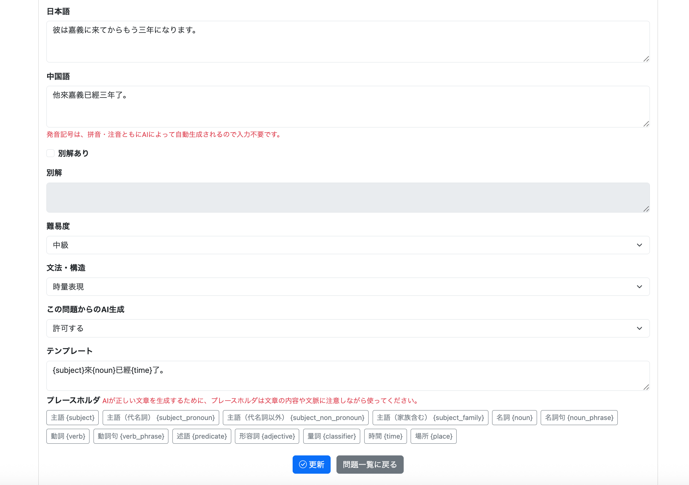

編集によって`updated_at`が更新され、最終更新日時順では編集した問題が一覧の先頭に表示されることを確認した。

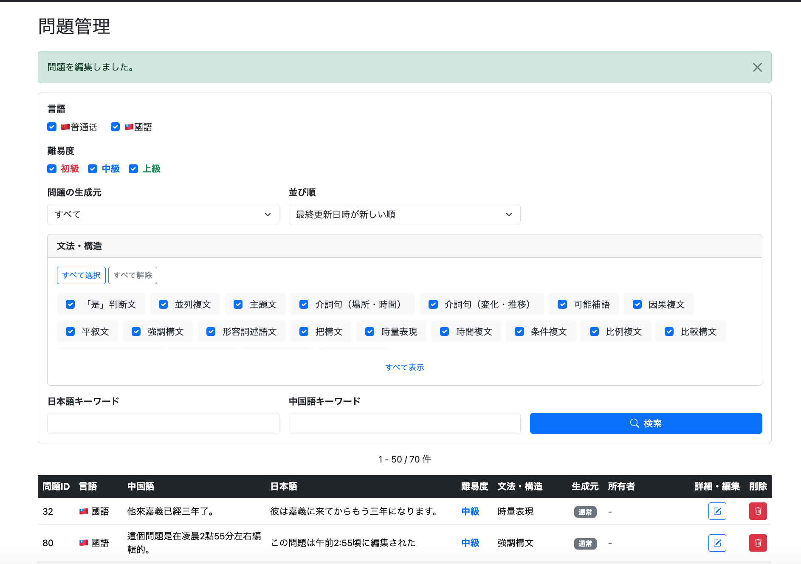

# 3. 問題追加ページ

```text
git commit -m "feat: add admin question creation functionality"
```

Adminユーザーが新しい問題を登録するための問題追加ページを実装する。

問題編集ページは問題追加ページの構造を流用して実装するため、先に問題追加機能を実装する。

## 追加時にAdminが設定する項目

問題追加時には、以下の項目を設定する。

**選択項目**

- 使用言語
- 文法・構造
- 難易度
- この問題からのAI生成許可

**入力項目**

- 日本語
- 中国語
- 拼音
- 注音
- 別解
- 別解拼音
- 別解注音
- テンプレート

## QuestionForm

問題追加画面から入力された値を受け取るため、`QuestionForm`を使用する。

```java
@Data
public class QuestionForm {

    private Long questionId;

    @NotNull
    private LanguageVariant languageVariant;

    @NotBlank
    @Length(max = 255)
    private String japaneseText;

    @NotBlank
    @Length(max = 255)
    private String chineseText;

    @Length(max = 255)
    private String alternativeAnswer;

    @NotBlank
    private String pinyin;

    @NotBlank
    private String zhuyin;

    @Length(max = 255)
    private String alternativeAnswerPinyin;

    @Length(max = 255)
    private String alternativeAnswerZhuyin;

    @NotNull
    private Difficulty difficulty;

    @NotNull
    private Long structureId;

    private boolean allowAiVariation;

    @Length(max = 255)
    private String template;

}
```

必須項目には`@NotNull`または`@NotBlank`を設定し、DBのカラム定義に合わせて文字列項目には最大255文字の制限を設定する。

`questionId`は新規追加時には使用せず、後に問題編集機能で既存問題を識別するために使用する。`allowAiVariation`は`boolean`型のため必須チェックは設定しない。

## AdminQuestionService

```java
public void addQuestion(QuestionForm form) {

    Question question = new Question();

    // 文法コード以外をQuestionにSET
    copyQuestionForm(question, form);

    // 文法コードをQuestionにSET
    Structure structure = structureRepository
            .findById(form.getStructureId())
            .orElseThrow();

    question.setStructure(structure);

    // INSERT
    Question savedQuestion = questionRepository.save(question);

    log.info("問題登録完了 questionId={}", savedQuestion.getQuestionId());

}

private void copyQuestionForm(Question question, QuestionForm form) {

    question.setLanguageVariant(form.getLanguageVariant());
    question.setJapaneseText(form.getJapaneseText());
    question.setChineseText(form.getChineseText());
    question.setAlternativeAnswer(form.getAlternativeAnswer());
    question.setPinyin(form.getPinyin());
    question.setZhuyin(form.getZhuyin());
    question.setAlternativeAnswerPinyin(form.getAlternativeAnswerPinyin());
    question.setAlternativeAnswerZhuyin(form.getAlternativeAnswerZhuyin());
    question.setDifficulty(form.getDifficulty());
    question.setAllowAiVariation(form.isAllowAiVariation());
    question.setTemplate(form.getTemplate());

}
```

`addQuestion`では、`QuestionForm`から新しい`Question`を作成する。

文法・構造については、`QuestionForm`が`structureId`を持つのに対して`Question`は`Structure` Entityを持つため、`structureId`から対応する`Structure`を取得して設定する。

最後に、`QuestionRepository`で問題を保存する。

## AdminQuestionController

問題追加画面の表示と、入力された問題の登録処理を実装する。

### 問題追加画面を表示する`getQuestionAdd`

```java
@GetMapping("/admin/question/add")
public String getQuestionAdd(
        @ModelAttribute QuestionForm form,
        Model model) {

    model.addAttribute("questionForm", form);

    // 使用言語
    model.addAttribute(
            "languageVariants",
            LanguageVariant.values());

    // 難易度
    model.addAttribute(
            "difficulties",
            Difficulty.values());

    // 文法・構造
    model.addAttribute(
            "structures",
            reviewService.findStructures());

    return "admin/question/add";
}
```

問題追加画面で使用する`QuestionForm`と、使用言語・難易度・文法構造の選択肢をModelへ渡す。

`QuestionForm`が保持するのは選択された値のみであるため、画面に表示する使用言語と難易度などの選択肢はEnumから、文法・構造は`reviewService.findStructures()`から選択肢を取得する。

### 問題を追加するPOST処理

```java
@PostMapping("/admin/question/add")
public String postQuestionAdd(
        @Validated @ModelAttribute QuestionForm form,
        BindingResult bindingResult,
        Model model,
        RedirectAttributes redirectAttributes) {

    if (bindingResult.hasErrors()) {
        return getQuestionAdd(form, model);
    }

    log.info("問題登録 {}", form);

    adminQuestionService.addQuestion(form);

    redirectAttributes.addFlashAttribute(
            "successMessage",
            "問題を追加しました。");

    return "redirect:/admin/question/list";
}
```

入力内容をバリデーションし、エラーがある場合は入力内容を保持したまま追加画面を再表示する。

エラーがなければ`addQuestion`で問題を登録し、登録完了メッセージを設定して問題一覧へリダイレクトする。

## /admin/question/add.html

```html
<div layout:fragment="content">

    <div class="container mt-4">

        <!-- 登録成功時のメッセージ表示 -->
        <div th:if="${successMessage}"
             class="alert alert-success alert-dismissible fade show"
             role="alert">

            <span th:text="${successMessage}"></span>

            <button type="button"
                    class="btn-close"
                    data-bs-dismiss="alert"
                    aria-label="Close">
            </button>

        </div>

        <h2 class="mb-4">
            <i class="bi bi-plus-circle"></i>
            問題登録
        </h2>

        <div class="card">

            <div class="card-body">

                <form th:action="@{/admin/question/add}"
                      th:object="${questionForm}"
                      method="post">

                    <!-- 使用言語 -->
                    <div class="mb-3">

                        <label class="form-label">
                            使用言語
                        </label>

                        <select th:field="*{languageVariant}"
                                class="form-select">

                            <option value="">
                                選択してください
                            </option>

                            <option
                                th:each="languageVariant : ${languageVariants}"
                                th:value="${languageVariant}"
                                th:text="${languageVariant.name() == 'MAINLAND'
                                         ? '🇨🇳 普通话'
                                         : '🇹🇼 國語'}">
                            </option>

                        </select>

                    </div>

                    <!-- 日本語 -->
                    <div class="mb-3">

                        <label class="form-label">
                            日本語
                        </label>

                        <textarea
                            th:field="*{japaneseText}"
                            class="form-control"
                            rows="3"
                            required>
                        </textarea>

                        <div class="text-danger mt-1"
                             th:if="${#fields.hasErrors('japaneseText')}"
                             th:errors="*{japaneseText}">
                        </div>

                    </div>

                    <!-- 中国語 -->
                    <div class="mb-3">

                        <label class="form-label">
                            中国語
                        </label>

                        <textarea
                            th:field="*{chineseText}"
                            class="form-control"
                            rows="3"
                            required>
                        </textarea>

                        <div class="text-danger mt-1"
                             th:if="${#fields.hasErrors('chineseText')}"
                             th:errors="*{chineseText}">
                        </div>

                    </div>

                    <!-- 拼音 -->
                    <div class="mb-3">

                        <label class="form-label">
                            拼音
                        </label>

                        <input
                            type="text"
                            th:field="*{pinyin}"
                            class="form-control"
                            required>

                        <div class="text-danger mt-1"
                             th:if="${#fields.hasErrors('pinyin')}"
                             th:errors="*{pinyin}">
                        </div>

                    </div>

                    <!-- 注音 -->
                    <div class="mb-3">

                        <label class="form-label">
                            注音
                        </label>

                        <input
                            type="text"
                            th:field="*{zhuyin}"
                            class="form-control"
                            required>

                        <div class="text-danger mt-1"
                             th:if="${#fields.hasErrors('zhuyin')}"
                             th:errors="*{zhuyin}">
                        </div>

                    </div>

                    <!-- 別解あり -->
                    <div class="form-check mb-3">

                        <input
                            type="checkbox"
                            class="form-check-input"
                            id="hasAlternativeAnswer"
                            th:checked="${questionForm.alternativeAnswer != null
                                         and questionForm.alternativeAnswer != ''}">

                        <label class="form-check-label"
                               for="hasAlternativeAnswer">
                            別解あり
                        </label>

                    </div>

                    <!-- 別解 -->
                    <div class="mb-3">

                        <label class="form-label">
                            別解
                        </label>

                        <textarea
                            th:field="*{alternativeAnswer}"
                            id="alternativeAnswer"
                            class="form-control alternative-answer-field"
                            rows="2">
                        </textarea>

                        <div class="text-danger mt-1"
                             th:if="${#fields.hasErrors('alternativeAnswer')}"
                             th:errors="*{alternativeAnswer}">
                        </div>

                    </div>

                    <!-- 別解拼音 -->
                    <div class="mb-3">

                        <label class="form-label">
                            別解拼音
                        </label>

                        <input
                            type="text"
                            th:field="*{alternativeAnswerPinyin}"
                            id="alternativeAnswerPinyin"
                            class="form-control alternative-answer-field">

                        <div class="text-danger mt-1"
                             th:if="${#fields.hasErrors('alternativeAnswerPinyin')}"
                             th:errors="*{alternativeAnswerPinyin}">
                        </div>

                    </div>

                    <!-- 別解注音 -->
                    <div class="mb-3">

                        <label class="form-label">
                            別解注音
                        </label>

                        <input
                            type="text"
                            th:field="*{alternativeAnswerZhuyin}"
                            id="alternativeAnswerZhuyin"
                            class="form-control alternative-answer-field">

                        <div class="text-danger mt-1"
                             th:if="${#fields.hasErrors('alternativeAnswerZhuyin')}"
                             th:errors="*{alternativeAnswerZhuyin}">
                        </div>

                    </div>

                    <!-- 難易度 -->
                    <div class="mb-3">

                        <label class="form-label">
                            難易度
                        </label>

                        <select th:field="*{difficulty}"
                                class="form-select">

                            <option value="">
                                選択してください
                            </option>

                            <option
                                th:each="difficulty : ${difficulties}"
                                th:value="${difficulty}"
                                th:text="${difficulty.name() == 'BEGINNER' ? '初級'
                                         : difficulty.name() == 'INTERMEDIATE' ? '中級'
                                         : '上級'}">
                            </option>

                        </select>

                    </div>

                    <!-- 文法・構造 -->
                    <div class="mb-3">

                        <label class="form-label">
                            文法・構造
                        </label>

                        <select th:field="*{structureId}"
                                class="form-select">

                            <option value="">
                                選択してください
                            </option>

                            <option
                                th:each="structure : ${structures}"
                                th:value="${structure.structureId}"
                                th:text="${structure.name}">
                            </option>

                        </select>

                        <div class="text-danger mt-1"
                             th:if="${#fields.hasErrors('structureId')}"
                             th:errors="*{structureId}">
                        </div>

                    </div>

                    <!-- AI生成許可 -->
                    <div class="mb-3">

                        <label class="form-label">
                            この問題からのAI生成
                        </label>

                        <select th:field="*{allowAiVariation}"
                                id="allowAiVariation"
                                class="form-select">

                            <option th:value="true">
                                許可する
                            </option>

                            <option th:value="false">
                                許可しない
                            </option>

                        </select>

                    </div>

                    <!-- テンプレート -->
                    <div class="mb-4">

                        <label class="form-label">
                            テンプレート
                        </label>

                        <textarea
                            th:field="*{template}"
                            id="template"
                            class="form-control"
                            rows="2">
                        </textarea>

                        <div class="text-danger mt-1"
                             th:if="${#fields.hasErrors('template')}"
                             th:errors="*{template}">
                        </div>

                    </div>

                    <!-- ボタン -->
                    <div class="text-center mt-3 mb-3">

                        <button
                            type="submit"
                            class="btn btn-primary">

                            <i class="bi bi-check-circle"></i>
                            登録

                        </button>

                        <a th:href="@{/admin/menu}"
                           class="btn btn-secondary ms-2">
                            adminメニューに戻る
                        </a>

                    </div>

                </form>

            </div>

        </div>

    </div>

</div>
```

Adminが問題の各項目を入力・選択するフォームを表示し、`QuestionForm`へバインドして`POST /admin/question/add`へ送信する。バリデーションエラーがある項目については、入力欄の下にエラーメッセージを表示する。

## /admin/question/add.js

```javascript
document.addEventListener("DOMContentLoaded", () => {

    const hasAlternativeAnswer =
        document.getElementById("hasAlternativeAnswer");

    const alternativeAnswerFields =
        document.querySelectorAll(".alternative-answer-field");

    function updateAlternativeAnswerFields() {

        alternativeAnswerFields.forEach(field => {
            field.disabled = !hasAlternativeAnswer.checked;
        });

    }

    // 初期表示
    updateAlternativeAnswerFields();

    // チェック状態変更時
    hasAlternativeAnswer.addEventListener(
        "change",
        updateAlternativeAnswerFields
    );

    // =========================
    // AI生成許可によるテンプレート制御
    // =========================

    const allowAiVariation =
        document.getElementById("allowAiVariation");

    const template =
        document.getElementById("template");

    function updateTemplateField() {

        template.disabled =
            allowAiVariation.value === "false";

    }

    // 初期表示
    updateTemplateField();

    // 選択変更時
    allowAiVariation.addEventListener(
        "change",
        updateTemplateField
    );

});
```

「別解あり」のチェック状態に応じて別解・別解拼音・別解注音の入力可否を切り替える。

同様に、「この問題からのAI生成」で「許可する」を選択している場合のみテンプレートを入力可能にする。

## 実行

問題追加ページを表示し、問題登録用のフォームが表示されることを確認した。

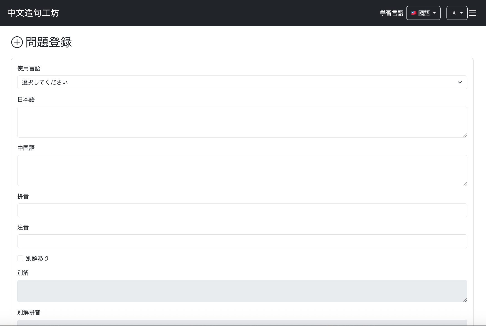

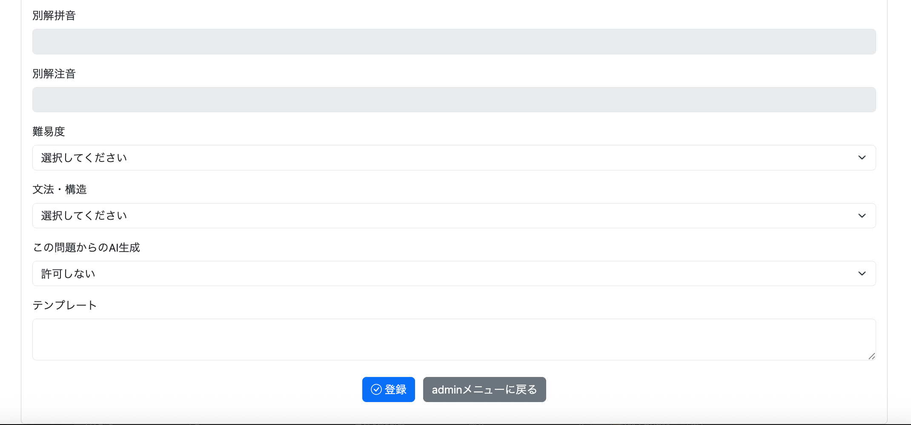

以下の内容で新しい問題を登録する。

**日本語**

`もともと悪かった頭がいっそうパーになる`

**正解**

- 中国語：`原本不靈光的腦袋就變得更笨。`
- 拼音：`Yuánběn bù língguāng de nǎodài jiù biàn de gèng bèn.`
- 注音：`ㄩㄢˊ ㄅㄣˇ ㄅㄨˋ ㄌㄧㄥˊ ㄍㄨㄤ ˙ㄉㄜ ㄋㄠˇ ㄉㄞˋ ㄐㄧㄡˋ ㄅㄧㄢˋ ˙ㄉㄜ ㄍㄥˋ ㄅㄣˋ`

**別解**

- 中国語：`本來就不太靈光的腦袋變得更笨了。`
- 拼音：`Běnlái jiù bú tài língguāng de nǎodài biàn de gèng bèn le.`
- 注音：`ㄅㄣˇ ㄌㄞˊ ㄐㄧㄡˋ ㄅㄨˊ ㄊㄞˋ ㄌㄧㄥˊ ㄍㄨㄤ ˙ㄉㄜ ㄋㄠˇ ㄉㄞˋ ㄅㄧㄢˋ ˙ㄉㄜ ㄍㄥˋ ㄅㄣˋ ˙ㄌㄜ`

難易度は「上級」、文法・構造は「比較構文」、AI生成は「許可しない」として登録する。

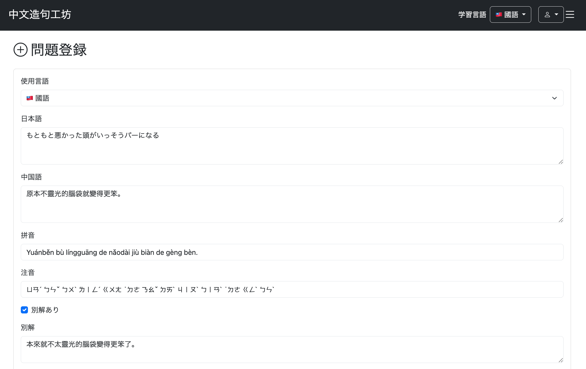

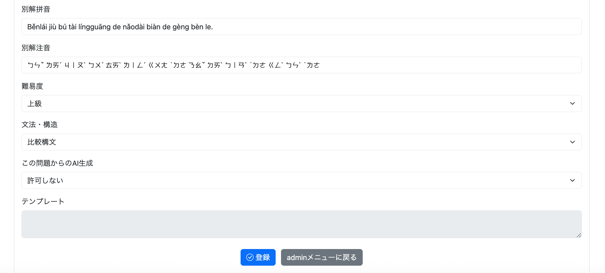

登録後に問題一覧へリダイレクトされ、追加した問題が一覧に表示されることを確認した。

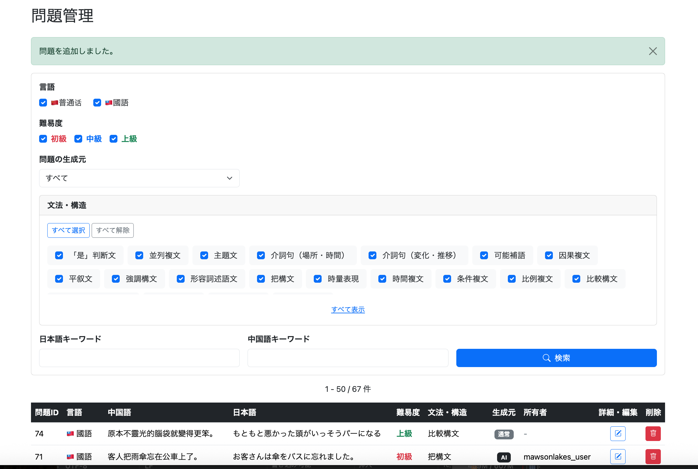

## 追加修正 - 問題一覧ページに問題追加ページへのリンクボタンを追加

### /admin/question/list.html

```html
    <!-- タイトル・問題追加ボタン -->
    <div class="d-flex justify-content-between align-items-center mb-2">

	    <h2 class="mb-4">
	        問題管理
	    </h2>
	    
	    <a th:href="@{/admin/question/add}"
	       class="btn btn-success">
	
	        <i class="bi bi-plus-circle"></i>
	
	        問題追加
	
	    </a>   
	    
    </div> 
```

これで問題一覧ページから問題追加ページへの遷移が容易になった。

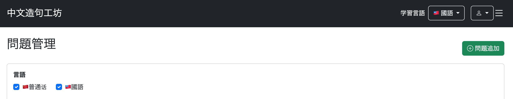

# 3-1. プレースホルダの入力を容易にする機能を追加する

現在の問題追加フォームでは、テンプレート内のプレースホルダを手入力する必要がある。

プレースホルダにはそれぞれ役割があり、AIに期待する文章を生成させるためには内容や文脈に応じて適切に使い分ける必要がある。

そこで、使用可能なプレースホルダとその意味を画面上に表示し、ボタンをクリックするだけでテンプレートへ挿入できるようにする。

## /admin/question/add.html

テンプレート入力欄の下に、プレースホルダの一覧を追加する。

```html
<!-- プレースホルダ一覧 -->
<div class="mt-2">

    <label class="form-label fw-bold">
        プレースホルダ
    </label>

    <span class="text-danger small">
        AIが正しい文章を生成するために、プレースホルダは文章の内容や文脈に注意しながら使ってください。
    </span>

    <div class="d-flex flex-wrap gap-2">

        <button type="button"
                class="btn btn-outline-secondary btn-sm placeholder-button"
                data-placeholder="{subject}">
            主語 {subject}
        </button>

        <button type="button"
                class="btn btn-outline-secondary btn-sm placeholder-button"
                data-placeholder="{subject_pronoun}">
            主語（代名詞） {subject_pronoun}
        </button>

        <button type="button"
                class="btn btn-outline-secondary btn-sm placeholder-button"
                data-placeholder="{subject_non_pronoun}">
            主語（代名詞以外） {subject_non_pronoun}
        </button>

        <button type="button"
                class="btn btn-outline-secondary btn-sm placeholder-button"
                data-placeholder="{subject_family}">
            主語（家族含む） {subject_family}
        </button>

        <button type="button"
                class="btn btn-outline-secondary btn-sm placeholder-button"
                data-placeholder="{noun}">
            名詞 {noun}
        </button>

        <button type="button"
                class="btn btn-outline-secondary btn-sm placeholder-button"
                data-placeholder="{noun_phrase}">
            名詞句 {noun_phrase}
        </button>

        <button type="button"
                class="btn btn-outline-secondary btn-sm placeholder-button"
                data-placeholder="{verb}">
            動詞 {verb}
        </button>

        <button type="button"
                class="btn btn-outline-secondary btn-sm placeholder-button"
                data-placeholder="{verb_phrase}">
            動詞句 {verb_phrase}
        </button>

        <button type="button"
                class="btn btn-outline-secondary btn-sm placeholder-button"
                data-placeholder="{predicate}">
            述語 {predicate}
        </button>

        <button type="button"
                class="btn btn-outline-secondary btn-sm placeholder-button"
                data-placeholder="{adjective}">
            形容詞 {adjective}
        </button>

        <button type="button"
                class="btn btn-outline-secondary btn-sm placeholder-button"
                data-placeholder="{classifier}">
            量詞 {classifier}
        </button>

        <button type="button"
                class="btn btn-outline-secondary btn-sm placeholder-button"
                data-placeholder="{time}">
            時間 {time}
        </button>

        <button type="button"
                class="btn btn-outline-secondary btn-sm placeholder-button"
                data-placeholder="{place}">
            場所 {place}
        </button>

    </div>

</div>
```

使用可能なプレースホルダを、意味が分かるラベル付きのボタンとして一覧表示する。

各ボタンには共通の`placeholder-button`クラスを設定し、JavaScriptからまとめて取得できるようにする。実際にテンプレートへ挿入する文字列は`data-placeholder`に保持する。

## /admin/question/add.js

プレースホルダボタンをクリックしたときの処理を追加する。

```javascript
// =========================
// プレースホルダ入力
// =========================

const placeholderButtons =
    document.querySelectorAll(".placeholder-button");

placeholderButtons.forEach(button => {

    button.addEventListener("click", () => {

        // テンプレート入力不可の場合は何もしない
        if (template.disabled) {
            return;
        }

        const placeholder =
            button.dataset.placeholder;

        // 現在のカーソル位置
        const start =
            template.selectionStart;

        const end =
            template.selectionEnd;

        // カーソル位置にプレースホルダを挿入
        template.value =
            template.value.substring(0, start)
            + placeholder
            + template.value.substring(end);

        // カーソルを挿入した文字の後ろへ移動
        const cursorPosition =
            start + placeholder.length;

        template.setSelectionRange(
            cursorPosition,
            cursorPosition
        );

        template.focus();

    });

});
```

クリックされたボタンの`data-placeholder`から挿入する値を取得する。

`selectionStart`と`selectionEnd`でテンプレート入力欄のカーソル位置または選択範囲を取得し、その位置へプレースホルダを挿入する。

挿入後は`setSelectionRange`でカーソルをプレースホルダの直後へ移動し、`focus`でテンプレート入力欄へフォーカスを戻す。

また、テンプレート入力欄が無効になっている場合は、プレースホルダを挿入しない。

## 実行

問題追加ページを表示し、テンプレート入力欄の下にプレースホルダの一覧が表示されることを確認した。

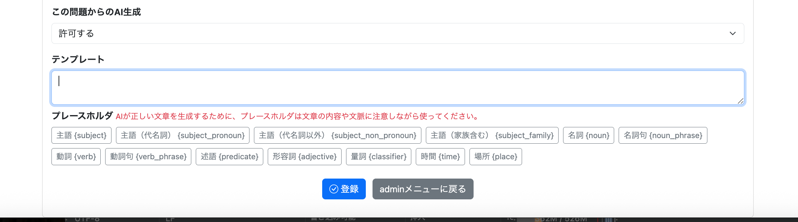

テンプレートが入力可能な状態でプレースホルダボタンをクリックすると、現在のカーソル位置へプレースホルダが挿入されることを確認した。

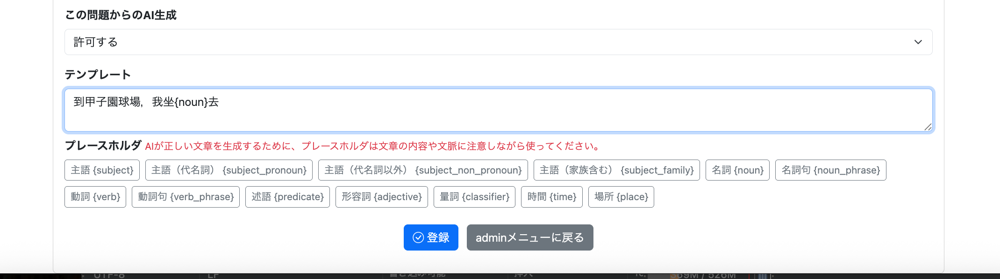

# 3-2. 拼音と注音をAIに生成させる

```text
git commit -m "feat: add AI-generated pronunciation for admin questions"
```

問題追加時に拼音と注音を手入力すると入力作業が増えるだけでなく、発音記号の誤入力も発生しやすい。

一方、使用言語と中国語本文が分かれば、拼音と注音はAIで生成できる。

そこで、Adminが発音情報を手入力する方式から、中国語本文と別解をもとにAIが発音情報を自動生成する方式へ変更する。

## 処理の流れ

```text
QuestionForm
    │
    │ languageVariant
    │ chineseText
    │ alternativeAnswer（存在する場合）
    ↓
AiPronunciationRequestDto
    ↓
AiPronunciationService
    ↓
AiPromptService
    │
    │ 発音生成用プロンプト取得
    ↓
Gemini API
    ↓
AiPronunciationResponseDto
    │
    │ pinyin
    │ zhuyin
    │ alternativeAnswerPinyin
    │ alternativeAnswerZhuyin
    ↓
AdminQuestionService
    ↓
QuestionへSET
    ↓
QuestionRepository.save()
```

`QuestionForm`から使用言語、中国語本文、別解を取得してAIへ送信し、生成された拼音・注音を`AiPronunciationResponseDto`で受け取る。

`AdminQuestionService`で生成結果を`Question`へ設定した後、問題をDBへ保存する。

## QuestionForm

発音情報をAdminが入力する必要がなくなるため、拼音・注音と別解の拼音・注音を`QuestionForm`の入力項目から外す。

```java
@Data
public class QuestionForm {

    private Long questionId;

    @NotNull
    private LanguageVariant languageVariant;

    @NotBlank
    @Length(max = 255)
    private String japaneseText;

    @NotBlank
    @Length(max = 255)
    private String chineseText;

    @Length(max = 255)
    private String alternativeAnswer;

//    @NotBlank
//    private String pinyin;
//
//    @NotBlank
//    private String zhuyin;
//
//    @Length(max = 255)
//    private String alternativeAnswerPinyin;
//
//    @Length(max = 255)
//    private String alternativeAnswerZhuyin;

    @NotNull
    private Difficulty difficulty;

    @NotNull
    private Long structureId;

    private boolean allowAiVariation;

    @Length(max = 255)
    private String template;

}
```

この段階ではAIによる発音生成を実装・確認している途中のため、発音情報のフィールドは削除せず一時的にコメントアウトする。

## AiPronunciationRequestDto

```java
@Data
public class AiPronunciationRequestDto {

    private final LanguageVariant languageVariant;

    private final String chineseText;

    private final String alternativeAnswer;

}
```

AIへ発音情報の生成を依頼するためのDTOで、使用言語、中国語本文、別解を保持する。

## AiPronunciationResponseDto

```java
@Data
public class AiPronunciationResponseDto {

    private final String pinyin;

    private final String zhuyin;

    private final String alternativeAnswerPinyin;

    private final String alternativeAnswerZhuyin;

}
```

AIが生成した発音情報を受け取るためのDTOで、正解と別解それぞれの拼音・注音を保持する。

## AdminQuestionService

```java
public void addQuestion(QuestionForm form) {

    Question question = new Question();

    // 発音生成用DTOを作成
    AiPronunciationRequestDto request =
            new AiPronunciationRequestDto(
                    form.getLanguageVariant(),
                    form.getChineseText(),
                    form.getAlternativeAnswer()
            );

    // AIで発音情報を生成
    AiPronunciationResponseDto pronunciation =
            aiPronunciationService.generatePronunciation(request);

    // 文法コード以外をQuestionにSET
    copyQuestionForm(question, form, pronunciation);

    // 文法コードをQuestionにSET
    Structure structure = structureRepository
            .findById(form.getStructureId())
            .orElseThrow();

    question.setStructure(structure);

    // INSERT
    Question savedQuestion =
            questionRepository.save(question);

    log.info(
            "問題登録完了 questionId={}",
            savedQuestion.getQuestionId());

}

private void copyQuestionForm(
        Question question,
        QuestionForm form,
        AiPronunciationResponseDto pronunciation) {

    question.setLanguageVariant(form.getLanguageVariant());
    question.setJapaneseText(form.getJapaneseText());
    question.setChineseText(form.getChineseText());
    question.setAlternativeAnswer(form.getAlternativeAnswer());

    question.setPinyin(pronunciation.getPinyin());
    question.setZhuyin(pronunciation.getZhuyin());

    question.setAlternativeAnswerPinyin(
            pronunciation.getAlternativeAnswerPinyin());

    question.setAlternativeAnswerZhuyin(
            pronunciation.getAlternativeAnswerZhuyin());

    question.setAllowAiVariation(form.isAllowAiVariation());
    question.setTemplate(form.getTemplate());

}
```

`addQuestion`では、`QuestionForm`の使用言語、中国語本文、別解から`AiPronunciationRequestDto`を作成し、`AiPronunciationService`へ渡す。

生成された発音情報は`AiPronunciationResponseDto`として受け取り、`copyQuestionForm`で`Question`の拼音・注音へ設定する。

文法・構造については、`QuestionForm`が`structureId`を持つのに対して`Question`は`Structure` Entityを持つため、`structureId`から対応する`Structure`を取得して設定する。

## プロンプト

### ai-pronunciation-mainland.txt（普通話）

```text
あなたは中国語の発音情報を生成するシステムです。

入力された中国語文に対して、普通話（中国大陸の標準中国語）の発音情報を生成してください。

【生成ルール】

1. pinyin

- 普通話の発音に基づく漢語拼音を生成してください。
- 声調は数字ではなく声調記号で表記してください。
- 単語ごとに半角スペースで区切ってください。
- 文頭は大文字にしてください。
- 中国語本文の句読点に対応する句読点を保持してください。

2. zhuyin

- 普通話の発音に基づく注音符號（ㄅㄆㄇㄈ）を生成してください。
- 各音節を半角スペースで区切ってください。
- 声調記号を付けてください。
- 第一声には声調記号を付けないでください。
- 軽声は「˙」を音節の前に付けてください。
- 中国語本文の句読点に対応する句読点を保持してください。

3. alternativeAnswerPinyin

- alternativeAnswerが存在する場合、その普通話の発音に基づく漢語拼音を生成してください。
- alternativeAnswerが存在しない場合はnullにしてください。

4. alternativeAnswerZhuyin

- alternativeAnswerが存在する場合、その普通話の発音に基づく注音符號を生成してください。
- alternativeAnswerが存在しない場合はnullにしてください。

【重要】

- 中国大陸の普通話の発音を基準にしてください。
- 中国語本文を翻訳・修正・言い換えしないでください。
- 入力された中国語文そのものの発音を生成してください。
- 発音情報以外の説明を追加しないでください。
```

### ai-pronunciation-taiwan.txt（國語）

```text
省略
```

普通話と國語では発音が異なる場合があるため、使用言語に応じて別々のプロンプトを使用する。

## AiPromptService

```java
private static final String MAINLAND_PRONUNCIATION_PATH =
        "prompts/ai-pronunciation-mainland.txt";

private static final String TAIWAN_PRONUNCIATION_PATH =
        "prompts/ai-pronunciation-taiwan.txt";

// 発音記号取得のプロンプトを取得する
public String getPronunciationPrompt(
        LanguageVariant languageVariant) {

    if (languageVariant == LanguageVariant.MAINLAND) {

        return loadPronunciationPrompt(
                MAINLAND_PRONUNCIATION_PATH);

    } else {

        return loadPronunciationPrompt(
                TAIWAN_PRONUNCIATION_PATH);

    }

}

// classpath上のプロンプトファイルを読み込む(発音記号)
private String loadPronunciationPrompt(String path) {

    ClassPathResource resource =
            new ClassPathResource(path);

    try (InputStream inputStream =
            resource.getInputStream()) {

        return new String(
                inputStream.readAllBytes(),
                StandardCharsets.UTF_8);

    } catch (IOException e) {

        throw new IllegalStateException(
                "プロンプトファイルの読み込みに失敗しました: " + path,
                e);

    }

}
```

`getPronunciationPrompt`では、`LanguageVariant`に応じて普通話または國語の発音生成用プロンプトを選択する。

`loadPronunciationPrompt`では、指定されたclasspath上のプロンプトファイルをUTF-8で読み込む。

## AiPronunciationService

```java
public AiPronunciationResponseDto generatePronunciation(
        AiPronunciationRequestDto request) {

    // 言語別ルールを取得
    String pronunciationPrompt =
            aiPromptService.getPronunciationPrompt(
                    request.getLanguageVariant());

    // DTOをJSON形式に変換
    String requestJson;

    try {

        requestJson =
                objectMapper.writeValueAsString(request);

    } catch (JsonProcessingException e) {

        throw new IllegalStateException(
                "発音情報生成リクエストのJSON変換に失敗しました。",
                e);

    }

    // AIへ送信する入力を作成
    String input =
            pronunciationPrompt
            + "\n\n"
            + "## 中国語及び別解\n"
            + requestJson;

    return generatePronunciationWithGemini(input);

}

private AiPronunciationResponseDto generatePronunciationWithGemini(
        String input) {

    // 発音情報の出力形式を定義
    Schema responseSchema =
            Schema.builder()
                    .type(Type.Known.OBJECT)
                    .properties(Map.of(
                            "pinyin",
                            Schema.builder()
                                    .type(Type.Known.STRING)
                                    .build(),
                            "zhuyin",
                            Schema.builder()
                                    .type(Type.Known.STRING)
                                    .build(),
                            "alternativeAnswerPinyin",
                            Schema.builder()
                                    .type(Type.Known.STRING)
                                    .nullable(true)
                                    .build(),
                            "alternativeAnswerZhuyin",
                            Schema.builder()
                                    .type(Type.Known.STRING)
                                    .nullable(true)
                                    .build()
                    ))
                    .required(List.of(
                            "pinyin",
                            "zhuyin",
                            "alternativeAnswerPinyin",
                            "alternativeAnswerZhuyin"))
                    .build();

    // Thinking LevelをLOWに設定
    ThinkingConfig thinkingConfig =
            ThinkingConfig.builder()
                    .thinkingLevel(ThinkingLevel.Known.LOW)
                    .build();

    // APIリクエストを作成(Gemini)
    GenerateContentConfig config =
            GenerateContentConfig.builder()
                    .responseMimeType("application/json")
                    .responseSchema(responseSchema)
                    .thinkingConfig(thinkingConfig)
                    .build();

    // APIへリクエストを送信
    GenerateContentResponse response =
            geminiClient.models.generateContent(
                    "gemini-3.7-flash",
                    input,
                    config);

    // AIが生成したJSONを取得
    String responseJson =
            response.text();

    // JSONをDTOへ変換
    AiPronunciationResponseDto aiPronunciationResponseDto;

    try {

        aiPronunciationResponseDto =
                objectMapper.readValue(
                        responseJson,
                        AiPronunciationResponseDto.class);

    } catch (JsonProcessingException e) {

        throw new IllegalStateException(
                "発音情報の生成結果を取得できませんでした。",
                e);

    }

    return aiPronunciationResponseDto;

}
```

`generatePronunciation`では、使用言語に対応するプロンプトを取得し、`AiPronunciationRequestDto`をJSONへ変換してAIへの入力を作成する。

`generatePronunciationWithGemini`では、拼音・注音・別解拼音・別解注音を返すJSON Schemaを定義し、Gemini APIへリクエストを送信する。取得したJSONは`AiPronunciationResponseDto`へ変換して返す。

AI問題生成では複数の問題を`questions`配列として受け取る必要があったが、今回は1問分の発音情報のみを取得する。そのため、レスポンス全体を配列で包むためのSchemaは不要で、発音情報を持つ1つのObjectとして定義する。

## /admin/question/add.html

AIによる発音情報の自動生成へ変更したため、拼音・注音の手入力欄を一時的に非表示にする。

AI発音生成の実装・確認中に問題が発生した場合に手動入力へ戻せるよう、この段階では削除せずコメントアウトしておく。

```html
<!--
=========================
AIによる発音情報の自動生成に変更したため一時的に非表示
=========================

<div class="mb-3">

    <label class="form-label fw-bold">
        拼音
    </label>

    <input
        type="text"
        th:field="*{pinyin}"
        class="form-control"
        required>

    <div class="text-danger mt-1"
         th:if="${#fields.hasErrors('pinyin')}"
         th:errors="*{pinyin}">
    </div>

</div>

<div class="mb-3">

    <label class="form-label fw-bold">
        注音
    </label>

    <input
        type="text"
        th:field="*{zhuyin}"
        class="form-control"
        required>

    <div class="text-danger mt-1"
         th:if="${#fields.hasErrors('zhuyin')}"
         th:errors="*{zhuyin}">
    </div>

</div>
-->

<!--
=========================
AIによる発音情報の自動生成に変更したため一時的に非表示
=========================

<div class="mb-3">

    <label class="form-label fw-bold">
        別解拼音
    </label>

    <input
        type="text"
        th:field="*{alternativeAnswerPinyin}"
        id="alternativeAnswerPinyin"
        class="form-control alternative-answer-field">

    <div class="text-danger mt-1"
         th:if="${#fields.hasErrors('alternativeAnswerPinyin')}"
         th:errors="*{alternativeAnswerPinyin}">
    </div>

</div>

<div class="mb-3">

    <label class="form-label fw-bold">
        別解注音
    </label>

    <input
        type="text"
        th:field="*{alternativeAnswerZhuyin}"
        id="alternativeAnswerZhuyin"
        class="form-control alternative-answer-field">

    <div class="text-danger mt-1"
         th:if="${#fields.hasErrors('alternativeAnswerZhuyin')}"
         th:errors="*{alternativeAnswerZhuyin}">
    </div>

</div>
-->
```

また、中国語入力欄に、発音情報が自動生成されることを示す説明を追加する。

```html
<span class="text-danger small">
    発音記号は、拼音・注音ともにAIによって自動生成されるので入力不要です。
</span>
```

## 実行

問題追加ページから新しい問題を登録する。

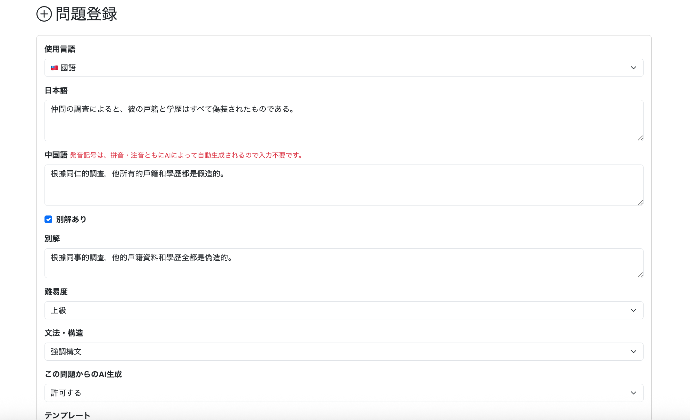

登録後に問題一覧へ遷移し、問題が追加されていることを確認した。

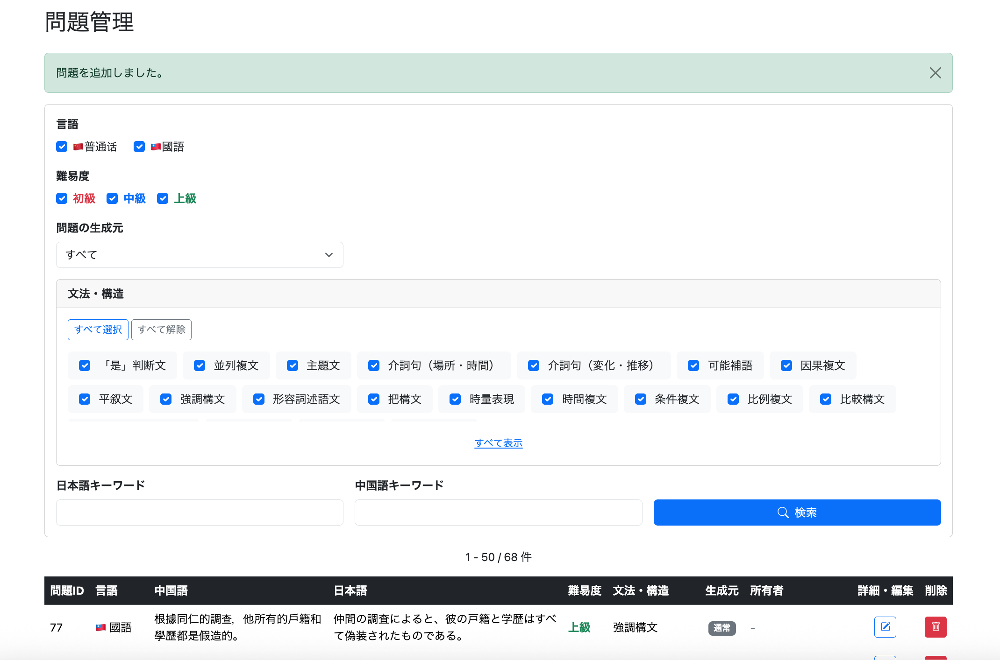

さらにDBを確認し、入力していない拼音・注音と別解の拼音・注音がAIによって生成され、保存されていることを確認した。

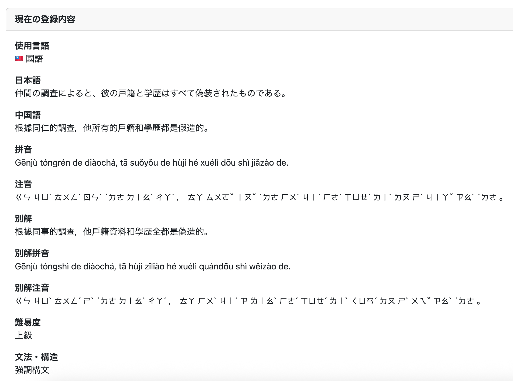

生成された発音情報は以下のとおりとなった。

| 項目 | 内容 |
| --- | --- |
| 中国語 | 根據同仁的調查，他所有的戶籍和學歷都是假造的。 |
| 拼音 | Gēnjù tóngrén de diàochá, tā suǒyǒu de hùjí hé xuélì dōu shì jiǎzào de. |
| 注音 | ㄍㄣ ㄐㄩˋ ㄊㄨㄥˊ ㄖㄣˊ ˙ㄉㄜ ㄉㄧㄠˋ ㄔㄚˊ ， ㄊㄚ ㄙㄨㄛˇ ㄧㄡˇ ˙ㄉㄜ ㄏㄨˋ ㄐㄧˊ ㄏㄜˊ ㄒㄩㄝˊ ㄌㄧˋ ㄉㄡ ㄕˋ ㄐㄧㄚˇ ㄗㄠˋ ˙ㄉㄜ 。 |
| 別解 | 根據同事的調查，他的戶籍資料和學歷全都是偽造的。 |
| 別解拼音 | Gēnjù tóngshì de diàochá, tā de hùjí zīliào hé xuélì quándōu shì wěizào de. |
| 別解注音 | ㄍㄣ ㄐㄩˋ ㄊㄨㄥˊ ㄕˋ ˙ㄉㄜ ㄉㄧㄠˋ ㄔㄚˊ ， ㄊㄚ ˙ㄉㄜ ㄏㄨˋ ㄐㄧˊ ㄗ ㄌㄧㄠˋ ㄏㄜˊ ㄒㄩㄝˊ ㄌㄧˋ ㄑㄩㄢˊ ㄉㄡ ㄕˋ ㄨㄟˇ ㄗㄠˋ ˙ㄉㄜ 。 |

発音情報がAIによって自動生成され、問題とともに正常に保存されることを確認した。

# 4. 問題編集ページ

```text
git commit -m "Add admin question detail and edit functionality"
```

既存の問題の詳細を確認し、内容を編集するページを実装する。

基本的な入力項目や登録処理は問題追加機能と共通しているが、問題追加では新しい`Question`を作成してINSERTするのに対し、問題編集では`questionId`から既存の`Question`を取得し、その内容を更新する。

また、編集画面では現在DBに登録されている内容を確認しながら変更後の値を入力できるようにする。そのため、現在値の表示には`OriginalQuestionDTO`、編集内容の入力には`QuestionForm`を使用する。

## QuestionとFormの変換のタイミング

編集画面では、以下の2種類のデータを同時に扱う。

- `OriginalQuestionDTO`：DBに保存されている変更前データの表示用
- `QuestionForm`：Adminが入力する変更後データの入力用

当初は、既存の`Question`を`QuestionForm`へ変換し、そのまま編集画面へ渡す構成も考えられる。

```text
Question
    ↓
QuestionForm
    ↓
ブラウザで表示・入力
    ↓
QuestionFormで入力を受け取る
    ↓
Questionへ反映
    ↓
UPDATE
```

しかし、今回の編集画面では現在の登録内容と編集フォームを同時に表示する。

そのため、1つの`QuestionForm`で変更前と変更後の両方を管理せず、以下のように役割を分ける。

```text
Question
    ↓
OriginalQuestionDTO
    ↓
変更前データとして表示
```

```text
QuestionForm
    ↓
変更後データを入力
    ↓
Questionへ反映
    ↓
UPDATE
```

Controllerからは、それぞれを別のModel Attributeとして渡す。

```java
model.addAttribute("originalQuestion", originalQuestion);
model.addAttribute("questionForm", form);
```

Thymeleafでは、変更前データは`originalQuestion`から表示する。

```html
<span th:text="${originalQuestion.chineseText}"></span>
```

一方、編集フォームでは`questionForm`を使用する。

```html
<form th:object="${questionForm}">

    <input th:field="*{japaneseText}">

    <input th:field="*{chineseText}">

</form>
```

これにより、

- `Question`：DB上の問題を管理するEntity
- `OriginalQuestionDTO`：変更前の問題情報を表示するDTO
- `QuestionForm`：変更後の入力値を受け取るForm

と役割を分離する。

## OriginalQuestionDTO

現在DBに登録されている問題情報を編集画面へ表示するため、`OriginalQuestionDTO`を作成する。

発音情報はAIによって生成するため編集対象にはしないが、このページは問題の詳細確認も兼ねているため、現在登録されている拼音・注音もDTOに含めて表示する。

また、AI生成由来の問題は詳細の閲覧のみ可能とし、編集はできないようにする。その判定に使用するため`aiGenerated`を保持し、生成ユーザーを表示するため`ownerLoginId`も保持する。

```java
@Data
public class OriginalQuestionDTO {

    private LanguageVariant languageVariant;

    private String japaneseText;

    private String chineseText;

    private String alternativeAnswer;

    private String pinyin;

    private String zhuyin;

    private String alternativeAnswerPinyin;

    private String alternativeAnswerZhuyin;

    private Difficulty difficulty;

    private long structureId;

    private String structureName;

    private boolean allowAiVariation;

    private String template;

    private boolean aiGenerated;

    private String ownerLoginId;

}
```

## AdminQuestionService

問題編集では、編集前の問題情報を取得する処理と、入力された内容で既存の問題を更新する処理を実装する。

### 編集前の問題情報を取得する`getOriginalQuestion`

```java
public OriginalQuestionDTO getOriginalQuestion(long questionId) {

    Question question = questionRepository.findById(questionId)
            .orElseThrow(() ->
                    new IllegalArgumentException("Question not found."));

    OriginalQuestionDTO dto = new OriginalQuestionDTO();

    dto.setLanguageVariant(question.getLanguageVariant());
    dto.setJapaneseText(question.getJapaneseText());
    dto.setChineseText(question.getChineseText());
    dto.setAlternativeAnswer(question.getAlternativeAnswer());
    dto.setPinyin(question.getPinyin());
    dto.setZhuyin(question.getZhuyin());

    dto.setAlternativeAnswerPinyin(
            question.getAlternativeAnswerPinyin());

    dto.setAlternativeAnswerZhuyin(
            question.getAlternativeAnswerZhuyin());

    dto.setDifficulty(question.getDifficulty());

    dto.setStructureId(
            question.getStructure().getStructureId());

    dto.setStructureName(
            question.getStructure().getName());

    dto.setAllowAiVariation(
            question.getAllowAiVariation());

    dto.setTemplate(question.getTemplate());
    dto.setAiGenerated(question.isAiGenerated());

    if (question.getOwner() != null) {

        dto.setOwnerLoginId(
                question.getOwner().getLoginId());

    }

    return dto;
}
```

`questionId`から既存の`Question`を取得し、画面表示に必要な情報を`OriginalQuestionDTO`へ移して返す。

Ownerを持たない通常問題も存在するため、`owner`が`null`でない場合のみ`ownerLoginId`を設定する。

### 問題を更新する`updateOneQuestion`

```java
public void updateOneQuestion(
        long questionId,
        QuestionForm form
        ) {

    Question question = questionRepository.findById(questionId)
            .orElseThrow(() ->
                    new IllegalArgumentException("Question not found."));

    log.info("問題更新前 {}", question);

    // 発音生成用DTOを作成
    AiPronunciationRequestDto request =
            new AiPronunciationRequestDto(
                    form.getLanguageVariant(),
                    form.getChineseText(),
                    form.getAlternativeAnswer()
            );

    // AIで発音情報を生成
    AiPronunciationResponseDto pronunciation =
            aiPronunciationService.generatePronunciation(request);

    // 文法コード以外をQuestionにSET
    copyQuestionForm(question, form, pronunciation);

    // 文法コードをQuestionにSET
    Structure structure = structureRepository
            .findById(form.getStructureId())
            .orElseThrow();

    question.setStructure(structure);

    // UPDATE
    questionRepository.save(question);

    log.info("問題更新後 {}", question);
}
```

問題追加時とは異なり、新しい`Question`を作成するのではなく、`questionId`から既存の`Question`を取得して内容を上書きする。

中国語本文や別解を変更した場合は発音情報も変更する必要があるため、問題追加時と同様にAIから拼音・注音を再生成する。

文法・構造については、`QuestionForm`が`structureId`を持つのに対して`Question`は`Structure` Entityを持つため、対応する`Structure`を取得して設定する。

## AdminQuestionController

### 問題詳細・編集画面を表示する`getAdminQuestionEdit`

```java
@GetMapping("/admin/question/edit")
public String getAdminQuestionEdit(
        @RequestParam long questionId,
        Model model) {

    // 変更前の問題情報
    OriginalQuestionDTO originalQuestion =
            adminQuestionService.getOriginalQuestion(questionId);

    model.addAttribute(
            "originalQuestion",
            originalQuestion);

    // 編集フォームの初期値
    QuestionForm form = new QuestionForm();

    form.setLanguageVariant(
            originalQuestion.getLanguageVariant());

    form.setJapaneseText(
            originalQuestion.getJapaneseText());

    form.setChineseText(
            originalQuestion.getChineseText());

    form.setAlternativeAnswer(
            originalQuestion.getAlternativeAnswer());

    form.setDifficulty(
            originalQuestion.getDifficulty());

    form.setStructureId(
            originalQuestion.getStructureId());

    form.setAllowAiVariation(
            originalQuestion.isAllowAiVariation());

    form.setTemplate(
            originalQuestion.getTemplate());

    model.addAttribute(
            "questionForm",
            form);

    setQuestionFormOptions(model);

    return "admin/question/edit";
}
```

`getOriginalQuestion`で現在の問題情報を取得し、`originalQuestion`としてModelへ登録する。

同じ値を`QuestionForm`の初期値にも設定することで、編集フォームには現在登録されている内容をあらかじめ入力した状態で表示する。

発音情報はAIによって再生成するため、`QuestionForm`には設定しない。

### 問題を更新する`postAdminQuestionEdit`

```java
@PostMapping("/admin/question/edit")
public String postAdminQuestionEdit(
        @RequestParam long questionId,
        @ModelAttribute @Validated QuestionForm form,
        BindingResult bindingResult,
        Model model,
        RedirectAttributes redirectAttributes) {

    // バリデーションエラー
    if (bindingResult.hasErrors()) {

        // 変更前の問題情報
        OriginalQuestionDTO originalQuestion =
                adminQuestionService.getOriginalQuestion(questionId);

        model.addAttribute(
                "originalQuestion",
                originalQuestion);

        setQuestionFormOptions(model);

        return "admin/question/edit";
    }

    log.info("問題更新 {}", form);

    adminQuestionService.updateOneQuestion(
            questionId,
            form);

    redirectAttributes.addFlashAttribute(
            "successMessage",
            "問題を編集しました。");

    return "redirect:/admin/question/list";
}
```

入力内容にバリデーションエラーがある場合は、変更前の問題情報と選択肢をModelへ再登録して編集画面を表示する。このとき、送信された`QuestionForm`はそのまま使用されるため、Adminが入力した内容を保持できる。

エラーがなければ`updateOneQuestion`で問題を更新し、成功メッセージを設定して問題一覧へリダイレクトする。

### 選択肢を設定する`setQuestionFormOptions`

```java
private void setQuestionFormOptions(Model model) {

    // 使用言語
    model.addAttribute(
            "languageVariants",
            LanguageVariant.values());

    // 難易度
    model.addAttribute(
            "difficulties",
            Difficulty.values());

    // 文法・構造
    model.addAttribute(
            "structures",
            reviewService.findStructures());
}
```

編集フォームのプルダウンで使用する言語、難易度、文法・構造の選択肢をModelへ登録する。

`originalQuestion`と`questionForm`はそれぞれ変更前データの表示と変更後データの入力という別の役割を持つため、別々のModel Attributeとして管理する。

## /admin/question/edit.html

```html
<div layout:fragment="content">

    <div class="container mt-4">

        <h2 class="mb-4">
            <i class="bi bi-pencil-square"></i>
            問題詳細・編集
        </h2>

        <!-- AI生成問題の場合 -->
        <div th:if="${originalQuestion.aiGenerated}"
             class="alert alert-warning"
             role="alert">

            <i class="bi bi-exclamation-triangle"></i>
            AI生成由来の問題は編集できません。

        </div>

        <!-- ========================= -->
        <!-- 現在の問題情報 -->
        <!-- ========================= -->

        <div class="card mb-4">

            <div class="card-header fw-bold">
                現在の登録内容
            </div>

            <div class="card-body">

                <!-- 使用言語 -->
                <div class="mb-3">

                    <div class="fw-bold">使用言語</div>

                    <div th:text="${originalQuestion.languageVariant.name() == 'MAINLAND'
                                  ? '🇨🇳 普通话'
                                  : '🇹🇼 國語'}">
                    </div>

                </div>

                <!-- 日本語 -->
                <div class="mb-3">

                    <div class="fw-bold">日本語</div>

                    <div th:text="${originalQuestion.japaneseText}"></div>

                </div>

                <!-- 中国語 -->
                <div class="mb-3">

                    <div class="fw-bold">中国語</div>

                    <div th:text="${originalQuestion.chineseText}"></div>

                </div>

                <!-- 拼音 -->
                <div class="mb-3">

                    <div class="fw-bold">拼音</div>

                    <div th:text="${originalQuestion.pinyin}"></div>

                </div>

                <!-- 注音 -->
                <div class="mb-3">

                    <div class="fw-bold">注音</div>

                    <div th:text="${originalQuestion.zhuyin}"></div>

                </div>

                <!-- 別解 -->
                <div class="mb-3">

                    <div class="fw-bold">別解</div>

                    <div th:text="${originalQuestion.alternativeAnswer != null
                                  and originalQuestion.alternativeAnswer != ''
                                  ? originalQuestion.alternativeAnswer
                                  : 'なし'}">
                    </div>

                </div>

                <!-- 別解拼音 -->
                <div class="mb-3"
                     th:if="${originalQuestion.alternativeAnswer != null
                            and originalQuestion.alternativeAnswer != ''}">

                    <div class="fw-bold">別解拼音</div>

                    <div th:text="${originalQuestion.alternativeAnswerPinyin}"></div>

                </div>

                <!-- 別解注音 -->
                <div class="mb-3"
                     th:if="${originalQuestion.alternativeAnswer != null
                            and originalQuestion.alternativeAnswer != ''}">

                    <div class="fw-bold">別解注音</div>

                    <div th:text="${originalQuestion.alternativeAnswerZhuyin}"></div>

                </div>

                <!-- 難易度 -->
                <div class="mb-3">

                    <div class="fw-bold">難易度</div>

                    <div th:text="${originalQuestion.difficulty.name() == 'BEGINNER'
                                  ? '初級'
                                  : originalQuestion.difficulty.name() == 'INTERMEDIATE'
                                  ? '中級'
                                  : '上級'}">
                    </div>

                </div>

                <!-- 文法・構造 -->
                <div class="mb-3">

                    <div class="fw-bold">文法・構造</div>

                    <div th:text="${originalQuestion.structureName}"></div>

                </div>

                <!-- AI生成許可 -->
                <div class="mb-3">

                    <div class="fw-bold">この問題からのAI生成</div>

                    <div th:text="${originalQuestion.allowAiVariation
                                  ? '許可する'
                                  : '許可しない'}">
                    </div>

                </div>

                <!-- 生成ユーザー -->
                <div class="mb-3">

                    <div class="fw-bold">生成ユーザー</div>

                    <div th:text="${originalQuestion.aiGenerated
                                  and originalQuestion.ownerLoginId != null
                                  and originalQuestion.ownerLoginId != ''
                                  ? originalQuestion.ownerLoginId
                                  : 'なし'}">
                    </div>

                </div>

                <!-- テンプレート -->
                <div class="mb-3">

                    <div class="fw-bold">テンプレート</div>

                    <div th:text="${originalQuestion.template != null
                                  and originalQuestion.template != ''
                                  ? originalQuestion.template
                                  : 'なし'}">
                    </div>

                </div>

            </div>

        </div>

        <!-- ========================= -->
        <!-- 編集フォーム -->
        <!-- ========================= -->

        <div class="card">

            <div class="card-header fw-bold">
                問題編集
            </div>

            <div class="card-body">

                <form th:action="@{/admin/question/edit(questionId=${param.questionId})}"
                      th:object="${questionForm}"
                      method="post">

                    <!-- 使用言語 -->
                    <div class="mb-3">

                        <label class="form-label fw-bold">
                            使用言語
                        </label>

                        <select th:field="*{languageVariant}"
                                class="form-select"
                                th:disabled="${originalQuestion.aiGenerated}">

                            <option th:each="languageVariant : ${languageVariants}"
                                    th:value="${languageVariant}"
                                    th:text="${languageVariant.name() == 'MAINLAND'
                                             ? '🇨🇳 普通话'
                                             : '🇹🇼 國語'}">
                            </option>

                        </select>

                        <div class="text-danger mt-1"
                             th:if="${#fields.hasErrors('languageVariant')}"
                             th:errors="*{languageVariant}">
                        </div>

                    </div>

                    <!-- 日本語 -->
                    <div class="mb-3">

                        <label class="form-label fw-bold">
                            日本語
                        </label>

                        <textarea th:field="*{japaneseText}"
                                  class="form-control"
                                  rows="3"
                                  th:disabled="${originalQuestion.aiGenerated}"
                                  required>
                        </textarea>

                        <div class="text-danger mt-1"
                             th:if="${#fields.hasErrors('japaneseText')}"
                             th:errors="*{japaneseText}">
                        </div>

                    </div>

                    <!-- 中国語 -->
                    <div class="mb-3">

                        <label class="form-label fw-bold">
                            中国語
                        </label>

                        <textarea th:field="*{chineseText}"
                                  class="form-control"
                                  rows="3"
                                  th:disabled="${originalQuestion.aiGenerated}"
                                  required>
                        </textarea>

                        <div class="text-danger mt-1"
                             th:if="${#fields.hasErrors('chineseText')}"
                             th:errors="*{chineseText}">
                        </div>

                        <div class="text-danger small mt-1">
                            発音記号は、拼音・注音ともにAIによって自動生成されるので入力不要です。
                        </div>

                    </div>

                    <!-- 別解あり -->
                    <div class="form-check mb-3 fw-bold">

                        <input type="checkbox"
                               class="form-check-input"
                               id="hasAlternativeAnswer"
                               th:checked="${questionForm.alternativeAnswer != null
                                           and questionForm.alternativeAnswer != ''}"
                               th:disabled="${originalQuestion.aiGenerated}">

                        <label class="form-check-label"
                               for="hasAlternativeAnswer">
                            別解あり
                        </label>

                    </div>

                    <!-- 別解 -->
                    <div class="mb-3">

                        <label class="form-label fw-bold">
                            別解
                        </label>

                        <textarea th:field="*{alternativeAnswer}"
                                  id="alternativeAnswer"
                                  class="form-control alternative-answer-field"
                                  rows="2"
                                  th:disabled="${originalQuestion.aiGenerated}">
                        </textarea>

                        <div class="text-danger mt-1"
                             th:if="${#fields.hasErrors('alternativeAnswer')}"
                             th:errors="*{alternativeAnswer}">
                        </div>

                    </div>

                    <!-- 難易度 -->
                    <div class="mb-3">

                        <label class="form-label fw-bold">
                            難易度
                        </label>

                        <select th:field="*{difficulty}"
                                class="form-select"
                                th:disabled="${originalQuestion.aiGenerated}">

                            <option th:each="difficulty : ${difficulties}"
                                    th:value="${difficulty}"
                                    th:text="${difficulty.name() == 'BEGINNER'
                                             ? '初級'
                                             : difficulty.name() == 'INTERMEDIATE'
                                             ? '中級'
                                             : '上級'}">
                            </option>

                        </select>

                        <div class="text-danger mt-1"
                             th:if="${#fields.hasErrors('difficulty')}"
                             th:errors="*{difficulty}">
                        </div>

                    </div>

                    <!-- 文法・構造 -->
                    <div class="mb-3">

                        <label class="form-label fw-bold">
                            文法・構造
                        </label>

                        <select th:field="*{structureId}"
                                class="form-select"
                                th:disabled="${originalQuestion.aiGenerated}">

                            <option th:each="structure : ${structures}"
                                    th:value="${structure.structureId}"
                                    th:text="${structure.name}">
                            </option>

                        </select>

                        <div class="text-danger mt-1"
                             th:if="${#fields.hasErrors('structureId')}"
                             th:errors="*{structureId}">
                        </div>

                    </div>

                    <!-- AI生成許可 -->
                    <div class="mb-3">

                        <label class="form-label fw-bold">
                            この問題からのAI生成
                        </label>

                        <select th:field="*{allowAiVariation}"
                                id="allowAiVariation"
                                class="form-select"
                                th:disabled="${originalQuestion.aiGenerated}">

                            <option th:value="true">
                                許可する
                            </option>

                            <option th:value="false">
                                許可しない
                            </option>

                        </select>

                    </div>

                    <!-- テンプレート -->
                    <div class="mb-4">

                        <label class="form-label fw-bold">
                            テンプレート
                        </label>

                        <textarea th:field="*{template}"
                                  id="template"
                                  class="form-control"
                                  rows="2"
                                  th:disabled="${originalQuestion.aiGenerated}">
                        </textarea>

                        <!-- プレースホルダ一覧 -->
                        <div class="mt-2">

                            <label class="form-label fw-bold">
                                プレースホルダ
                            </label>

                            <span class="text-danger small">
                                AIが正しい文章を生成するために、プレースホルダは文章の内容や文脈に注意しながら使ってください。
                            </span>

                            <div class="d-flex flex-wrap gap-2">

                                <button type="button"
                                        class="btn btn-outline-secondary btn-sm placeholder-button"
                                        data-placeholder="{subject}"
                                        th:disabled="${originalQuestion.aiGenerated}">
                                    主語 {subject}
                                </button>

                                <button type="button"
                                        class="btn btn-outline-secondary btn-sm placeholder-button"
                                        data-placeholder="{subject_pronoun}"
                                        th:disabled="${originalQuestion.aiGenerated}">
                                    主語（代名詞） {subject_pronoun}
                                </button>

                                <button type="button"
                                        class="btn btn-outline-secondary btn-sm placeholder-button"
                                        data-placeholder="{subject_non_pronoun}"
                                        th:disabled="${originalQuestion.aiGenerated}">
                                    主語（代名詞以外） {subject_non_pronoun}
                                </button>

                                <button type="button"
                                        class="btn btn-outline-secondary btn-sm placeholder-button"
                                        data-placeholder="{subject_family}"
                                        th:disabled="${originalQuestion.aiGenerated}">
                                    主語（家族含む） {subject_family}
                                </button>

                                <button type="button"
                                        class="btn btn-outline-secondary btn-sm placeholder-button"
                                        data-placeholder="{noun}"
                                        th:disabled="${originalQuestion.aiGenerated}">
                                    名詞 {noun}
                                </button>

                                <button type="button"
                                        class="btn btn-outline-secondary btn-sm placeholder-button"
                                        data-placeholder="{noun_phrase}"
                                        th:disabled="${originalQuestion.aiGenerated}">
                                    名詞句 {noun_phrase}
                                </button>

                                <button type="button"
                                        class="btn btn-outline-secondary btn-sm placeholder-button"
                                        data-placeholder="{verb}"
                                        th:disabled="${originalQuestion.aiGenerated}">
                                    動詞 {verb}
                                </button>

                                <button type="button"
                                        class="btn btn-outline-secondary btn-sm placeholder-button"
                                        data-placeholder="{verb_phrase}"
                                        th:disabled="${originalQuestion.aiGenerated}">
                                    動詞句 {verb_phrase}
                                </button>

                                <button type="button"
                                        class="btn btn-outline-secondary btn-sm placeholder-button"
                                        data-placeholder="{predicate}"
                                        th:disabled="${originalQuestion.aiGenerated}">
                                    述語 {predicate}
                                </button>

                                <button type="button"
                                        class="btn btn-outline-secondary btn-sm placeholder-button"
                                        data-placeholder="{adjective}"
                                        th:disabled="${originalQuestion.aiGenerated}">
                                    形容詞 {adjective}
                                </button>

                                <button type="button"
                                        class="btn btn-outline-secondary btn-sm placeholder-button"
                                        data-placeholder="{classifier}"
                                        th:disabled="${originalQuestion.aiGenerated}">
                                    量詞 {classifier}
                                </button>

                                <button type="button"
                                        class="btn btn-outline-secondary btn-sm placeholder-button"
                                        data-placeholder="{time}"
                                        th:disabled="${originalQuestion.aiGenerated}">
                                    時間 {time}
                                </button>

                                <button type="button"
                                        class="btn btn-outline-secondary btn-sm placeholder-button"
                                        data-placeholder="{place}"
                                        th:disabled="${originalQuestion.aiGenerated}">
                                    場所 {place}
                                </button>

                            </div>

                        </div>

                        <div class="text-danger mt-1"
                             th:if="${#fields.hasErrors('template')}"
                             th:errors="*{template}">
                        </div>

                    </div>

                    <!-- ボタン -->
                    <div class="text-center mt-3 mb-3">

                        <button type="submit"
                                class="btn btn-primary"
                                th:disabled="${originalQuestion.aiGenerated}">

                            <i class="bi bi-check-circle"></i>
                            更新

                        </button>

                        <a th:href="@{/admin/question/list}"
                           class="btn btn-secondary ms-2">
                            問題一覧に戻る
                        </a>

                    </div>

                </form>

            </div>

        </div>

    </div>
```

画面上部には`OriginalQuestionDTO`を使用して現在の登録内容を表示し、その下に`QuestionForm`を使用した編集フォームを表示する。

AI生成由来の問題については詳細情報の確認のみ可能とし、各入力欄、プレースホルダボタン、更新ボタンを`th:disabled`で無効化して編集できないようにする。

## 実行

問題一覧の詳細・編集ボタンから問題詳細・編集ページへ遷移し、現在の登録内容と編集フォームが表示されることを確認した。

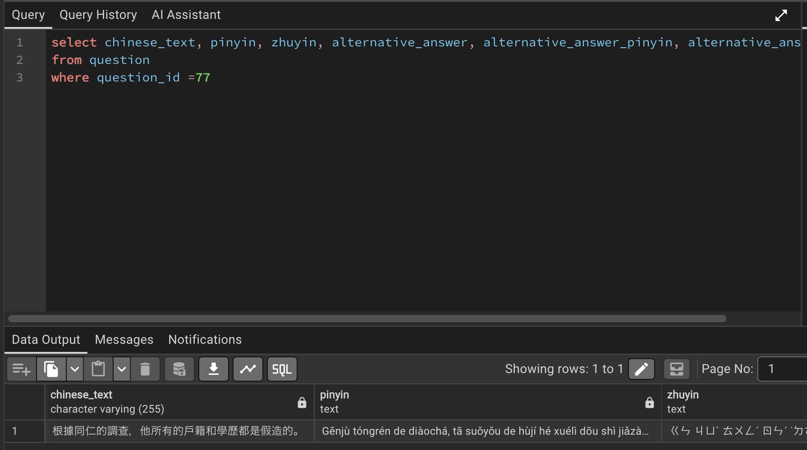

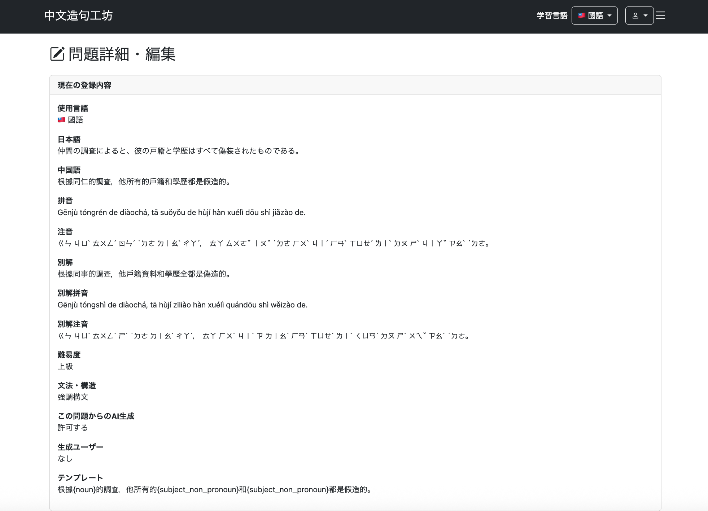

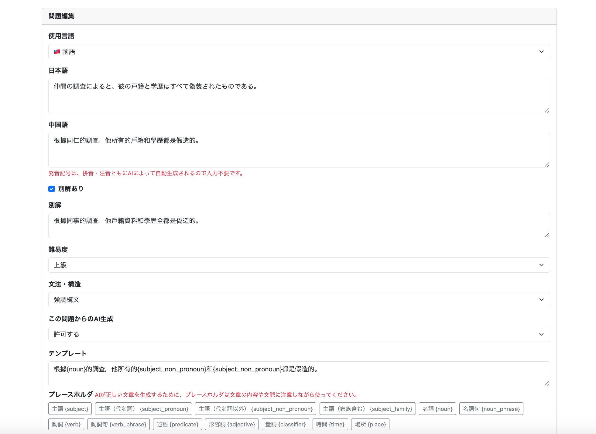

AI生成由来の問題では編集できない旨のメッセージが表示され、編集フォームと更新ボタンが無効化されることを確認した。

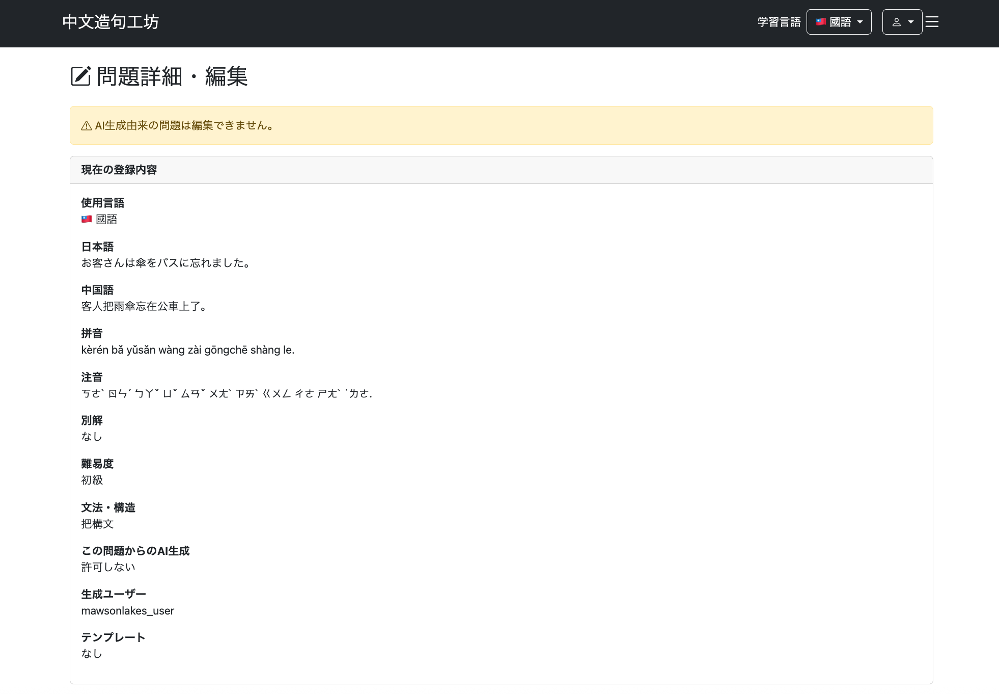

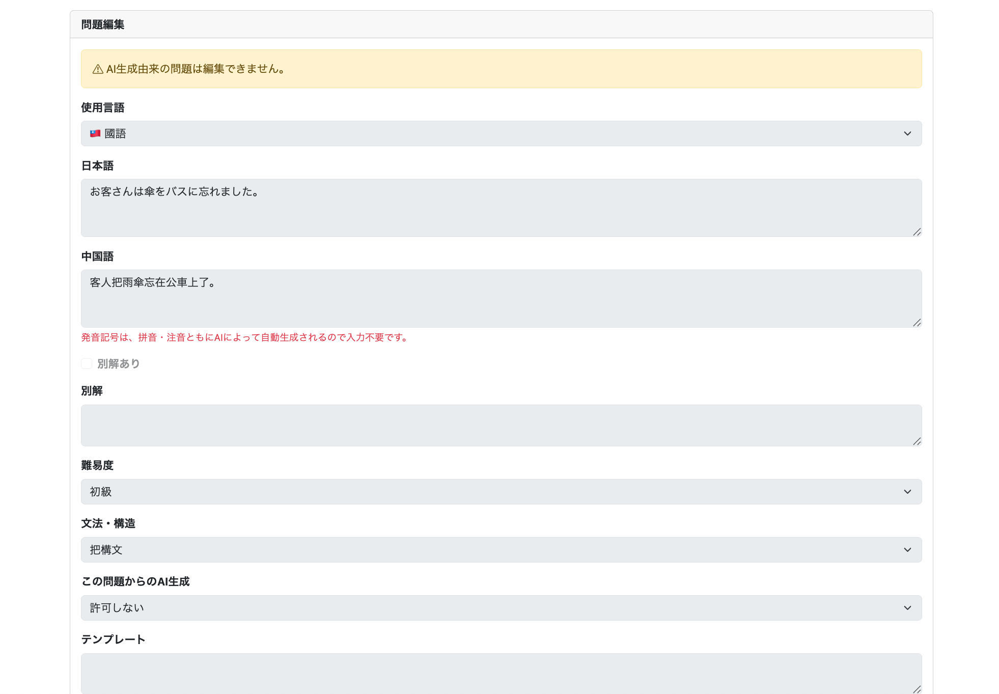

通常問題の内容を変更して更新する。

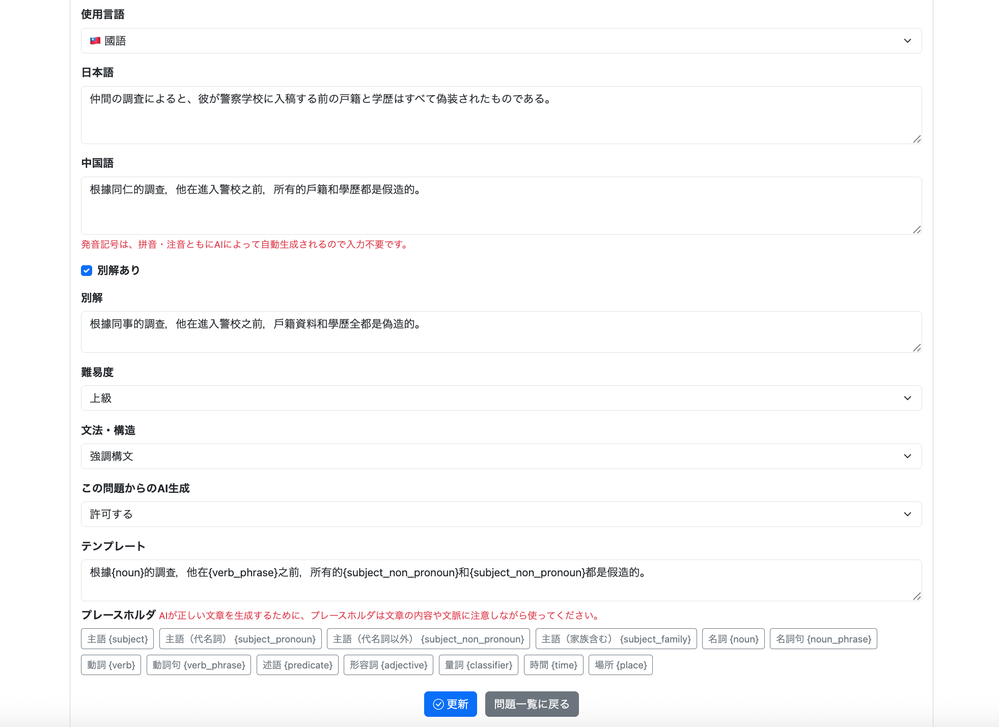

更新後、変更した内容が問題へ反映されていることを確認した。

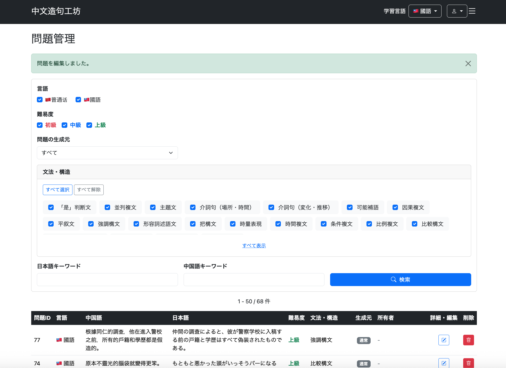

また、必須項目を空欄にして更新した場合はバリデーションエラーとなり、編集画面にエラーが表示されることを確認した。

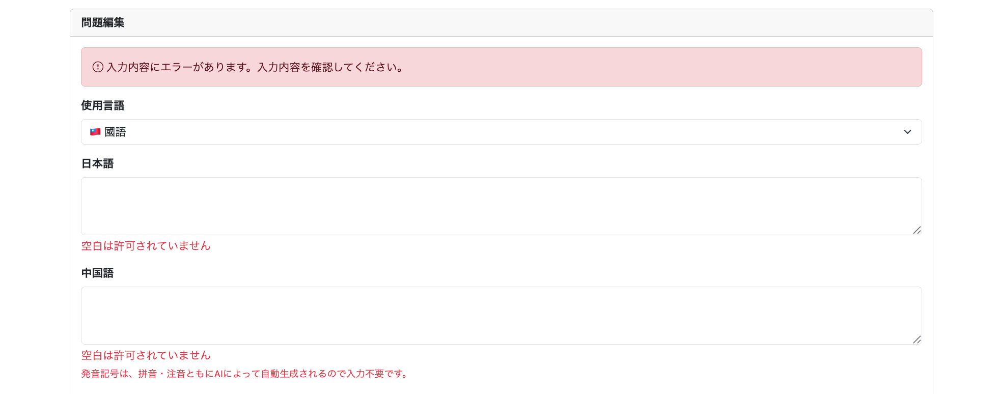

## 4-1. 追加修正 - Templateのバリデーションを修正

```text
git commit -m "Add conditional template validation for AI variation"
```

Templateは、「この問題からのAI生成」を許可する場合は必須とし、許可しない場合は未入力でもよい仕様としている。

しかし、現在の`QuestionForm`ではこの条件をバリデーションしていないため、AI生成を許可した状態でもTemplateを空欄にして更新できてしまう。

現在はTemplateにプレースホルダを含む値が登録されている。

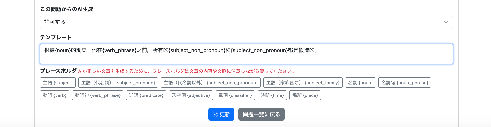

このTemplateを削除して更新する。

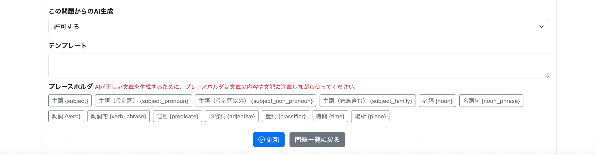

更新が成功し、「この問題からのAI生成」が許可されているにもかかわらず、Templateが空欄の状態で保存されてしまう。

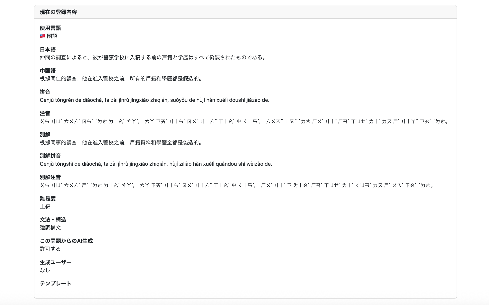

### 原因

現在の`QuestionForm`では、`template`に以下のバリデーションのみを設定している。

```java
@Length(max = 255)
private String template;
```

`@Length(max = 255)`は最大文字数を制限するものであり、空文字自体は禁止しない。

一方、Templateは常に必須ではなく、`allowAiVariation`の値によって入力の要否が変わる。

| allowAiVariation | template | 結果 |
| --- | --- | --- |
| `true` | 入力あり | OK |
| `true` | 空欄 | NG |
| `false` | 入力あり | OK |
| `false` | 空欄 | OK |

そのため、`template`に単純に`@NotBlank`を設定すると、AI生成を許可しない場合にもTemplateが必須になってしまう。

### 修正方針

今回は、

```text
allowAiVariation == true
かつ
templateがnullまたは空白
```

の場合のみエラーとする必要がある。

1つのフィールドだけでは判定できず、`allowAiVariation`と`template`を組み合わせて判定する必要があるため、`QuestionForm`に対するクラスレベルの独自バリデーションを実装する。

```java
@ValidQuestionTemplate
@Data
public class QuestionForm {

    ...

}
```

## 実装

### ValidQuestionTemplate

「AI生成を許可する場合はTemplateを必須とする」という独自バリデーションを定義する。

```java
@Documented
@Constraint(validatedBy = { ValidQuestionTemplateValidator.class })
@Target(ElementType.TYPE)
@Retention(RetentionPolicy.RUNTIME)
public @interface ValidQuestionTemplate {

    String message() default
            "AI生成を許可する場合はテンプレートを入力してください。";

    Class<?>[] groups() default {};

    Class<? extends Payload>[] payload() default {};

}
```

`@Target(ElementType.TYPE)`を指定し、フィールド単体ではなく`QuestionForm`全体を検証対象とする。

`@Constraint`では、実際の判定処理を行う`ValidQuestionTemplateValidator`を指定する。`message`にはバリデーションエラー時に使用するメッセージを定義する。

既存の`PasswordMatchValidator`では、複数のFormで再利用できるように比較対象のフィールド名をアノテーション側から指定する構成としている。

一方、今回の`ValidQuestionTemplateValidator`は、`QuestionForm`固有の`allowAiVariation`と`template`の関係を検証する専用Validatorである。そのため、フィールド名を外部から指定する汎用的な構成にはせず、`QuestionForm`を直接検証する。

### ValidQuestionTemplateValidator

`ValidQuestionTemplate`の実際の判定処理を実装する。

```java
public class ValidQuestionTemplateValidator
        implements ConstraintValidator<ValidQuestionTemplate, QuestionForm> {

    @Override
    public boolean isValid(
            QuestionForm form,
            ConstraintValidatorContext context) {

        if (form == null) {
            return true;
        }

        if (!form.isAllowAiVariation()) {
            return true;
        }

        if (form.getTemplate() != null
                && !form.getTemplate().isBlank()) {
            return true;
        }

        // デフォルトのクラスレベルエラーを無効化
        context.disableDefaultConstraintViolation();

        // エラーをtemplateフィールドに紐付ける
        context.buildConstraintViolationWithTemplate(
                        context.getDefaultConstraintMessageTemplate())
                .addPropertyNode("template")
                .addConstraintViolation();

        return false;
    }

}
```

`isValid`では、まず`QuestionForm`が`null`の場合は他のバリデーションに任せるため`true`を返す。

AI生成を許可していない場合はTemplateが不要なため`true`、AI生成を許可していてTemplateが入力されている場合も`true`を返す。

したがって、ここまでの条件に該当しない「AI生成を許可しているにもかかわらずTemplateが空欄」の場合のみ`false`となる。

| allowAiVariation | template | `isValid` |
| --- | --- | --- |
| `false` | 空欄 | `true` |
| `false` | 入力あり | `true` |
| `true` | 入力あり | `true` |
| `true` | 空欄 | `false` |

#### `disableDefaultConstraintViolation`

`@ValidQuestionTemplate`は`QuestionForm`に付与するクラスレベルのバリデーションであるため、そのままエラーを返すと`QuestionForm`全体のエラーとして扱われる。

今回はTemplate入力欄の下にエラーメッセージを表示したいため、

```java
context.disableDefaultConstraintViolation();
```

でデフォルトのクラスレベルエラーを無効化する。

その後、

```java
context.buildConstraintViolationWithTemplate(
                context.getDefaultConstraintMessageTemplate())
        .addPropertyNode("template")
        .addConstraintViolation();
```

によって、エラーを`template`フィールドに紐付けて登録する。

`getDefaultConstraintMessageTemplate()`では、`@ValidQuestionTemplate`で定義した

```text
AI生成を許可する場合はテンプレートを入力してください。
```

というメッセージを取得する。

`addPropertyNode("template")`でエラーの対象を`template`フィールドに指定し、`addConstraintViolation()`で実際のバリデーションエラーとして登録する。

### QuestionForm

`QuestionForm`に`@ValidQuestionTemplate`を付与する。

```java
@ValidQuestionTemplate
@Data
public class QuestionForm {

    ...(中略)...

}
```

これにより、`QuestionForm`の通常のフィールドバリデーションに加えて、`allowAiVariation`と`template`を組み合わせた条件付きバリデーションが実行される。

## /admin/question/edit.html

Template入力欄の下に、`template`に紐付けたバリデーションエラーを表示する。

```html
<!-- テンプレート -->
<div class="mb-4">

    <label class="form-label fw-bold">
        テンプレート
    </label>

    <textarea th:field="*{template}"
              id="template"
              class="form-control"
              rows="2"
              th:disabled="${originalQuestion.aiGenerated}">
    </textarea>

    <!-- バリデーションエラー -->
    <div class="text-danger mt-1"
         th:if="${#fields.hasErrors('template')}"
         th:errors="*{template}">
    </div>

</div>
```

`ValidQuestionTemplateValidator`でエラーを`template`フィールドに紐付けているため、`#fields.hasErrors('template')`と`th:errors="*{template}"`で通常のフィールドエラーと同じように表示できる。

## /admin/question/add.html

問題追加画面にも同じエラー表示を追加する。

```html
<!-- テンプレート -->
<div class="mb-4">

    <label class="form-label fw-bold">
        テンプレート
    </label>

    <textarea th:field="*{template}"
              id="template"
              class="form-control"
              rows="2">
    </textarea>

    <!-- バリデーションエラー -->
    <div class="text-danger mt-1"
         th:if="${#fields.hasErrors('template')}"
         th:errors="*{template}">
    </div>

</div>
```

これにより、問題追加・編集のどちらでも同じ`QuestionForm`の条件付きバリデーションが適用される。

## バリデーションエラーを画面上部にも表示する

各入力欄のエラー表示に加えて、入力内容にエラーがあることを画面上部にも表示する。

ただし、`#fields`は`th:object`で指定されたFormのバリデーション結果を参照するため、これまで`th:object="${questionForm}"`を設定していた`form`タグの外側ではそのまま使用できない。

そこで、ページ全体を囲む`container`にも`th:object="${questionForm}"`を設定する。

```html
<div class="container mt-4"
     th:object="${questionForm}">

    <!-- バリデーションエラーの場合 -->
    <div th:if="${#fields.hasAnyErrors()}"
         class="alert alert-danger"
         role="alert">

        <i class="bi bi-exclamation-circle"></i>

        入力内容にエラーがあります。入力内容を確認してください。

    </div>

    <!-- 現在の登録内容 -->

    ...
```

`container`の`th:object`は、画面上部の`#fields.hasAnyErrors()`から`questionForm`のバリデーション結果を参照するために使用する。

一方、`form`タグの`th:object="${questionForm}"`は、`th:field`によって各入力項目を`QuestionForm`のフィールドへバインドするために使用する。

同じ`questionForm`を参照しているが、それぞれ使用する場所と目的が異なる。

## 実行

「この問題からのAI生成」を許可した状態で、Templateを空欄にして更新する。

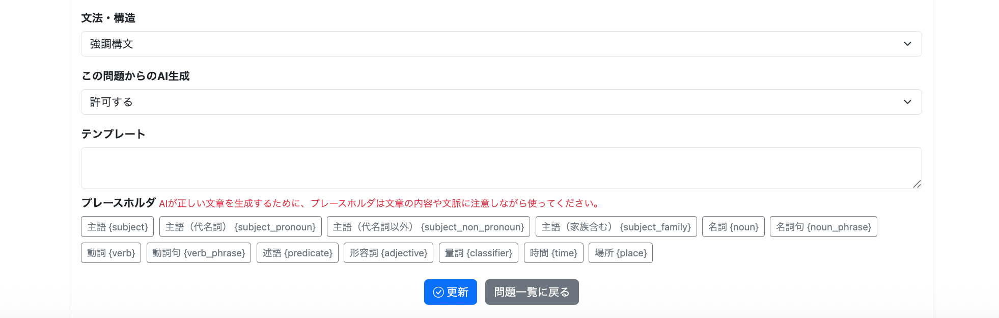

更新は行われず、Template入力欄にバリデーションエラーメッセージが表示されることを確認した。

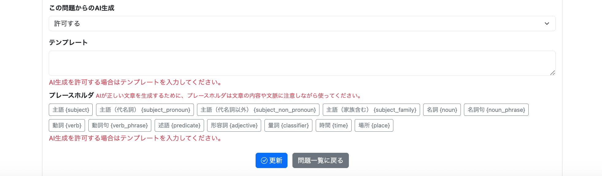

また、画面上部にも入力内容にエラーがあることを示すメッセージが表示されることを確認した。

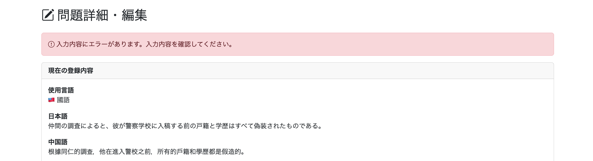

# 5. ユーザー管理ページ（削除・凍結）

ユーザー一覧を表示し、ユーザーの検索、アカウントの凍結・凍結解除、削除を行える管理ページを実装する。

## 要件定義変更

```text
git commit -m "docs: add account lock and user management specifications"
```

ユーザー管理機能の追加に伴い、要件定義書、テーブル定義書、データ設計書、ER図、画面設計書を修正する。

## Usersにフィールド追加

```text
git commit -m "feat: add account lock field to users"
```

ユーザーのアカウントが凍結されているかを管理するため、`users`テーブルに`account_locked`を追加する。

```sql
ALTER TABLE users
ADD COLUMN account_locked BOOLEAN NOT NULL DEFAULT FALSE;
```

`account_locked`は`BOOLEAN`型とし、`true`を凍結中、`false`を有効な状態として扱う。

`NOT NULL DEFAULT FALSE`とすることでNULLを許可せず、既存ユーザーについても初期値として`false`が設定される。

### Users.java

```java
@Column(name = "account_locked")
private boolean accountLocked;
```

`users.account_locked`に対応する`accountLocked`を`Users` Entityへ追加する。

# ユーザー管理ページの実装

```text
git commit -m "feat: add paginated admin user list"
```

まずはユーザーを一覧表示する機能を実装する。この段階では凍結・凍結解除・削除処理は実装せず、一覧表示とページネーションのみを追加する。

## AdminUserService

```java
@Service
@RequiredArgsConstructor
public class AdminUserService {

    private final UserRepository userRepository;

    // ユーザー一覧取得
    public Page<Users> getUsers(Pageable pageable) {

        Page<Users> users =
                userRepository.findAll(pageable);

        return users;
    }

}
```

`getUsers`では、`Pageable`を使用してユーザー一覧を`Page<Users>`として取得する。

## AdminUserController

```java
@Controller
@RequiredArgsConstructor
public class AdminUserController {

    private final AdminUserService adminUserService;
    private final PaginationService paginationService;

    @GetMapping("/admin/user/list")
    public String getUserList(
            @PageableDefault(page = 0, size = 50) Pageable pageable,
            Model model) {

        Page<Users> userList =
                adminUserService.getUsers(pageable);

        PaginationDto pagination =
                paginationService.createPagination(userList);

        // 一覧
        model.addAttribute(
                "userList",
                userList.getContent());

        model.addAttribute(
                "page",
                userList);

        model.addAttribute(
                "pagination",
                pagination);

        return "/admin/user/list";
    }

}
```

`getUserList`では、1ページ50件でユーザー一覧を取得する。

問題一覧ページでも使用している`PaginationService`から`PaginationDto`を作成し、ユーザー一覧、`Page`、ページネーション情報をModelへ設定する。

## /admin/user/list.html

```html
<!DOCTYPE html>

<html xmlns:th="http://www.thymeleaf.org"
      xmlns:layout="http://www.ultraq.net.nz/thymeleaf/layout"
      layout:decorate="~{layout/layout}">

<head>

    <meta charset="UTF-8">

    <title>ユーザー一覧</title>

    <link rel="stylesheet"
          th:href="@{/css/study.css}">

    <link rel="stylesheet"
          th:href="@{/webjars/bootstrap/css/bootstrap.min.css}">

    <script th:src="@{/js/study.js}"
            defer>
    </script>

</head>

<body>

<div layout:fragment="content">

    <div class="header border-bottom">

        <h1 class="h2">
            ユーザー一覧画面
        </h1>

        <!-- 一覧表示 -->
        <div>

            <table class="table table-striped table-bordered table-hover text-center">

                <thead>

                <tr>

                    <th>ユーザーID</th>
                    <th>Role</th>
                    <th>状態</th>
                    <th>凍結</th>
                    <th>削除</th>

                </tr>

                </thead>

                <tbody>

                <tr th:each="item : ${userList}">

                    <td th:text="${item.loginId}"></td>

                    <td th:text="${item.role}"></td>

                    <td>

                        <span th:if="${item.accountLocked}"
                              class="text-danger fw-bold">
                            凍結中
                        </span>

                        <span th:unless="${item.accountLocked}">
                            有効
                        </span>

                    </td>

                    <!-- 凍結 / 凍結解除 -->
                    <td>

                        <form th:if="${!item.accountLocked}"
                              th:action="@{/admin/user/lock}"
                              method="post">

                            <input type="hidden"
                                   name="userId"
                                   th:value="${item.id}">

                            <button type="submit"
                                    class="btn btn-warning"
                                    onclick="return confirm('ユーザーを凍結しますか？');">
                                凍結
                            </button>

                        </form>

                        <form th:if="${item.accountLocked}"
                              th:action="@{/admin/user/unlock}"
                              method="post">

                            <input type="hidden"
                                   name="userId"
                                   th:value="${item.id}">

                            <button type="submit"
                                    class="btn btn-success"
                                    onclick="return confirm('ユーザーの凍結を解除しますか？');">
                                凍結解除
                            </button>

                        </form>

                    </td>

                    <!-- 削除 -->
                    <td>

                        <form th:action="@{/admin/user/delete}"
                              method="post">

                            <input type="hidden"
                                   name="userId"
                                   th:value="${item.id}">

                            <button type="submit"
                                    class="btn btn-danger"
                                    onclick="return confirm('ユーザーを削除しますか？');">
                                削除
                            </button>

                        </form>

                    </td>

                </tr>

                </tbody>

            </table>

            <!-- ========================= -->
            <!-- ページネーション -->
            <!-- ========================= -->

            <nav class="mt-4 mb-5"
                 th:if="${page.totalPages > 0}">

                <ul class="pagination justify-content-center">

                    <!-- 前へ -->
                    <li class="page-item"
                        th:classappend="${page.first} ? ' disabled'">

                        <a class="page-link"
                           th:href="@{/admin/user/list(
                               page=${page.number - 1},
                               size=${page.size}
                           )}">
                            前へ
                        </a>

                    </li>

                    <!-- 1ページ目 -->
                    <li class="page-item"
                        th:classappend="${page.number == 0} ? ' active'">

                        <a class="page-link"
                           th:href="@{/admin/user/list(
                               page=0,
                               size=${page.size}
                           )}">
                            1
                        </a>

                    </li>

                    <!-- ... 先頭側 -->
                    <li class="page-item disabled"
                        th:if="${pagination.showFirstEllipsis}">

                        <span class="page-link">...</span>

                    </li>

                    <!-- 中央のページ番号 -->
                    <li class="page-item"
                        th:each="i : ${#numbers.sequence(
                            pagination.displayStartPage,
                            pagination.displayEndPage)}"
                        th:if="${i != 0 and i != page.totalPages - 1}"
                        th:classappend="${i == pagination.currentPage} ? ' active'">

                        <a class="page-link"
                           th:href="@{/admin/user/list(
                               page=${i},
                               size=${page.size}
                           )}"
                           th:text="${i + 1}">
                        </a>

                    </li>

                    <!-- ... 末尾側 -->
                    <li class="page-item disabled"
                        th:if="${pagination.showLastEllipsis}">

                        <span class="page-link">...</span>

                    </li>

                    <!-- 最終ページ -->
                    <li class="page-item"
                        th:if="${page.totalPages > 1}"
                        th:classappend="${page.last} ? ' active'">

                        <a class="page-link"
                           th:href="@{/admin/user/list(
                               page=${page.totalPages - 1},
                               size=${page.size}
                           )}"
                           th:text="${page.totalPages}">
                        </a>

                    </li>

                    <!-- 次へ -->
                    <li class="page-item"
                        th:classappend="${page.last} ? ' disabled'">

                        <a class="page-link"
                           th:href="@{/admin/user/list(
                               page=${page.number + 1},
                               size=${page.size}
                           )}">
                            次へ
                        </a>

                    </li>

                </ul>

            </nav>

            <div class="text-center mt-3 mb-3">

                <a th:href="@{/admin/menu}"
                   class="btn btn-secondary">
                    adminメニューに戻る
                </a>

            </div>

        </div>

    </div>

</div>

</body>

</html>
```

ユーザーのログインID、Role、アカウント状態を一覧表示し、`accountLocked`の値によって「有効」または「凍結中」を表示する。

また、`PaginationDto`を使用して問題一覧ページと同じ形式のページネーションを表示する。

この段階では凍結・凍結解除・削除用のフォームも配置しているが、対応する処理は後続で実装する。

## 実行

ユーザー管理ページを表示し、現在登録されているユーザーが一覧表示されることを確認した。

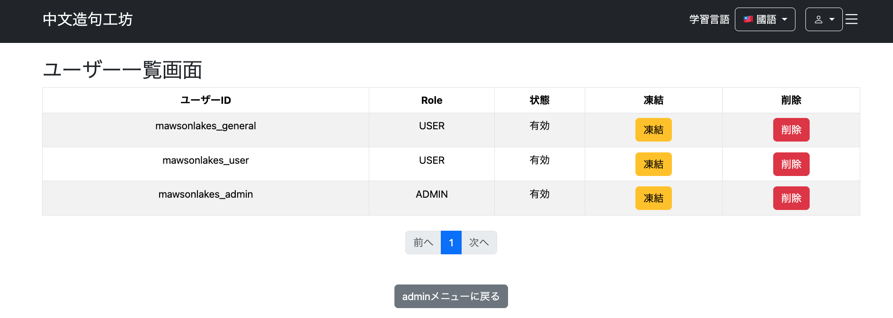

# ユーザー検索フォームを追加

```text
git commit -m "feat: add search filters to admin user list"
```

ユーザー数が増えた場合でも対象のユーザーを探せるよう、ユーザー一覧に検索機能を追加する。

検索条件は以下の2つとする。

- ログインID：部分一致検索
- アカウント状態：すべて・有効・凍結中

検索フォームから送信された条件をまとめて受け取るための`AdminUserSearchDto`と、アカウント状態を管理する`AccountStatus`を追加する。

## AdminUserSearchDto

```java
@Data
public class AdminUserSearchDto {

    private String loginId;

    private AccountStatus accountStatus;

}
```

検索フォームから送信されるログインIDとアカウント状態を保持する。

## AccountStatus

```java
public enum AccountStatus {

    ALL,

    ACTIVE,

    LOCKED

}
```

アカウント状態の検索条件を、すべて・有効・凍結中の3種類で管理する。

## UserRepository

```java
@Query("""
        SELECT u
        FROM Users u
        WHERE
            (:loginId IS NULL
                OR :loginId = ''
                OR u.loginId LIKE CONCAT('%', :loginId, '%'))
        AND
            (:accountStatus = 'ALL'
                OR (:accountStatus = 'ACTIVE' AND u.accountLocked = false)
                OR (:accountStatus = 'LOCKED' AND u.accountLocked = true))
        """)
Page<Users> findUsers(
        @Param("loginId") String loginId,
        @Param("accountStatus") String accountStatus,
        Pageable pageable);
```

ログインIDが未入力の場合はログインIDによる絞り込みを行わず、入力されている場合は部分一致で検索する。

アカウント状態は、`ALL`ならすべて、`ACTIVE`なら有効なユーザー、`LOCKED`なら凍結中のユーザーのみを取得する。

戻り値は`Page<Users>`とし、検索結果にもページネーションを適用する。

## AdminUserService

```java
// ユーザー一覧取得
public Page<Users> getUsers(
        AdminUserSearchDto searchDto,
        Pageable pageable) {

    return userRepository.findUsers(
            searchDto.getLoginId(),
            searchDto.getAccountStatus().name(),
            pageable);
}
```

一覧取得時に`AdminUserSearchDto`を受け取り、ログインIDとアカウント状態をRepositoryへ渡して検索する。

## AdminUserController

```java
@GetMapping("/admin/user/list")
public String getUserList(
        @ModelAttribute AdminUserSearchDto searchDto,
        @PageableDefault(page = 0, size = 50) Pageable pageable,
        Model model) {

    if (searchDto.getAccountStatus() == null) {
        searchDto.setAccountStatus(AccountStatus.ALL);
    }

    Page<Users> userList =
            adminUserService.getUsers(
                    searchDto,
                    pageable);

    PaginationDto pagination =
            paginationService.createPagination(userList);

    // 一覧
    model.addAttribute(
            "userList",
            userList.getContent());

    model.addAttribute(
            "page",
            userList);

    model.addAttribute(
            "pagination",
            pagination);

    // 検索条件
    model.addAttribute(
            "searchDto",
            searchDto);

    return "/admin/user/list";
}
```

`@ModelAttribute`で検索フォームから送信された`loginId`と`accountStatus`を`AdminUserSearchDto`として受け取る。

初回アクセス時は`accountStatus`が`null`になるため、初期値として`ALL`を設定する。

検索条件はServiceへ渡してユーザーを取得するとともに、検索後も入力・選択状態を維持できるようModelへ設定する。

なお、`@ModelAttribute AdminUserSearchDto searchDto`とすることで`searchDto`自体はModelにも登録されるため、明示的な`model.addAttribute("searchDto", searchDto)`は省略可能である。

## /admin/user/list.html

検索フォームを追加する。

```html
<!-- ========================= -->
<!-- 検索フォーム -->
<!-- ========================= -->

<form th:action="@{/admin/user/list}"
      th:object="${searchDto}"
      method="get"
      class="mb-4">

    <div class="row g-3 align-items-end">

        <!-- ログインID -->
        <div class="col-md-5">

            <label for="loginId"
                   class="form-label">
                ログインID
            </label>

            <input type="text"
                   id="loginId"
                   th:field="*{loginId}"
                   class="form-control"
                   placeholder="ログインIDを入力">

        </div>

        <!-- アカウント状態 -->
        <div class="col-md-5">

            <label class="form-label d-block">
                アカウント状態
            </label>

            <div class="form-check form-check-inline">

                <input class="form-check-input"
                       type="radio"
                       th:field="*{accountStatus}"
                       value="ALL"
                       id="statusAll">

                <label class="form-check-label"
                       for="statusAll">
                    すべて
                </label>

            </div>

            <div class="form-check form-check-inline">

                <input class="form-check-input"
                       type="radio"
                       th:field="*{accountStatus}"
                       value="ACTIVE"
                       id="statusActive">

                <label class="form-check-label"
                       for="statusActive">
                    有効
                </label>

            </div>

            <div class="form-check form-check-inline">

                <input class="form-check-input"
                       type="radio"
                       th:field="*{accountStatus}"
                       value="LOCKED"
                       id="statusLocked">

                <label class="form-check-label"
                       for="statusLocked">
                    凍結中
                </label>

            </div>

        </div>

        <!-- 検索 -->
        <div class="col-md-2">

            <button type="submit"
                    class="btn btn-primary w-100">
                検索
            </button>

        </div>

    </div>

</form>
```

検索フォームはGETで送信し、`AdminUserSearchDto`へログインIDとアカウント状態をバインドする。

例えば、ログインIDに`test`、アカウント状態に`LOCKED`を指定した場合は、以下の検索条件となる。

```text
/admin/user/list?loginId=test&accountStatus=LOCKED
```

### ページネーションに検索条件を追加

検索結果の2ページ目以降でも検索条件を維持するため、すべてのページネーションリンクに`loginId`と`accountStatus`を追加する。

「前へ」は以下のように変更する。

```html
<a class="page-link"
   th:href="@{/admin/user/list(
       page=${page.number - 1},
       size=${page.size},
       loginId=${searchDto.loginId},
       accountStatus=${searchDto.accountStatus}
   )}">
    前へ
</a>
```

1ページ目も同様に検索条件を引き継ぐ。

```html
<a class="page-link"
   th:href="@{/admin/user/list(
       page=0,
       size=${page.size},
       loginId=${searchDto.loginId},
       accountStatus=${searchDto.accountStatus}
   )}">
    1
</a>
```

中央のページ番号にも追加する。

```html
<a class="page-link"
   th:href="@{/admin/user/list(
       page=${i},
       size=${page.size},
       loginId=${searchDto.loginId},
       accountStatus=${searchDto.accountStatus}
   )}"
   th:text="${i + 1}">
</a>
```

最終ページにも追加する。

```html
<a class="page-link"
   th:href="@{/admin/user/list(
       page=${page.totalPages - 1},
       size=${page.size},
       loginId=${searchDto.loginId},
       accountStatus=${searchDto.accountStatus}
   )}"
   th:text="${page.totalPages}">
</a>
```

「次へ」にも追加する。

```html
<a class="page-link"
   th:href="@{/admin/user/list(
       page=${page.number + 1},
       size=${page.size},
       loginId=${searchDto.loginId},
       accountStatus=${searchDto.accountStatus}
   )}">
    次へ
</a>
```

これにより、例えばログインIDに`abc`、アカウント状態に`LOCKED`を指定して検索した後に2ページ目へ移動しても、

```text
loginId=abc
accountStatus=LOCKED
page=1
```

が引き継がれ、同じ検索条件のままページを移動できる。

## 実行

ユーザー一覧の上部に検索フォームが表示されることを確認した。


ログインIDの一部を入力して検索し、該当するユーザーのみが表示されることを確認した。

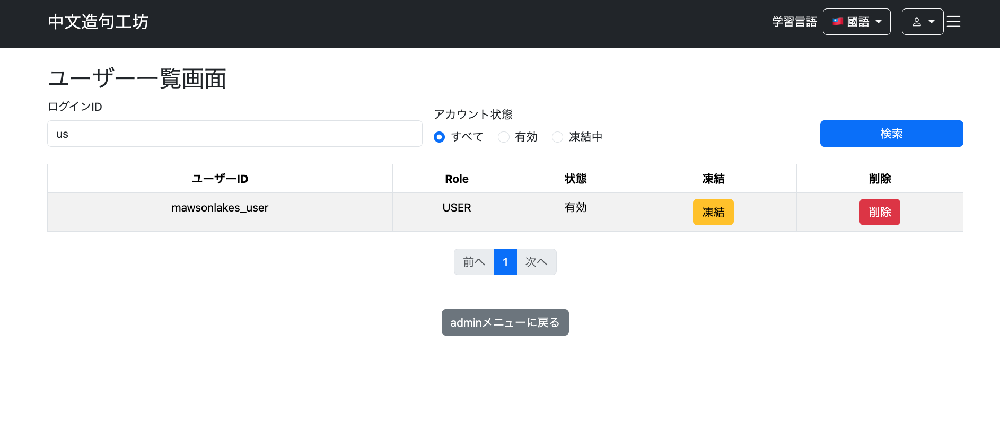

# ユーザーを凍結・凍結解除する

```text
git commit -m "feat: add user account lock and unlock functionality"
```

ユーザー管理ページから、一般ユーザーのアカウントを凍結・凍結解除できるようにする。

## UserRepository

`UserRepository`は`JpaRepository<Users, Long>`を継承しているため、凍結・凍結解除に必要なユーザー取得と保存には既存の

```java
findById()
save()
```

を使用する。

そのため、Repositoryへのメソッド追加は行わない。

## AdminUserService

```java
// ユーザー凍結
public void lockUser(Long userId) {

    Users user = userRepository.findById(userId)
            .orElseThrow();

    if (user.getRole() == Role.ADMIN) {
        throw new IllegalStateException(
                "管理者ユーザーは凍結できません。");
    }

    if (!user.isAccountLocked()) {
        user.setAccountLocked(true);
    }

    userRepository.save(user);
}

// ユーザー凍結解除
public void unlockUser(Long userId) {

    Users user = userRepository.findById(userId)
            .orElseThrow();

    if (user.isAccountLocked()) {
        user.setAccountLocked(false);
    }

    userRepository.save(user);
}
```

`lockUser`では対象ユーザーを取得し、ADMINでないことを確認して`accountLocked`を`true`に変更する。

`unlockUser`では、凍結中のユーザーの`accountLocked`を`false`へ戻す。

ADMINは凍結できないようService側で制御する。また、画面側でもADMINには操作ボタンを表示しないことで二重に防止する。

## AdminUserController

```java
// ユーザー凍結
@PostMapping("/admin/user/lock")
public String lockUser(
        @RequestParam Long userId,
        RedirectAttributes redirectAttributes) {

    adminUserService.lockUser(userId);

    redirectAttributes.addFlashAttribute(
            "successMessage",
            "ユーザーを凍結しました。");

    return "redirect:/admin/user/list";
}

// ユーザー凍結解除
@PostMapping("/admin/user/unlock")
public String unlockUser(
        @RequestParam Long userId,
        RedirectAttributes redirectAttributes) {

    adminUserService.unlockUser(userId);

    redirectAttributes.addFlashAttribute(
            "successMessage",
            "ユーザーの凍結を解除しました。");

    return "redirect:/admin/user/list";
}
```

それぞれServiceの凍結・凍結解除処理を実行し、処理完了後に成功メッセージを設定してユーザー一覧へリダイレクトする。

## /admin/user/list.html

成功時のメッセージ表示を追加する。

```html
<!-- 成功メッセージ -->
<div th:if="${successMessage}"
     class="alert alert-success"
     role="alert"
     th:text="${successMessage}">
</div>
```

凍結・凍結解除欄は、ADMINの場合は操作ボタンを表示せず、一般ユーザーについてのみ現在の状態に応じたボタンを表示する。

```html
<!-- 凍結 / 凍結解除 -->
<td>

    <!-- ADMINは操作不可 -->
    <span th:if="${item.role.name() == 'ADMIN'}">
        -
    </span>

    <!-- 有効ユーザー -->
    <form th:if="${item.role.name() != 'ADMIN' and !item.accountLocked}"
          th:action="@{/admin/user/lock}"
          method="post">

        <input type="hidden"
               name="userId"
               th:value="${item.id}">

        <button type="submit"
                class="btn btn-warning"
                onclick="return confirm('ユーザーを凍結しますか？');">
            凍結
        </button>

    </form>

    <!-- 凍結中ユーザー -->
    <form th:if="${item.role.name() != 'ADMIN' and item.accountLocked}"
          th:action="@{/admin/user/unlock}"
          method="post">

        <input type="hidden"
               name="userId"
               th:value="${item.id}">

        <button type="submit"
                class="btn btn-success"
                onclick="return confirm('ユーザーの凍結を解除しますか？');">
            凍結解除
        </button>

    </form>

</td>
```

ADMINの場合は`-`を表示し、一般ユーザーの場合は`accountLocked`の状態によって「凍結」または「凍結解除」ボタンを切り替える。

## 実行

ADMINには凍結・凍結解除ボタンが表示されず、操作できないことを確認した。この段階では削除ボタンの制御はまだ実装していない。

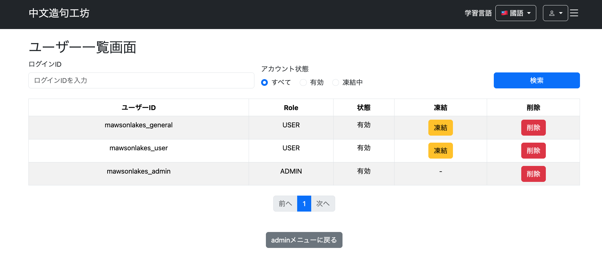

一般ユーザーを凍結し、アカウント状態が「凍結中」へ変更され、成功メッセージが表示されることを確認した。

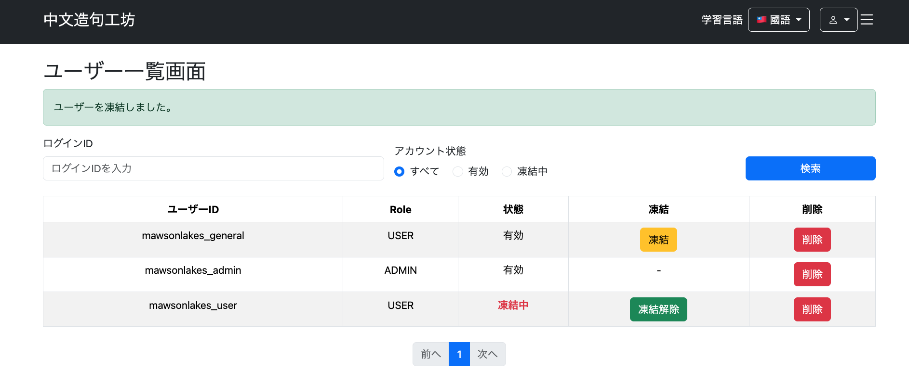

同じユーザーの凍結を解除し、アカウント状態が「有効」へ戻り、成功メッセージが表示されることを確認した。

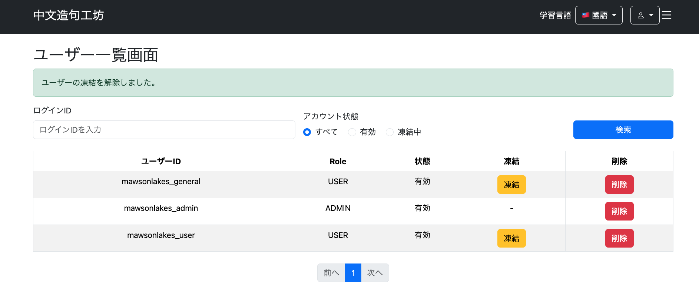

# ユーザーを削除する

```text
git commit -m "feat: add user deletion with related data cleanup"
```

ユーザーを削除する際は`Users`だけを削除するのではなく、そのユーザーに紐づく関連データも削除する。

削除順は以下とする。

```text
① Favorite
    ↓
② AiGenerationHistory
    ↓
③ StudyHistory
    ↓
④ ユーザー所有のAI生成由来Question
    ↓
⑤ Users
```

関連データを先に削除し、最後に`Users`を削除することで、外部キー制約による削除エラーを防ぐ。

## FavoriteRepository

当初、ユーザーのお気に入り削除には以下の派生削除クエリを使用していた。

```java
void deleteByFavoriteKeyUserId(Long userId);
```

これを、`@Modifying`と`@Query`を使用した明示的なDELETEへ変更する。

```java
@Modifying
@Query("""
        DELETE FROM Favorite f
        WHERE f.favoriteKey.userId = :userId
        """)
void deleteByFavoriteKeyUserId(
        @Param("userId") Long userId);
```

`@Modifying`は、`@Query`がSELECTではなく、UPDATEやDELETEなどDBのデータを変更する処理であることをSpring Data JPAへ示す。

### 派生削除クエリと明示的なDELETE

当初使用していた、

```java
void deleteByFavoriteKeyUserId(Long userId);
```

のように、メソッド名から削除条件を組み立てる方法は派生削除クエリである。

派生削除クエリでは、条件に一致するEntityを取得したうえで、それぞれを削除する。そのため、Entityの削除時に`@PreRemove`などのライフサイクルコールバックを実行できる。

一方、

```java
@Modifying
@Query("""
        DELETE FROM Favorite f
        WHERE f.favoriteKey.userId = :userId
        """)
void deleteByFavoriteKeyUserId(
        @Param("userId") Long userId);
```

では、対象の`Favorite`を1件ずつEntityとして取得せず、条件に一致するデータに対して明示的なDELETEを実行する。

つまり、両者は削除対象が同じでも、削除を実行する方法が異なる。

```text
【派生削除クエリ】

削除対象を検索
    ↓
Entityとして取得
    ↓
Entityをそれぞれ削除


【@Modifying + @Query】

DELETEクエリを発行
    ↓
条件に一致するデータを削除
```

### 今回の削除方法を変更する

関連データを、

```text
① Favorite
    ↓
② AiGenerationHistory
    ↓
③ StudyHistory
    ↓
④ ユーザー所有のAI生成由来Question
    ↓
⑤ Users
```

の順に削除する処理を実行したところ、④の`Question`を削除する際に以下の外部キー制約違反が発生した。

```text
Key (question_id)=(83) is still referenced from table "favorite"
```

Java上では`Favorite`の削除処理を先に呼び出していたが、`Question`をDELETEした時点で、その問題を参照する`Favorite`がDB上に残っていた。

ただし、実際に発行されたSQLの順番やHibernate内部の状態まで確認していないため、派生削除クエリを使用していたこと自体が外部キー制約違反の直接的な原因だったとは断定できない。

また、関連データの削除には`Favorite`だけでなく、

```java
favoriteRepository.deleteByFavoriteKeyUserId(userId);
aiGenerationHistoryRepository.deleteByUserId(userId);
studyHistoryRepository.deleteByStudyHistoryKeyUserId(userId);
```

の3つで派生削除クエリを使用していた。

今回必要なのは、各Entityに対して個別の削除処理を行うことではなく、ユーザーに紐づく関連データを決めた順番で削除することである。

そこで、原因を`Favorite`の処理だけに限定せず、関連データの削除に使用する3つの派生削除クエリをすべて`@Modifying`と`@Query`による明示的なDELETEへ変更する。

## AiGenerationHistoryRepository

```java
@Modifying
@Query("""
        DELETE FROM AiGenerationHistory a
        WHERE a.user.id = :userId
        """)
void deleteByUserId(
        @Param("userId") Long userId);
```

指定したユーザーが持つAI問題生成履歴を明示的なDELETEで削除する。

## StudyHistoryRepository

これまでの派生削除クエリ、

```java
void deleteByStudyHistoryKeyUserId(Long userId);
```

を明示的なDELETEへ変更する。

```java
@Modifying
@Query("""
        DELETE FROM StudyHistory sh
        WHERE sh.studyHistoryKey.userId = :userId
        """)
void deleteByStudyHistoryKeyUserId(
        @Param("userId") Long userId);
```

指定したユーザーの学習履歴を削除する。

## QuestionRepository

ユーザーが所有するAI生成由来の問題を削除する。

```java
@Modifying
@Query("""
        DELETE FROM Question q
        WHERE q.owner.id = :userId
        AND q.aiGenerated = true
        """)
void deleteByOwnerId(
        @Param("userId") Long userId);
```

`owner.id`が削除対象ユーザーと一致し、かつ`aiGenerated = true`の問題のみを削除する。

## UserAccountService

ユーザーと関連データを削除する処理は`AdminUserService`ではなく、`UserAccountService`へ実装する。

一般ユーザー自身の退会とAdminによるユーザー削除のどちらでも同じ関連データ削除処理が必要になるため、`UserAccountService`へまとめることで処理を共通化する。

### 一般ユーザーの退会

```java
@Transactional
public void cancelMembership(
        String loginId,
        Locale locale) {

    Users user = getUserOne(loginId);

    if (user == null) {

        throw new IllegalArgumentException(
                messageSource.getMessage(
                        "user.delete.error.notFound",
                        null,
                        locale
                )
        );
    }

    deleteUserData(user);

    log.info(
            "退会完了 loginId={}",
            loginId);
}
```

ログインIDから退会対象のユーザーを取得し、存在することを確認してから`deleteUserData`でユーザーと関連データを削除する。

### Adminによるユーザー削除

```java
@Transactional
public void deleteUser(
        Long userId,
        Locale locale) {

    Users user = userRepository.findById(userId)
            .orElseThrow(() ->
                    new IllegalArgumentException(
                            messageSource.getMessage(
                                    "user.delete.error.notFound",
                                    null,
                                    locale
                            )
                    )
            );

    if (user.getRole() == Role.ADMIN) {

        throw new IllegalStateException(
                messageSource.getMessage(
                        "admin.user.delete.error.admin",
                        null,
                        locale
                )
        );
    }

    deleteUserData(user);

    log.info(
            "ユーザー削除完了 userId={}",
            userId);
}
```

ユーザーIDから削除対象を取得し、ADMINでないことを確認したうえで`deleteUserData`を実行する。

この処理は一般ユーザーの退会処理と共通の`UserAccountService`に実装しているため、エラーメッセージについても既存の`messages.properties`を使用する。

### 共通の関連データ削除処理

```java
private void deleteUserData(Users user) {

    Long userId = user.getId();

    // ① ユーザーのお気に入りを削除
    favoriteRepository.deleteByFavoriteKeyUserId(userId);

    // ② ユーザーのAI生成履歴を削除
    aiGenerationHistoryRepository.deleteByUserId(userId);

    // ③ ユーザーの学習履歴を削除
    studyHistoryRepository
            .deleteByStudyHistoryKeyUserId(userId);

    // ④ ユーザー所有のAI生成由来問題を削除
    questionRepository.deleteByOwnerId(userId);

    // ⑤ ユーザーを削除
    userRepository.delete(user);
}
```

`deleteUserData`では、お気に入り、AI生成履歴、学習履歴、ユーザー所有のAI生成由来問題を順番に削除し、最後にユーザー自身を削除する。

一般ユーザーの退会とAdminによるユーザー削除のどちらからも、この共通処理を使用する。

## AdminUserController

```java
// ユーザー削除
@PostMapping("/admin/user/delete")
public String deleteUser(
        @RequestParam Long userId,
        RedirectAttributes redirectAttributes,
        Locale locale) {

    userAccountService.deleteUser(
            userId,
            locale);

    redirectAttributes.addFlashAttribute(
            "successMessage",
            "ユーザーを削除しました。");

    return "redirect:/admin/user/list";
}
```

削除対象の`userId`を受け取り、`UserAccountService.deleteUser`でユーザーと関連データを削除する。

削除完了後は成功メッセージを設定し、ユーザー一覧へリダイレクトする。

## messages.properties

`UserAccountService`で使用するユーザー削除時のメッセージを追加する。

### 日本語

```properties
user.delete.error.notFound=ユーザーが存在しません
admin.user.delete.error.admin=管理者ユーザーは削除できません
admin.user.delete.success=ユーザーを削除しました。
```


Admin画面自体は日本語固定としているが、今回の削除処理は一般ユーザーの退会処理と共通の`UserAccountService`で扱うため、共通処理で使用するエラーメッセージは`messages.properties`で管理する。

## /admin/user/list.html

ADMINを削除できないよう、ADMINの場合は削除ボタンを表示しない。

```html
<td>

    <span th:if="${item.role.name() == 'ADMIN'}">
        -
    </span>

    <form th:if="${item.role.name() != 'ADMIN'}"
          th:action="@{/admin/user/delete}"
          method="post">

        <input type="hidden"
               name="userId"
               th:value="${item.id}">

        <button type="submit"
                class="btn btn-danger"
                onclick="return confirm('ユーザーを削除しますか？');">
            削除
        </button>

    </form>

</td>
```

画面上でADMINの削除操作をできないようにするとともに、Service側でもADMINの削除を拒否することで二重に制御する。

削除成功時のメッセージについては、凍結・凍結解除機能で追加した以下の表示領域をそのまま使用する。

```html
<div th:if="${successMessage}"
     class="alert alert-success"
     role="alert"
     th:text="${successMessage}">
</div>
```

そのため、削除成功メッセージ専用のHTMLは追加しない。

## 実行

ユーザー一覧を表示し、ADMINには削除ボタンが表示されないことを確認した。

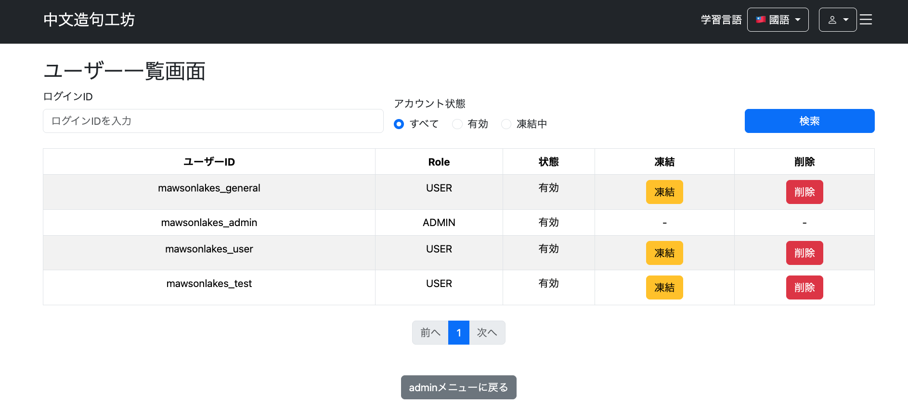

ユーザー削除時に関連データも削除されることを確認するため、テストユーザーにお気に入り、学習履歴、AI生成履歴、AI生成由来の所有問題を登録した状態にする。

削除前の関連データ件数を以下のSQLで確認する。

```sql
SELECT
    u.id AS user_id,
    u.login_id,
    (SELECT COUNT(*)
     FROM favorite f
     WHERE f.user_id = u.id) AS favorite_count,
    (SELECT COUNT(*)
     FROM study_history sh
     WHERE sh.user_id = u.id) AS study_history_count,
    (SELECT COUNT(*)
     FROM ai_generation_history agh
     WHERE agh.user_id = u.id) AS ai_generation_history_count,
    (SELECT COUNT(*)
     FROM question q
     WHERE q.owner_user_id = u.id
       AND q.ai_generated = true) AS owned_ai_question_count
FROM users u
WHERE u.login_id = 'mawsonlakes_test';
```

削除前のテストユーザーには、以下の関連データが存在することを確認した。

| 項目 | 件数 |
| --- | ---: |
| user_id | 8 |
| お気に入り | 5 |
| 学習履歴 | 17 |
| AI生成履歴 | 8 |
| AI生成由来の所有問題 | 8 |

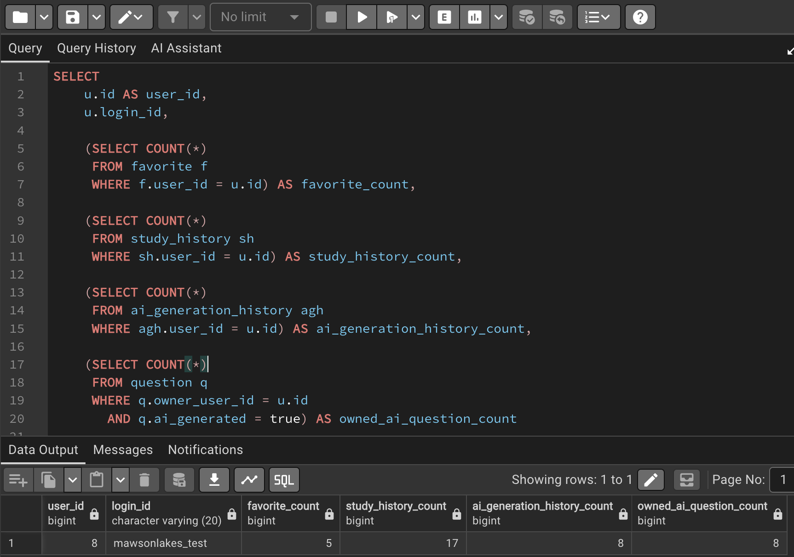

ユーザー一覧からテストユーザーを削除し、削除成功メッセージが表示されることを確認した。

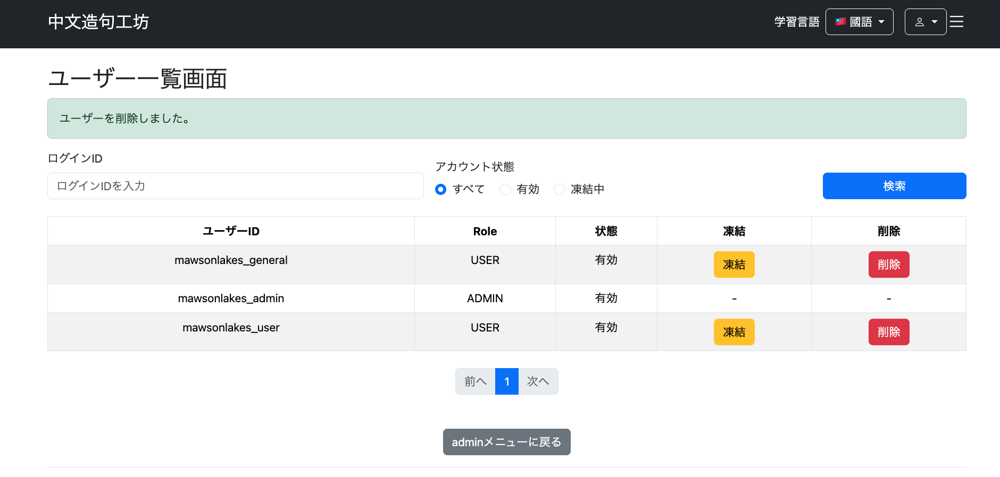

再度DBを確認し、`user_id = 8`、`login_id = "mawsonlakes_test"`のユーザーと、そのユーザーに紐づいていた関連データが削除されていることを確認した。

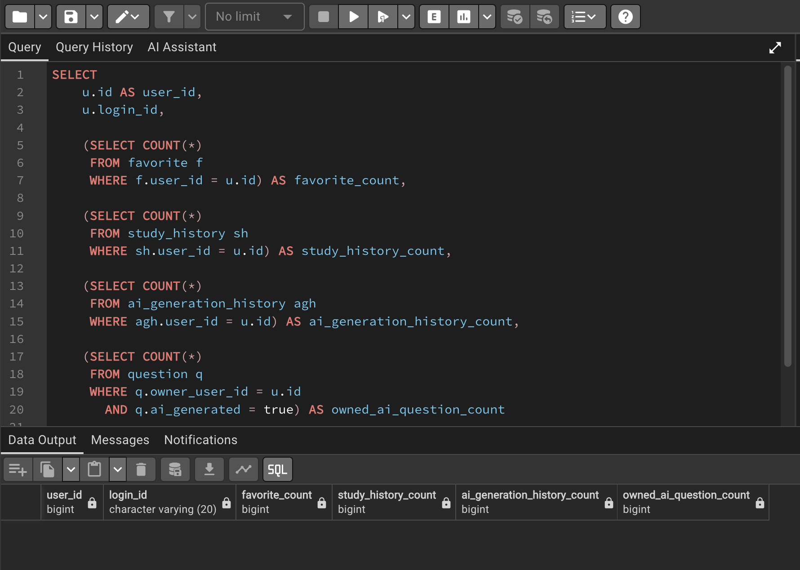

# 6. 文法・構造管理ページ

## 問題点

問題を新規追加・編集する際には文法・構造を選択するが、既存の選択肢の中に適切なものが存在しないケースがあった。

今後も必要な文法・構造が増えることが想定されるため、Adminから文法・構造を追加・編集・削除できる管理機能を実装する。

# 文法・構造一覧ページを作る

```text
git commit -m "feat: add admin structure management list"
```

Adminから現在登録されている文法・構造を確認できる一覧ページを作成する。

一覧には以下の項目を表示する。

- 文法ID
- 文法名
- 中国大陸向け説明
- 台湾向け説明

## StructureRepository

文法・構造を`structureId`の昇順で取得するメソッドを追加する。

```java
@Query("""
        SELECT s
        FROM Structure s
        ORDER BY s.structureId ASC
        """)
Page<Structure> findStructures(Pageable pageable);
```

一覧にはページネーションを適用するため、戻り値は`Page<Structure>`とする。

## AdminStructureService

```java
@Service
@RequiredArgsConstructor
public class AdminStructureService {

    private final StructureRepository structureRepository;

    // 文法一覧取得
    public Page<Structure> getStructures(Pageable pageable) {

        return structureRepository.findStructures(pageable);

    }

}
```

`getStructures`では、`Pageable`を使用して文法・構造一覧を`Page<Structure>`として取得する。

## AdminStructureController

```java
@Controller
@RequiredArgsConstructor
public class AdminStructureController {

    private final AdminStructureService adminStructureService;
    private final PaginationService paginationService;

    // 文法一覧
    @GetMapping("/admin/structure/list")
    public String getStructureList(
            @PageableDefault(page = 0, size = 50) Pageable pageable,
            Model model) {

        Page<Structure> structureList =
                adminStructureService.getStructures(pageable);

        PaginationDto pagination =
                paginationService.createPagination(structureList);

        model.addAttribute(
                "structureList",
                structureList.getContent());

        model.addAttribute(
                "page",
                structureList);

        model.addAttribute(
                "pagination",
                pagination);

        return "/admin/structure/list";

    }

}
```

`getStructureList`では文法・構造一覧を`Page`で取得し、`PaginationService`からページネーション情報を作成する。

取得した一覧、`Page`、ページネーション情報をそれぞれModelへ登録し、文法・構造一覧画面へ渡す。

## /admin/structure/list.html

```html
<!DOCTYPE html>

<html xmlns:th="http://www.thymeleaf.org"
      xmlns:layout="http://www.ultraq.net.nz/thymeleaf/layout"
      layout:decorate="~{layout/layout}">

<head>

    <meta charset="UTF-8">

    <title>Admin 文法・構造管理</title>

    <link rel="stylesheet"
          href="https://cdn.jsdelivr.net/npm/bootstrap-icons@1.13.1/font/bootstrap-icons.min.css">

</head>

<body>

<div layout:fragment="content"
     class="w-100">

    <h2 class="mb-4">
        文法・構造管理
    </h2>

    <!-- ========================= -->
    <!-- 成功メッセージ -->
    <!-- ========================= -->

    <div th:if="${successMessage}"
         class="alert alert-success alert-dismissible fade show"
         role="alert">

        <span th:text="${successMessage}"></span>

        <button type="button"
                class="btn-close"
                data-bs-dismiss="alert"
                aria-label="Close">
        </button>

    </div>

    <!-- ========================= -->
    <!-- 文法・構造一覧 -->
    <!-- ========================= -->

    <div class="table-responsive">

        <table class="table table-hover align-middle">

            <thead class="table-dark">

            <tr>

                <th class="text-nowrap">
                    ID
                </th>

                <th class="text-nowrap">
                    文法・構造
                </th>

                <th>
                    中国大陸向け説明
                </th>

                <th>
                    台湾向け説明
                </th>

                <th class="text-nowrap">
                    編集
                </th>

                <th class="text-nowrap">
                    削除
                </th>

            </tr>

            </thead>

            <tbody>

            <tr th:each="structure : ${structureList}">

                <!-- ID -->
                <td th:text="${structure.structureId}">
                </td>

                <!-- 文法・構造 -->
                <td th:text="${structure.name}">
                </td>

                <!-- 中国大陸向け説明 -->
                <td th:text="${structure.descriptionZhCn}">
                </td>

                <!-- 台湾向け説明 -->
                <td th:text="${structure.descriptionZhTw}">
                </td>

                <!-- 編集 -->
                <td class="text-center">

                    <a th:href="@{/admin/structure/edit(
                            structureId=${structure.structureId}
                       )}"
                       class="btn btn-outline-primary btn-sm">

                        <i class="bi bi-pencil-square"></i>

                    </a>

                </td>

                <!-- 削除 -->
                <td class="text-center">

                    <form th:action="@{/admin/structure/delete}"
                          method="post">

                        <input type="hidden"
                               name="structureId"
                               th:value="${structure.structureId}">

                        <button type="submit"
                                class="btn btn-danger btn-sm"
                                onclick="return confirm('この文法・構造を削除しますか？')">

                            <i class="bi bi-trash"></i>

                        </button>

                    </form>

                </td>

            </tr>

            </tbody>

        </table>

    </div>

    <!-- ========================= -->
    <!-- ページネーション -->
    <!-- ========================= -->

    <nav class="mt-4 mb-5"
         th:if="${page.totalPages > 0}">

        <ul class="pagination justify-content-center">

            <!-- 前へ -->
            <li class="page-item"
                th:classappend="${page.first} ? ' disabled'">

                <a class="page-link"
                   th:href="@{/admin/structure/list(
                       page=${page.number - 1},
                       size=${page.size}
                   )}">
                    前へ
                </a>

            </li>

            <!-- 1ページ目 -->
            <li class="page-item"
                th:classappend="${page.number == 0} ? ' active'">

                <a class="page-link"
                   th:href="@{/admin/structure/list(
                       page=0,
                       size=${page.size}
                   )}">
                    1
                </a>

            </li>

            <!-- ... 先頭側 -->
            <li class="page-item disabled"
                th:if="${pagination.showFirstEllipsis}">

                <span class="page-link">...</span>

            </li>

            <!-- 中央のページ番号 -->
            <li class="page-item"
                th:each="i : ${#numbers.sequence(
                    pagination.displayStartPage,
                    pagination.displayEndPage)}"
                th:if="${i != 0 and i != page.totalPages - 1}"
                th:classappend="${i == pagination.currentPage} ? ' active'">

                <a class="page-link"
                   th:href="@{/admin/structure/list(
                       page=${i},
                       size=${page.size}
                   )}"
                   th:text="${i + 1}">
                </a>

            </li>

            <!-- ... 末尾側 -->
            <li class="page-item disabled"
                th:if="${pagination.showLastEllipsis}">

                <span class="page-link">...</span>

            </li>

            <!-- 最終ページ -->
            <li class="page-item"
                th:if="${page.totalPages > 1}"
                th:classappend="${page.last} ? ' active'">

                <a class="page-link"
                   th:href="@{/admin/structure/list(
                       page=${page.totalPages - 1},
                       size=${page.size}
                   )}"
                   th:text="${page.totalPages}">
                </a>

            </li>

            <!-- 次へ -->
            <li class="page-item"
                th:classappend="${page.last} ? ' disabled'">

                <a class="page-link"
                   th:href="@{/admin/structure/list(
                       page=${page.number + 1},
                       size=${page.size}
                   )}">
                    次へ
                </a>

            </li>

        </ul>

    </nav>

    <!-- ========================= -->
    <!-- 戻る -->
    <!-- ========================= -->

    <div class="text-center mt-3 mb-3">

        <a th:href="@{/admin/menu}"
           class="btn btn-secondary">

            Adminメニューに戻る

        </a>

    </div>

</div>

</body>

</html>
```

文法・構造のID、名称、中国大陸向け説明、台湾向け説明を表形式で表示する。

また、各文法・構造には編集・削除ボタンを配置し、一覧下部には既存の`PaginationDto`を利用したページネーションを設置する。

## /admin/menu.html

Adminメニューに文法・構造管理ページへのリンクを追加する。

「問題追加」の下に以下を追加する。

```html
<!-- 文法・構造管理 -->
<a th:href="@{/admin/structure/list}"
   class="list-group-item list-group-item-action">

    <i class="bi bi-diagram-3-fill me-2"></i>

    文法・構造管理

</a>
```

これにより、Adminメニューから文法・構造一覧ページへ遷移できるようにする。

## 実行

Adminメニューに「文法・構造管理」へのリンクが表示されることを確認した。

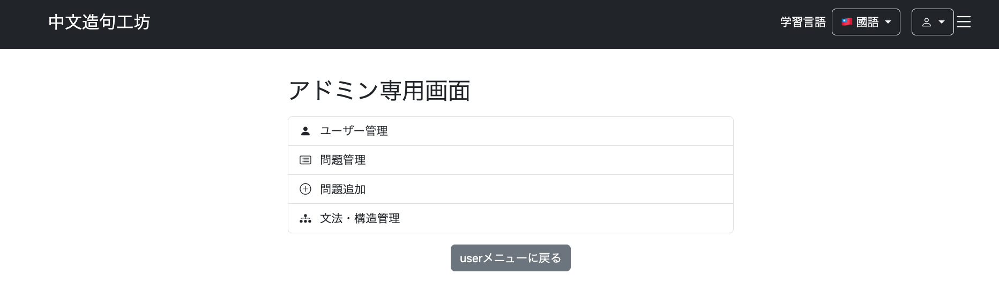

「文法・構造管理」を選択すると文法・構造一覧ページへ遷移し、現在登録されている文法・構造が一覧表示されることを確認した。

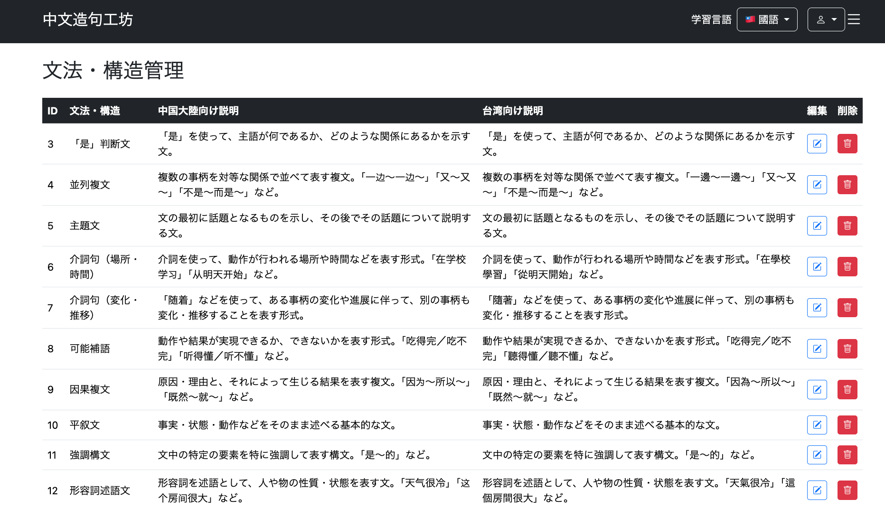

# 文法・構造を追加する

```text
git commit -m "feat: add admin structure creation"
```

Adminから新しい文法・構造を登録できる機能を実装する。

## StructureForm

```java
@Data
public class StructureForm {

    @NotBlank(message = "文法・構造名を入力してください。")
    private String name;

    @NotBlank(message = "中国大陸向け説明を入力してください。")
    private String descriptionZhCn;

    @NotBlank(message = "台湾向け説明を入力してください。")
    private String descriptionZhTw;

}
```

文法・構造名、中国大陸向け説明、台湾向け説明を入力値として受け取る。

すべて必須項目とし、`@NotBlank`で未入力および空白のみの入力を検証する。

## StructureRepository

同じ文法・構造名の重複登録を防ぐため、文法名の存在確認を行うメソッドを追加する。

```java
boolean existsByName(String name);
```

`Structure.name`にはDB側でも`unique = true`が設定されているが、登録前に重複を確認し、画面上に適切なエラーメッセージを表示するために使用する。

文法・構造の登録自体には`JpaRepository`が提供する`save()`を使用するため、登録専用のRepositoryメソッドは追加しない。

```java
structureRepository.save(structure);
```

## AdminStructureService

```java
// 文法追加
@Transactional
public void addStructure(StructureForm form) {

    // 文法名の重複確認
    if (structureRepository.existsByName(form.getName())) {

        throw new IllegalArgumentException(
                "同じ名前の文法・構造がすでに登録されています。"
        );

    }

    Structure structure = new Structure();

    structure.setName(form.getName());
    structure.setDescriptionZhCn(form.getDescriptionZhCn());
    structure.setDescriptionZhTw(form.getDescriptionZhTw());

    structureRepository.save(structure);

}
```

`addStructure`では、最初に`existsByName`で文法・構造名の重複を確認する。

重複していない場合は`StructureForm`の入力値から新しい`Structure`を作成し、`save()`で登録する。

## AdminStructureController

### 文法・構造追加画面

```java
@GetMapping("/admin/structure/add")
public String getStructureAdd(
        @ModelAttribute StructureForm structureForm) {

    return "/admin/structure/add";

}
```

`StructureForm`をModelへ用意し、文法・構造追加画面を表示する。

### 文法・構造追加

```java
@PostMapping("/admin/structure/add")
public String addStructure(
        @Validated @ModelAttribute StructureForm structureForm,
        BindingResult bindingResult,
        RedirectAttributes redirectAttributes) {

    // 入力エラー
    if (bindingResult.hasErrors()) {
        return "/admin/structure/add";
    }

    try {

        adminStructureService.addStructure(structureForm);

    } catch (IllegalArgumentException e) {

        bindingResult.rejectValue(
                "name",
                "structure.add.error",
                e.getMessage());

        return "/admin/structure/add";

    }

    redirectAttributes.addFlashAttribute(
            "successMessage",
            "文法・構造を追加しました。");

    return "redirect:/admin/structure/list";

}
```

`@Validated`で`StructureForm`の入力値を検証し、入力エラーがある場合は追加画面へ戻す。

入力値に問題がなければ`AdminStructureService.addStructure()`を実行する。文法・構造名が重複している場合は`name`フィールドのエラーとして表示する。

登録に成功した場合は成功メッセージをFlash Attributeへ設定し、文法・構造一覧へリダイレクトする。

処理の流れは以下となる。

```text
GET /admin/structure/add
        ↓
StructureFormを用意
        ↓
add.htmlを表示

POST /admin/structure/add
        ↓
@Validatedで入力チェック
        ↓
エラーあり → add.html
        ↓
AdminStructureService.addStructure()
        ↓
重複あり → add.html
        ↓
登録成功
        ↓
/admin/structure/listへリダイレクト
```

## /admin/structure/add.html

```html
<!DOCTYPE html>

<html xmlns:th="http://www.thymeleaf.org"
      xmlns:layout="http://www.ultraq.net.nz/thymeleaf/layout"
      layout:decorate="~{layout/layout}">

<head>

    <meta charset="UTF-8">

    <title>文法・構造登録</title>

</head>

<body>

<div layout:fragment="content">

    <div class="container mt-4">

        <h2 class="mb-4">

            <i class="bi bi-plus-circle"></i>

            文法・構造登録

        </h2>

        <div class="card">

            <div class="card-body">

                <form th:action="@{/admin/structure/add}"
                      th:object="${structureForm}"
                      method="post">

                    <!-- 文法・構造名 -->
                    <div class="mb-3">

                        <label class="form-label fw-bold">
                            文法・構造名
                        </label>

                        <input type="text"
                               th:field="*{name}"
                               class="form-control">

                        <div class="text-danger mt-1"
                             th:if="${#fields.hasErrors('name')}"
                             th:errors="*{name}">
                        </div>

                    </div>

                    <!-- 中国大陸向け説明 -->
                    <div class="mb-3">

                        <label class="form-label fw-bold">
                            中国大陸向け説明
                        </label>

                        <textarea th:field="*{descriptionZhCn}"
                                  class="form-control"
                                  rows="4">
                        </textarea>

                        <div class="text-danger mt-1"
                             th:if="${#fields.hasErrors('descriptionZhCn')}"
                             th:errors="*{descriptionZhCn}">
                        </div>

                    </div>

                    <!-- 台湾向け説明 -->
                    <div class="mb-3">

                        <label class="form-label fw-bold">
                            台湾向け説明
                        </label>

                        <textarea th:field="*{descriptionZhTw}"
                                  class="form-control"
                                  rows="4">
                        </textarea>

                        <div class="text-danger mt-1"
                             th:if="${#fields.hasErrors('descriptionZhTw')}"
                             th:errors="*{descriptionZhTw}">
                        </div>

                    </div>

                    <!-- ボタン -->
                    <div class="text-center mt-3 mb-3">

                        <button type="submit"
                                class="btn btn-primary">

                            <i class="bi bi-check-circle"></i>

                            登録

                        </button>

                        <a th:href="@{/admin/structure/list}"
                           class="btn btn-secondary ms-2">

                            文法・構造一覧に戻る

                        </a>

                    </div>

                </form>

            </div>

        </div>

    </div>

</div>

</body>

</html>
```

文法・構造名、中国大陸向け説明、台湾向け説明を入力するフォームを作成する。

各入力欄の下には`StructureForm`のバリデーションエラーを表示し、登録ボタンと文法・構造一覧へ戻るボタンを配置する。

## /admin/menu.html

Adminメニューに文法・構造追加ページへのリンクを追加する。

```html
<!-- 文法・構造追加 -->
<a th:href="@{/admin/structure/add}"
   class="list-group-item list-group-item-action">

    <i class="bi bi-plus-circle me-2"></i>

    文法・構造追加

</a>
```

## /admin/structure/list.html

文法・構造一覧から直接追加画面へ遷移できるよう、画面上部にも追加ボタンを配置する。

変更前は以下のタイトルのみだった。

```html
<h2 class="mb-4">
    文法・構造管理
</h2>
```

これを以下のように変更する。

```html
<!-- タイトル・追加ボタン -->
<div class="d-flex justify-content-between align-items-center mb-4">

    <h2 class="mb-0">

        <i class="bi bi-list-ul"></i>

        文法・構造一覧

    </h2>

    <a th:href="@{/admin/structure/add}"
       class="btn btn-success">

        <i class="bi bi-plus-circle"></i>

        文法・構造追加

    </a>

</div>
```

これにより、Adminメニューと文法・構造一覧のどちらからでも追加画面へ遷移できる。

## 実行

Adminメニューに「文法・構造追加」へのリンクが表示されることを確認した。

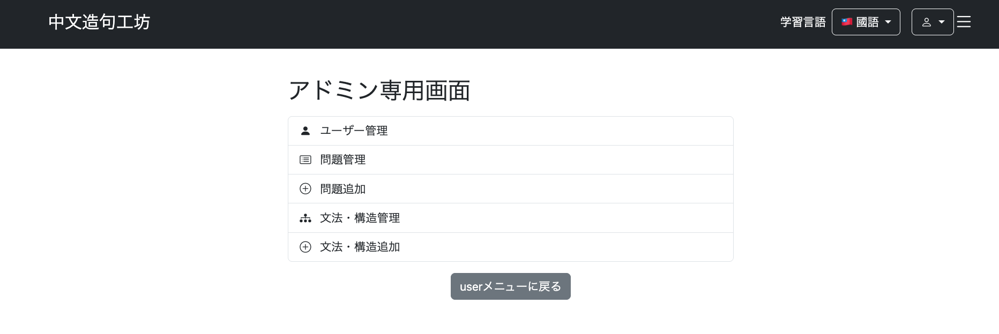

文法・構造一覧の画面上部にも「文法・構造追加」ボタンが表示されることを確認した。

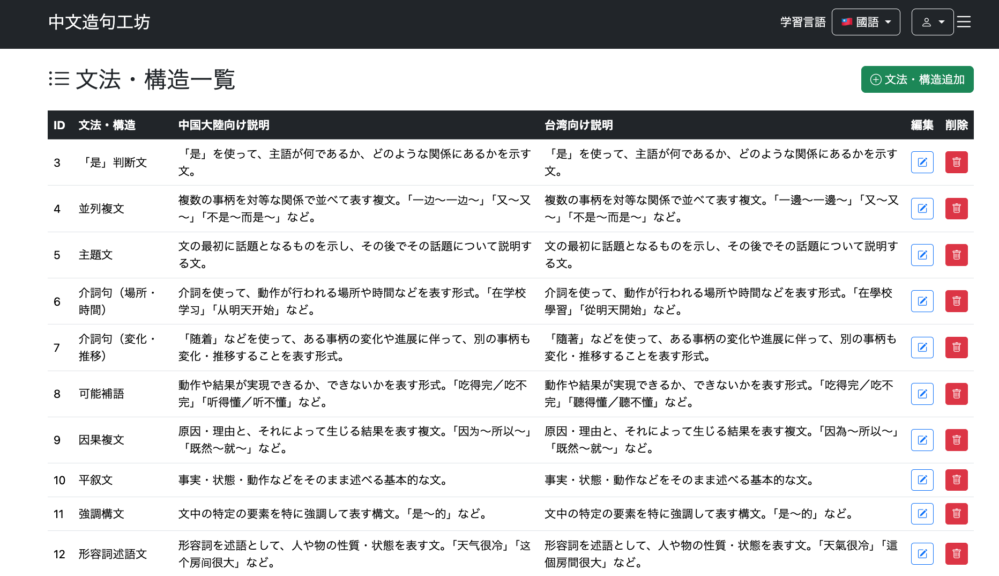

それぞれのボタンから文法・構造登録画面へ遷移できることを確認した。

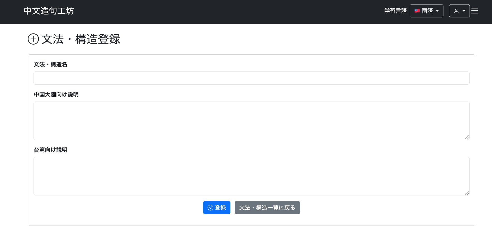

文法・構造名と中国大陸・台湾向けの説明を入力して登録する。

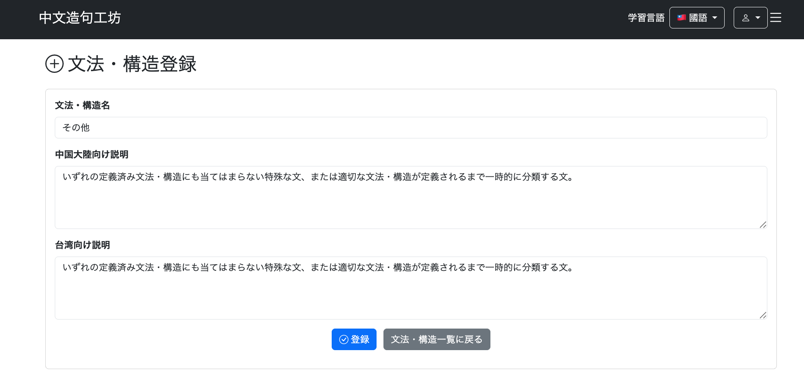

登録に成功すると文法・構造一覧へ戻り、成功メッセージが表示されることを確認した。

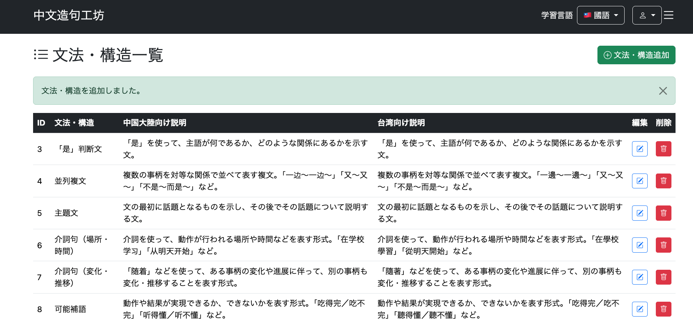

また、追加した文法・構造が一覧に表示されることを確認した。

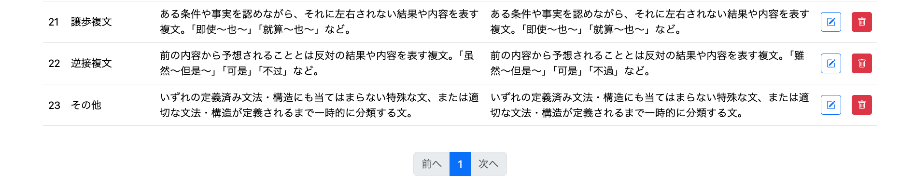

必須項目を空欄にして登録した場合は、各入力欄にバリデーションエラーが表示されることを確認した。

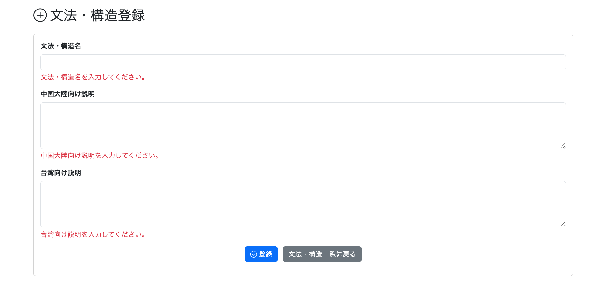

文法・構造は登録数が多くても100件未満を想定しているため、並び順を切り替える機能や検索機能は追加せず、`structureId`の昇順で固定する。

### 実装を見送った機能

中国大陸向け・台湾向けの説明をAIで生成する機能も検討したが、文法・構造の説明を適切に生成するためのプロンプトや処理が複雑になるため、今回は実装しない。

文法・構造管理はアプリケーションの主要機能ではないため、説明文はAdminが手動で入力する。

# 文法・構造を編集する

```text
git commit -m "feat: add admin structure editing"
```

登録済みの文法・構造について、文法名、中国大陸向け説明、台湾向け説明を編集できるようにする。

## StructureRepository

編集対象の`Structure`の取得には、`JpaRepository`が標準で提供する`findById()`を使用する。

```java
structureRepository.findById(structureId);
```

そのため、取得専用のRepositoryメソッドは追加しない。

一方、文法名を変更する場合は、変更後の名前が他の文法・構造ですでに使用されていないか確認する必要がある。

そのため、以下のメソッドを追加する。

```java
boolean existsByNameAndStructureIdNot(
        String name,
        Long structureId);
```

`existsByNameAndStructureIdNot()`では、指定した`name`を持ち、かつ`structureId`が編集対象と異なる`Structure`が存在するかを確認する。

`Not`はSpring Data JPAの派生クエリで「一致しない」条件を表すため、SQLでは以下に相当する。

```sql
SELECT EXISTS (
    SELECT 1
    FROM structure
    WHERE name = :name
      AND structure_id <> :structureId
);
```

編集対象自身は現在の文法名を持っているため、追加時に使用した`existsByName()`では、文法名を変更しなかった場合にも重複と判定される。

そのため、編集時は編集対象自身を除外して重複を確認する。

## AdminStructureService

### 文法・構造の取得

```java
public Structure getStructure(Long structureId) {

    return structureRepository.findById(structureId)
            .orElseThrow(() ->
                    new IllegalArgumentException(
                            "文法・構造が存在しません。"
                    )
            );

}
```

`getStructure`では`structureId`から編集対象を取得する。

`findById()`の戻り値は`Optional<Structure>`であるため、対象が存在しない場合は`orElseThrow()`で例外を発生させる。

### 文法・構造の編集

```java
@Transactional
public void updateStructure(
        Long structureId,
        StructureForm structureForm) {

    Structure structure = getStructure(structureId);

    // 文法名の重複確認
    if (structureRepository.existsByNameAndStructureIdNot(
            structureForm.getName(),
            structureId)) {

        throw new IllegalArgumentException(
                "同じ名前の文法・構造がすでに登録されています。"
        );

    }

    structure.setName(structureForm.getName());

    structure.setDescriptionZhCn(
            structureForm.getDescriptionZhCn());

    structure.setDescriptionZhTw(
            structureForm.getDescriptionZhTw());

}
```

最初に`getStructure()`で編集対象を取得し、`existsByNameAndStructureIdNot()`で編集対象自身を除いた文法名の重複を確認する。

重複していなければ、文法名、中国大陸向け説明、台湾向け説明を新しい値へ変更する。

`@Transactional`内で取得したEntityはJPAの管理対象となるため、値を変更するとトランザクション終了時に変更が検出され、UPDATEが実行される。そのため、ここでは`save()`を明示的に呼び出さない。

## AdminStructureController

### 文法・構造編集画面

```java
@GetMapping("/admin/structure/edit")
public String getStructureEdit(
        @RequestParam Long structureId,
        @ModelAttribute StructureForm structureForm) {

    Structure structure =
            adminStructureService.getStructure(structureId);

    structureForm.setName(structure.getName());

    structureForm.setDescriptionZhCn(
            structure.getDescriptionZhCn());

    structureForm.setDescriptionZhTw(
            structure.getDescriptionZhTw());

    return "/admin/structure/edit";

}
```

一覧画面から渡された`structureId`を使用して編集対象を取得し、現在の文法名、中国大陸向け説明、台湾向け説明を`StructureForm`へ設定する。

これにより、編集画面を開いた時点で現在登録されている内容がフォームに表示される。

### 文法・構造編集

```java
@PostMapping("/admin/structure/edit")
public String updateStructure(
        @RequestParam Long structureId,
        @Validated @ModelAttribute StructureForm structureForm,
        BindingResult bindingResult,
        RedirectAttributes redirectAttributes) {

    // 入力エラー
    if (bindingResult.hasErrors()) {
        return "/admin/structure/edit";
    }

    try {

        adminStructureService.updateStructure(
                structureId,
                structureForm);

    } catch (IllegalArgumentException e) {

        bindingResult.rejectValue(
                "name",
                "structure.edit.error",
                e.getMessage());

        return "/admin/structure/edit";

    }

    redirectAttributes.addFlashAttribute(
            "successMessage",
            "文法・構造を編集しました。");

    return "redirect:/admin/structure/list";

}
```

`@Validated`で`StructureForm`を検証し、入力エラーがある場合は編集画面へ戻す。

入力値に問題がなければ`updateStructure()`で更新する。文法名が他の`Structure`と重複している場合は、`name`フィールドのエラーとして編集画面に表示する。

編集に成功した場合は成功メッセージをFlash Attributeへ設定し、文法・構造一覧へリダイレクトする。

## /admin/structure/edit.html

追加画面と同じ入力項目を使用し、登録済みの値を編集できる画面を作成する。

```html
<!DOCTYPE html>

<html xmlns:th="http://www.thymeleaf.org"
      xmlns:layout="http://www.ultraq.net.nz/thymeleaf/layout"
      layout:decorate="~{layout/layout}">

<head>

    <meta charset="UTF-8">

    <title>文法・構造編集</title>

</head>

<body>

<div layout:fragment="content">

    <div class="container mt-4">

        <h2 class="mb-4">

            <i class="bi bi-pencil-square"></i>

            文法・構造編集

        </h2>

        <div class="card">

            <div class="card-body">

                <form th:action="@{/admin/structure/edit(
                          structureId=${param.structureId}
                      )}"
                      th:object="${structureForm}"
                      method="post">

                    <!-- 文法・構造名 -->
                    <div class="mb-3">

                        <label class="form-label fw-bold">
                            文法・構造名
                        </label>

                        <input type="text"
                               th:field="*{name}"
                               class="form-control">

                        <div class="text-danger mt-1"
                             th:if="${#fields.hasErrors('name')}"
                             th:errors="*{name}">
                        </div>

                    </div>

                    <!-- 中国大陸向け説明 -->
                    <div class="mb-3">

                        <label class="form-label fw-bold">
                            中国大陸向け説明
                        </label>

                        <textarea th:field="*{descriptionZhCn}"
                                  class="form-control"
                                  rows="4">
                        </textarea>

                        <div class="text-danger mt-1"
                             th:if="${#fields.hasErrors('descriptionZhCn')}"
                             th:errors="*{descriptionZhCn}">
                        </div>

                    </div>

                    <!-- 台湾向け説明 -->
                    <div class="mb-3">

                        <label class="form-label fw-bold">
                            台湾向け説明
                        </label>

                        <textarea th:field="*{descriptionZhTw}"
                                  class="form-control"
                                  rows="4">
                        </textarea>

                        <div class="text-danger mt-1"
                             th:if="${#fields.hasErrors('descriptionZhTw')}"
                             th:errors="*{descriptionZhTw}">
                        </div>

                    </div>

                    <!-- ボタン -->
                    <div class="text-center mt-3 mb-3">

                        <button type="submit"
                                class="btn btn-primary">

                            <i class="bi bi-check-circle"></i>

                            更新

                        </button>

                        <a th:href="@{/admin/structure/list}"
                           class="btn btn-secondary ms-2">

                            文法・構造一覧に戻る

                        </a>

                    </div>

                </form>

            </div>

        </div>

    </div>

</div>

</body>

</html>
```

追加画面との主な違いは、タイトル、POST先、実行ボタンの表記である。

POST先には`structureId`を含め、どの文法・構造を更新するのかをControllerへ渡す。

## 実行

文法・構造一覧から編集対象の編集ボタンを選択する。

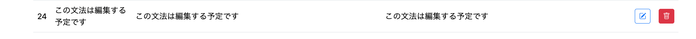

選択した文法・構造の現在の内容が入力された状態で、編集画面が表示されることを確認した。

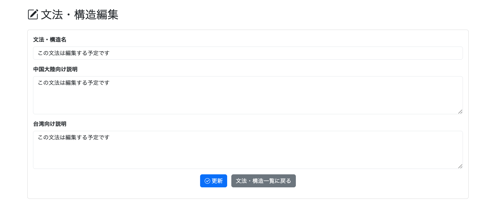

文法・構造の内容を変更して更新する。

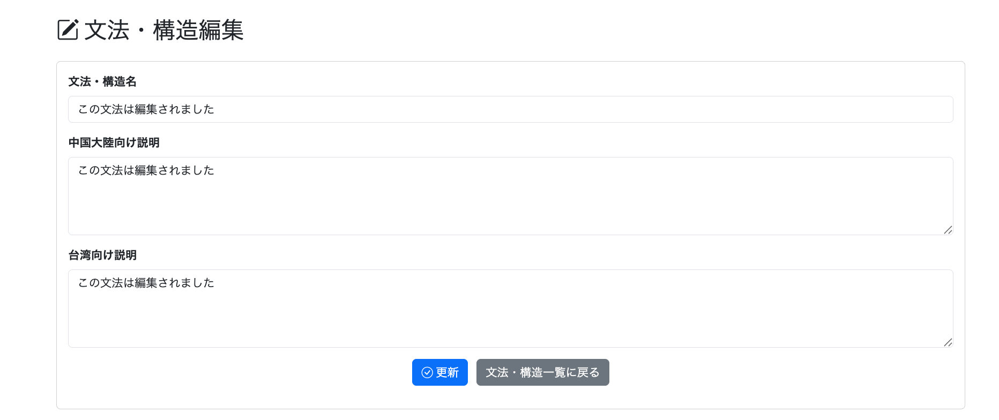

更新後は文法・構造一覧へ戻り、編集成功のメッセージが表示されることを確認した。

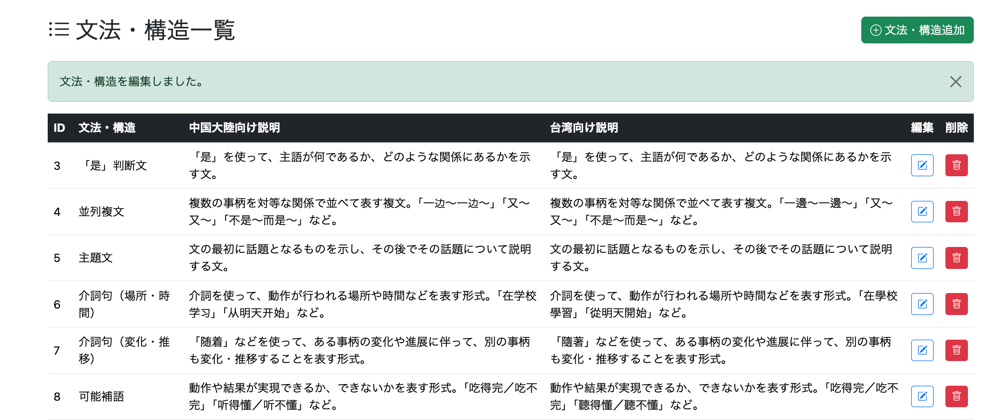

また、一覧上でも編集した内容に更新されていることを確認した。

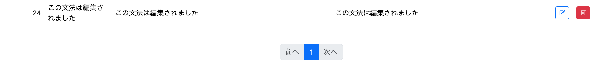

必須項目を正しく入力しなかった場合は、バリデーションエラーが表示されることを確認した。

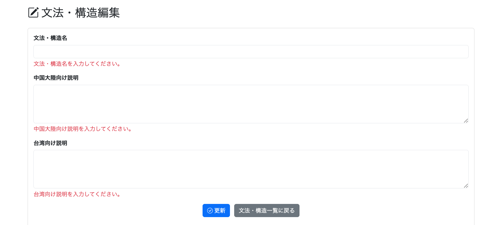

# 文法・構造を削除する

```text
git commit -m "feat: add admin structure deletion"
```

`Question.structure`は`NOT NULL`であるため、問題から参照されている`Structure`をそのまま削除することはできない。

そこで文法・構造を削除する場合は、削除対象を使用しているすべての問題の`Structure`を、StructureId `23`の「その他」へ変更してから削除する。

処理の流れは以下となる。

```text
削除対象のStructureを取得
        ↓
「その他」（StructureId 23）を取得
        ↓
削除対象を使用しているQuestionを「その他」へ変更
        ↓
削除対象のStructureを削除
```

## StructureRepository

削除処理では、削除対象と移行先となる「その他」を取得し、最後に削除対象を削除する必要がある。

これらはすべて`JpaRepository`が標準で提供するメソッドを使用できる。

```java
// 削除対象
structureRepository.findById(structureId);

// 移行先「その他」
structureRepository.findById(23L);

// 削除
structureRepository.delete(targetStructure);
```

そのため、`StructureRepository`には削除用のRepositoryメソッドを追加しない。

## QuestionRepository

削除対象の文法・構造を使用している問題を「その他」へ一括変更するメソッドを追加する。

```java
@Modifying
@Query("""
        UPDATE Question q
        SET q.structure = :replacementStructure
        WHERE q.structure = :targetStructure
        """)
void replaceStructure(
        @Param("targetStructure") Structure targetStructure,
        @Param("replacementStructure") Structure replacementStructure);
```

`targetStructure`を使用しているすべての`Question`について、`structure`を`replacementStructure`へ一括更新する。

これにより、削除対象の`Structure`を参照する`Question`が残らない状態にしてから削除できる。

## AdminStructureService

```java
// 文法削除
@Transactional
public void deleteStructure(Long structureId) {

    // 「その他」自体は削除不可
    if (structureId.equals(23L)) {

        throw new IllegalArgumentException(
                "「その他」は削除できません。"
        );

    }

    // 削除対象の文法を取得
    Structure targetStructure =
            structureRepository.findById(structureId)
                    .orElseThrow(() ->
                            new IllegalArgumentException(
                                    "文法・構造が存在しません。"
                            )
                    );

    // 移行先の「その他」を取得
    Structure replacementStructure =
            structureRepository.findById(23L)
                    .orElseThrow(() ->
                            new IllegalStateException(
                                    "「その他」の文法・構造が存在しません。"
                            )
                    );

    // 削除対象の文法を持つ問題を「その他」に変更
    questionRepository.replaceStructure(
            targetStructure,
            replacementStructure);

    // 文法を削除
    structureRepository.delete(targetStructure);

}
```

`deleteStructure`では、最初にStructureId `23`の「その他」自体が削除対象になっていないことを確認する。

次に、削除対象の`Structure`と移行先となる「その他」を取得する。

その後、`replaceStructure()`で削除対象を使用しているすべての問題を「その他」へ変更し、削除対象への参照がなくなってから`Structure`を削除する。

`@Transactional`を付けることで、問題の文法・構造変更と`Structure`の削除を1つのトランザクションとして処理する。

## AdminStructureController

```java
// 文法削除
@PostMapping("/admin/structure/delete")
public String deleteStructure(
        @RequestParam Long structureId,
        RedirectAttributes redirectAttributes) {

    try {

        adminStructureService.deleteStructure(structureId);

    } catch (IllegalArgumentException | IllegalStateException e) {

        redirectAttributes.addFlashAttribute(
                "errorMessage",
                e.getMessage());

        return "redirect:/admin/structure/list";

    }

    redirectAttributes.addFlashAttribute(
            "successMessage",
            "文法・構造を削除しました。");

    return "redirect:/admin/structure/list";

}
```

一覧画面から削除対象の`structureId`を受け取り、`AdminStructureService.deleteStructure()`で削除処理を実行する。

削除できなかった場合はエラーメッセージを、削除に成功した場合は成功メッセージをFlash Attributeへ設定し、文法・構造一覧へリダイレクトする。

## /admin/structure/list.html

削除に失敗した場合のエラーメッセージ表示を追加する。

```html
<!-- エラーメッセージ -->
<div th:if="${errorMessage}"
     class="alert alert-danger alert-dismissible fade show"
     role="alert">

    <span th:text="${errorMessage}"></span>

    <button type="button"
            class="btn-close"
            data-bs-dismiss="alert"
            aria-label="Close">
    </button>

</div>
```

これにより、「その他」の削除を試みた場合や、削除対象・移行先が存在しない場合にServiceから渡されたエラーメッセージを表示できる。

## 実行

削除時の動作を確認するため、削除しても問題のないテスト用の文法・構造を作成し、その文法・構造を使用する問題を登録する。

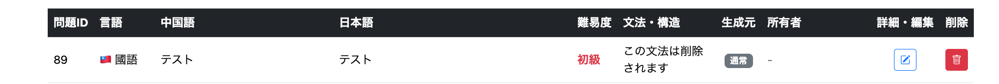

文法・構造一覧から、作成したテスト用の文法・構造を削除する。

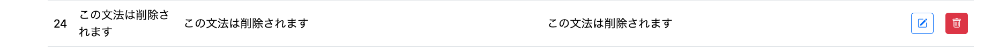

削除に成功し、成功メッセージが表示されることを確認した。

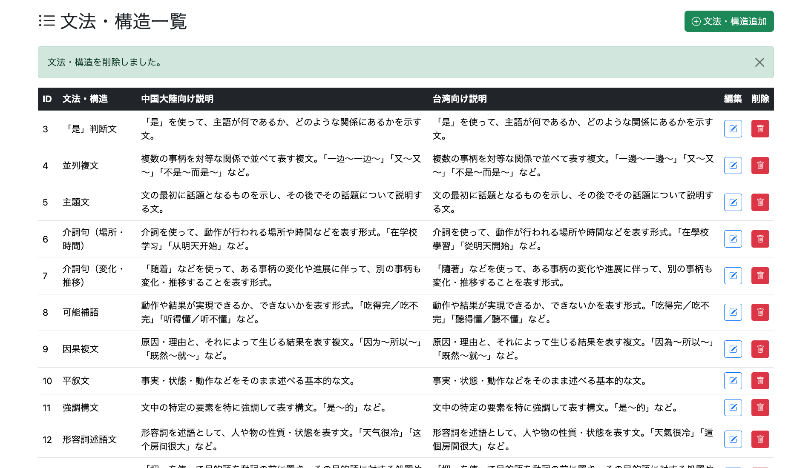

DBを確認し、対象の文法・構造が`structure`テーブルから削除されていることを確認した。

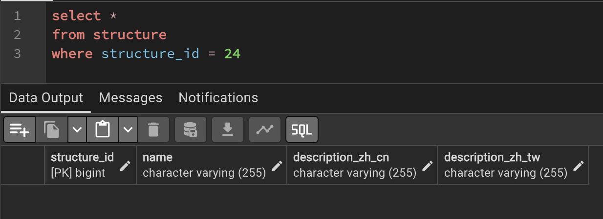

さらに問題一覧を確認し、削除した文法・構造を使用していた問題の文法・構造が「その他」へ変更されていることを確認した。

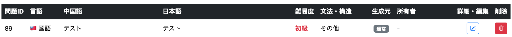

# Adminメニューの全機能実装を終えて

以上で、Adminメニューから利用する以下の管理機能の実装が完了した。

- Adminメニュー
- 問題一覧・検索・削除
- 問題追加
- 問題編集
- ユーザー管理
- 文法・構造管理

これらの機能により、デプロイ後もAdmin画面から問題、ユーザー、文法・構造の主要な管理操作を行えるようになった。