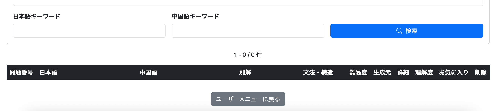

# 024 内部処理のリファクタリング

## 1. 概要

主要機能の実装完了後、アプリケーション内部に残っていた処理の重複、責務の不明確な箇所、冗長な処理、命名の不統一などを整理した。

今回のリファクタリングでは、新しい機能の追加ではなく、現在の動作を維持したままController・Serviceを中心に既存コードを見直した。

単純にコード量を減らすことは目的とせず、処理の意味が明確になる場合のみ共通化やprivateメソッドへの切り出しを行い、短い処理については重複していても明示的な方が読みやすい場合はそのまま残した。

## 2. エラー999への対応

Spring Bootを起動したまま長時間操作せず、セッションが切れた状態から再度ログインを行った際、まれに以下のJSON形式のエラー画面が表示されることがあった。

```json
{
    "status": 999,
    "error": "None",
    "message": "No message available"
}
```

さらに、この状態でブラウザを再読み込みするとWhitelabel Error Pageへ遷移し、

```text
There was an unexpected error (type=None, status=999).
No message available
```

と表示された。

通常のログインでは発生せず、長時間操作しなかった後の再ログイン時に不定期で発生していたため、再現性が低い問題だった。

### 2.1 `/error`へのアクセス許可

Spring Securityを使用したログイン処理で同様のstatus 999が発生した事例を確認したところ、エラー処理で使用される`/error`がSpring Securityによって保護されている場合に、正常なエラー処理が行えなくなる可能性が考えられた。

現在のSecurityConfigでは、

```java
.anyRequest().authenticated()
```

を設定している一方、`/login`などとは異なり`/error`を`permitAll()`の対象としていなかった。

そのため、ログイン処理中に何らかの理由で`/error`への遷移が発生した場合、

```text
セッション切れ
    ↓
再ログイン
    ↓
何らかのエラーが発生
    ↓
Spring Bootが /error でエラー処理を行おうとする
    ↓
/error が permitAll() ではない
    ↓
.anyRequest().authenticated() の対象になる
    ↓
エラー処理自体がSpring Securityの認証・認可対象になる
    ↓
正常にエラー処理できない
    ↓
status 999
```

となっている可能性が考えられた。

そこでSecurityConfigへ、

```java
.requestMatchers("/error").permitAll()
```

を追加し、`/error`については認証状態にかかわらずアクセスできるようにした。

### 2.2 最初に発生したエラーの原因は未特定

ただし、`/error`を`permitAll()`にすることでstatus 999を防げたとしても、これだけでは根本原因を特定したことにはならない。

実際に確認した現象は、

```text
/loginでログインフォームを入力
（この時点では未ログイン）
    ↓
フォームを送信
    ↓
status 999
    ↓
ブラウザを再読み込み
    ↓
Whitelabel Error Page
    ↓
ブラウザの「戻る」で /login へ戻る
    ↓
再度ログインフォームを送信
    ↓
正常にログイン
```

という流れだった。

status 999が表示された時点で認証自体が成功していたのか、それとも認証成立前に別のエラーが発生していたのかまでは確認できていない。

また、通常のログイン失敗についてはSecurityConfigで`AuthenticationFailureHandler`を設定している。

```java
.failureHandler(new AuthenticationFailureHandler() {

    @Override
    public void onAuthenticationFailure(...)
            throws IOException {

        ...

        response.sendRedirect("/login");
    }
})
```

そのため、パスワード間違いなど通常の`AuthenticationException`であれば、

```text
ログイン失敗
    ↓
AuthenticationFailureHandler
    ↓
/loginへredirect
```

となるため、本来`/error`へ遷移する必要はない。

このことから、今回のstatus 999については、

```text
ログインフォームを送信
    ↓
認証処理周辺のどこかで別のエラーが発生
    ↓
/error へのエラー処理が開始される
    ↓
/error 自体がSpring Securityの保護対象
    ↓
エラー処理を正常に完了できない
    ↓
status 999
```

という可能性までは考えられるものの、最初に`/error`への遷移を発生させた原因については特定できていない。

### 2.3 Spring SecurityのDEBUGログを有効化

status 999は不定期に発生し、意図的に再現することが難しかった。

そのため、再発した場合にSpring Security内部でどのような処理が行われたのか確認できるよう、`application.yml`へ以下を追加した。

```yaml
logging:
  level:
    org.springframework.security: DEBUG
```

これにより、ログイン処理周辺について、

```text
ログインリクエストをSecurity Filterが受け取る
    ↓
認証処理
    ↓
認証成功 / 認証失敗
    ↓
SecurityContextの処理
    ↓
URLへのアクセス
    ↓
Security Filterによる処理
```

など、Spring Security内部の処理を通常より詳細に確認できる状態にした。

### 2.4 今後の確認

今回の対応では、

```java
.requestMatchers("/error").permitAll()
```

を追加するとともに、再発時の原因調査用としてSpring SecurityのDEBUGログを有効化した。

ただし、status 999自体に再現性がないため、修正時点では問題が完全に解消したとは断定していない。

今後は通常どおりアプリケーションを使用し、

```text
status 999が再発しない
    ↓
/errorへのアクセス許可によって問題が解消した可能性が高い

status 999が再発する
    ↓
Spring SecurityのDEBUGログを確認
    ↓
最初にどの処理でエラーが発生したかを調査
```

という方針で確認を続ける。

そのため、この対応ではstatus 999への対策と再発時の調査環境までを実装し、根本原因については再発時に追加調査することとした。


## 3. ControllerとServiceの責務を整理

### 3.1 AdminQuestion

`AdminQuestionController`では、編集画面表示時に`OriginalQuestionDTO`から`QuestionForm`を生成する処理をController内で行っていた。

DTOからFormへの変換はHTTPリクエストや画面遷移の制御ではないため、`AdminQuestionService`へ移動した。

```java
public QuestionForm createQuestionForm(
        OriginalQuestionDTO originalQuestion) {

    QuestionForm form = new QuestionForm();

    form.setLanguageVariant(
            originalQuestion.getLanguageVariant());
    form.setJapaneseText(
            originalQuestion.getJapaneseText());
    form.setChineseText(
            originalQuestion.getChineseText());
    form.setAlternativeAnswer(
            originalQuestion.getAlternativeAnswer());
    form.setDifficulty(
            originalQuestion.getDifficulty());
    form.setStructureId(
            originalQuestion.getStructureId());
    form.setAllowAiVariation(
            originalQuestion.isAllowAiVariation());
    form.setTemplate(
            originalQuestion.getTemplate());

    return form;
}
```

Controller側では、

```java
QuestionForm form =
        adminQuestionService.createQuestionForm(
                originalQuestion);
```

として、変換処理をServiceへ委譲する構成に変更した。

### 3.2 AdminStructure

`AdminStructureController`でも、取得した`Structure`の値を`StructureForm`へコピーしていたため、同様にForm生成処理を`AdminStructureService`へ移動した。

```java
public StructureForm createStructureForm(Long structureId) {

    Structure structure = getStructure(structureId);

    StructureForm form = new StructureForm();

    form.setName(structure.getName());
    form.setDescriptionZhCn(
            structure.getDescriptionZhCn());
    form.setDescriptionZhTw(
            structure.getDescriptionZhTw());

    return form;
}
```

Controllerは`structureId`を受け取り、Serviceから完成した`StructureForm`を取得してModelへ設定する構成とした。

### 3.3 AdminUser

`AdminUserController`で行っていた、

```java
if (searchDto.getAccountStatus() == null) {
    searchDto.setAccountStatus(AccountStatus.ALL);
}
```

を`AdminUserService.getUsers()`へ移動した。

検索条件が未指定の場合に`ALL`として扱うルールをService側へ集約し、Controllerは検索条件の受け取りとService呼び出しを担当する構成とした。

### 3.4 AI生成モード

`AiPracticeController`が`QuestionRepository`を直接利用して、AI生成問題が保存済みか確認していた処理を`AiPracticeService`へ移動した。

```java
public Long getSavedQuestionId(
        Long userId,
        String chineseText) {

    Optional<Question> savedQuestion =
            questionRepository.findByOwnerIdAndChineseText(
                    userId,
                    chineseText);

    if (savedQuestion.isPresent()) {
        return savedQuestion.get().getQuestionId();
    }

    return null;
}
```

また、`AiPracticeService`が`AiGenerationHistoryRepository`を直接利用して履歴の取得・削除を行う一方、保存だけを`AiGenerationHistoryService`へ委譲していた構成も整理した。

AI生成履歴に関するDB操作を`AiGenerationHistoryService`へ集約し、

```text
AiPracticeService
        ↓
AiGenerationHistoryService
        ↓
AiGenerationHistoryRepository
```

という依存関係に統一した。

履歴の最大10件保持についても`AiGenerationHistoryService.updateGenerationHistory()`へまとめ、古い履歴の削除から新規履歴の保存までを同Serviceが管理するようにした。

### 3.5 Practice

`PracticeController.getPracticeStart()`では、

```text
ログインユーザー
    → ユーザー用問題取得

非ログインユーザー
    → 非ログイン用問題取得

sourceCondition未指定
    → ALL
```

という問題取得ルールをController側で判断していた。

これを`PracticeService.getPracticeQuestions()`へ集約した。

Controller側は、

```java
List<Question> questions =
        practiceService.getPracticeQuestions(
                userId,
                languageVariant,
                difficulty,
                sourceCondition,
                start,
                random);
```

のみで問題セットを取得できる構成とした。

### 3.6 Signup

`SignupController`では、`SignupForm`から`Users` Entityを生成してServiceへ渡していた。

これを変更し、Controllerは`SignupForm`をそのままServiceへ渡すようにした。

```java
signupService.signup(form);
```

`Users`の生成、入力値の設定、一般ユーザー権限の設定、パスワードのハッシュ化、Repositoryへの保存は`SignupService`で行う構成とした。

## 4. Service内部処理の整理

### 4.1 AdminQuestionService

`addQuestion()`と`updateOneQuestion()`には、

* 発音生成
* FormからQuestionへの値設定
* Structure取得
* QuestionへのStructure設定

という共通処理が存在していた。

これを、

```java
private void applyQuestionForm(
        Question question,
        QuestionForm form)
```

としてまとめた。

新規登録では新しい`Question`を生成して`applyQuestionForm()`を呼び、更新では既存`Question`を取得して同じメソッドを呼ぶ構成とした。

検索条件の初期値補完やEntity・DTO・Form間の単純な変換については、処理を細かく分割するとかえって追いにくくなるため、そのまま残した。

### 4.2 AdminStructureService

`addStructure()`と`updateStructure()`で重複していたFormからEntityへの値設定を、

```java
private void applyStructureForm(
        Structure structure,
        StructureForm form)
```

へまとめた。

また、削除時の移行先として使用しているStructure ID `23L`を、

```java
private static final Long OTHER_STRUCTURE_ID = 23L;
```

として定数化した。

通常のStructure取得については既存の`getStructure()`を再利用した。

一方、「その他」のStructureが存在しない場合は通常のStructure不存在とは意味が異なるため、専用の`IllegalStateException`を維持した。

### 4.3 AdminUserService

`lockUser()`と`unlockUser()`にあった現在状態の確認処理を削除した。

凍結時は、

```java
user.setAccountLocked(true);
```

凍結解除時は、

```java
user.setAccountLocked(false);
```

を直接設定する構成とした。

### 4.4 AiGenerationHistoryService

AI生成履歴の最大保持件数として直接記述していた`10`を、

```java
private static final int MAX_HISTORY_SIZE = 10;
```

として定数化した。

また、外部から直接使用しなくなった`saveGenerationHistory()`をprivateメソッドへ変更し、外部向けの履歴更新処理を`updateGenerationHistory()`へ統一した。

### 4.5 AiPracticeService

特に処理が長くなっていた`generateQuestions()`を中心に整理した。

生成元QuestionからAI送信用DTOを生成する処理を、

```java
private List<AiGenerationSourceDto> createGenerationSources(...)
```

へ切り出した。

生成元DTOをJSONへ変換する処理も、

```java
private String convertGenerationSourcesToJson(...)
```

へ切り出した。

Gemini API用のStructured Outputs Schema生成についても、API呼び出し本体から分離した。

また、AIサービスの切り替えに使用していた、

```java
boolean useChatGPT = false;
```

を廃止し、

```java
public enum AiProvider {
    CHAT_GPT,
    GEMINI
}
```

を追加した。

使用するAIは、

```java
private static final AiProvider AI_PROVIDER =
        AiProvider.GEMINI;
```

として明示し、API呼び出しは`switch`で選択する構成へ変更した。

開発中の処理時間確認に使用している`System.out.println()`については、この章では変更せず、後のAOP・ログ対応で整理することとした。

### 4.6 AiPronunciationService

`generatePronunciationWithGemini()`内に直接記述していたGemini用レスポンスSchema生成処理をprivateメソッドへ切り出した。

API呼び出し処理とレスポンス形式の定義を分離し、Gemini API呼び出し部分を短くした。

### 4.7 EvaluationService

学習履歴が存在する場合のUPDATEと、存在しない場合のINSERTで重複していた処理を整理した。

既存履歴の有無によって必要なEntityを取得または生成した後、共通の値設定と保存処理を行う構成へ変更した。

### 4.8 FavoriteService

お気に入り登録済みかどうかを確認するためだけに`Optional<Favorite>`を取得していた処理を見直した。

Entityそのものが必要ない存在確認についてはRepositoryの`existsById()`を利用する構成へ変更した。

### 4.9 PracticeService

責務整理によって通常学習の問題取得処理を`getPracticeQuestions()`へ統合したため、不要になった`getAvailablePracticeQuestions()`を削除した。

同じ目的の問題取得メソッドが複数存在する状態を解消した。

### 4.10 ReviewService / StructureService

複数のServiceから利用されていたStructure一覧取得処理を確認した。

`ReviewService.findStructures()`を他機能から利用する構成では責務が不自然になるため、Structureマスタの取得を担当する`StructureService`へ共通化した。

これにより、Structure一覧が必要な機能は`ReviewService`を経由せず、`StructureService`を直接利用する構成とした。

### 4.11 SignupService

一度`Users`へ平文パスワードを設定し、その直後に取り出してハッシュ化する処理を整理した。

Formから取得したパスワードを直接`PasswordEncoder`へ渡し、ハッシュ化した値のみをEntityへ設定する構成とした。

### 4.12 UserAccountService

複数メソッドで重複していた、

```text
loginIdからUsersを取得
    ↓
存在しなければ例外
```

という処理をprivateメソッドへまとめた。

ユーザー情報変更処理では、この共通メソッドを利用して対象ユーザーを取得する構成へ統一した。

### 4.13 UserDetailsServiceImpl

`UserDetails`を一時変数へ格納してからそのままreturnしていた処理を整理し、生成した`UserDetails`を直接returnするようにした。

### 4.14 UserQuestionService

問題削除メソッドの名前を、実際の処理内容が分かる名前へ整理した。

ユーザー自身が所有する問題だけを削除するという処理内容がメソッド名から判断できるようにした。

## 5. Controller内部処理の整理

### 5.1 AdminQuestionController

Structure一覧取得を`StructureService`へ移したことで不要になったService依存を削除した。

また、`Page<AdminQuestionListDto>`を保持する変数について、

```java
Page<AdminQuestionListDto> allFilteredQuestionList
```

から、

```java
Page<AdminQuestionListDto> questionPage
```

へ変更した。

ページングされた結果であることが変数名から分かるようにした。

さらに、検索結果が0件の場合、

```text
start = 1
end   = 0
total = 0
```

となり、画面上で「1〜0件 / 全0件」と表示される問題があった。



そこで、初期値を0とし、検索結果が存在する場合のみ開始位置と終了位置を計算するように変更した。

```java
long start = 0;
long end = 0;

if (questionPage.hasContent()) {
    start =
            (long) questionPage.getNumber()
            * questionPage.getSize() + 1;

    end =
            start + questionPage.getNumberOfElements() - 1;
}
```

そのほか、未使用の引数・importを削除した。

### 5.2 AdminStructureController

POSTメソッドの名前をController全体の命名規則に合わせた。

```text
addStructure()
    → postStructureAdd()

updateStructure()
    → postStructureEdit()

deleteStructure()
    → postStructureDelete()
```

また、

```java
Page<Structure> structureList
```

を、

```java
Page<Structure> structurePage
```

へ変更した。

### 5.3 AdminUserController

`Page<Users>`を保持していた変数を`userList`から`userPage`へ変更した。

POSTメソッドについても、

```text
lockUser()
    → postUserLock()

unlockUser()
    → postUserUnlock()

deleteUser()
    → postUserDelete()
```

として命名規則を統一した。

また、`Locale local`を`Locale locale`へ変更した。

### 5.4 AiPracticeController

既に存在していた、

```java
private Users getLoginUser(UserDetails loginUser)
```

を利用せず直接`UserAccountService`を呼んでいた箇所を整理し、ユーザー取得方法を統一した。

また、複数箇所で繰り返していたセッションからの学習対象言語取得と`MAINLAND`へのデフォルト設定を、

```java
private LanguageVariant getLanguageVariant(
        HttpSession session)
```

へまとめた。

不要な変数の先行宣言や、使用していない`Model`引数も削除した。

一方、セッションから問題一覧を取得する処理など、短くその場で意味を確認できる処理については無理にprivateメソッド化しなかった。

### 5.5 LanguageVariantController

メソッド名を、

```text
changeLanguageVariant()
    → getLanguageVariantChange()
```

へ変更し、GETメソッドの命名規則に合わせた。

また、

```java
LanguageVariant current
```

を、

```java
LanguageVariant currentLanguageVariant
```

へ変更した。

リダイレクト判定は複数箇所に存在するものの、処理自体が短く、その場で遷移先を確認できる現在の形の方が明示的であるため、共通privateメソッドへの切り出しは行わなかった。

### 5.6 PracticeController

複数のGETメソッドで繰り返していた学習対象言語の取得処理をprivateメソッドへまとめた。

```java
private LanguageVariant getLanguageVariant(
        HttpSession session)
```

として、

```text
セッションからlanguageVariantを取得
    ↓
存在しなければMAINLAND
```

という共通処理を一か所に集約した。

また、不要な`questions`の先行宣言、使用していない`Model`引数などを削除した。

POSTの評価更新メソッドについてもControllerの命名規則に合わせ、

```text
postEvaluation()
    → postPracticeEvaluation()
```

へ変更した。

ユーザー取得についても既存の`getLoginUser()`へ統一した。

### 5.7 PronunciationTypeController

メソッド名を、

```text
changePronunciationType()
    → getPronunciationTypeChange()
```

へ変更した。

また、

```java
PronunciationType current
```

を、

```java
PronunciationType currentPronunciationType
```

へ変更した。

LanguageVariantControllerと同様、短いリダイレクト処理については共通化せず、そのまま残した。

### 5.8 ReviewController

`getReviewStart()`で不要だった`questions`の先行宣言を削除し、取得結果を直接変数へ代入するようにした。

`getReviewResume()`で使用していなかった`Model`引数も削除した。

評価更新用POSTメソッドは、

```text
postEvaluation()
    → postReviewEvaluation()
```

へ変更し、Controllerの命名規則を統一した。

ユーザー取得についても既存の`getLoginUser()`を利用するようにした。

PracticeControllerとは異なり、LanguageVariant取得処理はController内で1箇所しか使用していないため、privateメソッドへの切り出しは行わなかった。

### 5.9 SignupController

Controller自体には大きな変更を行わなかった。

バリデーションエラー時に、

```java
return getSignup(form);
```

としてGETメソッドを再利用している構成についても、そのまま維持した。

ログについては後のAOP・ログ対応でまとめて確認することとした。

### 5.10 UserProfileController

ログインID変更後とパスワード変更後に重複していた認証状態の破棄処理を、

```java
private void clearAuthentication(
        HttpSession session)
```

へ切り出した。

```java
SecurityContextHolder.clearContext();

session.removeAttribute(
        HttpSessionSecurityContextRepository
                .SPRING_SECURITY_CONTEXT_KEY
);
```

という一連の処理に「現在の認証状態を破棄する」という明確な意味があるため、privateメソッドとして共通化した。

また、退会処理のControllerメソッドを、

```text
cancelMembership()
    → postUserDelete()
```

へ変更し、POSTメソッドの命名規則に合わせた。

ログインID変更・パスワード変更時の例外処理では、入力済みFormをModelへ追加してからGETメソッドを呼び出していたが、GETメソッド側でも同じFormをModelへ追加していたため、catch内の重複した`model.addAttribute()`を削除した。

パスワード変更フォームについては、

```text
editpasswordForm
```

と、

```text
editPasswordForm
```

が混在していたため、`editPasswordForm`へ統一した。

### 5.11 UserQuestionController

一覧検索結果を保持する、

```java
Page<UserQuestionListDto> questionList
```

を、

```java
Page<UserQuestionListDto> questionPage
```

へ変更した。

また、複数箇所で繰り返していたログインユーザー取得処理を、

```java
private Users getLoginUser(
        UserDetails loginUser)
```

へまとめた。

評価更新用POSTメソッドについても、

```text
toggleEvaluation()
    → postEvaluationToggle()
```

へ変更し、Controllerの命名規則に合わせた。

単一要素のList生成には`List.of()`を使用し、不要になった`Arrays`のimportを削除した。

## 6. リファクタリング方針の統一

今回の見直しでは、Controller全体で、

```text
GET  → get○○
POST → post○○
```

というメソッド命名規則へ統一した。

また、`Page<T>`を保持する変数については、

```text
○○List
```

ではなく、

```text
○○Page
```

を使用し、変数が実際に保持している型と名前を一致させた。

一方、重複しているコードをすべてprivateメソッドへ切り出すことはしなかった。

認証状態の破棄や学習対象言語の取得など、複数箇所で使用され、処理自体に明確な意味を付けられるものは共通化した。

それに対して、単純なリダイレクト判定や1箇所でしか使用しない初期値設定などは、privateメソッド化することで処理を追う場所が増えるため、現在の明示的な記述を維持した。

また、長いメソッドについても、処理が一本道であり内容を順番に追える場合は、長さだけを理由に分割しなかった。

## 7. 変更後

今回のリファクタリングによって、新しい機能を追加することなく、既存処理の責務と構造を整理した。

特に、

```text
Controller
    ↓
Service
    ↓
Repository
```

という基本的な依存関係を改めて確認し、Controllerが直接Repositoryを操作していた箇所や、特定機能のServiceを別機能から流用していた箇所を整理した。

Service内部では、複数メソッドに存在していた共通処理の集約、マジックナンバーの定数化、不要になったpublicメソッドのprivate化、不要な条件分岐や一時変数の削除を行った。

Controller内部では、GET・POSTメソッドの命名、`Page`型変数の命名、ログインユーザー取得方法などを統一した。

ただし、コード量を減らすこと自体を目的とした共通化は行わず、現在の方が明示的で読みやすい処理についてはそのまま残した。

ログ出力や`System.out.println()`、処理時間計測などについては今回の対象から外し、次章のAOP・ログ対応で改めて整理する。
