# 027 メールアドレス登録

## 概要

これまでユーザー情報としてログインIDやパスワード、言語設定などを管理していたが、メールアドレスは保持していなかった。

今後実装するパスワードリセットなどでメールアドレスを利用できるようにするため、`users`テーブルへ`email`を追加する。

あわせて、新規ユーザー登録時のメールアドレス登録、既存ユーザーによるメールアドレス変更、Adminユーザー管理画面での表示・検索・並び替えまで対応する。

---

## 1. usersテーブルにemailを追加

`users`テーブルへメールアドレスを保存する`email`カラムを追加。

```sql
ALTER TABLE users
ADD COLUMN email VARCHAR(255);
```

既存ユーザーがすでに存在するため、最初から`NOT NULL`を設定すると既存レコードが制約を満たせない。

そのため、

```text
emailカラムをNULL許可で追加
    ↓
既存ユーザーへメールアドレスを設定
    ↓
NOT NULLを設定
    ↓
UNIQUE制約を設定
```

という順番で変更する。

既存ユーザーへのメールアドレス設定後、`NOT NULL`と`UNIQUE`を追加。

```sql
ALTER TABLE users
ALTER COLUMN email SET NOT NULL;

ALTER TABLE users
ADD CONSTRAINT uk_users_email UNIQUE (email);
```

Java側の`Users` Entityにも`email`を追加。

```java
@Column(nullable = false, unique = true)
private String email;
```

これでDBとEntityの両方でユーザーのメールアドレスを管理する構成となる。

---

## 2. Signup時にメールアドレスを登録

### SignupForm

新規ユーザー登録フォームでメールアドレスを受け取るため、`SignupForm`へ`email`を追加。

```java
@NotBlank(message = "{signup.email.notBlank}")
@Email(message = "{signup.email.invalid}")
private String email;
```

`@NotBlank`によって未入力を禁止し、`@Email`によってメールアドレス形式をチェックする。

### UserRepository

メールアドレスの重複確認用に以下を追加。

```java
boolean existsByEmail(String email);
```

### UserAccountService

ユーザー作成前に、ログインIDだけでなくメールアドレスについても重複を確認する。

```java
boolean emailExists =
        userRepository.existsByEmail(
                form.getEmail());
```

重複がなければ、新しく作成する`Users`へメールアドレスをセット。

```java
user.setEmail(form.getEmail());
```

処理の流れは、

```text
Signupフォーム
    ↓
SignupForm.email
    ↓
メールアドレス重複確認
    ↓
Users.email
    ↓
users.email
```

となる。

### signup.html

Signup画面にもメールアドレス入力欄を追加。

```html
<input type="email"
       id="email"
       class="form-control"
       th:field="*{email}"
       th:placeholder="#{signup.email.placeholder}"
       th:errorclass="is-invalid">

<div class="invalid-feedback"
     th:errors="*{email}">
</div>
```

メールアドレス入力欄なのでHTML側では`type="email"`を使用。

一方、HTMLの`type="email"`はブラウザ側の入力補助・簡易チェックであるため、サーバー側でも`@NotBlank`と`@Email`によるバリデーションを行う。

### Signup成功後の処理

Signup成功後の遷移先をログイン画面へ変更。

`RedirectAttributes`へ登録完了メッセージを設定し、

```java
return "redirect:/login";
```

とする。

`login.html`にはFlash Attributeによるユーザー登録完了メッセージの表示を追加。

### 実行確認

`/signup`へアクセスすると、Signupフォームにメールアドレス入力欄が追加されている。

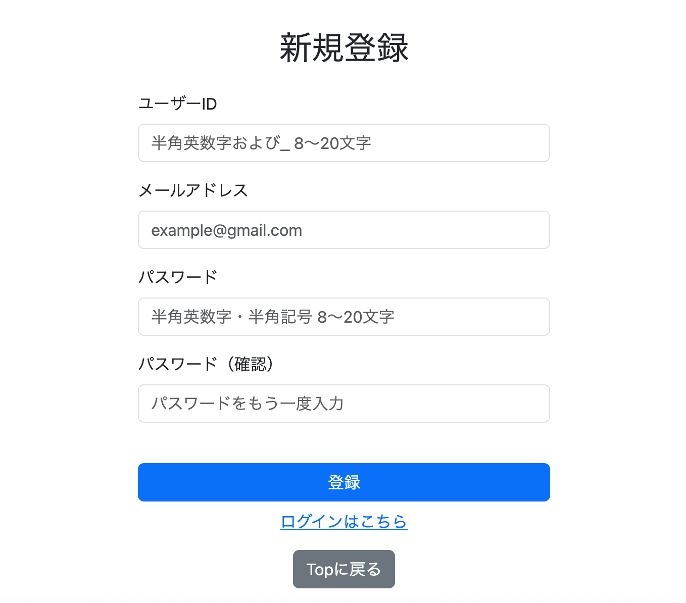

既存のログインIDを入力した場合は重複エラーが表示される。

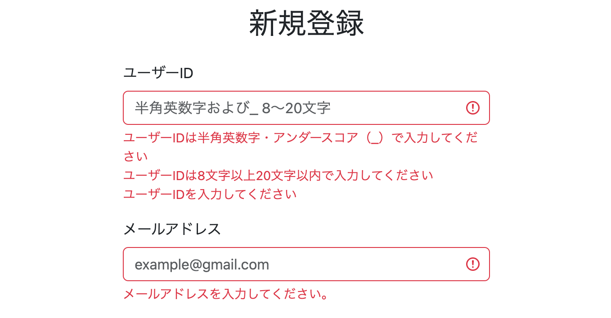

メールアドレスを入力しなかった場合はバリデーションエラーが表示される。

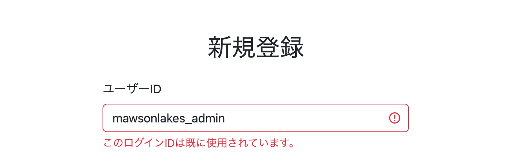

既存のメールアドレスを入力した場合も重複エラーとなるが、この時点ではメールアドレスのエラーメッセージがログインID入力欄に表示される問題が発生。

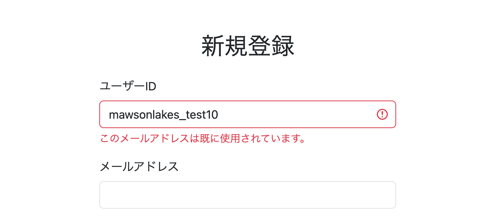

---

## 3. Signupの重複エラーを入力項目ごとに表示

### 発生した問題

従来のControllerでは`DuplicateKeyException`を受け取った場合、

```java
bindingResult.rejectValue(
        "loginId",
        "duplicate",
        e.getMessage());
```

としていた。

エラーを登録するフィールドが`loginId`に固定されているため、メールアドレスが重複した場合でもログインID入力欄へエラーが表示される。

### DuplicateSignupException

どの入力項目で重複したのかをControllerへ伝えられるよう、独自例外`DuplicateSignupException`を追加。

```java
public class DuplicateSignupException extends RuntimeException {

    private final String field;

    public DuplicateSignupException(
            String field,
            String message) {

        super(message);
        this.field = field;
    }

    public String getField() {
        return field;
    }
}
```

`field`には、

```text
loginId
email
```

のいずれかを保持する。

ServiceではログインID重複時に、

```java
throw new DuplicateSignupException(
        "loginId",
        message);
```

メールアドレス重複時には、

```java
throw new DuplicateSignupException(
        "email",
        message);
```

として、重複したフィールドを例外へ設定。

Controller側では、

```java
bindingResult.rejectValue(
        e.getField(),
        "duplicate",
        e.getMessage());
```

とし、例外から取得したフィールド名をそのまま`rejectValue`へ渡す。

これにより、

```text
ログインID重複
    ↓
loginIdの入力欄

メールアドレス重複
    ↓
emailの入力欄
```

と、重複した項目に対応する位置へエラーメッセージを表示できる。

### 実行確認

既存のメールアドレスを入力した場合、メールアドレス入力欄に重複エラーが表示されるようになった。

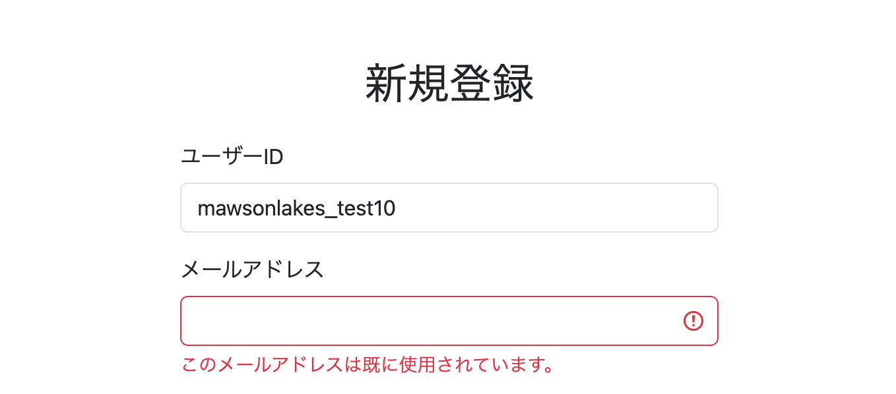

すべての入力値に問題がなくSignupが成功した場合は、登録完了メッセージが表示される。

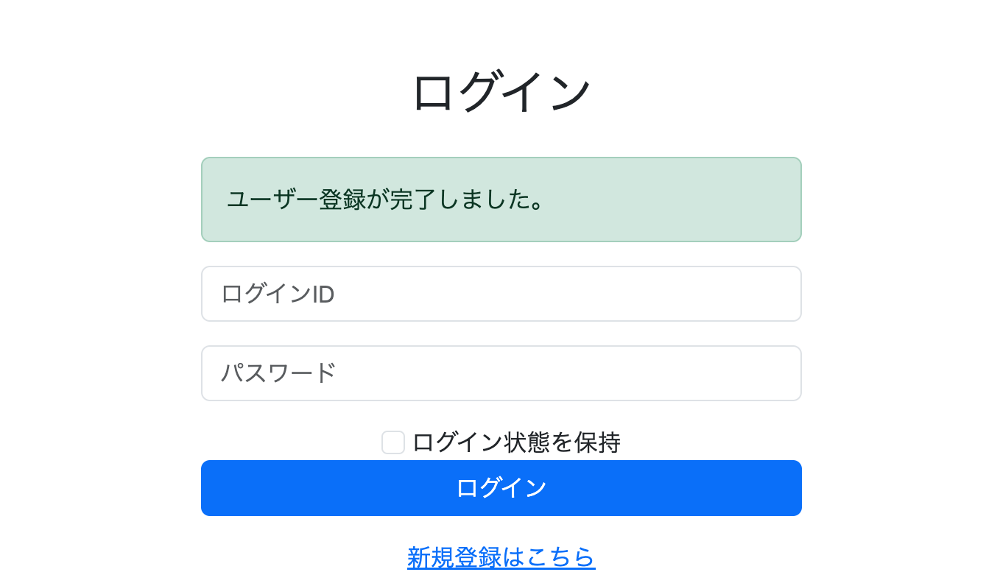

---

## 4. Userメニューからメールアドレスを変更

Signup時に登録したメールアドレスを、ユーザー自身が後から変更できるようにする。

処理の流れは、

```text
Userプロフィール
    ↓
メールアドレス変更画面
    ↓
新しいメールアドレスを入力
    ↓
形式・重複を確認
    ↓
users.emailを更新
    ↓
プロフィールへ戻る
```

とする。

### EditEmailForm

メールアドレス変更画面から入力値を受け取る`EditEmailForm`を追加。

```java
@Data
public class EditEmailForm {

    @NotBlank(message = "{signup.email.notBlank}")
    @Email(message = "{signup.email.invalid}")
    private String email;
}
```

### UserAccountService

メールアドレス更新用の`updateEmail`を追加。

更新対象ユーザーは、変更対象であるメールアドレスではなくログインIDから取得する。

```java
Users user = getUserOrThrow(
        loginId,
        "user.edit.email.error.notFound",
        locale);
```

取得したユーザーから現在のメールアドレスを取得。

```java
String currentEmail = user.getEmail();
```

入力されたメールアドレスが現在のメールアドレスと同じ場合は更新対象としない。

```java
if (newEmail.equals(currentEmail)) {
    throw new IllegalArgumentException(...);
}
```

続いて、新しいメールアドレスがすでに使用されていないか確認。

```java
boolean emailExists =
        userRepository.existsByEmail(newEmail);
```

重複がなければ、

```java
user.setEmail(newEmail);
userRepository.save(user);
```

によって更新する。

### UserProfileController

メールアドレス変更用にGETとPOSTを追加。

GETでは現在ログインしているユーザーを取得し、現在のメールアドレスを画面へ渡す。

POSTでは`EditEmailForm`のバリデーション後、`UserAccountService.updateEmail`を実行。

メールアドレスが重複している場合は`DuplicateSignupException`、現在と同じメールアドレスの場合は`IllegalArgumentException`を受け取り、メールアドレス入力欄へエラーを登録する。

変更成功後は、

```java
redirectAttributes.addFlashAttribute(
        "messageKey",
        "user.email.changed");

return "redirect:/user/profile";
```

としてプロフィール画面へ戻す。

メールアドレスを変更してもSpring Securityが認証情報として使用しているログインIDは変化しないため、ログアウト処理は行わない。

### email.html

`/user/edit/email.html`を追加。

現在のメールアドレスを表示し、その下に新しいメールアドレスの入力欄を配置。

入力エラーは、

```html
<div class="invalid-feedback"
     th:errors="*{email}">
</div>
```

によってメールアドレス入力欄の下へ表示する。

### user/profile.html

プロフィール画面へメールアドレスの表示欄を追加。

```html
<td class="align-middle"
    th:text="${user.email}">
</td>
```

あわせてメールアドレス変更画面への編集ボタンを配置。

変更成功後はFlash Attributeの`messageKey`から完了メッセージを表示する。

### 実行確認

`/user/profile`へアクセスすると、プロフィール欄に現在登録されているメールアドレスが表示される。

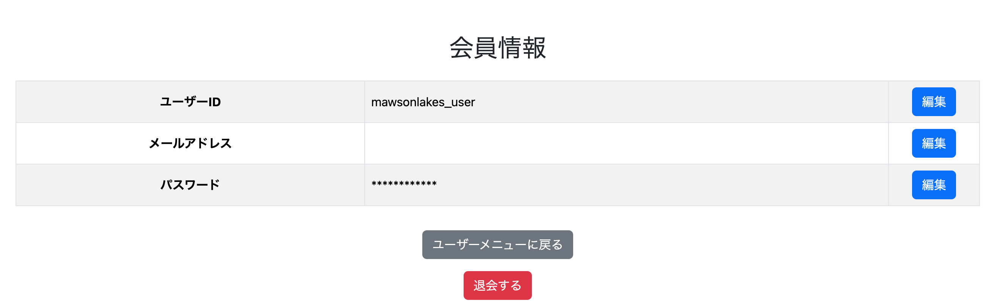

編集ボタンからメールアドレス変更画面へ遷移できる。

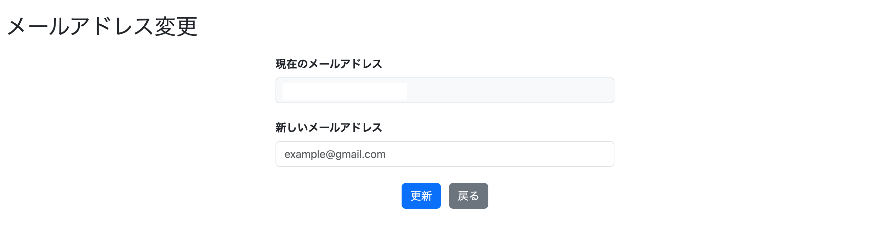

正しいメールアドレスを入力して更新すると、ログアウトせずプロフィール画面へ戻り、変更後のメールアドレスが反映される。

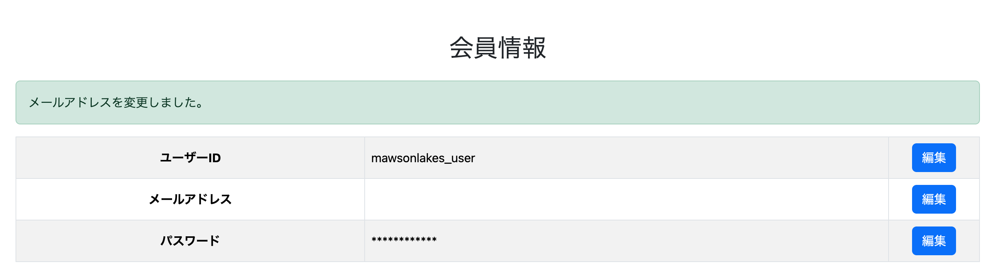

メールアドレスを入力しなかった場合はバリデーションエラーとなる。


現在と同じメールアドレスを入力した場合もエラーを表示。


すでに他のユーザーが使用しているメールアドレスの場合は重複エラーを表示する。


---

## 5. Adminユーザー一覧にメールアドレスを表示

Adminユーザー管理画面でも登録メールアドレスを確認できるようにする。

`/admin/user/list.html`の一覧へメールアドレス列を追加。

```html
<th>メールアドレス</th>
```

各ユーザーの行では、

```html
<td th:text="${item.email}"></td>
```

によって`Users.email`を表示する。

### 実行確認

変更前のAdminユーザー一覧。

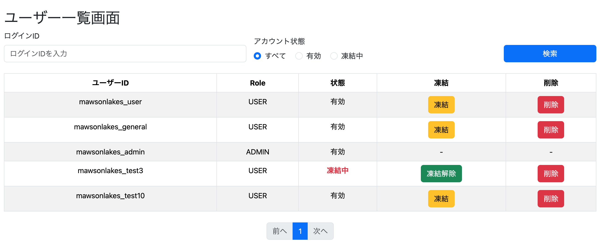

メールアドレス列の追加後は、各ユーザーのメールアドレスも一覧上で確認できる。

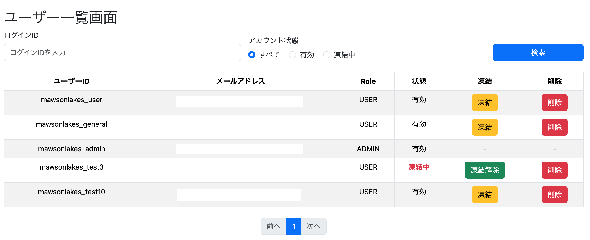

---

## 6. Adminユーザー検索にメールアドレスを追加

Adminユーザー一覧で、メールアドレスをキーワードとしてユーザーを絞り込めるようにする。

### AdminUserSearchDto

検索条件を保持する`AdminUserSearchDto`へ`email`を追加。

```java
private String email;
```

### UserRepository

既存のユーザー検索Queryへメールアドレス検索条件を追加。

```java
AND (
    :email IS NULL
    OR :email = ''
    OR LOWER(u.email)
        LIKE LOWER(CONCAT('%', :email, '%'))
)
```

`email`がNULLまたは空文字の場合はメールアドレスによる絞り込みを行わない。

値が入力されている場合は、

```text
%入力値%
```

の形で部分一致検索を行う。

また、

```java
LOWER(u.email)
LIKE LOWER(CONCAT('%', :email, '%'))
```

としてDB側と検索値の両方を小文字へ変換してから比較し、大文字・小文字を区別しない検索とする。

### AdminUserService

Repository呼び出し時に、

```java
searchDto.getEmail()
```

を追加し、画面で入力されたメールアドレス検索条件をRepositoryへ渡す。

Controllerについては`AdminUserSearchDto`を`@ModelAttribute`で受け取っているため、この時点で追加の変更は不要。

### admin/user/list.html

検索フォームへメールアドレス入力欄を追加。

```html
<input type="text"
       id="email"
       th:field="*{email}"
       class="form-control"
       placeholder="メールアドレスを入力">
```

今回は完全なメールアドレスを入力させるフォームではなく部分一致のキーワード検索なので、`type="email"`ではなく`type="text"`を使用する。

検索フォーム内の要素が4つになったため、それぞれの`col-md-*`を`col-md-3`へ変更して横幅を調整。

### 実行確認

Adminユーザー一覧にメールアドレス検索欄が追加される。

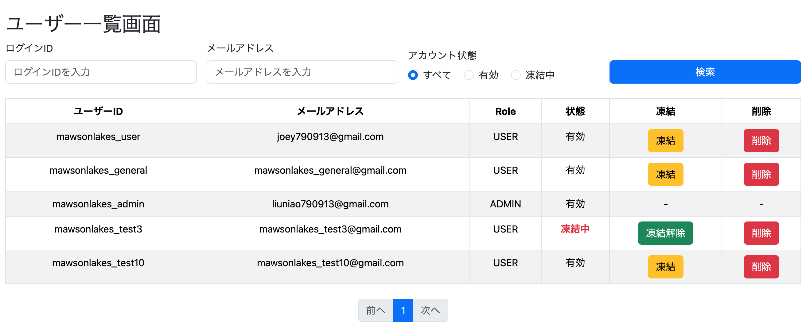

メールアドレスに含まれるキーワードを入力すると、該当するユーザーだけに検索結果を絞り込める。

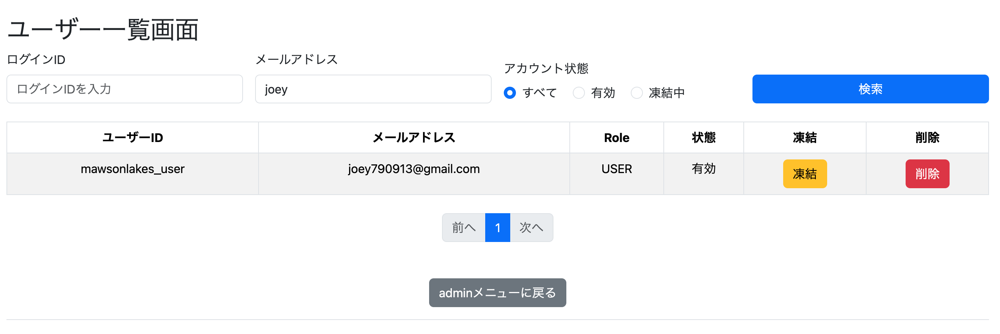

---

## 7. Adminユーザー一覧の表示順を切り替え

Adminユーザー一覧に表示順の選択機能を追加する。

### AdminUserSortCondition

一覧の表示順を表すEnumとして`AdminUserSortCondition`を追加。

```java
public enum AdminUserSortCondition {

    USER_ID_ASC,
    EMAIL_ASC
}
```

### UserRepository

ユーザー検索Queryへ`sortCondition`を追加。

```java
@Param("sortCondition") String sortCondition
```

Queryでは`ORDER BY`の`CASE`によって、選択された表示順を切り替える。

```java
ORDER BY
    CASE
        WHEN :sortCondition = 'LOGIN_ID_ASC'
        THEN u.loginId
    END ASC,
    CASE
        WHEN :sortCondition = 'EMAIL_ASC'
        THEN u.email
    END ASC
```

`LOGIN_ID_ASC`の場合はログインIDの昇順、`EMAIL_ASC`の場合はメールアドレスの昇順を適用する。

### AdminUserService

`getUsers`の引数に`AdminUserSortCondition`を追加。

```java
public Page<Users> getUsers(
        AdminUserSearchDto searchDto,
        AdminUserSortCondition sortCondition,
        Pageable pageable)
```

Repositoryへ渡す際は、

```java
sortCondition.name()
```

によってEnumの値を文字列として渡す。

### AdminUserController

一覧取得時に`sortCondition`をRequest Parameterとして受け取る。

```java
@RequestParam(defaultValue = "LOGIN_ID_ASC")
AdminUserSortCondition sortCondition
```

さらに、

```java
model.addAttribute(
        "sortCondition",
        sortCondition);
```

としてModelへ追加。

これにより、現在選択されている表示順をHTML側でも参照できる。

### admin/user/list.html

検索フォームへ表示順の選択欄を追加。

```html
<select class="form-select"
        name="sortCondition">

    <option value="LOGIN_ID_ASC">
        ログインID順
    </option>

    <option value="EMAIL_ASC">
        メールアドレス順
    </option>

</select>
```

選択した`sortCondition`を検索条件と一緒にControllerへ送信し、Repositoryの`ORDER BY`へ反映する。

### 実行確認

`/admin/user/list`へアクセスすると表示順を選択できるようになり、選択した条件に応じてユーザー一覧の並び順が切り替わる。

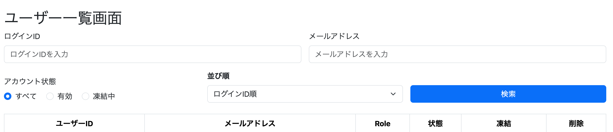

---

## まとめ

ユーザー情報としてメールアドレスを管理するため、`users.email`を追加し、Signup時に保存する構成へ変更。

メールアドレスについてもログインIDと同様に重複を禁止し、`DuplicateSignupException`によってログインIDとメールアドレスのどちらで重複したのかをControllerへ渡せるようにする。

既存ユーザーについてはプロフィール画面からメールアドレスを変更可能とし、変更時には現在と同じメールアドレス、および他ユーザーとの重複をチェックする。

Adminユーザー管理画面についてもメールアドレスに対応し、

- メールアドレスの一覧表示
- メールアドレスによるキーワード検索
- ユーザー一覧の表示順切り替え

を追加。

これにより、次章でメールアドレスを利用したパスワードリセットを実装するためのユーザー情報管理部分を整える。