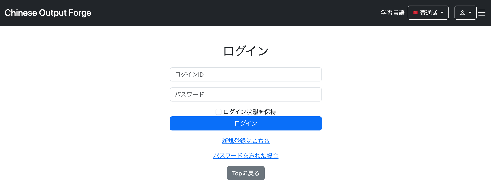
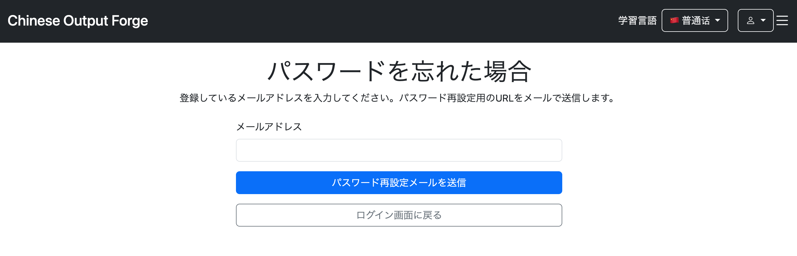
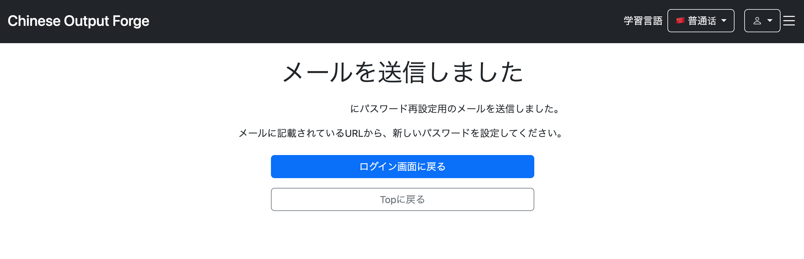
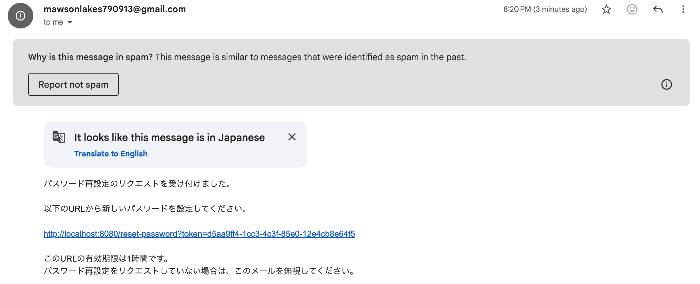
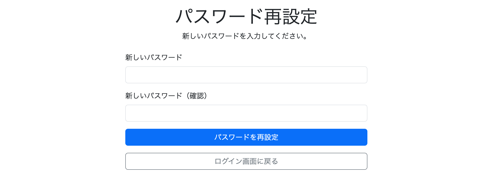
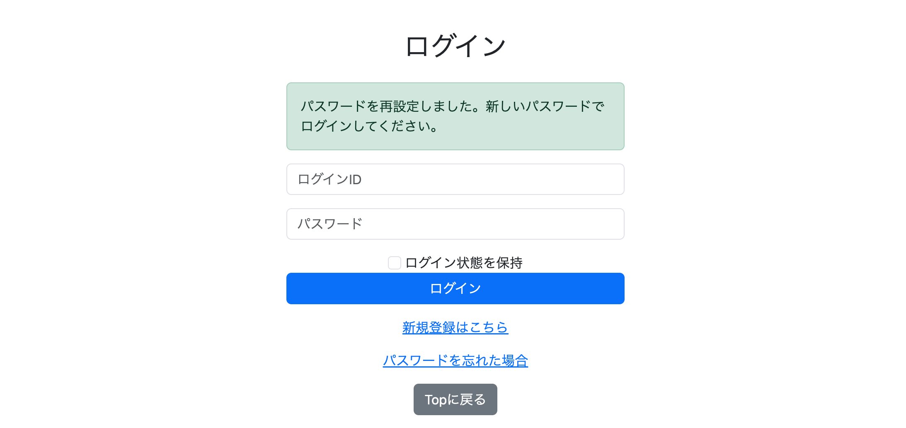
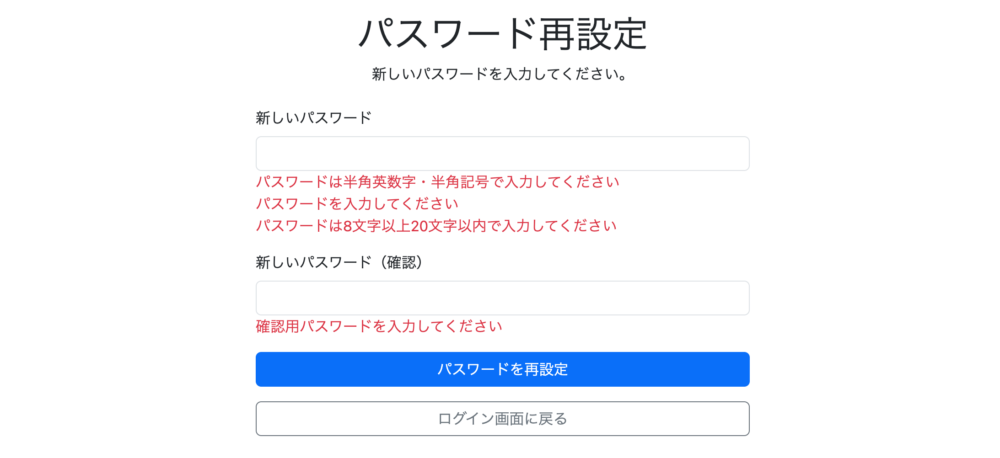
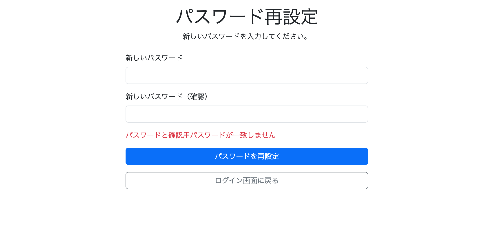
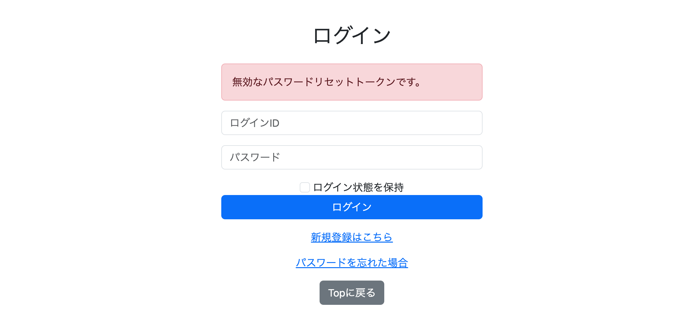
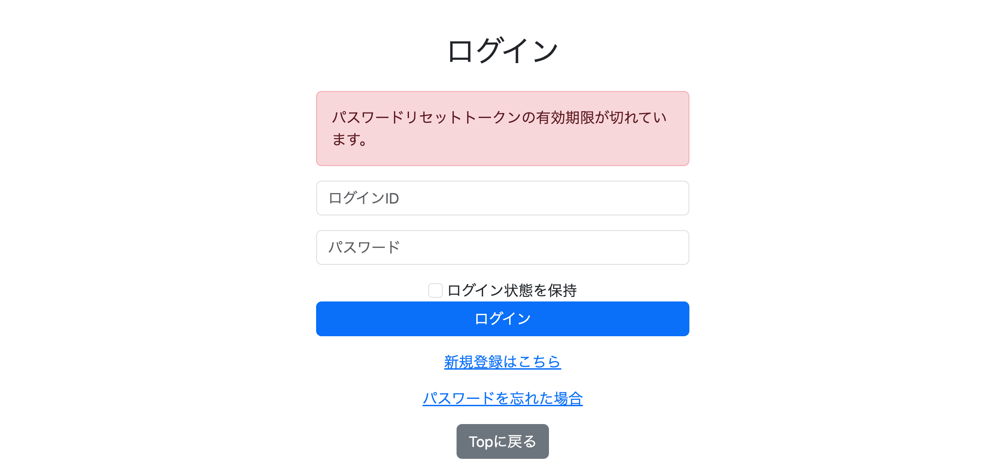

# 028 メールを利用したパスワードリセット機能

## 概要

前章では`users`テーブルへメールアドレスを追加し、Signup時の登録、Userプロフィールからの変更、Admin画面での管理まで対応した。

今回は登録済みのメールアドレスを利用し、**パスワードを忘れてログインできなくなったユーザーが、自分で新しいパスワードを設定できる機能**を追加する。

既存のパスワード変更機能はログイン済みユーザーを対象としているため、パスワードを忘れてログインできない場合には利用できない。

そこで、

```text
ログイン画面
    ↓
「パスワードを忘れた場合」
    ↓
登録メールアドレスを入力
    ↓
対象ユーザーを特定
    ↓
パスワードリセットトークンを発行
    ↓
トークンを含むURLをメールで送信
    ↓
ユーザーがURLへアクセス
    ↓
トークンを検証
    ↓
新しいパスワードを入力
    ↓
パスワードを更新
    ↓
使用済みトークンを削除
```

という流れでパスワードを再設定できるようにする。

メールにパスワード変更画面のURLをそのまま記載するのではなく、ランダムに生成した**パスワードリセットトークン**をURLへ含める。

サーバー側ではトークンがDBに存在することと有効期限内であることを確認し、条件を満たした場合のみパスワード再設定画面へのアクセスを許可する構成とする。

---

## 1. パスワードリセットトークンを管理

### password_reset_tokenテーブル

パスワードリセット要求を一時的に管理するため、新しく`password_reset_token`テーブルを作成。

```sql
CREATE TABLE password_reset_token (
    token_id BIGSERIAL PRIMARY KEY,
    user_id BIGINT NOT NULL UNIQUE,
    token VARCHAR(255) NOT NULL UNIQUE,
    expires_at TIMESTAMP NOT NULL,

    CONSTRAINT fk_password_reset_token_user
        FOREIGN KEY (user_id)
        REFERENCES users(id)
);
```

保持する情報は以下の4つ。

```text
token_id     トークンレコード自体のID
user_id      パスワードをリセットするユーザー
token        リセットURLで使用するランダムな文字列
expires_at   トークンの有効期限
```

`user_id`は`users.id`を参照する外部キーとし、どのユーザーに対して発行されたトークンなのかを管理する。

また、`user_id`には`UNIQUE`制約を設定。

今回の設計では、同じユーザーからパスワードリセット要求が複数回行われても複数のトークンを保持せず、**1ユーザーにつき現在のトークンを1つだけ保持する**。

```text
Users 1 ─ 0..1 PasswordResetToken
```

再度リセット要求が行われた場合には既存トークンを削除し、新しいトークンへ置き換える。

`token`にも`UNIQUE`制約を設定し、異なるパスワードリセット要求で同一トークンを保持しない構成とする。

### PasswordResetToken Entity

`password_reset_token`に対応するEntityとして`PasswordResetToken`を追加。

```java
@Entity
@Table(name = "password_reset_token")
@Getter
@Setter
public class PasswordResetToken {

    @Id
    @GeneratedValue(strategy = GenerationType.IDENTITY)
    @Column(name = "token_id")
    private Long tokenId;

    @OneToOne
    @JoinColumn(name = "user_id", nullable = false)
    private Users user;

    @Column(name = "token", nullable = false, unique = true)
    private String token;

    @Column(name = "expires_at", nullable = false)
    private LocalDateTime expiresAt;
}
```

`Users`との関連は、

```java
@OneToOne
@JoinColumn(name = "user_id", nullable = false)
private Users user;
```

とする。

これにより、`PasswordResetToken`を取得すれば、そこからパスワードを変更する対象の`Users`も取得できる。

DB側の`user_id UNIQUE`とEntity側の`@OneToOne`を対応させ、1ユーザー1トークンという設計をDBとJavaの両方で表現する。

### PasswordResetTokenRepository

トークンの保存・検索・削除を行うRepositoryを追加。

```java
public interface PasswordResetTokenRepository
        extends JpaRepository<PasswordResetToken, Long> {

    Optional<PasswordResetToken> findByUser(Users user);

    Optional<PasswordResetToken> findByToken(String token);
}
```

`findByUser(Users user)`は、対象ユーザーにすでにトークンが発行されているか確認するために利用する。

```text
Users
    ↓
findByUser()
    ↓
既存PasswordResetToken
```

既存トークンが見つかった場合は、新しいトークンを発行する前に削除する。

`findByToken(String token)`は、メール内のURLから受け取ったトークンを検索するために利用。

```text
/reset-password?token=abc123...
    ↓
token = abc123...
    ↓
findByToken()
    ↓
PasswordResetToken
    ↓
Users
```

これにより、URLに含まれるトークンからパスワードリセット要求と対象ユーザーを特定できる。

---

## 2. パスワードリセットトークンを発行

### UserRepository

パスワードリセット要求ではログインIDではなく、ユーザーが入力した登録メールアドレスから対象ユーザーを特定する。

そのため、`UserRepository`へ以下を追加。

```java
Optional<Users> findByEmail(String email);
```

### PasswordResetService.createPasswordResetToken

パスワードリセット要求を受け取り、トークンの作成からメール送信までを行う`createPasswordResetToken`を追加。

```java
@Transactional
public void createPasswordResetToken(
        String email,
        Locale locale) {
```

まず、入力されたメールアドレスからユーザーを取得。

```java
Users user = userRepository.findByEmail(email)
        .orElseThrow(() ->
                new IllegalArgumentException(
                        messageSource.getMessage(
                                "password.reset.error.userNotFound",
                                null,
                                locale)));
```

該当するユーザーが存在しない場合は、メッセージリソースからエラーメッセージを取得して例外とする。

続いて、そのユーザーにすでにパスワードリセットトークンが存在するか確認。

```java
Optional<PasswordResetToken> existingToken =
        passwordResetTokenRepository.findByUser(user);
```

既存トークンがある場合は削除する。

```java
if (existingToken.isPresent()) {
    passwordResetTokenRepository.delete(
            existingToken.get());

    passwordResetTokenRepository.flush();
}
```

これにより、同じユーザーがパスワードリセットを再度要求した場合には、以前発行したトークンを残さず新しいトークンへ置き換える。

新しいトークンは`UUID`を利用して生成。

```java
String token = UUID.randomUUID().toString();
```

生成される値は、

```text
550e8400-e29b-41d4-a716-446655440000
```

のようなランダムな文字列となる。

生成したトークンを新しい`PasswordResetToken`へ設定。

```java
PasswordResetToken passwordResetToken =
        new PasswordResetToken();

passwordResetToken.setUser(user);
passwordResetToken.setToken(token);
passwordResetToken.setExpiresAt(
        LocalDateTime.now().plusHours(1));
```

トークンを永久に使用できる状態にはせず、

```java
LocalDateTime.now().plusHours(1)
```

によって発行時点から1時間後を有効期限として保存する。

その後、RepositoryからDBへ登録。

```java
passwordResetTokenRepository.save(
        passwordResetToken);
```

最後に対象ユーザーのメールアドレスと生成したトークンを`MailService`へ渡す。

```java
mailService.sendPasswordResetEmail(
        user.getEmail(),
        token);
```

`createPasswordResetToken`全体では、

```text
メールアドレスからUsersを取得
    ↓
既存トークンを検索
    ↓
存在すれば削除
    ↓
UUIDで新しいトークンを生成
    ↓
有効期限を1時間後に設定
    ↓
PasswordResetTokenを保存
    ↓
MailServiceへメールアドレスとトークンを渡す
```

という処理を担当する。

### passwordResetTokenRepository.flush()

既存トークンを削除する処理では、

```java
passwordResetTokenRepository.delete(
        existingToken.get());

passwordResetTokenRepository.flush();
```

として`delete()`の直後に`flush()`を実行。

`@Transactional`によるトランザクション内では、Repositoryの`delete()`を呼び出しても、その時点でDELETE文がDBへ送信されるとは限らない。

今回の`password_reset_token`では、

```sql
user_id BIGINT NOT NULL UNIQUE
```

としているため、同じ`user_id`を持つレコードを2件登録することはできない。

そのため、

```text
既存トークンのdelete()を呼び出す
    ↓
DELETEがまだDBへ反映されていない
    ↓
新しいトークンをINSERT
```

という順序になると、

```text
duplicate key value violates unique constraint
"password_reset_token_user_id_key"
```

が発生する。

そこで、

```java
passwordResetTokenRepository.flush();
```

によって、それまでの変更をDBへ反映してから新しいトークンを保存する。

```text
既存トークンをdelete()
    ↓
flush()
    ↓
DELETEをDBへ反映
    ↓
新しいトークンをINSERT
```

これにより、同じユーザーが再度パスワードリセットを要求した場合にも新しいトークンへ置き換えられる。

---

## 3. パスワードリセットメールを送信

### pom.xml

Spring Bootからメールを送信するため、Mail Starterを追加。

```xml
<dependency>
    <groupId>org.springframework.boot</groupId>
    <artifactId>spring-boot-starter-mail</artifactId>
</dependency>
```

今回は`JavaMailSender`を利用してSMTP経由でメールを送信する。

### MailService.sendPasswordResetEmail

パスワードリセット用メールを作成・送信する`sendPasswordResetEmail`を`MailService`へ追加。

```java
public void sendPasswordResetEmail(
        String email,
        String token)
```

引数として、送信先のメールアドレスと`PasswordResetService`で生成したトークンを受け取る。

まず、設定ファイルからアプリケーションのベースURLを取得。

```java
@Value("${app.base-url}")
private String baseUrl;
```

取得した`baseUrl`とトークンを組み合わせて、パスワード再設定画面へのURLを生成する。

```java
String url = baseUrl
        + "/reset-password?token="
        + token;
```

ローカル環境では、

```text
http://localhost:8080/reset-password?token=...
```

というURLになる。

メール本文にはこのURLを記載し、URLの有効期限が1時間であること、リセットを要求していない場合はメールを無視できることも案内する。

メール本体には`MimeMessage`を使用。

```java
var message = mailSender.createMimeMessage();
```

`MimeMessageHelper`を利用して送信元、送信先、本文、件名を設定する。

```java
MimeMessageHelper messageHelper =
        new MimeMessageHelper(message);

messageHelper.setFrom(...);
messageHelper.setTo(email);
messageHelper.setText(text);
messageHelper.setSubject(subject);
```

設定後、

```java
mailSender.send(message);
```

によってメールを送信する。

メールの作成・設定中に`MessagingException`が発生した場合は`RuntimeException`へ変換する。

---

## 4. SMTPとベースURLを設定

### application.yml

`JavaMailSender`からGmailのSMTPサーバーを利用できるよう、メール送信設定を追加。

```yaml
spring:
  mail:
    host: smtp.gmail.com
    port: 587
    username: ${MAIL_USERNAME}
    password: ${MAIL_PASSWORD}
    properties:
      mail:
        smtp:
          auth: true
          starttls:
            enable: true
```

`host`にはGmailのSMTPサーバーである`smtp.gmail.com`を指定。

`port`はSTARTTLSを利用するため`587`とする。

SMTP認証に使用するメールアドレスとアプリパスワードは、

```yaml
username: ${MAIL_USERNAME}
password: ${MAIL_PASSWORD}
```

として環境変数から取得する。

実際の認証情報を`application.yml`へ直接記述せず、

```text
MAIL_USERNAME
MAIL_PASSWORD
```

として実行環境側で管理する構成とする。

また、

```yaml
auth: true
```

でSMTP認証を有効化し、

```yaml
starttls:
  enable: true
```

によってSTARTTLSによる通信の暗号化を有効にする。

### app.base-url

パスワードリセットメールに記載するURLを生成するため、アプリケーションのベースURLも設定。

```yaml
app:
  base-url: http://localhost:8080
```

`MailService`では、

```java
@Value("${app.base-url}")
private String baseUrl;
```

として取得する。

現在はローカル環境なので`http://localhost:8080`だが、AWSへデプロイした場合には本番環境のURLへ変更する必要がある。

Javaコード内へURLを固定せず設定値として分離することで、デプロイ時には`app.base-url`を変更するだけで対応できる。

---

## 5. パスワードリセットトークンを検証

### PasswordResetService.validateToken

ユーザーがメール内のURLへアクセスした際、URLに含まれるトークンが実際に使用可能か確認する`validateToken`を追加。

```java
public PasswordResetToken validateToken(
        String token,
        Locale locale) {
```

まず、受け取ったトークンをRepositoryから検索。

```java
Optional<PasswordResetToken> resetToken =
        passwordResetTokenRepository.findByToken(token);
```

該当するトークンが存在しない場合は無効なURLとして例外とする。

```java
if (resetToken.isEmpty()) {
    throw new IllegalArgumentException(
            messageSource.getMessage(
                    "password.reset.error.invalidToken",
                    null,
                    locale));
}
```

トークンが存在する場合は`Optional`から`PasswordResetToken`を取得。

```java
PasswordResetToken passwordResetToken =
        resetToken.get();
```

続いて有効期限を確認する。

```java
if (passwordResetToken.getExpiresAt()
        .isBefore(LocalDateTime.now())) {
```

`expiresAt`が現在時刻より前であれば期限切れなので、パスワードリセットには使用できない。

```java
throw new IllegalArgumentException(
        messageSource.getMessage(
                "password.reset.error.expiredToken",
                null,
                locale));
```

存在確認と有効期限確認の両方を通過した場合のみ、

```java
return passwordResetToken;
```

として有効な`PasswordResetToken`を返す。

処理は、

```text
URLからtokenを受け取る
    ↓
DBからtokenを検索
    ↓
存在しない → エラー
    ↓
存在する
    ↓
有効期限を確認
    ↓
期限切れ → エラー
    ↓
有効
    ↓
PasswordResetTokenを返す
```

となる。

---

## 6. パスワードを更新

### ResetPasswordForm

新しいパスワードと確認用パスワードを受け取るFormとして`ResetPasswordForm`を追加。

```java
@Data
@PasswordMatch(
    passwordFieldName = "newPassword",
    passwordConfirmFieldName = "newPasswordConfirm"
)
public class ResetPasswordForm {

    @NotBlank(message = "{signup.password.notBlank}")
    @Length(
        min = 8,
        max = 20,
        message = "{signup.password.length}"
    )
    @Pattern(
        regexp = "^[\\x21-\\x7E]+$",
        message = "{signup.password.pattern}"
    )
    private String newPassword;

    @NotBlank(message = "{signup.passwordConfirm.notBlank}")
    private String newPasswordConfirm;
}
```

新しいパスワードにはSignup時と同じバリデーション条件を適用。

```text
未入力ではない
8～20文字
指定された文字形式
```

を確認する。

また、既存の独自バリデーション`@PasswordMatch`を利用し、`newPassword`と`newPasswordConfirm`が一致していることも検証する。

### PasswordResetService.resetPassword

実際に`users.password`を更新する`resetPassword`を追加。

まず、

```java
PasswordResetToken resetToken =
        validateToken(token, locale);
```

としてトークンを再度検証する。

GETでパスワード再設定画面を表示する際に検証済みであっても、実際にパスワードを変更するPOST時点でもトークンが有効であることを確認する。

`validateToken`から返された`PasswordResetToken`には対象ユーザーが関連付けられているため、

```java
Users user = resetToken.getUser();
```

としてパスワードを変更するユーザーを取得。

新しいパスワードはそのままDBへ保存せず、既存のパスワード登録・変更処理と同様に`PasswordEncoder`でハッシュ化する。

```java
String encodedPassword =
        passwordEncoder.encode(newPassword);
```

ハッシュ化した値を、

```java
user.setPassword(encodedPassword);
```

によって`Users.password`へ設定。

パスワード更新後は、

```java
passwordResetTokenRepository.delete(resetToken);
```

として使用済みトークンを削除する。

これにより、一度パスワード変更に使用したメール内のURLを再利用できない構成となる。

---

## 7. パスワードリセット要求画面を追加

### ForgotPasswordForm

ログインできないユーザーから登録メールアドレスを受け取るため、`ForgotPasswordForm`を追加。

```java
@Data
public class ForgotPasswordForm {

    @NotBlank(message = "{signup.email.notBlank}")
    @Email(message = "{signup.email.invalid}")
    private String email;
}
```

メールアドレスにはSignup時と同じ`@NotBlank`と`@Email`を利用する。

### PasswordResetController.getForgotPassword

`GET /forgot-password`でメールアドレス入力画面を表示。

```java
@GetMapping("/forgot-password")
public String getForgotPassword(
        ForgotPasswordForm form,
        Model model) {

    model.addAttribute(
            "forgotPasswordForm",
            form);

    return "forgot-password";
}
```

`ForgotPasswordForm`をModelへ登録し、`forgot-password.html`から入力できるようにする。

### PasswordResetController.postForgotPassword

`POST /forgot-password`で入力されたメールアドレスを受け取る。

まず通常のFormバリデーションを確認。

```java
if (bindingResult.hasErrors()) {
    return getForgotPassword(form, model);
}
```

問題がなければ、

```java
passwordResetService.createPasswordResetToken(
        form.getEmail(),
        locale);
```

を実行し、

```text
ユーザー検索
    ↓
トークン生成・保存
    ↓
メール送信
```

までをServiceへ引き継ぐ。

メール送信後の画面でも送信先メールアドレスを表示するため、

```java
redirectAttributes.addAttribute(
        "email",
        form.getEmail());
```

としてRequest Parameterへ追加。

```java
return "redirect:/forgot-password/sent";
```

で送信完了画面へリダイレクトする。

### PasswordResetController.getForgotPasswordSent

`GET /forgot-password/sent`ではRequest Parameterとして引き継いだメールアドレスを受け取る。

```java
@GetMapping("/forgot-password/sent")
public String getForgotPasswordSent(
        @RequestParam String email,
        Model model) {

    model.addAttribute("email", email);

    return "forgot-password-sent";
}
```

Modelへ`email`を登録することで、送信完了画面に実際の送信先を表示できる。

### forgot-password.html

パスワードリセット要求用のメールアドレス入力画面を追加。

`ForgotPasswordForm`と紐付け、

```html
<form th:action="@{/forgot-password}"
      th:object="${forgotPasswordForm}"
      method="post">
```

としてPOSTする。

メールアドレス入力欄には、

```html
<input type="email"
       id="email"
       class="form-control"
       th:field="*{email}">
```

を使用し、Form側のバリデーションエラーも入力欄の下へ表示する。

### login.html

ログイン画面からパスワードリセットを開始できるよう、

```html
<a th:href="@{/forgot-password}"
   th:text="#{login.forgotPassword}">
    パスワードを忘れた場合
</a>
```

を追加。

これにより、ログインできない状態から`/forgot-password`へ移動できる。

### forgot-password-sent.html

メール送信後の完了画面を追加。

Controllerから受け取った`email`を、

```html
<span th:text="${email}"></span>
```

で表示し、どのメールアドレスへパスワードリセットURLを送信したのか確認できるようにする。

---

## 8. パスワード再設定画面を追加

### PasswordResetController.getResetPassword

メール内のURLからアクセスする入口として`GET /reset-password`を追加。

```java
@GetMapping("/reset-password")
public String getResetPassword(
        @RequestParam String token,
        Model model,
        ResetPasswordForm form,
        Locale locale,
        RedirectAttributes redirectAttributes)
```

URLの、

```text
?token=...
```

を`@RequestParam String token`で受け取る。

画面を表示する前に、

```java
passwordResetService.validateToken(
        token,
        locale);
```

でトークンを検証。

無効なトークンや有効期限切れの場合は`IllegalArgumentException`を受け取り、

```java
redirectAttributes.addFlashAttribute(
        "errorMessage",
        e.getMessage());

return "redirect:/login";
```

としてログイン画面へ戻す。

有効な場合は、

```java
model.addAttribute("token", token);
model.addAttribute(
        "resetPasswordForm",
        form);
```

としてトークンとFormをModelへ登録し、`reset-password.html`を表示する。

### reset-password.html

新しいパスワードと確認用パスワードを入力する画面を追加。

GETで検証したトークンは、POST時にも必要になるためHidden Inputとして保持する。

```html
<input type="hidden"
       name="token"
       th:value="${token}">
```

新しいパスワードと確認用パスワードは`ResetPasswordForm`へ紐付ける。

通常のフィールドバリデーションに加え、`@PasswordMatch`によるGlobal Errorについても表示領域を用意する。

### PasswordResetController.postResetPassword

`POST /reset-password`ではHidden Inputからトークン、新しいパスワードをFormから受け取る。

バリデーションエラーがある場合は再設定画面へ戻す。

```java
if (bindingResult.hasErrors()) {
    return getResetPassword(
            token,
            model,
            form,
            locale);
}
```

入力値に問題がなければ、

```java
passwordResetService.resetPassword(
        token,
        form.getNewPassword(),
        locale);
```

を実行。

Service側でトークンを再検証し、対象ユーザーのパスワード更新と使用済みトークンの削除を行う。

更新成功後は、

```java
redirectAttributes.addFlashAttribute(
        "messageKey",
        "password.reset.success");
```

として完了メッセージを設定し、

```java
return "redirect:/login";
```

でログイン画面へ戻す。

### login.html

トークンが無効または期限切れだった場合に、Controllerから渡された`errorMessage`を表示する領域を追加。

```html
<div th:if="${errorMessage}"
     class="alert alert-danger"
     role="alert"
     th:text="${errorMessage}">
    エラーメッセージ
</div>
```

これにより、パスワード再設定画面を表示できなかった理由をログイン画面上で確認できる。

---

## 9. パスワードリセット関連ページを非ログイン状態で許可

### SecurityConfig

パスワードリセットはログインできないユーザーが利用する機能なので、関連URLをSpring Securityの認証対象から除外。

```java
.requestMatchers("/forgot-password").permitAll()
.requestMatchers("/forgot-password/sent").permitAll()
.requestMatchers("/reset-password").permitAll()
```

対象は、

```text
/forgot-password
    メールアドレス入力

/forgot-password/sent
    メール送信完了

/reset-password
    パスワード再設定
```

の3つ。

これにより、未認証状態でもパスワードリセットの一連の処理へアクセスできる。

---

## 10. メッセージを追加

パスワードリセットで使用する画面表示、バリデーション、処理結果のメッセージを`messages.properties`へ追加。

ログイン画面には、

```properties
login.forgotPassword=パスワードを忘れた場合
```

を追加。

メールアドレス入力画面、メール送信完了画面、パスワード再設定画面についても、それぞれタイトル、説明文、ボタンなどのメッセージを追加する。

処理中のエラーと成功メッセージには、

```properties
password.reset.error.userNotFound=入力されたメールアドレスに該当するユーザーが見つかりません。
password.reset.error.invalidToken=無効なパスワードリセットトークンです。
password.reset.error.expiredToken=パスワードリセットトークンの有効期限が切れています。
password.reset.success=パスワードを再設定しました。新しいパスワードでログインしてください。
```

を使用。

トークンが存在しない場合と有効期限切れの場合を別メッセージとし、パスワードリセットができない理由を区別できるようにする。

---

## 11. 実行確認

`mawsonlakes_user`がパスワードを忘れた場合を想定して一連の動作を確認。

ログイン画面に追加した「パスワードを忘れた場合」からパスワードリセットを開始できる。



リンクを選択すると、登録メールアドレスを入力する画面へ遷移。



メールアドレスを入力して送信すると、パスワードリセットトークンが作成され、指定したメールアドレスへの送信完了画面が表示される。



数秒以内にパスワードリセットメールを受信できることを確認。



メールにはトークンを含むパスワード再設定URLが記載される。

URLを開いた時点でトークンの存在と有効期限が検証され、有効な場合はパスワード再設定画面へ遷移する。



新しいパスワードと確認用パスワードを入力して送信すると、パスワードが更新される。

処理完了後はログイン画面へ戻り、パスワード再設定完了メッセージが表示される。



パスワード再設定フォームを空白のまま送信した場合は、`ResetPasswordForm`のバリデーションによってエラーメッセージを表示。



新しいパスワードと確認用パスワードが異なる場合は、`@PasswordMatch`によるエラーが表示される。



存在しないトークンを含むURLへアクセスした場合はパスワード再設定画面を表示せず、エラーメッセージとともにログイン画面へ戻る。



DBにトークンが存在していても有効期限が切れている場合は同様に再設定を許可せず、有効期限切れのメッセージを表示する。



---

## 12. その他経験したエラー

### password_reset_tokenテーブルへのアクセス権限不足

パスワードリセット機能の動作確認時に、

```text
ERROR: permission denied for table password_reset_token
```

が発生。

`PasswordResetTokenRepository.findByUser(user)`によって`password_reset_token`を検索しようとしたものの、アプリケーションがDB接続に使用している`chinese_output_forge_app`に、新しく作成したテーブルへのアクセス権限が設定されていなかったことが原因。

PostgreSQLで権限を持つユーザーから、

```sql
GRANT SELECT, INSERT, UPDATE, DELETE
ON TABLE password_reset_token
TO chinese_output_forge_app;
```

を実行し、テーブルの検索・登録・更新・削除を許可。

また、

```sql
token_id BIGSERIAL PRIMARY KEY
```

としているため、INSERT時には`token_id`を自動採番するシーケンスも使用する。

そのため、テーブルへの権限とは別に、

```sql
GRANT USAGE, SELECT
ON SEQUENCE password_reset_token_token_id_seq
TO chinese_output_forge_app;
```

も追加。

これにより、`chinese_output_forge_app`から`password_reset_token`の操作と`token_id`の自動採番が可能となった。

### 既存トークン再発行時のUNIQUE制約違反

同じユーザーから再度パスワードリセットを要求した際、

```text
duplicate key value violates unique constraint
"password_reset_token_user_id_key"
```

が発生。

既存トークンを、

```java
passwordResetTokenRepository.delete(
        existingToken.get());
```

で削除していたものの、`@Transactional`内ではDELETEがその場でDBへ送信されるとは限らない。

その状態で新しいトークンのINSERTが先に実行されると、DB上には同じ`user_id`を持つ既存レコードがまだ存在する。

`password_reset_token.user_id`には`UNIQUE`制約が設定されているため、新しいレコードを追加できず制約違反となる。

そこで、

```java
passwordResetTokenRepository.delete(
        existingToken.get());

passwordResetTokenRepository.flush();
```

として、既存トークン削除後に`flush()`を追加。

```text
既存トークンをdelete()
    ↓
flush()
    ↓
DELETEをDBへ反映
    ↓
新しいトークンをINSERT
```

の順序にすることで、既存レコードをDBから削除した後に新しいトークンを登録できるようになった。

---

## まとめ

登録済みのメールアドレスを利用し、ログインできないユーザーが自分でパスワードを再設定できる機能を追加。

パスワードリセット要求時にはメールアドレスから対象ユーザーを取得し、UUIDによるランダムなトークンを生成する。

生成したトークンは対象ユーザーと有効期限とともに`password_reset_token`へ保存し、トークンを含むパスワード再設定URLを登録メールアドレスへ送信する構成とした。

メール内のURLへアクセスした場合は、

```text
トークンがDBに存在するか
    ↓
有効期限内か
```

を確認し、両方を満たした場合のみパスワード再設定画面を表示する。

新しいパスワードは既存のパスワード処理と同様に`PasswordEncoder`でハッシュ化して`users.password`へ反映。

更新後には使用済みの`PasswordResetToken`を削除し、一度使用したリセットURLを再利用できないようにする。

また、GmailのSMTPを利用したメール送信、環境変数によるメール認証情報の管理、ローカル環境とデプロイ環境で切り替えられる`app.base-url`も追加。

これにより、

```text
パスワードリセット要求
    ↓
本人の登録メールアドレスへURLを送信
    ↓
一時トークンを検証
    ↓
新しいパスワードへ更新
```

という一連のアカウント復旧処理を実行できるようになった。