# 029 リスト機能

## 概要

これまで、ユーザーが後から確認したい問題を保存する機能として「お気に入り」を実装していた。

しかし、お気に入りでは問題を保存することはできても、目的や学習内容ごとに分類して管理することはできない。

そこで今回、ユーザーが任意のリストを作成し、問題を好きなリストへ登録できる**リスト機能**を実装する。

例えば、

* 苦手な問題
* 復習したい問題
* 旅行で使いたい表現

など、ユーザー自身が用途に応じてリストを作成し、問題を分類できるようにする。

また、1つの問題を複数のリストへ登録できる構成とし、リストごとに登録された問題を確認・管理できるようにする。

---

# DB設計

```text
git commit -m "Add database schema and entities for question lists"
```

「リストそのもの」と「リストに登録された問題」は別の概念なので、2つのテーブルを用意する。

## QUESTION_LIST — リストそのもの

| カラム          | PostgreSQL型    | 制約                                    |
| ------------ | -------------- | ------------------------------------- |
| `list_id`    | `BIGSERIAL`    | `PRIMARY KEY`                         |
| `user_id`    | `BIGINT`       | `NOT NULL`, `FOREIGN KEY → USERS(id)` |
| `list_name`  | `VARCHAR(100)` | `NOT NULL`                            |
| `created_at` | `TIMESTAMP`    | `NOT NULL DEFAULT CURRENT_TIMESTAMP`  |
| `updated_at` | `TIMESTAMP`    | `NOT NULL DEFAULT CURRENT_TIMESTAMP`  |

関係は、

```text
USERS 1 → N QUESTION_LIST
```

となる。

## QUESTION_LIST_ITEM — リストに入っている問題

こちらは中間テーブルとする。

`list_id`と`question_id`による複合主キーとし、同じ問題を同じリストへ二重登録できないことをDB側でも保証する。

| カラム           | PostgreSQL型 | 制約                                                 |
| ------------- | ----------- | -------------------------------------------------- |
| `list_id`     | `BIGINT`    | `NOT NULL`, `FOREIGN KEY → QUESTION_LIST(list_id)` |
| `question_id` | `BIGINT`    | `NOT NULL`, `FOREIGN KEY → QUESTION(id)`           |
| `added_at`    | `TIMESTAMP` | `NOT NULL DEFAULT CURRENT_TIMESTAMP`               |

### 中間テーブル

1つのリストには複数の問題を入れられる。

また、1つの問題を複数のリストへ登録できるようにする必要がある。

そのため、

```text
QUESTION_LIST
      1
      |
      N
QUESTION_LIST_ITEM
      N
      |
      1
QUESTION
```

という中間テーブルを利用した構成にする。

### テーブル定義

```sql
CREATE TABLE question_list (
    list_id BIGSERIAL PRIMARY KEY,
    user_id BIGINT NOT NULL,
    list_name VARCHAR(100) NOT NULL,
    created_at TIMESTAMP NOT NULL DEFAULT CURRENT_TIMESTAMP,
    updated_at TIMESTAMP NOT NULL DEFAULT CURRENT_TIMESTAMP,

    CONSTRAINT fk_question_list_user
        FOREIGN KEY (user_id)
        REFERENCES users(id)
        ON DELETE CASCADE
);

CREATE TABLE question_list_item (
    list_id BIGINT NOT NULL,
    question_id BIGINT NOT NULL,
    added_at TIMESTAMP NOT NULL DEFAULT CURRENT_TIMESTAMP,

    PRIMARY KEY (list_id, question_id),

    CONSTRAINT fk_question_list_item_list
        FOREIGN KEY (list_id)
        REFERENCES question_list(list_id)
        ON DELETE CASCADE,

    CONSTRAINT fk_question_list_item_question
        FOREIGN KEY (question_id)
        REFERENCES question(question_id)
        ON DELETE CASCADE
);
```

---

## Entityクラス追加

### QuestionList

```java
@Data
@Entity
@Table(name = "question_list")
public class QuestionList {

    @Id
    @GeneratedValue(strategy = GenerationType.IDENTITY)
    @Column(name = "list_id")
    private Long listId;

    @ManyToOne
    @JoinColumn(name = "user_id", nullable = false)
    private Users user;

    @Column(name = "list_name", nullable = false, length = 100)
    private String listName;

    @CreationTimestamp
    @Column(name = "created_at", nullable = false, updatable = false)
    private LocalDateTime createdAt;

    @UpdateTimestamp
    @Column(name = "updated_at", nullable = false)
    private LocalDateTime updatedAt;
}
```

`QuestionList`では`user_id`は主キーではないため、Favoriteの複合主キーで利用しているような`@MapsId`は必要ない。

### QuestionListItem

```java
@Data
@Entity
@Table(name = "question_list_item")
public class QuestionListItem {

    @EmbeddedId
    private QuestionListItemKey id;

    @ManyToOne
    @MapsId("listId")
    @JoinColumn(name = "list_id")
    private QuestionList questionList;

    @ManyToOne
    @MapsId("questionId")
    @JoinColumn(name = "question_id")
    private Question question;

    @CreationTimestamp
    @Column(name = "added_at", nullable = false, updatable = false)
    private LocalDateTime addedAt;
}
```

`QuestionListItemKey`の`listId`と`questionId`は複合主キーの値を保持するためのものであり、それだけではJPA上で`QuestionList`や`Question`との関連を表現できない。

そのため、

```java
private QuestionList questionList;
private Question question;
```

を`@ManyToOne`で定義する。

`@MapsId`によって、それぞれのEntityのIDと`QuestionListItemKey`内のIDを対応付ける。

つまり、

```text
QuestionListItemKey
    → 主キーの管理

questionList / question
    → Entity間の関連付け
```

を担当する。

### QuestionListItemKey

```java
@Embeddable
@Data
public class QuestionListItemKey implements Serializable {

    private Long listId;

    private Long questionId;
}
```

その後、`LocalDateTime`型のフィールドにHibernateが日時を自動設定するアノテーションを追加した。

```text
git commit -m "Add automatic timestamp handling to question list entities"
```

---

# リスト基本操作の実装

```text
git commit -m "Implement basic question list management"
```

まずは**「リストを使える状態にする」ことに集中**し、その後に「リストを学習条件として活用する」段階へ進む。

今回実装する基本操作は、

```text
List作成
List名編集
List削除
問題をListへ追加
問題をListから削除
同一Listへの同一問題の重複登録防止
出題ページからの操作
ユーザーメニューの問題一覧からの操作
モーダルによる操作
```

とする。

---

## 準備編 - Repositoryクラスを作成

### QuestionListRepository

```java
public interface QuestionListRepository
        extends JpaRepository<QuestionList, Long> {
}
```

### QuestionListItemRepository

```java
public interface QuestionListItemRepository
        extends JpaRepository<QuestionListItem, QuestionListItemKey> {
}
```

---

## QuestionListService

リストの新規作成、リスト名変更、リスト削除を担当する。

### createQuestionList - リストを新規作成するメソッド

```java
public void createQuestionList(
        Users user,
        String listName,
        Locale locale) {

    // リスト作成数上限に達していないか確認
    boolean isAdmin =
            user.getRole() == Role.ADMIN;

    int maxLists =
            isAdmin ? 1000 : 30;

    if (questionListRepository
            .countByUserId(user.getId()) >= maxLists) {

        throw new IllegalArgumentException(
                messageSource.getMessage(
                        "questionList.error.limitExceeded",
                        null,
                        locale));
    }

    // 同じ名前のリストがあるか確認
    if (questionListRepository
            .existsByUserIdAndListName(
                    user.getId(),
                    listName)) {

        throw new IllegalArgumentException(
                messageSource.getMessage(
                        "questionList.error.duplicateName",
                        null,
                        locale));
    }

    QuestionList questionList =
            new QuestionList();

    questionList.setUser(user);
    questionList.setListName(listName);

    questionListRepository.save(questionList);

    log.debug(
            "リスト追加 listId={}, userId={}",
            questionList.getListId(),
            questionList.getUser().getId());
}
```

一般ユーザーが作成できるリスト数には上限を設ける。

また、そのユーザーが同じ名前のリストを複数作成することも禁止する。

### editQuestionList - リストを編集するメソッド

```java
public void editQuestionList(
        Users user,
        Long listId,
        String listName,
        Locale locale) {

    QuestionList questionList =
            questionListRepository
                    .findByListIdAndUserId(
                            listId,
                            user.getId())
                    .orElseThrow(
                            () -> new IllegalArgumentException(
                                    messageSource.getMessage(
                                            "questionList.error.notFound",
                                            null,
                                            locale)));

    if (questionListRepository
            .existsByUserIdAndListName(
                    user.getId(),
                    listName)) {

        throw new IllegalArgumentException(
                messageSource.getMessage(
                        "questionList.error.duplicateName",
                        null,
                        locale));
    }

    questionList.setListName(listName);

    questionListRepository.save(questionList);
}
```

`listId`だけではなく`userId`も検索条件に含めることで、他ユーザーが所有するリストを編集できないようにする。

### deleteQuestionList - リストを削除するメソッド

```java
public void deleteQuestionList(
        Users user,
        Long listId,
        Locale locale) {

    QuestionList questionList =
            questionListRepository
                    .findByListIdAndUserId(
                            listId,
                            user.getId())
                    .orElseThrow(
                            () -> new IllegalArgumentException(
                                    messageSource.getMessage(
                                            "questionList.error.notFound",
                                            null,
                                            locale)));

    questionListRepository.delete(questionList);
}
```

---

## QuestionListItemService

問題をリストへ追加・削除する処理を担当する。

### addQuestionToList - 問題をリストへ追加する

処理の基本的な流れは、

```text
リストを取得
    ↓
ログインユーザー所有か確認
    ↓
Questionを取得
    ↓
QuestionListItemKeyを生成
    ↓
重複確認
    ↓
QuestionListItemを保存
```

とする。

複合主キーによるDB側の重複防止だけでなく、Serviceでも登録済みか確認することで適切なエラーメッセージを返せるようにする。

### deleteQuestionFromList - リストから問題を削除

削除時についても、

```text
listId
questionId
userId
```

を利用し、ログインユーザーが所有するリストからのみ削除できるようにする。

---

## QuestionListController

リスト管理画面では、

```text
GET  /user/question-list/list
POST /user/question-list/create
GET  /user/question-list/detail
POST /user/question-list/delete
POST /user/question-list/edit
```

を利用する。

新規作成・編集については専用画面へ遷移せず一覧画面上のBootstrap Modalを利用するため、作成画面・編集画面表示専用のGETは作成しない。

---

## QuestionListItemController

問題リスト項目については、

```text
GET  /user/question-list/item
POST /user/question-list/item/add
POST /user/question-list/item/delete
```

を利用する。

---

## /user/question-list/list.html

ユーザーが所有する問題リストを一覧表示する画面を追加する。

この画面から、

```text
新規作成
詳細表示
編集
削除
```

を行えるようにする。

---

## /user/question-list/list.js

問題リストの「詳細」ボタンを押した際に、対象の`listId`からリスト内の問題を取得する。

```javascript
const response = await fetch(
    `/user/question-list/detail?listId=${listId}`
);

if (!response.ok) {
    throw new Error(
        "リストの取得に失敗しました。"
    );
}

const listItems =
    await response.json();
```

取得した問題を詳細領域へ表示する。

この段階では動作確認を優先し、簡易的に、

```javascript
listItems.forEach(question => {

    const div =
        document.createElement("div");

    div.textContent =
        question.chineseText +
        " / " +
        question.japaneseText;

    detailContent.appendChild(div);
});
```

として表示する。

---

## /user/menu.html

ユーザーメニューから問題リスト管理画面へ移動できるリンクを追加する。

```html
<a th:href="@{/user/question-list/list}"
   class="list-group-item list-group-item-action">

    <i class="bi bi-list-check me-2"></i>

    <span th:text="#{user.menu.questionList}">
        問題リスト
    </span>

</a>
```

---

## 実行

`/user/question-list/list`へアクセスすると、問題リストページが表示されるようになった。

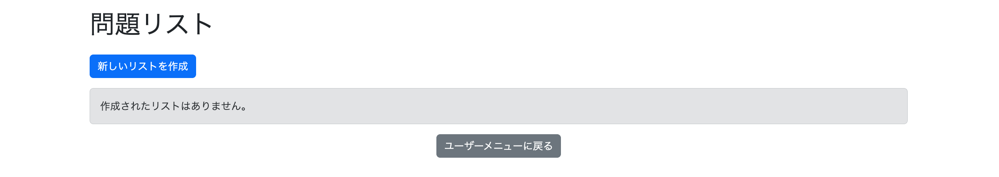

まだ問題リストを所有していない状態で「新しいリストを作成」を押すと、リスト追加用モーダルが表示される。

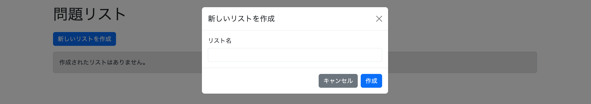

名前を入力して作成するとリストが新規作成される。

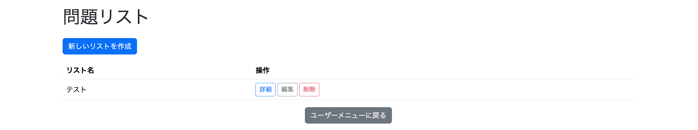

既存リストと同じ名前のリストを作成するとエラーになる。

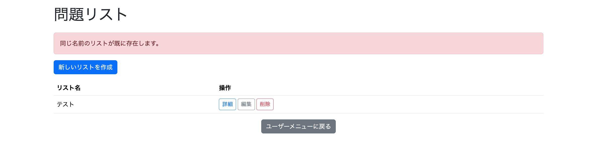

詳細を確認すると、まだ問題が登録されていない旨が表示される。

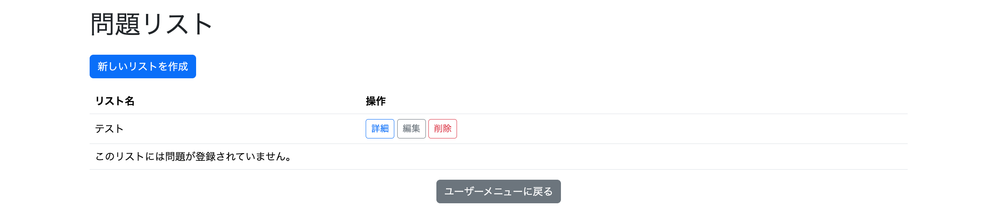

編集ボタンを押すとリスト名変更用モーダルが表示される。

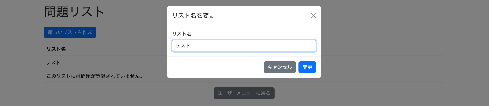

変更後のリスト名が反映される。

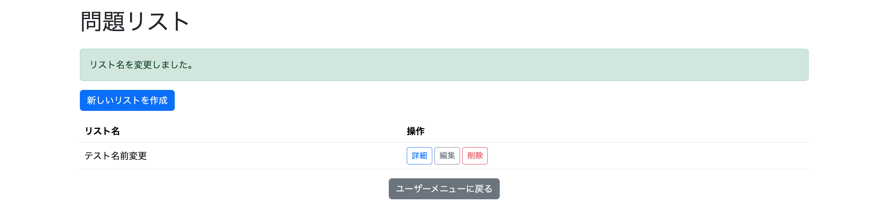

削除ボタンを押すと確認ダイアログが表示される。

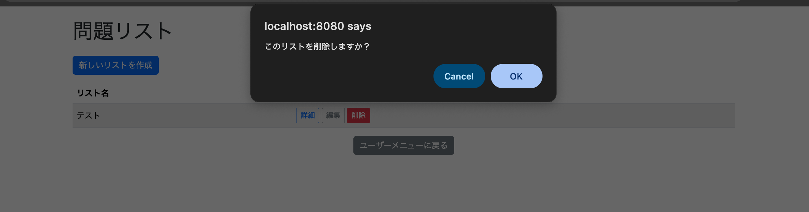

確認するとリストが削除される。

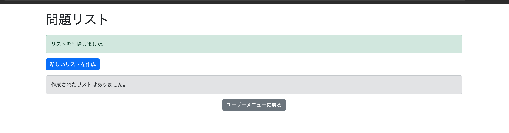

一般ユーザーは作成できるリスト数に上限がある。

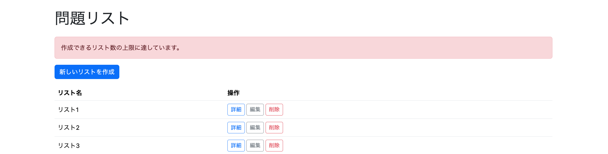

---

## この実装の限界

基本的なリスト操作はできるようになったが、問題を多数登録した状態で詳細を開くとデータが整理されていない。

動作確認のため、DBから直接50問を登録する。

```sql
INSERT INTO question_list_item (
    list_id,
    question_id,
    added_at
)
SELECT
    3,
    q.question_id,
    CURRENT_TIMESTAMP
FROM question q
ORDER BY RANDOM()
LIMIT 50;
```

詳細を開くと、取得したデータがそのまま表示される。

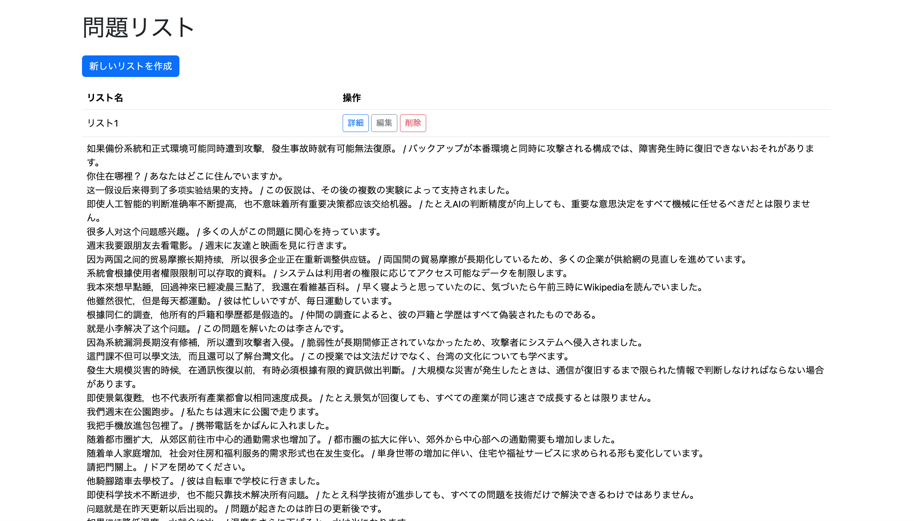

現在のAPIでは`Question` Entityを利用しているが、最終的に表示したいのは、

```text
中国語
日本語
難易度
理解度
お気に入り
生成元
発音情報
別解
構文
```

などである。

理解度は`StudyHistory`、お気に入りは`Favorite`に存在するため、`Question`だけでは情報が足りない。

そこでDTOを導入する。

---

# 問題リスト詳細表示のDTO化

```text
git commit -m "Implement question list detail view and interactions"
```

## QuestionListItemDto

```java
public interface QuestionListItemDto {

    Long getQuestionId();

    String getChineseText();

    String getJapaneseText();

    Difficulty getDifficulty();

    Evaluation getEvaluation();

    boolean isFavorite();

    boolean isAiGenerated();

    String getPinyin();

    String getZhuyin();

    String getAlternativeAnswer();

    String getAlternativeAnswerPinyin();

    String getAlternativeAnswerZhuyin();

    String getStructureName();
}
```

今回は一覧用・詳細用でDTOを分割せず、同じ`QuestionListItemDto`を利用する。

一覧では、

```text
chineseText
japaneseText
difficulty
evaluation
favorite
aiGenerated
```

を使用し、詳細モーダルでは、

```text
pinyin
zhuyin
alternativeAnswer
alternativeAnswerPinyin
alternativeAnswerZhuyin
structureName
```

も利用する。

---

## QuestionListItemRepository

複数のEntityから必要な情報を取得する。

```java
@Query(value = """
        SELECT
            q.question_id AS questionId,
            q.chinese_text AS chineseText,
            q.japanese_text AS japaneseText,
            q.difficulty AS difficulty,
            sh.evaluation AS evaluation,

            CASE
                WHEN f.question_id IS NOT NULL
                THEN TRUE
                ELSE FALSE
            END AS favorite,

            q.ai_generated AS aiGenerated,
            q.pinyin AS pinyin,
            q.zhuyin AS zhuyin,
            q.alternative_answer AS alternativeAnswer,
            q.alternative_answer_pinyin
                AS alternativeAnswerPinyin,
            q.alternative_answer_zhuyin
                AS alternativeAnswerZhuyin,
            s.name AS structureName

        FROM question_list_item qli

        JOIN question q
            ON qli.question_id = q.question_id

        JOIN structure s
            ON q.structure_id = s.structure_id

        LEFT JOIN study_history sh
            ON q.question_id = sh.question_id
            AND sh.user_id = :userId

        LEFT JOIN favorite f
            ON q.question_id = f.question_id
            AND f.user_id = :userId

        WHERE qli.list_id = :listId
        """,
        nativeQuery = true)
List<QuestionListItemDto> findQuestionListItems(
        Long listId,
        Long userId);
```

これにより、

```text
question_list_item
    ↓
question
    ↓
structure

+ study_history
+ favorite
```

から、問題リスト画面に必要な情報を1つのDTOとして取得できる。

---

## QuestionListItemService.getQuestionListItems()

戻り値を`List<Question>`から`List<QuestionListItemDto>`へ変更する。

```java
public List<QuestionListItemDto> getQuestionListItems(
        Users user,
        Long listId,
        Locale locale) {

    // ユーザーが所有するリストか確認
    questionListRepository
            .findByListIdAndUserId(
                    listId,
                    user.getId())
            .orElseThrow(
                    () -> new IllegalArgumentException(
                            messageSource.getMessage(
                                    "questionList.error.notFound",
                                    null,
                                    locale)));

    // DTOとして取得
    return questionListItemRepository
            .findQuestionListItems(
                    listId,
                    user.getId());
}
```

---

## QuestionListController.getUserQuestionListDetail()

Controller側もDTOを返すように変更する。

```java
@GetMapping("/user/question-list/detail")
@ResponseBody
public List<QuestionListItemDto>
        getUserQuestionListDetail(
                @AuthenticationPrincipal
                UserDetails loginUser,
                @RequestParam Long listId,
                Locale locale) {

    Users user =
            getLoginUser(loginUser);

    return questionListItemService
            .getQuestionListItems(
                    user,
                    listId,
                    locale);
}
```

これにより、問題リスト詳細用にEntityそのものをJSONへ変換する必要がなくなった。

---

## 問題リスト詳細画面の表示・操作機能の実装

`QuestionListItemDto`から取得した情報を利用し、問題リスト詳細をテーブル形式で表示する。

さらに、

```text
理解度変更
お気に入り登録・解除
問題詳細表示
問題リストから削除
```

を同じ画面から行えるようにする。

POST処理はJavaScriptの`fetch()`から行うため、CSRF情報をHTMLへ追加する。

```html
<meta name="_csrf"
      th:content="${_csrf.token}">

<meta name="_csrf_header"
      th:content="${_csrf.headerName}">
```

JavaScriptでは、

```javascript
const csrfToken =
    document.querySelector(
        'meta[name="_csrf"]'
    ).content;

const csrfHeader =
    document.querySelector(
        'meta[name="_csrf_header"]'
    ).content;
```

として取得する。

---

## messages.propertiesによる多言語対応

HTMLだけでなくJavaScriptから動的に生成する文言についても、`messages.properties`で管理する。

例えば、

```properties
questionList.detail.chinese=中国語
questionList.detail.japanese=日本語
questionList.detail.difficulty=難易度
questionList.detail.evaluation=理解度
questionList.detail.favorite=お気に入り
questionList.detail.source=生成元

questionList.detail.difficulty.beginner=初級
questionList.detail.difficulty.intermediate=中級
questionList.detail.difficulty.advanced=上級

questionList.detail.evaluation.unlearned=未学習
questionList.detail.evaluation.change=理解度を変更
questionList.detail.evaluation.hard=Hard
questionList.detail.evaluation.good=Good
questionList.detail.evaluation.easy=Easy

questionListItem.delete=削除
questionListItem.delete.confirm=この問題をリストから削除しますか？
questionListItem.delete.error=問題の削除に失敗しました。
```

を追加する。

外部JavaScriptではThymeleafの、

```text
#{questionList.detail.chinese}
```

を直接利用できない。

そのためHTML側に`data-*`としてメッセージを設定し、JavaScriptから取得する構成とする。

---

## 実行

リスト詳細がテーブル形式で表示される。

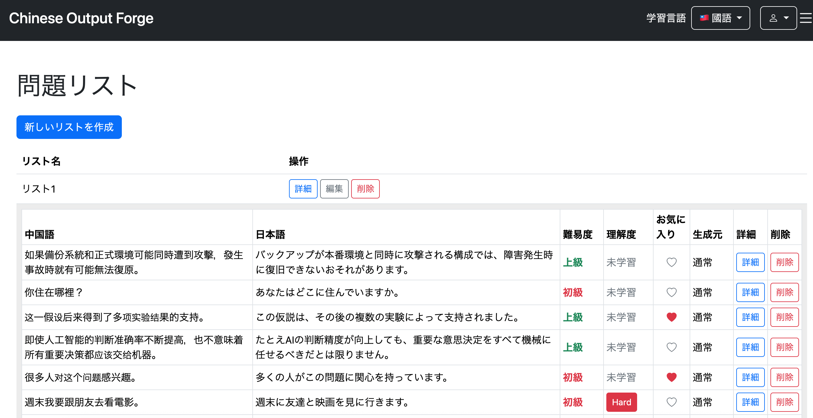

理解度を変更できる。

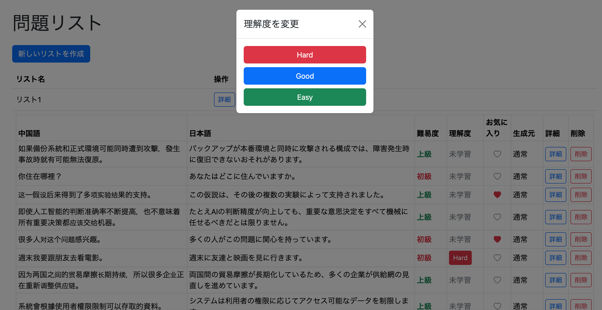

問題詳細を確認できる。

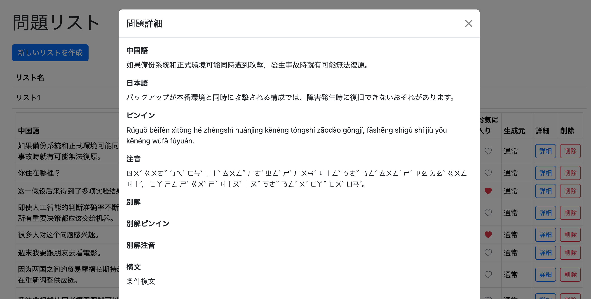

リストから問題を削除できる。

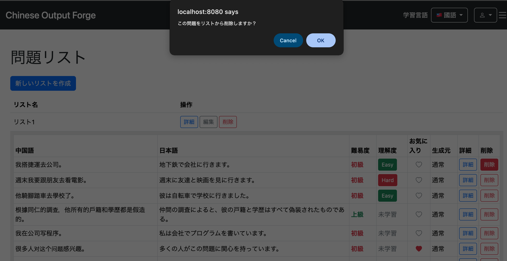

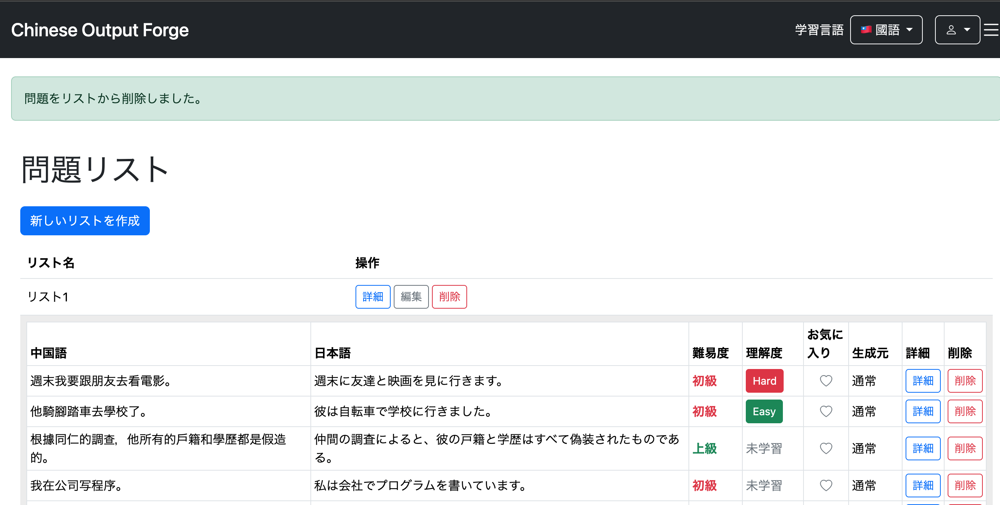

---

# 各トレーニングのquestion画面から問題をリストに追加できるようにする

```text
feat: add question list management to training question pages
```

これまでの実装ではリスト管理画面から問題を管理できるが、学習中に表示されている問題を直接リストへ追加することはできない。

そこで、

```text
通常学習
復習
AI生成学習
```

の各`question.html`から現在の問題をリストへ追加できるようにする。

## どんな動きにするか

```text
question.html
    │
    │ リストボタン
    ▼
┌───────────────────┐
│ リスト             │
│                   │
│ ☑ HSK6復習         │
│ ☐ 把構文           │
│ ☑ 苦手問題         │
│ ☐ 後で確認         │
│                   │
│ キャンセル   保存   │
└───────────────────┘
```

モーダルでは単純な「追加先」ではなく、**現在の問題がどのリストへ登録されているか**をチェック状態として表示する。

---

## QuestionListSelectionDto

```java
public interface QuestionListSelectionDto {

    Long getListId();

    String getListName();

    boolean getRegistered();
}
```

Repositoryではユーザーが所有するリストをすべて取得しつつ、現在の問題が登録されているかを判定する。

ここでは`INNER JOIN`にしてしまうと、問題が登録されていないリストが結果から消えてしまう。

そのため、ユーザー所有の全リストを残しつつ登録状態を判定できるようにする。

---

## チェック状態に合わせて登録状態を一括更新

モーダルから、

```text
questionId
selectedListIds
```

を送信する。

Service側では、

```text
未登録 + チェックあり
    → 追加

登録済み + チェックなし
    → 削除

登録済み + チェックあり
    → 変更なし

未登録 + チェックなし
    → 変更なし
```

として差分を更新する。

---

## /practice/question.html

お気に入りボタンの横へリストボタンを追加する。

```html
<button id="questionListButton"
        type="button"
        class="btn p-0 border-0 bg-transparent"
        th:data-question-id="${question.questionId}"
        data-bs-toggle="modal"
        data-bs-target="#questionListModal">

    <i class="bi bi-folder-plus fs-4"></i>

</button>
```

さらに、リスト選択用のBootstrap Modalを追加する。

---

## /practice/question.js

### リスト一覧を取得

```javascript
function loadQuestionLists() {

    const questionId =
        questionListButton.dataset.questionId;

    fetch(
        "/user/question-list/selection?questionId="
        + questionId
    )

    .then(response => response.json())

    .then(questionLists => {

        const selectionArea =
            document.getElementById(
                "questionListSelectionArea"
            );

        selectionArea.innerHTML = "";

        questionLists.forEach(questionList => {

            const div =
                document.createElement("div");

            div.classList.add(
                "form-check",
                "mb-2"
            );

            const checkbox =
                document.createElement("input");

            checkbox.type = "checkbox";

            checkbox.classList.add(
                "form-check-input",
                "question-list-checkbox"
            );

            checkbox.value =
                questionList.listId;

            checkbox.id =
                "questionList-" +
                questionList.listId;

            checkbox.checked =
                questionList.registered;

            const label =
                document.createElement("label");

            label.classList.add(
                "form-check-label"
            );

            label.htmlFor =
                checkbox.id;

            label.textContent =
                questionList.listName;

            div.appendChild(checkbox);
            div.appendChild(label);

            selectionArea.appendChild(div);
        });
    });
}
```

### チェック状態を保存

```javascript
const params =
    new URLSearchParams();

params.append(
    "questionId",
    questionId
);

checkedLists.forEach(checkbox => {

    params.append(
        "selectedListIds",
        checkbox.value
    );
});
```

更新APIへ送信する。

```javascript
fetch("/user/question-list/item/update", {

    method: "POST",

    headers: {

        "Content-Type":
            "application/x-www-form-urlencoded",

        [csrfHeader]:
            csrfToken
    },

    body:
        params.toString()
});
```

更新成功後はページ遷移せずモーダルだけを閉じる。

```javascript
const modalElement =
    document.getElementById(
        "questionListModal"
    );

const modal =
    bootstrap.Modal.getInstance(
        modalElement
    );

modal.hide();
```

---

## 実行

通常学習画面にリストボタンが表示される。

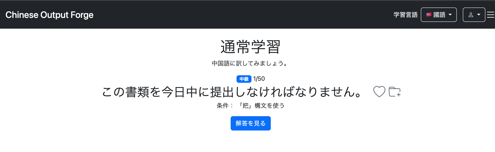

モーダルから追加先を選択できる。

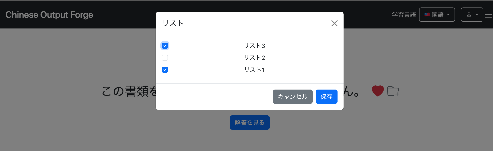

リスト1とリスト3へ登録する。

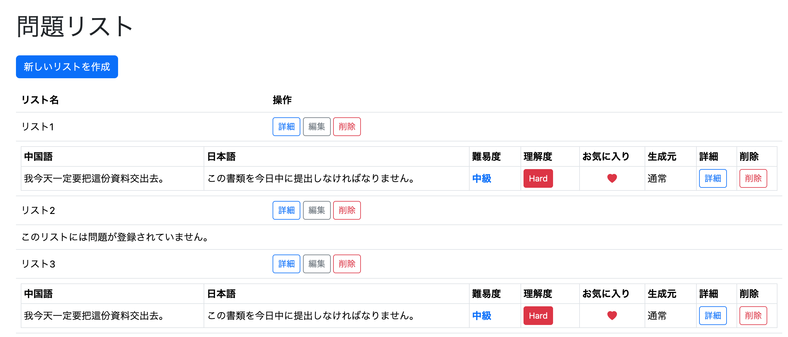

登録先をリスト1とリスト2へ変更する。

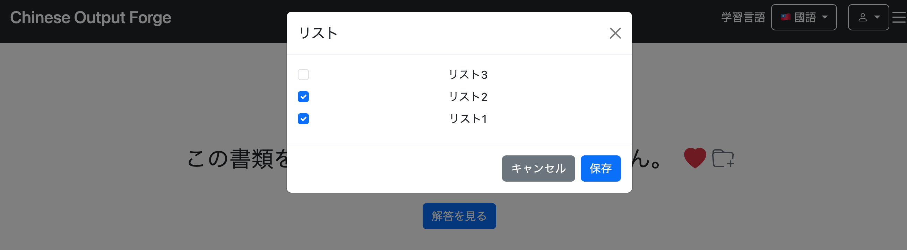

DB側でも登録状態が変更される。

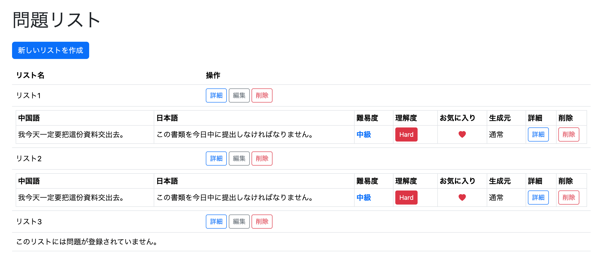

---

## 追加修正　questionのモーダルからリストを新規に作れるようにする

既存リストへの追加だけでなく、question画面から新しいリスト自体を作成できるようにする。

通常の、

```text
POST /user/question-list/create
```

は作成後にリスト管理画面へリダイレクトする。

question画面ではページ遷移したくないため、

```java
@PostMapping("/user/question-list/create-modal")
@ResponseBody
public void postUserQuestionListCreateModal(
        @AuthenticationPrincipal
        UserDetails loginUser,
        @RequestParam String listName,
        Locale locale) {

    Users user =
            getLoginUser(loginUser);

    questionListService
            .createQuestionList(
                    user,
                    listName,
                    locale);
}
```

を追加する。

### JavaScript

```javascript
const questionListCreateButton =
    document.getElementById(
        "questionListCreateButton"
    );

if (questionListCreateButton) {

    questionListCreateButton
        .addEventListener(
            "click",
            function () {

                const newQuestionListName =
                    document.getElementById(
                        "newQuestionListName"
                    );

                const listName =
                    newQuestionListName
                        .value
                        .trim();

                if (listName === "") {
                    return;
                }

                fetch(
                    "/user/question-list/create-modal",
                    {
                        method: "POST",

                        headers: {
                            "Content-Type":
                                "application/x-www-form-urlencoded",

                            [csrfHeader]:
                                csrfToken
                        },

                        body:
                            "listName=" +
                            encodeURIComponent(
                                listName
                            )
                    }
                )

                .then(response => {

                    if (!response.ok) {
                        throw new Error(
                            "リストの作成に失敗しました"
                        );
                    }

                    newQuestionListName.value =
                        "";

                    return loadQuestionLists();
                });
            }
        );
}
```

作成後に`questionListButton.click()`を実行すると、Bootstrap Modalの開閉処理まで再実行されてしまう。

そこで、

```javascript
function loadQuestionLists() {
    ...
}
```

として一覧取得処理を独立させ、作成後は、

```javascript
return loadQuestionLists();
```

だけを呼び出す。

これによりモーダルを開いたまま一覧だけを再取得できる。

## 実行

モーダル内に新規リスト作成欄が表示される。

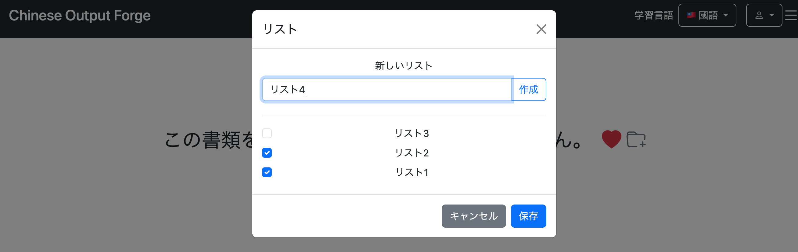

作成するとモーダルを閉じずに新しいリストが追加される。

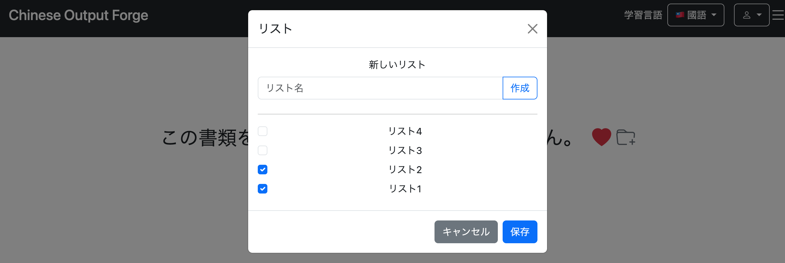

---

### /review/question.html

通常学習と同じリストボタン・モーダルを追加する。

### /ai-practice/question.html

AI生成学習にも同じリスト操作を追加する。

ただし、生成直後のAI問題はまだDBへ保存されておらず`questionId`を持っていない。

そのため保存前はリストボタンを表示せず、AI生成問題を保存した後に利用可能にする。

### /ai-practice/question.js

AI生成問題保存後に返された`questionId`を、

```javascript
questionListButton.dataset.questionId =
    questionId;
```

にも設定する。

これにより、保存されたAI生成問題を通常問題と同じようにリストへ登録できる。

## 実行

復習画面にもリストボタンが表示される。


モーダルからリストへ登録できる。

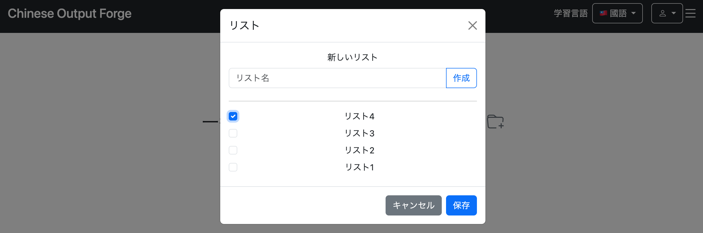

AI生成学習では保存前はリストボタンを表示しない。

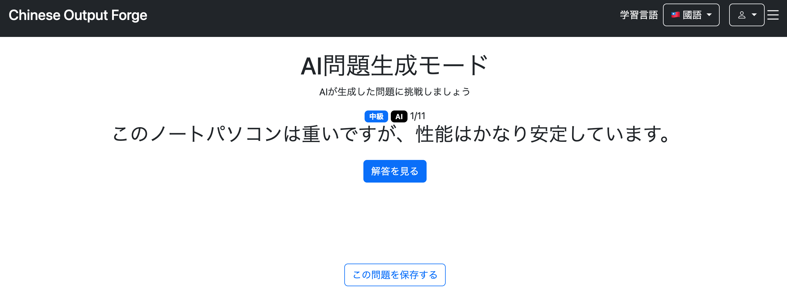

問題を保存するとリストボタンが表示される。

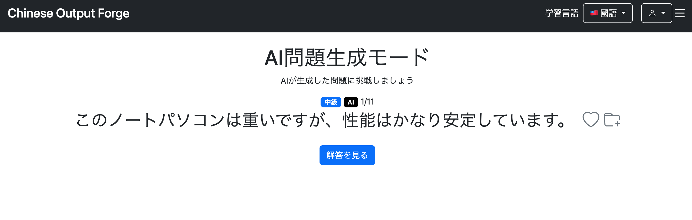

AI生成問題もリストへ登録できる。

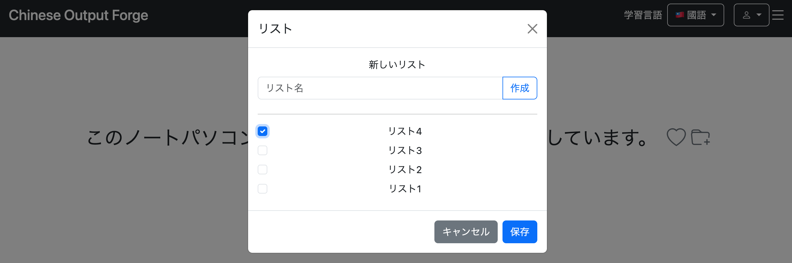

リスト管理画面から登録結果を確認できる。

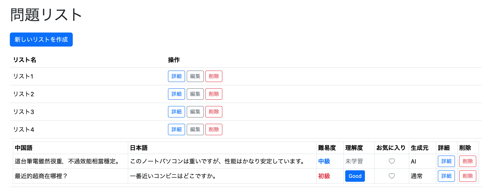

---

## ファイル名の整理

リスト機能実装によってJavaScriptの役割が分かりにくくなった。

当初は、

```text
/static/js/

├── practice/
│   └── question.js
│
├── practice.js
│
└── ai-practice/
    └── question.js
```

となっていた。

特に`/practice.js`は実質的にAI生成学習で利用しているにもかかわらず、名前から用途を判断できない。

また、

```text
ai-practice/question.html
    ↓
practice.js
ai-practice/question.js
```

と1画面の処理が2ファイルへ分散している。

そこで、

```text
/static/js/

├── practice/
│   └── question.js
│       → 通常学習・復習
│
└── ai-practice/
    └── question.js
        → AI生成学習
```

へ整理する。

`/practice.js`の処理を`/ai-practice/question.js`へ統合し、`/practice.js`は削除する。

---

# 追加修正 - リストの表示順を更新日時の降順で取得するようにする

```text
git commit -m "fix: sort lists by updated date in descending order"
```

現在は`findByUserId()`を利用しているため、リストの表示順が明示されていない。

そこでRepositoryを、

```java
List<QuestionList>
    findByUserIdOrderByUpdatedAtDesc(
        Long userId
    );
```

のように変更し、最近更新されたリストから表示する。

---

# 追加修正 − 問題追加・削除時もリストをupdated扱いにする

```text
git commit -m "fix: update list timestamp when adding or removing questions"
```

`@UpdateTimestamp`は`QuestionList`自体がUPDATEされた場合に更新される。

そのため、

```text
question_list_itemへ問題追加
question_list_itemから問題削除
```

だけでは`question_list.updated_at`は更新されない。

問題の追加・削除も「そのリストを更新した」とみなしたいため、`QuestionListItemService`から対象リストの`updatedAt`を更新する。

## 実行

長期間更新していないリスト2は後方に表示されている。

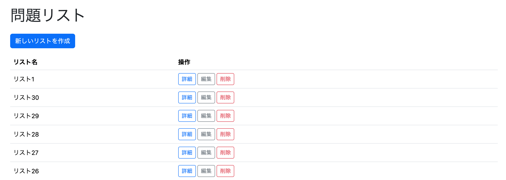

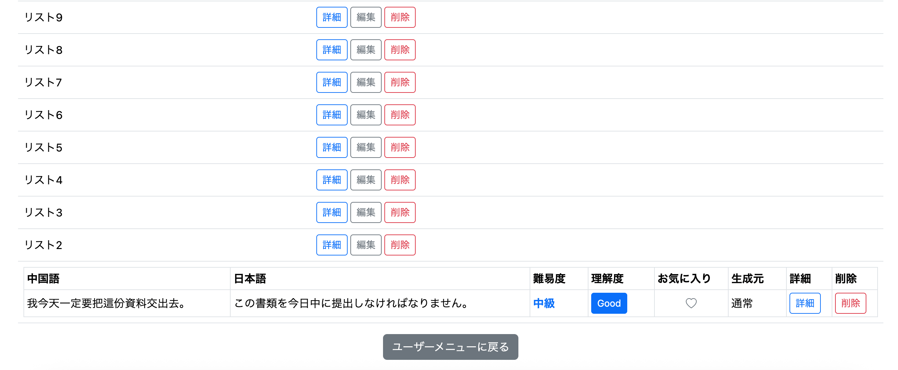

リスト2へ問題を追加する。


リスト管理画面へ戻ると、更新されたリスト2が先頭に表示される。

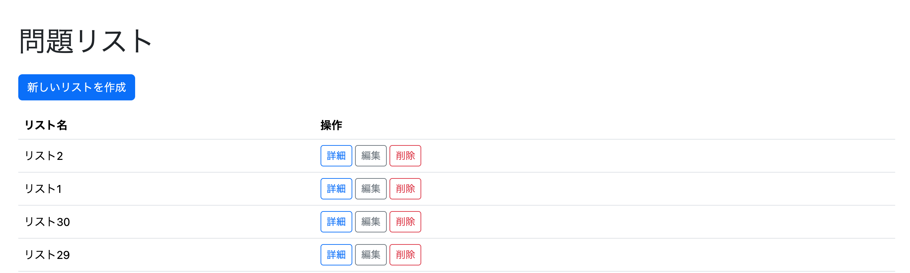

リスト3から問題を削除する。

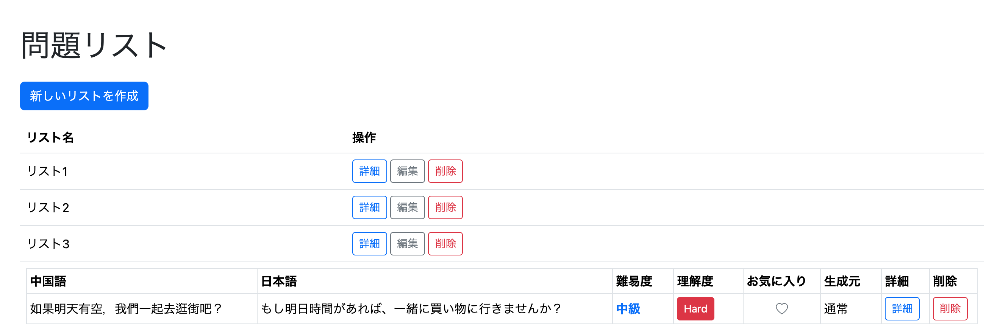

削除直後は画面上の並びは変わらない。

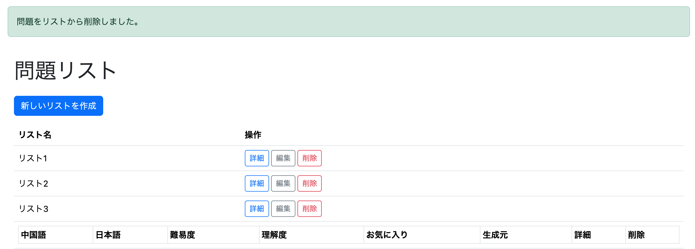

ページを再読み込みすると更新日時順に並び替えられる。

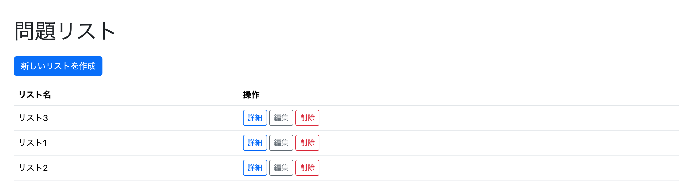

---

# 追加修正 - リスト追加モーダルのリストの表示順も直す

```text
git commit -m "fix: sort modal lists by updated date in descending order"
```

リスト管理画面の並び順は更新日時順になったが、question画面のリスト選択モーダルではまだ古い順序のままである。

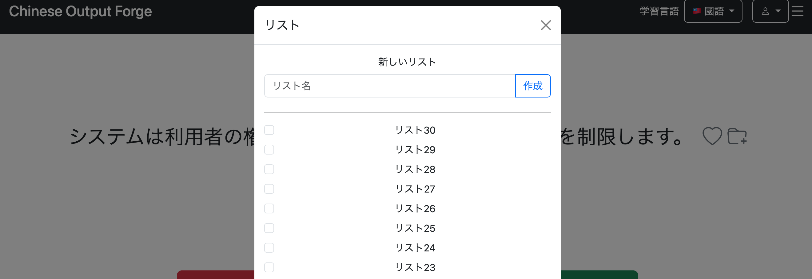

モーダル用のリスト取得についても、

```text
updated_at DESC
```

で取得するよう修正する。

## 実行

モーダル内でも更新日時の降順で表示されるようになった。

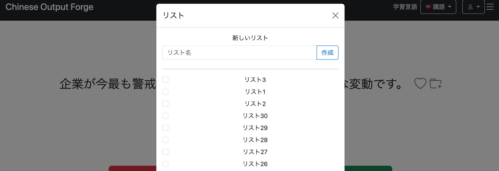

---

# 追加修正 - messages.propertiesへの追加①

```text
git commit -m "fix: add missing confirmation message for list deletion"
```

リストそのものを削除する際の確認メッセージが`messages.properties`へ設定されていなかった。

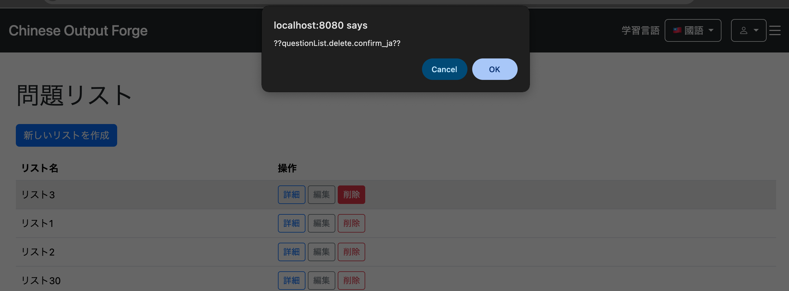

## messages.properties

```properties
questionList.delete.confirm=このリストを削除しますか？
```

簡体字・繁体字についても対応する。

```properties
questionList.delete.confirm=确定要删除这个列表吗？
```

```properties
questionList.delete.confirm=確定要刪除這個清單嗎？
```

## 実行

リスト削除時の確認メッセージが表示されるようになった。

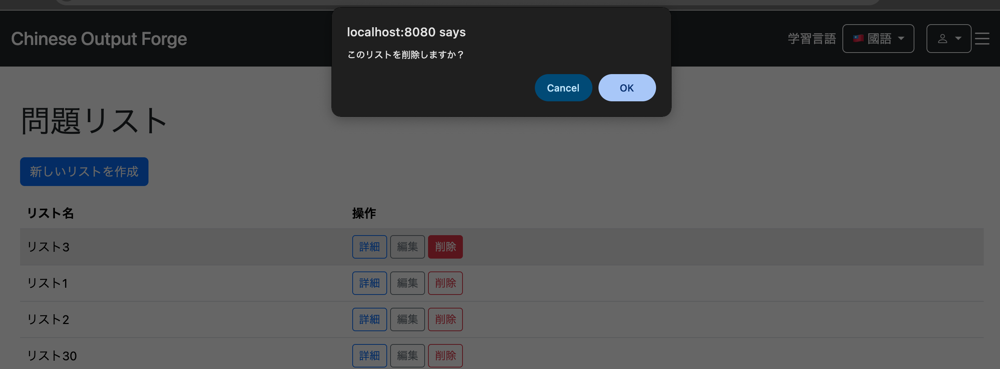

---

# 追加修正 - messages.propertiesへの追加②

```text
git commit -m "fix: localize question list modal messages"
```

question画面のリスト追加モーダルについて、表示言語を変更しても日本語のままになっている。

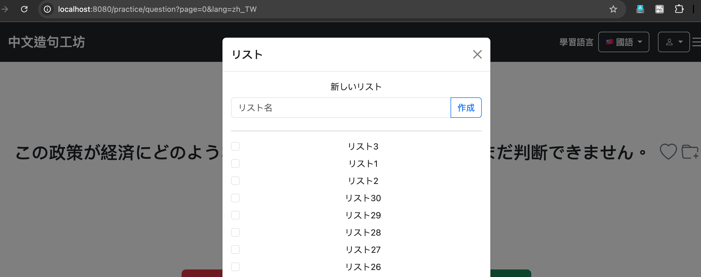

## 原因

モーダルの文言をHTMLへ直接記述していた。

例えば、

```html
<h5 class="modal-title">
    リスト
</h5>

<label for="newQuestionListName"
       class="form-label">
    新しいリスト
</label>

<input type="text"
       id="newQuestionListName"
       class="form-control"
       placeholder="リスト名">

<button type="button"
        id="questionListCreateButton"
        class="btn btn-outline-primary">
    作成
</button>
```

となっている。

## html

通常学習・復習・AI生成学習の3画面で同じメッセージキーを使用する。

```html
<h5 class="modal-title"
    th:text="#{questionList.modal.title}">
    リスト
</h5>

<label for="newQuestionListName"
       class="form-label"
       th:text="#{questionList.modal.newList}">
    新しいリスト
</label>

<input type="text"
       id="newQuestionListName"
       class="form-control"
       th:placeholder="#{questionList.modal.listName}">

<button type="button"
        id="questionListCreateButton"
        class="btn btn-outline-primary"
        th:text="#{questionList.modal.create}">
    作成
</button>
```

## messages.properties

```properties
# 問題リスト選択モーダル
questionList.modal.title=リスト
questionList.modal.newList=新しいリスト
questionList.modal.listName=リスト名
questionList.modal.create=作成
questionList.modal.cancel=キャンセル
questionList.modal.save=保存
```

`messages_zh_CN.properties`と`messages_zh_TW.properties`にも同じキーを追加する。

## 実行

表示言語に合わせてリスト選択モーダルの文言も切り替わるようになった。

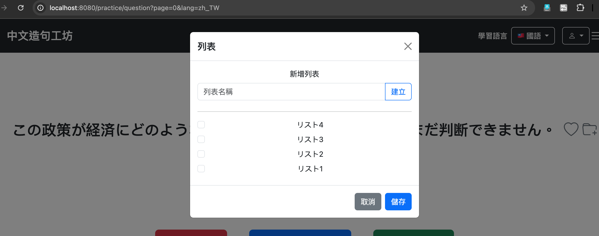

---

# このチャプターはここまで

今回の実装では、単純な「お気に入り」よりも柔軟に問題を整理できる問題リスト機能を追加した。

DBでは、

```text
question_list
question_list_item
```

を追加し、1ユーザーが複数のリストを所有でき、1つの問題を複数のリストへ登録できる構成とした。

バックエンドでは、

```text
QuestionList
QuestionListItem
QuestionListItemKey

QuestionListRepository
QuestionListItemRepository

QuestionListService
QuestionListItemService

QuestionListController
QuestionListItemController
```

を中心としてリストの作成・編集・削除、問題の追加・削除を実装した。

また、リスト詳細については`Question` Entityをそのまま返す初期実装から`QuestionListItemDto`へ変更し、

```text
question
structure
study_history
favorite
```

をJOINして、画面で必要な情報をまとめて取得する構成へ変更した。

フロントエンドではユーザーメニューのリスト管理画面だけでなく、

```text
通常学習
復習
AI生成学習
```

の各question画面からリストを操作できるようにした。

さらに、

```text
モーダルから新規リスト作成
リストの更新日時順表示
問題追加・削除時のupdated_at更新
モーダル内の表示順修正
削除確認メッセージの追加
モーダルの多言語対応
JavaScript構成の整理
```

まで追加修正を行った。

これにより、学習中に画面を離れることなく問題を任意のリストへ整理し、そのリストをユーザーメニューから管理できる基本機能が完成した。
