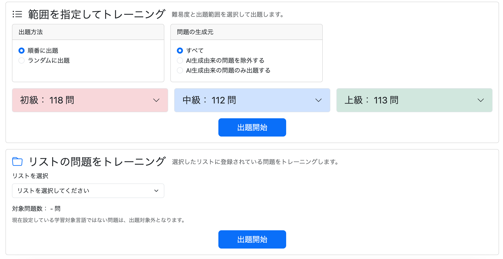
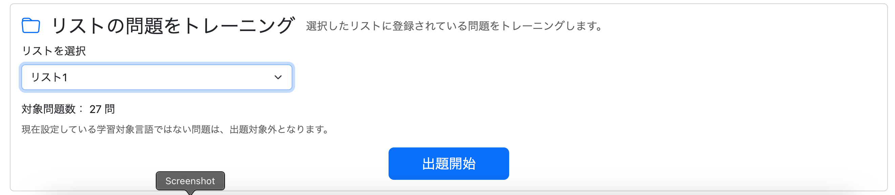
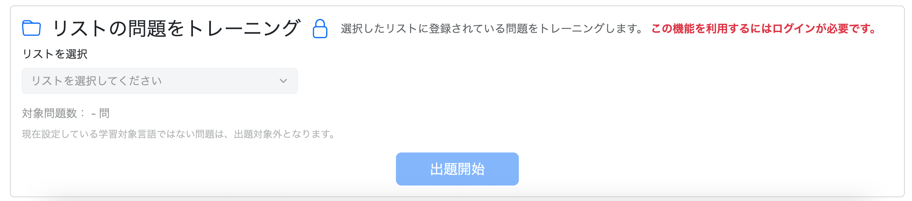
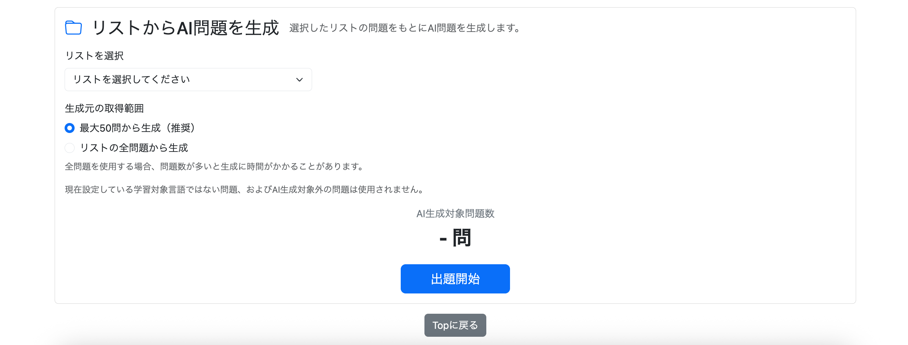
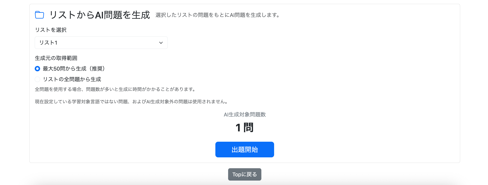
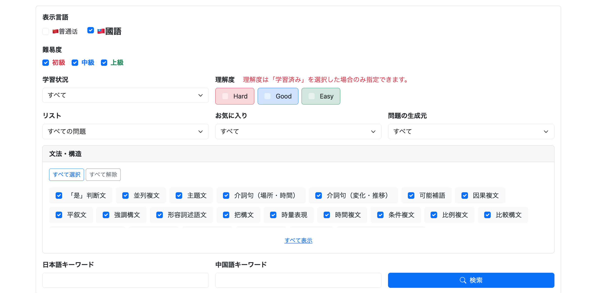
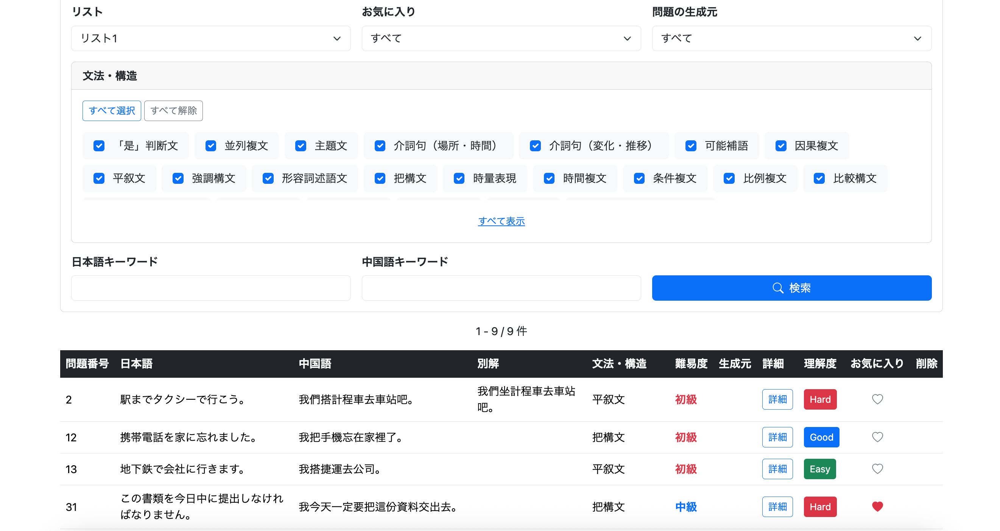
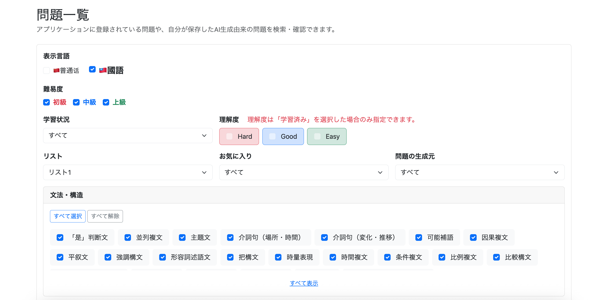
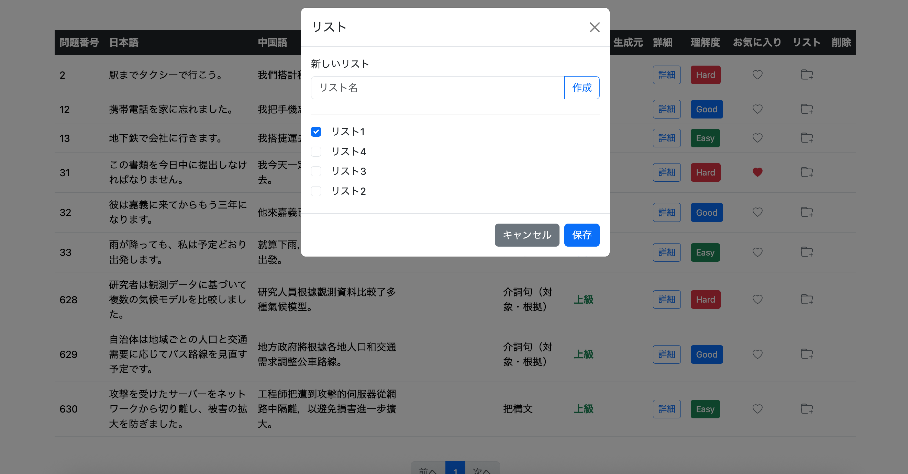
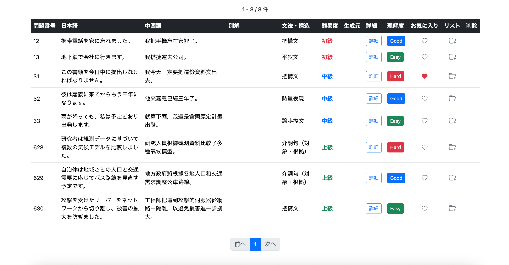

# 030 リスト機能その2

# 概要

前チャプターでは、ユーザーが問題を任意のリストにまとめて管理するための基本的なリスト機能を実装した。

具体的には、

* リストの新規作成・編集・削除
* リストに登録されている問題の確認
* リストからの問題削除
* 各種トレーニングのquestion画面からリストへの問題追加・削除
* question画面のモーダルからのリスト新規作成
* `updated_at`を利用したリスト表示順の調整

までを実装した。

本チャプターでは、作成したリストを単に管理するだけではなく、既存の検索・学習機能へ統合する。

主な実装内容は以下の3点。

1. 各種トレーニングメニューで、リストを指定して出題対象を絞り込む
2. ユーザーメニューの問題一覧画面で、リストを検索条件として利用する
3. ユーザーメニューの問題一覧画面から、問題のリスト登録状態を直接変更する

---

# 1. 各種トレーニングメニューで、リストを指定して出題対象を絞り込めるようにする

リストによる出題は、

* 通常学習
* AI生成学習

を対象とする。

復習については、通常学習ですでにリスト単位でトレーニングできるため、今回は対象外とした。

また、既存検索へ単純に`listId`を追加するのではなく、

```text
通常検索
    ↓
既存条件から問題セットを取得
    ↓
既存トレーニング処理

リスト検索
    ↓
listIdから問題セットを取得
    ↓
既存トレーニング処理
```

というように、**問題セットを取得する入口だけを分離し、その後の処理は既存実装を流用する**方針とした。

---

## 通常学習

既存の通常学習では、

* 難易度
* 出題範囲
* 生成元

などを利用して問題を検索している。

リストはすでにユーザー自身が選別した問題集合なので、これらの検索条件へさらに`listId`を組み込むのではなく、

```text
リストの問題をトレーニング
```

という独立したメニューを追加した。

リストは1つだけ選択する。

---

## 通常学習の検索処理

リスト指定時には、

```java
Long listId
```

を受け取り、

```sql
FROM question q

JOIN question_list_item qli
    ON q.question_id = qli.question_id

JOIN question_list ql
    ON qli.list_id = ql.list_id

WHERE qli.list_id = :listId
  AND ql.user_id = :userId
```

として対象問題を取得する。

`question_list`までJOINすることで、

```text
listId
+
userId
```

を同時に条件とし、指定されたリストがログインユーザー自身の所有するリストであることを保証する。

---

## 実装方針

今回の実装では、

* 通常学習とAI生成学習のみリスト指定に対応
* 復習には追加しない
* 通常条件検索とリスト検索は別の入口にする
* リストは1つだけ指定する
* Repositoryにリスト専用クエリを追加する
* `listId`だけでなく`userId`も条件にする
* 問題セット取得後の処理は既存処理を流用する

という構成とした。

---

## 実装 - 通常学習

```text
git commit -m "feat: add list-based practice mode"
```

### QuestionRepository - 指定したリストに登録されている問題数を取得するメソッド

```java
// 指定したリストに登録されている問題数を取得
@Query(value = """
        SELECT COUNT(*)
        FROM question q
        JOIN question_list_item qli
          ON q.question_id = qli.question_id
        JOIN question_list ql
          ON qli.list_id = ql.list_id
        WHERE qli.list_id = :listId
          AND ql.user_id = :userId
          AND q.language_variant = :languageVariant
        """, nativeQuery = true)
long countPracticeQuestionsByList(
        @Param("userId") Long userId,
        @Param("listId") Long listId,
        @Param("languageVariant") String languageVariant
);
```

`question_list_item`だけではリストの所有者を判定できないため、

```sql
JOIN question_list ql
  ON qli.list_id = ql.list_id
```

を追加し、

```sql
AND ql.user_id = :userId
```

で所有者を確認する。

また、リストにはMAINLANDとTAIWANの問題を混在させることができるが、現在の学習対象言語と異なる問題を突然出題するのはアプリの言語設定と矛盾する。

そのため、

```sql
AND q.language_variant = :languageVariant
```

も条件として残した。

---

### QuestionRepository - 指定したリストに登録されている問題を取得するメソッド

```java
// 指定したリストに登録されている問題を取得
@Query(value = """
        SELECT q.*
        FROM question q
        JOIN question_list_item qli
          ON q.question_id = qli.question_id
        JOIN question_list ql
          ON qli.list_id = ql.list_id
        WHERE qli.list_id = :listId
          AND ql.user_id = :userId
          AND q.language_variant = :languageVariant
        ORDER BY q.question_id
        """, nativeQuery = true)
List<Question> findPracticeQuestionsByList(
        @Param("userId") Long userId,
        @Param("listId") Long listId,
        @Param("languageVariant") String languageVariant
);
```

---

### PracticeService

Repositoryを呼び出すServiceを追加した。

```java
// 指定したリストに登録されている問題数を取得
public long countPracticeQuestionsByList(
        Long userId,
        Long listId,
        LanguageVariant languageVariant) {

    return questionRepository.countPracticeQuestionsByList(
            userId,
            listId,
            languageVariant.name());
}

// 指定したリストに登録されている問題を取得
public List<Question> getPracticeQuestionsByList(
        Long userId,
        Long listId,
        LanguageVariant languageVariant) {

    return questionRepository.findPracticeQuestionsByList(
            userId,
            listId,
            languageVariant.name());
}
```

今回は問題数という単一の値だけを返せばよいため、件数取得専用DTOは作らず`long`をそのまま返す。

---

### PracticeController - 指定したリストの問題数と問題を取得するメソッド

リストはユーザーが画面上で選択するため、メニュー表示時に件数を固定で取得するのではなく、選択されたタイミングで件数を取得するAPIを追加した。

```java
// 指定したリストの問題数を取得
@GetMapping("/practice/menu/count/by-list")
@ResponseBody
public long getPracticeCountByList(
        @AuthenticationPrincipal UserDetails loginUser,
        HttpSession session,
        @RequestParam Long listId) {

    Users user =
            getLoginUser(loginUser);

    LanguageVariant languageVariant =
            getLanguageVariant(session);

    return practiceService.countPracticeQuestionsByList(
            user.getId(),
            listId,
            languageVariant);
}
```

トレーニング開始についても既存の`/practice/start`へ統合せず、新しい入口を作成した。

```java
@PreAuthorize("isAuthenticated()")
@GetMapping("/practice/list/start")
public String getPracticeListStart(
        HttpSession session,
        @AuthenticationPrincipal UserDetails loginUser,
        @RequestParam Long listId) {

    clearPracticeSession(session);

    LanguageVariant languageVariant =
            getLanguageVariant(session);

    Users user =
            getLoginUser(loginUser);

    List<Question> questions =
            practiceService.getPracticeQuestionsByList(
                    user.getId(),
                    listId,
                    languageVariant);

    if (questions.isEmpty()) {
        return "redirect:/practice/menu";
    }

    session.setAttribute(
            "practiceQuestions",
            questions);

    session.setAttribute(
            "practiceCurrentPage",
            0);

    return "redirect:/practice/question?page=0";
}
```

入口は最終的に、

```text
/practice/start
    → 通常条件から出題

/practice/new/start
    → 未学習問題から出題

/practice/list/start
    → 指定したリストから出題
```

という構成になった。

---

### PracticeController - getPracticeMenuの修正

ログインユーザーが所有するリストを取得し、Modelへ追加する。

```java
Long userId = null;

if (loginUser != null) {

    Users user =
            getLoginUser(loginUser);

    userId =
            user.getId();

    List<QuestionList> questionLists =
            questionListService
                    .getQuestionLists(user);

    model.addAttribute(
            "questionLists",
            questionLists);
}
```

---

### /practice/menu.html

リスト選択用フォームを追加。

```html
<form th:action="@{/practice/list/start}"
      method="get">

    <select id="practiceQuestionList"
            class="form-select"
            name="listId"
            required>

        <option value=""
                selected
                th:text="#{practice.menu.list.selectPlaceholder}">
            リストを選択してください
        </option>

        <option th:each="questionList : ${questionLists}"
                th:value="${questionList.listId}"
                th:text="${questionList.listName}">
        </option>

    </select>

    <span id="practiceListQuestionCount">
        -
    </span>

    <button type="submit"
            class="btn btn-primary btn-lg px-5"
            th:text="#{practice.menu.start}">
        出題開始
    </button>

</form>
```

ログインユーザーは操作可能なフォームを表示する。

ゲストユーザーには機能自体の存在は表示するが、リスト選択と開始ボタンを`disabled`にする。

---

### practice/menu.js

リスト選択時に問題数を動的に取得する。

```javascript
const practiceQuestionList =
    document.getElementById(
        "practiceQuestionList"
    );

const practiceListQuestionCount =
    document.getElementById(
        "practiceListQuestionCount"
    );

if (practiceQuestionList) {

    practiceQuestionList.addEventListener(
        "change",
        async () => {

            const listId =
                practiceQuestionList.value;

            if (!listId) {

                practiceListQuestionCount
                    .textContent = "-";

                return;
            }

            const response =
                await fetch(
                    `/practice/menu/count/by-list?listId=${listId}`
                );

            const count =
                await response.json();

            practiceListQuestionCount
                .textContent = count;
        }
    );
}
```

ゲスト画面には`practiceQuestionList`が存在しないため、

```javascript
if (practiceQuestionList) {
```

で存在確認を行う。

---

### messages.properties

日本語・簡体字・繁体字へリストトレーニング用文言を追加した。

```properties
practice.menu.list.title=リストの問題をトレーニング
practice.menu.list.description=選択したリストに登録されている問題をトレーニングします。
practice.menu.list.select=リストを選択
practice.menu.list.selectPlaceholder=リストを選択してください
practice.menu.list.questionCount=対象問題数：
practice.menu.list.languageNotice=現在設定している学習対象言語ではない問題は、出題対象外となります。
practice.menu.list.loginRequired=この機能を利用するにはログインが必要です。
```

---

## 実行

ログイン状態で通常学習メニューを開くと、「リストの問題をトレーニング」が追加された。



リストを選択すると、現在の学習対象言語に一致する対象問題数が表示される。



出題開始後は既存のquestion画面を利用して通常どおりトレーニングできる。


非ログイン状態ではリストトレーニングを操作できない。



---

## 実装 - AI生成学習モード

```text
git commit -m "feat: add list-based AI practice generation"
```

### 実装の前に① - リストを指定する場合は「学習済み」という条件を外してよい

既存AI生成では、生成元を学習済み問題に限定している。

```text
全問題
↓
学習済み問題
↓
難易度・理解度・構文・お気に入り等
↓
AI生成元
```

しかしリスト検索では、ユーザー自身が明示的に問題をリストへ登録している。

そのため、

```text
ユーザー指定リスト
↓
リスト内の問題
↓
AI生成可能な問題
↓
AI生成元
```

とし、`study_history`は条件にしない。

必要な条件は、

```sql
WHERE qli.list_id = :listId
  AND ql.user_id = :userId
  AND q.language_variant = :languageVariant
  AND q.allow_ai_variation = true
```

とした。

---

### 実装の前に② - リストを指定する場合は最大件数取得と50件取得で選べるようにする

リスト内の対象問題について、

```text
最大50問から生成（推奨）
→ ランダムに最大50問

リストの全問題から生成
→ 対象問題を全件利用
```

の2種類を選択可能にした。

Repositoryでは、

```java
countAiGenerationSourceQuestionsByList()
findAiGenerationSourceQuestionsByList()
findAiGenerationSourceQuestionsByListLimit50()
```

の3メソッドを用意する。

---

### QuestionRepository

```java
@Query(value = """
        SELECT COUNT(*)
        FROM question q
        JOIN question_list_item qli
          ON q.question_id = qli.question_id
        JOIN question_list ql
          ON qli.list_id = ql.list_id
        WHERE qli.list_id = :listId
          AND ql.user_id = :userId
          AND q.language_variant = :languageVariant
          AND q.allow_ai_variation = true
        """, nativeQuery = true)
long countAiGenerationSourceQuestionsByList(
        @Param("userId") Long userId,
        @Param("listId") Long listId,
        @Param("languageVariant") String languageVariant
);
```

全件取得。

```java
@Query(value = """
        SELECT q.*
        FROM question q
        JOIN question_list_item qli
          ON q.question_id = qli.question_id
        JOIN question_list ql
          ON qli.list_id = ql.list_id
        WHERE qli.list_id = :listId
          AND ql.user_id = :userId
          AND q.language_variant = :languageVariant
          AND q.allow_ai_variation = true
        ORDER BY q.question_id
        """, nativeQuery = true)
List<Question> findAiGenerationSourceQuestionsByList(
        @Param("userId") Long userId,
        @Param("listId") Long listId,
        @Param("languageVariant") String languageVariant
);
```

最大50件取得。

```java
@Query(value = """
        SELECT q.*
        FROM question q
        JOIN question_list_item qli
          ON q.question_id = qli.question_id
        JOIN question_list ql
          ON qli.list_id = ql.list_id
        WHERE qli.list_id = :listId
          AND ql.user_id = :userId
          AND q.language_variant = :languageVariant
          AND q.allow_ai_variation = true
        ORDER BY RANDOM()
        LIMIT 50
        """, nativeQuery = true)
List<Question> findAiGenerationSourceQuestionsByListLimit50(
        @Param("userId") Long userId,
        @Param("listId") Long listId,
        @Param("languageVariant") String languageVariant
);
```

---

### AiPracticeService

件数・全件・最大50件それぞれのRepository呼び出しを追加した。

既存の曖昧な、

```java
getQuestion()
```

についても、

```java
getAiGenerationSourceQuestions()
```

へ改名した。

---

### AiPracticeController

リスト選択時の対象問題数を取得するAPIを追加。

```java
@GetMapping("/ai-practice/count/by-list")
@ResponseBody
public long getAiPracticeCountByList(
        @AuthenticationPrincipal UserDetails loginUser,
        @RequestParam Long listId,
        HttpSession session) {

    Users user =
            getLoginUser(loginUser);

    LanguageVariant languageVariant =
            getLanguageVariant(session);

    return aiPracticeService
            .countAiGenerationSourceQuestionsByList(
                    user.getId(),
                    listId,
                    languageVariant);
}
```

リストからAI生成学習を開始する入口も独立させた。

```java
@GetMapping("/ai-practice/list/start")
public String getAiPracticeListStart(
        HttpSession session,
        @AuthenticationPrincipal UserDetails loginUser,
        @RequestParam Long listId,
        @RequestParam boolean limit50,
        Locale locale) {

    clearAiPracticeSession(session);

    LanguageVariant languageVariant =
            getLanguageVariant(session);

    Users user =
            getLoginUser(loginUser);

    List<Question> sourceQuestions;

    if (limit50) {

        sourceQuestions =
                aiPracticeService
                        .getAiGenerationSourceQuestionsByListLimit50(
                                user.getId(),
                                listId,
                                languageVariant);

    } else {

        sourceQuestions =
                aiPracticeService
                        .getAiGenerationSourceQuestionsByList(
                                user.getId(),
                                listId,
                                languageVariant);
    }

    if (sourceQuestions.isEmpty()) {
        return "redirect:/ai-practice/menu";
    }

    List<AiGeneratedQuestionDto> aiPracticeQuestions =
            aiPracticeService.generateQuestions(
                    user,
                    sourceQuestions,
                    languageVariant,
                    locale);

    session.setAttribute(
            "aiPracticeQuestions",
            aiPracticeQuestions);

    session.setAttribute(
            "aiPracticeQuestionsCurrentPage",
            0);

    return "redirect:/ai-practice/question?page=0";
}
```

問題セットを取得した後は既存の、

```text
Question
↓
AiGenerationSourceDto
↓
プロンプト作成
↓
AI API
↓
AiGeneratedQuestionDto
```

という処理をそのまま利用する。

---

### /ai-practice/menu.html

通常の条件検索とは別フォームとして、

```html
<form th:action="@{/ai-practice/list/start}"
      method="get">
```

を追加。

ユーザー所有リストを選択し、

```html
<input type="radio"
       name="limit50"
       value="true"
       checked>
```

または、

```html
<input type="radio"
       name="limit50"
       value="false">
```

によって、最大50件／全件を切り替える。

---

### /ai-practice/menu.js

既存の通常検索用`updateCount()`とは分離して、リスト用の件数取得を追加した。

```javascript
const aiPracticeQuestionList =
    document.getElementById(
        "aiPracticeQuestionList"
    );

const aiPracticeListQuestionCount =
    document.getElementById(
        "aiPracticeListQuestionCount"
    );

if (aiPracticeQuestionList) {

    aiPracticeQuestionList.addEventListener(
        "change",
        async () => {

            const listId =
                aiPracticeQuestionList.value;

            if (!listId) {

                aiPracticeListQuestionCount
                    .textContent = "-";

                return;
            }

            const response =
                await fetch(
                    `/ai-practice/count/by-list?listId=${listId}`
                );

            const count =
                await response.text();

            aiPracticeListQuestionCount
                .textContent = count;
        }
    );
}
```

---

### messages.properties

リストからAI生成するための文言を日本語・簡体字・繁体字へ追加した。

```properties
aiPractice.menu.list.title=リストからAI問題を生成
aiPractice.menu.list.description=選択したリストの問題をもとにAI問題を生成します。
aiPractice.menu.list.select=リストを選択
aiPractice.menu.list.selectPlaceholder=リストを選択してください
aiPractice.menu.list.questionCount=AI生成対象問題数：
aiPractice.menu.list.range=生成元の取得範囲
aiPractice.menu.list.limit50=最大50問から生成（推奨）
aiPractice.menu.list.all=リストの全問題から生成
aiPractice.menu.list.allNotice=全問題を使用する場合、問題数が多いと生成に時間がかかることがあります。
aiPractice.menu.list.languageNotice=現在設定している学習対象言語ではない問題、およびAI生成対象外の問題は使用されません。
```

---

### 実行

AI生成学習メニューに「リストからAI問題を生成」が追加された。



リストを選択すると、AI生成元として利用可能な問題数が表示される。



開始後は既存のAI生成question画面へ遷移する。


---

# 2. ユーザーメニューの問題一覧画面で、リストを指定して問題を絞り込めるようにする

```text
git commit -m "feat: add list filter to user question search"
```

既存の問題一覧では、

* 難易度
* 理解度
* お気に入り
* 文法・構造
* 生成元
* 言語
* キーワード

などを利用して絞り込める。

ここへリスト条件を追加する。

---

## 実装する前に

通常学習とは異なり、問題一覧は「問題を探して管理する」画面である。

そのため、

```text
リスト：台湾旅行
難易度：上級
理解度：HARD
お気に入り：お気に入りのみ
```

のように、リスト内をさらに既存条件で検索できた方が使いやすい。

そこで、

```text
リスト未指定
→ 既存条件のみ

リスト指定
→ 指定リスト
   AND
   既存条件
```

とし、リストを**追加の検索条件**として扱う。

---

## QuestionRepository

既存の`findUserQuestionList()`へ`listId`を追加した。

リスト条件本体は、

```sql
AND (
    :listId IS NULL
    OR EXISTS (
        SELECT 1
        FROM question_list_item qli
        JOIN question_list ql
        ON qli.list_id = ql.list_id
        WHERE qli.question_id = q.question_id
        AND qli.list_id = :listId
        AND ql.user_id = :userId
    )
)
```

となる。

Repositoryの引数にも、

```java
@Param("listId")
Long listId,
```

を追加した。

`countQuery`側にも同じ条件を追加し、ページング件数と実際の検索結果が一致するようにする。

---

### JOINだけではだめ

単純に、

```sql
JOIN question_list_item qli
  ON q.question_id = qli.question_id
```

としてしまうと、どのリストにも登録されていない問題が検索対象から消えてしまう。

しかし仕様は、

```text
listId == null
→ リスト登録の有無にかかわらず検索

listId != null
→ 指定リスト内だけ検索
```

である。

---

### ① LEFT JOINの場合

`LEFT JOIN`なら未登録問題も残せる。

```sql
LEFT JOIN question_list_item qli
  ON q.question_id = qli.question_id
```

条件は、

```sql
AND (
    :listId IS NULL
    OR qli.list_id = :listId
)
```

とできる。

ただし、1問が複数リストに登録されていると、

```text
問題A | リスト10
問題A | リスト20
```

のように行が増える。

そのため`DISTINCT`による重複排除が必要になる。

---

### ② EXISTSの場合

今回は、

```sql
EXISTS (
    SELECT 1
    FROM question_list_item qli
    WHERE qli.question_id = q.question_id
      AND qli.list_id = :listId
)
```

を利用する方法も検討した。

`EXISTS`はリスト情報そのものを検索結果へ結合するのではなく、

```text
現在のquestionは
指定したリストに存在するか？
```

だけをTRUE/FALSEで判定する。

---

### 今回は②のEXISTSを採用

必要なのはリスト情報そのものではなく「その問題が指定リストに存在するか」という存在確認だけである。

そのため、

```sql
AND (
    :listId IS NULL
    OR EXISTS (...)
)
```

を採用した。

これならリスト未指定時に余分なJOINによる行増加が発生せず、`DISTINCT`も不要になる。

さらに、

```sql
JOIN question_list ql
    ON qli.list_id = ql.list_id

AND ql.user_id = :userId
```

によって、他ユーザーのリストを指定できないようにしている。

---

## UserQuestionService

既存の検索Serviceへ`listId`を追加し、そのままRepositoryへ渡す。

概念的には、

```java
public Page<UserQuestionListDto> getFilteredQuestionList(
        Long userId,
        ...,
        Long listId,
        String japaneseKeyword,
        String chineseKeyword,
        Pageable pageable) {

    return questionRepository.findUserQuestionList(
            userId,
            ...,
            listId,
            japaneseKeyword,
            chineseKeyword,
            pageable);
}
```

となる。

---

## UserQuestionController

問題一覧検索のリクエストパラメータへ、

```java
@RequestParam(
    name = "listId",
    required = false
)
Long listId
```

を追加。

また、検索画面へユーザー所有リストを表示するため、

```java
List<QuestionList> questionLists =
        questionListService
                .getQuestionLists(user);

model.addAttribute(
        "questionLists",
        questionLists);

model.addAttribute(
        "selectedListId",
        listId);
```

をModelへ渡す。

---

## /user/question/list.html

検索条件へリスト選択を追加。

```html
<select class="form-select"
        name="listId">

    <option value=""
            th:selected="${selectedListId == null}"
            th:text="#{user.question.list.questionList.all}">
        すべての問題
    </option>

    <option th:each="questionList : ${questionLists}"
            th:value="${questionList.listId}"
            th:text="${questionList.listName}"
            th:selected="${selectedListId != null
                and selectedListId == questionList.listId}">
        リスト名
    </option>

</select>
```

---

### ページネーションも変更が必要

検索条件をページ移動後も維持するため、

```text
listId=${selectedListId}
```

をページネーションへ追加した。

対象は、

* 前へ
* 1ページ目
* 中央のページ番号
* 最終ページ
* 次へ

の5か所。

---

## messages.properties

```properties
user.question.list.questionList=リスト
user.question.list.questionList.all=すべての問題
```

簡体字・繁体字についても追加した。

---

## 実行

問題一覧の検索欄へリスト選択が追加された。



リスト1を選択すると、リスト1に登録されている問題だけへ絞り込まれる。



---

# 3. ユーザーメニューの問題一覧画面から、問題を任意のリストへ追加・削除できるようにする

```text
git commit -m "feat: add list management to user question search"
```

問題一覧からも、各問題のリスト登録状態を変更できるようにする。

各question画面ではすでに、

```text
GET /user/question-list/selection
POST /user/question-list/item/update
POST /user/question-list/create-modal
```

を利用したリスト操作を実装済みである。

そのためバックエンドを新しく作り直すのではなく、既存APIを問題一覧からも利用する。

---

## バックエンドの実装はほぼ不要

必要な、

```text
リスト登録状態取得
リスト登録状態更新
モーダルからのリスト新規作成
```

はすでに実装済み。

今回は主にHTMLとJavaScriptを追加する。

---

## /user/question/list.html

各問題行へリスト操作ボタンを追加。

ボタンには対象の`questionId`を保持させる。

```html
<button type="button"
        class="btn btn-outline-dark btn-sm questionListButton"
        th:data-question-id="${question.questionId}"
        data-bs-toggle="modal"
        data-bs-target="#questionListModal">

    <i class="bi bi-folder"></i>

</button>
```

リスト操作モーダルについてもquestion画面と同様の構成を追加した。

```html
<div sec:authorize="isAuthenticated()"
     class="modal fade"
     id="questionListModal"
     tabindex="-1"
     aria-hidden="true">

    <div class="modal-dialog">
        <div class="modal-content">

            <div class="modal-header">

                <h5 class="modal-title"
                    th:text="#{questionList.modal.title}">
                    リスト
                </h5>

                <button type="button"
                        class="btn-close"
                        data-bs-dismiss="modal">
                </button>

            </div>

            <div class="modal-body">

                <div class="mb-4">

                    <label for="newQuestionListName"
                           class="form-label"
                           th:text="#{questionList.modal.newList}">
                        新しいリスト
                    </label>

                    <div class="input-group">

                        <input type="text"
                               id="newQuestionListName"
                               class="form-control"
                               th:placeholder="#{questionList.modal.listName}">

                        <button type="button"
                                id="questionListCreateButton"
                                class="btn btn-outline-primary"
                                th:text="#{questionList.modal.create}">
                            作成
                        </button>

                    </div>

                </div>

                <hr>

                <div id="questionListSelectionArea">
                </div>

            </div>

            <div class="modal-footer">

                <button type="button"
                        class="btn btn-secondary"
                        data-bs-dismiss="modal"
                        th:text="#{questionList.modal.cancel}">
                    キャンセル
                </button>

                <button type="button"
                        id="questionListSaveButton"
                        class="btn btn-primary"
                        th:text="#{questionList.modal.save}">
                    保存
                </button>

            </div>

        </div>
    </div>
</div>
```

---

## user/question/list.js

対象問題を保持する変数を用意。

```javascript
let questionListQuestionId = null;

const questionListButtons =
    document.querySelectorAll(
        ".questionListButton"
    );

const questionListSelectionArea =
    document.getElementById(
        "questionListSelectionArea"
    );
```

### リスト登録状態の取得

```javascript
function loadQuestionListSelection() {

    fetch(
        "/user/question-list/selection?questionId=" +
        encodeURIComponent(
            questionListQuestionId
        )
    )

    .then(function (response) {

        if (!response.ok) {

            throw new Error(
                "リスト情報の取得に失敗しました"
            );
        }

        return response.json();
    })

    .then(function (questionLists) {

        questionListSelectionArea
            .innerHTML = "";

        questionLists.forEach(
            function (questionList) {

                const label =
                    document.createElement(
                        "label"
                    );

                label.className =
                    "form-check mb-2";

                const checkbox =
                    document.createElement(
                        "input"
                    );

                checkbox.type =
                    "checkbox";

                checkbox.className =
                    "form-check-input";

                checkbox.name =
                    "selectedListIds";

                checkbox.value =
                    questionList.listId;

                checkbox.checked =
                    questionList.registered;

                const span =
                    document.createElement(
                        "span"
                    );

                span.className =
                    "form-check-label ms-2";

                span.textContent =
                    questionList.listName;

                label.appendChild(
                    checkbox
                );

                label.appendChild(
                    span
                );

                questionListSelectionArea
                    .appendChild(label);
            }
        );
    });
}
```

---

### リスト登録状態の保存

チェック済みのリストIDを取得する。

```javascript
const selectedListIds =
    Array.from(
        questionListSelectionArea
            .querySelectorAll(
                "input[name='selectedListIds']:checked"
            )
    )
    .map(function (checkbox) {
        return checkbox.value;
    });
```

送信用データを作成。

```javascript
const params =
    new URLSearchParams();

params.append(
    "questionId",
    questionListQuestionId
);

selectedListIds.forEach(
    function (listId) {

        params.append(
            "selectedListIds",
            listId
        );
    }
);
```

既存APIへPOSTする。

```javascript
fetch("/user/question-list/item/update", {

    method: "POST",

    headers: {

        "Content-Type":
            "application/x-www-form-urlencoded",

        [csrfHeader]:
            csrfToken
    },

    body:
        params.toString()

})
.then(function (response) {

    if (!response.ok) {

        throw new Error(
            "リストの更新に失敗しました"
        );
    }

    location.reload();
});
```

question画面とは異なり、問題一覧では更新後に、

```javascript
location.reload();
```

を実行する。

これによって現在の検索URLを維持したまま再検索できる。

特にリスト検索中に、そのリストから問題を外した場合、

```text
保存
↓
ページ再読み込み
↓
検索条件を再適用
↓
対象問題が一覧から消える
```

ため、変更結果が分かりやすい。

---

### 新しいリストの作成

```javascript
const params =
    new URLSearchParams();

params.append(
    "listName",
    listName
);

fetch("/user/question-list/create-modal", {

    method: "POST",

    headers: {

        "Content-Type":
            "application/x-www-form-urlencoded",

        [csrfHeader]:
            csrfToken
    },

    body:
        params.toString()

})
.then(function (response) {

    if (!response.ok) {

        throw new Error(
            "リストの作成に失敗しました"
        );
    }

    newQuestionListName.value = "";

    loadQuestionListSelection();
});
```

新規作成後はページ全体を再読み込みせず、モーダル内のリスト一覧だけを再取得する。

---

## 実行

問題一覧の各行へリスト操作アイコンが追加された。



アイコンからリスト操作モーダルを開き、問題の追加・削除を行える。



保存するとページが再読み込みされ、検索結果へ変更内容が反映される。



---

# 追加修正 - モーダルの見た目を修正

```text
git commit -m "style: improve question list modal appearance"
```

複数画面で同じリスト操作モーダルを使用するようになったため、表示を統一した。

---

## モーダル内のlabelを左揃えにする

question画面では親要素に`text-center`が設定されているため、モーダル内部まで中央揃えになっていた。

そこで、

```html
<div class="modal-body text-start">
```

として、モーダル内部を左揃えにした。

---

## モーダル内のチェックボックスを見やすくする

共通CSSを追加。

```text
src/main/resources/static/css/question-list-modal.css
```

```css
/* リスト選択モーダルのチェックボックス */
#questionListSelectionArea .form-check-input {
    border: 2px solid #777;
}
```

各モーダル使用画面から、

```html
<link rel="stylesheet"
      th:href="@{/css/question-list-modal.css}">
```

を読み込む。

これにより、未選択チェックボックスの境界も見やすくなり、モーダル固有のスタイルを1ファイルで管理できるようになった。

---

# 追加修正 - 表の説明を増やす

```text
git commit -m "style: improve question table clarity with tooltips"
```

問題一覧の「生成元」と「削除」は、列名だけでは意味や操作条件が分かりにくかったためTooltipを追加した。

---

## 生成元

### th側

```html
<th data-bs-toggle="tooltip"
    data-bs-placement="top"
    th:title="#{user.question.list.source.tooltip}">
    生成元
</th>
```

### td側

```html
<td data-bs-toggle="tooltip"
    data-bs-placement="top"
    th:title="#{user.question.list.source.item.tooltip}">

    <span class="badge bg-black"
          th:if="${question.aiGenerated}">
        AI
    </span>

    <span class="badge bg-white text-dark border border-dark"
          th:unless="${question.aiGenerated}">
        APP
    </span>

</td>
```

AI生成由来は黒の`AI`、アプリ収録問題は白の`APP`として視覚的にも区別した。

---

## 削除

以前は、

```text
APP問題
→ 削除ボタン非表示

AI生成問題
→ 削除ボタン表示
```

としていた。

これを、

```text
APP問題
→ 削除ボタン表示・disabled

AI生成問題
→ 削除ボタン表示・操作可能
```

へ変更した。

```html
<td class="text-center"
    data-bs-toggle="tooltip"
    data-bs-placement="top"
    th:title="#{user.question.delete.tooltip}">

    <form th:action="@{/user/question/delete}"
          method="post">

        <input type="hidden"
               name="questionId"
               th:value="${question.questionId}">

        <input type="hidden"
               name="returnUrl"
               th:value="${currentUrl}">

        <button type="submit"
                class="btn btn-dark btn-sm"
                th:disabled="${!question.aiGenerated}"
                th:onclick="|return confirm('#{user.question.delete.confirm}')|">

            <i class="bi bi-trash"></i>

        </button>

    </form>

</td>
```

---

## messages.properties

```properties
user.question.list.source.tooltip=アプリが用意した問題か、あなたが保存したAI生成由来の問題かを示します
user.question.list.source.item.tooltip=APPはアプリが用意した問題、AIはあなたが保存したAI生成由来の問題です
user.question.delete.tooltip=あなたが保存したAI生成由来の問題のみ削除できます
```

簡体字・繁体字についても同様に追加した。

---

# 追加修正 - 別解列はリストから消す

```text
git commit -m "style: simplify question list table layout"
```

リスト操作列の追加によって問題一覧の列数が増えたため、一覧上の「別解」列を削除した。

別解自体は詳細モーダルから確認できるため、機能上の問題はない。

変更後は、

```text
日本語   22% → 27%
中国語   22% → 27%
別解     14% → 削除
生成元   自動 → 6%
```

とした。

主要部分は以下。

```html
<tr>

    <th class="text-nowrap"
        style="width:5%;"
        th:text="#{user.question.list.questionId}">
        問題番号
    </th>

    <th style="width:27%;"
        th:text="#{user.question.list.japanese}">
        日本語
    </th>

    <th style="width:27%;"
        th:text="#{user.question.list.chinese}">
        中国語
    </th>

    <th style="width:10%;"
        th:text="#{user.question.list.structure}">
        文法・構造
    </th>

    <th class="text-nowrap"
        th:text="#{user.question.list.difficulty}">
        難易度
    </th>

    <th class="text-nowrap text-center"
        style="width:6%;"
        data-bs-toggle="tooltip"
        data-bs-placement="top"
        th:title="#{user.question.list.source.tooltip}">
        生成元
    </th>

    <th class="text-nowrap"
        th:text="#{user.question.list.detail}">
        詳細
    </th>

    <th class="text-nowrap"
        th:text="#{user.question.list.evaluation}">
        理解度
    </th>

    <th class="text-nowrap"
        th:text="#{user.question.list.favorite}">
        お気に入り
    </th>

    <th class="text-nowrap"
        th:text="#{user.question.list.questionList}">
        リスト
    </th>

    <th class="text-nowrap"
        data-bs-toggle="tooltip"
        data-bs-placement="top"
        th:title="#{user.question.delete.tooltip}">
        削除
    </th>

</tr>
```

一覧では主要情報と操作だけを表示し、別解のような補足情報は詳細モーダルへ集約することで、列数の増加による可読性低下を抑えた。

---

# このチャプターはここまで

今回のチャプターでは、前チャプターで実装したリスト機能を既存機能へ統合した。

主な実装内容は、

```text
リスト管理
    ↓
通常学習で利用
    ↓
AI生成学習で利用
    ↓
問題一覧の検索条件として利用
    ↓
問題一覧から直接リストを編集
```

という流れになる。

これによってリストは単なる問題保存機能ではなく、**検索・通常学習・AI生成学習・問題管理を横断して利用できる機能**になった。
