# 031 Chinese Output ForgeをAWSへデプロイする（高可用性構成・実装ログ）

ここでは、これまでローカル環境で開発してきたChinese Output Forgeを、
実際にAWS上へデプロイする。

インフラの知識は基本情報技術者試験やCisco Packet
Tracerを使った経験から多少あったものの、
AWSに関しては完全初心者だったため、今回は以下を利用して学習しながら構築を進めた。

-   AWS SAAの教科書
-   Udemyの講座
    -   AWSの基礎全般に関する講座
    -   Spring BootアプリケーションのAWSデプロイに特化した講座
-   技術ブログ

それらの学習過程から、当初は複数のAvailability Zoneを利用して
Webサーバーやデータベースを冗長化する、
**高可用性を重視した構成**を想定した。

具体的には、以下のような構成である。

-   ALB（Application Load Balancer）を利用する
-   EC2を複数のAvailability Zoneに配置する
-   Auto Scalingを利用してEC2を管理する
-   RDSをMulti-AZ構成にする
-   EC2をPrivate Subnetに配置し、NAT Gatewayを利用する
-   Elastic Beanstalkを利用してSpring
    Bootアプリケーションをデプロイ・管理する
-   CloudWatch / Amazon SNSを利用して監視・通知を行う

しかし、実際にAWS上で構築を進める中で、
この構成を継続して運用した場合の料金についても考える必要が出てきた。

Chinese Output Forgeは個人開発の中国語学習アプリであり、
一時的にサービスが停止したとしても、
決済システムや業務システムのように重大な結果を及ぼすものではない。

そのため、現在のアプリの規模や用途に対して、
常時Multi-AZによる高可用性を維持するための料金を負担する必要性は低いと判断した。

そこで、実際に継続運用する環境については、
**高可用性よりもランニングコストを優先した構成**へ変更することにした。

しかしながら、それに気づいた時点で高可用性構成を前提として
VPCやSubnetなどを途中まで構築していた。

また、今回のAWSへのデプロイは、 単にChinese Output
Forgeを公開することだけが目的ではなく、 ALB、Auto Scaling、Multi-AZ、NAT
Gateway、RDSなどの
AWS・インフラの仕組みを実際に構築しながら理解することも目的としている。

そのため、まずは当初設計した**高可用性を重視した構成で一度デプロイし、動作を確認する**。

その後、Chinese Output Forgeの実際の可用性要件と運用コストを考慮した
**低コスト構成へ変更し、こちらを継続運用する構成とする**。

## 高可用性構成と低コスト構成の比較

  項目               高可用性構成                    低コスト構成
  ------------------ ------------------------------- --------------
  ALB                あり                            なし
  EC2                2台                             1台
  Auto Scaling       あり（Min: 2 / Max: 2）         なし
  EC2配置            Multi-AZ                        Single-AZ
  RDS                Multi-AZ（Primary / Standby）   Single-AZ
  NAT Gateway        各AZに配置                      なし
  CloudWatch / SNS   あり                            あり

高可用性構成では、 Web層とDB層を複数のAvailability Zoneに分散させ、
一部のインスタンスやAvailability Zoneで障害が発生した場合にも
サービスを継続しやすい構成とする。

一方、低コスト構成では、 EC2を1台、RDSをSingle-AZとし、 ALB、Auto
Scaling、NAT Gatewayなど、
現在の規模では必要性の低い常時稼働リソースを削減する。

これにより、

**「高可用性を実現するためにどのようなAWS構成が必要なのか」**

を実際に構築して学習した上で、

**「このアプリにどこまでの可用性が必要なのか」**

をコストと合わせて検討し、実際の運用構成を決定する。

# AWS構成概要（高可用性バージョン）

Spring BootアプリケーションをAWS上で稼働させることを想定し、
可用性とセキュリティを考慮した2AZ構成とする。

この構成では、Web・アプリケーション・データベースの各層を複数のAvailability
Zoneに分散し、 一方のAvailability Zoneで障害が発生した場合でも、
もう一方のAvailability Zoneを利用してサービスを継続できる構成を目指す。

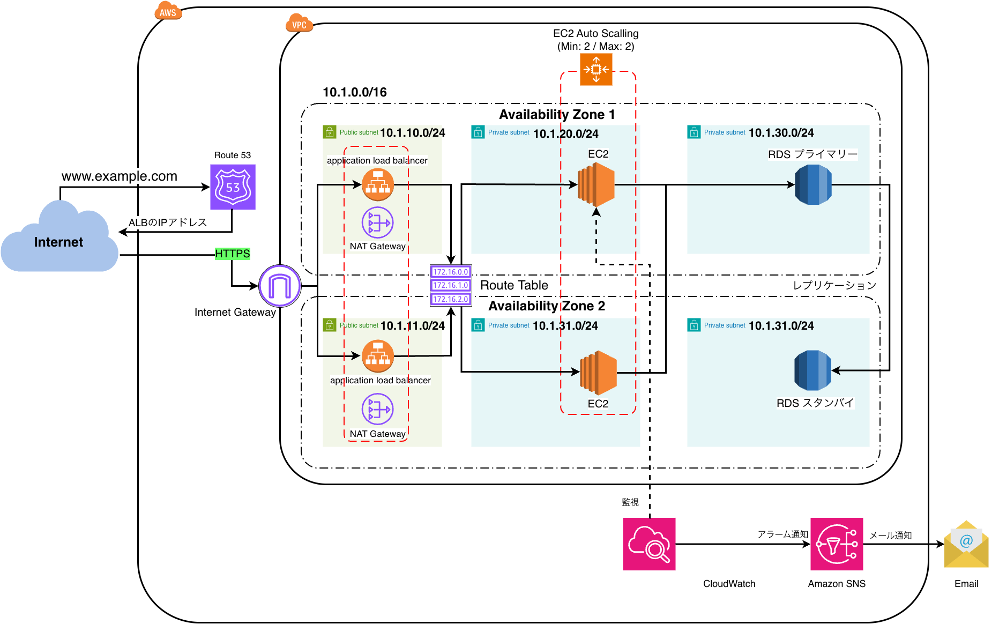

## 全体構成

-   VPC：`10.1.0.0/16`
-   Availability Zone：2つ
-   各AZに以下の3種類のサブネットを配置
    -   Public Subnet
    -   Private App Subnet
    -   Private DB Subnet
-   Route 53による独自ドメインの名前解決
-   ALBによる複数AZのEC2への負荷分散
-   Elastic BeanstalkによるSpring Bootアプリケーションのデプロイ・管理
-   EC2 Auto ScalingによってEC2を2台維持
    -   Min：2
    -   Max：2
-   EC2を2つのAvailability Zoneに分散して配置
-   RDSをMulti-AZ構成にしてPrimary / Standbyを異なるAZに配置
-   各AZにNAT Gatewayを配置
-   CloudWatch / Amazon SNSによる監視・メール通知

## ネットワーク構成

### VPC

VPCのCIDRは以下とする。

`10.1.0.0/16`

VPC内を2つのAvailability Zoneに分け、
各AZにPublic・App・DB用のサブネットを配置する。

### Availability Zone 1

-   Public Subnet：`10.1.10.0/24`
    -   Application Load Balancer
    -   NAT Gateway
-   Private App Subnet：`10.1.20.0/24`
    -   EC2
-   Private DB Subnet：`10.1.30.0/24`
    -   RDS Primary

### Availability Zone 2

-   Public Subnet：`10.1.11.0/24`
    -   Application Load Balancer
    -   NAT Gateway
-   Private App Subnet：`10.1.21.0/24`
    -   EC2
-   Private DB Subnet：`10.1.31.0/24`
    -   RDS Standby

## Webアクセス

ユーザーは独自ドメインを使用してアプリケーションへアクセスする。

`https://chinese-output-forge.com`

Route 53で名前解決を行い、 Application Load Balancerへ接続する。

通信の大まかな流れは以下。

    Internet
        ↓
    Route 53
        ↓
    Application Load Balancer
        ↓
    EC2
        ↓
    RDS

ALBは2つのAvailability Zoneにまたがって配置し、
各AZの正常なEC2へリクエストを振り分ける。

EC2はPrivate App Subnetに配置するため、
インターネットからEC2へ直接アクセスさせない。

また、ALBではHTTPSを使用し、
ACMで発行したSSL/TLS証明書を利用して通信を暗号化する。

## Elastic Beanstalk / EC2 / Auto Scaling

Spring BootアプリケーションはElastic
Beanstalkを利用してデプロイ・管理する。

Elastic Beanstalkによって管理されるEC2上で、 Spring
Bootアプリケーションを実行する。

EC2は2つのAvailability ZoneのPrivate App Subnetに分散して配置する。

-   AZ1：`10.1.20.0/24`
-   AZ2：`10.1.21.0/24`

外部からのWebアクセスはALBを経由する。

    Internet
        ↓
       ALB
        ↓
    EC2（Spring Boot）

EC2はAuto Scaling Groupによって管理する。

高可用性構成では以下の設定とする。

-   Min：2
-   Max：2

これにより、EC2を常時2台維持する。

EC2の1台に障害が発生した場合は、 正常なEC2で処理を継続しながら、 Auto
Scalingによって必要な台数を維持する。

また、EC2を異なるAvailability Zoneに配置することで、
単一のEC2だけでなく単一AZへの依存も避ける。

Elastic Beanstalkは通信経路そのものではなく、 EC2、ALB、Auto
ScalingなどのAWSリソースを利用して
アプリケーションのデプロイや環境を管理する役割を持つ。

## NAT Gateway

Private App SubnetのEC2は、 Internet
Gatewayを利用して直接インターネットへ接続しない。

そのため、EC2からインターネットへ通信する場合は、 Public
Subnetに配置したNAT Gatewayを利用する。

    EC2
     ↓
    NAT Gateway
     ↓
    Internet Gateway
     ↓
    Internet

これにより、EC2をインターネットから直接公開せずに、
OSパッケージの取得や外部APIへのアクセスなどを行える。

高可用性構成では各Availability ZoneにNAT Gatewayを配置する。

-   AZ1のEC2 → AZ1のNAT Gateway
-   AZ2のEC2 → AZ2のNAT Gateway

これにより、一方のAvailability Zoneに障害が発生した場合でも、
もう一方のAvailability Zoneに配置されたEC2が 同じAZのNAT
Gatewayを利用して外部へ通信できる構成とする。

## RDS

データベースはPrivate DB Subnetに配置し、 RDS Multi-AZ構成とする。

-   AZ1：RDS Primary
-   AZ2：RDS Standby

構成のイメージは以下。

    RDS Primary
         ↓
    同期レプリケーション
         ↓
    RDS Standby

通常時はPrimaryがデータベース処理を担当する。

PrimaryまたはAvailability Zoneに障害が発生した場合は、
RDSによってStandbyへのフェイルオーバーが行われる。

Standbyは通常時の読み取り処理を分担するためのRead Replicaではなく、
障害発生時のフェイルオーバー先として利用する。

EC2からRDSへはVPC内部で接続し、
データベースをインターネットへ直接公開しない。

## CloudWatch / Amazon SNS

EC2などのAWSリソースをCloudWatchで監視する。

    監視対象
        ↓
    CloudWatch
        ↓
    CloudWatch Alarm
        ↓
    Amazon SNS
        ↓
    Email

CloudWatchで設定した条件に達した場合、 Amazon
SNSを経由してメールで通知する。

これにより、AWS上で稼働しているリソースの異常を検知し、
必要に応じて対応できるようにする。

## 構成のポイント

この構成では、Web・アプリケーション・データベースを役割ごとに分離する。

    Public Subnet
    → ALB / NAT Gateway

    Private App Subnet
    → EC2（Spring Boot）

    Private DB Subnet
    → RDS

さらに、2つのAvailability Zoneを利用し、 EC2を各AZに分散して配置する。

EC2はAuto Scalingによって2台を維持し、
ALBによって正常なEC2へリクエストを振り分ける。

データベースについてもRDS Multi-AZを利用し、
Primaryとは異なるAvailability ZoneにStandbyを配置する。

また、各AZにNAT Gatewayを配置することで、 Private App
Subnetからのインターネット向け通信についても
単一AZに依存しない構成とする。

これにより、

-   Web層：ALB
-   アプリケーション層：EC2 + Auto Scaling
-   データベース層：RDS Multi-AZ
-   アウトバウンド通信：NAT Gateway

をそれぞれ複数のAvailability Zoneを利用する構成とし、
単一のEC2や単一のAvailability Zoneで障害が発生した場合でも、
サービスを継続しやすい高可用性構成とする。

# 没になった案 S3の実装

当初のAWS構成では、Amazon S3も導入する予定としていた。

S3を導入しようと考えた主な理由は、将来的にChinese Output
Forgeへ中国語の音声再生機能を追加することを想定していたためである。

例えば、問題ごとにTTSを利用して中国語音声を生成し、

    Question
        ↓
    TTSによる音声生成
        ↓
    MP3ファイル
        ↓
    S3へ保存

という構成にすることを想定していた。

S3上では、例えば以下のようにQuestion
IDと対応する形で音声ファイルを管理することも検討した。

    question-audio/{questionId}.mp3

さらに、将来的にはS3を直接公開するのではなく、CloudFrontを経由して音声ファイルを配信する構成も想定していた。

    Spring Boot
        ↓
    音声生成
        ↓
       S3
        ↓
    CloudFront
        ↓
    Browser

しかし、現在のChinese Output
Forgeには、そもそも音声ファイルを生成・保存・取得・再生するためのプログラムが一切実装されていない。

現時点のアプリケーションが扱っているデータは基本的にRDSへ保存するデータであり、S3へ保存する必要のある画像・音声・動画などのファイルは存在しない。

そのため、AWS上にS3 Bucketだけを用意しても、実際のSpring
BootアプリケーションからS3を利用する処理が存在せず、Chinese Output
Forgeの機能としてS3が正常に動作していることを十分に確認できない。

S3を実際にアプリケーションへ組み込んで動作確認するためには、例えば以下のような追加実装が必要になる。

-   Spring BootからTTSを利用して音声ファイルを生成する
-   生成した音声ファイルをS3へアップロードする
-   Questionと音声ファイルを対応させる
-   S3上の音声ファイルを取得する
-   ブラウザから音声を再生できるようにする
-   必要に応じてCloudFront経由で音声を配信する

これらはAWS側の設定だけでは完結せず、Chinese Output
Forge本体にも新しい機能を追加する必要がある。

今回の目的は、現在完成しているChinese Output
ForgeをAWSへデプロイし、AWS上で正常に稼働させることである。

そのため、S3の動作確認のために今からSpring
Boot側へ音声ファイルを取り扱う機能まで追加すると、アプリケーション自体の改修範囲が大きくなり、AWSへのデプロイという本来の作業から外れて時間もかかる。

また、現在のChinese Output
ForgeはS3を使用しなくても機能上まったく問題がない。

以上から、今回のAWSデプロイではS3の導入を見送り、**S3 /
CloudFrontを利用したTTS音声ファイルの保存・配信については、将来Chinese
Output Forgeへ音声機能を実装する際に改めて導入することとした**。

なお、S3を導入した場合の最終的な構成図は以下のようになる

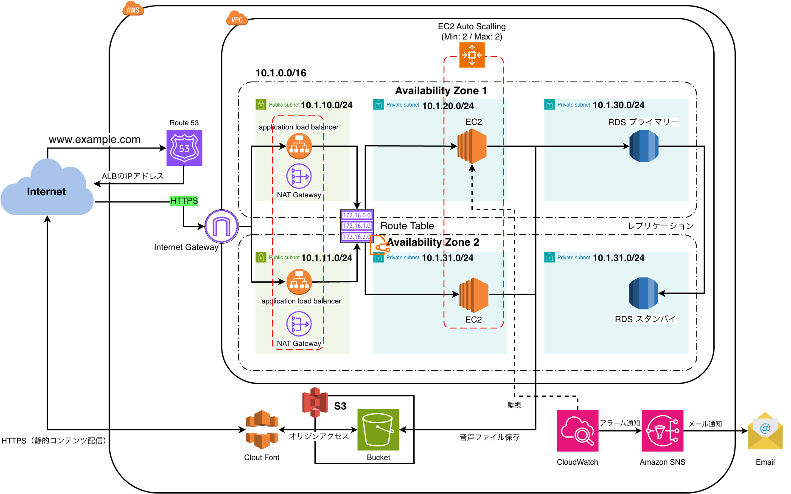

# AWS実装手順（高可用性バージョン）

以下の順番でAWS環境を構築する。

# 1.  **VPC**

    -   VPCを作成
    -   名前: chinese-output-forge-vpc
    -   CIDR：`10.1.0.0/16`

# 2.  **Subnet**

    -   2つのAvailability Zoneを使用
    -   各AZに以下の3種類のSubnetを作成
        -   Public Subnet
        -   Private App Subnet
        -   Private DB Subnet
    -   合計6Subnet

    **Availability Zone 1**

    -   Public Subnet：`10.1.10.0/24`
    -   Private App Subnet：`10.1.20.0/24`
    -   Private DB Subnet：`10.1.30.0/24`

    **Availability Zone 2**

    -   Public Subnet：`10.1.11.0/24`
    -   Private App Subnet：`10.1.21.0/24`
    -   Private DB Subnet：`10.1.31.0/24`

# 3.  **Internet Gateway**

    -   Internet Gateway 名前: chinese-output-forge-igw を作成
    -   VPC chinese-output-forge-vpcにリタッチ
    -   Public Subnetからインターネットへ接続できるようにする

# 4.  **NAT Gateway**

    -   各AZのPublic SubnetにNAT Gatewayを配置
    -   AZ1：NAT Gateway × 1　chinese-output-forge-nat-gateway-1a　IPv4:
        10.1.10.246
    -   AZ2：NAT Gateway × 1　chinese-output-forge-nat-gateway-1c　IPv4:
        10.1.11.39
    -   各NAT GatewayにElastic IPを割り当てる
    -   Private App SubnetのEC2がインターネットへ接続するために使用する

# 5.  **Route Table**

    -   Public Subnet用Route Tableを設定　chinese-output-forge-route
        -   `10.1.0.0/16` → Local
        -   `0.0.0.0/0` → Internet Gateway
    -   AZ1 Private App Subnet用Route
        Tableを設定　chinese-output-forge-private-app-route-1a 　　　-
        `10.1.0.0/16` → Local
        -   `0.0.0.0/0` → AZ1 NAT
            Gateway(chinese-output-forge-nat-gateway-1a)
    -   AZ2 Private App Subnet用Route
        Tableを設定　chinese-output-forge-private-app-route-1c 　　　-
        `10.1.0.0/16` → Local
        -   `0.0.0.0/0` → AZ2 NAT
            Gateway(chinese-output-forge-nat-gateway-1c)
    -   Private DB
        Subnetはインターネット向けのデフォルトルートを設定せず、
        VPC内部で通信する

# 6.  **Security Group**

    -   ALB用Security Groupを作成
        -   名前: chinese-output-forge-alb-sg
        -   説明: Allows HTTP/HTTPS traffic from the Internet
        -   インバウンドルール
    -   HTTP Anywhere IPv4
    -   HTTPS Anywhere IPv4
    -   EC2用Security Groupを作成
        -   名前: chinese-output-forge-ec2-sg
        -   説明: Allows application traffic from the ALB to EC2
            instances
        -   インバウンドルール
    -   カスタムTCP
        セキュリティグループchinese-output-forge-alb-sgを指定
    -   RDS用Security Groupを作成
        -   名前: chinese-output-forge-rds-sg
        -   説明: Allows PostgreSQL traffic from EC2 instances to RDS
        -   インバウンドルール
    -   カスタムTCP
        セキュリティグループchinese-output-forge-ec2-sgを指定
    -   基本的な通信経路を以下に制限する

    Internet ↓ ALB ↓ EC2 ↓ RDS

# 7.  **RDS**

    -   サブネットグループを作成 − 名前:
        hinese-output-forge-db-subnet-group

    -   対象1: chinese-output-forge-private-db-subnet-1a 10.1.30.0/24

    -   対象2: chinese-output-forge-private-db-subnet-1c 10.1.31.0/24

    -   PostgreSQLのRDSを作成

    -   PostgreSQL(18.3)

    -   本番稼働用

    -   マルチ AZ DB インスタンスデプロイ (2 インスタンス)

    -   DB インスタンス識別子: chinese-output-forge-db

    -   マスターユーザー名:
        cof_admin(chinese_output_forge_adminは文字数オーバー)

    -   マスターパスワード: マスターユーザー名に同じ

    -   DB インスタンスクラス:
        バースト可能クラス(普段はCPU使用率が低いけれど、必要なときだけ一時的にCPU性能を大きく使えるインスタンス。普段はアクセスが少ない
        → ときどきDB処理が増える、という個人Webアプリなのでこれでいい)

    -   インスタンスタイプ: db.t3.micro

    -   ストレージタイプ: 汎用SSD(gp3)

    -   ストレージ割り当て: 20Gib

    -   サブネットグループ: hinese-output-forge-db-subnet-group

    -   セキュリティグループ: chinese-output-forge-rds-sg

ここで リージョンと AZ: 1c セカンダリゾーン: 1a
となった。つまりAZ1をプライマリ、AZ2をスタンバイにするつもりが逆になってしまった。
しかし、AWS公式ドキュメントにも

"You can't choose the Availability Zones for the primary and secondary
DB instances in a Multi-AZ DB deployment. Amazon RDS chooses them for
you randomly."

とあるように、Multi-AZ
DB配置ではPrimaryとSecondaryのAZを選択できず、Amazon
RDSがランダムに選択する仕様になっているのでここはスルーする。

    - 既存のPostgreSQLデータを移行する  

RDSはPrivate
Subnetに配置されておりローカルPCから直接アクセスできないため、RDSへ接続できるEC2を確立してから行う。

# 8.  **Elastic Beanstalk / ALB / EC2 / Auto Scaling**

# Spring BootアプリのJARファイルを作成

Elastic Beanstalkへデプロイするため、Spring
Bootアプリを**実行可能なJARファイルにまとめる**。

Eclipseで、

**実行 → Mavenビルド**

ゴールに以下を入力する。

clean package

-   `clean`：以前のビルド結果を削除
-   `package`：アプリをJARファイルとして作成

`BUILD SUCCESS`になれば、`target`フォルダにJARファイルが作成される。

## ビルド時の環境変数

Chinese Output Forgeでは、以下の環境変数を使用している。

-   `DB_URL`：PostgreSQLの接続先
-   `DB_USERNAME`：DBユーザー名
-   `DB_PASSWORD`：DBパスワード
-   `GOOGLE_API_KEY`：Google APIキー
-   `OPENAI_API_KEY`：OpenAI APIキー
-   `MAIL_USERNAME`：メール送信用ユーザー名
-   `MAIL_PASSWORD`：メール送信用パスワード

`clean package`ではテストも実行される。

最初はEclipseのMavenビルドの実行環境に必要な環境変数が設定されていなかったため、テスト時にSpring
Bootを正常に起動できず、ビルドに失敗した。

そのため、Mavenビルドの実行設定にも必要な環境変数を設定した。

# IAMロールの設定

Elastic
Beanstalkと、その中で動くEC2に、それぞれ必要なAWS操作の権限を与える。

権限がない場合、その主体がAWS上で必要な操作をしようとしてもIAMによって拒否される。

## EC2用IAMロール

-   ロール名
    -   `chinese-output-forge-ec2-role`
-   信頼されたエンティティ
    -   `EC2`
-   ポリシー
    -   `AWSElasticBeanstalkWebTier`

## Elastic Beanstalk用IAMロール

-   ロール名
    -   `chinese-output-forge-elasticbeanstalk-service-role`
-   信頼されたエンティティ
    -   `Elastic Beanstalk`
-   ポリシー
    -   `AWSElasticBeanstalkEnhancedHealth`
    -   `AWSElasticBeanstalkManagedUpdatesCustomerRolePolicy`

## AWSElasticBeanstalkWebTier

-   Elastic BeanstalkのWebサーバーとして動くEC2に必要な権限を付与する
-   S3へのログファイルのアップロードなどを可能にする

## AWSElasticBeanstalkEnhancedHealth

-   Elastic
    BeanstalkがEC2や環境全体の状態を取得し、ヘルス状態を監視するための権限を付与する

## AWSElasticBeanstalkManagedUpdatesCustomerRolePolicy

-   Elastic
    Beanstalkが環境のマネージドプラットフォーム更新を実行するための権限を付与する

# Elastic Beanstalkアプリケーションの作成

ここではアプリケーションと環境を作成する。

## アプリケーション

1つのアプリをまとめて管理する単位。

今回の場合は、`Chinese Output Forge`というアプリそのものを管理する入れ物。

## 環境

アプリケーションを実際にAWS上で動かすための実行環境。

環境を作成すると、設定に従ってEC2、ALB、Auto
Scalingなどが構築され、JARファイルがEC2上で実行される。

1つのアプリケーションに「開発環境」「本番環境」など複数の環境を作ることもできる。

-   アプリケーション = アプリを管理する入れ物
-   環境 = アプリを実際に稼働させるAWS環境

## Elastic Beanstalk アプリケーション・環境作成の主な設定値

  ------------------------------------------------------------------------------------------
  項目                                設定値
  ----------------------------------- ------------------------------------------------------
  アプリケーション名                  `chinese-output-forge`

  環境名                              `Chinese-output-forge-env`

  環境階層                            ウェブサーバー環境

  環境タイプ                          負荷分散

  プラットフォーム                    Java

  プラットフォームブランチ            Corretto 21 running on 64bit Amazon Linux 2023

  プラットフォームバージョン          4.12.9

  プロキシサーバー                    nginx

  アーキテクチャ                      x86_64

  インスタンスタイプ                  `t3.micro`

  最小インスタンス数                  2

  最大インスタンス数                  2

  フリート                            オンデマンドインスタンス

  VPC                                 `chinese-output-forge-vpc`

  EC2配置先                           Private App Subnet（1a / 1c）

  EC2セキュリティグループ             `chinese-output-forge-ec2-sg`

  ロードバランサー                    Application Load Balancer（ALB）

  ALB公開範囲                         パブリック（インターネット向け）

  ALB配置先                           Public Subnet（1a / 1c）

  サービスロール                      `chinese-output-forge-elasticbeanstalk-service-role`

  EC2インスタンスプロファイル         `chinese-output-forge-ec2-role`

  EC2キーペア                         `chinese-output-forge-ssh-key`

  ヘルスレポート                      拡張

  モニタリング間隔                    5分

  CloudWatch Logs                     インスタンスログのストリーミング有効

  CloudWatch Logs保持期間             7日

  環境終了時のログ                    保持

  デプロイポリシー                    1回にすべて

  マネージドプラットフォーム更新      無効
  ------------------------------------------------------------------------------------------

## 環境プロパティ

Elastic Beanstalk上で動くSpring Bootアプリに渡す**環境変数**を設定する。

Chinese Output
Forgeは、DB接続情報・APIキー・メール送信情報などを環境変数から取得するため、Elastic
Beanstalk側にも設定する必要がある。

-   `DB_URL`
    -   RDS PostgreSQLの接続先
    -   `jdbc:postgresql://chinese-output-forge-db.c32cwi4eqr3d.ap-northeast-1.rds.amazonaws.com:5432/chinese_output_forge`
-   `DB_USERNAME`
    -   RDSへ接続するユーザー名
    -   `cof_admin`
-   `DB_PASSWORD`
    -   RDSへ接続するパスワード
-   `GOOGLE_API_KEY`
    -   Google APIを利用するためのAPIキー
-   `OPENAI_API_KEY`
    -   OpenAI APIを利用するためのAPIキー
-   `MAIL_USERNAME`
    -   メール送信に使用するアカウント
-   `MAIL_PASSWORD`
    -   メール送信に使用するパスワード
-   `SERVER_PORT`
    -   Spring Bootが待ち受けるポート
    -   `5000`

これらを設定しない場合、Spring
Bootが必要な値を取得できず、DB接続・API・メール送信などが正常に動作しない。

特に`DB_URL`を設定しないと、`application.yml`のデフォルト値である`localhost:5432`へ接続しようとするため、EC2からRDSへ接続できない。

また`SERVER_PORT=5000`を設定することで、Elastic BeanstalkのEC2上でSpring
Bootをポート5000で起動する。

## application.ymlは修正不要

`application.yml`では、環境変数から値を取得するように設定している。

``` yaml
datasource:
  url: ${DB_URL:jdbc:postgresql://localhost:5432/chinese_output_forge}
  username: ${DB_USERNAME:chinese_output_forge_app}
  password: ${DB_PASSWORD}
```

そのため、AWS用に`application.yml`を書き換える必要はない。

-   ローカル環境 → ローカル用の値を使用
-   Elastic Beanstalk → 環境プロパティに設定した値を使用

同じJARファイルでも、実行環境から渡される環境変数によってDBの接続先などを切り替えられる。

## 実行

作成されたドメイン
chinese-output-forge.ap-northeast-1.elasticbeanstalk.com
(まだ独自ドメインではない)
をクリックするとChineseOutpuForgeのHome画面にアクセスすることができた

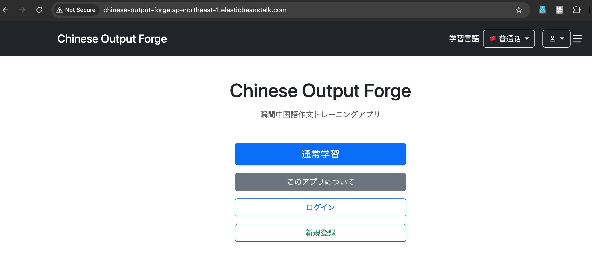

ただし、まだRDSにデータがないのでDBを必要とするページが使い物にならなかったりエラーを起こしている。

・通常学習メニューは問題収録数が0 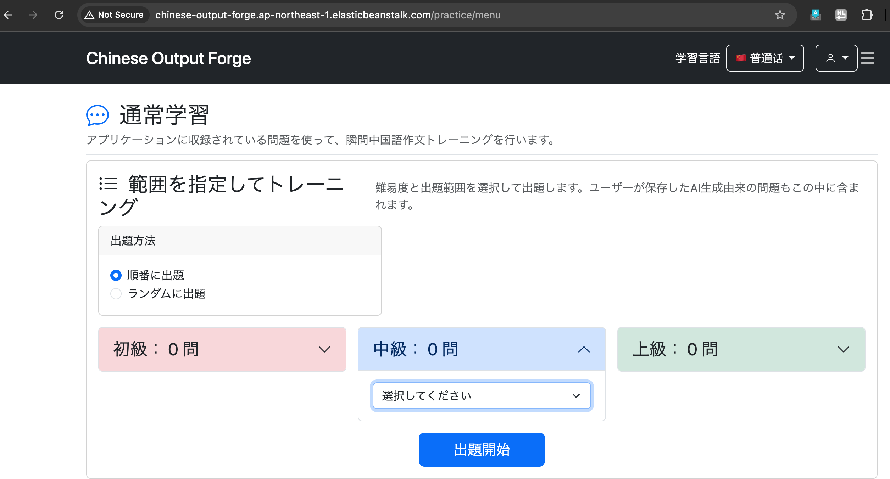

・ログイン画面にはアクセスもできない 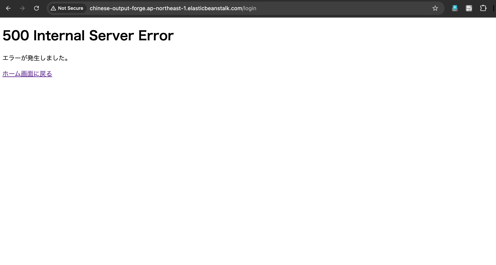

EC2とRDSのつながり

EC2（Spring Boot） ↓ TCP 5432 RDS（PostgreSQL）

を確立できたので、これからデータを入れていく

# 9.  既存データをRDSに移行

# ローカルDBを pg_dump

ローカルのPostgreSQLに保存されているChinese Output
Forgeの**テーブルやデータをRDSへ移行するため、まずバックアップファイルを作成する**。

PostgreSQLの`pg_dump`を使用して、ローカルDBの内容を`.dump`ファイルとして出力する。

## コマンド

/Library/PostgreSQL/18/bin/pg_dump\
-h localhost\
-p 5432\
-U chinese_output_forge_app\
-d chinese_output_forge\
-F c\
-f \~/chinese_output_forge.dump

-   `/Library/PostgreSQL/18/bin/pg_dump`：PostgreSQL 18の `pg_dump`
    をフルパスで実行
-   `-h localhost`：接続先をローカルPCに指定
-   `-p 5432`：PostgreSQLのポート番号を指定
-   `-U chinese_output_forge_app`：ローカルPostgreSQLへの接続ユーザーを指定
-   `-d chinese_output_forge`：バックアップ対象のデータベースを指定
-   `-F c`：Custom形式で出力（`pg_restore` で復元可能）
-   `-f ~/chinese_output_forge.dump`：ホームディレクトリにダンプファイルを保存

### フルパスで実行する理由

`pg_dump` へのPATHが通っていないため、PostgreSQL 18の `pg_dump`
がある場所をフルパスで指定して実行する。

``` bash
/Library/PostgreSQL/18/bin/pg_dump
```

### プレーンでなくCustom形式で出力する理由

`pg_dump`
のデフォルトはPlain形式だが、今回はRDSへのデータ移行を目的としているため、Custom形式を使用する。

``` bash
-F c
```

#### Plain形式

``` bash
-F p
```

-   SQL文がそのまま記述されたテキストファイルとして出力される
-   ファイルの中身を直接確認・編集できる
-   復元には主に `psql` を使用する
-   基本的にSQLを順番に実行して復元する

#### Custom形式

``` bash
-F c
```

-   PostgreSQL独自のアーカイブ形式で出力される
-   復元には `pg_restore` を使用する
-   テーブルなど、復元するオブジェクトを選択できる
-   所有者情報を復元しないなど、復元時の設定を柔軟に変更できる
-   データが圧縮されるため、Plain形式よりファイルサイズを小さくできる

今回はローカルPostgreSQLとRDSでユーザーや権限の構成が異なる可能性があるため、復元方法を柔軟に指定できるCustom形式を使用する。

なお、`-F` を省略した場合はPlain形式（`-F p`）になる。

### `-p` はコマンドラインオプションも引数も省略可能

PostgreSQLのデフォルトポートは `5432` なので、ポートが `5432`
なら以下は省略できる。

``` bash
-p 5432
```

### `-d` はコマンドラインオプションの省略が可能

データベース名は位置引数として指定できるため、

``` bash
-d chinese_output_forge
```

は、

``` bash
chinese_output_forge
```

と書くこともできる。

### `-f` は `>` で表現してもいい

`-f` を使うと、`pg_dump` の出力先ファイルを直接指定できる。

``` bash
-f ~/chinese_output_forge.dump
```

標準出力をシェルの `>` でファイルにリダイレクトすることもできる。

``` bash
> ~/chinese_output_forge.dump
```

# RDSへ到達できる経路を用意

`pg_restore`を実行するには、RDSのPostgreSQL（ポート5432）へ通信できる環境が必要。
今回はすでに、Elastic
BeanstalkのEC2からRDSへ接続できる経路を構築・確認済み。

    RDSのインバウンドルール
    PostgreSQL
    TCP 5432
    送信元：chinese-output-forge-ec2-sg

そのため、RDSへ到達できるEC2を経由して、ローカルDBのデータをRDSへ移行する。

# pg_restore

`pg_dump`で作成したダンプファイルを、RDSのPostgreSQLへ復元する。

今回はローカルDBから作成した`chinese_output_forge.dump`を使用し、Chinese
Output ForgeのテーブルやデータをRDSへ移行する。

RDSはPrivate
Subnetにあるため、ローカルPCから直接接続するのではなく、RDSへ接続できるEC2を経由して復元する。

## ローカルからRDSへは直接復元できない

今回のRDSはPrivate
Subnetに配置しており、インターネットから直接アクセスできない。
そのため、ローカルPCから直接`pg_restore`を実行してRDSへ接続することはできない。
一方、Elastic BeanstalkのEC2からRDSへの通信は許可されているため、
ローカルPC → EC2 → RDS という経路を利用して復元する。

## よくあるやり方

EC2をPublic Subnet、RDSをPrivate
Subnetに配置している場合、ローカルPCからEC2へSSHで接続し、EC2からRDSへアクセスする方法がある。
Macの場合は、ターミナルからSSHでEC2へ接続し、そのままEC2上でRDSへの接続や`pg_restore`などの操作を行える。

ローカルPCからEC2へ直接SSH接続するには、以下が前提となる。

-   EC2にパブリックIPv4アドレス（自動割り当てまたはElastic
    IP）を持たせる
-   セキュリティグループでSSH（TCP 22）を許可する
-   SSHキーを使って認証する

## EC2もプライベートサブネットに配置されているが？

今回のEC2もPrivate
Subnetに配置されており、パブリックIPアドレスを持たない。
そのため、ローカルPCからEC2へ通常のSSHで直接接続することもできない。
そこで、AWS Systems Manager（SSM）のSession
Managerを利用して、ローカルPCから直接SSH接続せずにEC2を操作できるようにする。

## AWS Systems Manager（SSM）とは

EC2などのAWSリソースに対して、OS内部の操作や設定などを行うための管理サービス。
例えば、EC2にコマンドを実行したり、OSの状態を確認したりできる。
今回は、Private
SubnetにあるEC2を外部へ公開せずに操作するために利用する。

## Session Managerとは

AWS Systems
Managerの機能の1つで、EC2などのマネージドインスタンスへ安全に接続するための機能。
Session Managerを利用すると、

-   EC2にパブリックIPv4アドレス（自動割り当てまたはElastic
    IP）を持たせる
-   SSH用のポート22をインターネットに公開する
-   SSHキーを使って接続する

といった方法を使わずにEC2へ接続し、ターミナルから操作できる。
そのため、今回のようにPrivate Subnetに配置したEC2にも接続できる。

そのため、 ローカルPC → Session Manager → EC2 → RDS
という経路を利用できる。

## 大まかな流れ

-   MacにあるdumpファイルをEC2へ持っていく
-   Session ManagerでEC2を操作する
-   EC2上でpg_restoreを実行してRDSへ復元する

## MacにあるdumpファイルをEC2へ持っていく

前述のSession Managerによって、Private
SubnetにあるEC2をローカルPCから操作できるようになった。

ただし、**EC2を操作できることと、ローカルPCからEC2へファイルを転送できることは別**に考える必要がある。

例えばPublic SubnetのEC2であれば、パブリックIPを持たせ、SSH（TCP
22）を許可することで、`scp`などを使ってローカルPCからEC2へファイルを転送できる。

しかし今回のEC2はPrivate
Subnetにあり、パブリックIPを持たず、インターネットから直接接続できない。

Session
ManagerによってEC2を操作できるようになっても、それだけでMac上のdumpファイルをEC2へ自由に転送できるようになるわけではない。

そのため、dumpファイルをEC2へ渡す方法を別途用意する必要がある。

## ポートフォワーディングという方法

ポートフォワーディングはAWS Systems Manager（SSM）のSession
Managerで利用できる機能の1つで、特定のポートへの通信を別の場所のポートへ転送する仕組み。

簡単にいえば、**クライアントのローカルポートと転送先のポートの間にトンネルを作る**ようなもの。

クライアントは自身のローカルポートに通信するだけで、SSMがその通信をトンネル経由で指定した転送先のポートまで届けてくれる。

そのため、EC2にパブリックIPを持たせたり、通信先のポートをインターネットへ公開したりせずに通信できる。

### 今回の場合

Macの1000番ポートに通信する
（1000は任意に指定したローカル側のポート番号） ↓
SSMが通信をトンネル経由でPrivate SubnetのEC2まで転送する ↓
EC2が中継地点となり、RDSの5432番ポートへ通信する ↓
RDS上のPostgreSQLが通信を受け取る

つまり、

Mac localhost:1000 ↓ SSMトンネル ↓ EC2（中継） ↓ RDS:5432

である

## 事前準備

-   AWS CLIのインストール
-   Session Manager Plugin のインストールする
-   踏み台EC2(中継となるEC2)にSSM
    AgentおよびIAMロールAmazonSSMManagedInstanceCoreが必要

### AWS CLI

AWS CLI（AWS Command Line
Interface）は、AWSの各種サービスをターミナルから操作するためのツール。

通常はAWSマネジメントコンソールから行う操作を、コマンドを使って実行できる。

今回のポートフォワーディングでは、AWS CLIからSession
Managerのセッションを開始するために使用する。

例えば、

Mac ↓ AWS CLIからSession Managerのセッションを開始 ↓ EC2 ↓ RDS

という通信経路を作る際に使用する。

#### AWSマネジメントコンソールからSession Managerのセッションを開始できないのか？

AWSマネジメントコンソールからでもSession
Managerのセッションを開始できる。 Systems
ManagerからEC2を選択してセッションを開始すると、

ブラウザ ↓ Session Manager ↓ EC2

という形で、ブラウザ上のターミナルからEC2を操作できる。
これは以前、EC2からRDSへの接続を確認した際に使用した方法。
ただし、今回必要なのは単にEC2を操作することではなく、

Macのローカルポート ↓ Session Manager ↓ EC2 ↓ RDS:5432

という**ポートフォワーディング**を行うこと。
Macのローカルポートをポートフォワーディングの入口として使用するため、Mac側からSession
Managerのセッションを開始する必要がある。そのため今回は、

-   AWS CLI
-   Session Manager Plugin

をMacにインストールし、ターミナルからポートフォワーディング用のSession
Managerセッションを開始する。

### Session Manager Plugin

Session Manager Pluginは、AWS CLIからSession
Managerのセッションを利用するためにローカルPCへインストールするプラグイン。

AWS CLIでSession Managerのセッション開始を要求すると、Session Manager
Pluginが実際のセッション通信を処理する。

今回の場合は、

Macのローカルポート ↓ Session Manager Plugin ↓ AWS Systems Manager ↓
EC2上のSSM Agent ↓ RDS:5432

という形でポートフォワーディングを行う。

そのため、MacからSession
Managerを利用してポートフォワーディングするには、

-   AWS CLI
-   Session Manager Plugin

の両方をMacにインストールする必要がある。

### SSM Agent

SSM Agent（AWS Systems Manager Agent）は、**EC2などのサーバーをAWS
Systems
Managerから操作・管理するために、サーバー側で動作するソフトウェア**。

Session Managerを使う場合、EC2上のSSM AgentがAWS Systems
Managerと通信することで、SSHを使わずにEC2へ接続できる。

Mac側にインストールした「Session Manager Plugin」とは別物。

-   Session Manager Plugin → 接続する側（Mac）で使用
-   SSM Agent → 接続される側（EC2）で動作。Systems Managerから、
    「このEC2に接続したい」 「このコマンドを実行して」
    といった指示を受け取る役割

### AmazonSSMManagedInstanceCore

AmazonSSMManagedInstanceCoreは、**EC2がAWS Systems
Managerを利用するために必要な基本的な権限をまとめたAWS管理ポリシー**。

このポリシーを持つIAMロールをEC2に付与することで、EC2上のSSM
AgentがSystems Managerと通信できるようになる。

つまり、

-   SSM Agent → Systems Managerと通信する「ソフトウェア」
-   AmazonSSMManagedInstanceCore → その通信を許可する「IAM権限」

という関係。

### AWS CLIのインストール

curl -fsSL https://awscli.amazonaws.com/v2/install.sh \| bash

aws --version　で確認 ↓ aws-cli/2.37.9 Python/3.14.6 Darwin/24.6.0
script-exe/x86_64

aws-cli/2.37.9がインストール済だということが確認できた

### AWS CLI 用の Session Manager プラグインをインストール

署名されたインストーラーを使用して Session Manager プラグインを macOS
にインストールする

署名されたインストーラーをダウンロード curl
"https://s3.amazonaws.com/session-manager-downloads/plugin/latest/mac/session-manager-plugin.pkg"
-o "session-manager-plugin.pkg" ↓ インストールコマンドを実行 sudo
installer -pkg session-manager-plugin.pkg -target / sudo ln -s
/usr/local/sessionmanagerplugin/bin/session-manager-plugin
/usr/local/bin/session-manager-plugin ↓ The install was successful.

確認 session-manager-plugin --version ↓ 1.2.835.0が表示されたので成功

###　踏み台EC2(中継となるEC2)にSSM
AgentおよびIAMロールAmazonSSMManagedInstanceCoreが必要

#### SSM Agent

AWSコンソールで、 Systems Manager → フリートマネージャー（Fleet
Manager）にアクセス マネージドノード
としてEC2が表示され、さらにバージョンが3.3.4624.0なのでSSM
Agentのバージョン条件はクリア済

#### AmazonSSMManagedInstanceCore

AWSコンソールで、 EC2 → インスタンス → 対象のEC2を選択
→「セキュリティ」タブからロールを確認 1a,
1cともにchinese-output-forge-ec2-roleを使っており内訳は
・AmazonSSMManagedInstanceCore ← SSMを利用するための権限
・AWSElasticBeanstalkWebTier ← Elastic BeanstalkのWebサーバー用の権限

なので条件はクリア

## 手順

ローカルのターミナルで以下を実行

aws ssm start-session\
--target i-0ca9a935d68a2e87e\
--document-name AWS-StartPortForwardingSessionToRemoteHost\
--parameters
'{"host":\["chinese-output-forge-db.c32cwi4eqr3d.ap-northeast-1.rds.amazonaws.com"\],"portNumber":\["5432"\],"localPortNumber":\["5432"\]}'

このコマンドは、**AWS Systems Manager Session
Managerを利用して、ローカルPCからEC2を経由してRDSへ接続するためのトンネルを作成する**。

### `aws ssm start-session`

``` bash
aws ssm start-session
```

AWS CLIから、**Systems ManagerのSession Managerセッションを開始する**。

今回はEC2へログインすること自体が目的ではなく、EC2を経由してRDSへ通信するために使用する。

### `--target`

``` bash
--target i-0ca9a935d68a2e87e
```

**Session Managerで接続するEC2インスタンスを指定する**。

今回指定しているのは、`ap-northeast-1a` にあるEC2。

このEC2がローカルPCとRDSの間を中継する。

### `--document-name`

``` bash
--document-name AWS-StartPortForwardingSessionToRemoteHost
```

Session Managerで**どのようなセッションを開始するか**を指定する。

`AWS-StartPortForwardingSessionToRemoteHost`
は、AWSが用意しているSSMドキュメントで、

**ローカルPC → EC2 → 別のホスト**

というポートフォワーディングを行うために使用する。

今回は「別のホスト」がRDSになる。

### `--parameters`

``` bash
--parameters '{"host":["chinese-output-forge-db.c32cwi4eqr3d.ap-northeast-1.rds.amazonaws.com"],"portNumber":["5432"],"localPortNumber":["5432"]}'
```

ポートフォワーディングに必要な接続先やポート番号を指定する。

#### `host`

``` text
chinese-output-forge-db.c32cwi4eqr3d.ap-northeast-1.rds.amazonaws.com
```

**EC2から接続する最終的な接続先**を指定する。

今回はChinese Output Forgeで使用しているRDSのエンドポイント。

#### `portNumber`

``` text
5432
```

**接続先であるRDS側のポート番号**。

今回のRDSはPostgreSQLなので、PostgreSQLの標準ポートである `5432`
を指定する。

-   PostgreSQL → `5432`
-   MySQL / MariaDB → `3306`

#### `localPortNumber`

``` text
5432
```

**ローカルPC側で待ち受けるポート番号**。

今回はMacの、

``` text
localhost:5432
```

への通信をSSMトンネルへ流す。

### 通信経路

このコマンドを実行すると、以下の経路が作られる。

``` text
Mac
localhost:5432
      │
      │ SSMポートフォワーディング
      ▼
EC2
i-0ca9a935d68a2e87e
      │
      │ PostgreSQL :5432
      ▼
RDS
chinese-output-forge-db.c32cwi4eqr3d.ap-northeast-1.rds.amazonaws.com
:5432
```

そのため、ローカルPCからは、

``` text
localhost:5432
```

に接続するだけで、実際の通信は**EC2を経由してRDSの5432番ポートへ転送される**。

### DBのバックアップファイルを指定していないけど？

今やっているのは、バックアップをRDSへ復元する作業ではなく、
「MacからRDSへ通信できる通り道を作る作業」だけ。

上記のコマンドが成功してはじめてバックアップファイルを指定して流すことができる。

### 実行

naoki@NaokinoMacBook-Air chinese-output-forge % aws ssm start-session\
--target i-0ca9a935d68a2e87e\
--document-name AWS-StartPortForwardingSessionToRemoteHost\
--parameters
'{"host":\["chinese-output-forge-db.c32cwi4eqr3d.ap-northeast-1.rds.amazonaws.com"\],"portNumber":\["5432"\],"localPortNumber":\["5432"\]}'

↓

aws: \[ERROR\]: An error occurred (NoRegion): You must specify a region.
You can also configure your region by running "aws configure".
naoki@NaokinoMacBook-Air chinese-output-forge %

内容: どのリージョンを使うか　がまだ設定されていないためのエラー

### 修正・実行

今回のEC2とRDSは東京リージョン ap-northeast-1
なので、コマンドにリージョンを明示して実行する

aws ssm start-session\
--region ap-northeast-1\
--target i-0ca9a935d68a2e87e\
--document-name AWS-StartPortForwardingSessionToRemoteHost\
--parameters
'{"host":\["chinese-output-forge-db.c32cwi4eqr3d.ap-northeast-1.rds.amazonaws.com"\],"portNumber":\["5432"\],"localPortNumber":\["5432"\]}'

↓

Starting session with SessionId:
mawsonlakes_user-537a5a3z9atdebigayd684p6k4

のままで止まる。本来ならば Port 5432 opened for sessionId ...
となるはずなのだがセッションが確立しない

### 修正

技術ブログや公式ドキュメントを参照すると、ローカルのポート番号に15432を採用しているので今回もそれに合わせてみる

aws ssm start-session\
--region ap-northeast-1\
--target i-0ca9a935d68a2e87e\
--document-name AWS-StartPortForwardingSessionToRemoteHost\
--parameters
'{"host":\["chinese-output-forge-db.c32cwi4eqr3d.ap-northeast-1.rds.amazonaws.com"\],"portNumber":\["5432"\],"localPortNumber":\["15432"\]}'

------------------------------------------------------------------------

## 参考文献

-   https://dev.classmethod.jp/articles/2026-04-14-rds-ssm-jdbc-iam-authentication/?utm_source=chatgpt.com
    -   Session ManagerのRemote
        Hostポートフォワーディングで、ローカルPCからEC2を中継してPrivate
        Subnet内のRDSへ接続する構成を参考にした。
-   https://github.com/aws-samples/sample-rds-aurora-postgres-dba-toolkit/blob/main/pre-upgrade-check/README.md?utm_source=chatgpt.com
    -   `AWS-StartPortForwardingSessionToRemoteHost`を使ったRDS/Auroraへのポートフォワーディング例と、ローカル側ポートをDB側ポートと分ける構成を参考にした。
-   https://qiita.com/ryo_cresc/items/d60eaaafd60e847a5d38?utm_source=chatgpt.com
    -   Session
        Managerのポートフォワーディング例を参考にし、ローカル側ポートとして`15432`を使用する構成を試した。
        \*\*\* \### 実行

naoki@NaokinoMacBook-Air chinese-output-forge % aws ssm start-session\
--region ap-northeast-1\
--target i-0ca9a935d68a2e87e\
--document-name AWS-StartPortForwardingSessionToRemoteHost\
--parameters
'{"host":\["chinese-output-forge-db.c32cwi4eqr3d.ap-northeast-1.rds.amazonaws.com"\],"portNumber":\["5432"\],"localPortNumber":\["15432"\]}'
↓ Starting session with SessionId:
mawsonlakes_user-h4ixszzuausyc3xna38563dpci Port 15432 opened for
sessionId mawsonlakes_user-h4ixszzuausyc3xna38563dpci. Waiting for
connections...

SSMのRemote
Hostポートフォワーディングが正常に動作し、かつトンネルの準備が完了して、Macの
localhost:15432 への接続を待っている状態になった。

これでようやくバックアップファイルをRDSへ復元する
pg_restore（またはバックアップ形式によっては psql）に進める。

# 接続の確認

SSMポートフォワーディングを開始した状態で、別のターミナルから `psql`
を使ってRDSへ接続する。

``` bash
psql \
  -h 127.0.0.1 \
  -p 15432 \
  -U cof_admin \
  -d chinese_output_forge
```

-   `-h 127.0.0.1`
    -   接続先としてローカルPCを指定する
    -   実際にはSSMポートフォワーディングによってRDSへ転送される
-   `-p 15432`
    -   SSMポートフォワーディングで設定したローカル側のポート
    -   RDS側のPostgreSQLは `5432` を使用している
-   `-U cof_admin`
    -   RDSへ接続するPostgreSQLユーザー
-   `-d chinese_output_forge`
    -   接続するデータベース名

接続経路は以下のようになる。

``` text
psql
 ↓
127.0.0.1:15432
 ↓
SSMポートフォワーディング
 ↓
EC2
 ↓
RDS:5432
 ↓
chinese_output_forge
```

↓

`cof_admin` のパスワードを入力する。

↓

以下のように表示されれば接続成功。

``` text
psql (18.6 (Postgres.app), server 18.3)
SSL connection (protocol: TLSv1.3, cipher: TLS_AES_256_GCM_SHA384, compression: off, ALPN: postgresql)
Type "help" for help.

chinese_output_forge=>
```

`chinese_output_forge=>` は、現在 `chinese_output_forge`
データベースに接続しており、
PostgreSQLのコマンドやSQLを実行できる状態であることを表す。

# テーブル一覧の確認

接続できたついでに、`\dt` で現在のテーブル一覧を確認する。

``` text
chinese_output_forge=> \dt
                   List of tables
 Schema |         Name          | Type  |   Owner
--------+-----------------------+-------+-----------
 public | ai_generation_history | table | cof_admin
 public | favorite              | table | cof_admin
 public | password_reset_token  | table | cof_admin
 public | question              | table | cof_admin
 public | question_list         | table | cof_admin
 public | question_list_item    | table | cof_admin
 public | structure             | table | cof_admin
 public | study_history         | table | cof_admin
 public | users                 | table | cof_admin
(9 rows)
```

9つのテーブルがRDS上に存在することを確認できた。

また、すべてのOwnerが `cof_admin` になっている。

ただし、**テーブルが存在することと、バックアップのデータが復元されていることは別である。**

この時点ではSpring Boot /
JPAによってテーブル構造だけが作成されている可能性があるため、
必要に応じてデータ件数も確認する。

例：

``` sql
SELECT COUNT(*) FROM question;
```

今回、復元前は `question` の件数が `0` だったため、

``` text
テーブル構造 → RDS上に存在する
データ       → まだ入っていない
```

という状態であることを確認できた。

# データを復元（失敗）

SSMポートフォワーディングを維持した状態で、ローカルに保存していたdumpファイルをRDSへ復元する。

``` bash
pg_restore \
  -h 127.0.0.1 \
  -p 15432 \
  -U cof_admin \
  -d chinese_output_forge \
  --clean \
  --if-exists \
  --no-owner \
  --no-privileges \
  ~/chinese_output_forge.dump
```

各オプションの意味は以下のとおり。

``` text
--clean           既存のテーブル等を削除してから復元
--if-exists       存在するものだけDROPする
--no-owner        ローカルの所有者情報をRDSへ持ち込まない
--no-privileges   ローカルのGRANT/ACLをRDSへ持ち込まない
```

## `--no-owner`、`--no-privileges` を付ける理由

今回のdumpはローカルPostgreSQLから作成したものであり、dump内にはローカル環境の所有者（Owner）や権限情報も含まれている。

実際にdumpの内容を確認すると、オブジェクトのOwnerとして以下のようなローカル側のユーザーが記録されていた。

``` text
chinese_output_forge_app
postgres
```

一方、RDSでは以下のユーザーを使用している。

``` text
cof_admin
```

このようにバックアップ元と復元先ではPostgreSQLユーザーが異なる。

そのため、

``` text
--no-owner
```

を指定して、バックアップ元のOwnerをRDS上で再現しないようにする。

また、ローカル環境で設定されていた `GRANT` や `ACL`
などの権限設定もRDSへそのまま持ち込む必要はないため、

``` text
--no-privileges
```

も指定する。

これにより、

``` text
ローカルDB
Owner：chinese_output_forge_app / postgres
権限：ローカル環境用
        ↓
     無視
        ↓
RDS
接続ユーザー：cof_admin
```

という形で、バックアップ元と復元先のユーザー・権限設定の違いによる問題を避ける。

------------------------------------------------------------------------

## 実行（失敗）

`pg_restore` を実行したところ、復元に失敗した。

主に以下のようなエラーが発生した。

``` text
ERROR: cannot drop constraint users_pkey on table public.users
because other objects depend on it
```

``` text
ERROR: cannot drop table public.users because other objects depend on it
```

さらに、

``` text
ERROR: relation "users" already exists
```

や、

``` text
ERROR: duplicate key value violates unique constraint "users_pkey"
```

なども発生した。

### 原因

RDSにはすでにSpring Boot / JPAによって9つのテーブルが作成されていた。

また、それらのテーブルはFOREIGN KEYなどによって相互に依存していた。

今回使用した、

``` text
--clean
```

は、dumpに含まれる各オブジェクトを復元する前に既存オブジェクトを削除しようとする。

しかし、既存のテーブルやPRIMARY KEYが別のFOREIGN
KEYから参照されていたため、正常に削除できないものが発生した。

例えば `users` のPRIMARY KEYは、他のテーブルのFOREIGN
KEYから参照されていた。

``` text
users
  ↑
  ├── password_reset_token
  ├── question_list
  ├── favorite
  ├── question
  └── ai_generation_history
```

そのため、

``` text
既存オブジェクトをDROP
        ↓
外部キーなどの依存関係によって一部のDROPに失敗
        ↓
一部の既存オブジェクトが残る
        ↓
dumpから同じテーブル等をCREATE
        ↓
relation already exists
        ↓
既存データとdumpのデータも衝突
        ↓
duplicate key / FOREIGN KEYエラー
```

という状態になった。

この時点では一部のオブジェクトだけが削除・復元されている可能性があるため、RDSは中途半端な状態になっている。

------------------------------------------------------------------------

## 修正（スキーマの削除、再設定）

今回はRDSに現在存在するデータを残したまま差分を復元するのではなく、ローカルDBのバックアップをRDSへ丸ごと復元することが目的である。

そのため、個々のテーブルを削除するのではなく、`public`
スキーマを依存関係ごと削除して、空の状態から復元することにした。

まずRDSへ接続する。

``` bash
psql \
  -h 127.0.0.1 \
  -p 15432 \
  -U cof_admin \
  -d chinese_output_forge
```

接続後、`public` スキーマを削除する。

``` sql
DROP SCHEMA public CASCADE;
```

`CASCADE` を指定することで、`public`
スキーマ内のテーブルだけでなく、それらに依存するFOREIGN
KEYなどのオブジェクトもまとめて削除できる。

実行結果：

``` text
NOTICE:  drop cascades to 9 other objects
DETAIL:  drop cascades to table users
drop cascades to table ai_generation_history
drop cascades to table favorite
drop cascades to table password_reset_token
drop cascades to table question
drop cascades to table question_list
drop cascades to table question_list_item
drop cascades to table structure
drop cascades to table study_history
DROP SCHEMA
```

9つのテーブルを含む `public` スキーマが削除された。

続いて、空の `public` スキーマを作り直す。

``` sql
CREATE SCHEMA public;
```

↓

``` text
CREATE SCHEMA
```

これにより、

``` text
既存のpublicスキーマ
 ├── テーブル
 ├── データ
 ├── PRIMARY KEY
 ├── FOREIGN KEY
 └── シーケンス等
        ↓
DROP SCHEMA public CASCADE
        ↓
すべて削除
        ↓
CREATE SCHEMA public
        ↓
空のpublicスキーマ
```

という状態にした。

------------------------------------------------------------------------

# データを復元（成功）

空の `public` スキーマを作成したため、再度 `pg_restore` を実行する。

今回は既存オブジェクトを削除する必要がないため、

``` text
--clean
--if-exists
```

は使用しない。

また、復元中にエラーが発生した場合にそのまま処理を継続しないよう、

``` text
--exit-on-error
```

を追加する。

``` bash
pg_restore \
  -h 127.0.0.1 \
  -p 15432 \
  -U cof_admin \
  -d chinese_output_forge \
  --no-owner \
  --no-privileges \
  --exit-on-error \
  ~/chinese_output_forge.dump
```

各オプションの意味は以下のとおり。

``` text
--no-owner        バックアップ元のOwner情報を復元しない
--no-privileges   バックアップ元のGRANT / ACLを復元しない
--exit-on-error   エラーが発生した場合、その時点で復元を停止する
```

パスワードを入力すると、エラーは表示されず正常終了した。

``` text
Password:
naoki@NaokinoMacBook-Air ~ %
```

`pg_restore`
は正常終了時には特にメッセージを表示しないため、RDSへ再接続して実際のデータを確認する。

``` bash
psql \
  -h 127.0.0.1 \
  -p 15432 \
  -U cof_admin \
  -d chinese_output_forge
```

`question` テーブルのデータ件数を確認する。

``` sql
SELECT COUNT(*) FROM question;
```

復元前：

``` text
count
-----
0
```

復元後：

``` text
count
-----
686
```

さらにSpring
Bootアプリの通常学習ページを開くと、復元前は0件だった対象問題数が増えていることも確認できた。

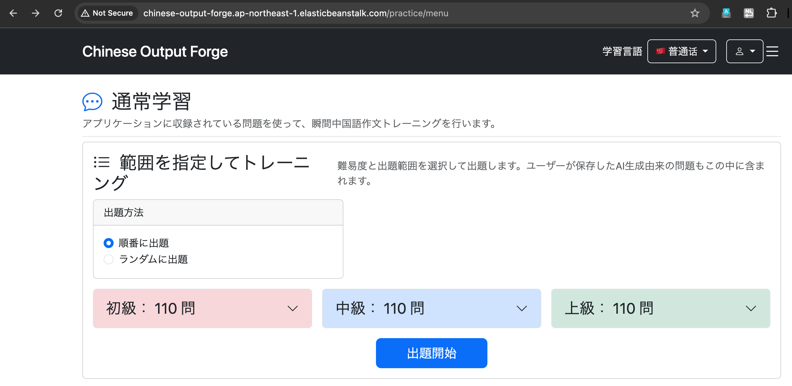

したがって、

``` text
chinese_output_forge.dump
        ↓
pg_restore
        ↓
SSM（localhost:15432）
        ↓
EC2
        ↓
RDS PostgreSQL:5432
        ↓
テーブル・データ・制約等を復元
        ↓
question：0件 → 686件
        ↓
Spring Bootアプリからもデータを確認
```

となり、RDSへのデータ復元に成功した。

------------------------------------------------------------------------

## 参考文献

-   https://qiita.com/chamasei/items/77822274e8d693087096
    -   PostgreSQLの`pg_dump` /
        `pg_restore`を使ったデータ移行手順を参考にした。
-   https://qiita.com/kenogi/items/69d0e9b78324f56e62ea
    -   PostgreSQLのバックアップ・リストア時のコマンド構成やオプションを参考にした。
-   https://zenn.dev/taroshun32/articles/session-manager
    -   Session Managerを使い、SSHポートを公開せずPrivate
        SubnetのEC2を操作する構成を参考にした。
-   https://docs.aws.amazon.com/systems-manager/latest/userguide/session-manager-working-with-sessions-start.html#sessions-start-port-forwarding
    -   AWS公式のSession
        Managerポートフォワーディング手順と`AWS-StartPortForwardingSessionToRemoteHost`の利用方法を確認した。
-   https://docs.aws.amazon.com/ja_jp/systems-manager/latest/userguide/install-plugin-macos-overview.html
    -   macOSへのSession Manager Pluginのインストール方法を参考にした。
-   https://docs.aws.amazon.com/ja_jp/cli/latest/userguide/getting-started-install.html
    -   macOSへのAWS CLIのインストール方法を参考にした。

使用したEC2インスタンス：

``` text
i-06aca47bbaffc9d36
i-0ca9a935d68a2e87e
```

------------------------------------------------------------------------

# 10. 環境プロパティの暗号化

本番DBの接続情報を環境プロパティに設定することのメリットは、
・`application.yml`(またはローカル用との差別化を図ったapplication-prod.ymlなど)に環境変数を直接書くと、Gitにコミットしてしまう危険があるが、環境プロパティで管理すると、わざわざpropertyファイルやymlファイルをAWS用に残す必要がないため、パスワードなどがムダにGitで拡散することがなくなる
である。

じゃあAWSの環境変数にパスワードを入れれば安全なのか？ →
実はそれでも十分ではない

AWSの環境プロパティは、**保存時に暗号化されず、平文（Plain
Text）として保存される**。

例えば、

``` text
SPRING_DATASOURCE_PASSWORD=SuperTopSecret123#
```

のようにパスワードがそのまま保存される。

そのため、

``` text
① application-prod.properties にパスワードを書く
        ↓
Gitに流出する危険がある

② AWSの環境プロパティに移す
        ↓
Gitからは分離できる
        ↓
しかし、パスワードが平文で保存される

③ より安全な方法で機密情報を管理する
```

つまり、**AWSの環境プロパティに移すことでGitへの流出は防げるが、パスワードなどの機密情報を安全に保存する方法としては十分ではない。**
↓ AWS Systems Manager Parameter Storeで暗号化する

# Parameter Storeとは

**AWS Systems Manager Parameter Store**
は、アプリケーションで使用する設定値や機密情報を、AWS上で一元管理するためのサービス。

例えば、以下のような値をSpring
Bootの設定ファイルやGitに直接書かずに管理できる。

-   データベースのパスワード
-   データベースのユーザー名
-   APIキー
-   外部サービスの接続情報

Parameter Storeには、主に次の3種類のパラメータがある。

-   **String**：通常の文字列
-   **StringList**：カンマ区切りの文字列
-   **SecureString**：暗号化して保存する文字列

パスワードなどの機密情報には **SecureString** を使用する。

SecureStringは **AWS KMS** を利用して暗号化される。

``` text
Parameter Store

/config/chinese-output-forge/db-password
        ↓
SecureStringとして保存
        ↓
AWS KMSで暗号化
        ↓
必要な権限を持つアプリケーションだけが取得
        ↓
Spring Bootから利用
```

そのため、

``` properties
DB_PASSWORD=実際のパスワード
```

のように、機密情報を `application-prod.properties`
に直接書く必要がなくなる。

## Parameter Storeを使うメリット

### ① Gitから機密情報を分離できる

ソースコードにパスワードを書かないため、GitHubなどへの流出を防ぎやすい。

### ② 機密情報を暗号化して保存できる

**SecureString** を使用すると、AWS KMSによって値を暗号化して保存できる。

### ③ IAMでアクセスを制御できる

「どのEC2・アプリケーションが、どのパラメータを取得できるか」をIAMで制御できる。

つまり、

**Parameter Store =
アプリケーションの設定値や機密情報をAWS側で安全に管理し、必要なアプリケーションだけが取得できる仕組み**

と考えると分かりやすい。

今回の構成では、

``` text
Elastic Beanstalk
        ↓
EC2上のSpring Boot
        ↓
IAMロールの権限を使う
        ↓
Parameter Store
        ↓
DB接続情報を取得
        ↓
RDSへ接続
```

という流れになる。

# やり方

Spring BootからParameter Storeを簡単に利用するために「Spring Cloud
AWS」を使う

Spring Cloud AWS - AWS CloudとSpring
Bootを連携するためのオープンソースプロジェクト - Spring
BootからAWSの各種サービスを利用しやすくする - 今回は AWS Systems Manager
Parameter Storeとの連携に使用する

今回の役割 Spring Bootアプリ ↓ Spring Cloud AWS ↓ AWS Systems Manager
Parameter Store ↓ DB接続情報などを取得

Spring Cloud AWSを使うことで、Spring BootからParameter
Storeに保存した設定値を読み込める。

# 開発手順

1.  AWS Parameter Storeにパラメータを作成する

2.  AWSロールにポリシーをアタッチする：`AmazonSSMReadOnlyAccess`

3.  Spring Bootアプリの`application-prod.properties`ファイルを編集する

4.  Parameter StoreをサポートするようにMavenの`pom.xml`を更新する

5.  Mavenを使用してSpring Bootアプリをパッケージ化する

6.  AWSの環境プロパティを更新する

7.  Spring BootのJARファイルをElastic Beanstalkにアップロードする

# ステップ1. AWS Parameter Storeにパラメータを作成する

パラメータ名はそれぞれ

/config/chinese-output-forge/DB_USERNAME　cof_admin
/config/chinese-output-forge/DB_PASSWORD　[REDACTED]
/config/chinese-output-forge/GOOGLE_API_KEY　[REDACTED]
/config/chinese-output-forge/MAIL_USERNAME　[REDACTED]
/config/chinese-output-forge/MAIL_PASSWORD　[REDACTED]
/config/chinese-output-forge/OPENAI_API_KEY　[REDACTED]

とする。

# ステップ2：AWSロールにポリシーをアタッチする

-   AWSロールに`AmazonSSMReadOnlyAccess`ポリシーをアタッチする
-   アプリケーションがAWS Parameter
    Storeから設定データを読み取れるようにする

IAMからchinese-output-forge-ec2-roleにアクセス

AWSElasticBeanstalkWebTierを選択した状態で許可を追加

AmazonSSMReadOnlyAccessを検索
AmazonSSMReadOnlyAccessをチェックし、許可を追加

## AmazonSSMReadOnlyAccessとは？

AWS Systems Managerの情報を**読み取るための権限を与えるIAMポリシー**。

Parameter StoreもSystems
Managerの機能なので、このポリシーによってParameter
Storeの値を読み取れる。

## なぜAmazonSSMReadOnlyAccessが必要なのか

Parameter Storeに値を保存しただけでは、EC2上のSpring
Bootはその値を取得できない。

EC2のIAMロールに `AmazonSSMReadOnlyAccess` を付与することで、

``` text
Spring Boot
    ↓
EC2のIAMロール
    ↓
Parameter Storeを読み取る
```

ことができるようになる。

# ステップ3：Spring Bootの`application-prod.yml`を編集する

``` text
```

application-prod.ymlは既存のapplication.ymlをそのままコピーして作ればいい

**ファイル：`application-prod.yml`**

``` yaml
spring:
  config:
    # 機密情報をAWS Parameter Storeから読み込む
    import: aws-parameterstore:/config/chinese-output-forge/
```

-   `spring.config.import`
    -   追加の設定情報を読み込む
-   `aws-parameterstore:`
    -   Spring Cloud AWSを使ってAWS Parameter
        Storeから追加の設定情報を取得する
-   `/config/chinese-output-forge/`
    -   Parameter Storeに作成したパラメータへのパス

## 実装

既存の`application-prod.yml`の`spring:`直下に以下を追加する。

``` yaml
spring:

  config:
    # Load properties from AWS Parameter Store
    import: aws-parameterstore:/config/chinese-output-forge/

  messages:
    fallback-to-system-locale: false
```

意味としては、

**AWS Parameter Storeの `/config/chinese-output-forge/`
配下にある設定を、Spring Bootの設定として読み込む**

ということ。

先ほど作成した、

``` text
/config/chinese-output-forge/DB_PASSWORD
/config/chinese-output-forge/GOOGLE_API_KEY
/config/chinese-output-forge/MAIL_PASSWORD
/config/chinese-output-forge/OPENAI_API_KEY
```

を読み込むための設定。

    spring:

      config:
        import: aws-parameterstore:/config/chinese-output-forge/

      messages:
        fallback-to-system-locale: false

      datasource:
        url: ${DB_URL:jdbc:postgresql://localhost:5432/chinese_output_forge}
        username: ${DB_USERNAME:chinese_output_forge_app}
        password: ${DB_PASSWORD}

      jpa:
        hibernate:
          ddl-auto: update

      mail:
        host: smtp.gmail.com
        port: 587
        username: ${MAIL_USERNAME}
        password: ${MAIL_PASSWORD}
        properties:
          mail:
            smtp:
              auth: true
              starttls:
                enable: true

    logging:
      level:
        org.springframework.security: DEBUG

    app:
      base-url: http://localhost:8080

# ステップ4：Parameter StoreをサポートするようにMavenの`pom.xml`を更新する

``` text
```

-   Spring Cloud AWSのBOM（Bill of Materials）を使用する
-   Spring Cloud AWSの各依存関係で推奨されるバージョンを定義する
-   Spring Boot Starter Parentと似た考え方

**ファイル：`pom.xml`**

``` xml
<dependencyManagement>
    <dependencies>
        <dependency>
            <groupId>io.awspring.cloud</groupId>
            <artifactId>spring-cloud-aws-dependencies</artifactId>
            <version>x.y.z</version>
            <type>pom</type>
            <scope>import</scope>
        </dependency>
    </dependencies>
</dependencyManagement>
```

> この設定は通常の`<dependencies>`セクションではなく、`<dependencyManagement>`セクションに記述する。

-   Spring Cloud AWS Starter Parameter Storeの依存関係を追加する
-   バージョン番号を記述する必要はない
    -   前のスライドで設定したSpring Cloud AWSのBOMで定義されているため

**ファイル：`pom.xml`**

``` xml
<dependencies>

    <dependency>
        <groupId>io.awspring.cloud</groupId>
        <artifactId>spring-cloud-aws-starter-parameter-store</artifactId>
    </dependency>

    ...

</dependencies>
```

> こちらは通常の`<dependencies>`セクションに追加する。

## 5. Mavenを使ってSpring Bootアプリをパッケージ化する

Parameter
Storeを使用する場合、ローカル環境ではAWSのリージョンを特定できずエラーになることがある。

その場合は、Eclipseの環境変数に以下を追加する。

``` text
AWS_REGION=ap-northeast-1
```

これにより、Spring Bootが

``` text
ap-northeast-1
```

にあるParameter Storeへアクセスできるようになる。

その後、Mavenを使ってアプリケーションをJarファイルにパッケージ化する。

# Step 6：AWSの環境プロパティを更新する

Elastic Beanstalkで環境プロパティを設定する。

``` text
SPRING_PROFILES_ACTIVE=prod
```

これにより、`prod`プロファイルを使用して`application-prod.yml`を読み込む。

`application-prod.yml`には以下を設定している。

``` yaml
spring:
  config:
    import: aws-parameterstore:/config/chinese-output-forge/
```

つまり、

``` text
SPRING_PROFILES_ACTIVE=prod
        ↓
application-prod.yml が有効になる
        ↓
spring.config.import が読み込まれる
        ↓
AWS Systems Manager Parameter Store の
/config/chinese-output-forge/
配下から設定を読み込む
```

Parameter Storeから読み込む機密情報は以下の4つ。

``` text
/config/chinese-output-forge/DB_PASSWORD
/config/chinese-output-forge/GOOGLE_API_KEY
/config/chinese-output-forge/MAIL_PASSWORD
/config/chinese-output-forge/OPENAI_API_KEY
```

# 実装

``` text
Elastic Beanstalk
↓
Chinese-output-forge-env
↓
設定
↓
環境プロパティ
```

以下の4つをElastic Beanstalkの環境プロパティから削除する。

``` text
DB_PASSWORD
GOOGLE_API_KEY
MAIL_PASSWORD
OPENAI_API_KEY
```

これらはParameter Storeの`SecureString`から取得するため、Elastic
Beanstalk側には保存しない。

一方、以下は設定しておく。

``` text
SPRING_PROFILES_ACTIVE=prod
```

これにより、本番環境では`application-prod.yml`が有効になり、Parameter
Storeから機密情報を読み込む。

# Step 7：Spring BootのJARファイルをElastic Beanstalkにアップロードする

Spring BootのJARファイルを **Elastic Beanstalk** にアップロードする。

# 実行（失敗）

新しいJARファイルをElastic
Beanstalkにアップロードし、デプロイを実行した。

デプロイ完了後にドメインへアクセスしたところ、以下のエラーが発生した。

``` text
502 Bad Gateway
```

Elastic Beanstalkのログを確認すると、Spring
Bootの起動時に以下のエラーが発生していた。

``` text
Failed to instantiate [com.google.genai.Client]:
Factory method 'geminiClient' threw exception with message:
API key must either be provided or set in the environment variable
GOOGLE_API_KEY or GEMINI_API_KEY.
```

一方で、Parameter Store自体の読み込みは行われていた。

``` text
The following 1 profile is active: "prod"

Loading property from AWS Parameter Store with name:
/config/chinese-output-forge/
```

## 原因

ログの詳細は、

Error creating bean with name 'geminiClient' ... Failed to instantiate
\[com.google.genai.Client\]: Factory method 'geminiClient' threw
exception with message: API key must either be provided or set in the
environment variable GOOGLE_API_KEY or GEMINI_API_KEY. If both are set,
GOOGLE_API_KEY will be used.

で、

「geminiClient の生成に失敗した。 APIキーを明示的に渡すか、環境変数
GOOGLE_API_KEY または GEMINI_API_KEY に設定する必要がある。」
というエラー。

### これまでのケース

これまでは `GOOGLE_API_KEY` と `OPENAI_API_KEY` をElastic
Beanstalkの環境プロパティに設定していた。

Elastic
Beanstalkの環境プロパティに設定した値は、EC2上で実行されるアプリケーションから**環境変数として参照できる**。

そのため、以下のコードではAPIキーを引数として渡していないが、それぞれのSDKが環境変数からAPIキーを自動的に取得できていた。

``` java
// Gemini
return new Client();

// OpenAI
return OpenAIOkHttpClient.fromEnv();
```

例えばGeminiの `new Client()`
は、APIキーを明示的に指定しなかった場合、環境変数 `GOOGLE_API_KEY`
または `GEMINI_API_KEY` を探してAPIキーを取得する。

そのため、これまでは以下の流れでAPIキーを取得できていた。

``` text
Elastic Beanstalkの環境プロパティ
GOOGLE_API_KEY=xxxxx
        ↓
EC2上のアプリケーションから環境変数として参照可能
        ↓
new Client()
        ↓
Google Gen AI SDKが環境変数GOOGLE_API_KEYを自動的に参照
        ↓
APIキーを取得
        ↓
Gemini Clientの生成に成功
```

OpenAIについても `OpenAIOkHttpClient.fromEnv()` が環境変数
`OPENAI_API_KEY` を参照するため、同様にAPIキーを取得できていた。

### 今回のケース

しかし、今回 `GOOGLE_API_KEY` と `OPENAI_API_KEY` をElastic
Beanstalkの環境プロパティから削除し、Parameter Storeへ移動した。

Parameter Storeに保存した値は、Spring Cloud
AWSによって読み込まれ、**Spring Bootのプロパティとして利用できる**。

例えば、Parameter Storeに以下のパラメータを保存している。

``` text
/config/chinese-output-forge/GOOGLE_API_KEY
```

`application-prod.yml` では以下の設定によって、Parameter Storeの
`/config/chinese-output-forge/` 配下を読み込んでいる。

``` yaml
spring:
  config:
    import: aws-parameterstore:/config/chinese-output-forge/
```

そのため、Spring Bootからは `GOOGLE_API_KEY`
をプロパティとして利用できる。

しかし、**Parameter StoreからSpring
Bootのプロパティとして読み込んでも、EC2上にOSの環境変数 `GOOGLE_API_KEY`
が作成されるわけではない。**

そのため、これまで使用していた以下のコードではAPIキーを取得できなくなった。

``` java
return new Client();
```

`new Client()` はSpring Bootのプロパティを参照する処理ではなく、Google
Gen AI SDKが環境変数 `GOOGLE_API_KEY` または `GEMINI_API_KEY`
を直接探す。

今回はElastic Beanstalkの環境プロパティから `GOOGLE_API_KEY`
を削除しているため、SDKが参照できる環境変数が存在せず、以下のエラーが発生した。

``` text
API key must either be provided or set in the environment variable
GOOGLE_API_KEY or GEMINI_API_KEY.
```

つまり、今回の状態は以下のようになっていた。

``` text
Parameter Store
/config/chinese-output-forge/GOOGLE_API_KEY
        ↓
Spring Cloud AWS
        ↓
Spring Bootのプロパティ
GOOGLE_API_KEY
        ↓
        ×
new Client()
        ↓
Google Gen AI SDKはOSの環境変数
GOOGLE_API_KEYを探す
        ↓
Elastic Beanstalkの環境プロパティからは削除済み
        ↓
見つからない
        ↓
Gemini Clientの生成に失敗
        ↓
Spring Bootの起動に失敗
        ↓
502 Bad Gateway
```

そのため、SDKから環境変数を直接取得するのではなく、Spring
BootがParameter Storeから取得した値を `@Value`
で受け取り、Client生成時に明示的に渡すように修正する。

# 修正

``` text
git commit -m "Update AI clients to use injected API keys"
```

## GeminiConfig.java

``` java
@Configuration
public class GeminiConfig {

    /**
     * Gemini APIとの通信に使用するClientを生成する。
     *
     * @param apiKey Gemini APIキー
     * @return Gemini API用のClient
     */
    @Bean
    Client geminiClient(
            @Value("${GOOGLE_API_KEY}") String apiKey) {

        return Client.builder()
                .apiKey(apiKey)
                .build();
    }
}
```

### Parameter StoreからAPIキーを読み込む

Parameter Storeには、以下の名前でGeminiのAPIキーを保存している。

``` text
/config/chinese-output-forge/GOOGLE_API_KEY
```

また、`application-prod.yml`
では以下の設定によって、`/config/chinese-output-forge/`
配下のパラメータをSpring Bootへ読み込んでいる。

``` yaml
spring:
  config:
    import: aws-parameterstore:/config/chinese-output-forge/
```

Spring Cloud AWSがParameter Storeを読み込むことで、

``` text
/config/chinese-output-forge/GOOGLE_API_KEY
```

の値を、Spring Bootでは `GOOGLE_API_KEY`
というプロパティとして利用できる。

### `@Value("${GOOGLE_API_KEY}")` とは

Parameter Storeから読み込んだ `GOOGLE_API_KEY`
をJava側で取得しているのが以下の部分。

``` java
@Value("${GOOGLE_API_KEY}") String apiKey
```

これは、

> Spring Bootが管理している `GOOGLE_API_KEY`
> プロパティの値を取得し、Javaの変数 `apiKey` に注入する

という意味。

それぞれを分解すると以下のようになる。

``` text
@Value("${GOOGLE_API_KEY}") String apiKey
  ↑            ↑                 ↑
  │            │                 └─ 取得した値を受け取るJavaの変数
  │            │
  │            └─ GOOGLE_API_KEYという
  │               Springのプロパティを指定
  │
  └─ 指定した値を注入するための
     Springのアノテーション
```

#### `@Value` とは

`@Value`
は、**Springが管理している値をフィールドやメソッドの引数などへ注入するためのアノテーション**。

例えば、

``` java
@Value("hello")
String message;
```

とすると、`message` に `"hello"` が設定される。

``` text
@Value("hello")
        ↓
String message
        ↓
message = "hello"
```

今回は固定文字列ではなく、Spring
Bootが管理しているプロパティの値を取得したいため、`${...}` を使用する。

#### `${...}` とは

Springでは、

``` text
${プロパティ名}
```

と書くことで、**指定した名前のプロパティの値を参照できる**。

今回の、

``` java
@Value("${GOOGLE_API_KEY}")
```

では、

``` text
${GOOGLE_API_KEY}
```

によって `GOOGLE_API_KEY` という名前のSpringプロパティを指定している。

`${}` の中にAPIキーそのものを書いているわけではない。

``` text
${GOOGLE_API_KEY}
   ↑
   └─ APIキーそのものではなく「プロパティ名」
```

そのため、

``` java
@Value("${GOOGLE_API_KEY}") String apiKey
```

では、以下のように値が渡される。

``` text
Parameter Store
/config/chinese-output-forge/GOOGLE_API_KEY
        ↓
Spring Cloud AWSが読み込む
        ↓
Spring Bootのプロパティ
GOOGLE_API_KEY
        ↓
${GOOGLE_API_KEY}
プロパティを指定
        ↓
@Value
その値を注入
        ↓
String apiKey
Javaの変数として受け取る
```

例えば、仮にParameter Storeに保存されているAPIキーが `abc123`
だった場合、イメージとしては、

``` java
String apiKey = "abc123";
```

という状態になる。

実際にAPIキーをソースコードへ直接記述しているわけではなく、Springがアプリケーションの実行時に値を取得して注入している。

### 取得したAPIキーをGeminiのClientへ渡す

`@Value` で取得した `apiKey` は、以下の処理でGeminiのClientへ渡す。

``` java
return Client.builder()
        .apiKey(apiKey)
        .build();
```

それぞれの処理は以下の意味になる。

#### `Client.builder()`

``` java
Client.builder()
```

Geminiの `Client` を作成するためのBuilderを用意する。

この時点では、まだClientは完成していない。

#### `.apiKey(apiKey)`

``` java
.apiKey(apiKey)
```

Clientが使用するAPIキーを明示的に設定する。

同じ `apiKey` という文字が2回登場するが、それぞれ意味が異なる。

``` text
.apiKey(apiKey)
   ↑       ↑
   │       └─ Javaの変数 apiKey
   │          @ValueでSpring Bootから取得したAPIキー
   │
   └─ Google Gen AI SDKが用意しているメソッド
      ClientにAPIキーを設定する
```

つまり、

``` java
@Value("${GOOGLE_API_KEY}") String apiKey
```

でSpring Bootから受け取ったAPIキーを、

``` java
.apiKey(apiKey)
```

によってGoogle Gen AI SDKへ明示的に渡している。

#### `.build()`

``` java
.build();
```

それまでBuilderに指定した設定を使用して、実際の `Client` を生成する。

したがって、

``` java
Client.builder()
        .apiKey(apiKey)
        .build();
```

は、

``` text
Client.builder()
Clientを作成する準備
        ↓
.apiKey(apiKey)
使用するAPIキーを設定
        ↓
.build()
その設定を使用してClientを生成
```

という処理になる。

### 以前の実装との違い

以前は以下のようにClientを生成していた。

``` java
return new Client();
```

この場合、APIキーをコードからClientへ明示的に渡していない。

その代わり、Google Gen AI SDKがOSの環境変数 `GOOGLE_API_KEY`
などを自動的に探してAPIキーを取得していた。

以前は `GOOGLE_API_KEY` をElastic
Beanstalkの環境プロパティに設定していたため、この方法で取得できていた。

``` text
Elastic Beanstalkの環境プロパティ
GOOGLE_API_KEY
        ↓
アプリケーションから環境変数として参照可能
        ↓
new Client()
        ↓
Google Gen AI SDKが環境変数を自動的に探す
        ↓
GOOGLE_API_KEYを取得
        ↓
Clientを生成
```

しかし、今回は `GOOGLE_API_KEY` をElastic
Beanstalkの環境プロパティから削除し、Parameter Storeへ移動した。

Parameter Storeから読み込んだ値はSpring
Bootのプロパティとして利用できるが、OSの環境変数 `GOOGLE_API_KEY`
が作成されるわけではない。

そのため、

``` java
new Client();
```

ではGoogle Gen AI SDKがAPIキーを自動取得できなくなった。

そこで、

``` java
@Value("${GOOGLE_API_KEY}") String apiKey
```

でSpring BootのプロパティからAPIキーを取得し、

``` java
Client.builder()
        .apiKey(apiKey)
        .build();
```

で、そのAPIキーをGoogle Gen AI SDKへ明示的に渡す方式へ変更した。

### 修正後の全体の流れ

``` text
Parameter Store
/config/chinese-output-forge/GOOGLE_API_KEY
        ↓
Spring Cloud AWSが読み込む
        ↓
Spring Bootのプロパティ
GOOGLE_API_KEY
        ↓
${GOOGLE_API_KEY}
参照するプロパティを指定
        ↓
@Value
プロパティの値を注入
        ↓
String apiKey
Javaの変数として受け取る
        ↓
Client.builder()
Clientを作成する準備
        ↓
.apiKey(apiKey)
取得したAPIキーをClientに設定
        ↓
.build()
Gemini Clientを生成
```

つまり今回の修正では、**「Google Gen AI
SDKがOSの環境変数からAPIキーを自動取得する方式」から、「Spring
BootがParameter Storeから読み込んだAPIキーを取得し、Google Gen AI
SDKへ明示的に渡す方式」へ変更した。**

## OpenAiConfig.java

``` java
@Configuration
public class OpenAiConfig {

    /**
     * OpenAI APIとの通信に使用するClientを生成する。
     *
     * @param apiKey OpenAI APIキー
     * @return OpenAI API用のClient
     */
    @Bean
    OpenAIClient openAIClient(
            @Value("${OPENAI_API_KEY}") String apiKey) {

        return OpenAIOkHttpClient.builder()
                .apiKey(apiKey)
                .build();
    }
}
```

Parameter Storeの

``` text
/config/chinese-output-forge/OPENAI_API_KEY
```

から読み込んだ値を `@Value("${OPENAI_API_KEY}")`
で取得し、OpenAIのClientへ渡す。

# 一言でまとめると

APIキーの保管場所を「EBの環境プロパティ」から「Parameter
Store」に変えたことで、APIキーはOS環境変数ではなくSpring
Bootのプロパティとして読み込まれるようになった。そのため、SDKによる環境変数からの自動取得から、@Value
を使ってSpring Bootのプロパティを取得しSDKへ明示的に渡す方式へ変更した。

# 修正後の流れ

``` text
Parameter Store
/config/chinese-output-forge/GOOGLE_API_KEY
/config/chinese-output-forge/OPENAI_API_KEY
        ↓
Spring Cloud AWS
        ↓
Spring Bootのプロパティとして読み込み
        ↓
@Valueで取得
        ↓
Gemini / OpenAIのClient生成時にAPIキーを渡す
```

修正後、再度JARファイルを作成する。

``` bash
./mvnw clean package
```

作成された新しいJARファイルをElastic
Beanstalkへアップロードし、再デプロイする。

------------------------------------------------------------------------

## 参考文献

[Spring Cloud AWS Discussion
#12](https://github.com/awspring/spring-cloud-aws/discussions/12?utm_source=chatgpt.com) -
AWS Parameter
Storeから読み込んだ値をSpringのプロパティとして扱い、`@Value("${someValue}")`
の形式で取得できることを参考にした。今回の実装では、この方法を利用して
`@Value("${GOOGLE_API_KEY}")` でParameter
Storeから読み込んだAPIキーを取得している。なお、このDiscussionはSpring
Cloud AWS 2.x時代の古い内容であるため、現在の依存関係やParameter
Storeの設定方法そのものの参考にはしていない。

[Gemini API キーを使用する - Google AI for
Developers](https://ai.google.dev/gemini-api/docs/api-key?hl=ja&utm_source=chatgpt.com#java) -
Gemini
APIキーの設定方法について、環境変数から自動取得する方法と、Clientの初期化時にAPIキーを明示的に渡す方法が説明されている。Javaでは
`Client.builder().apiKey("YOUR_API_KEY").build()`
によってAPIキーを明示的に指定できることを参考にした。今回の実装では、APIキーを直接記述する代わりに、Springの
`@Value` で取得した `apiKey` を `.apiKey(apiKey)` に渡している。

[Google Gen AI Java SDK
README](https://github.com/googleapis/java-genai/blob/main/README.md?utm_source=chatgpt.com) -
Google Gen AI Java
SDKのClient生成方法を参考にした。`Client.builder().apiKey("your-api-key").build()`
によってAPIキーを明示的に渡せることに加え、環境変数 `GOOGLE_API_KEY`
を設定した場合は `new Client()`
だけでAPIキーが自動取得されることも説明されている。これにより、以前の
`new Client()` がElastic
Beanstalkの環境変数からAPIキーを自動取得していた理由と、Parameter
Storeへの移行後に `.apiKey(apiKey)`
で明示的に渡す方式へ変更した理由を確認した。

# 実行(成功)

ドメイン chinese-output-forge.ap-northeast-1.elasticbeanstalk.com
にアクセスすると見事にエラーなくページが表示された。

# 11. **Route 53 / ACM**

-   Route 53で独自ドメインを管理
-   ドメインのネームサーバーをRoute53に変更
-   ALBをRoute 53のAliasレコードのターゲットに設定
-   AWS Certificate Manager（ACM）でSSL/TLS証明書を発行
-   ALBに証明書を設定
-   HTTPSでアプリケーションへアクセスできるようにする

# Route53→ドメインの登録

ドメインが使用可能か検索する chinese-output-forge.com→
OK、まだ使われていないので選択 → チェックアウトに進む

## 失敗

なぜかドメインの登録ができず
AWSに問い合わせても返事が無いのでやり方を変える

# お名前ドットコムでドメインを購入

chinese-output-forge.com → OK、まだ使われていないので選択 → 購入

# ドメインのネームサーバーをRoute53に変更

お名前.comで取得したドメインをAWS上のアプリケーションで使用するため、**ドメインのDNS管理をお名前.com側からAmazon
Route 53へ変更する**。

まず、この「DNSを管理する」とは何を意味するのかを整理する。

## DNSを管理するとは

DNS（Domain Name System）は、

``` text
chinese-output-forge.com
```

のような人間が扱いやすいドメイン名と、実際の接続先を対応付ける仕組み。

例えば、最終的には以下のような設定を行う。

    chinese-output-forge.com
            ↓
          Route 53
            ↓
           ALB
          ↙   ↘
        EC2   EC2

この、

``` text
chinese-output-forge.comにアクセスされたら
このALBを接続先として案内する
```

という情報をDNSに登録する。

このような**「ドメイン名をどこへ接続させるか」という情報を登録・変更・管理すること**が、DNSを管理するということ。

DNSでは、この対応関係を**DNSレコード**として管理する。

代表的なものには以下がある。

-   Aレコード
-   AAAAレコード
-   CNAMEレコード
-   MXレコード
-   NSレコード

今回のChinese Output Forgeでは、後ほどRoute
53で**Aレコード（Alias）**を作成し、ドメインの接続先としてALBを指定する。

## 現在はどこでDNSを管理しているのか

今回のドメインは、

``` text
お名前.com
```

で取得した。

ドメインを取得した直後は、お名前.com側のネームサーバーが設定されているため、**現在はお名前.com側のDNSサービスがこのドメインのDNS情報を管理している状態**になっている。

イメージとしては、

    ドメイン
    chinese-output-forge.com
            ↓
    お名前.comのネームサーバー
            ↓
    お名前.com側のDNS設定

となっている。

この状態では、インターネット上から、

``` text
chinese-output-forge.comの接続先はどこか
```

と問い合わせられた場合、最終的にお名前.com側のネームサーバーがDNS情報を回答する。

## DNS管理をRoute 53へ移行するとは

今回はAWS上に構築したALBなどとドメインを紐付けるため、DNSの管理をAmazon
Route 53で行う。

そのため、

``` text
お名前.comのネームサーバー
```

ではなく、

``` text
Route 53のネームサーバー
```

を使用するように変更する。

変更前は、

    chinese-output-forge.com
            ↓
    お名前.comのネームサーバー
            ↓
    お名前.com側でDNSを管理

となっている。

これを、

    chinese-output-forge.com
            ↓
    Route 53のネームサーバー
            ↓
    Route 53でDNSを管理
            ↓
    Aレコード（Alias）
            ↓
           ALB
          ↙   ↘
        EC2   EC2

という構成へ変更する。

つまり、**「ドメインのDNS管理をRoute
53へ移行する」とは、そのドメインについて「どこへ接続するか」などのDNS情報を管理・回答する役割を、お名前.com側のDNSからRoute
53へ変更すること**を意味する。

## ホストゾーンとは

Route 53でDNSを管理するために作成するのが**ホストゾーン（Hosted
Zone）**。

ホストゾーンとは、**特定のドメインに関するDNSレコードをまとめて管理するためのRoute
53上の領域**。

例えば、

``` text
chinese-output-forge.com
```

のホストゾーンを作成すると、その中で、

``` text
chinese-output-forge.com
        ↓
ALB
```

や、

``` text
www.chinese-output-forge.com
        ↓
ALB
```

といったDNSレコードを管理できるようになる。

イメージとしては、

    Route 53
        │
        └─ Hosted Zone
           chinese-output-forge.com
                │
                ├─ Aレコード
                ├─ NSレコード
                ├─ SOAレコード
                └─ その他のDNSレコード

となる。

## ネームサーバーとは

ネームサーバーとは、**そのドメインのDNS情報を管理し、DNSの問い合わせに回答するサーバー**。

例えば、

``` text
chinese-output-forge.comはどこへ接続すればよいか
```

というDNSの問い合わせが行われると、そのドメインを担当するネームサーバーが、自分の管理しているDNSレコードをもとに回答する。

Route 53でPublic Hosted
Zoneを作成すると、そのホストゾーンを担当するRoute
53のネームサーバーが複数自動的に割り当てられる。

そこで、お名前.com側に設定されているネームサーバーを、Route
53から割り当てられたネームサーバーへ変更する。

これによって、

``` text
このドメインのDNS情報については
Route 53のネームサーバーに問い合わせる
```

という状態になる。

## 今回行うこと

以上を踏まえ、以下の順番でDNS管理をRoute 53へ変更する。

1.  Route 53で`chinese-output-forge.com`のPublic Hosted Zoneを作成する
2.  Route 53によって割り当てられたネームサーバーを確認する
3.  お名前.com側でドメインのネームサーバーをRoute
    53のネームサーバーへ変更する
4.  以降のDNSレコードをRoute 53で管理する

なお、**ドメインそのものをお名前.comからRoute
53へ移管するわけではない**。

今回変更するのはDNSの管理先であり、ドメインの契約・更新などは引き続きお名前.comで行う。

    お名前.com
    └─ ドメインの取得・契約・更新

    Route 53
    └─ DNSの管理
       └─ ドメイン名をどこへ接続するかなどを設定

したがって、まずはRoute
53にこのドメインのDNS情報を管理するためのホストゾーンを作成する。

# Route53でホストゾーンを作成

Route53 → ホストゾーンの作成 ドメイン名: chinese-output-forge.com

## ネームサーバーをお名前ドットコムからRoute 53に変更

Route 53で`chinese-output-forge.com`のPublic Hosted
Zoneを作成すると、以下の4つのネームサーバー（NS）が自動的に割り当てられた。

``` text
ns-1273.awsdns-31.org.
ns-2045.awsdns-63.co.uk.
ns-355.awsdns-44.com.
ns-970.awsdns-57.net.
```

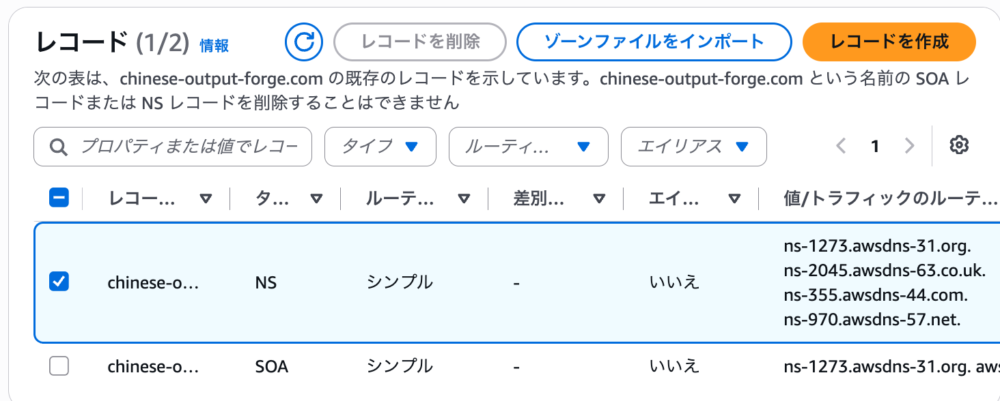

これは、**Route
53でこのホストゾーンを管理するために用意されたネームサーバー**である。

ただし、Route
53でホストゾーンを作成しただけでは、実際のドメインのネームサーバーが自動的にRoute
53へ切り替わるわけではない。

現在`chinese-output-forge.com`がどのネームサーバーによって管理されているのかを確認する。

以下の`dig`コマンドを実行する。

``` bash
dig chinese-output-forge.com NS +short
```

-   `dig`：DNSへ問い合わせを行うコマンド
-   `chinese-output-forge.com`：確認するドメイン
-   `NS`：NSレコード（ネームサーバー）を確認
-   `+short`：詳細情報を省略して結果のみ表示

実行結果は以下のようになった。

``` text
sh-5.2$ dig chinese-output-forge.com NS +short
ns-rs2.gmoserver.jp.
ns-rs1.gmoserver.jp.
sh-5.2$
```

Route
53ではAWSのネームサーバーが割り当てられているが、実際のドメインを確認すると、

``` text
ns-rs1.gmoserver.jp
ns-rs2.gmoserver.jp
```

となっている。

つまり、現在は以下の状態である。

``` text
Route 53
└─ chinese-output-forge.comのHosted Zoneを作成済み
   └─ Route 53のネームサーバーも割り当て済み

しかし

chinese-output-forge.com
└─ 現在指定されているネームサーバー
   ├─ ns-rs1.gmoserver.jp
   └─ ns-rs2.gmoserver.jp
```

したがって、**Route
53側にはDNSを管理する準備ができているものの、実際のドメインはまだお名前.com（GMO）側のネームサーバーを使用している**。

そこで、お名前.comの管理画面からネームサーバーを変更する。

# ネームサーバーを変更

お名前ドットコムにログインしネームサーバーの変更を選択

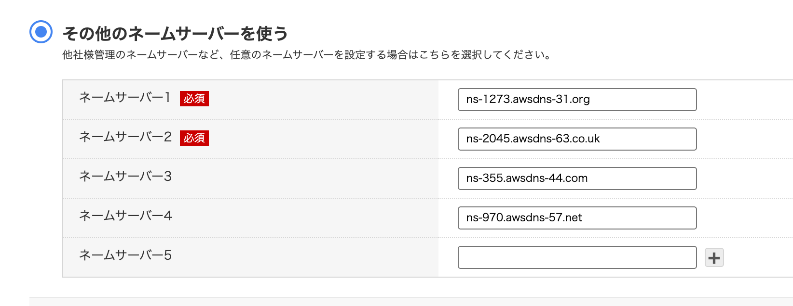

``` text
変更前

ns-rs1.gmoserver.jp
ns-rs2.gmoserver.jp

        ↓ 変更

変更後

ns-1273.awsdns-31.org
ns-2045.awsdns-63.co.uk
ns-355.awsdns-44.com
ns-970.awsdns-57.net
```

これによって、

``` text
chinese-output-forge.com
        ↓
Route 53のネームサーバー
        ↓
Route 53 Hosted Zone
        ↓
DNSレコード
```

という構成になり、`chinese-output-forge.com`のDNSをRoute
53で管理できるようになる。

ネームサーバー変更後、設定が反映されたことを再度`dig`で確認する。

``` bash
dig chinese-output-forge.com NS +short
```

ここでRoute 53の4つのネームサーバーが返ってくれば、**お名前.comからRoute
53へのネームサーバーの切り替えが完了したことを確認できる**。

    sh-5.2$ dig chinese-output-forge.com NS +short
    ns-355.awsdns-44.com.
    ns-970.awsdns-57.net.
    ns-1273.awsdns-31.org.
    ns-2045.awsdns-63.co.uk.
    sh-5.2$ 

# Aレコードの作成（ALBをRoute 53のAliasレコードのターゲットに設定）

ネームサーバーをRoute
53へ変更したことで、`chinese-output-forge.com`のDNSレコードをRoute
53で管理できるようになった。

次に、

``` text
chinese-output-forge.com
```

へアクセスしたときに、Chinese Output
Forgeで使用しているALBへトラフィックが送られるようにDNSレコードを設定する。

今回の構成では、EC2はPrivate
Subnetに配置されており、インターネットからEC2へ直接アクセスする構成にはしていない。

外部からのアクセスはPublic
Subnetに配置されたALBが受け取り、ALBからPrivate
Subnet内のEC2へ振り分ける。

``` text
インターネット
      ↓
chinese-output-forge.com
      ↓
   Route 53
      ↓
     ALB
   ↙     ↘
 EC2     EC2
```

そのため、Route
53からEC2へ直接ルーティングするのではなく、**ALBを接続先として設定する**。

## Aレコードとは

Aレコードは、ドメイン名の接続先をIPv4アドレスなどに対応付けるDNSレコード。

通常のAレコードでは、

``` text
example.com
    ↓
192.0.2.10
```

のように、ドメイン名とIPv4アドレスを対応付ける。

しかし、今回使用しているALBには固定のElastic
IPを割り当てることができず、ALBのIPアドレスはAWSによって管理されている。

そのため、ALBのIPアドレスを通常のAレコードに直接設定することはしない。

## Aliasレコードとは

Route
53には、AWSリソースをDNSの接続先として指定できる**Alias（エイリアス）**という機能がある。

Aliasを使用することで、

``` text
chinese-output-forge.com
        ↓
Aレコード（Alias）
        ↓
Application Load Balancer
```

という設定ができる。

これにより、ALBのIPアドレスを自分で管理する必要がなく、Route
53からALBへトラフィックをルーティングできる。

今回の構成では、

``` text
chinese-output-forge.com
        ↓
Route 53
Aレコード（Alias）
        ↓
       ALB
      ↙   ↘
    EC2   EC2
```

という経路を構築する。

## Aレコードを作成

以下からレコードの作成画面を開く。

``` text
Route 53
→ ホストゾーン
→ chinese-output-forge.com
→ レコードを作成
```

以下のように設定する。

``` text
レコード名：
空欄
→ chinese-output-forge.com自体を対象とする

レコードタイプ：
A

エイリアス：
ON

トラフィックのルーティング先：
Application Load BalancerとClassic Load Balancerへのエイリアス

リージョン：
アジアパシフィック（東京）

ALB：
dualstack.awseb--AWSEB-DmLPBs02Ky6b-820283635...

ルーティングポリシー：
シンプルルーティング

ターゲットのヘルスを評価：
はい
```

これによって、`chinese-output-forge.com`へのアクセスがRoute
53からElastic Beanstalk環境のALBへ送られるようになる。

``` text
ブラウザ
   ↓
chinese-output-forge.com
   ↓
Route 53
   ↓
Aレコード（Alias）
   ↓
ALB
   ↓
EC2 × 2
```

レコード作成後、

``` text
http://chinese-output-forge.com
```

へアクセスし、Chinese Output Forgeが正常に表示されることを確認する。

なお、現時点ではALBにHTTP（80）のリスナーのみを設定しているため、`https://chinese-output-forge.com`ではまだアクセスできない。

HTTPSでアクセスできるようにするには、今後ACMでSSL/TLS証明書を発行し、ALBにHTTPS（443）のリスナーを設定する必要がある。

# 実行

ブラウザから、

`chinese-output-forge.com`

にアクセスする。

そのままアクセスすると、ブラウザでは以下のように表示され、アクセスすることができなかった。

`This site can’t be reached`

しかし、URLを明示的にHTTPに変更して、

`http://chinese-output-forge.com`

へアクセスすると、Chinese Output
Forgeのトップページを正常に表示することができた。

これは、現時点のALBには**HTTP（80番ポート）のリスナーは設定されているが、HTTPS（443番ポート）のリスナーが設定されていないため**である。

現在の構成は以下のようになっている。

    http://chinese-output-forge.com
                ↓
             Route 53
                ↓
         Aレコード（Alias）
                ↓
               ALB
          HTTP : 80
                ↓
             EC2 × 2

一方、HTTPSについてはまだ以下の経路が構築されていない。

    https://chinese-output-forge.com
                ↓
           HTTPS : 443
                ↓
        SSL/TLS証明書が必要
                ↓
               ALB

ブラウザではドメイン名だけを入力した場合にHTTPSでのアクセスが試みられることがあるため、HTTPSに対応していない現在の状態ではアクセスに失敗した。

一方、`http://chinese-output-forge.com`を明示的に指定すると正常にトップページが表示された。

したがって、今回設定した、

    Route 53
        ↓
    Aレコード（Alias）
        ↓
       ALB
        ↓
     EC2 × 2

というルーティング自体は正常に機能していることが確認できた。

よって、現在の段階で**「Route 53 → ALB → EC2」の動作確認は完了**とする。

HTTPSについては、今後ACM（AWS Certificate
Manager）でSSL/TLS証明書を発行し、ALBにHTTPS（443番ポート）のリスナーを追加することで対応する。

# AWS Certificate Manager（ACM）でSSL/TLS証明書を発行

現状はHTTP通信でしかアプリを使えない状態なので、 AWS Certificate
Manager（ACM）を利用してHTTPS通信可能にする。

## AWS Certificate Manager（ACM）とは

AWS Certificate
Manager（ACM）は、**WebサイトなどでHTTPS通信を行うために必要なSSL/TLS証明書を管理するAWSサービス**。

ACMでドメインの証明書を発行し、ALBに設定することで、

`https://chinese-output-forge.com`

のようにHTTPSで安全にアクセスできるようになる。

    ブラウザ
        ↓
    HTTPS（443）
        ↓
    ALB
    └─ ACMのSSL/TLS証明書を使用
        ↓
    EC2

## ACMでSSL証明書を作成

マネジメントコンソール → Certificate Manager → 証明書のリクエスト
リクエストのタイプ選択で、\[パブリック証明書のリクエスト\]を選択 →
\[証明書のリクエスト\]

ドメイン名: `chinese-output-forge.com` エクスポートを許可しない
検証方法: DNS キーアルゴリズム: RSA2048

リクエスト後、「Route53でレコードを作成」を選択し、レコードを作成を押せばRoute
53のHosted Zoneに、ACMが指定したDNS検証用CNAMEレコードが自動作成される。

## ALBのHTTPSリスナーを追加

HTTPのリスナーしか設定していない状態のALBにHTTPSのリスナーを追加する。
その際に先ほど作成したSSL証明書を利用することになる。

\[EC2\] → \[ロードバランサー\] →
表示されたロードバランサー一覧から以前作成した\[awseb--AWSEB-DmLPBs02Ky6b\]を選択

ページ下部に表示されたALBの詳細情報の \[リスナー\]タブ →
\[リスナーの追加\]

プロトコル: HTTPS 事前ルーティングアクション: なし
アクションのルーティング: ターゲットグループへ転送 ターゲットグループ:
awseb-AWSEB-5VN9HORGZWNL
セキュリティポリシー：ELBSecurityPolicy-TLS13-1-2-Res-PQ-2025-09
証明書の取得先：ACMから(chinese-output-forge.com)

## セキュリティグループ修正

https://chinese-output-forge.com
にアクセスしてみると、タイムアウトになる。

原因は、ALBにつけているセキュリティグループが
HTTPS接続を許可していないため到達不可能になっている。

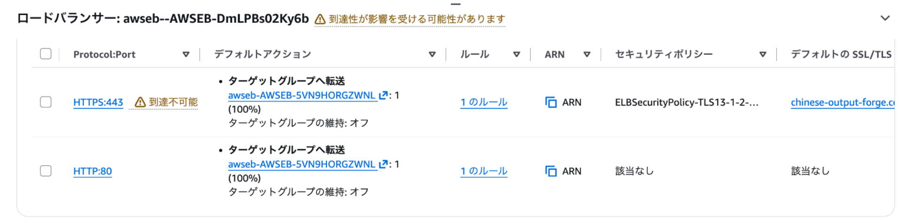

そこでABLのセキュリティグループの設定を修正する。

EC2 → ロードバランサー → awseb--AWSEB-DmLPBs02Ky6b → セキュリティ →
セキュリティグループ → インバウンドルール

このALBのセキュリティグループには現時点ではHTTP 80しかない。

インバウンドルールの追加で HTTPS Anywhere
IPv4　0.0.0.0/0でルールを保存する

HTTPS:443 到達不可能が消え、ブラウザでhttps://chinese-output-forge.com
にアクセスすることが可能となった。

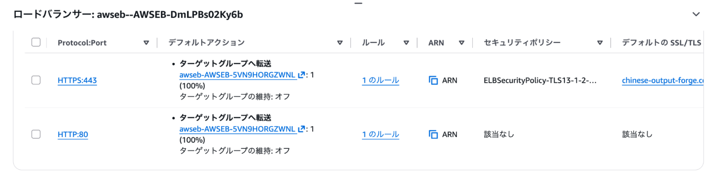

# 12. **CloudWatch / SNS**

AWS上でアプリケーションを運用する場合、システムが正常に稼働しているかを継続的に監視し、異常が発生した場合にすぐ気付ける仕組みが必要になる。

今回は、**Amazon CloudWatch**と**Amazon
SNS**を利用して、AWSリソースの監視とメール通知の仕組みを構築する。

## CloudWatchとは

CloudWatchは、**AWSサービスの監視やモニタリングを行うためのサービス**。

EC2などのAWSリソースから取得されるCPU使用率などの**メトリクス（リソースの状態を表すデータ）**を監視できる。

また、メトリクスに対して閾値を設定し、その条件を満たした場合に**CloudWatch
Alarm**を発生させることができる。

例えば、

`EC2のCPU使用率が60%を超えたらアラームを発生させる`

といった監視ができる。

## Amazon SNSとは

Amazon SNS（Simple Notification
Service）は、**通知を配信するためのサービス**。

SNSでは**Topic**を作成し、Publisher（発行者）がTopicへメッセージを送信すると、そのTopicを購読しているSubscriber（購読者）へ通知を配信できる。

Subscriberにはメールなどを設定できるため、CloudWatch
Alarmと組み合わせることで、AWSリソースで異常を検知した際にメールで通知を受け取ることができる。

## CloudWatchとSNSの連携

今回は、CloudWatchでEC2などのAWSリソースを監視し、設定した条件を満たした場合にCloudWatch
Alarmを発生させる。

発生したAlarmをSNSへ通知し、SNS
Topicを購読しているメールアドレスへ通知を送信する。

    EC2などのAWSリソース
            ↓
        CloudWatch
        メトリクスを監視
            ↓
      CloudWatch Alarm
        閾値を超過
            ↓
           SNS
            ↓
          Email
            ↓
          管理者

これにより、AWSコンソールを常に確認していなくても、システムの異常をメールで把握できるようにする。

    - EC2などのAWSリソースをCloudWatchで監視
    - 必要なCloudWatch Alarmを設定
    - Amazon SNS Topicを作成
    - SNSのEmail Subscriptionを設定
    - CloudWatch Alarm発生時にSNSを経由してメール通知する

## 設定の順番

CloutWatch → アラーム → アラームの作成 → メトリクス EC2を選択

## 設定値

i-0bb5977be49a76999 (Chinese-output-forge-env)　CPUUtilization 期間1分
しきい値 60% 通知はアラーム状態 トピック名: chinese-output-forge-alerts
アラーム名: chinese-output-forge-high-cpu-01 i-0d39b0bfb53bd20f8
(Chinese-output-forge-env)　CPUUtilization 期間1分 しきい値 60%
通知はアラーム状態 トピック名: chinese-output-forge-alerts アラーム名:
chinese-output-forge-high-cpu-02
(いっぺんに2つは選択できないので1つずつやる)

## 確認のメール

直後にAWSから

    You have chosen to subscribe to the topic:
    arn:aws:sns:ap-northeast-1:XXXXXXXXXX:chinese-output-forge-alerts

    To confirm this subscription, click or visit the link below (If this was in error no action is necessary):
    Confirm subscription

のようなメールが来るので、Confirm
subscriptionのリンクをクリックしてActiveにする

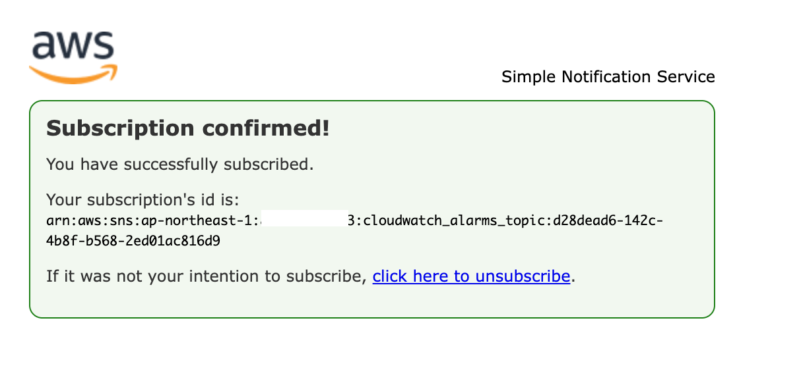

結果、CloudWatchのアラームに今作ったものが反映されるようになった

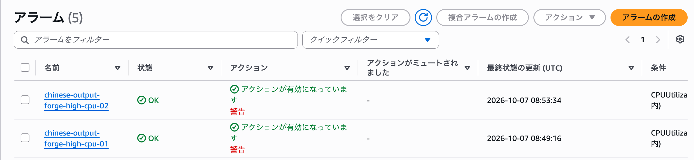

SNSにあくせすし、トピックを確認しても今作成したトピックを確認することができた。

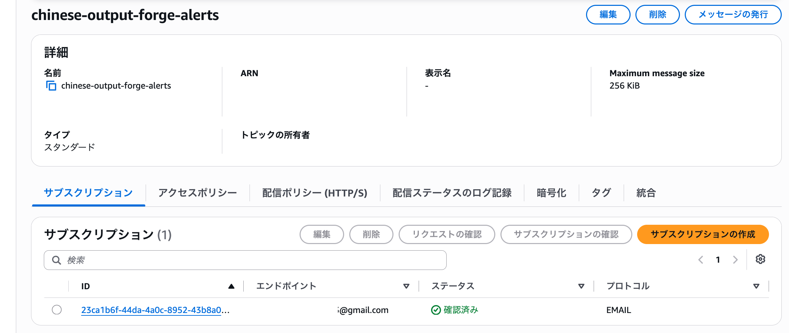

## 実験

CloudWatch AlarmとAmazon
SNSによる通知が正常に動作するか確認するため、EC2に意図的にCPU負荷をかける。

今回作成したCloudWatch
Alarmは、EC2の`CPUUtilization`が60%以上になった場合に`ALARM`状態となり、Amazon
SNSを経由してメール通知を送信するように設定している。

以下の流れで動作確認を行う。

    EC2にCPU負荷をかける
            ↓
    CPUUtilizationが60%以上になる
            ↓
    CloudWatch Alarm
    OK → ALARM
            ↓
    Amazon SNS
            ↓
    メール通知

### EC2に接続

AWSコンソールから以下の順に進む。

    EC2
    → インスタンス
    → Chinese-output-forge-envの監視対象インスタンスを選択
    → 接続
    → Session Manager
    → 接続

今回は2台のEC2のうち、`chinese-output-forge-high-cpu-01`で監視しているインスタンスに接続する。

### CPU負荷を発生させる

まず、EC2のvCPU数を確認する。

``` bash
nproc
```

今回は以下のように表示された。

``` text
2
```

2 vCPUであることを確認したため、以下のコマンドを2回実行する。

``` bash
yes > /dev/null &
```

### `yes > /dev/null &`とは

`yes`は、文字列を繰り返し出力し続けるLinuxコマンド。

``` bash
yes
```

を実行すると、`y`を繰り返し出力し続ける。

今回は出力内容そのものは必要ないため、

``` bash
> /dev/null
```

を付けて出力を破棄する。

さらに、

``` bash
&
```

を付けることでバックグラウンドで実行する。

つまり、

``` bash
yes > /dev/null &
```

は、`yes`による処理をバックグラウンドで継続して実行し、CPUに意図的に負荷をかけるために使用している。

今回は2
vCPUのEC2でこのコマンドを2つ実行し、CPU使用率を大きく上昇させる。

## 確認

CPU使用率を確認するため、EC2上で以下を実行する。

``` bash
top
```

### `top`とは

`top`は、LinuxでCPUやメモリの使用状況、実行中のプロセスなどをリアルタイムで確認するためのコマンド。

今回の実験では、`yes`プロセスによって実際にCPUへ負荷がかかっていることを確認するために使用する。

### CPU使用率の確認

以下のように表示された。

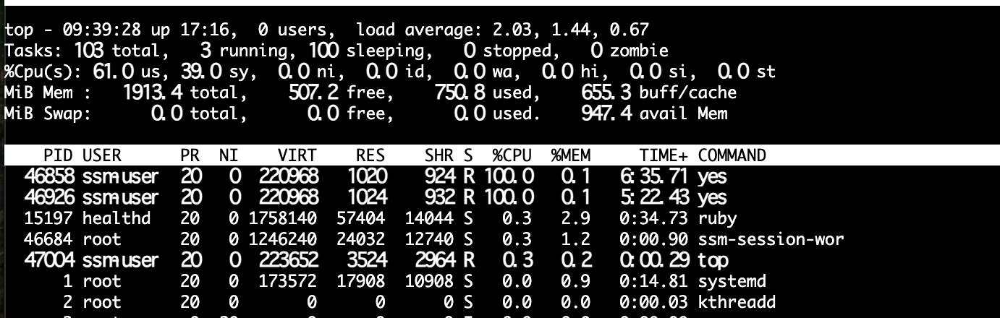

2つの`yes`プロセスがそれぞれ約100%のCPUを使用しており、CPU全体の`idle`もほぼ0%となっている。

狙いどおり、EC2のCPUに高い負荷がかかっていることを確認できた。

### CloudWatch Alarmの確認

CloudWatchのアラーム画面を確認する。

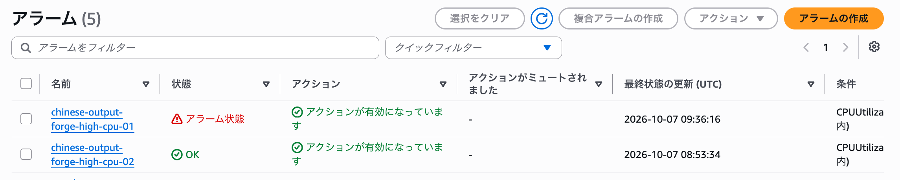 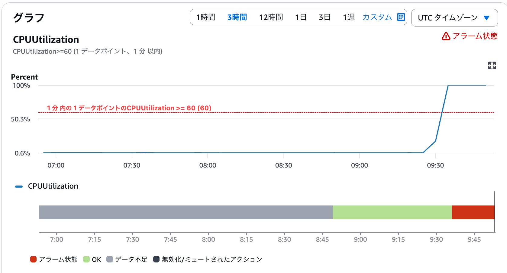

`chinese-output-forge-high-cpu-01`が、

``` text
OK → ALARM
```

へ遷移し、状態が「アラーム状態」になっていることを確認できた。

一方、CPU負荷をかけていないもう1台のEC2に設定したアラームは`OK`のままとなっている。

これにより、CPU負荷をかけたEC2の`CPUUtilization`をCloudWatchが検知していることを確認できた。

### Amazon SNSによるメール通知の確認

続いて、Amazon SNSに登録したメールアドレスを確認する。

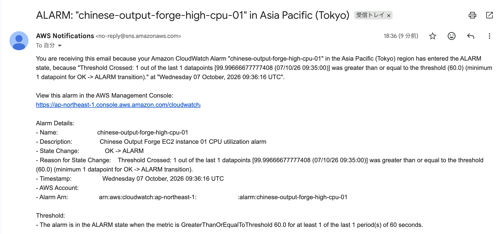

CloudWatch Alarmからメール通知が届いており、メール本文から、

``` text
CPUUtilization：約100%
しきい値：60%
状態：OK → ALARM
```

となったことを確認できた。

つまり、CPU使用率が設定したしきい値である60%以上になったことをCloudWatchが検知し、CloudWatch
Alarmが`ALARM`状態へ遷移したことで、Amazon
SNSを経由してメール通知が送信されたことが分かる。

以上により、

    CloudWatchによるEC2の監視
            ↓
    CloudWatch Alarmによる異常検知
            ↓
    Amazon SNSによるメール通知

までの一連の監視・通知処理が正常に動作することを確認できた。

## CPU負荷の解除

動作確認が完了したため、CPU負荷を発生させるために実行していた`yes`プロセスを停止する。

まず、現在実行されている`yes`プロセスを確認する。

``` bash
ps aux | grep yes
```

### `ps aux | grep yes`とは

`ps aux`は、現在実行されているプロセスの一覧を表示するコマンド。

``` bash
ps aux
```

だけでは多数のプロセスが表示されるため、`grep yes`を組み合わせて、`yes`という文字列を含むプロセスだけを抽出する。

``` bash
ps aux | grep yes
```

ここで使用している`|`（パイプ）は、左側のコマンドの出力を右側のコマンドへ渡すための記号。

つまり、

    ps aux
      ↓
    実行中のプロセス一覧
      ↓
    grep yes
      ↓
    「yes」を含む行だけ表示

という処理を行っている。

### 出力結果

以下のように表示された。

``` text
ssm-user   46858 99.2  0.0 220968  1020 pts/0    R    09:32  23:56 yes
ssm-user   46926 99.3  0.0 220968  1024 pts/0    R    09:34  22:43 yes
ssm-user   47764  0.0  0.1 221820  2284 pts/0    S+   09:56   0:00 grep yes
```

CPU負荷を発生させている`yes`プロセスは以下の2つ。

``` text
PID 46858
PID 46926
```

それぞれCPUを約99%使用していることも確認できる。

なお、

``` text
grep yes
```

の行は、今回実行した`grep yes`コマンド自身が検索結果に含まれているだけなので、停止する必要はない。

### `yes`プロセスを停止

確認したPIDを指定して、2つの`yes`プロセスを停止する。

``` bash
kill -9 46858
kill -9 46926
```

### `kill -9`とは

`kill`は、指定したPIDのプロセスにシグナルを送信するコマンド。

``` bash
kill -9 PID
```

の`-9`は`SIGKILL`を意味し、対象プロセスを強制的に終了させる。

今回はCPU負荷テスト用として実行した`yes`プロセスを確実に停止するために使用する。

### 停止確認

再度、以下を実行する。

``` bash
ps aux | grep yes
```

結果は以下のようになった。

``` text
ssm-user   47908  0.0  0.1 221820  2316 pts/0    S+   10:00   0:00 grep yes
```

先ほど存在していた、

``` text
46858 ... yes
46926 ... yes
```

の2つのプロセスが表示されなくなっている。

残っている`grep yes`は、確認のために実行した`grep`コマンド自身である。

したがって、CPU負荷を発生させていた2つの`yes`プロセスが正常に停止し、CPU負荷が解除されたことを確認できた。

### CloudWatchも確認

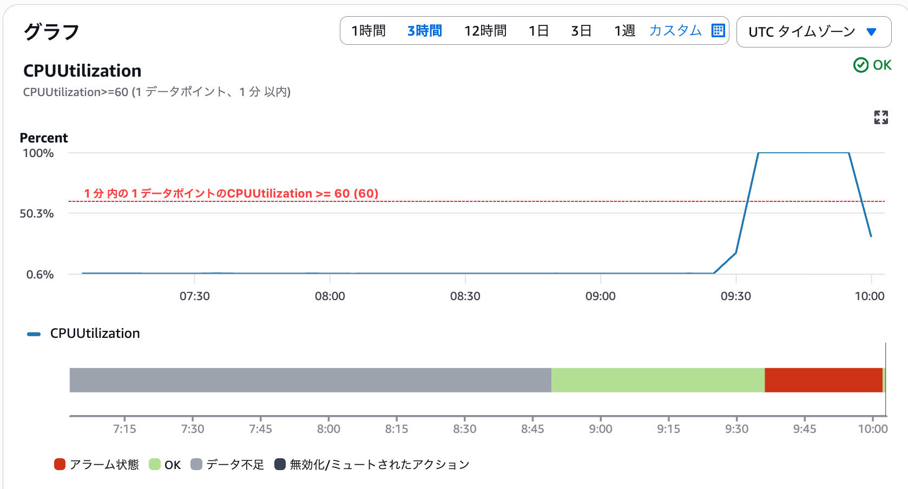

CPU仕様率が60%を切っていることが確認できた

# 14. **高可用性構成の動作確認**

ここまで、Elastic Beanstalkを中心として、ALB、複数のEC2、RDS、Route
53、CloudWatch、Amazon SNSなどを組み合わせて、Chinese Output
ForgeをAWS上にデプロイするための環境を構築してきた。

各AWSサービスについては構築時に個別の動作確認を行っているが、ここでは改めて、これまで構築したAWS環境がシステム全体として正常に連携していることを確認する。

現在の主な構成は以下のようになっている。

    ユーザー
        ↓
    Route 53
        ↓
       ALB
      ↙   ↘
    EC2   EC2
      ↘   ↙
       RDS
    （Multi-AZ）

また、Elastic BeanstalkのAuto Scaling
Groupによって複数のEC2を維持し、CloudWatch / Amazon
SNSによってAWSリソースの監視とメール通知を行う構成としている。

この章では、新しいAWSサービスを導入するのではなく、これまで構築した環境について以下の点を確認する。

-   Route 53からALBを経由してアプリケーションへアクセスできること
-   複数のEC2が正常に稼働していること
-   ALBのTarget Groupで各EC2がHealthyになっていること
-   Auto Scaling Groupによって必要なEC2台数が維持されていること
-   EC2からRDSへ正常に接続できること
-   RDSがMulti-AZ構成になっていること
-   Private SubnetのEC2が必要な外部通信を行えること
-   CloudWatch / Amazon SNSによる監視・通知が正常に動作すること

以上を確認することで、Chinese Output
ForgeのAWS環境が、複数のサービスを組み合わせた高可用性構成として正常に動作していることを確認する。

# Route 53からALBを経由してアプリケーションへアクセスできること

https://chinese-output-forge.com ↓ Route 53 ↓ Aレコード（Alias） ↓ ALB
HTTPS : 443 ACM証明書 ↓ Target Group ↙ ↘ EC2 EC2

まで実際にアクセスして確認できたので、問題ない。

# 複数のEC2が正常に稼働していること

Chinese Output Forgeでは、可用性を高めるためにElastic
Beanstalkによって複数のEC2インスタンスを起動している。

現在は2台のEC2を異なるAvailability
Zoneで稼働させ、ALBからトラフィックを振り分ける構成としている。

    ALB

↙ ↘ EC2 EC2 AZ1 AZ2

そのため、まず2台のEC2インスタンスが正常に稼働していることを確認する。

AWSマネジメントコンソールから、

    EC2
    → インスタンス
    → インスタンス

を開く。

Chinese Output Forgeで使用している2台のEC2について、以下を確認する。

-   インスタンスの状態が「実行中」になっていること
-   ステータスチェックに合格していること
-   2台ともChinese Output ForgeのElastic
    Beanstalk環境で使用されていること

これにより、アプリケーションを実行する複数のEC2インスタンスが正常に稼働していることを確認する。

前者2つは 以下の画像のようにクリアしていた。

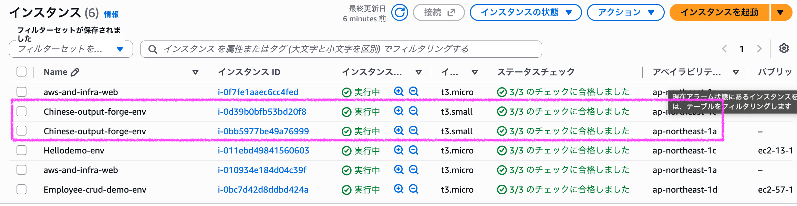

また「2台ともChinese Output ForgeのElastic
Beanstalk環境で使用されていること」については、
2台のEC2インスタンスのタグを確認したところ、両方に以下のタグが設定されていた。

    elasticbeanstalk:environment-name
    Chinese-output-forge-env

    elasticbeanstalk:environment-id
    e-zyn7qndvut

また、両方のEC2が同じAuto Scaling Groupに所属していることも確認できた。

これにより、2台のEC2がいずれもChinese Output ForgeのElastic
Beanstalk環境によって管理されているインスタンスであることを確認した。

# ALBのTarget Groupで各EC2がHealthyになっていること

ALBは受信したリクエストをTarget Groupに登録されているEC2へ振り分ける。

ただし、単にEC2が起動しているだけではなく、ALBから実際にリクエストを転送できる状態である必要がある。

そのため、ALBはTarget
Groupに登録されている各EC2に対して定期的に**ヘルスチェック**を行っている。

ヘルスチェックに成功しているEC2は、

    Healthy

と判定され、ALBのトラフィック転送先として使用される。

今回の構成では、

              ALB
               ↓
          Target Group
           ↙       ↘
        EC2①       EC2②
       Healthy    Healthy

となっていることを確認する。

AWSマネジメントコンソールから、

    EC2
    → ターゲットグループ
    → Chinese Output Forgeで使用しているTarget Group
    → ターゲット

を開き、登録されている2台のEC2のヘルスステータスを確認する。

## 結果

Target
Groupの「登録済みターゲット」を確認すると、2台のEC2が登録されており、どちらもヘルスステータスが`Healthy`となっていることを確認できた。

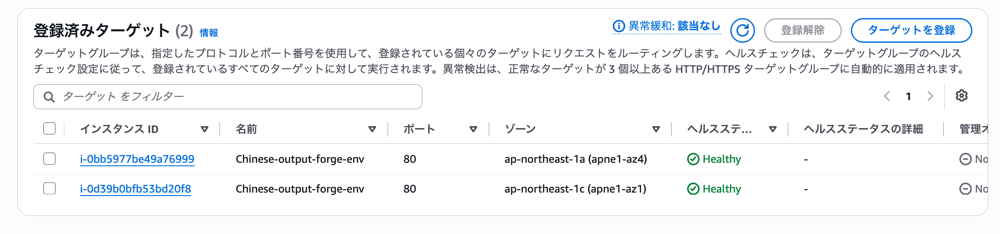

また、2台のEC2はそれぞれ異なるAvailability Zoneに配置されている。

    EC2①
    Availability Zone：ap-northeast-1a
    Health：Healthy

    EC2②
    Availability Zone：ap-northeast-1c
    Health：Healthy

これにより、ALBから両方のEC2に対するヘルスチェックが正常に成功しており、2台ともALBのトラフィック転送先として利用できる状態であることを確認した。

# Auto Scaling Groupによって必要なEC2台数が維持されていること

Chinese Output Forgeでは、Elastic BeanstalkのAuto Scaling
GroupによってEC2インスタンスの台数を管理している。

Auto Scaling
Groupでは、必要なEC2インスタンス数を設定しておくことで、インスタンスに障害が発生した場合などにも、設定された台数を維持するようにEC2の起動・終了を自動的に行うことができる。

今回の環境では、EC2を2台稼働させる構成としている。

    Auto Scaling Group
          │
          ├─ EC2①
          └─ EC2②

そのため、Auto Scaling
Groupの設定と現在のインスタンス数を確認し、必要な2台のEC2が維持されていることを確認する。

AWSマネジメントコンソールから、

    EC2
    → Auto Scaling グループ
    → Chinese Output Forgeで使用しているAuto Scaling Group

を開く。

以下の項目を確認する。

-   希望するキャパシティ（Desired capacity）が2
-   最小キャパシティ（Min desired capacity）が2
-   最大キャパシティ（Max desired capacity）が2
-   実際に2台のEC2インスタンスがAuto Scaling Groupに所属していること

これにより、Auto Scaling
Groupによって必要なEC2インスタンス数が維持されていることを確認する。

### 結果

Auto Scaling Groupを確認すると、以下のように設定されていた。

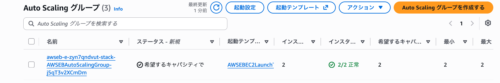

    現在のインスタンス数：2
    インスタンスヘルス：2/2 正常
    希望するキャパシティ：2
    最小キャパシティ：2
    最大キャパシティ：2

希望するキャパシティが2に設定されており、実際に2台のEC2インスタンスが稼働している。

また、インスタンスヘルスも`2/2 正常`となっていることを確認できた。

これにより、Auto Scaling
Groupによって必要な2台のEC2インスタンスが維持されていることを確認した。

# EC2からRDSへ正常に接続できること

Chinese Output Forgeでは、Spring
BootアプリケーションをEC2上で実行し、データベースとしてAmazon
RDS（PostgreSQL）を使用している。

そのため、EC2からRDSへ正常に通信できることを確認する。

現在の構成では、インターネットからRDSへ直接アクセスさせるのではなく、アプリケーションを実行するEC2からRDSへ接続する構成としている。

    ユーザー
        ↓
       ALB
        ↓
       EC2
        ↓
       RDS
    PostgreSQL

## Session ManagerでEC2へ接続

AWSマネジメントコンソールから、

    EC2
    → インスタンス
    → Chinese Output ForgeのEC2を選択
    → 接続
    → セッションマネージャー
    → 接続

の順に進み、EC2へ接続する。

接続すると、以下のようなプロンプトが表示される。

``` text
sh-5.2$
```

## EC2からRDSへの通信を確認

EC2からRDSのPostgreSQLが使用しているTCP
5432番ポートへ到達できることを確認する。

以下のコマンドを実行する。

``` bash
timeout 5 bash -c 'cat < /dev/null > /dev/tcp/chinese-output-forge-db.c32cwi4eqr3d.ap-northeast-1.rds.amazonaws.com/5432' && echo "Connection succeeded" || echo "Connection failed"
```

このコマンドでは、EC2からRDSのエンドポイントに対してTCP
5432番ポートへの接続を試みる。

接続に成功した場合は、

``` text
Connection succeeded
```

接続できなかった場合は、

``` text
Connection failed
```

と表示される。

実行したところ、以下の結果となった。

``` text
Connection succeeded
```

したがって、

    EC2
     ↓
    TCP : 5432
     ↓
    RDS（PostgreSQL）
     ↓
    Connection succeeded

となり、**EC2からRDSのPostgreSQLが使用する5432番ポートへ正常に通信できることを確認できた**。

また、実際にEC2上で稼働しているSpring
BootアプリケーションからRDS上のデータを利用する機能も正常に動作している。

以上から、EC2からRDSへ正常に接続できることを確認した。

# RDSがMulti-AZ構成になっていること

Chinese Output Forgeでは、データベースとしてAmazon
RDS（PostgreSQL）を使用している。

RDSはMulti-AZ構成とし、1つのAvailability
Zoneだけに依存しない構成としている。

Multi-AZでは、異なるAvailability
Zoneにデータベースを配置することで、障害発生時の可用性を高めることができる。

    Availability Zone 1
    RDS
      │
      │ Multi-AZ
      ↓
    Availability Zone 2
    RDS

一方のAvailability
ZoneやDBインスタンスに障害が発生した場合には、別のAvailability
Zone側へフェイルオーバーできる構成となる。

そのため、Chinese Output
Forgeで使用しているRDSが実際にMulti-AZ構成になっていることを確認する。

AWSマネジメントコンソールから、

    RDS
    → データベース
    → Chinese Output Forgeで使用しているデータベース

を開き、Multi-AZに関する設定を確認する。

## RDSの設定を確認

AWSマネジメントコンソールから、

    RDS
    → データベース
    → chinese-output-forge-db
    → 設定

を開き、「可用性」の設定を確認する。

確認したところ、以下のように表示されていた。

``` text
マルチ AZ
あり

セカンダリゾーン
ap-northeast-1a
```

`マルチ AZ`が`あり`となっているため、RDSがMulti-AZ構成になっていることを確認できた。

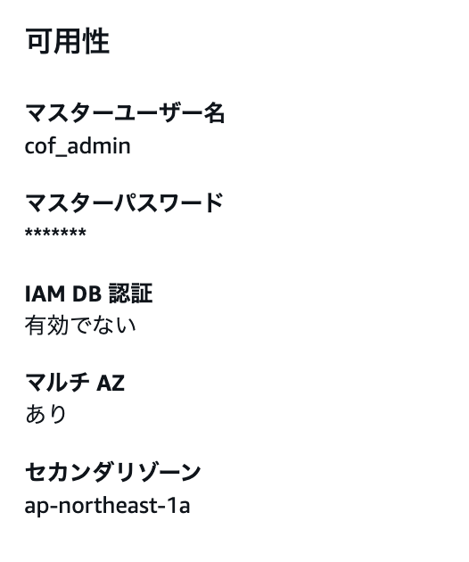

また、`セカンダリゾーン`として`ap-northeast-1a`が表示されており、Multi-AZ構成のセカンダリ側が別のAvailability
Zoneに用意されていることも確認できる。

    RDS PostgreSQL
          │
          │ Multi-AZ：あり
          ↓
    セカンダリ
    ap-northeast-1a

これにより、1つのAvailability
Zoneだけに依存する構成ではなく、障害発生時に別のAvailability
ZoneへフェイルオーバーできるMulti-AZ構成となっていることを確認した。

以上から、**RDSがMulti-AZ構成になっていることを確認できた**。

# Private SubnetのEC2が必要な外部通信を行えること

Chinese Output Forgeでは、Spring
Bootアプリケーションを実行するEC2をPrivate Subnetに配置している。

Private
Subnetに配置されたEC2は、インターネットから直接アクセスされる構成にはなっていない。

ユーザーからアプリケーションへのアクセスは、Public
Subnetに配置されたALBを経由してEC2へ転送される。

    インターネット
         ↓
        ALB
    Public Subnet
         ↓
        EC2
    Private Subnet

一方で、EC2から外部APIやAWSサービスなどへアクセスするため、インターネットへの外向き通信が必要になる場合がある。

そのため、Private SubnetのEC2からNAT
Gatewayを経由してインターネットへアクセスできる構成としている。

    Private Subnet
        EC2
         ↓
    Route Table
         ↓
    NAT Gateway
    Public Subnet
         ↓
    Internet Gateway
         ↓
    インターネット

これにより、インターネット側からEC2へ直接アクセスできるようにすることなく、EC2から必要な外向き通信を行うことができる。

そこで、

1.  NAT Gatewayが正常に稼働していること
2.  Private App SubnetのルートテーブルがNAT
    Gatewayを使用する設定になっていること
3.  EC2から実際に外部へHTTPS通信できること

を確認する。

## NAT Gatewayを確認

AWSマネジメントコンソールから、

    VPC
    → NAT ゲートウェイ

を開く。

確認したところ、2つのNAT Gatewayが存在していた。

``` text
chinese-output-forge-nat-gateway-1a
状態：Available

chinese-output-forge-nat-gateway-1c
状態：Available
```

2つとも`Available`となっているため、NAT
Gatewayが正常に利用できる状態であることを確認できた。

また、Availability ZoneごとにNAT Gatewayを用意する構成としている。

    Availability Zone 1a
    Public Subnet
        └ NAT Gateway 1a

    Availability Zone 1c
    Public Subnet
        └ NAT Gateway 1c

## Private App Subnetのルートテーブルを確認

次に、Private App Subnetに関連付けられているルートテーブルを確認する。

Availability Zone 1a側では、

``` text
chinese-output-forge-private-app-route-1a

送信先：0.0.0.0/0
ターゲット：nat-0f6e6cbf475766542
ステータス：アクティブ
```

となっていた。

このNAT Gatewayは、

``` text
chinese-output-forge-nat-gateway-1a
```

である。

したがって、1a側では以下の経路となる。

    Private App Subnet 1a
             ↓
    Route Table
    0.0.0.0/0
             ↓
    NAT Gateway 1a
             ↓
        インターネット

Availability Zone 1c側では、

``` text
chinese-output-forge-private-app-route-1c

送信先：0.0.0.0/0
ターゲット：nat-027eedc8b9ad83b0e
ステータス：アクティブ
```

となっていた。

このNAT Gatewayは、

``` text
chinese-output-forge-nat-gateway-1c
```

である。

したがって、1c側でも以下の経路となる。

    Private App Subnet 1c
             ↓
    Route Table
    0.0.0.0/0
             ↓
    NAT Gateway 1c
             ↓
        インターネット

これにより、それぞれのPrivate App
SubnetからVPC外へ向かう通信が、各Availability ZoneのNAT
Gatewayへルーティングされる設定になっていることを確認できた。

## EC2から外部へのHTTPS通信を確認

ルートテーブルの設定だけでなく、実際にPrivate
SubnetのEC2からインターネットへ通信できることを確認する。

Session Managerを使用してEC2へ接続し、以下のコマンドを実行する。

``` bash
curl -I https://aws.amazon.com
```

実行したところ、以下のレスポンスが返された。

``` text
HTTP/2 200
```

`HTTP/2 200`が返されたため、EC2から外部のHTTPSサービスへ正常にアクセスできることを確認できた。

今回確認した通信経路は以下となる。

    Private App Subnet
          EC2
           ↓
      Route Table
      0.0.0.0/0
           ↓
      NAT Gateway
           ↓
    Internet Gateway
           ↓
      インターネット
           ↓
    https://aws.amazon.com
           ↓
       HTTP/2 200

以上から、Private Subnetに配置されたEC2がNAT
Gatewayを経由して必要な外部通信を行えることを確認した。

# CloudWatch / Amazon SNSによる監視・通知が正常に動作すること

CloudWatch / Amazon
SNSの構築時に、EC2へ意図的にCPU負荷を発生させ、監視・通知が正常に動作することを確認済みである。

確認した流れは以下の通り。

    EC2のCPU使用率上昇
        ↓
    CloudWatch AlarmがALARMへ遷移
        ↓
    Amazon SNSへ通知
        ↓
    登録したメールアドレスで通知メールを受信

以上から、CloudWatchによる監視およびAmazon
SNSによるメール通知が正常に動作することを確認済みである。

# 高可用性構成の動作確認完了

以上の確認により、Chinese Output
Forgeが構築した高可用性構成で正常に動作することを確認できた。

Route 53、ALB、複数EC2、RDS Multi-AZ、NAT Gateway、CloudWatch / Amazon
SNSを含め、想定したAWS構成でアプリケーションが正常に稼働している。

これで高可用性構成でのデプロイおよび動作確認を完了とする。

**低コスト構成への変更** はチャプター32でやることにする。
