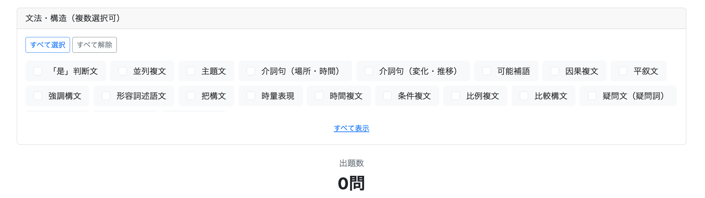
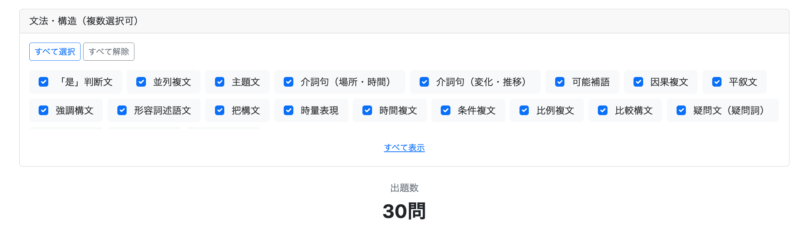

# 011 復習モードの実装 その3 - Structureによる出題条件の追加

今回の実装では、復習モードに文法・構造（Structure）による絞り込みを追加した。

当初は `Question` が `structure` を文字列として直接保持する既存設計を利用して実装を進めたが、文法・構造の説明を表示する機能まで検討した結果、Structureそのものを独立したマスタデータとして管理する設計へ変更した。

そのため今回は、単純な復習条件の追加だけではなく、

- Structureによる復習問題の絞り込み
- Structureのマスタテーブル化
- `Question` と `Structure` のリレーション化
- 既存データの移行
- 既存の復習処理の修正
- Structureの説明表示

まで行うことになった。

---

## 1. Structureを復習条件として追加する

復習モードではこれまで、

- 理解度
- 難易度
- お気に入り

などを条件として問題を絞り込めるようにしていた。

今回はここに文法・構造を追加した。

例えば、

```text
☑ 可能補語
☑ 把構文
☐ 比較構文
☐ 因果複文
```

のように選択することで、復習したい文法・構造を指定できるようにする。

### Structureは複数選択とする

文法・構造は1種類だけではなく、

```text
可能補語 + 把構文
```

のように複数をまとめて復習することが考えられる。

そのためラジオボタンではなくチェックボックスとした。

また、文法・構造の種類が多いため、

```text
すべて選択
すべて解除
```

も用意した。

これにより、特定のStructureだけを除外するといった使い方もしやすくなった。

---

## 2. 文法・構造の選択肢が増えた場合のUIを考える

Structureの種類は現時点でも20種類存在する。

すべてをそのまま表示すると、復習メニューの文法・構造欄だけでかなりの高さを使用する。

さらに今後Structureが増える可能性もある。

そこで、初期状態では一定の高さまで表示し、

```text
すべて表示
```

を押した場合のみ全件表示するようにした。

CSSでは、

```css
.structure-list {
    max-height: 100px;
    overflow: hidden;
}

.structure-list.expanded {
    max-height: none;
}
```

としている。

通常時は `max-height` を設定し、展開時に `expanded` クラスを追加して高さ制限を解除する。

JavaScriptでは、

```javascript
const expanded =
    structureList.classList.toggle("expanded");
```

によってクラスの追加と削除を切り替えている。

このように、

```text
HTML
→ 対象となる要素を定義

CSS
→ 通常時と展開時の表示を定義

JavaScript
→ expandedを付け外しする
```

という役割分担になっている。

---

## 3. Structureを文字列のまま管理することの問題

当初の `Question` は、

```java
@Column(name = "structure", nullable = false)
private String structure;
```

となっていた。

つまり、

```text
Question 1
structure = "可能補語"

Question 2
structure = "可能補語"

Question 3
structure = "把構文"
```

のように、各Questionが文法・構造名を文字列として直接保持していた。

復習条件としてStructureを使用するだけなら、この構造でも実装できる。

実際、最初は、

```sql
SELECT DISTINCT structure
FROM question
ORDER BY structure
```

としてQuestionからStructure一覧を取得した。

しかし、文法・構造名を復習条件として表示すると別の問題が出てきた。

例えばユーザーが、

```text
可能補語
比例複文
累加複文
```

という名称を見ても、その文法・構造が具体的に何を意味するのか分からない可能性がある。

そこで、Structureごとに説明を持たせることにした。

```text
可能補語

動作や結果が実現できるか、
できないかを表す形式。
```

こうなるとStructureは単なるQuestionの属性値ではなく、

```text
Structure
├── ID
├── 名前
└── 説明
```

という独立したデータとして扱った方が自然になる。

そのため、途中でStructureをマスタテーブル化する設計へ変更した。

---

## 4. Structureをマスタテーブルとして管理する

新しく、

```text
structure
├── structure_id
├── name
├── description_zh_cn
└── description_zh_tw
```

というテーブルを作成した。

Entityも、

```java
@Entity
@Table(name = "structure")
@Getter
@Setter
public class Structure {

    @Id
    @GeneratedValue(strategy = GenerationType.IDENTITY)
    @Column(name = "structure_id")
    private Long structureId;

    @Column(name = "name", nullable = false, unique = true)
    private String name;

    @Column(name = "description_zh_cn", nullable = false)
    private String descriptionZhCn;

    @Column(name = "description_zh_tw", nullable = false)
    private String descriptionZhTw;
}
```

とした。

### nameをUNIQUEにする理由

`name` には、

```text
可能補語
把構文
因果複文
```

などのStructure名を保持する。

同じ「可能補語」というStructureが複数レコード存在する必要はないため、

```java
unique = true
```

として重複を禁止した。

---

## 5. Structureの説明を2種類保持する理由

当初は、

```text
description
```

を1つだけ持たせることも考えた。

しかし、本アプリでは、

```text
MAINLAND
TAIWAN
```

という学習対象言語を切り替えられる。

説明そのものが日本語であっても、説明中に中国語の代表表現を含める場合がある。

例えば因果複文なら、

```text
大陸普通話向け

原因・理由と、それによって生じる結果を表す複文。
「因为～所以～」「既然～就～」など。
```

に対して、

```text
台湾華語向け

原因・理由と、それによって生じる結果を表す複文。
「因為～所以～」「既然～就～」など。
```

となる。

そのため、

```text
description_zh_cn
description_zh_tw
```

の2つを保持することにした。

ここで重要なのは、この切り替えが**サイト表記言語ではなく学習対象言語に連動する**ことである。

```text
session.languageVariant

MAINLAND
└── descriptionZhCn

TAIWAN
└── descriptionZhTw
```

となる。

---

## 6. QuestionとStructureをManyToOneにする

Structureを独立したEntityにしたため、Questionも文字列ではなくStructureを参照するように変更した。

変更前は、

```java
@Column(name = "structure", nullable = false)
private String structure;
```

だった。

これを、

```java
@ManyToOne
@JoinColumn(name = "structure_id", nullable = false)
private Structure structure;
```

へ変更した。

関係としては、

```text
Structure
    1
    │
    │
    N
Question
```

となる。

例えば、

```text
可能補語
    │
    ├── 这么多菜，我们吃不完。
    ├── 这个箱子太重了，我搬不动。
    └── 他说得太快，我听不懂。
```

のように、1つのStructureに複数のQuestionが属する。

したがってQuestion側から見ると、

```text
多くのQuestion
        ↓
1つのStructure
```

なので `@ManyToOne` となる。

`@JoinColumn(name = "structure_id")` は、Question側でStructureとの関連を保持するDBカラムが `structure_id` であることを指定している。

---

## 7. 既存データがある状態でリレーションを変更する

今回特に注意が必要だったのが、すでに60問のQuestionが存在していたことである。

いきなり、

```java
@ManyToOne
@JoinColumn(name = "structure_id", nullable = false)
private Structure structure;
```

としてしまうと、既存60問には `structure_id` が存在しない。

そのため、段階的に移行した。

まず、

```java
@ManyToOne
@JoinColumn(name = "structure_id")
private Structure structure;
```

として一時的にNULLを許可した。

するとDBでは、

```text
question
├── question_id
├── structure       ← 旧文字列カラム
└── structure_id    ← 新しいFK
```

という新旧カラムが共存する状態になる。

この状態を利用して、

```sql
UPDATE question q
SET structure_id = s.structure_id
FROM structure s
WHERE q.structure = s.name;
```

を実行した。

つまり、

```text
question.structure
"可能補語"
        ↓
structure.name
"可能補語"
        ↓
structure.structure_id
6
        ↓
question.structure_id
6
```

という対応付けを行った。

この方法なら、既存の文字列を移行の手掛かりとして利用できる。

移行完了を確認してから、

```sql
ALTER TABLE question
DROP COLUMN structure;
```

で旧カラムを削除した。

最後に、

```java
@JoinColumn(name = "structure_id", nullable = false)
```

としてQuestionからStructureへの関連を必須に戻した。

既存データを持つカラムをリレーションへ変更する場合は、

```text
新しいカラムを追加
↓
旧データを利用して新カラムへ移行
↓
移行結果を確認
↓
旧カラムを削除
↓
NOT NULL制約を設定
```

という順番で行えば、安全に移行できる。

---

## 8. マスタ化によってStructure一覧の取得方法も変わる

Structureをマスタ化する前は、

```java
public List<String> findStructures() {
    return questionRepository.findDistinctStructures();
}
```

としていた。

これは、

```text
Question
↓
structure文字列をDISTINCT
↓
Structure一覧
```

という取得方法である。

しかしStructureテーブルを作った後は、この処理は不要になる。

```java
public List<Structure> findStructures() {
    return structureRepository.findAll();
}
```

とすればよい。

つまり、

```text
変更前

QuestionRepository
└── QuestionからStructureを逆算する
```

から、

```text
変更後

StructureRepository
└── Structureそのものを取得する
```

へ変わった。

マスタテーブルを作ったことで、Structure一覧の取得元も明確になった。

---

## 9. HTMLでは表示する値と送信する値を分ける

以前の `structures` は、

```java
List<String>
```

だった。

そのためHTMLでは、

```html
th:value="${structure}"
th:text="${structure}"
```

でよかった。

しかし現在は、

```java
List<Structure>
```

である。

そこで、

```html
<input
    name="structureIds"
    th:value="${structure.structureId}">

<span th:text="${structure.name}">
</span>
```

とした。

これにより、

```text
ユーザーに表示する値
→ structure.name
→ 可能補語

サーバーへ送信する値
→ structure.structureId
→ 6
```

と分けられる。

マスタデータを使用する場合、名称そのものではなくIDを検索条件としてやり取りすることで、DB上のリレーションとそのまま対応させられる。

---

## 10. 問題数取得と問題取得の検索条件を揃える

復習メニューには、

```text
○問
```

という問題数が表示される。

一方、「開始」を押すと実際のQuestion一覧を取得する。

そのため、

```text
問題数を数える条件
```

と、

```text
実際に問題を取得する条件
```

は一致している必要がある。

今回Structureを追加したため、問題数取得には、

```sql
AND q.structure_id IN (:structureIds)
```

を追加した。

同様に、問題取得にも、

```sql
AND q.structure_id IN (:structureIds)
```

を追加した。

もし片方だけにStructure条件を追加すると、

```text
画面表示
8問

↓

実際に開始

20問
```

のような不整合が発生する。

検索機能では、件数取得と実データ取得が別メソッドになっている場合、検索条件を両方へ反映する必要がある。

---

## 11. StructureテーブルをJOINしなくても検索できる

Structureをマスタテーブル化したので、当初は復習問題を検索するときにも、

```sql
JOIN structure s
ON q.structure_id = s.structure_id
```

が必要かと考えた。

しかし今回の検索ではStructureの名称や説明をSQL内で使用しない。

必要なのは、

```text
選択されたstructure_id
```

と、

```text
question.structure_id
```

が一致しているかどうかだけである。

そのため、

```sql
AND q.structure_id IN (:structureIds)
```

だけで検索できる。

Structureテーブルの、

```text
name
description_zh_cn
description_zh_tw
```

をSQL内で利用する場合にはJOINが必要になるが、外部キーのIDだけで判定できる場合はJOINする必要はない。

---

## 12. Structureの説明をTooltipで表示する

Structureの名称だけでは内容が分からない場合があるため、カーソルを合わせると説明を表示できるようにした。

ここではBootstrapのTooltipを使用した。

Tooltipとは、ある要素にカーソルを合わせたときに、その付近に一時的に表示される補足説明である。

HTMLでは、

```html
data-bs-toggle="tooltip"
data-bs-placement="top"
```

によってTooltipを使用する要素と表示位置を指定する。

説明内容は、

```html
th:data-bs-title="${session.languageVariant != null
                    && session.languageVariant.name() == 'TAIWAN'
                    ? structure.descriptionZhTw
                    : structure.descriptionZhCn}"
```

としている。

これにより、

```text
TAIWAN
→ descriptionZhTw

それ以外
→ descriptionZhCn
```

となる。

JavaScriptでは、

```javascript
const tooltipTriggerList =
    document.querySelectorAll('[data-bs-toggle="tooltip"]');

tooltipTriggerList.forEach(element => {
    new bootstrap.Tooltip(element);
});
```

としている。

ここでは、

```text
data-bs-toggle="tooltip"
```

が設定された要素をすべて取得し、それぞれについてBootstrapのTooltipを生成している。

さらにCSSで、

```css
.tooltip-inner {
    max-width: 400px;
    padding: 12px 16px;
    font-size: 1rem;
    text-align: left;
}
```

として、説明文を読みやすくした。

役割として整理すると、

```text
HTML
→ どの要素に何の説明を表示するか

JavaScript
→ Tooltipを実際に動作させる

CSS
→ Tooltipの見た目を調整する
```

となる。

---

## 13. 実装を終えて

復習モードの実装自体は、本来そこまで難解なものではない。

通常学習モードをすでに実装しているため、そこで作成したController、Service、Repository、問題表示画面などを使い回したり、処理を流用したりできる部分が多いからである。

復習モード特有の部分としては、メニュー画面で検索条件に応じた問題数を動的に表示するための `@ResponseBody` を使用したControllerや、複数の検索条件を組み合わせるRepositoryのクエリを作成するときに少々頭を使う程度であった。

しかし今回は、実装途中で `question` テーブルの `structure` フィールドを独立した `structure` テーブルとして管理する方向へ設計を変更したため、結果的にかなり遠回りな実装となった。

実際の流れは以下のようになった。

```text
旧データ構造でメニュー画面表示・問題取得処理を実装
（本チャプター1・2）
        ↓
データ構造の変更を決定
        ↓
requirements内の各要件定義・設計書を見直して修正
        ↓
旧データ構造から新データ構造へ移行
（本チャプター3）
        ↓
旧データ構造を前提に作成した復習処理を
新データ構造に合わせて修正
（本チャプター4）
        ↓
文法・構造のチェックボックスに説明を表示
（本チャプター5）
```

特にデータ移行では、すでに登録されている60問のQuestionを壊さないようにする必要があった。

そのため、いきなり旧 `structure` カラムを削除するのではなく、

```text
旧 structure（文字列）
+
新 structure_id（外部キー）
```

を一時的に共存させ、旧 `structure` の値と `structure.name` を対応させて `structure_id` へ変換した。

その後、すべてのQuestionに正しく `structure_id` が設定されたことを確認してから旧 `structure` カラムを削除し、最後に `structure_id` を必須とした。

既存データを維持したままデータ構造を変更するという、通常の新規機能追加とは少し異なる作業も経験することになった。

## 実装途中で2回の設計変更が発生した

今回特に反省すべき点は、実装途中で設計変更が2回発生したことである。

最初の変更は、

```text
Question.structure
String
```

として問題ごとに文法・構造名を直接保持する設計から、

```text
Structure
    1
    │
    N
Question
```

としてStructureを独立したマスタテーブルにする変更である。

さらにStructureを作成した後、

```text
Structure
├── structureId
├── name
└── description
```

とするだけでは不十分であることに気づいた。

本アプリケーションでは大陸普通話と台湾華語を切り替えて学習でき、説明の中に、

```text
因为～所以～
```

のような中国語を含める場合、大陸普通話と台湾華語では、

```text
因为～所以～
因為～所以～
```

のように表記が異なる。

そこでさらに、

```text
Structure
├── structureId
├── name
├── descriptionZhCn
└── descriptionZhTw
```

へ変更した。

つまり、

```text
1回目
StructureをQuestionの文字列フィールドから
独立したマスタテーブルへ変更

2回目
Structureのdescriptionを
大陸普通話向け・台湾華語向けに分離
```

という2回の路線変更が発生した。

これは、要件定義の段階でStructureをどのように利用するのかを十分に詰め切れていなかったことが原因であり、要件定義の甘さが露呈した部分ではある。

## 一方で、実装したからこそ気づけたことでもある

ただし、今回の変更を単純に「要件定義に失敗した」と考えるべきかというと、それも少し違うように思う。

今回、

> 「文法・構造」から問題を絞れたらもっと便利ではないか

と考えたことからStructureによる絞り込みを追加した。

そして実際に復習メニューへ、

```text
可能補語
因果複文
比例複文
累加複文
```

などを並べてみたことで、別の問題に気づいた。

中国語は、文法・構造の正式名称を覚えてから使用するというより、実際の表現を見たり使ったりしながら感覚的に身につけることも多い。

そのため、

```text
可能補語
比例複文
累加複文
```

といった文法名だけを見せられても、

> 「これはどの表現のことだったか？」

とすぐにはイメージできない場合がある。

そこで、

```text
可能補語
    ↓ カーソルを合わせる
動作や結果が実現できるか、
できないかを表す形式。
```

のように、その場で簡単な説明を確認できれば便利なのではないかと考えた。

しかし説明を持たせようとすると、Questionが `structure` を単なる文字列として保持する現在のデータ構造では不自然になる。

そこからStructureを独立したマスタデータとして扱う必要性に気づいた。

さらに実際に説明文を作成していく中で、簡体字と繁体字の違いにも気づき、`descriptionZhCn` と `descriptionZhTw` を分ける必要性も見えてきた。

この一連の気づきは、要件定義書だけを見ながら机上で設計していた段階で同じように発見できたかというと疑問がある。

むしろ、中国語学習者・中国語話者として自分自身でアプリケーションを少しずつ実装し、実際の画面を確認していたからこそ、

```text
これでは文法名だけ見ても分かりにくい
↓
その場で説明を確認できた方がよい
↓
では説明はどこに保持するのか
↓
Structureを独立させた方がよい
↓
説明中の中国語は普通話と國語で表記が違う
```

と段階的に気づくことができたとも言える。

その意味では、今回の設計変更は単純な手戻りではなく、実際にアプリケーションを作りながら要求そのものを発見した結果でもある。

## 気づいた段階で設計変更したことについて

Structureを独立させる必要性に気づいた段階で、そのまま旧設計による復習モードの実装を完成させることはせず、一度開発を止めてデータ構造そのものを変更した。

これは、現時点ではまだQuestionが60問程度であり、Structureを利用している機能も限定されていたためである。

この段階であれば、

```text
requirements修正
↓
DB変更
↓
既存60問を移行
↓
既存コードを修正
```

という手戻りで済む。

一方、このまま旧設計で、

```text
問題検索
文法・構造ガイド
AI生成問題
管理者向け問題管理
```

などStructureを利用する機能をさらに増やしてから変更すると、修正範囲はさらに大きくなる。

そのため、変更が必要だと判断した時点で開発を一度止め、requirementsまで遡って修正したこと自体は適切だったと思う。

## 今回の経験から

要件定義時にすべてを見通し、その内容だけで最後まで開発できるのであれば、それに越したことはない。

今回も、最初から、

```text
Structureは独立したマスタデータ
descriptionは普通話・國語の2種類
```

と決められていれば、本チャプター1・2で作成した処理を本チャプター4で再び修正する必要はなかった。

その点については、今後の要件定義でより先の利用方法まで考える必要がある。

一方で、実際にアプリケーションを開発し、画面を操作して初めて気づける要求も存在する。

特に今回の、

```text
文法名だけでは分かりにくい
カーソルを合わせるだけで説明を確認できると便利
```

という発想は、実際に復習メニューへ文法・構造を並べたことで具体的に見えてきたものである。

したがって、実装途中で設計変更が発生したこと自体を必要以上にマイナスに捉えるのではなく、

```text
なぜ要件定義時に気づかなかったのか

要件定義時に気づくことが可能だったのか

今変更するのと後から変更するのではどちらがよいのか
```

を判断することが重要だと感じた。

今回については要件定義の詰めが甘かった部分がある一方、実装して実際にアプリケーションを使ったからこそ発見できた要求もあった。

そして、必要性に気づいた時点で後回しにせず、データ構造とrequirementsまで遡って修正できたことは、今後の機能追加を考えれば結果的によかったと思う。

---

# 追加修正　8月28日

## 復習メニューに学習対象言語による絞り込みを追加

### 1. 工夫した点

#### 1-1. 問題件数の取得と実際の問題取得の両方に言語条件を追加した

復習メニューでは、画面に表示する復習対象問題数を取得する`countReviewQuestions`と、実際に復習する問題を取得する`findReviewQuestions`が別々に存在する。

そのため、学習対象言語による絞り込みを実装する際は、件数取得側だけではなく問題取得側にも同じ条件を追加した。

```sql
AND q.language_variant IN (:languageVariants)
```

もし`countReviewQuestions`だけにこの条件を追加すると、画面には「國語 5問」と表示されているにもかかわらず、実際に復習を開始すると普通話の問題まで出題される、といった不整合が発生する可能性がある。

検索条件を追加するときは、**画面表示用の検索処理と実際のデータ取得処理で条件が一致しているか確認する必要がある**と分かった。

#### 1-2. `IN`を使用して複数の学習対象言語に対応した

学習対象言語の条件には、

```sql
AND q.language_variant = :languageVariant
```

ではなく、

```sql
AND q.language_variant IN (:languageVariants)
```

を使用した。

これは復習メニューでは普通話と國語をチェックボックスで選択でき、

```text
普通話のみ
國語のみ
普通話 + 國語
```

という複数の検索パターンを扱う必要があるためである。

Controllerでは、

```java
@RequestParam(name = "languageVariants", required = false)
    List<LanguageVariant> languageVariants
```

として複数の値を受け取り、Serviceで、

```java
List<String> convertedLanguageVariants =
        searchConditionConverter.convertLanguageVariant(languageVariants);
```

と変換してRepositoryへ渡している。

これにより、既存の難易度や理解度などと同じように、学習対象言語も複数選択可能な検索条件として扱えるようにした。

#### 1-3. 現在の学習対象言語をデフォルトの検索条件にした

復習メニューを開いたときに普通話と國語を無条件ですべて検索対象にするのではなく、現在ユーザーが設定している学習対象言語だけを最初から選択するようにした。

```java
LanguageVariant languageVariant =
        (LanguageVariant) session.getAttribute("languageVariant");

if (languageVariant == null) {
    languageVariant = LanguageVariant.MAINLAND;
}

model.addAttribute(
        "selectedLanguageVariants",
        List.of(languageVariant)
);
```

たとえば現在の学習対象言語が國語なら、

```text
☐ 普通話
☑ 國語
```

という状態で復習メニューを表示する。

ただし、普通話のチェックボックス自体を非表示にはしていないため、必要であればユーザーが普通話にもチェックを入れて両方を復習対象にできる。

**「現在の学習対象言語」と「検索可能な言語」を分けて考えることで、初期状態はユーザー設定に合わせつつ、検索機能としての自由度も残した。**

#### 1-4. JavaScript側でも学習対象言語を検索条件として扱った

復習対象問題数は画面を再読み込みして取得するのではなく、JavaScriptから`/review/count`へリクエストを送信して取得している。

そのため、HTMLにチェックボックスを追加するだけでは不十分で、JavaScript側にも`languageVariants`を追加する必要があった。

```javascript
const searchConditions = document.querySelectorAll(
    "input[name='languageVariants'], " +
    "input[name='evaluations'], " +
    "input[name='difficulties'], " +
    "input[name='conditions'], " +
    "input[name='favoriteCondition'], " +
    "input[name='structureIds']"
);
```

さらに、チェックされている学習対象言語を取得し、

```javascript
document
    .querySelectorAll("input[name='languageVariants']:checked")
    .forEach(cb => {
        params.append("languageVariants", cb.value);
    });
```

として`URLSearchParams`へ追加した。

これにより、学習対象言語のチェックを変更した場合にも、その条件を反映した問題件数が取得されるようになった。

---

### 2. 気づいた点・勉強になった点

#### 2-1. `required = false`の場合、パラメータが送信されなければ`null`になる

今回、学習対象言語の実装途中で以下のエラーが発生した。

```text
java.lang.NullPointerException:
Cannot invoke "java.util.List.iterator()"
because "languageVariants" is null
```

Controllerでは、

```java
@RequestParam(name = "languageVariants", required = false)
    List<LanguageVariant> languageVariants
```

としていた。

`required = false`は「値がなくてもリクエストを受け付ける」という意味であり、値が存在しない場合に自動的に空の`List`が生成されるわけではない。

リクエストに`languageVariants`自体が存在しなければ、

```java
languageVariants == null
```

となる。

その状態で、

```java
searchConditionConverter.convertLanguageVariant(languageVariants);
```

を呼び出し、Converter内でListを走査しようとしたため`NullPointerException`が発生した。

今回の場合、原因はJavaScript側から`languageVariants`を送信していなかったことだった。

#### 2-2. HTMLに`name`を設定しただけでは`fetch()`のパラメータにはならない

通常のHTMLフォーム送信であれば、

```html
<input
    type="checkbox"
    name="languageVariants"
    value="TAIWAN">
```

のように`name`を設定しておけば、チェックされた値をフォームパラメータとして送信できる。

しかし今回の問題件数取得では、

```javascript
const params = new URLSearchParams();
```

を使用してJavaScript側でパラメータを組み立て、

```javascript
fetch("/review/count?" + params);
```

としてリクエストしている。

この場合、HTMLに`name="languageVariants"`を追加しただけでは自動的に`params`へ含まれるわけではない。

明示的に、

```javascript
params.append("languageVariants", cb.value);
```

とする必要がある。

今回のエラーから、**フォームの通常送信とJavaScriptによる`fetch()`では、リクエストパラメータが作られる仕組みが異なる**ことを確認できた。

#### 2-3. `URLSearchParams.append()`を複数回使用するとSpring側で`List`として受け取れる

複数のチェックボックスが選択された場合、

```javascript
params.append("languageVariants", cb.value);
```

がそれぞれに対して実行される。

たとえば普通話と國語の両方を選択すると、リクエストには概念的に、

```text
languageVariants=MAINLAND&languageVariants=TAIWAN
```

という形で同じ名前のパラメータが複数送信される。

Spring MVCではこれを、

```java
@RequestParam(name = "languageVariants")
List<LanguageVariant> languageVariants
```

として受け取ることができ、

```java
[MAINLAND, TAIWAN]
```

のようなListとして扱える。

そのため、HTMLの複数チェックボックス、JavaScriptの`URLSearchParams`、Spring MVCの`List`、SQLの`IN`を組み合わせることで、複数選択型の検索条件を実装できることが分かった。

#### 2-4. `COUNT(*)`が0件になること自体はエラーではない

実装確認時、現在の学習対象言語である國語には復習対象問題が存在しなかったため、問題件数は0件になった。

当初は0件であることがエラーの原因に見えたが、SQLの、

```sql
SELECT COUNT(*)
```

は該当レコードが存在しない場合でも`0`を返す。

今回発生していたエラーは0件であることではなく、その前段階で`languageVariants`が`null`のまま`SearchConditionConverter`へ渡されていたことが原因だった。

このことから、エラーが発生したときは画面上の現象だけから原因を判断せず、**スタックトレースを確認して、最初に自分のコードで例外が発生している箇所を特定することが重要**だと分かった。

---

### 3. 実装結果

現在の学習対象言語が國語の場合、復習メニューでは國語だけがデフォルトで選択されるようになった。


國語には現在復習対象問題が存在しないため、問題件数は0問と表示される。


学習対象言語を普通話へ切り替えると、復習メニューでも普通話がデフォルトで選択される。


普通話には復習対象問題が8件存在するため、問題件数も8問と表示された。


これにより、現在設定している学習対象言語と復習メニューの初期検索条件が一致し、必要に応じて普通話・國語を選択して復習対象を絞り込めるようになった。

---

# 追加修正　8月29日

**git commit**

```bash
git commit -m "fix: apply all structures when review filter is empty"
```

### 文法・構造欄が無選択のときはすべて選択扱いにする

復習メニューでは、難易度や理解度などの検索条件が無選択の場合、すべての項目を選択したものとして問題件数を取得する仕様になっている。

一方、文法・構造については、すべてのチェックを外すと本当に無選択のままとなり、他の検索条件と挙動が統一されていなかった。



検索条件によって無選択時の挙動が異なるとユーザーの混乱を招くため、文法・構造についても無選択の場合はすべて選択したものとして扱うように修正する。

### `ReviewService`

`structureIds`が`null`または空の場合、`StructureRepository`からすべての`structure_id`を取得する処理を追加する。

```java
// 復習出題数取得
public long countReviewQuestions(
        Long userId,
        List<LanguageVariant> languageVariants,
        List<Evaluation> evaluations,
        List<Difficulty> difficulties,
        FavoriteCondition favoriteCondition,
        List<Long> structureIds) {

    // 文法・構造
    if (structureIds == null || structureIds.isEmpty()) {
        structureIds = structureRepository.findAllStructureIds();
    }

    // ここで変換する
    List<String> convertedLanguageVariants =
            searchConditionConverter.convertLanguageVariant(languageVariants);

    List<String> convertedDifficulties =
            searchConditionConverter.convertDifficulty(difficulties);

    List<String> convertedEvaluations =
            searchConditionConverter.convertEvaluation(evaluations);

    String convertedFavoriteCondition =
            searchConditionConverter.convertFavoriteCondition(favoriteCondition);

    return studyHistoryRepository.countReviewQuestions(
            userId,
            convertedLanguageVariants,
            convertedEvaluations,
            convertedDifficulties,
            convertedFavoriteCondition,
            structureIds
    );
}
```

追加したのは以下の処理である。

```java
// 文法・構造
if (structureIds == null || structureIds.isEmpty()) {
    structureIds = structureRepository.findAllStructureIds();
}
```

画面から`structureIds`が送信されなかった場合、または空だった場合に、

```java
structureRepository.findAllStructureIds();
```

ですべての文法・構造IDを取得する。

これにより、文法・構造が無選択の場合でも、すべての文法・構造を検索対象として問題件数を取得できるようになった。

### 実行・確認

以下にアクセスする。

```text
http://localhost:8080/review/menu
```

文法・構造欄のすべてのチェックを外しても、問題件数についてはすべての文法・構造を選択した場合と同じ件数が表示されることを確認した。



これにより、難易度や理解度などの他の検索条件と同様に、

**無選択 = すべてを検索対象とする**

という挙動に統一できた。
