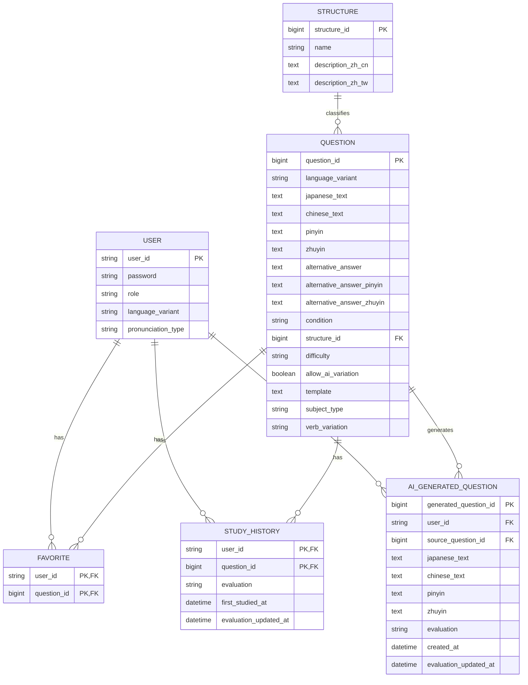

# ER図

## 1. 概要

Chinese Output Forge で使用する主要エンティティと、そのリレーションを示す。

本システムでは、以下の主要データを管理する。

- User
- Question
- Structure
- Favorite
- StudyHistory
- AiGeneratedQuestion

Userは、認証・権限に関する情報だけでなく、ユーザーごとの設定として以下の情報を保持する。

- 学習対象言語
- 表示する発音表記

学習対象言語として、以下の2種類を扱う。

- `MAINLAND`：大陸普通話
- `TAIWAN`：台湾華語（國語）

表示する発音表記として、以下の3種類を扱う。

- `PINYIN`：拼音
- `ZHUYIN`：注音
- `NONE`：表示なし

これらはユーザーごとの設定としてUserに保持し、DBへ永続化する。

これにより、ログアウトによってセッションが破棄された場合でも設定値は失われず、再ログイン時にはUserに保存されている設定値を引き続き使用できる。

学習対象言語のデフォルト値は `MAINLAND`、発音表記のデフォルト値は `PINYIN` とする。

また、大陸普通話と台湾華語は、単なる簡体字・繁体字の違いとして扱うのではなく、**それぞれ異なる問題データとして管理する**。

ただし、両者のデータ構造は共通しているため、

```text
SIMPLIFIED_QUESTION
TRADITIONAL_QUESTION
```

のようにテーブル自体を分離するのではなく、

```text
QUESTION
```

として共通管理する。

QUESTIONに学習対象言語を識別する `language_variant` を持たせ、

```text
MAINLAND
TAIWAN
```

によって大陸普通話と台湾華語を区別する。

Favorite、StudyHistory、AiGeneratedQuestionについても、大陸普通話用・台湾華語用には分離せず共通テーブルとして管理する。

AI生成問題は通常のマスタ問題とは別エンティティとし、生成したユーザーにのみ紐づく個人用データとして管理する。

---

## 2. ER図



---

## 3. 全体のリレーション

本システムでは、Questionを大陸普通話・台湾華語で分離せず、共通のマスタ問題として管理する。

全体の関係は以下のようになる。

```text
USER
  │
  ├── FAVORITE
  │       │
  │       └── QUESTION
  │              │
  │              └── STRUCTURE
  │
  ├── STUDY_HISTORY
  │       │
  │       └── QUESTION
  │              │
  │              └── STRUCTURE
  │
  └── AI_GENERATED_QUESTION
          │
          └── QUESTION
                 │
                 └── STRUCTURE
              （生成元）
```

USER自身は、ユーザーごとの設定として以下の属性を保持する。

```text
USER
│
├── language_variant
│   ├── MAINLAND
│   └── TAIWAN
│
└── pronunciation_type
    ├── PINYIN
    ├── ZHUYIN
    └── NONE
```

`USER.language_variant` は、そのユーザーが現在どちらの中国語を学習対象としているかを表す。

一方、QUESTIONにも、

```text
language_variant
```

を持たせ、

```text
MAINLAND
TAIWAN
```

によって、その問題が大陸普通話・台湾華語のどちらに属するかを識別する。

したがって、

```text
USER.language_variant
```

と、

```text
QUESTION.language_variant
```

は同じ種類の値を扱うが、役割は異なる。

```text
USER.language_variant
└── ユーザーが現在学習対象としている言語

QUESTION.language_variant
└── その問題が対象としている言語
```

通常学習や復習などでは、`USER.language_variant` に対応する `QUESTION.language_variant` を持つ問題を取得する。

また、QUESTIONには、

```text
structure_id
```

を外部キーとして持たせ、対応するSTRUCTUREを参照する。

```text
QUESTION
    ↓
structure_id
    ↓
STRUCTURE
```

これにより、QUESTIONの文法・構造を判定する。

FavoriteやStudyHistoryなどに学習対象言語やStructureを重複して保持する必要はなく、関連するQuestionを参照することで判定できる。

AI_GENERATED_QUESTIONについても、生成元QUESTIONを経由して学習対象言語およびStructureを判定する。

---

## 4. Userとユーザー設定

### 学習対象言語

USERは、ユーザーごとの学習対象言語として、

```text
language_variant
```

を保持する。

値は以下の2種類とする。

```text
MAINLAND
TAIWAN
```

`MAINLAND` は大陸普通話、`TAIWAN` は台湾華語（國語）を表す。

デフォルト値は、

```text
MAINLAND
```

とする。

ユーザーが学習対象言語を変更した場合は、USERの `language_variant` を更新する。

例えば、

```text
USER
--------------------------------
user_id           = 1
language_variant  = TAIWAN
--------------------------------
```

の場合、このユーザーの現在の学習対象言語は台湾華語となる。

学習対象言語はDBへ永続化するため、ログアウトしても設定値は失われない。

そのため、

```text
language_variant = TAIWAN

        ↓
    ログアウト
        ↓
    再ログイン

language_variant = TAIWAN
```

となり、前回の設定を引き続き使用できる。

---

### 発音表記

USERは、ユーザーが問題画面で表示する発音表記として、

```text
pronunciation_type
```

を保持する。

値は以下の3種類とする。

```text
PINYIN
ZHUYIN
NONE
```

それぞれ、

| 値 | 表示 |
| --- | --- |
| `PINYIN` | 拼音 |
| `ZHUYIN` | 注音 |
| `NONE` | 表示なし |

を表す。

デフォルト値は、

```text
PINYIN
```

とする。

発音表記についてもDBへ永続化する。

例えば、

```text
USER
--------------------------------
user_id             = 1
pronunciation_type  = ZHUYIN
--------------------------------
```

の場合、問題画面では注音を表示する。

ログアウト後も、

```text
pronunciation_type = ZHUYIN

        ↓
    ログアウト
        ↓
    再ログイン

pronunciation_type = ZHUYIN
```

となり、前回の設定を引き続き使用できる。

---

### 学習対象言語と発音表記の独立

`language_variant` と `pronunciation_type` は独立した設定として扱う。

そのため、

```text
language_variant    = MAINLAND
pronunciation_type  = ZHUYIN
```

や、

```text
language_variant    = TAIWAN
pronunciation_type  = PINYIN
```

といった組み合わせも可能とする。

学習対象言語を変更しても発音表記は自動的に変更しない。

同様に、発音表記を変更しても学習対象言語は変更しない。

---

## 5. Questionと学習対象言語

Questionは、大陸普通話・台湾華語双方のマスタ問題を管理する。

例えば以下のように保存する。

```text
QUESTION
------------------------------------------------
question_id       = 100
language_variant  = MAINLAND
chinese_text      = 大陸普通話の問題
------------------------------------------------

QUESTION
------------------------------------------------
question_id       = 101
language_variant  = TAIWAN
chinese_text      = 台湾華語の問題
------------------------------------------------
```

大陸普通話と台湾華語は同じQUESTIONテーブルに保存するが、**問題データとしては独立して扱う。**

したがって、

```text
MAINLANDの問題100
=
TAIWANの問題100
```

のような対応関係は持たせない。

問題IDはQUESTION全体で一意とする。

通常学習や復習では、USERに設定されている学習対象言語に応じてQUESTIONを絞り込む。

例えば、

```text
USER.language_variant = MAINLAND
```

の場合は、

```text
QUESTION.language_variant = MAINLAND
```

の問題を対象とする。

台湾華語の場合は、

```text
USER.language_variant = TAIWAN
```

に対して、

```text
QUESTION.language_variant = TAIWAN
```

の問題を対象とする。

概念的には、

```text
USER
│
└── language_variant = TAIWAN
            │
            ▼
QUESTION
│
└── language_variant = TAIWAN
```

となる。

---

## 6. QuestionとStructure

### リレーション

StructureとQuestionは1対多の関係とする。

```text
STRUCTURE
   │
   │ 1:N
   ↓
QUESTION
```

1つのStructureには複数のQuestionを関連付けることができる。

一方、1つのQuestionが参照するStructureは1つのみとする。

例えば、

```text
STRUCTURE
structure_id       = 1
name               = 可能補語
description_zh_cn  = 動作や結果が実現できるか、できないかを表す形式。
description_zh_tw  = 動作や結果が実現できるか、できないかを表す形式。
        │
        │ 1:N
        ↓
QUESTION
├── 这么多菜，我们吃不完。
├── 这个箱子太重了，我搬不动。
└── 他说得太快，我听不懂。
```

のような関係となる。

QUESTIONには、

```text
structure_id
```

を外部キーとして保持し、対応するSTRUCTUREを参照する。

```text
QUESTION
    ↓
structure_id
    ↓
STRUCTURE
├── name
├── description_zh_cn
└── description_zh_tw
```

すべてのQuestionには文法・構造上の分類が存在するため、QuestionからStructureへの関連は必須とする。

一方、StructureはQuestionがまだ登録されていない状態でもマスタデータとして存在できるものとする。

そのため、

```text
STRUCTURE 1 : 0..N QUESTION
QUESTION  N : 1 STRUCTURE
```

の関係とする。

---

### Structureの説明と学習対象言語

STRUCTUREは、

```text
description_zh_cn
description_zh_tw
```

の2種類の説明を保持する。

どちらを使用するかは、USERに設定されている `language_variant` によって決定する。

```text
USER.language_variant

├── MAINLAND
│   └── description_zh_cn
│
└── TAIWAN
    └── description_zh_tw
```

例えば、

```text
USER.language_variant = MAINLAND
```

の場合は、

```text
STRUCTURE.description_zh_cn
```

を使用する。

一方、

```text
USER.language_variant = TAIWAN
```

の場合は、

```text
STRUCTURE.description_zh_tw
```

を使用する。

この切り替えはサイト表記言語とは独立して扱う。

---

## 7. UserとFavorite

### リレーション

UserとFavoriteは1対多の関係とする。

```text
USER
  │
  │ 1:N
  ↓
FAVORITE
```

1人のユーザーは複数の問題をお気に入り登録できる。

Favoriteには、お気に入り登録された問題のみレコードを保持する。

### QuestionとFavorite

QuestionとFavoriteも1対多の関係とする。

```text
QUESTION
   │
   │ 1:N
   ↓
FAVORITE
```

1つのマスタ問題は複数ユーザーからお気に入り登録される可能性がある。

そのため、UserとQuestionはFavoriteを介して多対多の関係となる。

```text
USER
  │
  │ 1:N
  ↓
FAVORITE
  ↑
  │ N:1
QUESTION
```

Favoriteの主キーは、

```text
(user_id, question_id)
```

の複合主キーとする。

Favorite自身には `language_variant` を保持しない。

```text
FAVORITE
    ↓
QUESTION
    ↓
language_variant
```

と参照することで、そのお気に入りが大陸普通話・台湾華語のどちらに属するか判定する。

---

## 8. UserとStudyHistory

### リレーション

UserとStudyHistoryは1対多の関係とする。

```text
USER
  │
  │ 1:N
  ↓
STUDY_HISTORY
```

1人のユーザーは複数のマスタ問題について学習履歴を持つことができる。

### QuestionとStudyHistory

QuestionとStudyHistoryも1対多の関係とする。

```text
QUESTION
   │
   │ 1:N
   ↓
STUDY_HISTORY
```

1つのマスタ問題は複数ユーザーによって学習される。

そのため、UserとQuestionはStudyHistoryを介して多対多の関係となる。

```text
USER
  │
  │ 1:N
  ↓
STUDY_HISTORY
  ↑
  │ N:1
QUESTION
```

StudyHistoryの主キーは、

```text
(user_id, question_id)
```

の複合主キーとする。

同一ユーザー・同一問題について1レコードを保持し、

- `evaluation`
- `first_studied_at`
- `evaluation_updated_at`

を管理する。

StudyHistory自身には `language_variant` を保持しない。

```text
STUDY_HISTORY
      ↓
   QUESTION
      ↓
language_variant
```

と参照することで、その学習履歴が大陸普通話・台湾華語のどちらに属するか判定する。

---

## 9. AI生成問題の位置付け

AI生成問題はマスタ問題とは明確に分離する。

```text
QUESTION
   │
   │ AI生成
   ↓
AI_GENERATED_QUESTION
   ↑
   │ owns
 USER
```

QUESTIONには、

```text
language_variant
```

が存在するため、生成元となったQuestionからAI生成問題の学習対象言語を判定できる。

例えば、

```text
AI_GENERATED_QUESTION
        ↓
source_question_id
        ↓
QUESTION
        ↓
language_variant = TAIWAN
```

であれば、そのAI生成問題は台湾華語の問題として扱う。

AI生成問題は以下の条件を満たす場合のみDBへ保存する。

- AI生成学習中に問題が生成される
- ユーザーがその問題に対して `HARD / GOOD / EASY` のいずれかを選択する

理解度が与えられなかった問題は永続化しない。

また、AI生成問題をマスタ問題であるQUESTIONへ追加することはしない。

これにより、特定ユーザー向けに生成された問題が他ユーザーの通常学習へ混入することを防ぐ。

---

## 10. UserとAiGeneratedQuestion

UserとAiGeneratedQuestionは1対多の関係とする。

```text
USER
  │
  │ 1:N
  ↓
AI_GENERATED_QUESTION
```

1人のユーザーは複数のAI生成問題を所有できる。

AI生成問題には必ず `user_id` を保持し、そのユーザー専用の問題として管理する。

他のユーザーからは参照・出題しない。

---

## 11. QuestionとAiGeneratedQuestion

QuestionとAiGeneratedQuestionは1対多の関係とする。

```text
QUESTION
   │
   │ 1:N
   ↓
AI_GENERATED_QUESTION
```

1つのマスタ問題を基に、複数のAI生成問題が作成される可能性がある。

AiGeneratedQuestionは、

```text
source_question_id
```

によって生成元となったQuestionを参照する。

これにより、

- どのマスタ問題から生成されたか
- 大陸普通話・台湾華語のどちらの問題か
- どの文法・構造に分類される問題か

を判定できる。

---

## 12. AI生成問題とStudyHistoryの違い

マスタ問題では、問題そのものが全ユーザーで共有される。

そのため、

```text
USER
  ↓
STUDY_HISTORY
  ↓
QUESTION
```

という中間エンティティによって、ユーザーごとの理解度を管理する。

一方、AI生成問題は問題そのものが最初から特定ユーザーに所属する。

```text
USER
  ↓
AI_GENERATED_QUESTION
```

そのため、AI生成問題については別途StudyHistoryを作成せず、AI生成問題自身に、

- `evaluation`
- `created_at`
- `evaluation_updated_at`

を保持する。

---

## 13. 大陸普通話・台湾華語の管理

大陸普通話と台湾華語は、**論理的には異なる問題データとして扱うが、物理的なテーブルは共通化する。**

旧設計では、

```text
SIMPLIFIED_QUESTION
TRADITIONAL_QUESTION

SIMPLIFIED_FAVORITE
TRADITIONAL_FAVORITE

SIMPLIFIED_STUDY_HISTORY
TRADITIONAL_STUDY_HISTORY

SIMPLIFIED_AI_GENERATED_QUESTION
TRADITIONAL_AI_GENERATED_QUESTION
```

のように、それぞれ別テーブルとして管理することを想定していた。

新しい設計では、これらを、

```text
QUESTION
FAVORITE
STUDY_HISTORY
AI_GENERATED_QUESTION
```

へ統合する。

大陸普通話・台湾華語の識別は、QUESTIONの、

```text
language_variant
```

によって行う。

```text
QUESTION
   │
   ├── MAINLAND
   │     └── 大陸普通話
   │
   └── TAIWAN
         └── 台湾華語
```

この設計により、データ構造の重複を避けながら、大陸普通話・台湾華語の問題を独立して管理できる。

なお、USERにも `language_variant` を保持するが、これは問題自体の分類ではなく、**そのユーザーが現在どちらを学習対象としているかを表す設定値**である。

---

## 14. AiSettingについて

AI問題生成に関する共通設定としてAiSettingを想定するが、現時点ではDBテーブルとして管理することを確定していない。

候補となる情報は以下のとおり。

- 使用するAIモデル
- 共通プロンプト
- 大陸普通話向けLanguage Profile
- 台湾華語向けLanguage Profile
- その他AI生成共通設定

これらは、

- DB
- `application.yml`
- Properties
- JSON
- `resources/prompts/`

などで管理することが考えられる。

保存方式が未確定であるため、現時点のER図にはAiSettingを含めない。

---

## 15. 設計上の補足

- USERは大陸普通話・台湾華語で共通とする。
- USERはユーザーごとの学習対象言語を `language_variant` として保持する。
- USERの `language_variant` は `MAINLAND / TAIWAN` を想定する。
- USERの `language_variant` のデフォルト値は `MAINLAND` とする。
- USERはユーザーごとの発音表記を `pronunciation_type` として保持する。
- USERの `pronunciation_type` は `PINYIN / ZHUYIN / NONE` を想定する。
- USERの `pronunciation_type` のデフォルト値は `PINYIN` とする。
- USERの `language_variant` と `pronunciation_type` はDBへ永続化する。
- USERの設定はログアウト後も保持する。
- USERの `language_variant` と `pronunciation_type` は独立した設定として扱う。
- USERの `language_variant` とQUESTIONの `language_variant` は役割が異なる。
- 大陸普通話と台湾華語は異なる問題データとして扱う。
- QUESTIONは大陸普通話・台湾華語で分離しない。
- QUESTIONに `language_variant` を持たせる。
- QUESTIONの `language_variant` は `MAINLAND / TAIWAN` を想定する。
- QUESTIONの問題IDは全体で一意とする。
- 大陸普通話と台湾華語の問題IDに対応関係は持たせない。
- FAVORITEは大陸普通話・台湾華語で分離しない。
- FAVORITEはお気に入り登録された場合のみレコードを作成する。
- FAVORITEの学習対象言語はQUESTIONから判定する。
- STUDY_HISTORYは大陸普通話・台湾華語で分離しない。
- STUDY_HISTORYはユーザーとマスタ問題の組み合わせごとに1レコードを保持する。
- STUDY_HISTORYには最新の理解度を保持する。
- STUDY_HISTORYの学習対象言語はQUESTIONから判定する。
- AI_GENERATED_QUESTIONは大陸普通話・台湾華語で分離しない。
- AI生成問題は理解度を与えられた場合のみ保存する。
- AI生成問題には必ず所有ユーザーを設定する。
- AI生成問題は通常学習用のQUESTIONへ追加しない。
- AI生成問題は生成したユーザー自身の復習でのみ再利用する。
- AI生成問題は生成元となったQUESTIONを外部キーで保持する。
- AI生成問題の学習対象言語は生成元QUESTIONから判定する。
- AI生成問題には専用のStudyHistoryを設けず、問題自身に理解度を保持する。
- AiSettingは保存方式が確定するまでER図には含めない。
- 文法・構造は独立したSTRUCTUREとして管理する。
- STRUCTUREは文法・構造ID、文法・構造名、大陸普通話向けの説明、台湾華語向けの説明を保持する。
- 文法・構造そのものの分類は大陸普通話と台湾華語で共通して管理する。
- STRUCTUREの説明は、大陸普通話向けと台湾華語向けに分けて保持する。
- STRUCTUREの説明を表示する際は、USERに設定されている現在の学習対象言語に応じて使用する説明を切り替える。
- STRUCTUREの説明の切り替えはサイト表記言語とは独立して扱う。
- STRUCTUREとQUESTIONは1対多の関係とする。
- QUESTIONには `structure_id` を外部キーとして保持する。
- 1つのQUESTIONにつき1つのSTRUCTUREを設定する。
- QUESTIONからSTRUCTUREへの関連は必須とする。
- QUESTION自身には文法・構造名や説明を重複して保持しない。
- AI生成問題のStructureは生成元QUESTIONから判定し、AI_GENERATED_QUESTIONには `structure_id` を重複して保持しない。

---

## 16. 開発途中で追加した設計

### 16.1 拼音・注音への対応

**追加日：2026年8月15日**

当初のER図では、QUESTIONおよびAI_GENERATED_QUESTIONに中国語本文のみを保持し、発音表記は保持しない設計としていた。

その後、学習時に中国語の発音を確認できるようにするため、QUESTIONおよびAI_GENERATED_QUESTIONに以下の属性を追加する。

```text
pinyin
zhuyin
```

QUESTIONおよびAI_GENERATED_QUESTIONは、大陸普通話・台湾華語のどちらの問題についても拼音・注音の両方を保持する。

発音表記は `language_variant` と固定的に対応させない。

そのため、

```text
MAINLAND + PINYIN
MAINLAND + ZHUYIN
TAIWAN   + PINYIN
TAIWAN   + ZHUYIN
```

のすべての組み合わせで発音表記を利用できる。

発音表記の選択はユーザー側の設定として扱う。

当初、この設定をどのように保持するかは確定していなかったが、その後の設計変更により、USERの `pronunciation_type` としてDBへ永続化することとした。

QUESTIONおよびAI_GENERATED_QUESTIONとの新たなリレーションは発生しない。

---

### 16.2 別解の拼音・注音への対応

**追加日：2026年8月16日**

`16.1 拼音・注音への対応` では、QUESTIONの中国語模範解答に対応する発音情報として、

```text
pinyin
zhuyin
```

を追加した。

その後、別解が存在する問題についても発音を確認できるようにする必要があるため、QUESTIONに以下の属性を追加する。

```text
alternative_answer_pinyin
alternative_answer_zhuyin
```

これにより、QUESTIONの中国語解答に関する属性は以下の構成となる。

```text
QUESTION
│
├── chinese_text
│   ├── pinyin
│   └── zhuyin
│
└── alternative_answer
    ├── alternative_answer_pinyin
    └── alternative_answer_zhuyin
```

`alternative_answer_pinyin` は別解に対応する拼音、`alternative_answer_zhuyin` は別解に対応する注音を保持する。

今回の変更はQUESTIONが保持する属性の追加であり、新しいエンティティや外部キーは発生しない。

したがって、既存エンティティ間のリレーションは変更しない。

---

### 16.3 問題の文法・構造（structure）の追加

**追加日：2026年8月23日**

問題を文法・構造によって客観的に分類し、復習時の出題条件や問題検索に利用できるようにするため、当初QUESTIONに以下の属性を追加した。

```text
structure
```

`structure` は、模範解答となる中国語文を文法・構造上分析した際に、**その文章の根幹となる文法・構造を客観的に分類するための属性**とした。

例えば、

```text
QUESTION
│
├── chinese_text = 他笑着跟我说话。
├── structure    = 動態助詞（着）
└── condition    = 「着」を使う
```

の場合、

- `structure` は、中国語文そのものの根幹となる文法・構造を表す。
- `condition` は、開発者・出題者がその問題に設定した解答条件・ヒントを表す。

したがって、`structure` と `condition` は役割が異なる。

```text
structure
└── 中国語文そのものの根幹となる文法・構造
    └── 客観的な分類

condition
└── その問題をどのように解答させるか
    └── 開発者・出題者が設定する主観的な条件・ヒント
```

1つの中国語文に複数の文法的要素が含まれている場合でも、文章の根幹となる文法・構造を1つ選択する。

一方、`condition` は特定の解答条件を必要としない問題も存在するため、NULLを許可する。

その後、`structure` は文字列属性ではなく独立したSTRUCTUREとして管理する設計へ変更した。

---

### 16.4 Structureのマスタテーブル化

**設計変更日：2026年8月24日**

`16.3 問題の文法・構造（structure）の追加` では、QUESTION自身が文法・構造名を文字列として保持する設計としていた。

その後、文法・構造名だけでなく、その文法・構造についての説明を管理する必要が生じた。

例えば、

```text
可能補語

動作や結果が実現できるか、できないかを表す形式。
```

のような情報である。

これにより、`structure` は単なるQUESTIONの分類用文字列ではなく、

```text
文法・構造
├── 文法・構造を識別するID
├── 文法・構造名
├── 大陸普通話向けの説明
└── 台湾華語向けの説明
```

という独立した情報を持つデータとして扱う方が適切であると判断した。

そこで、QUESTIONの `structure` 文字列属性として管理する設計を変更し、文法・構造を独立したSTRUCTUREとして管理する。

#### STRUCTUREの追加

STRUCTUREは以下の情報を保持する。

```text
STRUCTURE
│
├── structure_id
├── name
├── description_zh_cn
└── description_zh_tw
```

`structure_id` は文法・構造を識別する主キーとする。

`name` には、

```text
可能補語
把構文
比較構文
条件複文
譲歩複文
```

などの文法・構造名を保持する。

文法・構造そのものの分類は、大陸普通話と台湾華語で共通して管理する。

一方、説明内で使用する中国語については、簡体字・繁体字の違いや、大陸普通話・台湾華語で一般的に使用される表現の違いが生じる場合がある。

そのため、

```text
description_zh_cn
└── 大陸普通話向けの説明

description_zh_tw
└── 台湾華語向けの説明
```

として、2種類の説明を保持する。

どちらの説明を表示するかは、USERに保存されている現在の学習対象言語によって決定する。

```text
USER.language_variant

├── MAINLAND
│   └── description_zh_cn
│
└── TAIWAN
    └── description_zh_tw
```

この切り替えはサイト表記言語とは独立して扱う。

#### QUESTIONとのリレーション

これまでQUESTIONが直接保持していた、

```text
structure
```

は廃止する。

代わりにQUESTIONは、

```text
structure_id
```

を外部キーとして保持し、STRUCTUREを参照する。

```text
STRUCTURE
    │
    │ 1:N
    ↓
QUESTION
```

1つのSTRUCTUREには複数のQUESTIONを関連付けることができる。

一方、1つのQUESTIONが参照するSTRUCTUREは1つのみとする。

すべてのQUESTIONには分類対象となる文法・構造が存在するため、QUESTIONからSTRUCTUREへの関連は必須とする。

したがって、QUESTIONの `structure_id` はNULLを許可しない。

一方、STRUCTUREは将来使用する文法・構造を事前に登録することもできるため、QUESTIONが1件も関連付けられていないSTRUCTUREの存在は許可する。

```text
STRUCTURE 1 : 0..N QUESTION
QUESTION N : 1 STRUCTURE
```

#### conditionとの関係

STRUCTUREを独立したエンティティとして管理するようになっても、`condition` との役割の違いは変更しない。

```text
STRUCTURE
└── 中国語文そのものの根幹となる文法・構造
    └── 客観的な分類

condition
└── その問題をどのように解答させるか
    └── 開発者・出題者が設定する主観的な条件・ヒント
```

STRUCTUREとの関連はすべてのQUESTIONに必須とするが、`condition` は特定の解答条件を必要とする問題にのみ設定するため、NULLを許可する。

#### AI_GENERATED_QUESTIONとの関係

AI_GENERATED_QUESTIONには、STRUCTUREとの外部キーを追加しない。

AI生成問題は、

```text
source_question_id
```

によって生成元QUESTIONを参照しているため、

```text
AI_GENERATED_QUESTION
        │
        │ source_question_id
        ↓
     QUESTION
        │
        │ structure_id
        ↓
    STRUCTURE
```

という関係から文法・構造を取得する。

AI生成問題は生成元QUESTIONの文法・構造を維持したバリエーションとして生成するため、原則として生成元QUESTIONと同じSTRUCTUREに分類される。

そのため、AI_GENERATED_QUESTION自身に `structure_id` を重複して保持しない。

---

### 16.5 ユーザー設定の永続化

**設計変更日：2026年8月27日**

これまで、学習対象言語および発音表記は、アプリケーション利用中の現在の設定として扱っていた。

しかし、設定値をセッション上でのみ管理する場合、ログアウトによってセッションが破棄されると設定値も失われる。

その結果、再ログイン時には、

```text
学習対象言語 = MAINLAND
発音表記     = PINYIN
```

というデフォルト値へ戻ってしまう。

そこで、USERに以下の属性を追加する。

```text
USER
│
├── language_variant
└── pronunciation_type
```

`language_variant` はユーザーが現在学習対象としている言語を保持する。

```text
MAINLAND
TAIWAN
```

の2種類を扱い、デフォルト値は `MAINLAND` とする。

`pronunciation_type` はユーザーが表示する発音表記を保持する。

```text
PINYIN
ZHUYIN
NONE
```

の3種類を扱い、デフォルト値は `PINYIN` とする。

これらの設定値をUSERに保持してDBへ永続化することで、ログアウト後も設定を維持できる。

```text
USER
├── language_variant   = TAIWAN
└── pronunciation_type = ZHUYIN

        ↓
    ログアウト
        ↓
    再ログイン

USER
├── language_variant   = TAIWAN
└── pronunciation_type = ZHUYIN
```

なお、この変更はUSERが保持する属性の追加であり、新しいエンティティは追加しない。

そのため、

```text
USER ── LANGUAGE_VARIANT
USER ── PRONUNCIATION_TYPE
```

のような新しいリレーションは発生しない。

また、USERの `language_variant` とQUESTIONの `language_variant` は役割が異なる。

```text
USER.language_variant
└── ユーザーが現在学習対象としている言語

QUESTION.language_variant
└── その問題が対象としている言語
```

通常学習や復習などでは、USERに保存されている `language_variant` を基準として、対応する `QUESTION.language_variant` の問題を取得する。

発音表示では、USERに保存されている `pronunciation_type` を基準として、QUESTIONまたはAI_GENERATED_QUESTIONが保持する拼音・注音のどちらを表示するか、または発音表記を表示しないかを決定する。