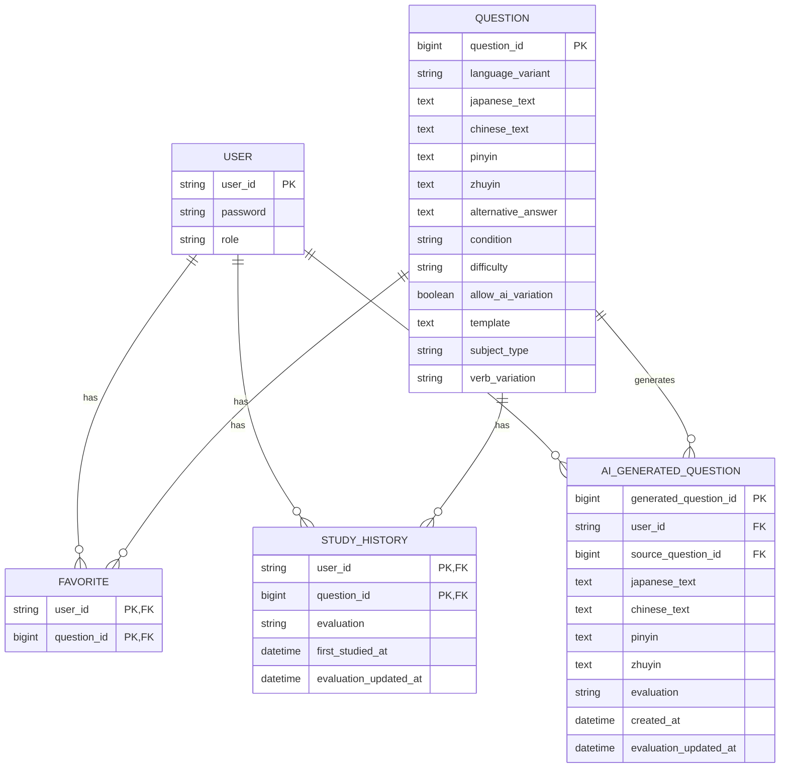

# ER図

## 1. 概要

Chinese Output Forge で使用する主要エンティティと、そのリレーションを示す。

本システムでは、以下の主要データを管理する。

- User
- Question
- Favorite
- StudyHistory
- AiGeneratedQuestion

大陸普通話と台湾華語は、単なる簡体字・繁体字の違いとして扱うのではなく、**それぞれ異なる問題データとして管理する**。

ただし、両者のデータ構造は共通しているため、

```text
SIMPLIFIED_QUESTION
TRADITIONAL_QUESTION
```

のようにテーブル自体を分離するのではなく、

```text
QUESTION
```

として共通管理する。

QUESTIONに学習対象言語を識別する `language_variant` を持たせ、

```text
MAINLAND
TAIWAN
```

によって大陸普通話と台湾華語を区別する。

Favorite、StudyHistory、AiGeneratedQuestionについても、大陸普通話用・台湾華語用には分離せず共通テーブルとして管理する。

AI生成問題は通常のマスタ問題とは別エンティティとし、生成したユーザーにのみ紐づく個人用データとして管理する。

---

## 2. ER図



---

## 3. 全体のリレーション

本システムでは、Questionを大陸普通話・台湾華語で分離せず、共通のマスタ問題として管理する。

全体の関係は以下のようになる。

```text
USER
  │
  ├── FAVORITE
  │       │
  │       └── QUESTION
  │
  ├── STUDY_HISTORY
  │       │
  │       └── QUESTION
  │
  └── AI_GENERATED_QUESTION
          │
          └── QUESTION
              （生成元）
```

QUESTIONには、

```text
language_variant
```

を持たせ、

```text
MAINLAND
TAIWAN
```

によって学習対象言語を識別する。

そのため、FavoriteやStudyHistoryなどに学習対象言語を重複して保持する必要はなく、関連するQuestionを参照することで判定できる。

---

## 4. Questionと学習対象言語

Questionは、大陸普通話・台湾華語双方のマスタ問題を管理する。

例えば以下のように保存する。

```text
QUESTION
------------------------------------------------
question_id       = 100
language_variant  = MAINLAND
chinese_text      = 大陸普通話の問題
------------------------------------------------

QUESTION
------------------------------------------------
question_id       = 101
language_variant  = TAIWAN
chinese_text      = 台湾華語の問題
------------------------------------------------
```

大陸普通話と台湾華語は同じQUESTIONテーブルに保存するが、**問題データとしては独立して扱う。**

したがって、

```text
MAINLANDの問題100
=
TAIWANの問題100
```

のような対応関係は持たせない。

問題IDはQUESTION全体で一意とする。

通常学習や復習では、現在設定されている学習対象言語に応じてQUESTIONを絞り込む。

例えば大陸普通話の場合は、

```text
language_variant = MAINLAND
```

台湾華語の場合は、

```text
language_variant = TAIWAN
```

の問題を対象とする。

---

## 5. UserとFavorite

### リレーション

UserとFavoriteは1対多の関係とする。

```text
USER
  │
  │ 1:N
  ↓
FAVORITE
```

1人のユーザーは複数の問題をお気に入り登録できる。

Favoriteには、お気に入り登録された問題のみレコードを保持する。

---

### QuestionとFavorite

QuestionとFavoriteも1対多の関係とする。

```text
QUESTION
   │
   │ 1:N
   ↓
FAVORITE
```

1つのマスタ問題は複数ユーザーからお気に入り登録される可能性がある。

そのため、UserとQuestionはFavoriteを介して多対多の関係となる。

```text
USER
  │
  │ 1:N
  ↓
FAVORITE
  ↑
  │ N:1
QUESTION
```

Favoriteの主キーは、

```text
(user_id, question_id)
```

の複合主キーとする。

Favorite自身には `language_variant` を保持しない。

```text
FAVORITE
    ↓
QUESTION
    ↓
language_variant
```

と参照することで、そのお気に入りが大陸普通話・台湾華語のどちらに属するか判定する。

---

## 6. UserとStudyHistory

### リレーション

UserとStudyHistoryは1対多の関係とする。

```text
USER
  │
  │ 1:N
  ↓
STUDY_HISTORY
```

1人のユーザーは複数のマスタ問題について学習履歴を持つことができる。

---

### QuestionとStudyHistory

QuestionとStudyHistoryも1対多の関係とする。

```text
QUESTION
   │
   │ 1:N
   ↓
STUDY_HISTORY
```

1つのマスタ問題は複数ユーザーによって学習される。

そのため、UserとQuestionはStudyHistoryを介して多対多の関係となる。

```text
USER
  │
  │ 1:N
  ↓
STUDY_HISTORY
  ↑
  │ N:1
QUESTION
```

StudyHistoryの主キーは、

```text
(user_id, question_id)
```

の複合主キーとする。

同一ユーザー・同一問題について1レコードを保持し、

- `evaluation`
- `first_studied_at`
- `evaluation_updated_at`

を管理する。

StudyHistory自身には `language_variant` を保持しない。

```text
STUDY_HISTORY
      ↓
   QUESTION
      ↓
language_variant
```

と参照することで、その学習履歴が大陸普通話・台湾華語のどちらに属するか判定する。

---

## 7. AI生成問題の位置付け

AI生成問題はマスタ問題とは明確に分離する。

```text
QUESTION
   │
   │ AI生成
   ↓
AI_GENERATED_QUESTION
   ↑
   │ owns
 USER
```

QUESTIONには、

```text
language_variant
```

が存在するため、生成元となったQuestionからAI生成問題の学習対象言語を判定できる。

例えば、

```text
AI_GENERATED_QUESTION
        ↓
source_question_id
        ↓
QUESTION
        ↓
language_variant = TAIWAN
```

であれば、そのAI生成問題は台湾華語の問題として扱う。

AI生成問題は以下の条件を満たす場合のみDBへ保存する。

- AI生成学習中に問題が生成される
- ユーザーがその問題に対して `HARD / GOOD / EASY` のいずれかを選択する

理解度が与えられなかった問題は永続化しない。

また、AI生成問題をマスタ問題であるQUESTIONへ追加することはしない。

これにより、特定ユーザー向けに生成された問題が他ユーザーの通常学習へ混入することを防ぐ。

---

## 8. UserとAiGeneratedQuestion

UserとAiGeneratedQuestionは1対多の関係とする。

```text
USER
  │
  │ 1:N
  ↓
AI_GENERATED_QUESTION
```

1人のユーザーは複数のAI生成問題を所有できる。

AI生成問題には必ず `user_id` を保持し、そのユーザー専用の問題として管理する。

他のユーザーからは参照・出題しない。

---

## 9. QuestionとAiGeneratedQuestion

QuestionとAiGeneratedQuestionは1対多の関係とする。

```text
QUESTION
   │
   │ 1:N
   ↓
AI_GENERATED_QUESTION
```

1つのマスタ問題を基に、複数のAI生成問題が作成される可能性がある。

AiGeneratedQuestionは、

```text
source_question_id
```

によって生成元となったQuestionを参照する。

これにより、

- どのマスタ問題から生成されたか
- 大陸普通話・台湾華語のどちらの問題か

を判定できる。

---

## 10. AI生成問題とStudyHistoryの違い

マスタ問題では、問題そのものが全ユーザーで共有される。

そのため、

```text
USER
  ↓
STUDY_HISTORY
  ↓
QUESTION
```

という中間エンティティによって、ユーザーごとの理解度を管理する。

一方、AI生成問題は問題そのものが最初から特定ユーザーに所属する。

```text
USER
  ↓
AI_GENERATED_QUESTION
```

そのため、AI生成問題については別途StudyHistoryを作成せず、AI生成問題自身に、

- `evaluation`
- `created_at`
- `evaluation_updated_at`

を保持する。

---

## 11. 大陸普通話・台湾華語の管理

大陸普通話と台湾華語は、**論理的には異なる問題データとして扱うが、物理的なテーブルは共通化する。**

旧設計では、

```text
SIMPLIFIED_QUESTION
TRADITIONAL_QUESTION

SIMPLIFIED_FAVORITE
TRADITIONAL_FAVORITE

SIMPLIFIED_STUDY_HISTORY
TRADITIONAL_STUDY_HISTORY

SIMPLIFIED_AI_GENERATED_QUESTION
TRADITIONAL_AI_GENERATED_QUESTION
```

のように、それぞれ別テーブルとして管理することを想定していた。

新しい設計では、これらを、

```text
QUESTION
FAVORITE
STUDY_HISTORY
AI_GENERATED_QUESTION
```

へ統合する。

大陸普通話・台湾華語の識別は、QUESTIONの、

```text
language_variant
```

によって行う。

```text
QUESTION
   │
   ├── MAINLAND
   │     └── 大陸普通話
   │
   └── TAIWAN
         └── 台湾華語
```

この設計により、データ構造の重複を避けながら、大陸普通話・台湾華語の問題を独立して管理できる。

---

## 12. AiSettingについて

AI問題生成に関する共通設定としてAiSettingを想定するが、現時点ではDBテーブルとして管理することを確定していない。

候補となる情報は以下のとおり。

- 使用するAIモデル
- 共通プロンプト
- 大陸普通話向けLanguage Profile
- 台湾華語向けLanguage Profile
- その他AI生成共通設定

これらは、

- DB
- `application.yml`
- Properties
- JSON
- `resources/prompts/`

などで管理することが考えられる。

保存方式が未確定であるため、現時点のER図にはAiSettingを含めない。

---

## 13. 設計上の補足

- USERは大陸普通話・台湾華語で共通とする。
- 大陸普通話と台湾華語は異なる問題データとして扱う。
- QUESTIONは大陸普通話・台湾華語で分離しない。
- QUESTIONに `language_variant` を持たせる。
- `language_variant` は `MAINLAND / TAIWAN` を想定する。
- QUESTIONの問題IDは全体で一意とする。
- 大陸普通話と台湾華語の問題IDに対応関係は持たせない。
- FAVORITEは大陸普通話・台湾華語で分離しない。
- FAVORITEはお気に入り登録された場合のみレコードを作成する。
- FAVORITEの学習対象言語はQUESTIONから判定する。
- STUDY_HISTORYは大陸普通話・台湾華語で分離しない。
- STUDY_HISTORYはユーザーとマスタ問題の組み合わせごとに1レコードを保持する。
- STUDY_HISTORYには最新の理解度を保持する。
- STUDY_HISTORYの学習対象言語はQUESTIONから判定する。
- AI_GENERATED_QUESTIONは大陸普通話・台湾華語で分離しない。
- AI生成問題は理解度を与えられた場合のみ保存する。
- AI生成問題には必ず所有ユーザーを設定する。
- AI生成問題は通常学習用のQUESTIONへ追加しない。
- AI生成問題は生成したユーザー自身の復習でのみ再利用する。
- AI生成問題は生成元となったQUESTIONを外部キーで保持する。
- AI生成問題の学習対象言語は生成元QUESTIONから判定する。
- AI生成問題には専用のStudyHistoryを設けず、問題自身に理解度を保持する。
- AiSettingは保存方式が確定するまでER図には含めない。

---

---

## 14. 開発途中で追加した設計

### 14.1 拼音・注音への対応

**追加日：2026年8月15日**

当初のER図では、QUESTIONおよびAI_GENERATED_QUESTIONに中国語本文のみを保持し、発音表記は保持しない設計としていた。

その後、学習時に中国語の発音を確認できるようにするため、QUESTIONおよびAI_GENERATED_QUESTIONに以下の属性を追加する。

```text
pinyin
zhuyin
```

QUESTIONおよびAI_GENERATED_QUESTIONは、大陸普通話・台湾華語のどちらの問題についても拼音・注音の両方を保持する。

発音表記は `language_variant` と固定的に対応させない。

そのため、

```text
MAINLAND + PINYIN
MAINLAND + ZHUYIN
TAIWAN   + PINYIN
TAIWAN   + ZHUYIN
```

のすべての組み合わせで発音表記を利用できる。

発音表記の選択はユーザー側の設定として扱い、QUESTIONおよびAI_GENERATED_QUESTIONとの新たなリレーションは発生しない。

したがって、今回の変更では既存エンティティ間のリレーションは変更せず、QUESTIONおよびAI_GENERATED_QUESTIONの保持属性のみを追加する。
