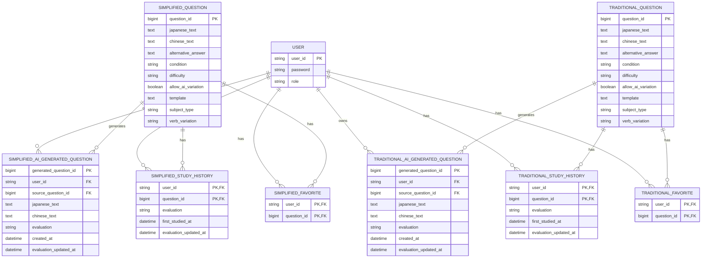

# ER図

## 1. 概要

Chinese Output Trainer で使用する主要エンティティと、そのリレーションを示す。

本システムでは、ユーザー情報は簡体中文・繁體中文で共通とする一方、

- Question
- Favorite
- StudyHistory
- AiGeneratedQuestion

は簡体中文用と繁體中文用でそれぞれ分離して管理する。

AI生成問題は通常のマスタ問題とは別エンティティとし、生成したユーザーにのみ紐づく個人用データとして管理する。

---

## 2. ER図



---

## 3. 簡体中文側のリレーション

簡体中文側では、以下の4種類のエンティティを中心に構成する。

```text
USER
  │
  ├── SIMPLIFIED_FAVORITE
  │        │
  │        └── SIMPLIFIED_QUESTION
  │
  ├── SIMPLIFIED_STUDY_HISTORY
  │        │
  │        └── SIMPLIFIED_QUESTION
  │
  └── SIMPLIFIED_AI_GENERATED_QUESTION
           │
           └── SIMPLIFIED_QUESTION
                （生成元）
```

### User と SimplifiedFavorite

1対多の関係とする。

1人のユーザーは複数の簡体中文問題をお気に入り登録できる。

SimplifiedFavoriteには、お気に入り登録された問題のみレコードを保持する。

---

### SimplifiedQuestion と SimplifiedFavorite

1対多の関係とする。

1つの簡体中文問題は、複数のユーザーからお気に入り登録される可能性がある。

そのため、UserとSimplifiedQuestionはSimplifiedFavoriteを介して多対多の関係となる。

---

### User と SimplifiedStudyHistory

1対多の関係とする。

1人のユーザーは複数の簡体中文マスタ問題について学習履歴を持つことができる。

---

### SimplifiedQuestion と SimplifiedStudyHistory

1対多の関係とする。

1つの簡体中文マスタ問題は複数ユーザーによって学習される。

そのため、UserとSimplifiedQuestionはSimplifiedStudyHistoryを介して多対多の関係となる。

---

### User と SimplifiedAiGeneratedQuestion

1対多の関係とする。

1人のユーザーは複数の簡体中文AI生成問題を所有できる。

AI生成問題には必ず `user_id` を保持し、そのユーザー専用の問題として管理する。

他のユーザーからは参照・出題しない。

---

### SimplifiedQuestion と SimplifiedAiGeneratedQuestion

1対多の関係とする。

1つのマスタ問題を基に、複数のAI生成問題が作成される可能性がある。

`source_question_id` によって生成元となったSimplifiedQuestionを参照する。

---

## 4. 繁體中文側のリレーション

繁體中文側についても、簡体中文側と同じ構造を採用する。

```text
USER
  │
  ├── TRADITIONAL_FAVORITE
  │        │
  │        └── TRADITIONAL_QUESTION
  │
  ├── TRADITIONAL_STUDY_HISTORY
  │        │
  │        └── TRADITIONAL_QUESTION
  │
  └── TRADITIONAL_AI_GENERATED_QUESTION
           │
           └── TRADITIONAL_QUESTION
                （生成元）
```

### User と TraditionalFavorite

1対多の関係とする。

1人のユーザーは複数の繁體中文問題をお気に入り登録できる。

---

### TraditionalQuestion と TraditionalFavorite

1対多の関係とする。

1つの繁體中文問題は複数ユーザーからお気に入り登録される可能性がある。

UserとTraditionalQuestionはTraditionalFavoriteを介して多対多の関係となる。

---

### User と TraditionalStudyHistory

1対多の関係とする。

1人のユーザーは複数の繁體中文マスタ問題について学習履歴を持つことができる。

---

### TraditionalQuestion と TraditionalStudyHistory

1対多の関係とする。

1つの繁體中文マスタ問題は複数ユーザーによって学習される。

UserとTraditionalQuestionはTraditionalStudyHistoryを介して多対多の関係となる。

---

### User と TraditionalAiGeneratedQuestion

1対多の関係とする。

1人のユーザーは複数の繁體中文AI生成問題を所有できる。

AI生成問題は生成したユーザーにのみ紐づく個人用データとする。

---

### TraditionalQuestion と TraditionalAiGeneratedQuestion

1対多の関係とする。

1つの繁體中文マスタ問題から、複数のAI生成問題が作成される可能性がある。

`source_question_id` によって生成元となったTraditionalQuestionを参照する。

---

## 5. AI生成問題の位置付け

AI生成問題はマスタ問題とは明確に分離する。

```text
SIMPLIFIED_QUESTION
        │
        │ AI生成
        ↓
SIMPLIFIED_AI_GENERATED_QUESTION
        ↑
        │ owns
       USER
```

繁體中文側も同様とする。

```text
TRADITIONAL_QUESTION
        │
        │ AI生成
        ↓
TRADITIONAL_AI_GENERATED_QUESTION
        ↑
        │ owns
       USER
```

AI生成問題は以下の条件を満たす場合のみDBへ保存する。

- AI生成学習中に問題が生成される
- ユーザーがその問題に対して `HARD / GOOD / EASY` のいずれかを選択する

理解度が与えられなかった問題は永続化しない。

また、AI生成問題を以下のマスタテーブルへ追加することはしない。

```text
SIMPLIFIED_QUESTION
TRADITIONAL_QUESTION
```

これにより、特定ユーザー向けに生成された問題が他ユーザーの通常学習へ混入することを防ぐ。

---

## 6. AI生成問題とStudyHistoryの違い

マスタ問題では、問題そのものが全ユーザーで共有される。

そのため、

```text
USER
  ↓
STUDY_HISTORY
  ↓
QUESTION
```

という中間エンティティによって、ユーザーごとの理解度を管理する。

一方、AI生成問題は問題そのものが最初から特定ユーザーに所属する。

```text
USER
  ↓
AI_GENERATED_QUESTION
```

そのため、AI生成問題については別途StudyHistoryテーブルを作成せず、AI生成問題自身に、

- `evaluation`
- `created_at`
- `evaluation_updated_at`

を保持する。

---

## 7. AiSettingについて

AI問題生成に関する共通設定としてAiSettingを想定するが、現時点ではDBテーブルとして管理することを確定していない。

候補となる情報は以下のとおり。

- 使用するAIモデル
- 共通プロンプト
- 簡体中文向け追加プロンプト
- 繁體中文向け追加プロンプト
- その他AI生成共通設定

これらは、

- DB
- `application.yml`
- Properties
- JSON
- `resources/prompts/`

などで管理することが考えられる。

保存方式が未確定であるため、現時点のER図にはAiSettingを含めない。

---

## 8. 設計上の補足

- USERは簡体中文・繁體中文で共通とする。
- 簡体中文側と繁體中文側の問題データは完全に分離する。
- SIMPLIFIED_QUESTIONとTRADITIONAL_QUESTIONの問題IDに対応関係は持たせない。
- Favoriteはお気に入り登録された場合のみレコードを作成する。
- StudyHistoryはユーザーとマスタ問題の組み合わせごとに1レコードを保持する。
- StudyHistoryには最新の理解度を保持する。
- AI生成問題は理解度を与えられた場合のみ保存する。
- AI生成問題には必ず所有ユーザーを設定する。
- AI生成問題は通常学習用のQuestionテーブルへ追加しない。
- AI生成問題は生成したユーザー自身の復習でのみ再利用する。
- AI生成問題は生成元となったマスタ問題を外部キーで保持する。
- AI生成問題には専用のStudyHistoryを設けず、問題自身に理解度を保持する。