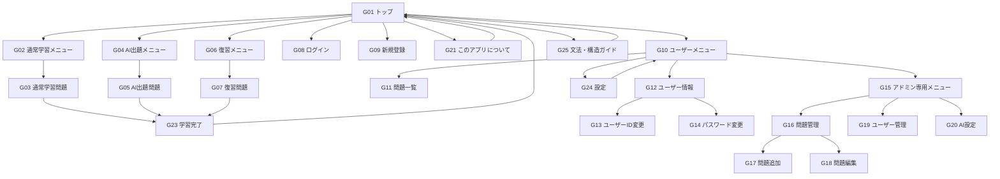
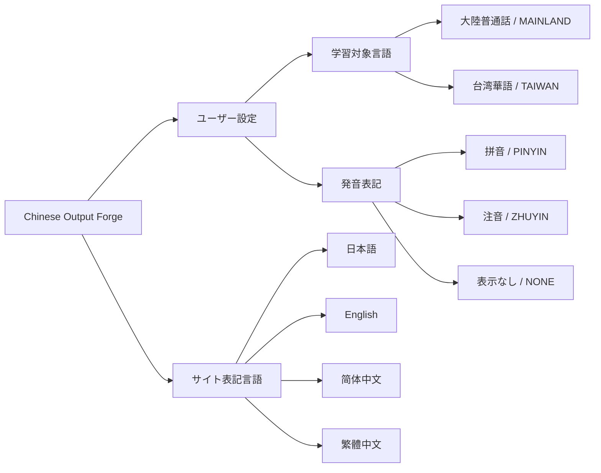

# 画面遷移図

```mermaid
flowchart TD

G01["G01 トップ画面"]

G02["G02 通常学習メニュー"]
G03["G03 通常学習問題画面"]

G04["G04 AI出題メニュー"]
G05["G05 AI出題問題画面"]

G06["G06 復習メニュー"]
G07["G07 復習問題画面"]

G08["G08 ログイン画面"]
G09["G09 新規登録画面"]

G10["G10 ユーザーメニュー"]
G11["G11 ユーザー用問題一覧画面"]
G12["G12 ユーザー情報確認画面"]
G13["G13 ユーザーID変更画面"]
G14["G14 ユーザーパスワード変更画面"]

G15["G15 アドミン専用メニュー"]
G16["G16 アドミン専用問題一覧画面"]
G17["G17 アドミン専用問題追加画面"]
G18["G18 アドミン専用問題編集画面"]
G19["G19 アドミン専用ユーザー管理画面"]
G20["G20 アドミン専用AI設定画面"]

G21["G21 このアプリについて"]
G22["G22 エラー画面"]
G23["G23 学習完了画面"]
G24["G24 設定画面"]
G25["G25 文法・構造ガイド"]


%% ===== トップ画面 =====

G01 -->|通常学習| G02

G01 -->|AI学習・ログイン済み| G04
G01 -->|復習・ログイン済み| G06

G01 -->|AI学習・未ログイン| G08
G01 -->|復習・未ログイン| G08

G01 -->|ログイン| G08
G01 -->|新規登録| G09
G01 -->|メニュー| G10
G01 -->|このアプリについて| G21
G01 -->|文法・構造ガイド| G25


%% ===== 認証 =====

G09 -->|登録成功| G08

G08 -->|認証成功・トップへ| G01
G08 -->|認証成功・AI学習へ| G04
G08 -->|認証成功・復習へ| G06


%% ===== 通常学習 =====

G02 -->|学習開始| G03

G03 -->|次の問題| G03
G03 -->|中断| G02
G03 -->|学習完了| G23


%% ===== AI生成学習 =====

G04 -->|学習開始| G05

G05 -->|次の問題| G05
G05 -->|中断| G04
G05 -->|学習完了| G23


%% ===== 復習 =====

G06 -->|復習開始| G07

G07 -->|次の問題| G07
G07 -->|中断| G06
G07 -->|学習完了| G23


%% ===== 学習完了 =====

G23 -->|通常学習を続ける| G03
G23 -->|AI学習を続ける| G05
G23 -->|復習を続ける| G07
G23 -->|トップへ戻る| G01


%% ===== ユーザー機能 =====

G10 -->|問題一覧| G11
G10 -->|ユーザー情報| G12
G10 -->|設定| G24
G10 -->|管理者メニュー・ROLE_ADMINのみ| G15
G10 -->|トップへ戻る| G01

G11 -->|戻る| G10

G12 -->|ユーザーID変更| G13
G12 -->|パスワード変更| G14
G12 -->|戻る| G10

G13 -->|変更完了| G12
G14 -->|変更完了| G12

G24 -->|設定保存| G24
G24 -->|戻る| G10


%% ===== 管理者機能 =====

G15 -->|問題管理| G16
G15 -->|ユーザー管理| G19
G15 -->|AI設定| G20
G15 -->|ユーザーメニューへ戻る| G10

G16 -->|問題追加| G17
G16 -->|問題編集| G18
G16 -->|戻る| G15

G17 -->|登録完了| G16
G18 -->|更新完了| G16

G19 -->|戻る| G15
G20 -->|戻る| G15


%% ===== このアプリについて =====

G21 -->|トップへ戻る| G01


%% ===== エラー =====

G01 -->|エラー| G22
G02 -->|エラー| G22
G03 -->|エラー| G22
G04 -->|エラー| G22
G05 -->|エラー| G22
G06 -->|エラー| G22
G07 -->|エラー| G22
G08 -->|エラー| G22
G09 -->|エラー| G22
G10 -->|エラー| G22
G11 -->|エラー| G22
G12 -->|エラー| G22
G13 -->|エラー| G22
G14 -->|エラー| G22
G15 -->|エラー| G22
G16 -->|エラー| G22
G17 -->|エラー| G22
G18 -->|エラー| G22
G19 -->|エラー| G22
G20 -->|エラー| G22
G21 -->|エラー| G22
G23 -->|エラー| G22
G24 -->|エラー| G22
G25 -->|エラー| G22

G22 -->|トップへ戻る| G01


%% ===== 文法・構造ガイド =====

G25 -->|トップへ戻る| G01
```



---

# 画面遷移の概要

## 1. 共通設定

本アプリケーションでは、学習および画面表示に関する設定として、以下を扱う。

```text
設定
│
├── ユーザー設定
│   ├── 学習対象言語
│   └── 発音表記
│
└── サイト表記言語
```

このうち、ログインユーザーの、

- 学習対象言語
- 発音表記

については、ユーザーごとの設定としてDBへ永続化する。

---

### 1.1 学習対象言語

ユーザーが学習する中国語を設定する。

以下の2種類から選択する。

- 大陸普通話
- 台湾華語（國語）

内部的には、

```text
MAINLAND
TAIWAN
```

として扱う。

ログインユーザーについては、

```text
Users.language_variant
```

に設定値を保存する。

新規ユーザーのデフォルト値は、

```text
MAINLAND
```

とする。

学習対象言語は、

- 通常学習
- AI生成学習
- 復習
- 問題一覧
- Structureの説明表示

などで共通して使用する。

そのため、大陸普通話と台湾華語で別々の学習画面へ遷移するのではなく、同一の画面を使用し、現在設定されている学習対象言語に応じて取得・表示するデータを切り替える。

ログインユーザーが設定を変更した場合は、`Users.language_variant` を更新する。

これにより、

```text
学習対象言語をTAIWANへ変更
        ↓
Users.language_variant = TAIWAN
        ↓
ログアウト
        ↓
再ログイン
        ↓
Users.language_variantを取得
        ↓
TAIWANを継続
```

という動作を実現する。

未ログインユーザーについてはDBへユーザー設定を保存できないため、一時的な設定として扱う。

---

### 1.2 発音表記

中国語の模範解答とともに表示する発音情報を設定する。

以下の3種類から選択する。

- 拼音
- 注音
- 表示なし

内部的には、

```text
PINYIN
ZHUYIN
NONE
```

として扱う。

ログインユーザーについては、

```text
Users.pronunciation_type
```

に設定値を保存する。

新規ユーザーのデフォルト値は、

```text
PINYIN
```

とする。

設定によって、

```text
PINYIN
└── 拼音を表示

ZHUYIN
└── 注音を表示

NONE
└── 発音表記を表示しない
```

と切り替える。

学習対象言語と発音表記は独立した設定とする。

例えば、

```text
MAINLAND + PINYIN
MAINLAND + ZHUYIN
MAINLAND + NONE

TAIWAN + PINYIN
TAIWAN + ZHUYIN
TAIWAN + NONE
```

のすべての組み合わせを許可する。

---

### 1.3 サイト表記言語

画面上の説明文、ボタン、メニューなどのUIに使用する言語を設定する。

以下の4言語に対応する。

- 日本語
- English
- 简体中文
- 繁體中文

サイト表記言語は、学習対象言語および発音表記とは独立して扱う。

例えば、

```text
サイト表記：日本語
学習対象：台湾華語
発音表記：拼音
```

といった組み合わせも可能とする。

学習対象言語を変更してもサイト表記言語は自動的に変更しない。

同様に、サイト表記言語を変更しても学習対象言語は変更しない。

---

### 1.4 ユーザー設定の永続化

ログインユーザーについては、

```text
Users
│
├── language_variant
└── pronunciation_type
```

として設定をDBへ保存する。

セッションはアプリケーション利用中の現在値を一時的に保持するために使用できるが、永続的な保存先とはしない。

```text
設定変更
    ↓
Usersへ保存
    ↓
ログアウト
    ↓
セッション破棄
    ↓
再ログイン
    ↓
Usersから設定を取得
    ↓
前回の設定を継続
```

とする。

---

## 2. トップ画面

トップ画面では、現在設定されている学習対象言語を確認したうえで、利用する学習方法を選択する。

学習方法は以下の3種類とする。

- 通常学習
- AIによる学習
- 復習

大陸普通話・台湾華語ごとに別の学習画面を設けるのではなく、現在の学習対象言語を各学習機能で共通して使用する。

未ログイン時は以下を表示する。

- 現在の学習対象言語
- 通常学習
- ログイン
- 新規登録
- このアプリについて
- 文法・構造ガイド

ログイン時は以下を表示する。

- 現在の学習対象言語
- 通常学習
- AIによる学習
- 復習
- メニュー
- このアプリについて
- 文法・構造ガイド

通常学習は未ログインでも利用可能とする。

AIによる学習および復習はログイン必須とし、未ログイン状態で選択した場合はログイン画面へ遷移する。

---

## 3. 通常学習

トップ画面から通常学習を選択すると、通常学習メニューへ遷移する。

通常学習メニューでは、現在設定されている学習対象言語に対応する問題を対象として、

- 難易度
- 出題順
- 出題範囲
- 未学習問題

などの条件を選択する。

条件を選択して学習を開始すると、通常学習問題画面へ遷移する。

```text
G01 トップ画面
    ↓
G02 通常学習メニュー
    ↓
G03 通常学習問題画面
    ↓
G23 学習完了画面
```

問題画面では問題を順番に回答し、対象範囲の最後まで終了すると学習完了画面へ遷移する。

学習途中で中断した場合は通常学習メニューへ戻る。

学習開始後は、開始時に設定されていた学習対象言語をその学習が終了するまで維持する。

発音表記は、現在の発音表記設定に応じて表示する。

---

## 4. AI生成学習

AI生成学習はログインユーザーのみ利用可能とする。

トップ画面からAIによる学習を選択すると、AI出題メニューへ遷移する。

```text
G01 トップ画面
    ↓
G04 AI出題メニュー
    ↓
G05 AI出題問題画面
    ↓
G23 学習完了画面
```

AI出題メニューでは、現在設定されている学習対象言語に対応するマスタ問題およびLanguage Profileを使用する。

AIによる問題生成に必要な出題条件を選択し、学習を開始するとAI出題問題画面へ遷移する。

問題の学習が完了すると学習完了画面へ遷移する。

学習途中で中断した場合はAI出題メニューへ戻る。

AI生成学習の開始後は、開始時に設定されていた学習対象言語をその学習が終了するまで維持する。

AI生成時のLanguage Profileは、

```text
Users.language_variant
```

を基準として決定する。

```text
MAINLAND
└── 大陸普通話向けLanguage Profile

TAIWAN
└── 台湾華語向けLanguage Profile
```

ユーザーごとのAI生成設定は現時点では設けない。

---

## 5. 復習

復習はログインユーザーのみ利用可能とする。

トップ画面から復習を選択すると、復習メニューへ遷移する。

```text
G01 トップ画面
    ↓
G06 復習メニュー
    ↓
G07 復習問題画面
    ↓
G23 学習完了画面
```

復習メニューでは、現在設定されている学習対象言語に対応する学習履歴を対象として、

- 理解度
- 難易度
- 文法・構造
- お気に入り
- 出題順

などの条件を指定する。

復習を開始すると復習問題画面へ遷移する。

対象となる問題の学習が完了すると学習完了画面へ遷移する。

学習途中で中断した場合は復習メニューへ戻る。

復習開始後は、開始時に設定されていた学習対象言語をその復習が終了するまで維持する。

---

## 6. ユーザー機能

ログイン済みの場合、トップ画面に「メニュー」を表示する。

メニューを選択するとユーザーメニューへ遷移する。

ユーザーメニューからは以下の画面へ遷移できる。

- ユーザー用問題一覧画面
- ユーザー情報確認画面
- 設定画面
- アドミン専用メニュー（ROLE_ADMINのみ）

基本的な遷移は以下とする。

```text
G10 ユーザーメニュー
│
├── G11 ユーザー用問題一覧画面
│
├── G12 ユーザー情報確認画面
│   ├── G13 ユーザーID変更画面
│   └── G14 ユーザーパスワード変更画面
│
├── G24 設定画面
│
└── G15 アドミン専用メニュー
    ※ ROLE_ADMINのみ
```

ユーザー用問題一覧画面では、現在設定されている学習対象言語に対応する問題と自身の学習状況を確認する。

ユーザー情報確認画面ではアカウント情報を確認し、

- ユーザーID変更
- パスワード変更

へ遷移できる。

学習対象言語・発音表記については、ユーザー情報確認画面ではなくG24設定画面で変更する。

---

## 7. 設定画面

G24設定画面はログインユーザー専用とする。

ユーザーメニューから、

```text
G10 ユーザーメニュー
    ↓
G24 設定画面
```

と遷移する。

設定画面では、Version 1.0において以下の2項目を変更できる。

```text
設定
│
├── 学習対象言語
│   ├── 大陸普通話
│   └── 台湾華語（國語）
│
└── 発音表記
    ├── 拼音
    ├── 注音
    └── 表示なし
```

保存すると、

```text
Users.language_variant
Users.pronunciation_type
```

を更新する。

保存成功後はG24設定画面に留まり、保存完了メッセージを表示する。

```text
G24 設定画面
    │
    ├── 設定保存
    │       ↓
    │     G24
    │
    └── 戻る
            ↓
          G10
```

設定値はUsersへ永続化されるため、ログアウトしても失われない。

---

## 8. 管理者機能

ログインユーザーの `role` が `ADMIN` の場合のみ、ユーザーメニューにアドミン専用メニューへのリンクを表示する。

アドミン専用メニューからは以下の管理機能を利用できる。

- 問題管理
- ユーザー管理
- AI設定

問題管理では問題一覧画面から、

- 問題追加画面
- 問題編集画面

へ遷移できる。

大陸普通話・台湾華語の問題は同一DB内で管理し、各問題に学習対象言語を設定する。

そのため、問題一覧・問題追加・問題編集では問題の学習対象言語を確認・設定できるものとする。

AI設定では、大陸普通話・台湾華語それぞれに対応するLanguage Profile等を管理する。

一般ユーザーにはアドミン専用メニューへのリンクを表示しない。

また、URLを直接指定した場合でも、管理者権限を持たないユーザーは管理者用画面へアクセスできないようにする。

---

## 9. 学習完了画面

通常学習、AI生成学習、復習のいずれも、対象問題の学習が完了すると共通の学習完了画面へ遷移する。

学習完了画面では、今回学習した学習対象言語を表示する。

また、実行していた学習モードに応じて、

- 学習を続ける
- トップ画面へ戻る

を選択できる。

「学習を続ける」を選択した場合は、元の学習モードに応じた問題画面へ遷移する。

この場合、完了した学習と同じ学習対象言語を引き継ぐ。

---

## 10. このアプリについて

トップ画面から「このアプリについて」を選択すると、G21へ遷移する。

G21では、

- アプリケーションの目的
- 通常学習
- AI生成学習
- 復習
- 大陸普通話
- 台湾華語
- 学習対象言語
- 発音表記
- サイト表記言語

などについて説明する。

G21からトップ画面へ戻ることができる。

---

## 11. エラー画面

各画面でシステムエラーやアクセスエラーが発生した場合は、共通のエラー画面へ遷移する。

主に以下を対象とする。

- 400 Bad Request
- 403 Forbidden
- 404 Not Found
- 500 Internal Server Error

エラー画面からはトップ画面へ戻ることができる。

---

## 12. 文法・構造ガイド

`Structure` を復習時の出題条件や問題検索に使用するにあたり、ユーザーが「動態助詞」「可能補語」「結果補語」などの文法・構造の名称を確認できるよう、文法・構造ガイド画面を設ける。

文法・構造ガイドはトップ画面から直接遷移できる。

```text
G01 トップ画面
    ↓
G25 文法・構造ガイド
    ↓
G01 トップ画面
```

文法・構造ガイドでは、Structureとして使用される主要な文法・構造について、

- 文法・構造の名称
- 簡単な説明
- 代表的な中国語例文
- 必要に応じた日本語訳・補足

を1つのページ内で簡潔に紹介する。

各文法・構造に個別の画面は設けない。

文法・構造ガイドはログイン状態にかかわらず利用可能とする。

Structureの説明は、現在の学習対象言語によって切り替える。

ログインユーザーの場合は、

```text
Users.language_variant = MAINLAND
└── Structure.description_zh_cn

Users.language_variant = TAIWAN
└── Structure.description_zh_tw
```

とする。

---

# 画面フロー図



---

## 共通設定の関係

画面遷移とは別に、アプリケーション全体では、

- 学習対象言語
- 発音表記
- サイト表記言語

を扱う。



ログインユーザーのユーザー設定は、

```text
Users
│
├── language_variant
└── pronunciation_type
```

としてDBへ永続化する。

学習対象言語は、

- 通常学習
- AI生成学習
- 復習
- 問題一覧
- Structure説明

などで使用するデータを決定する。

発音表記は、

- 通常学習
- AI生成学習
- 復習
- 問題詳細

などで表示する発音情報を決定する。

サイト表記言語は、画面上の説明文、ボタン、メニューなどの表示言語を決定する。

これらはそれぞれ独立した設定として扱う。

