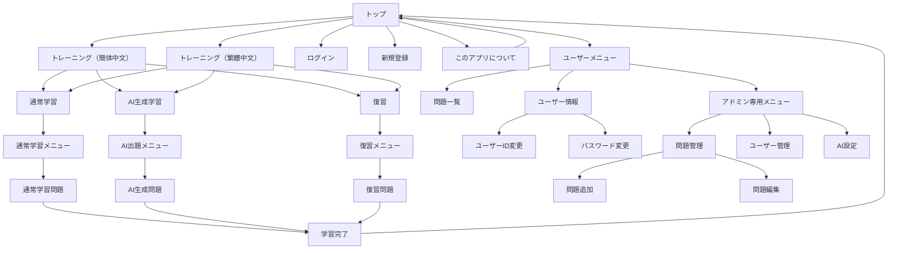

## 画面遷移図

```mermaid
flowchart TD

G01["G01 トップ画面"]

G02["G02 通常学習メニュー"]
G03["G03 通常学習問題画面"]

G04["G04 AI出題メニュー"]
G05["G05 AI出題問題画面"]

G06["G06 復習メニュー"]
G07["G07 復習問題画面"]

G08["G08 ログイン画面"]
G09["G09 新規登録画面"]

G10["G10 ユーザーメニュー"]
G11["G11 ユーザー用問題一覧画面"]
G12["G12 ユーザー情報確認画面"]
G13["G13 ユーザーID変更画面"]
G14["G14 ユーザーパスワード変更画面"]

G15["G15 アドミン専用メニュー"]
G16["G16 アドミン専用問題一覧画面"]
G17["G17 アドミン専用問題追加画面"]
G18["G18 アドミン専用問題編集画面"]
G19["G19 アドミン専用ユーザー管理画面"]
G20["G20 アドミン専用AI設定画面"]

G21["G21 チュートリアル画面"]
G22["G22 エラー画面"]
G23["G23 学習完了画面"]


%% ===== トップ画面 =====

G01 -->|簡体中文 → 通常学習| G02
G01 -->|繁體中文 → 通常学習| G02

G01 -->|簡体中文 → AI学習・ログイン済み| G04
G01 -->|繁體中文 → AI学習・ログイン済み| G04

G01 -->|簡体中文 → 復習・ログイン済み| G06
G01 -->|繁體中文 → 復習・ログイン済み| G06

G01 -->|AI学習・未ログイン| G08
G01 -->|復習・未ログイン| G08

G01 -->|ログイン| G08
G01 -->|新規登録| G09
G01 -->|メニュー| G10
G01 -->|このアプリについて| G21


%% ===== 認証 =====

G09 -->|登録成功| G08

G08 -->|認証成功・トップへ| G01
G08 -->|認証成功・AI学習へ| G04
G08 -->|認証成功・復習へ| G06


%% ===== 通常学習 =====

G02 -->|学習開始| G03

G03 -->|次の問題| G03
G03 -->|中断| G02
G03 -->|学習完了| G23


%% ===== AI生成学習 =====

G04 -->|学習開始| G05

G05 -->|次の問題| G05
G05 -->|中断| G04
G05 -->|学習完了| G23


%% ===== 復習 =====

G06 -->|復習開始| G07

G07 -->|次の問題| G07
G07 -->|中断| G06
G07 -->|学習完了| G23


%% ===== 学習完了 =====

G23 -->|通常学習を続ける| G03
G23 -->|AI学習を続ける| G05
G23 -->|復習を続ける| G07
G23 -->|トップへ戻る| G01


%% ===== ユーザー機能 =====

G10 -->|問題一覧| G11
G10 -->|ユーザー情報| G12
G10 -->|管理者メニュー・ROLE_ADMINのみ| G15
G10 -->|トップへ戻る| G01

G11 -->|戻る| G10

G12 -->|ユーザーID変更| G13
G12 -->|パスワード変更| G14
G12 -->|戻る| G10

G13 -->|変更完了| G12
G14 -->|変更完了| G12


%% ===== 管理者機能 =====

G15 -->|問題管理| G16
G15 -->|ユーザー管理| G19
G15 -->|AI設定| G20
G15 -->|ユーザーメニューへ戻る| G10

G16 -->|問題追加| G17
G16 -->|問題編集| G18
G16 -->|戻る| G15

G17 -->|登録完了| G16
G18 -->|更新完了| G16

G19 -->|戻る| G15
G20 -->|戻る| G15


%% ===== チュートリアル =====

G21 -->|トップへ戻る| G01


%% ===== エラー =====

G01 -->|エラー| G22
G02 -->|エラー| G22
G03 -->|エラー| G22
G04 -->|エラー| G22
G05 -->|エラー| G22
G06 -->|エラー| G22
G07 -->|エラー| G22
G08 -->|エラー| G22
G09 -->|エラー| G22
G10 -->|エラー| G22
G11 -->|エラー| G22
G12 -->|エラー| G22
G13 -->|エラー| G22
G14 -->|エラー| G22
G15 -->|エラー| G22
G16 -->|エラー| G22
G17 -->|エラー| G22
G18 -->|エラー| G22
G19 -->|エラー| G22
G20 -->|エラー| G22
G21 -->|エラー| G22
G23 -->|エラー| G22

G22 -->|トップへ戻る| G01
```

---

## 画面フロー図

```mermaid
flowchart TD

A["トップ"]

A --> B["トレーニング（簡体中文）"]
A --> C["トレーニング（繁體中文）"]
A --> L["ログイン"]
A --> R["新規登録"]
A --> T["このアプリについて"]
A --> U["ユーザーメニュー"]

B --> D["通常学習"]
B --> E["AI生成学習"]
B --> F["復習"]

C --> D
C --> E
C --> F

D --> D1["通常学習メニュー"]
D1 --> D2["通常学習問題"]
D2 --> Z["学習完了"]

E --> E1["AI出題メニュー"]
E1 --> E2["AI生成問題"]
E2 --> Z

F --> F1["復習メニュー"]
F1 --> F2["復習問題"]
F2 --> Z

U --> U1["問題一覧"]
U --> U2["ユーザー情報"]
U --> M["アドミン専用メニュー"]

U2 --> U3["ユーザーID変更"]
U2 --> U4["パスワード変更"]

M --> M1["問題管理"]
M --> M2["ユーザー管理"]
M --> M3["AI設定"]

M1 --> M11["問題追加"]
M1 --> M12["問題編集"]

Z --> A
T --> A
```