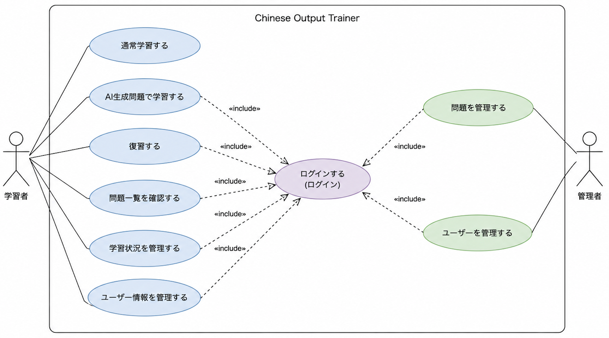

# ユースケース図

## 概要

本システムでは、学習者が以下の機能を利用できる。

- 通常学習する
- AI生成問題で学習する
- 復習する
- 問題一覧を確認する
- 学習状況を管理する
- ユーザー情報を管理する

また、管理者は以下の機能を利用できる。

- 問題を管理する
- ユーザーを管理する

## ログイン要件

以下の機能はログインユーザーのみ利用可能とする。

- AI生成問題で学習する
- 復習する
- 問題一覧を確認する
- 学習状況を管理する
- ユーザー情報を管理する

管理者向け機能についても、管理者権限を持つユーザーとしてのログインを必須とする。

通常学習はログインせずに利用できる。

## 補足

- 「通常学習する」には、順番に出題する、ランダムに出題する、難易度を指定して出題するなどの学習方法を含む。
- 「AI生成問題で学習する」は、マスタ問題とテンプレートを基にAIが生成した問題を使用して学習する機能を表す。
- 「復習する」は、過去の学習履歴や理解度などを基に問題を再出題する機能を表す。
- 「問題一覧を確認する」は、登録されている問題を一覧で確認する機能を表す。
- 「学習状況を管理する」には、問題ごとの理解度確認・変更、お気に入り登録・解除などを含む。
- 「ユーザー情報を管理する」には、ユーザーIDやパスワードなどのアカウント情報の変更を含む。
- 「問題を管理する」には、管理者による問題の確認、追加、編集、削除、およびAI生成に必要なテンプレート・生成制御情報の管理を含む。
- 「ユーザーを管理する」には、管理者によるユーザー情報の確認・管理を含む。
- 普通話／台湾華語の選択は、各ユースケースを利用する前提となる学習モードの選択として扱い、ユースケース図には含めない。